# 4. Consultas JPA 01:05:58

* 09 Consultas. El lenguaje JPQL 06:21
* 10 JPA en aplicaciones Web 06:26
* 11 Ejercicio práctico I Parte 1 19:04
* 12 Ejercicio práctico I Parte 2 10:01
* 13 Consultas parametrizadas 03:00
* 14 Consultas nominadas 02:28
* 15 Ejercicio práctico II 13:06
* 16 Consultas de acción 04:38
* Autoevaluacion III 00:54

# 09 Consultas. El lenguaje JPQL 06:21

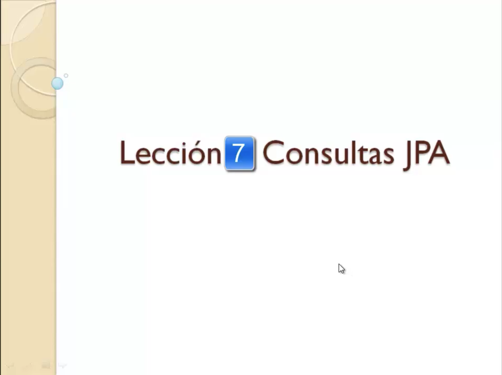

Bueno después de haber visto las operaciones básicas contra la capa de persistencia a través de EntityManager es el momento de ver cómo realizar operaciones más complejas a través de las consultas JPA.

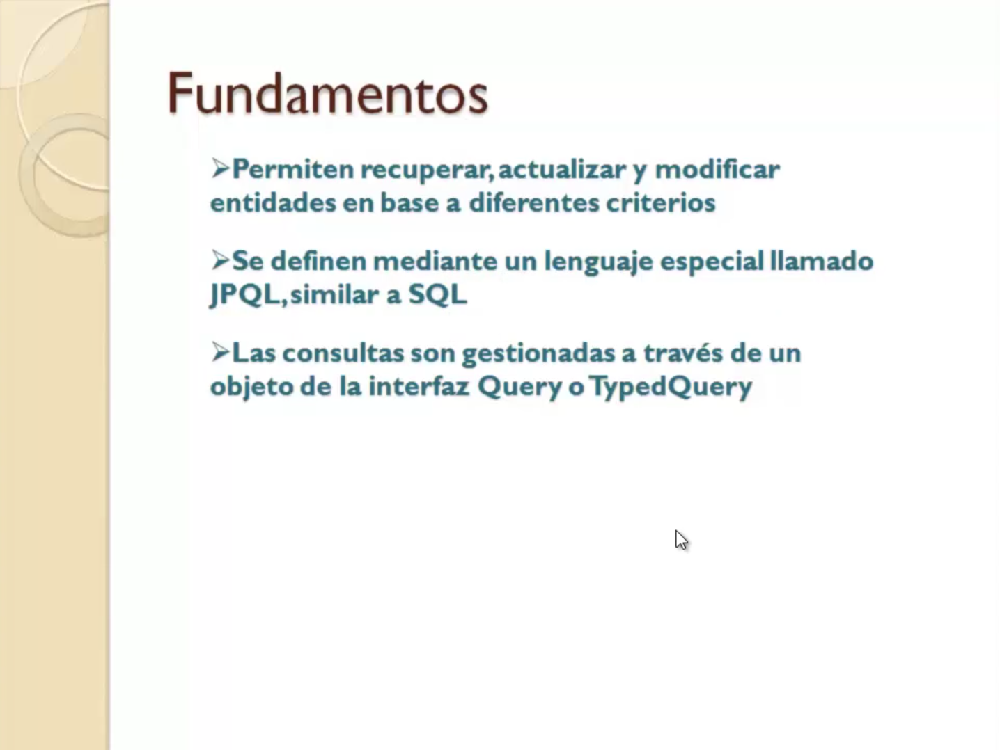

Las consultas JPA nos van a permitir recuperar, actualizar, modificar grupos de entidades en base a diferentes criterios que no sean siempre la PRIMARY KEY como los métodos básicos que vimos en la lección anterior, para poder ejecutar una consulta JPA hay que definir a través de un lenguaje especial llamado JPQL Java Persisten Query Language, que es muy similar a SQL pero adaptado a la manipulación de entidades en lugar de filas y columnas de tablas de bases de datos.

Estas consultas JPQL, estas instrucciones JPQL, las vamos a poder gestionar a través de los objetos `Query` o `TypedQuery` y del API JPA.


Vamos a ver primero algunos fundamentos de JPQL. Como hemos dicho es una adaptación del SQL para tratar con entidades. Aquí vemos el formato de una instrucción Select que como ves se parece mucho al SQL normal.

`Select alias From Entidad alias Where condicion`

Select a continuación se indicaría un alias asociado a la entidad, From el nombre de la entidad y el alias que le hemos asociado, Where la condición, la condición emplea los mismos operadores que utilizaríamos en SQL. Es más también las cláusulas `Order By` y `Group by` también se podrían aplicar en la `Select`.

Vamos a ver aquí algún ejemplo.

```sql
Select c From Contacto c
Select e From empleado e Where e.dni="555K"
```

En este caso se trata de una Select que nos permite recuperar todas las entidades de tipo Contacto como ves `Select c` que sería el alias que le hemos asociado a la entidad `From Contacto c` que es el nombre de la entidad y el alias asociado, al no haber clausula `Where` recuperaría todas las entidades Contacto.

En el segundo caso se trata de recuperar todas las entidades de tipo Empleado que cumplen una determinada condición que es que el atributo DNI es igual a cierto valor, como ves en la cláusula `Where` la condición se aplica a partir de los atributos de la entidad, es decir alias de la entidad punto nombre atributo igual mayor, los mismos operadores como decía que se utilizan en la cláusula `Where` de SQL. 

Bien estas son consultas muy sencillas, ya veremos cuando tengamos entidades relacionadas como también incluso se pueden hacer hasta JOINS, pero bueno eso será elecciones posteriores. Esto en cuanto a JPQL.


Cómo lanzamos esa instrucción desde la lógica de negocio de nuestra aplicación hacia la capa de persistencia. Como decíamos a través del *Objeto Query*, un Objeto Query es simplemente una implementación de la interfaz `javax.persistence.Query`.

Y cómo obtenemos ese Objeto Query, bueno pues dada la instrucción JPQL por ejemplo esta

```java
String jpql = Select c From Contacto c";
Query qr=em.createQuery(jpql);
```

para poder crear un Objeto Query que tenga asociada dicha instrucción utilizaríamos el método `createQuery(jpql)` del `EntityManager` siempre como ves el `EntityManager` es el elemento central de JPA a través del método `createQuery(jpql)` le pasamos la cadena `jpql` y no devolverá un Objeto Query listo para poder ejecutar la instrucción JPQL.


La ejecución de esa instrucción la vamos a realizar a través de los métodos que nos proporciona dicha interfaz Query. Entre los principales métodos destacamos estos tres:

* `List getResultList()` 
* `Object getSingleResult()`
* `void executeUpdate()`


`List getResultList()` en el caso de una `Select` lógicamente nos va a devolver una lista de resultados en forma de `List` de objetos Entidad. 

```java
String jpql = "Select c From Contacto c";
Query qr = em.createQuery(jpql);
//casting al tipo de colección especifica
List<Contacto> contacts = (List<Contacto>)qr.getResultList();
```

Entonces si nosotros lanzamos esta `Select` esta `jpql` hacia la capa de persistencia con el Objeto Query llamando al método `getResultList()`, nos va a dar un Objeto `List` con todos los objetos que cumplen dicha condición en este caso serían todos los contactos, como enviarles un `List` lo devuelven en forma de Object hay que hacer un casting al tipo específico de objetos que esperamos, un casting a una colección de tipo `List` de objetos Contacto.

Si la consulta solamente va a devolver un objeto pues entonces llamaríamos al método `getSingleResult()`, no necesitaríamos llamar al `getResultList()`, `getSingleResult()` nos da un único objeto el único que cumple la condición, eso sí, sí por lo que sea la condición devolviera mas de una entidad, la llamada a este método provocaría una excepción. Este método sólo vamos a utilizarlo cuando estemos seguros de que la `Select` por la condición que le hemos indicado solamente va a devolver un resultado. Como ves también lo devuelve como tipo Object por lo que habría que hacer un casting al tipo de entidad que estamos esperando.

En el caso de instruciones JPQL que ya las veremos en lecciones posteriores que no sean de tipo `Select` sino de actualización masiva o eliminación masiva de entidades utilizaríamos el método `executeUpdate()`, ya lo veremos en lecciones posteriores.

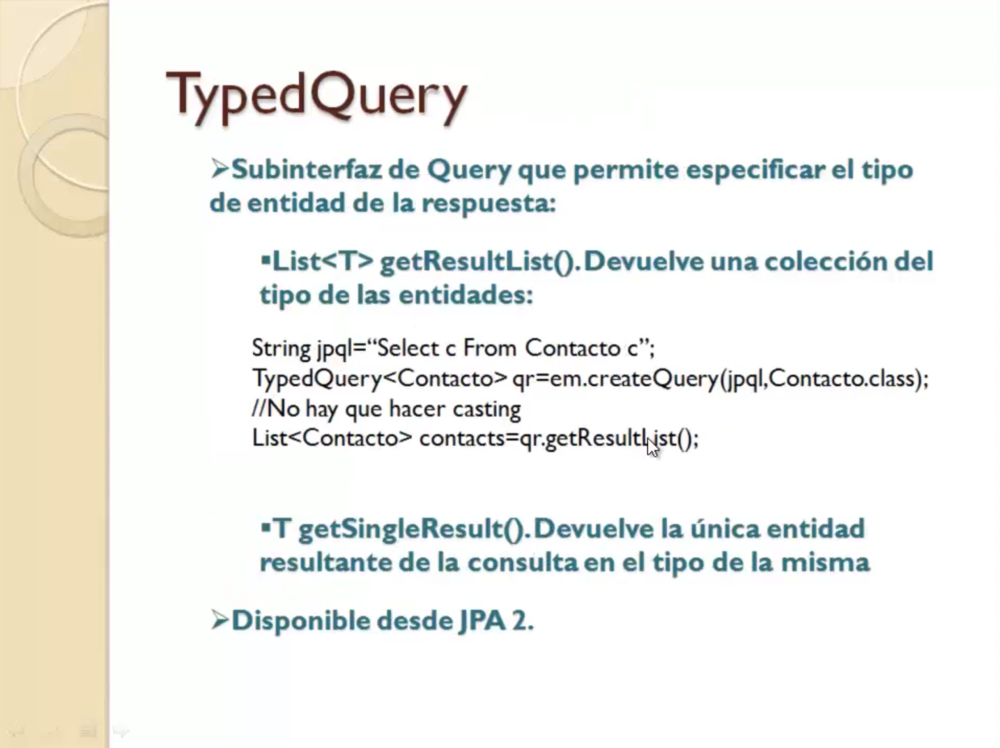

Tenemos también otra interfaz llamada `TypedQuery` que es una SubInterfaz de Query disponible desde JPA 2, no estaba en las primeras versiones de JPA, que proporsiona los mismos métodos del Quey, es una interfaz pero adaptados digamos para el tipo específico de objetos que esperamos.

Por ejemplo `List<T> getResultList()` ya nos devolvería un `List` del tipo del que hemos creado la consulta.

```java
String jpql = "Select c From Contacto c";
TypedQuery<Contacto> qr = em.createQuery(jpql, Contacto.class);
//No hay que hacer casting
List<Contacto> contacts = qr.getResultList();
```

Partimos también de la JPQL, a la hora de crear un Objeto Query, `TypedQuery` sería el mismo método `createQuery` del `EntityManager` pero como ves es un método que aparece sobrecargado en este caso porque además de la JPQL le debemos indicar el tipo de entidad que queremos recuperar. Entonces esto ya nos devolvería un `TypedQuery` del tipo Contacto que es el tipo que le hemos indicado en `em.createQuery(jpql, Contacto.class)`, como un objeto class. Eso qué significa que a la hora por ejemplo de aplicar el `getResultList()` para obtener los resultados no habría que hacer ningún tipo de casting sino que directamente ya nos devolvería la colección del tipo que se le indica.

En `T getSingleResult()` es exactamente lo mismo devolvería una única entidad, pero ya sería del tipo que le hemos indicado a la hora de crear el `TypedQuery`.

Muy bien pues en la siguiente elección vamos a ver un ejercicio práctico, además va a ser una aplicación web, donde vamos a aplicar todas las consultas JPQL a través de `Query` y `TypedQuery`.

### Materrial Adicional - Paginación de consultas

Las interfaces `Query` y `TypedQuery` proporcionan una serie de métodos que permiten paginar los resultados de una consulta, a fin de poder tratarlos por bloques en lugar de todos a la vez.

Estos métodos son los siguientes:

* `Query setFirstResult(int pos)`. Establece la posición del primer objeto a devolver del conjunto. La posición del primer del primer objeto del conjunto es 0.

* `Query setMaxResult(int max)`. Establece el máximo número de resultados a devolver por la consulta.

Los métodos anteriores se deben establecer sobre el objeto `Query` o `TypedQuery` antes de llamar a `getResultList()`, pues la llamada a este método se verá condicionada por los valores establecidos en dichos métodos. De hecho, vemos que ambos métodos devuelven un nuevo objeto Query configurado para obtener los resultados según el valor establecido en la llamada al método.

Por ejemplo, si tam es una variable que contiene el tamaño de página y q es la variable que apunta al objeto Query, el siguiente método nos devolvería el conjunto de entidades Producto de la página indicada como parámetro:

```java
public List<Producto> obtenerProductosPorPagina(int pag){ 
   //calculamos el total de páginas
   double totalEntidades=q.getResultList().size();
   int paginas=(int)Math.ceil(totalEntidades/tam);

   //si el número de página es superior a las existentes, devolvemos nulo     
   if(pag>paginas){
      return null; 
   }else{
      return q.setFirstResult((pag-1)*tam).setMaxResult(tam).getResultList();
   } 
}
```

Vamos a comentar un poco las instrucciones anteriores. En primer lugar, tenemos la línea: 

`double totalEntidades=q.getResultList().size();`

Lo que hacemos en esta instrucción es calcular el número total de entidades que devolvería la consulta asociada al objeto query que vamos a paginar. Lo almacenamos en una variable de tipo `double` porque después vamos a realizar una división con ella, y nos interesa la parte decimal.

Seguidamente, tenemos la instrucción:

`int paginas=(int)Math.ceil(totalEntidades/tam);`

Lo que hacemos primeramente es calcular el número de páginas, para lo que dividimos el total de entidades por el tamaño de página. Si el resultado no es entero, por ejemplo, 3.2 o 3.7, el total de páginas será uno más que el valor entero de la división (en los ejemplos anteriores, sería 4), de ahí que apliquemos el método `ceil`, que nos da el entero superior más cercano a la división. Si el resultado de la división fuera 2.0, la llamada a `ceil` retornaría también 2.0, no habría que sumar uno al valor entero de la división porque directamente habría dos páginas.

Finalmente, comprobamos si la página solicitada es superior a las existentes, porque en ese caso no hay que devolver ningún resultado. Si la página solicitada está dentro de las existentes, tenemos la instrucción:

`return q.setFirstResult((pag-1)*tam).setMaxResult(tam).getResultList();`

La llamada a `setFirstResult` devuelve un objeto Query, de ahí que al resultado le apliquemos directamente `setMaxResult` que devuelve el objeto Query final configurado con la posición del primer resultado y el máximo de resultados a obtener. A este objeto Query final es al que le aplicamos el `getResultList()`.

# 10 JPA en aplicaciones Web 06:26

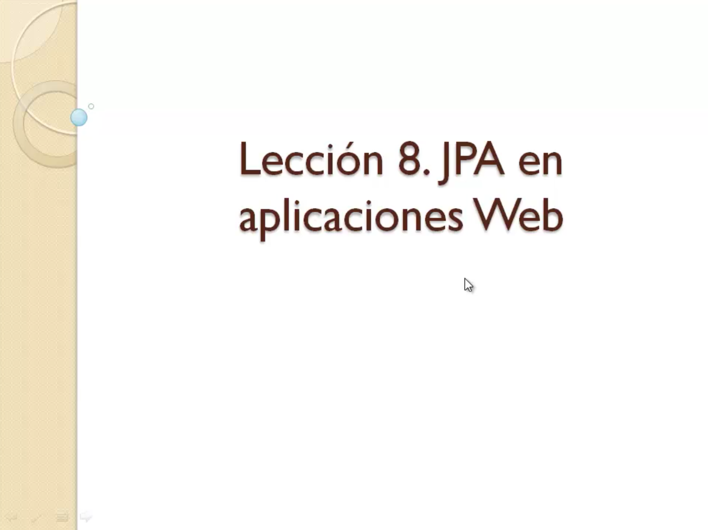

JPA puede utilizarse en cualquier aplicación Java aunque normalmente vamos a ver su uso casi siempre centrado en el contexto del desarrollo de aplicaciones Web. 

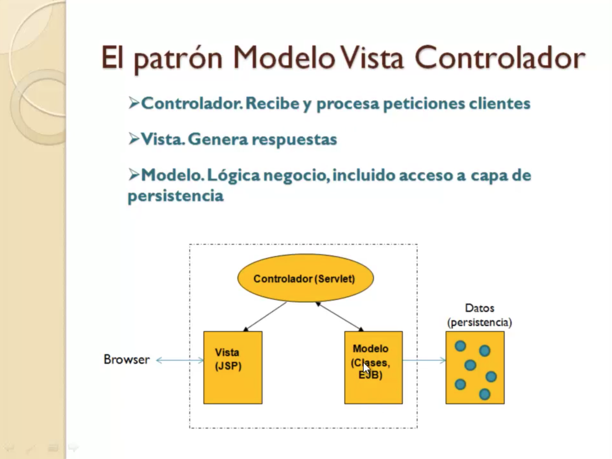

En una aplicación web que sigue el patrón Modelo Vista Controlador, lo que es la Lógica de Negocio que es donde se realiza el acceso a los datos es encapsulado dentro de Clases o Enterprise Java Beans EJB en lo que se conoce como el *Modelo*. El Modelo que es utilizado desde el Controlador, punto central que recibe todas las peticiones del Cliente y que controla las Vistas que sirven para generar las respuestas y el Modelo que es el que le va a proporcionar toda la lógicas de negocio a dicha aplicación. Esto significa que será en la capa *Modelo* donde vamos a utilizar ese API JPA para acceder a nuestra capa de persistencia que es la que nos va a exponer los datos.

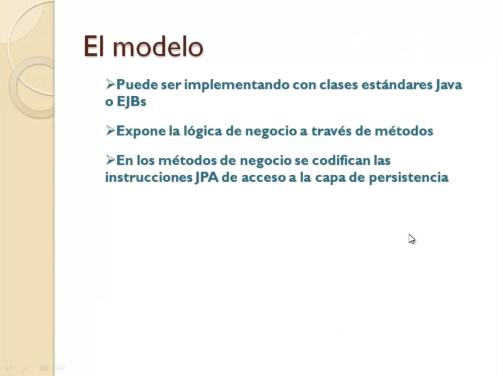

El Modelo como decíamos puede ser implementado con clases estándares Java o bien EJB que ya lo veremos en una lección posterior, dentro de sus métodos sean clases estándares Java o EJB es donde vamos a codificar las instrucciones JPA para acceso a la capa de persistencia.


Las aplicaciones web se ejecutan no sólo dentro de la máquina virtual Java sino que requieren de un software adicional conocido como servidor de aplicaciones que es el que gestiona el ciclo de vida de esas aplicaciones Web. Las aplicaciones Web tienen como elementos fundamentales los Servlets y JSPs que se ejecutan sobre un contenedor, llamado Contenedor Web que forma parte de ese servidor de aplicaciones Java EE.

Aunque nuestra lógica de negocio esté en clases estándar en Java sí va a formar parte de una aplicación Web tenemos que disponer de ese Servidor de Aplicaciones para que la aplicación entera pueda funcionar.

Entonces antes de ver el ejercicio que vamos a presentar a continuación de utilización de JPA con las consultas Query y TypeQuery que comentamos en la lección anterior, vamos a ver cómo configurar nuestro Eclipse para poder utilizar un servidor de aplicaciones. Aquí te presentamos algunos de los más utilizados en el desarrollo aplicaciones Web y quizá el más sencillo y es con el que vamos a trabajar ahora es Apache Tomcat.

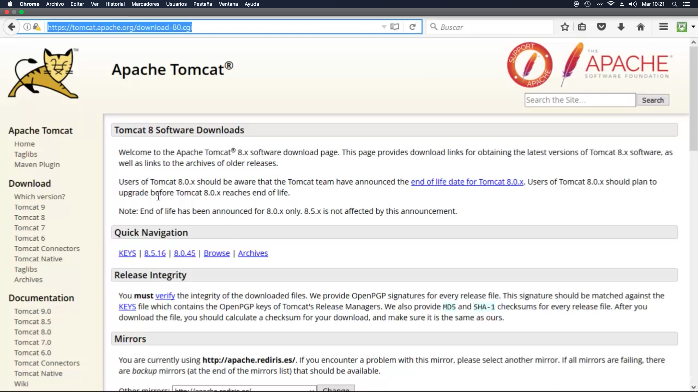

Apache Tomcat lo podemos descargar gratuitamente desde la dirección http://www.apache.org/. La versión 8 es la más utilizada y como digo en esta dirección tienes una sección de descargas donde puedes descargar para 32 bits 64 bit se puede descargar el modo ejecutable o modo Zip simplemente descomprimirlo y ya está, el proceso de instalación es muy sencillo, muy básico y una vez que ya lo tengamos instalado descomprimido, instalado, dependiendo de si hemos elegido un exe o un punto zip en una carpeta de nuestro disco lo tenemos que integrar dentro de Eclipse para que luego cuando hagamos una aplicación Web podamos usar ese servidor de aplicaciones para probarlo.

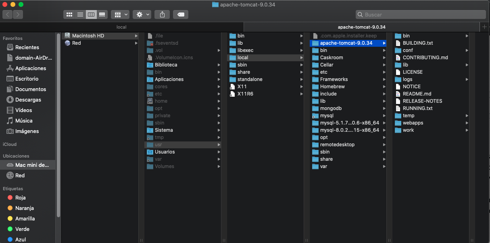

Bien pues aquí tenemos el Eclipse que tendremos que hacer en él para poder integrar ese servidor de aplicaciones Tomcat que acabamos de descargar.

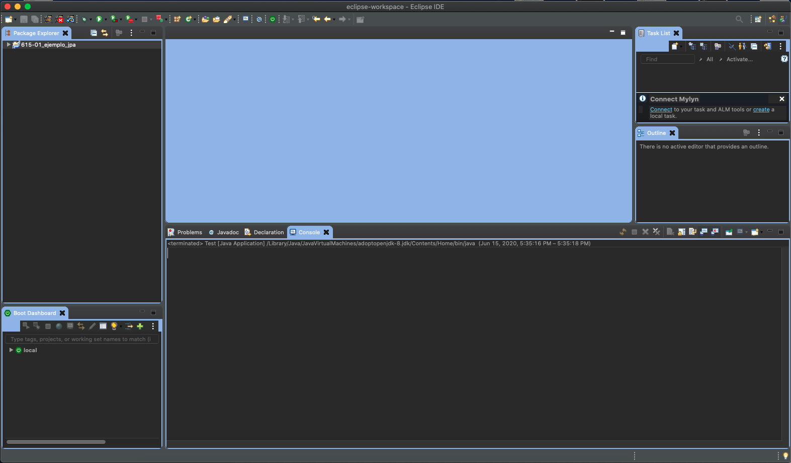

Lo primero nos vamos a ir a las Preferences de Eclipse exactamente a Server - Runtime Enviroment


En Runtime Enviroment es donde deberíamos tener registrados los servidores de aplicaciones que queremos utilizar para construir aplicaciones dentro de este Workspace actual en el que estamos, como vemos no tenemos ninguno, vamos a registrar a través del botón `Add` el servidor de aplicaciones Tomcat que lo vamos a encontrar dentro de la lista de tipos de posibles servidores admitidos por Eclipse.

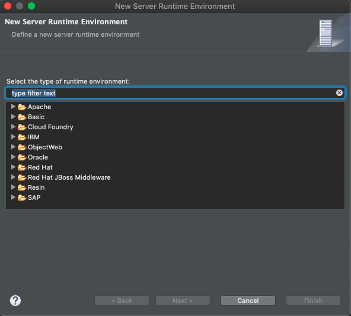

Como ves es posible que a lo mejor en tu versión de Eclipse tengas menos que yo porque me he descargado algún plugin adicional para poder disponer de otros servidores aparte de Apache como por ejemplo Glassfish que también lo veremos en una lección posterior cuando queramos utilizar EJB.

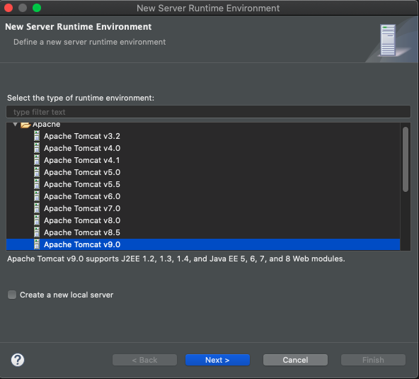

Pero bueno en el caso concreto de Tomcat la categoría Apache viene por defecto ya en la versión de Eclipse Java EE Marte, desplegamos Apache y aquí vemos Apache Tomcat. 


Elegimos la opción siguiente y ahora se nos pide el directorio de instalación.

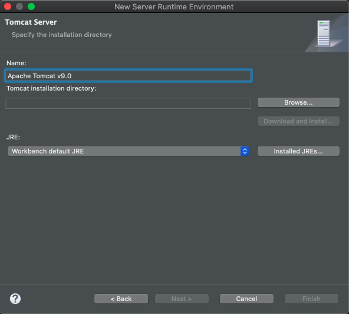

A través del botón Browse tendrías que ir a la carpeta donde has descomprimido Tomcat concretamente a la carpeta que se llamará Apache Tomcat y la versión que hayas descargado.

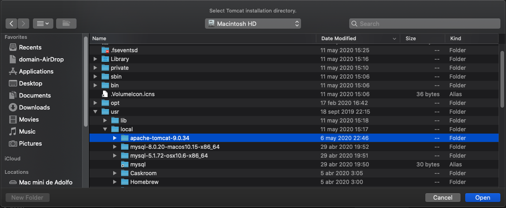

Esa es la carpeta raíz de Tomcat que hay indicar en ésta indicar en esta opción. 

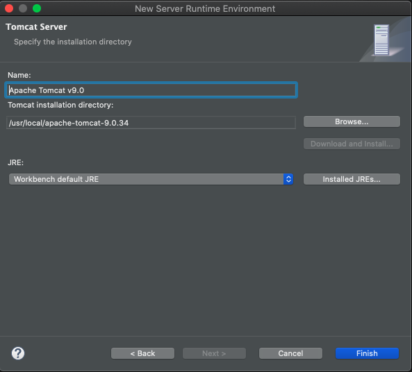

Bueno pues una vez que ya lo tengamos fijados directamente finalizamos 

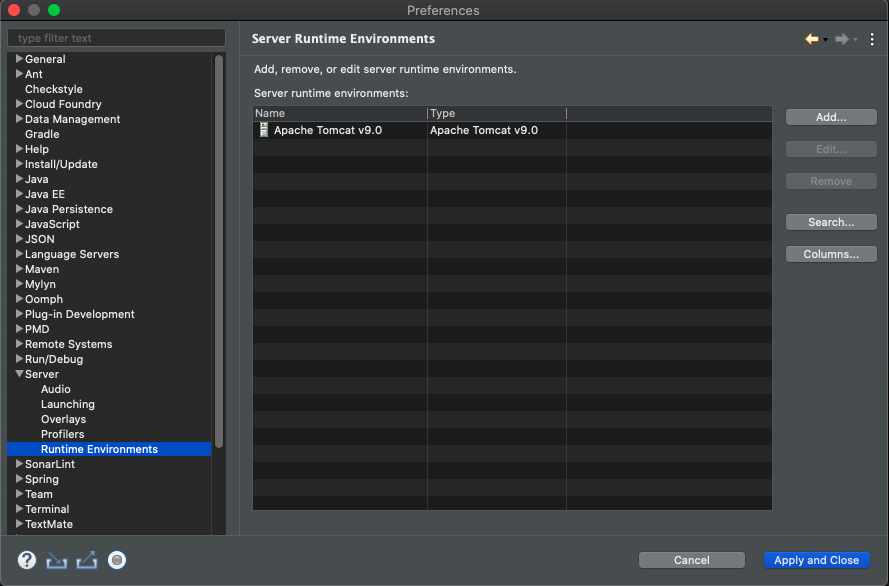

y ya lo tenemos disponible para poderlo utilizar en todas las aplicaciones web que hagamos dentro de este workspace.

Pero para ello nos vamos a cambiar de perspectiva, si vamos a desarrollar aplicaciones web ya no vamos a estar en la perspectiva Java sino bien en la perspectiva Java EE o en la perspectiva Web cualquiera de las dos es igualmente válida cualquiera de JavaEE o Web.

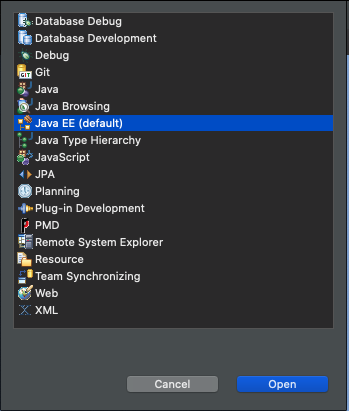

Una vez en esa perspectiva se habilitará esta pestaña servidores y si no siempre podemos hacer que se nos muestre por aquí a través de Windows

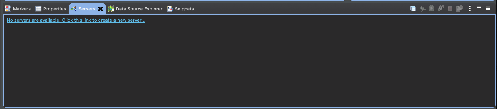

Bien está la pestaña servidores y aquí tenemos que registrar el servidor de los que tendremos en la lista de ruta y en environments, en nuestro caso sólo tenemos uno el Tomcat, pero tenemos que tenerlo registrado aquí para que Eclipse pueda utilizarlo de cara a probar las aplicaciones, entonces pulsamos sobre el enlace 
 
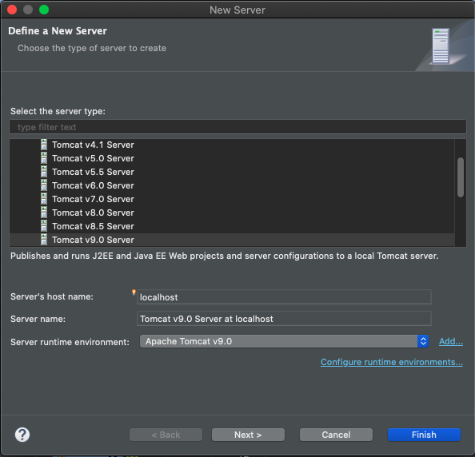
 
y lo mismo volvemos a elegir en la sección del tipo de servidor Apache Tomcat 9 y ahora ya directamente te aparece que se observe Runtime Environment registrado.

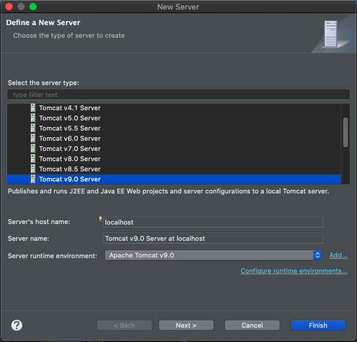

Si tuviéramos varios podríamos elegir, pero sólo tenemos uno con el que nos vamos a quedar directamente finalizamos y ya tenemos el servidor registrado.

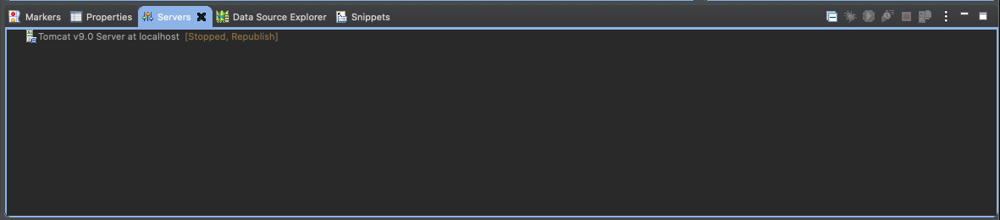

Ahora mismo está en estado parado pero bueno ya se encargará el propio Eclipse cuando vemos aprobar una aplicación arrancarlo y publicar sobre las aplicaciones. Eso lo vamos a ver en la siguiente elección en el ejercicio que vamos a desarrollar que es una aplicación web donde vamos a utilizar JPA para acceder a la capa de persistencia utilizando en este caso las consultas y demás.

# 11 Ejercicio práctico I Parte 1 19:04


Seguidamente vamos a desarrollar una aplicación web en la que vamos a poner en práctica el uso de Query y también de los métodos básicos de EntityManager.

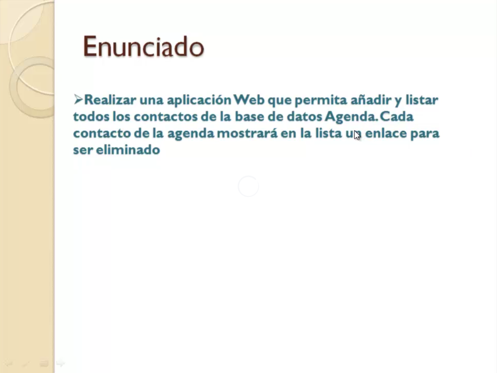

En este ejercicio va a consistir como decía en una aplicación Web que nos va a permitir a los usuarios añadir y listar todos los contactos de la base de datos agenda con la que hemos estado trabajando en los ejemplos vistos hasta el momento.

Cuando se listen los contactos cada uno mostrará un enlace que permitirá al ser pulsado que se elimine dicho contacto.

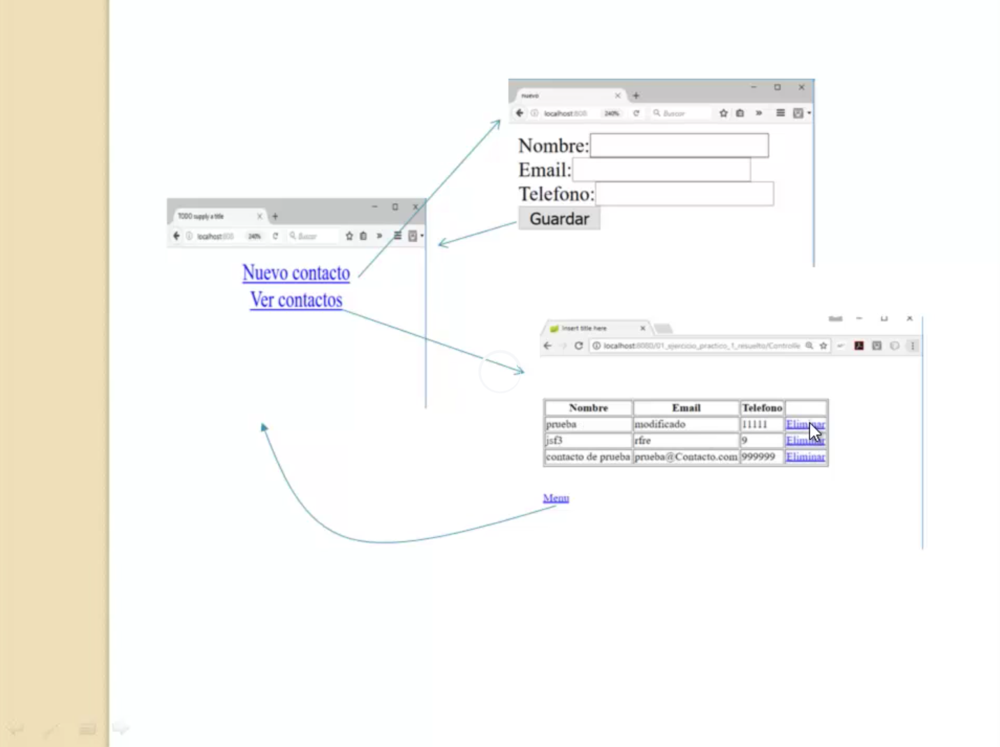

El esquema de la página de la aplicación será el que se muestra en esta imagen. Como vemos habra una Página Inicial que mostrará los enlaces para las dos opciones que comentábamos. Nuevo Contacto nos llevaría a la página donde se piden los datos del Contacto, al guardarlo se volvería a la Página Inicial y Ver Contactos, es la lista de contactos con todos sus datos nombre, email y teléfono y un enlace para Eliminar que permitiría eliminar el contacto en concreto y regresar a la propia página. Desde el enlace Menú volveríamos otra vez a la Página Inicial.

Para abordar el desarrollo de esta aplicación vamos a aplicar el patrón Modelo Vista Controlador dentro de lo que sería la construcción de una aplicación Web.

Cómo empezamos, bueno pues lo primero vamos a crear el proyecto File - New y en este caso utilizaremos la opción Dynamic Web Project puesto que se trata de una aplicación Web.

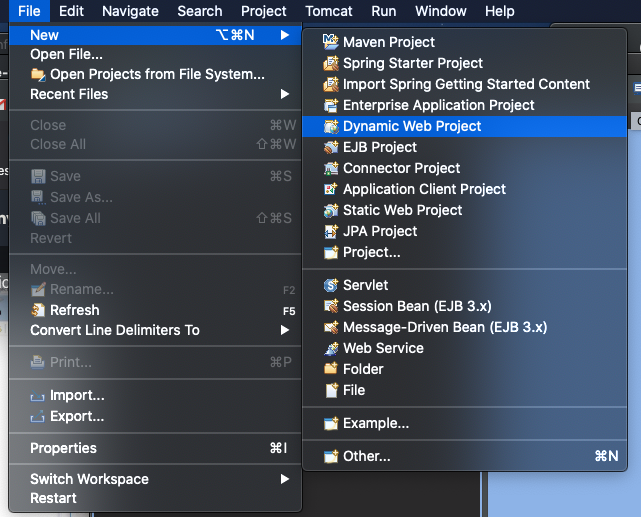

Vamos a nombrarlo como `615-02_web_jpa`, como vemos aquí ya aparece Apache Tomcat como servidor en el que vamos a probar nuestra aplicación, ya que lo registramos en la lección anterior.

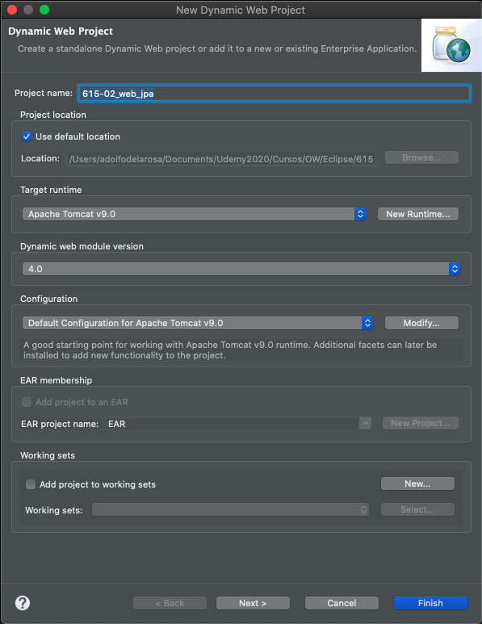

Pues nada directamente aquí ya podemos finalizar, esta sería la estructura de la aplicación Web.

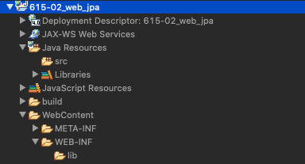

Le vamos a aplicar el patrón Modelo Vista Controlador. El Modelo será la parte que encapsule toda la lógica de negocio de acceso, en este caso la capa de persistencia, que ofrecerá a la Capa de Controlador los métodos para realizar las opciones, las funciones de eliminar un Contacto a partir de su identificador, recuperar todos los contactos y también añadir contacto.

La parte que realmente nos interesa, la Capa de Lógica de Negocio, puesto que la Capa Web que la conforma el Controlador y la Vista que se implementa con Servlets y páginas JSP no forma parte del estudio de este curso, pero también lo presentaré para que veas como queda en general el conjunto.

Lo primero ya hemos creado la aplicación Web pues vamos a crear la Capa de Persistencia, para ello vamos a seguir exactamente los mismos pasos que seguimos con el ejercicio uno de JPA, es decir vamos a irnos a las propiedades del proyecto 

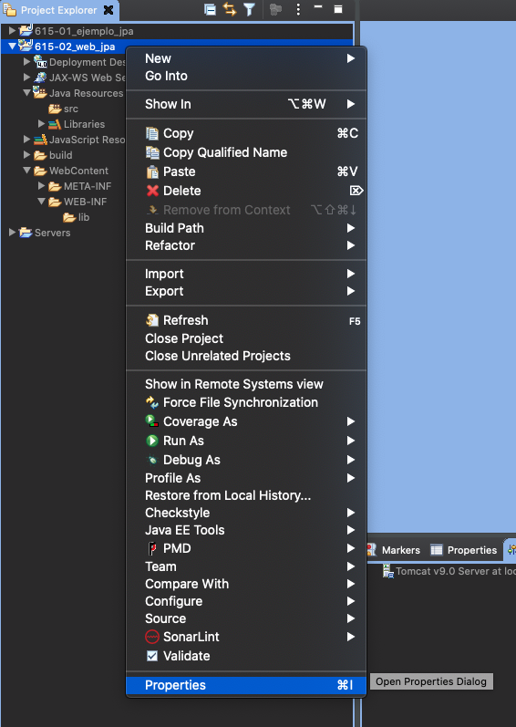

y vamos a habilitar a través de Project Faces 

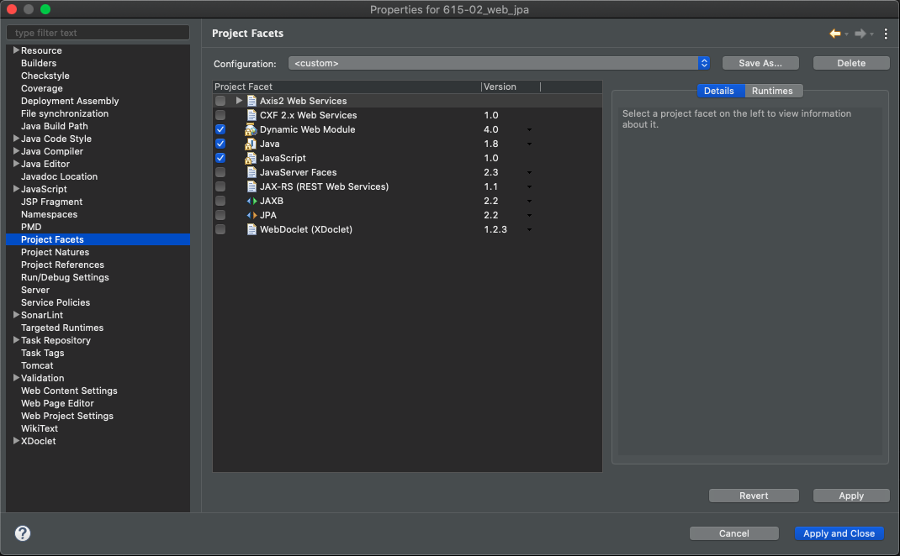

la opción Java JPA Java persistan 

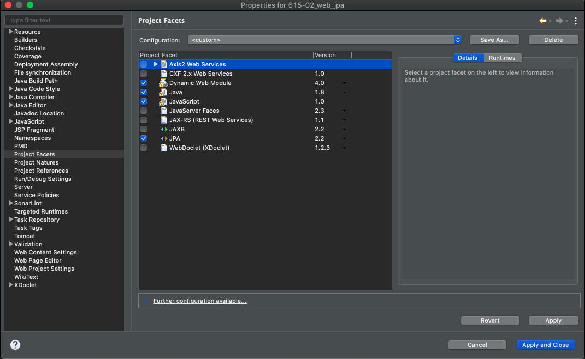

si no vamos a `Further configuration available...`

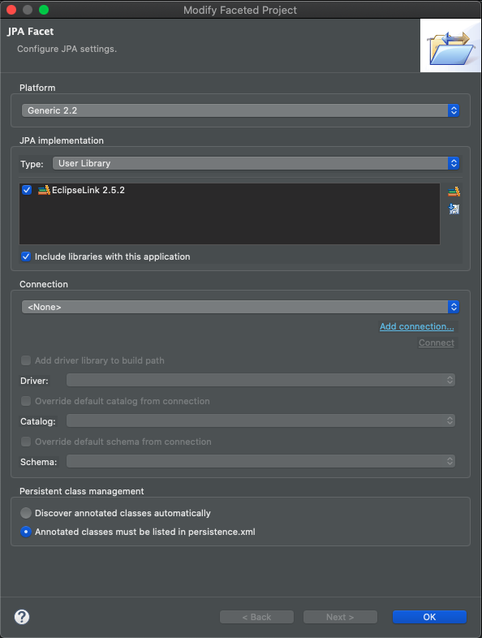

ya se nos presenta una configuración disponible, esto de descargar el EclipseLink sin indicarlo como implementación JPA ya nos viene por defecto porque ya lo hicimos en el ejercicio anterior. Una vez que ya se descargó y lo asociamos a las propiedades de JPA pues eso queda ya predefinido para todos los proyectos donde añadamos esta característica, así que aquí ya no hay que tocar nada más, solo pulsar OK.

Al hacer esto se va a crear el `persistence.xml` vacío claro. 

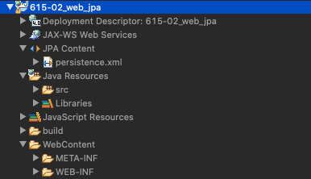

Y se habilitarán algunas de las opciones para poder generar las entidades desde la base de datos que es lo que vamos a hacer ahora. Este paso ya lo hicimos con JPA Tools - Generate Entities from Tables ... , ya lo hicimos en el ejercicio anterior.

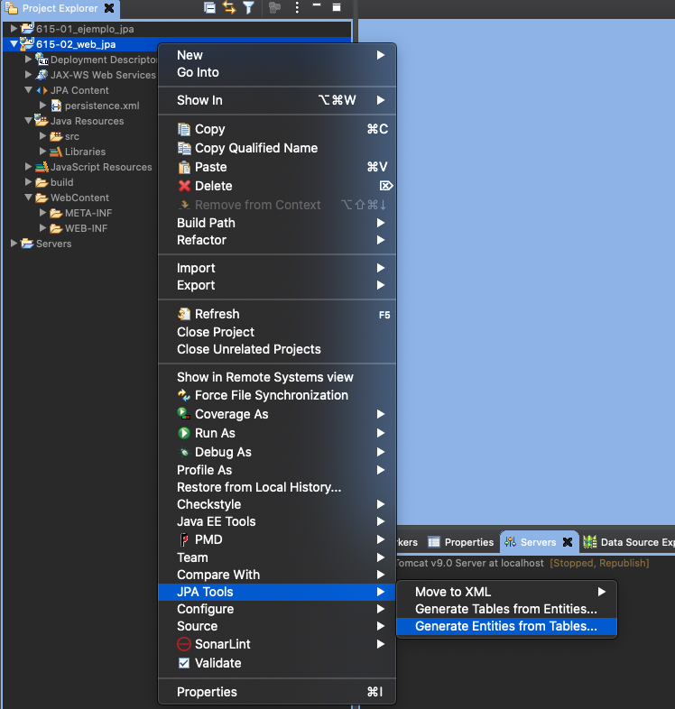

Entonces la conexión la tenemos que tener ya hecha, cogemos la conexión que ya habíamos creado en la lección pasada `msql_prueba`, al seleccionarla aparecen ya las tabla, vamos a seleccionar la tabla Contacto que es con la que trabajaremos por el momento.


En el siguiente paso, asociaciones nada.


En el siguiente paso en Key generator le tenemos que decir que el campo Primary Key, en nuestro caso se genera mediante una identity, es decir es autonumerico, el paquete donde vamos a meter o queremos que se genere nuestra clase se llamara `entidades` en lugar de `model`.

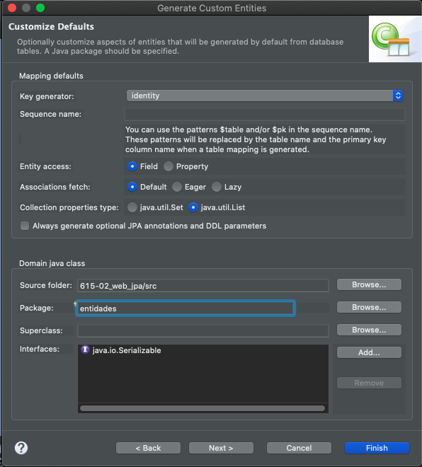

En el siguiente paso, es el resumen de la clase Contacto y Primary Key se genera con identidad 

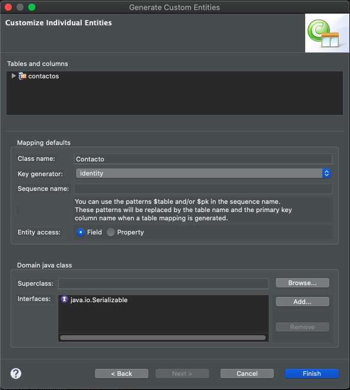

y finalizamos.


y aquí tendremos ahora nuestra clase Contacto dentro del paquete entidades, la misma entidad que utilizamos en el ejercicio de ejemplo JPA.

```java
package entidades;

import java.io.Serializable;
import javax.persistence.*;


/**
 * The persistent class for the contactos database table.
 * 
 */
@Entity
@Table(name="contactos")
@NamedQuery(name="Contacto.findAll", query="SELECT c FROM Contacto c")
public class Contacto implements Serializable {
	private static final long serialVersionUID = 1L;

	@Id
	@GeneratedValue(strategy=GenerationType.IDENTITY)
	private int idContacto;

	private String email;

	private String nombre;

	private int telefono;

	public Contacto() {
	}

	public int getIdContacto() {
		return this.idContacto;
	}

	public void setIdContacto(int idContacto) {
		this.idContacto = idContacto;
	}

	public String getEmail() {
		return this.email;
	}

	public void setEmail(String email) {
		this.email = email;
	}

	public String getNombre() {
		return this.nombre;
	}

	public void setNombre(String nombre) {
		this.nombre = nombre;
	}

	public int getTelefono() {
		return this.telefono;
	}

	public void setTelefono(int telefono) {
		this.telefono = telefono;
	}

}
```

En `persistent.xml` vemos como ya se ha registrado automáticamente la clase.

```html
<?xml version="1.0" encoding="UTF-8"?>
<persistence version="2.2" xmlns="http://xmlns.jcp.org/xml/ns/persistence" xmlns:xsi="http://www.w3.org/2001/XMLSchema-instance" xsi:schemaLocation="http://xmlns.jcp.org/xml/ns/persistence http://xmlns.jcp.org/xml/ns/persistence/persistence_2_2.xsd">
	<persistence-unit name="615-02_web_jpa">
		<class>entidades.Contacto</class>
	</persistence-unit>
</persistence>
```

Como vamos a utilizar también el mismo proveedor EclipseLink no hace falta ni siquiera que lo registremos a través del elemento Provider dentro de la Unidad de persistencia.

Lo que sí que vamos a hacer es que vamos a abrir `persistent.xml`, el cual fisicamente se queda almacenado dentro de la carpeta META-INF donde se encuentran todas las clases y forma parte del lugar donde se encuentran todas las clases de Java pero siempre de la subcarpeta META-INF ahí es donde está físicamente, entonces aquí con el botón derecho le decimos que lo queremos abrir con el persiste XML editor y en la sección de Conexiones vamos a indicar Resource Local para que se habilite la opción `Populate from connection...` y nos permite rellenar los datos de conexión a la base de datos para el proveedor.

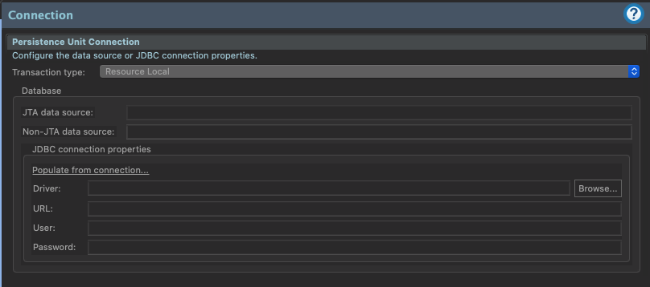

A partir de los datos de conexión de esta conexión hemos creado `msql_prueba` 

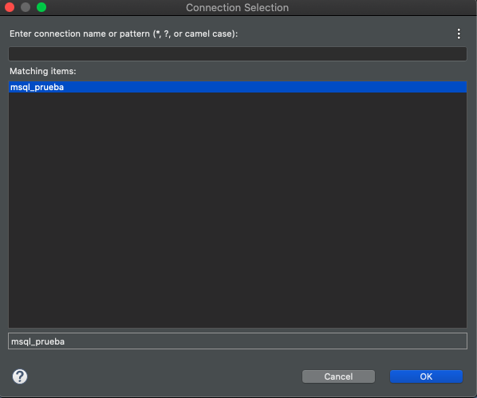

Al seleccionarla aparecen todos los datos de conexión.

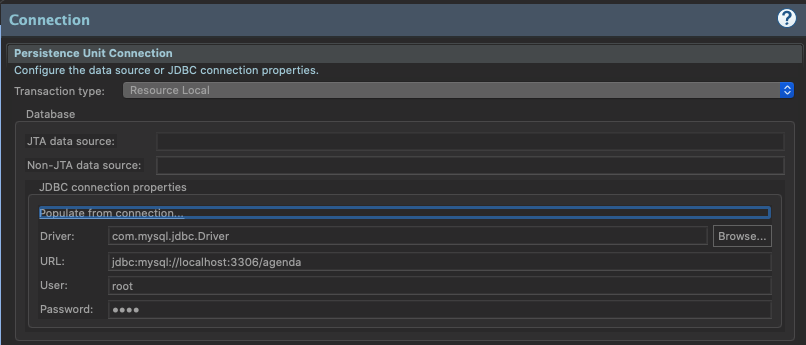

*`persistence.xml`*

```html
<?xml version="1.0" encoding="UTF-8"?>
<persistence version="2.2" xmlns="http://xmlns.jcp.org/xml/ns/persistence" xmlns:xsi="http://www.w3.org/2001/XMLSchema-instance" xsi:schemaLocation="http://xmlns.jcp.org/xml/ns/persistence http://xmlns.jcp.org/xml/ns/persistence/persistence_2_2.xsd">
	<persistence-unit name="615-02_web_jpa" transaction-type="RESOURCE_LOCAL">
		<class>entidades.Contacto</class>
		<properties>
			<property name="javax.persistence.jdbc.url" value="jdbc:mysql://localhost:3306/agenda"/>
			<property name="javax.persistence.jdbc.user" value="root"/>
			<property name="javax.persistence.jdbc.password" value="root"/>
			<property name="javax.persistence.jdbc.driver" value="com.mysql.jdbc.Driver"/>
		</properties>
	</persistence-unit>
</persistence>
```

Bien ya tenemos la Capa de Persistencia, ahora se trataría de crear la Lógica de Negocio con todo lo que son los métodos de acceso a la Capa de Persistencia, que van a ofrecer a las otras capas, al Controlador y a la Vista, las funcionalidades necesarias para el ejercicio, que van a ser dar de alta la entidad, eliminar una entidad a partir de el identificador de dicha entidad y recuperar todas las entidades eso lo vamos a tener que implementar mediante una Query.

Vamos a crear la clase `GestionContactos` donde vamos a encapsular toda esa funcionalidad dentro de un paquete `modelo`.

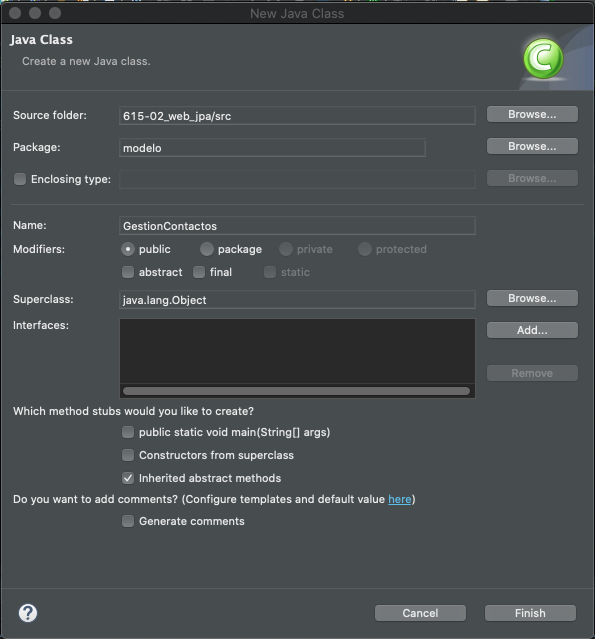

El código de esta clase.

```java
package modelo;

public class GestionContactos {

}
```

Antes de códificar esta clase vamos a hacer a añadir algunas cosas en la clase `Contacto`, ya que el asistente de Eclipse por defecto no nos genera un constructor con parámetros y para la gestión de los contactos lo necesitaremos, por lo que en Contacto vamos a añadir los siguientes dos constructores usando los asistentes de Eclipse:

```java
public Contacto(String email, String nombre, int telefono) {
   super();
   this.email = email;
   this.nombre = nombre;
   this.telefono = telefono;
}

public Contacto(int idContacto, String email, String nombre, int telefono) {
   super();
   this.idContacto = idContacto;
   this.email = email;
   this.nombre = nombre;
   this.telefono = telefono;
}
```

Ahora volviendo a la clase `GestionContactos` vamos a colocar el código final de la clase y lo explicamos.

*`GestionContactos`*

```java
package modelo;

import java.util.List;

import javax.persistence.EntityManager;
import javax.persistence.EntityManagerFactory;
import javax.persistence.EntityTransaction;
import javax.persistence.Persistence;
import javax.persistence.TypedQuery;

import entidades.Contacto;

public class GestionContactos {
	
	//Método que permite obtener el objeto EntityManager
	private EntityManager getEntityManager() {
		EntityManagerFactory factory = Persistence.createEntityManagerFactory("615-02_web_jpa");
		return factory.createEntityManager();
	}
	
	public void altaContacto(String nombre, String email, int telefono) {
		Contacto c = new Contacto(email, nombre, telefono);
		EntityManager em = getEntityManager();
		
		//La operación la incluimos en una transacción
		EntityTransaction tx = em.getTransaction();
		tx.begin();
		em.persist(c);
		tx.commit();
	}

	public void altacontacto(Contacto c) {
		EntityManager em = getEntityManager();
		
		//La operación la incluimos en una transacción
		EntityTransaction tx = em.getTransaction();
		tx.begin();
		em.persist(c);
		tx.commit();
	}
	
	public void eliminarContacto(int idContacto) {
		EntityManager em = getEntityManager();
		
		Contacto c = em.find(Contacto.class, idContacto);
		EntityTransaction tx = em.getTransaction();
		//Si el contacto existe lo eliminamos
		tx.begin();
		if(c != null) {
		   em.remove(c);
		}
		tx.commit();	
	}
	
	public List<Contacto> recuperarContactos(){
		EntityManager em = getEntityManager();
		/*Query qr = em.createQuery("Select c From Contacto c");
		return (List<Contacto>)qr.getResultList();*/
		TypedQuery<Contacto> qr = em.createQuery("Select c From Contacto c", Contacto.class);
		return qr.getResultList();
	}
	
	public Contacto buscarContactos(String email){
		EntityManager em = getEntityManager();
		
		String jpql = "Select c From Contacto c Where c.email = '" + email + "'";
		TypedQuery<Contacto> qr = em.createQuery(jpql, Contacto.class);
		//return qr.getSingleResult();
		return qr.getResultList().get(0);
	}
}

```

Vamos a explicar lo que hemos hecho aquí, en primer lugar tenemos un método privado `getEntityManager()`:

```java
//Método que permite obtener el objeto EntityManager
private EntityManager getEntityManager() {
   EntityManagerFactory factory = Persistence.createEntityManagerFactory("615-02_web_jpa");
   return factory.createEntityManager();
}
```

que vamos a utilizar dentro de los métodos de la lógica de negocio que serían `altaContacto()`, `eliminarContacto`, `recuperarContactos` y `buscarContactos`.

El método `getEntityManager()` es usado por los otros métodos de negocio para obtener el `EntityManager` cuando necesiten acceder a la capa de persistencia. Recuerda que para obtener el `EntityManager` teníamos que crear la factoría `EntityManagerFactory` a partir del `createEntityManagerFactory` y ya obteniamos el `EntityManager`. 

Para crear el `EntityManagerFactory` hay que darle el nombre de la Unidad de Persistencia que se encuentra en el `persistence.xml` que nos haya dado asistente por default es decir `615-02_web_jpa`, por supuesto podríamos cambiar el nombre si no nos gusta ese nombre.

Ahora vamos a analizar los métodos para dar de alta un contacto.

```java
public void altaContacto(String nombre, String email, int telefono) {
   Contacto c = new Contacto(email, nombre, telefono);
   EntityManager em = getEntityManager();
		
   //La operación la incluimos en una transacción
   EntityTransaction tx = em.getTransaction();
   tx.begin();
   em.persist(c);
   tx.commit();
}
```

A partir de los datos de dicho contacto tendríamos que crear el contacto y obtener el `EntityManager`, iniciar una transacción, como sabés todas las operaciones, recordamos, que impliquen hacer acciones sobre la base de datos, que está detrás de la capa de persistencia implican que tenemos que tenerlas dentro de una transacción, la iniciamos, hacemos la llamada a `persist` y confirmamos.

Tenemos otro métodos para dar de alta un Contacto, en el caso de que nos den ya directamente el objeto Contacto con los datos ya metidos, digámoslo así.

```java
public void altacontacto(Contacto c) {
   EntityManager em = getEntityManager();
		
   //La operación la incluimos en una transacción
   EntityTransaction tx = em.getTransaction();
   tx.begin();
   em.persist(c);
   tx.commit();
}
```

Sería exactamente lo mismo, lo único no tendríamos que crear obviamente el objeto de Contacto porque ya nos viene. Obtenemos `EntityManager`, iniciamos transaccion llamada al método `persist` y confirmamos.

Eliminar Contacto.

```java
public void eliminarContacto(int idContacto) {
   EntityManager em = getEntityManager();
		
   Contacto c = em.find(Contacto.class, idContacto);
   EntityTransaction tx = em.getTransaction();
   //Si el contacto existe lo eliminamos
   tx.begin();
   if(c != null) {
      em.remove(c);
   }
   tx.commit();	
}
```

Lo que haría es localizar el Contacto, a partir del identificador `idContacto` y en el caso de que exista pues lo eliminamos. Como ves también como se trata de una operación de acción, hay que iniciar la transacción y confirmarla después, siempre a nivel de cada método que hace su operación concreta, en este caso `remove`. 

Y por último tenemos el recuperar contactos.

```java
public List<Contacto> recuperarContactos(){
   EntityManager em = getEntityManager();
   Query qr = em.createQuery("Select c From Contacto c");
   return (List<Contacto>)qr.getResultList();
}
```

En este caso lo que necesitamos es un Query, en este caso obtenemos el `EntityManager`, creamos el objeto Query a partir de la JPQL, la JPQL sería tan simple como, devuélveme todos los contactos sin ningún tipo de condición, como hemos utilizado Query el `getResultList()` nos va a devolver un `List` a secas de objetos, tenemos que hacer un casting una conversión a `(List<Contacto>)` si lo queremos devolver como un tipo List de objetos Contacto `List<Contacto>`, para que la Capa de Controlador ya directamente trabaje con la colección de objetos que requiera.

Podríamos haber utilizado como ya vimos también en la lección anterior el `TypeQuery`, cómo sería con `TypeQuery`.

```java
public List<Contacto> recuperarContactos(){
   EntityManager em = getEntityManager();
   TypedQuery<Contacto> qr = em.createQuery("Select c From Contacto c", Contacto.class);
   return qr.getResultList();
}
```

Simplemente sería descuelguen de contacto declaramos la variable y llamaríamos a la versión de crear `TypedQuery<Contacto>` y en `createQuery` pasarle exactamente el mismo JPQL y la clase, el objeto clase del tipo de objeto que nos debería devolver, Contacto, y ahora ya sería simplemente llamada al `getResultList()`, ya nos va a dar directamente la lista como tipo Contacto puesto que hemos utilizado `TypedQuery`.

Esto es la Capa de Lógica de Negocio de nuestra aplicación, cómo ves hemos utilizado métodos básicos del `EntityManager` y `Query` en el caso que tengamos que recuperar una colección de contactos, no hay ningún método básico del `EntityManager` que no haga eso, sólo nos permite recuperar por Primary Key, recurrimos a `Query` que en este caso ha sido bastante sencillo.

Imagínate por ejemplo que quisiéramos, aunque no lo necesitemos en este ejercicio, tener un método que nos devuelva un objeto de Contacto por ejemplo a partir de su email, imagínate que es eso lo que queremos.

```java
public Contacto buscarContactos(String email){
   EntityManager em = getEntityManager();
		
   String jpql = "Select c From Contacto c Where c.email = '" + email + "'";
   TypedQuery<Contacto> qr = em.createQuery(jpql, Contacto.class);
   return qr.getSingleResult();
}
```

Bueno obtendríamos el `EntityManager` como siempre, en nuestro caso la instrucción JPQL sería del tipo `String jpql = "Select c From Contacto c Where c.email = '" + email + "'"` el email es un campo un valor de tipo texto pues tendríamos que incluir su valor entre comillas simple concatenar con la variable `email` y concatenar con la comilla simple de cierre, así quedaría la JPQL, si solamente el email no se pudiera repetir, porque la base de datos no la tenemos configurada para evitar eso, pero bueno, suponiendo que estamos seguros que no puede haber dos contactos con el mismo email, entonces esto sería tan simple como coger, bueno primero vamos a crear `TypedQuery` tendríamos la variable `jpql` y como digo sería tan simple como coger y decir `return qr.getSingleResult();`  ya nos va a devolver el objeto Contacto, pero acúerdate lo que te comentaba cuando explicamos este método y es que si por lo que sea la `Select` del JPQL devuelve más de un contacto entonces este método provocará una excepción, si no estamos seguros pero solamente queremos devolver un Contacto el primero que cumpla la condición, en este caso podríamos optar por esta otra opción.

```java
public Contacto buscarContactos(String email){
   EntityManager em = getEntityManager();
		
   String jpql = "Select c From Contacto c Where c.email = '" + email + "'";
   TypedQuery<Contacto> qr = em.createQuery(jpql, Contacto.class);
   //return qr.getSingleResult();
   return qr.getResultList().get(0);
}
```

Y en este caso por si hubiera más de un contacto simplemente se quedaría con el primero.

Aquí ves que hemos utilizado una JPQL la cual incluye una condición, ya veremos en posteriores lecciones cómo podemos hacer esto de otra manera utilizando JPQL con parámetros.

# 12 Ejercicio práctico I Parte 2 10:01

En esta segunda parte del ejercicio vamos a ver cómo crear las Capas de Controlador y Vista, como no es objetivo de nuestro curso la elaboración de dichas capas vamos a ver un poco por encima los elementos que vamos a crear.

Primero vamos a crear el Controlador, vamos a crearlo son una serie de servlets que yo ya tengo por aquí.

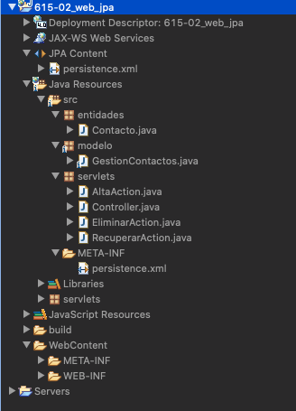

Los servlets estan dentro del paquete `servlets` ahora lo revisamos así un poquito por encima para que vean lo que hacen.

Tenemos un Servlet Controlador de acción.

*`Controlador.java`*

```java
package servlets;

import java.io.IOException;
import javax.servlet.ServletException;
import javax.servlet.annotation.WebServlet;
import javax.servlet.http.HttpServlet;
import javax.servlet.http.HttpServletRequest;
import javax.servlet.http.HttpServletResponse;

/**
 * Servlet implementation class Controller
 */
@WebServlet("/Controller")
public class Controller extends HttpServlet {
   private static final long serialVersionUID = 1L;

   /**
   * @see HttpServlet#service(HttpServletRequest request, HttpServletResponse response)
   */
   protected void service(HttpServletRequest request, HttpServletResponse response) throws ServletException, IOException {
      String op=request.getParameter("op");
      String url="";
      switch(op){
         case "doAlta":
            url="AltaAction";
            break;
         case "doEliminar":
            url="EliminarAction";
            break;
         case "doRecuperar":
            url="RecuperarAction";
            break;
         case "toNuevo":
            url="nuevo.html";
            break;
         case "toMenu":
            url="menu.html";
            break;		
      }
      request.getRequestDispatcher(url).forward(request, response);
   }
}
```

El Controlador es el centro al que llegan todas las peticiones, recibirá un parámetro `op` que indicará qué tipo de operación quiere realizar el usuario, si quiere añadir un contacto, eliminar un contacto, etc. y en función de eso ya el Controlador le va redirigiendo a otros controladores de acción que se van a encargar de cada una de esas tareas o bien a alguna página si simplemente es un enlace para ir a una determinada página, por ejemplo la de dar de alta contacto `toNuevo` o el menú principal `toMenu`.

El servlet `AltaAction` tiene el siguiente contenido:

*`AltaAction`*

```java
package servlets;

import java.io.IOException;

import javax.servlet.ServletException;
import javax.servlet.annotation.WebServlet;
import javax.servlet.http.HttpServlet;
import javax.servlet.http.HttpServletRequest;
import javax.servlet.http.HttpServletResponse;

import modelo.GestionContactos;

/**
 * Servlet implementation class AltaContacto
 */
@WebServlet("/AltaAction")
public class AltaAction extends HttpServlet {
   private static final long serialVersionUID = 1L;

   /**
   * @see HttpServlet#service(HttpServletRequest request, HttpServletResponse response)
   */
   protected void service(HttpServletRequest request, HttpServletResponse response) throws ServletException, IOException {
      String nombre=request.getParameter("nombre");
      String email=request.getParameter("email");
      int telefono=Integer.parseInt(request.getParameter("telefono"));
      //creamos un objeto de la capa de lógica de negocio
      //y llamamos al método encargado de hacer el alta
      GestionContactos gcontactos=new GestionContactos();
      gcontactos.altaContacto(nombre,email,telefono);
      request.getRequestDispatcher("menu.html").forward(request, response);
   }
}
```

Como vemos tenemos la llamada al método `altaContacto` que hemos definido en la Capa de Lógica de Negocio. Que es lo que se hace aquí, se reciben los parámetros `nombre`, `email` y `telefono` de la página HTML que ha provocado la opción de dar el alta e instanciamos `GestionContacto` y llamamos al método `altaContacto`, la versión que recibe los 3 parámetros y después nos redirigimos a la página del menú.

En este caso se está llamando la versión que recibe los tres parámetros se podría haber construido un objeto o Contacto ya con el nombre, email y el teléfono y usar esa otra versión del método, cualquiera de las dos habría sido igualmente válida.

En el caso del servlet `EliminarAction`

*`EliminarAction`*

```java
package servlets;

import java.io.IOException;

import javax.servlet.ServletException;
import javax.servlet.annotation.WebServlet;
import javax.servlet.http.HttpServlet;
import javax.servlet.http.HttpServletRequest;
import javax.servlet.http.HttpServletResponse;

import modelo.GestionContactos;

/**
 * Servlet implementation class EliminaContacto
 */
@WebServlet("/EliminarAction")
public class EliminarAction extends HttpServlet {
   private static final long serialVersionUID = 1L;

   /**
   * @see HttpServlet#service(HttpServletRequest request, HttpServletResponse response)
   */
   protected void service(HttpServletRequest request, HttpServletResponse response) throws ServletException, IOException {
      int idContacto=Integer.parseInt(request.getParameter("idContacto"));
      GestionContactos gcontactos=new GestionContactos();
      gcontactos.eliminarContacto(idContacto);
      request.getRequestDispatcher("RecuperarAction").forward(request, response);
   }
}
```

Lo que se hace es recibir el `idContacto` y después llamar a ese método que hemos creado también `gcontactos.eliminarContacto(idContacto);`

En el caso del servlet `RecuperarAction`

*`RecuperarAction`*

```java
package servlets;

import java.io.IOException;
import java.util.List;

import javax.servlet.ServletException;
import javax.servlet.annotation.WebServlet;
import javax.servlet.http.HttpServlet;
import javax.servlet.http.HttpServletRequest;
import javax.servlet.http.HttpServletResponse;

import entidades.Contacto;
import modelo.GestionContactos;

/**
 * Servlet implementation class RecuperarAction
 */
@WebServlet("/RecuperarAction")
public class RecuperarAction extends HttpServlet {
   private static final long serialVersionUID = 1L;

   /**
   * @see HttpServlet#service(HttpServletRequest request, HttpServletResponse response)
   */
   protected void service(HttpServletRequest request, HttpServletResponse response) throws ServletException, IOException {
      GestionContactos gcontactos=new GestionContactos();
      List<Contacto> contactos=gcontactos.recuperarContactos();
      //guardamos contactos en un atributo de petición
      request.setAttribute("contactos", contactos);
      //trasnferencia de la petición
      request.getRequestDispatcher("contactos.jsp").forward(request, response);
   }
}
```

Lo que se hace es llamar al método `recuperarContactos()` que me devuelve todos los contactos que implementamos con la `Query` y pasarlo como un atributo de petición a la JSP que se encargará de visualizarlo, la Vista.

Bueno vamos a poner las vistas también las tenemos en la carpeta WebContent y serían dos HTML y un JSP que es la que mostrará la lista de los contactos recuperados.

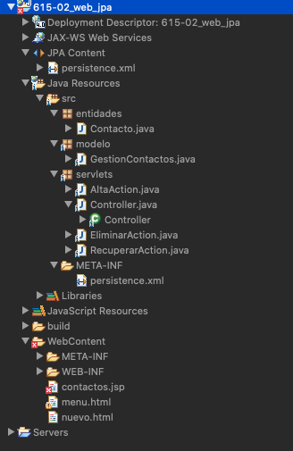

En este caso `menu.html` y `nuevo.html` son simples páginas HTML.

*`menu.html`*

```html
<!DOCTYPE html>
<!--
To change this license header, choose License Headers in Project Properties.
To change this template file, choose Tools | Templates
and open the template in the editor.
-->
<html>
    <head>
        <title>TODO supply a title</title>
        <meta charset="UTF-8">
        <meta name="viewport" content="width=device-width, initial-scale=1.0">
    </head>
    <body>
    <center>
        <a href="Controller?op=toNuevo">Nuevo contacto</a><br/>
        <a href="Controller?op=doRecuperar">Ver contactos</a><br/>
    </center>
    </body>
</html>
```

Aquí tenemos enlaces todo a `Controller?op=...` indicando la operación a realizar.

*`nuevo.html`*

```html
<!DOCTYPE HTML PUBLIC "-//W3C//DTD HTML 4.01 Transitional//EN">
<html>
<head>
<title>nuevo</title>
<meta http-equiv="Content-Type" content="text/html; charset=ISO-8859-1">
<script type="text/javascript">
   function comprobar(){ 	
      if(document.getElementById("nombre").value==""||
 	 document.getElementById("email").value==""||
 	 document.getElementById("edad").value==""){
 	 alert("faltan datos");
 	 return false;
      }
      else{
 	 return true;
      }	
    }
    function comprobarEdad(){
       if(isNaN(document.getElementById("edad").value)){
          alert("Edad debe ser numérico");
          document.getElementById("edad").value="";
       }
    }
</script>
</head>
<body>
    <form action="Controller?op=doAlta" method="post" onsubmit="return comprobar();">
	Nombre:<input id="nombre" type="text" name="nombre"/>
	<br/>
	Email:<input id="email" type="text" name="email"/>
	<br/>
        Telefono:<input id="edad" onblur="comprobarEdad();" type="text" name="telefono"/>
	<br/>
	<input type="submit" value="Guardar"/>
    </form>
</body>
</html>
```

Está también tomando el control de la operación a realizar `Controller?op=doAlta`.

Y aquí tenemos la JSP.

*`contactos.jsp`*

```html
<%@ page language="java" contentType="text/html; charset=ISO-8859-1"
    pageEncoding="ISO-8859-1" import="modelo.GestionContactos,java.util.ArrayList,entidades.Contacto"%>

<%@taglib uri="http://java.sun.com/jsp/jstl/core" prefix="c" %>    
<!DOCTYPE html PUBLIC "-//W3C//DTD HTML 4.01 Transitional//EN" "http://www.w3.org/TR/html4/loose.dtd">
<html>
<head>
<meta http-equiv="Content-Type" content="text/html; charset=ISO-8859-1">
<title>Insert title here</title>
</head>
<body>
	
   <c:set var="contactos" value="${requestScope.contactos}"/>
	
   <br/><br/><br/>
	
   <c:choose>
      <c:when test="${!empty contactos}">
	 <table border="1">
	    <tr>
	       <th>Nombre</th>
	       <th>Email </th>
	       <th>Telefono</th>
	       <th></th>
	    </tr>
	    <c:forEach var="cont" items="${contactos}">
	    <tr>
	       <td>${cont.nombre}</td>
	       <td>${cont.email}</td>
	       <td>${cont.telefono}</td>
	       <td><a href="Controller?op=doEliminar&idContacto=${cont.idContacto}">Eliminar</a></td>
	    </tr>
	    </c:forEach>
	 </table>
      </c:when>
      <c:otherwise>
	 <h1>No hay contactos</h1>
      </c:otherwise>
   </c:choose>
   <br/>
   <br/>
   <a href="Controller?op=toMenu">Menu</a>
</body>
</html>
```

En el caso de la JSP lo que hacemos es recuperar el atributo de petición `contactos` y recorrerlo para mostrar cada uno de los contactos en una fila y con el enlace de eliminar contactos, estoy viendo aquí algunos errores porque en vez de utilizar Java en esta página JSP, se está utilizando la librería JSTL, Java Standard Tag Library que proporciona acciones para realizar tareas habituales de lógica en una página JSP pero sin utilizar código Java, por ejemplo un `<c:forEach`, una variable `<c:set var="`, un if `<c:when test=` para poder utilizar la librería hay que emplear este elemento Talib `<%@taglib uri="http://java.sun.com/jsp/jstl/core" prefix="c" %>` y aquí el problema que nos está dando es que no la reconoce, no encuentra esa librería, porque aunque forma parte del Java Enterprise, el servidor de aplicaciones Tomcat no la trae. 

En la sección de Java Resources aquí vemos pues no solamente nuestras clases sino en las librerías que puede utilizar la aplicación, nuestro proyecto que estamos desarrollando.

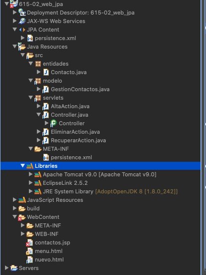

Tenemos JRE, EclipseLink y Apache Tomcat que representaría todas las librerías que vienen con Tomcat y que incluyen alguna de ellas

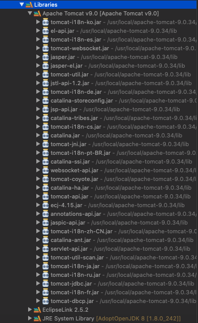

concretamente están `jsp-api.jar` y `servlet-api.jar` parte de lo que es la librería Java Enterprise Edition para crear los Servlets y JSsP pero no todas. Entonces qué ocurre si necesitamos hacer uso de esa librería que no viene con Tomcat. Pues igual que por ejemplo con el Driver, habría que descargarlo y añadirlo explícitamente en las propiedades, pestaña librerías y añadir el external Jar. Eso es una forma de hacerlo, pero ahora aprovechando este ejercicio te voy a enseñar otra y es utilizar Maven, Maven es una podríamos decir que es una herramienta que viene incorporada con Eclipse que nos permite localizar dependencias a librerías, entonces en vez de descargar los archivos JAR y añadirlos manualmente, a través de Maven los podemos buscar en el repositorio de Maven, indicar la referencia a sus archivos, a esas librerías en un archivo XML propio de Maven y a partir de ahí ya se encarga Maven de descargarlo y de incluirlo en nuestro proyecto. A lo mejor para una o dos librerías  igual no ahorramos mucho tiempo frente a descargarlas y añadirla manualmente, pero es que hay ciertas librerías que a su vez dependen de otras y que claro ir descargando y localizando todas esas dependencias es muy complicado, con Maven eso es automático y Maven se encarga de localizar las dependencias que pudieran tener cierta librería.

Entonces cómo aplicaríamos Maven en este proyecto a través del botón derecho, Configure, Convert to Maven Project.

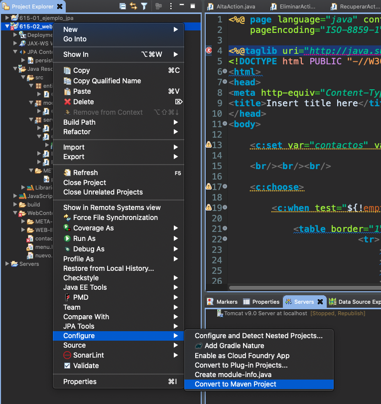

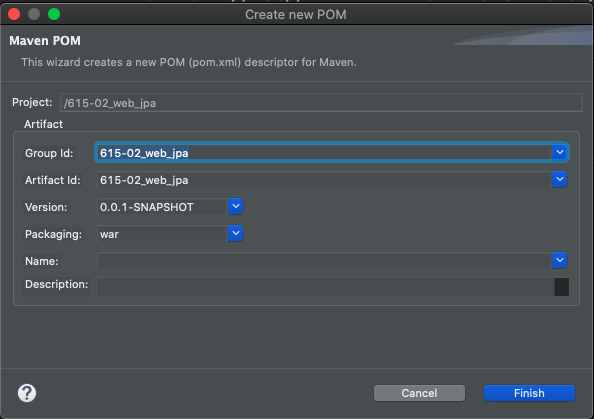

Finalizamos el cuadro de diálogo éste. Estas opciones que nos da aquí de incorporar via Maven también estas librerías que ya tenemos, esto lo vamos a asaltar porque en esa librería ya vienen con Tomcat y no hay que incorporarlas via Maven (A mi no me salio).

El proyecto a cambiado un poco y ahora se nos presenta así:


Básicamente se ha añadido el archivo `pom.xml` que es donde se insertan las dependencias que manejara Maven dentro de nuestro proyecto.

```html
<project xmlns="http://maven.apache.org/POM/4.0.0" xmlns:xsi="http://www.w3.org/2001/XMLSchema-instance" xsi:schemaLocation="http://maven.apache.org/POM/4.0.0 https://maven.apache.org/xsd/maven-4.0.0.xsd">
  <modelVersion>4.0.0</modelVersion>
  <groupId>615-02_web_jpa</groupId>
  <artifactId>615-02_web_jpa</artifactId>
  <version>0.0.1-SNAPSHOT</version>
  <packaging>war</packaging>
  <build>
    <sourceDirectory>src</sourceDirectory>
    <resources>
      <resource>
        <directory>src</directory>
        <excludes>
          <exclude>**/*.java</exclude>
        </excludes>
      </resource>
    </resources>
    <plugins>
      <plugin>
        <artifactId>maven-compiler-plugin</artifactId>
        <version>3.8.0</version>
        <configuration>
          <source>1.8</source>
          <target>1.8</target>
        </configuration>
      </plugin>
      <plugin>
        <artifactId>maven-war-plugin</artifactId>
        <version>3.2.3</version>
        <configuration>
          <warSourceDirectory>WebContent</warSourceDirectory>
        </configuration>
      </plugin>
    </plugins>
  </build>
</project>
```


Es posible que necesitemos incorporar algunas dependencias adicionales que necesitamos en el proyecto, el propio Driver MySQL por ejemplo. Vamos a ver como controlarlo con Maven aunque lo tenemos descargado. Pero bueno aquí vamos a hacerlo con Maven. 

En el `pom.xml` deberíamos incorporar las entradas de localización de las librerías que necesitamos que van a ser el Driver de MySQL por un lado y el JSTL por otro, dónde metemos las dependencias de esas librerías. Para ello vamos a ir al repositorio de Maven https://mvnrepository.com/ el repositorio permite buscar, localizar dependencias por ejemplo `jstl` 

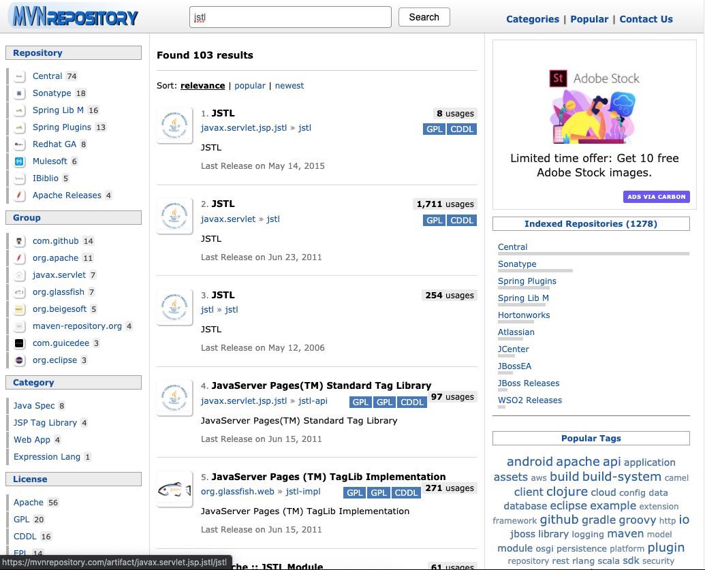

ya que la tenemos ahí buscamos y aquí nos aparece una lista que ha encontrado y algunas son prácticamente iguales. Hay algunas que ya son más raras y que por lo tanto no vamos a usar. Es decir lo que vamos buscando normalmente aparecen en primeros lugares. Sin embargo aquí vemos que está todavía debe ser muy reciente ocho usos y la siguiente tienen un poquito más de usos, quizá es la más fiable, la elegimos.

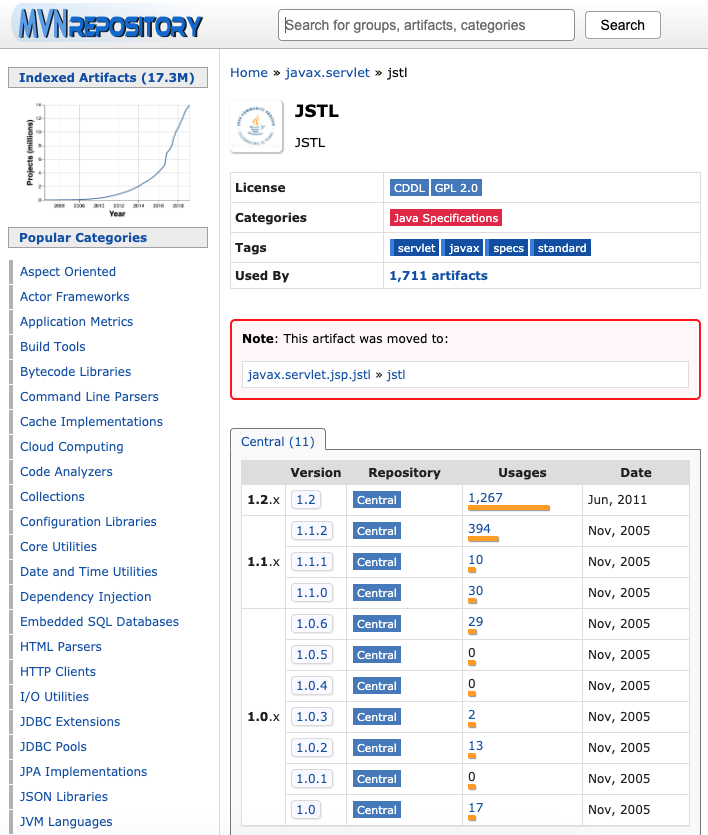

vemos la lista de versiones, indicamos qué versión queremos la 1.2 que además ser la más utilizada y aquí tenemos ya directamente la entrada que tenemos que incluir

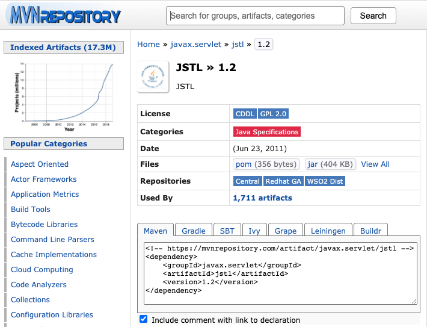

```html
<!-- https://mvnrepository.com/artifact/javax.servlet/jstl -->
<dependency>
    <groupId>javax.servlet</groupId>
    <artifactId>jstl</artifactId>
    <version>1.2</version>
</dependency>
```

copiamos esto al portapapeles y lo incluimos directamente dentro de una sección dependencias entre las dependencias, ahí incluimos esa dependencia, a continuación repetimos con todas las dependencias que queremos. Esto ya le va indicando a Maven que tiene que descargar esas librería por otro lado vamos a volver otra vez al Repositorio de Maven y en este caso vamos a buscar MySQL connect

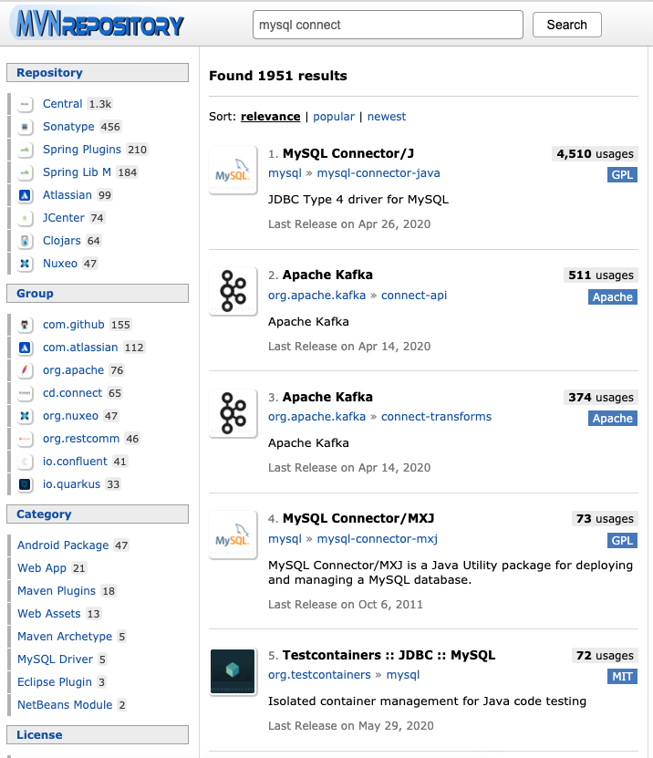

ya lo teníamos descargado pero bueno podemos cogerlo desde aquí e incorporarlo via Maven, aparece en la lista de versiones 8.0.20 

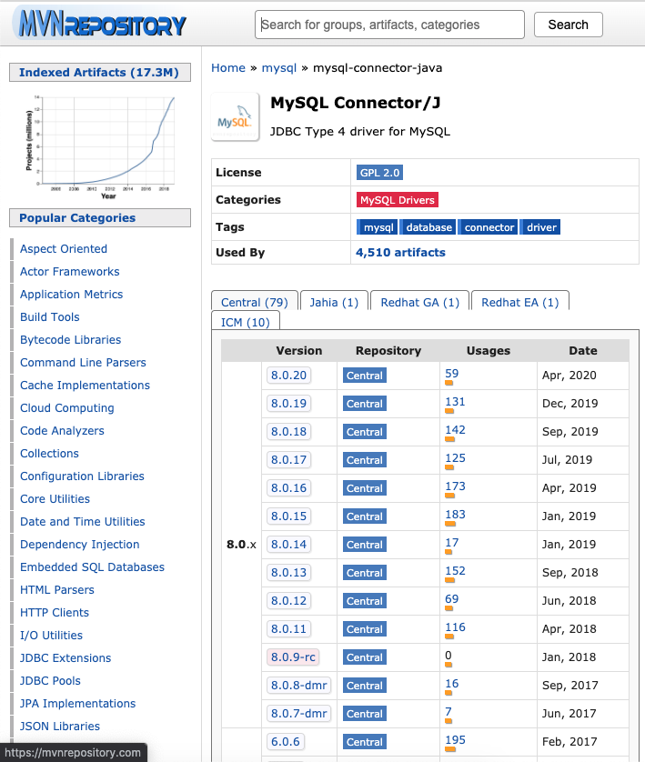

creo que teníamos la 5.1.42 mirar este mismo es el que vamos a utilizar aquí tenemos la entrada que hay que indicar en el XML.

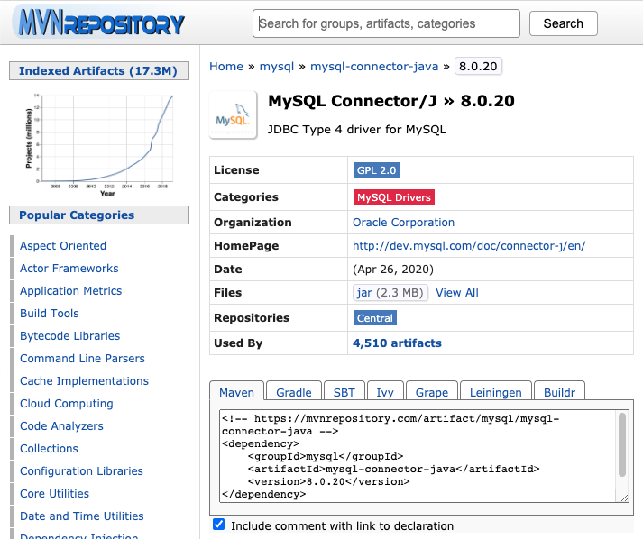

```html
<!-- https://mvnrepository.com/artifact/mysql/mysql-connector-java -->
<dependency>
    <groupId>mysql</groupId>
    <artifactId>mysql-connector-java</artifactId>
    <version>8.0.20</version>
</dependency>
```

Hacemos lo mismo de antes la copiamos y la pegamos.

Entonces ya tenemos las dos dependencias que necesitamos al guardarlo pues ya automáticamente debería proceder a la descarga de esos archivos y por lo tanto incorporarlos en el proyecto, el archivo `pom.xml` queda así:

```html
<project xmlns="http://maven.apache.org/POM/4.0.0"
	xmlns:xsi="http://www.w3.org/2001/XMLSchema-instance"
	xsi:schemaLocation="http://maven.apache.org/POM/4.0.0 https://maven.apache.org/xsd/maven-4.0.0.xsd">
	<modelVersion>4.0.0</modelVersion>
	<groupId>615-02_web_jpa</groupId>
	<artifactId>615-02_web_jpa</artifactId>
	<version>0.0.1-SNAPSHOT</version>
	<packaging>war</packaging>
	<build>
		<sourceDirectory>src</sourceDirectory>
		<resources>
			<resource>
				<directory>src</directory>
				<excludes>
					<exclude>**/*.java</exclude>
				</excludes>
			</resource>
		</resources>
		<plugins>
			<plugin>
				<artifactId>maven-compiler-plugin</artifactId>
				<version>3.8.0</version>
				<configuration>
					<source>1.8</source>
					<target>1.8</target>
				</configuration>
			</plugin>
			<plugin>
				<artifactId>maven-war-plugin</artifactId>
				<version>3.2.3</version>
				<configuration>
					<warSourceDirectory>WebContent</warSourceDirectory>
				</configuration>
			</plugin>
		</plugins>
	</build>
	<dependencies>
		<!-- https://mvnrepository.com/artifact/javax.servlet/jstl -->
		<dependency>
			<groupId>javax.servlet</groupId>
			<artifactId>jstl</artifactId>
			<version>1.2</version>
		</dependency>
		<!-- https://mvnrepository.com/artifact/mysql/mysql-connector-java -->
		<dependency>
			<groupId>mysql</groupId>
			<artifactId>mysql-connector-java</artifactId>
			<version>8.0.20</version>
		</dependency>
	</dependencies>
</project>
```

Efectivamente fijate que el error que teníamos ha desaparecido, porque en la entrada Libraries - Maven Dependencies tienen los dos JARs que Maven ya ha descargado `jstl-1.2.jar` y `mysql-connector-java-8.0.20.jar` correspondientes a las dependecias que incluimos en `pom.xml`. Si estos Jar dependieran de otro, pues también los descargaría y no tendríamos que haber estado nosotros buscándolos, incorporándolos manualmente a nuestro proyecto.

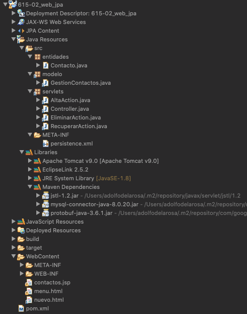

Bueno esto ya se supone que ya podríamos ejecutarlo y funcionaría a través de `Run As - Run on Server` la página `menu.html` que es nuestra página de inicio.
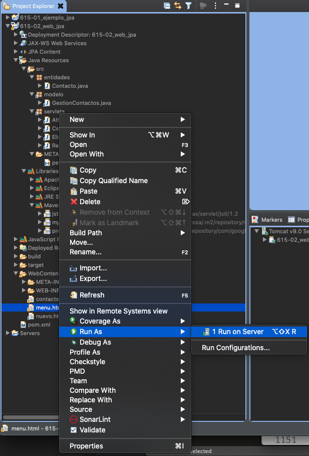

Indicamos que nuestro servidor es Tomcat, podemos marcarlo para que la próxima vez ya no pregunte y lo haga automáticamente Eclipse por nosotros.

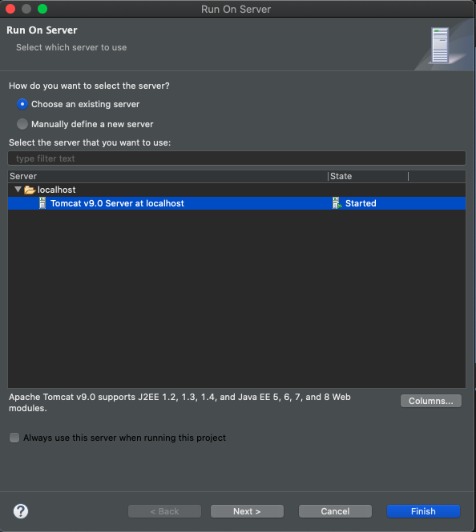

El servidor arranca, incluso lanza como vez a través de un navegador que tiene la página.

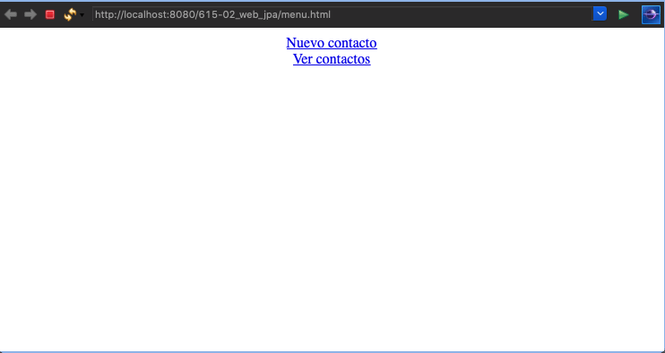

Si le damos a ver contactos no deberían aparecer aquí la lista de todos los contactos que tenemos.

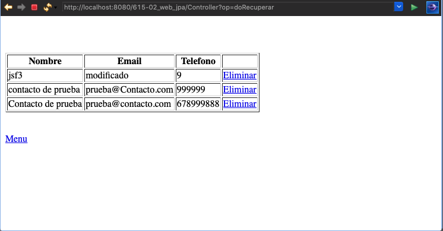

Finalmente volvemos al menú, vamos a añadir un nuevo contacto a ver si funciona.

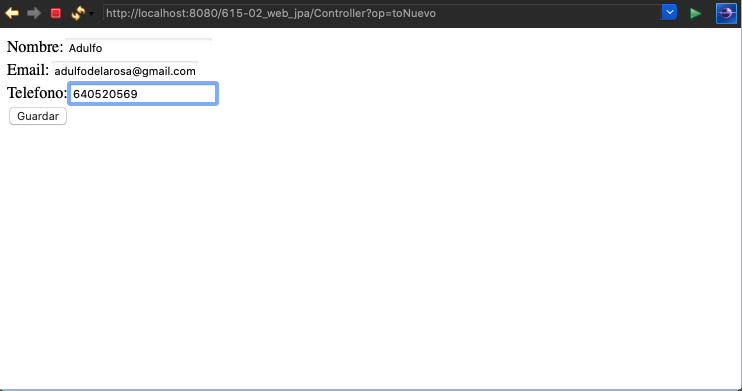

y guardamos, volvemos al menú 

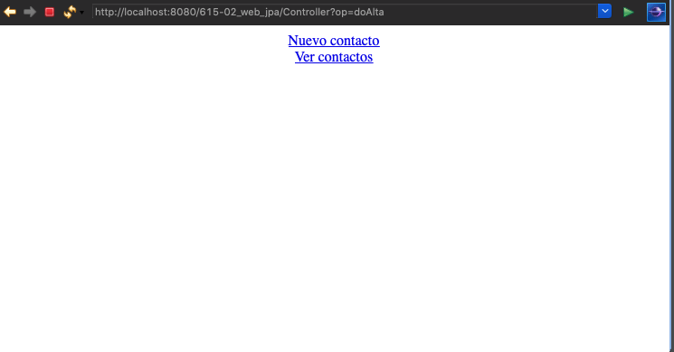

y al ver contactos nuevamente vemos el  nuevo contacto.

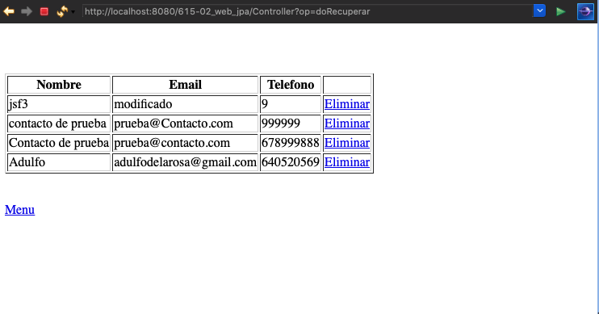

si lo eliminamos se recarga la lista de contactos y ya vemos que no aparece.

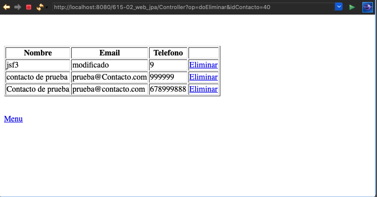

Todo funciona.

### :computer: Código Completo - 615-02_web_jpa 

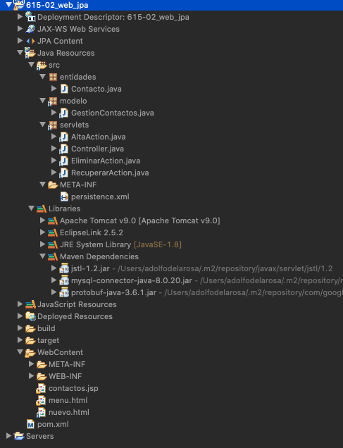

*`pom.xml`*

```html
<project xmlns="http://maven.apache.org/POM/4.0.0"
	xmlns:xsi="http://www.w3.org/2001/XMLSchema-instance"
	xsi:schemaLocation="http://maven.apache.org/POM/4.0.0 https://maven.apache.org/xsd/maven-4.0.0.xsd">
	<modelVersion>4.0.0</modelVersion>
	<groupId>615-02_web_jpa</groupId>
	<artifactId>615-02_web_jpa</artifactId>
	<version>0.0.1-SNAPSHOT</version>
	<packaging>war</packaging>
	<build>
		<sourceDirectory>src</sourceDirectory>
		<resources>
			<resource>
				<directory>src</directory>
				<excludes>
					<exclude>**/*.java</exclude>
				</excludes>
			</resource>
		</resources>
		<plugins>
			<plugin>
				<artifactId>maven-compiler-plugin</artifactId>
				<version>3.8.0</version>
				<configuration>
					<source>1.8</source>
					<target>1.8</target>
				</configuration>
			</plugin>
			<plugin>
				<artifactId>maven-war-plugin</artifactId>
				<version>3.2.3</version>
				<configuration>
					<warSourceDirectory>WebContent</warSourceDirectory>
				</configuration>
			</plugin>
		</plugins>
	</build>
	<dependencies>
		<!-- https://mvnrepository.com/artifact/javax.servlet/jstl -->
		<dependency>
			<groupId>javax.servlet</groupId>
			<artifactId>jstl</artifactId>
			<version>1.2</version>
		</dependency>
		<!-- https://mvnrepository.com/artifact/mysql/mysql-connector-java -->
		<dependency>
			<groupId>mysql</groupId>
			<artifactId>mysql-connector-java</artifactId>
			<version>8.0.20</version>
		</dependency>
	</dependencies>
</project>
```

*`persistence.xml`*

```html
<?xml version="1.0" encoding="UTF-8"?>
<persistence version="2.2" xmlns="http://xmlns.jcp.org/xml/ns/persistence" xmlns:xsi="http://www.w3.org/2001/XMLSchema-instance" xsi:schemaLocation="http://xmlns.jcp.org/xml/ns/persistence http://xmlns.jcp.org/xml/ns/persistence/persistence_2_2.xsd">
	<persistence-unit name="615-02_web_jpa" transaction-type="RESOURCE_LOCAL">
		<class>entidades.Contacto</class>
		<properties>
			<property name="javax.persistence.jdbc.url" value="jdbc:mysql://localhost:3306/agenda"/>
			<property name="javax.persistence.jdbc.user" value="root"/>
			<property name="javax.persistence.jdbc.password" value="root"/>
			<property name="javax.persistence.jdbc.driver" value="com.mysql.jdbc.Driver"/>
		</properties>
	</persistence-unit>
</persistence>
```

*`Contacto`*

```java
package entidades;

import java.io.Serializable;
import javax.persistence.*;


/**
 * The persistent class for the contactos database table.
 * 
 */
@Entity
@Table(name="contactos")
@NamedQuery(name="Contacto.findAll", query="SELECT c FROM Contacto c")
public class Contacto implements Serializable {
	private static final long serialVersionUID = 1L;

	@Id
	@GeneratedValue(strategy=GenerationType.IDENTITY)
	private int idContacto;

	private String email;

	private String nombre;

	private int telefono;

	public Contacto() {
	}

	public Contacto(String email, String nombre, int telefono) {
		super();
		this.email = email;
		this.nombre = nombre;
		this.telefono = telefono;
	}

	public Contacto(int idContacto, String email, String nombre, int telefono) {
		super();
		this.idContacto = idContacto;
		this.email = email;
		this.nombre = nombre;
		this.telefono = telefono;
	}

	public int getIdContacto() {
		return this.idContacto;
	}

	public void setIdContacto(int idContacto) {
		this.idContacto = idContacto;
	}

	public String getEmail() {
		return this.email;
	}

	public void setEmail(String email) {
		this.email = email;
	}

	public String getNombre() {
		return this.nombre;
	}

	public void setNombre(String nombre) {
		this.nombre = nombre;
	}

	public int getTelefono() {
		return this.telefono;
	}

	public void setTelefono(int telefono) {
		this.telefono = telefono;
	}

}
```

*`GestionContactos`*

```java
package modelo;

import java.util.List;

import javax.persistence.EntityManager;
import javax.persistence.EntityManagerFactory;
import javax.persistence.EntityTransaction;
import javax.persistence.Persistence;
import javax.persistence.TypedQuery;

import entidades.Contacto;

public class GestionContactos {
	
	//Método que permite obtener el objeto EntityManager
	private EntityManager getEntityManager() {
		EntityManagerFactory factory = Persistence.createEntityManagerFactory("615-02_web_jpa");
		return factory.createEntityManager();
	}
	
	public void altaContacto(String nombre, String email, int telefono) {
		Contacto c = new Contacto(email, nombre, telefono);
		EntityManager em = getEntityManager();
		
		//La operación la incluimos en una transacción
		EntityTransaction tx = em.getTransaction();
		tx.begin();
		em.persist(c);
		tx.commit();
	}

	public void altacontacto(Contacto c) {
		EntityManager em = getEntityManager();
		
		//La operación la incluimos en una transacción
		EntityTransaction tx = em.getTransaction();
		tx.begin();
		em.persist(c);
		tx.commit();
	}
	
	public void eliminarContacto(int idContacto) {
		EntityManager em = getEntityManager();
		
		Contacto c = em.find(Contacto.class, idContacto);
		EntityTransaction tx = em.getTransaction();
		//Si el contacto existe lo eliminamos
		tx.begin();
		if(c != null) {
		   em.remove(c);
		}
		tx.commit();	
	}
	
	public List<Contacto> recuperarContactos(){
		EntityManager em = getEntityManager();
		/*Query qr = em.createQuery("Select c From Contacto c");
		return (List<Contacto>)qr.getResultList();*/
		TypedQuery<Contacto> qr = em.createQuery("Select c From Contacto c", Contacto.class);
		return qr.getResultList();
	}
	
	public Contacto buscarContactos(String email){
		EntityManager em = getEntityManager();
		
		String jpql = "Select c From Contacto c Where c.email = '" + email + "'";
		TypedQuery<Contacto> qr = em.createQuery(jpql, Contacto.class);
		//return qr.getSingleResult();
		return qr.getResultList().get(0);
	}
}

```

*`Controller`*

```java
package servlets;

import java.io.IOException;
import javax.servlet.ServletException;
import javax.servlet.annotation.WebServlet;
import javax.servlet.http.HttpServlet;
import javax.servlet.http.HttpServletRequest;
import javax.servlet.http.HttpServletResponse;

/**
 * Servlet implementation class Controller
 */
@WebServlet("/Controller")
public class Controller extends HttpServlet {
	private static final long serialVersionUID = 1L;

	/**
	 * @see HttpServlet#service(HttpServletRequest request, HttpServletResponse response)
	 */
	protected void service(HttpServletRequest request, HttpServletResponse response) throws ServletException, IOException {
		String op=request.getParameter("op");
		String url="";
		switch(op){
			case "doAlta":
				url="AltaAction";
				break;
			case "doEliminar":
				url="EliminarAction";
				break;
			case "doRecuperar":
				url="RecuperarAction";
				break;
			case "toNuevo":
				url="nuevo.html";
				break;
			case "toMenu":
				url="menu.html";
				break;
			
			
		}
		request.getRequestDispatcher(url).forward(request, response);
	}

}
```

*`AltaAction`*

```java
package servlets;

import java.io.IOException;

import javax.servlet.ServletException;
import javax.servlet.annotation.WebServlet;
import javax.servlet.http.HttpServlet;
import javax.servlet.http.HttpServletRequest;
import javax.servlet.http.HttpServletResponse;

import modelo.GestionContactos;

/**
 * Servlet implementation class AltaContacto
 */
@WebServlet("/AltaAction")
public class AltaAction extends HttpServlet {
	private static final long serialVersionUID = 1L;

	/**
	 * @see HttpServlet#service(HttpServletRequest request, HttpServletResponse response)
	 */
	protected void service(HttpServletRequest request, HttpServletResponse response) throws ServletException, IOException {
		String nombre=request.getParameter("nombre");
		String email=request.getParameter("email");
		int telefono=Integer.parseInt(request.getParameter("telefono"));
		//creamos un objeto de la capa de lógica de negocio
		//y llamamos al método encargado de hacer el alta
		GestionContactos gcontactos=new GestionContactos();
		gcontactos.altaContacto(nombre,email,telefono);
		request.getRequestDispatcher("menu.html").forward(request, response);
	}

}
```

*`EliminarAction`*

```java
package servlets;

import java.io.IOException;

import javax.servlet.ServletException;
import javax.servlet.annotation.WebServlet;
import javax.servlet.http.HttpServlet;
import javax.servlet.http.HttpServletRequest;
import javax.servlet.http.HttpServletResponse;

import modelo.GestionContactos;

/**
 * Servlet implementation class EliminaContacto
 */
@WebServlet("/EliminarAction")
public class EliminarAction extends HttpServlet {
	private static final long serialVersionUID = 1L;

	/**
	 * @see HttpServlet#service(HttpServletRequest request, HttpServletResponse response)
	 */
	protected void service(HttpServletRequest request, HttpServletResponse response) throws ServletException, IOException {
		int idContacto=Integer.parseInt(request.getParameter("idContacto"));
		GestionContactos gcontactos=new GestionContactos();
		gcontactos.eliminarContacto(idContacto);
		request.getRequestDispatcher("RecuperarAction").forward(request, response);
	}

}
```

*`RecuperarAction`*

```java
package servlets;

import java.io.IOException;
import java.util.List;

import javax.servlet.ServletException;
import javax.servlet.annotation.WebServlet;
import javax.servlet.http.HttpServlet;
import javax.servlet.http.HttpServletRequest;
import javax.servlet.http.HttpServletResponse;

import entidades.Contacto;
import modelo.GestionContactos;

/**
 * Servlet implementation class RecuperarAction
 */
@WebServlet("/RecuperarAction")
public class RecuperarAction extends HttpServlet {
	private static final long serialVersionUID = 1L;

	/**
	 * @see HttpServlet#service(HttpServletRequest request, HttpServletResponse response)
	 */
	protected void service(HttpServletRequest request, HttpServletResponse response) throws ServletException, IOException {
		GestionContactos gcontactos=new GestionContactos();
		List<Contacto> contactos=gcontactos.recuperarContactos();
		//guardamos contactos en un atributo de petición
		request.setAttribute("contactos", contactos);
		//trasnferencia de la petición
		request.getRequestDispatcher("contactos.jsp").forward(request, response);
	}

}
```

*`menu.html`*

```html
<!DOCTYPE html>
<!--
To change this license header, choose License Headers in Project Properties.
To change this template file, choose Tools | Templates
and open the template in the editor.
-->
<html>
    <head>
        <title>TODO supply a title</title>
        <meta charset="UTF-8">
        <meta name="viewport" content="width=device-width, initial-scale=1.0">
    </head>
    <body>
    <center>
        <a href="Controller?op=toNuevo">Nuevo contacto</a><br/>
        <a href="Controller?op=doRecuperar">Ver contactos</a><br/>
    </center>
    </body>
</html>
```

*`nuevo.html`*

```html
<!DOCTYPE HTML PUBLIC "-//W3C//DTD HTML 4.01 Transitional//EN">
<html>
<head>
<title>nuevo</title>
<meta http-equiv="Content-Type" content="text/html; charset=ISO-8859-1">
<script type="text/javascript">
 	function comprobar(){ 	
 		if(document.getElementById("nombre").value==""||
 			document.getElementById("email").value==""||
 			document.getElementById("edad").value==""){
 				alert("faltan datos");
 			return false;
 		}
 		else{
 			return true;
 		}
 		
 	}
        function comprobarEdad(){
            if(isNaN(document.getElementById("edad").value)){
                alert("Edad debe ser numérico");
                document.getElementById("edad").value="";
            }
        }
</script>
</head>
<body>
<form action="Controller?op=doAlta" method="post" onsubmit="return comprobar();">
	Nombre:<input id="nombre" type="text" name="nombre"/>
	<br/>
	Email:<input id="email" type="text" name="email"/>
	<br/>
        Telefono:<input id="edad" onblur="comprobarEdad();" type="text" name="telefono"/>
	<br/>
	<input type="submit" value="Guardar"/>
</form>
</body>
</html>
```

*`contactos.jsp`*

```java
<%@ page language="java" contentType="text/html; charset=ISO-8859-1"
    pageEncoding="ISO-8859-1" import="modelo.GestionContactos,java.util.ArrayList,entidades.Contacto"%>

<%@taglib uri="http://java.sun.com/jsp/jstl/core" prefix="c" %>    
<!DOCTYPE html PUBLIC "-//W3C//DTD HTML 4.01 Transitional//EN" "http://www.w3.org/TR/html4/loose.dtd">
<html>
<head>
<meta http-equiv="Content-Type" content="text/html; charset=ISO-8859-1">
<title>Insert title here</title>
</head>
<body>
	
	<c:set var="contactos" value="${requestScope.contactos}"/>
	
	<br/><br/><br/>
	
	<c:choose>
	
		<c:when test="${!empty contactos}">
	
			<table border="1">
						<tr>
							<th>Nombre</th>
							<th>Email </th>
							<th>Telefono</th>
							<th></th>
						</tr>
						
						<c:forEach var="cont" items="${contactos}">
							<tr><td>${cont.nombre}</td>
							<td>${cont.email}</td>
							<td>${cont.telefono}</td>
							<td><a href="Controller?op=doEliminar&idContacto=${cont.idContacto}">Eliminar</a></td></tr>
						
						
						</c:forEach>
						
						
						
			</table>
		</c:when>
		<c:otherwise>
			<h1>No hay contactos</h1>
		</c:otherwise>
	</c:choose>
	<br/>
	<br/>
	<a href="Controller?op=toMenu">Menu</a>
</body>
</html>
```

# 13 Consultas parametrizadas 03:00

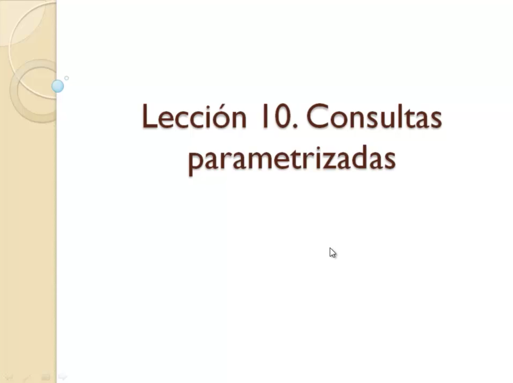

Siguiendo con el estudio de las consultas JPA vamos a ver cómo podemos definir parámetros dentro de una instrucción JPQL, lo que llamamos consultas parametrizada.

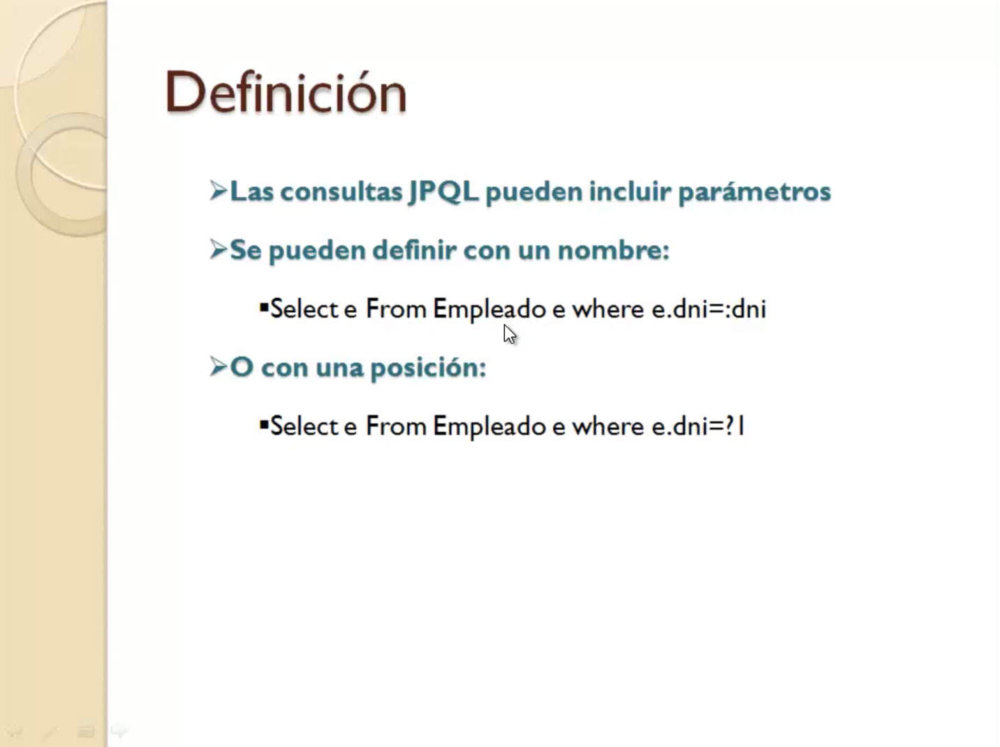

Para definir parámetros podemos hacerlo de dos maneras o bien por nombre por ejemplo:

`Select e From Empleado e Where e.dni=:dni`

Aquí tenemos una `Select` del empleado donde la condición es que el `dni` del empleado sea igual a un parámetro y en este caso le damos un nombre `dni` y precedido por los dos puntos.

La otra opción es asignar el parámetro en una posición.

`Select e From Empleado e Where e.dni=?1`

En ese caso utilizaríamos una interrogación y el número de la posición uno, dos, tres, etc.

Esto sería la manera de definir la JPQL con parámetro.

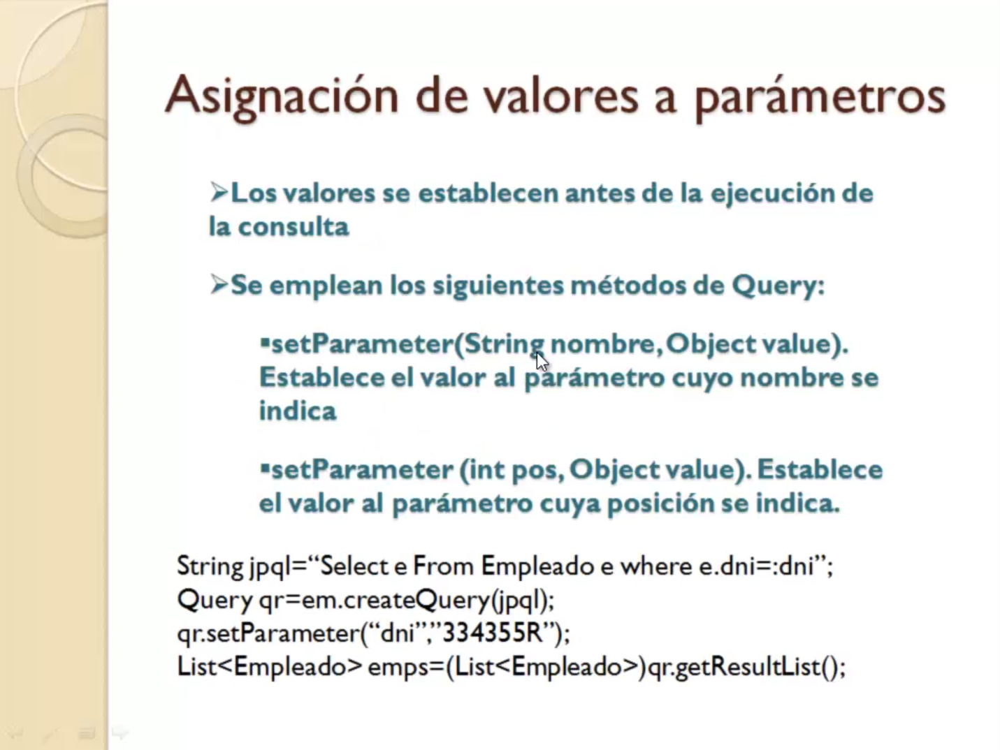

A la hora de crear la Query asociada a la instruccion JPQL le tendremos que asignar antes de su ejecución un valor a cada uno de los parámetros. Para ello utilizaríamos alguno de estos dos métodos de la interfaz `Query` o `TypeQuery` que son:

* `setParameter(String nombre, Object value)` a partir del nombre y el valor del parámetro a asignar
* `setParameter(int pos, Object value)` o con la posición y el valor a asignará en dicha posición.

Aquí vemos un ejemplo con la instrucción JPQL que veíamos en la transparencia anterior.

```java
String jpql = "Select e From Empleado e Where e.dni=:dni";
Query qr = em.createQuery(jpql);
qr.setParmeter("dni" , "334355R");
List<Empleado> emps = (List<Empleado>) qr.getResultList();
```

En este caso tenemos una instrucción JPQL con un parámetro llamado `dni`, creamos la `Query` a partir de la instrucción JPQL y antes de ejecutarla llamamos a `setParmeter`  indicando el nombre del parámetro y el valor, el valor pueden ser cualquier objeto Java. Una vez que ya lo ejecutemos en este caso con el `qr.getResultList()` obtendríamos la lista de empleados que cumplen dicha condición.

Vamos a verlo por ejemplo en el ejercicio que hicimos en la lección anterior donde teníamos un método que habíamos definido dentro del modelo que este método no se había utilizado, lo habíamos llamado a `buscarContactos`.

```java
public Contacto buscarContactos(String email){
   EntityManager em = getEntityManager();
		
   String jpql = "Select c From Contacto c Where c.email = '" + email + "'";
   TypedQuery<Contacto> qr = em.createQuery(jpql, Contacto.class);
   //return qr.getSingleResult();
   return qr.getResultList().get(0);
}
```

Que a partir del email localizaba todas las entidades cuyo valor del atributo `email` fuera el parámetro recibido. En vez de utilizar la concatenación con las comillas simples cuando es un valor de tipo texto, cuando no es de tipo texto no hay que poner comillas etc. que es bastante más farragoso de construir esas instrucciones. Lo mejor sería utilizar una consulta parametrizada, en este caso por ejemplo asignaremos una posición, crearíamos `TypedQuery` y antes de ejecutarla le asignamos un valor al parámetro, para lo cual utilizaríamos el método `setParmeter`, le daríamos la posición en este caso y el valor que sería el `email`.

```java
public Contacto buscarContactos(String email){
   EntityManager em = getEntityManager();
		
   String jpql = "Select c From Contacto c Where c.email = ?1";
   TypedQuery<Contacto> qr = em.createQuery(jpql, Contacto.class);
   qr.setParameter(1, email);
   //return qr.getSingleResult();
   return qr.getResultList().get(0);
}
```

Al ejecutarlo ya obtendríamos la lista de resultados asociados a dicho valor, como ves es bastante más cómodo que andar con la concatenación de los valores dentro de lo que sería la instrucción.

# 14 Consultas nominadas 02:28


En esta elección te voy a hablar de las consultas nominadas.


Una consulta nominada es una instrucción JPQL que se define dentro de la propia entidad a la cual se le va a asignar un nombre, de esta manera a la hora de utilizar dicha consulta JPQL en lugar de tener que escribir la instrucción dentro del código de los métodos donde vaya a ser utilizada pues se referirá ella siempre a través de su nombre, con lo cual podrá ser reutilizada en distintas partes del programa.

Por supuesto estas instrucciones JPQL con nombre pueden incluir también parámetros como cualquier otra instrucción JPQL normal.

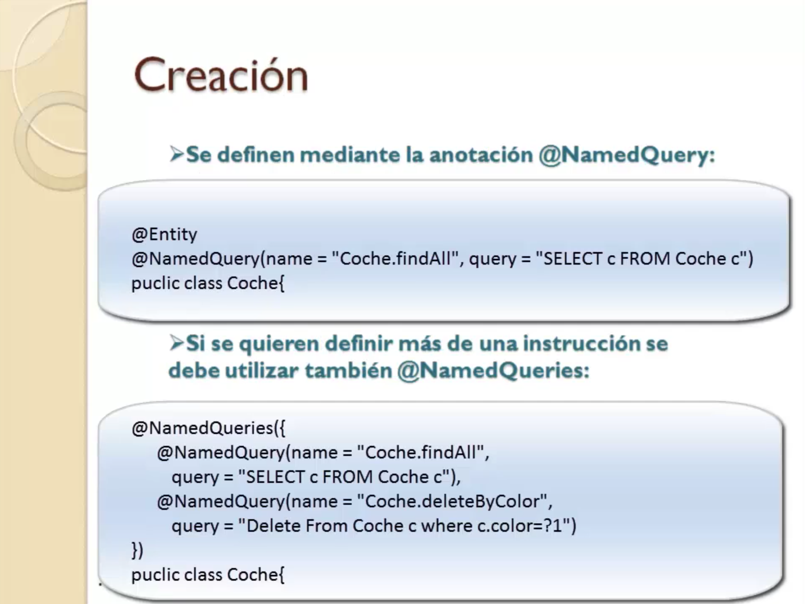

Cómo se crea una consulta nominada pues se define como hemos dicho antes dentro de la propia entidad y se utiliza para ello la anotación `@NamedQuery`. 

Se define la anotación `@Entity` y después utilizamos `@NamedQuery(name = "Coche.findAll", query = "SELECT c FROM Coche c")` indicando por un lado el nombre que le vamos a asignar a la consulta y en el atributo `query` lo que sería la instrucción JPQL asociada, que como he dicho antes puede llevar parámetros, una consulta JPQL estándar, pueden ser por supuesto de selección, de actualización etc.

Si queremos definir más de una `@NamedQuery`, podemos definir todas las que queramos entonces deberíamos utilizar otra segunda anotación `@NamedQueries` dentro de la cual se definiría cada una de dichas `@NamedQuery` entre paréntesis, entre llaves, cada NamedQuery se definiría con su anotación `@NamedQuery` separándose por una coma de la siguiente.

```java
@NamedQueries({
   @NamedQuery(name = "Coche.findAll", query = "SELECT c FROM Coche c"),
   @NamedQuery(name = "Coche.deletedByColor", query = "DELETE FROM Coche c WHERE c.color=?1")
})
public class Coche{
   ...
   
```

Esto sería lo que es la creación, la definición de la NamedQuery.

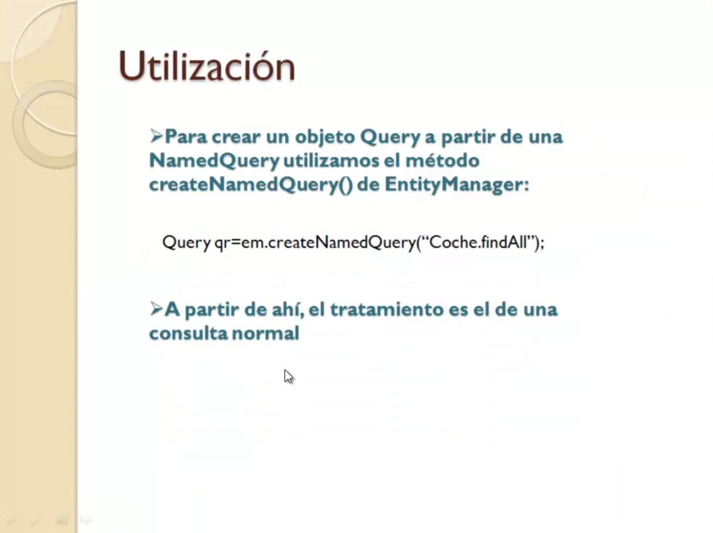

Y cómo la utilizamos después en un programa dentro de un método de la Lógica de Negocio donde queremos utilizar esa consulta, pues a través del método `createNamedQuery` del `EntityManager`.  A `createNamedQuery` simplemente le tenemos que indicar el nombre de la consulta que queremos obtener `Query qr = em.createNamedQuery("Coche.findAll");` y a partir de ahí nos devolverá el objeto `Query` asociado, es decir en lugar de utilizar directamente la instrucción simplemente hacemos referencia a su nombre. Una vez que tenemos el objeto `Query` o
`TypedQuery` que también podemos utilizarlo

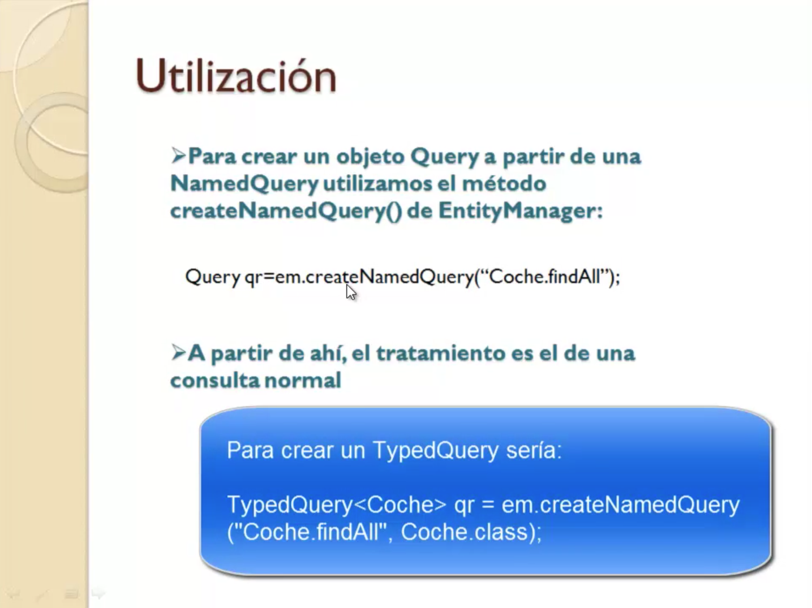

Podemos crear un `createNamedQuery` y generar un objeto del tipo `TypedQuery` y lo utilizaríamos como una consulta normal, es decir con `qr.getResultList()`, `qr.getSingleResult()`, etc. 

# 15 Ejercicio práctico II 13:06

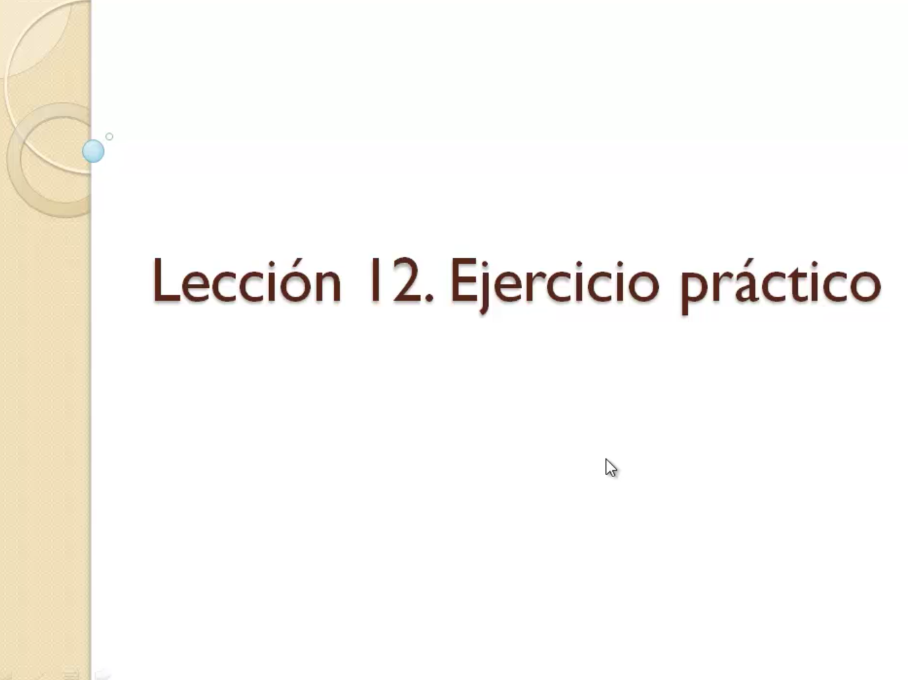

A continuación vamos a poner en práctica el uso de las NamedQuery en una nueva versión del ejercicio de la agenda de contactos.

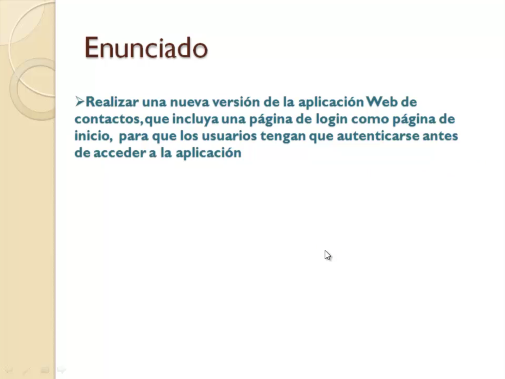

En esta nueva versión vamos a incluir una página de autenticación que solicitará los credenciales del usuario para poder tener acceso al menú de opciones de alta de contacto y visualización de contactos.

Para ello vamos a tener que crear en la base de datos una nueva tabla, como pudiste ver anteriormente pues yo ya tenía esa tabla creada se trata de la tabla `usuarios` y es una tabla que simplemente va a contener tres campos:

* `idUsuario`
* `usuario`
* `password`

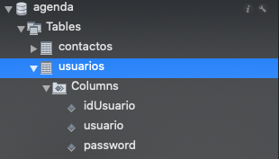

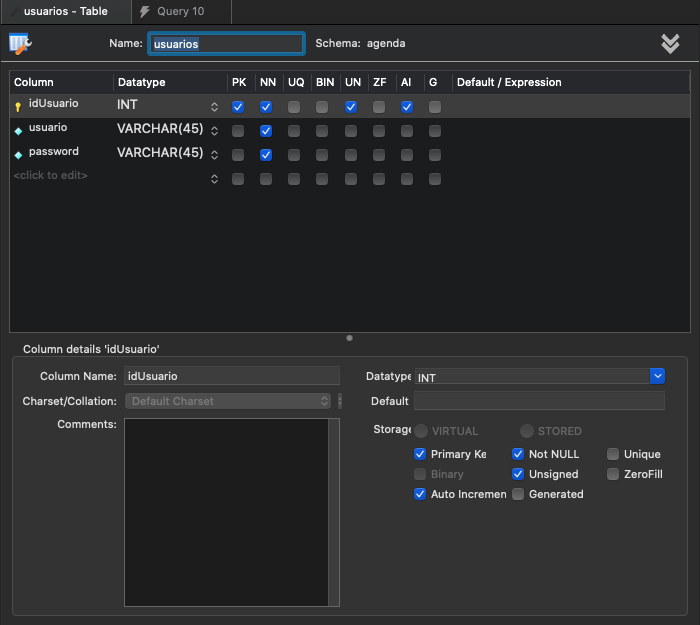

Los campos `usuario` y `password` son ambos de tipo texto con un campo Primary Key `idUsuario`  numérico que permite identificar las combinaciones de usuario y password en la base de datos. Bueno pues esto es sencillo de crear y una vez que ya disponemos de esta tabla vamos a Eclipse y para crear una nueva versión del ejercicio lo que hacemos es, no hace falta que creemos un proyecto nuevo, sino que podemos copiar y pegar el anterior que ya tenemos y renombralo como `615-03_web_jpa`
.

Si intentamo ejeccutar este nuevo proyecto sin más nos marca lo siguiente:

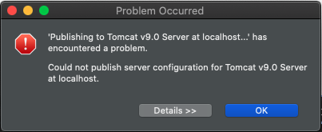

Muy importante a la hora de hacer esto con una aplicación Web, copiar y pegar un proyecto porque aunque nosotros hemos renombrado el mismo y le hemos dado un nombre al proyecto, lo que es la dirección de la aplicación Web no ha cambiado sigue siendo la misma que la del ejercicio `615-02_web_jpa`.

Eso significa que si nos disponemos a probar esta aplicación no vamos a poder hacerlo en el Tomcat, puesto que como ya tenemos desplegada una con la misma dirección que es `615-02_web_jpa` al intentar probar esta nos va a dar un error como ya hemos visto.

Simplemente para solucionar ese problema nos iríamos a las propiedades de este proyecto que hemos copiado y seleccionar la opción `Web Proyect Settings`

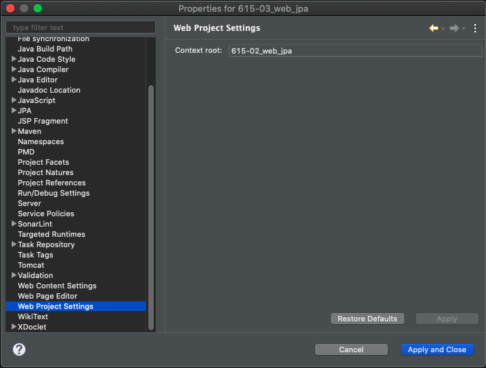

Vemos como en `Context root:` sigue poniendo `615-02_web_jpa` simplemente lo cambiamos con la nueva dirección que queramos asociarle a esta aplicación.

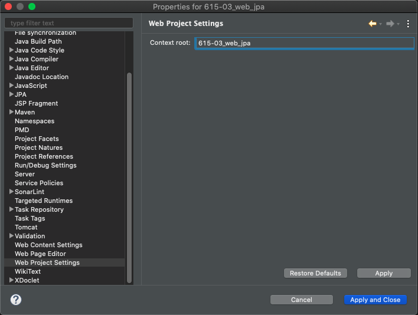

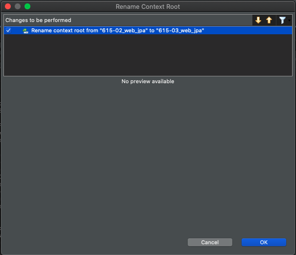

Una vez hecho esto nuestra aplicación ya se ejecuta correctamente.

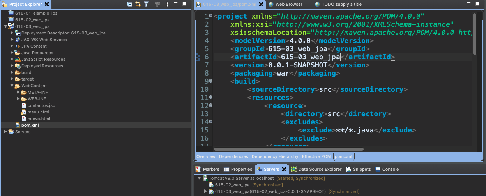

Lo que tenemos que hacer ahora es crear una nueva Entidad asociada a la tabla de usuarios que hemos creado, es la Entidad que vamos a utilizar para autenticar los usuarios desde la Lógica de Negocio de la aplicación.

Como ya tenemos la característica JPA aplicada en el proyecto, también tenemos las librerías añadidas que necesitamos del motor de persistencia, simplemente nos vamos a la opción JPA Tools - Generate Entities from Table ..., generar entidades desde tablas

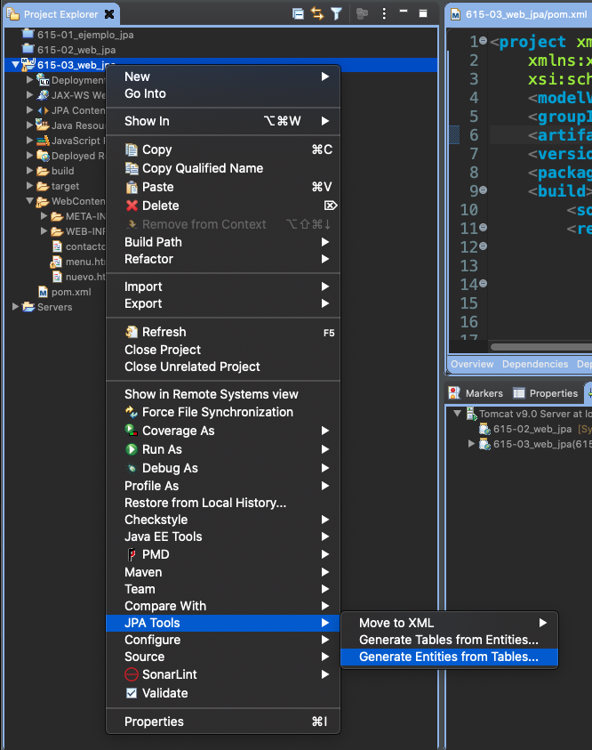

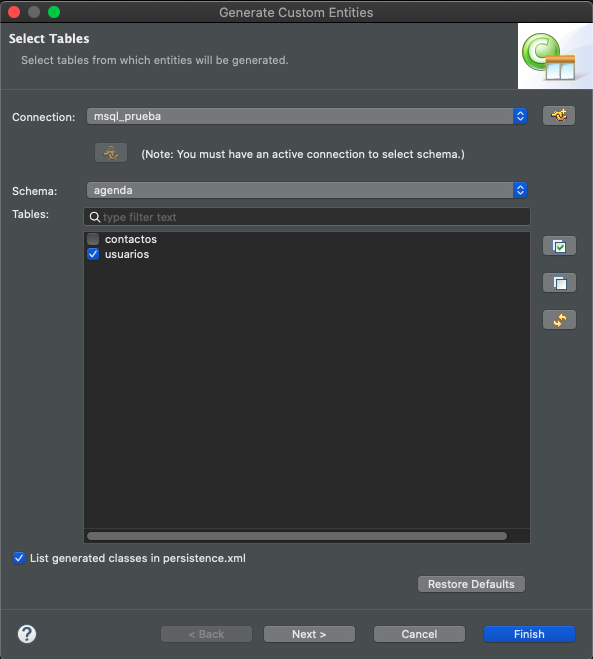

Seleccionaremos la conexión que ya tenemos creada del ejercicio anterior `msql_prueba`, seleccionariamos la base de datos (Schema) `agenda`, al elegir la base de datos `agenda` nos aparecen las dos tablas, nosotros vamos a crear una entidad de la tabla `usuarios`.

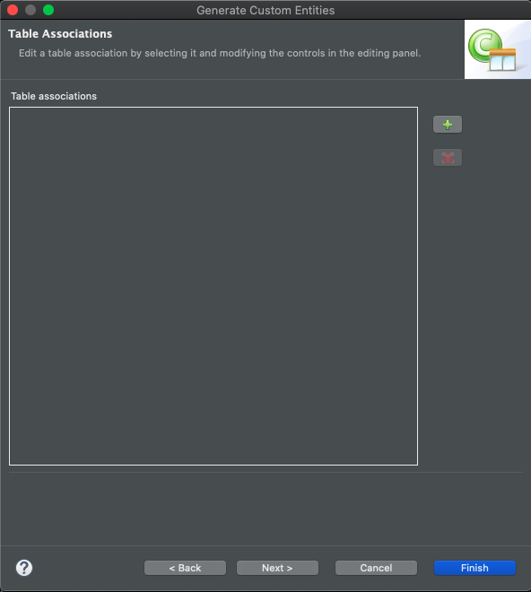

no haya asociaciones

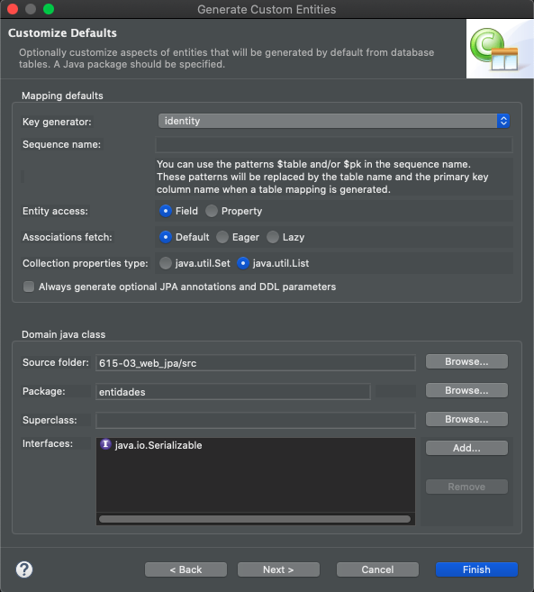

en el paquete pues aparecerán por defecto lo último que hemos utilizado, paquete  `entidades`, Key generated con `identity` estos valores nos valen


y el último paso como resumen nos va a decir que la clase se va a llamar `Usuario`, efectivamente es como queremos que se llame, pues nada más finalizamos.

Se crea la clase `Usuario`

```java
package entidades;

import java.io.Serializable;
import javax.persistence.*;


/**
 * The persistent class for the usuarios database table.
 * 
 */
@Entity
@Table(name="usuarios")
@NamedQuery(name="Usuario.findAll", query="SELECT u FROM Usuario u")
public class Usuario implements Serializable {
	private static final long serialVersionUID = 1L;

	@Id
	@GeneratedValue(strategy=GenerationType.IDENTITY)
	private int idUsuario;

	private String password;

	private String usuario;

	public Usuario() {
	}

	public int getIdUsuario() {
		return this.idUsuario;
	}

	public void setIdUsuario(int idUsuario) {
		this.idUsuario = idUsuario;
	}

	public String getPassword() {
		return this.password;
	}

	public void setPassword(String password) {
		this.password = password;
	}

	public String getUsuario() {
		return this.usuario;
	}

	public void setUsuario(String usuario) {
		this.usuario = usuario;
	}

}
```

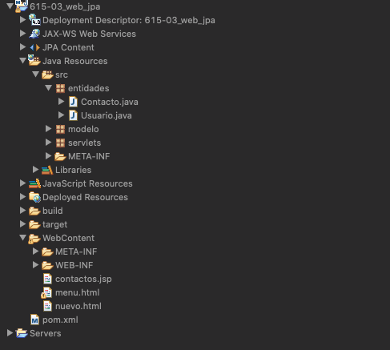

Tenemos aquí ya nuestras dos entidades, `Contacto` la estamos utilizando en la Lógica de Negocio que ya teníamos y la nueva `Usuario`.

Una cosa muy importante es que en `persistence.xml` si lo abrimos tenemos:

```html
<?xml version="1.0" encoding="UTF-8"?>
<persistence version="2.2" xmlns="http://xmlns.jcp.org/xml/ns/persistence" xmlns:xsi="http://www.w3.org/2001/XMLSchema-instance" xsi:schemaLocation="http://xmlns.jcp.org/xml/ns/persistence http://xmlns.jcp.org/xml/ns/persistence/persistence_2_2.xsd">
	<persistence-unit name="615-02_web_jpa" transaction-type="RESOURCE_LOCAL">
		<class>entidades.Contacto</class>
		<class>entidades.Usuario</class>
		<properties>
			<property name="javax.persistence.jdbc.url" value="jdbc:mysql://localhost:3306/agenda"/>
			<property name="javax.persistence.jdbc.user" value="root"/>
			<property name="javax.persistence.jdbc.password" value="root"/>
			<property name="javax.persistence.jdbc.driver" value="com.mysql.jdbc.Driver"/>
		</properties>
	</persistence-unit>
</persistence>
```

Se ha registrado automáticamente la nueva entidad `Usuario`, pero lo que vamos a hacer es que lo vamos a cambiar el nombre a la unidad de persistencia porque coge como nombre por defecto el nombre del proyecto `615-02_web_jpa` y aquí sólo hemos cambiado al nombrarlo lógicamente esto no me lo ha cambiado. Entonces lo vamos a cambiar por `615-03_web_jpa` y este mismo nombre lo utilizaremos en la Capa del Modelo en `Gestioncontactos` donde obteníamos el `EntityManagerFactory`.

```java
//Método que permite obtener el objeto EntityManager
private EntityManager getEntityManager() {
   EntityManagerFactory factory = Persistence.createEntityManagerFactory("615-03_web_jpa");
   return factory.createEntityManager();
}
```

Bueno pues ahí lo dejamos ya cambiado para que luego no se nos pase y no nos dé errores al intentar crear el `EntityManager`.

Antes de meternos con la Lógica de Negocio como hemos dicho queremos utilizar las `NamedQuery` en esta ocasión para poder hacer la autenticación de los usuarios, entonces nos vamos a crear una `NamedQuery` en esta entidad `Usuario` que será la que utilicemos desde la Lógica de Negoción.

Como sabés ya Eclipse genera una por defecto que recoge todas las entidades de ese tipo, la vamos a dejar pero como vamos a incluir una nueva habrá que incluir también la anotación `@NamedQueries`.

```java
@Entity
@Table(name="usuarios")
@NamedQueries({
   @NamedQuery(name="Usuario.findAll", query="SELECT u FROM Usuario u"),
   @NamedQuery(name="Usuario.findByUserAndPwd", query="SELECT u FROM Usuario u Where u.usuario=?1 and u.password=?2")
})
``` 

Aquí aparecen entre paréntesis y llaves la lista de entidades que queremos incluir dentro de la `@NamedQueries` tenemos la creada automaticamente por Eclipse y hemos añadido la nueva `NamedQuery` es costumbre nombrar al `NamedQuery` con el nombre de la entidad y luego el nombre de lo que hace la consulta, eso evita que se puedan duplicar nombres de `NamedQuery` en diferentes entidades, al ponerle el nombre de la entidad adelante eso no va a ocurrir.

Ya tenemos `NamedQuery`, ahora será cuestión de utilizarla en la Lógica de Negocio entre un nuevo método que vamos a añadir para autenticar usuarios.

Tenemos dos opciones o incluirlo el método dentro de la clase `GestionContactos` o como esto se trata de manipular otra entidad diferente, quizá sería conveniente para no tener todos los métodos en la misma clase, incluir a una nueva clase dentro de la Lógica de Negocio que llamemos por ejemplo `GestionUsuarios` que es lo que vamos a hacer.

Vamos a crear una nueva clase dentro del paquete `modelo` que vamos a llamar así `GestionUsuarios`.

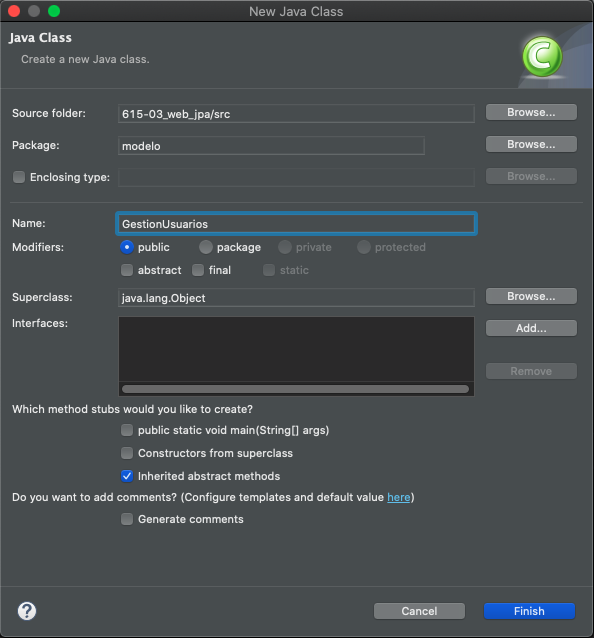

```java
package modelo;

public class GestionUsuarios {

}
```

ya la tenemos dentro del paquete modelo y en esa clase incluiremos lo siguiente:


```java
package modelo;

import javax.persistence.EntityManager;
import javax.persistence.EntityManagerFactory;
import javax.persistence.Persistence;
import javax.persistence.TypedQuery;

import entidades.Usuario;

public class GestionUsuarios {
   // método que permite obtener el objeto EntityManager
   private EntityManager getEntityManager() {
      EntityManagerFactory factory = Persistence.createEntityManagerFactory("615-03_web_jpa");
      return factory.createEntityManager();
   }

   public boolean autenticar(String usuario, String pwd) {
      EntityManager em = getEntityManager();
      boolean res = false;
      TypedQuery<Usuario> qr = em.createNamedQuery("Usuario.findByUserAndPwd", Usuario.class);
      qr.setParameter(1, usuario);
      qr.setParameter(2, pwd);
      try {
         qr.getSingleResult();
	 res = true;
      } catch (Exception ex) {
         ex.printStackTrace();
      }
      return res;
   }
}
```

En esta clase `Usuario` tenemos el método privado `getEntityManager()` como en la clase `Contacto` que permite obtener el objeto `EntityManager`, usa el nombre de la nueva Unidad de Persistencia es decir `615-03_web_jpa`

Ahora vamos a analizar el método autenticada el método `autenticar(String usuario, String pwd)` lo hemos puesto para que reciban lógicamente el usuario y el password que tiene que comprobar y nos devuelva si existe o no existe. Entonces creamos el `EntityManager` en base a nuestro método privado `getEntityManager()` creado previamente. Creamos un `TypedQuery` utilizando el `em.createNamedQuery("Usuario.findByUserAndPwd", Usuario.class);` por que partimos de la `NamedQuery Usuario.findByUserAndPwd` de tipo `Usuario` y sustituimos los parámetros el uno con el parámetro usuario que recibe el método autenticar y el segundo con el segundo parámetro del método autenticar, como esperamos un único resultado llamamos a `getSingleResult()`, fíjate lo que hemos hecho aquí, la llamada de `getSingleResult()` la hemos metido dentro de un bloque `try-catch`porque qué ocurre si no encuentra ninguna combinación de usuario, `getSingleResult()` no nos va a devolver `null` sino que va a provocar una excepción de que no encuentra, al no encontrarlo resulta una excepción, de la misma manera que si encontrase más de uno también provocaría una excepción, entonces realmente no nos interesa recoger el valor simplemente si da excepción o no, no la da, pues entonces es que la ha encontrado, había un único resultado que coincide con esa combinación de usuario-password, asignamos `true` a `res`, que no se producirá una excepción, simplemente le he dicho que me lo muestre la traza, por si acaso hay algún problema poder verlo. Pero una vez que se pusiera en producción no sería nada directamente retornaría falso, no ha entrado en el try por lo tanto retorna false que es el equivalente a decir que no la he encontrado.

Pues ya tenemos nuestra lógica de negocio hecha utilizando en este caso como ves una `NamedQuery` y esta `NamedQuery` podría utilizarse en cualquier otro método donde fuera requerida, donde fuera interesante utilizarla.

Ya solamente quedaría hacer ahora la parte del Controlador y la Vista. Para el Controler vamos a añadir dentro del paquete `servlets` la clase `LoginAction`.

```java
import java.io.IOException;

import javax.servlet.ServletException;
import javax.servlet.annotation.WebServlet;
import javax.servlet.http.HttpServlet;
import javax.servlet.http.HttpServletRequest;
import javax.servlet.http.HttpServletResponse;
import javax.servlet.http.HttpSession;

import modelo.GestionUsuarios;

/**
 * Servlet implementation class LoginAction
 */
@WebServlet("/LoginAction")
public class LoginAction extends HttpServlet {
   private static final long serialVersionUID = 1L;

   /**
   * @see HttpServlet#service(HttpServletRequest request, HttpServletResponse response)
   */
   protected void service(HttpServletRequest request, HttpServletResponse response) throws ServletException, IOException {
      String user=request.getParameter("user");
      String pwd=request.getParameter("pwd");
      GestionUsuarios gusuarios=new GestionUsuarios();
      if(gusuarios.autenticar(user, pwd)){
         //guardamos el nombre de usuario en un atributo de sesión
         HttpSession s=request.getSession();
         s.setAttribute("user", user);
         request.getRequestDispatcher("menu.html").forward(request, response);
      }else{
         request.getRequestDispatcher("login.html").forward(request, response);
      }
   }
}
```

`LoginAction` de lo que se encarga de decirnos que nos hemos autenticado, nos guarda el usuario en un atributo de sesión y nos lleva a a la página de menú.

Y dentro de `WebContent` vamos a incluir el archivo `login.html`.

```html
<!DOCTYPE html>
<html>
<head>
<meta charset="ISO-8859-1">
<title>Insert title here</title>
</head>
<body>
   <form action="Controller?op=doLogin" method="post">
      Usuario:<input type="text" name="user"/><br/>
      Contraseña:<input type="password" name="pwd"/><br/>
      <input type="submit" value="Enviar"/>
   </form>
</body>
</html>
```

Eso sí habría que añadir en el `Controller` una una nueva entrada más en el caso de que el valor del parámetro sea `doLogin` que es lo que manda la página HTML de login, la `url` a la que habría que mandar al usuario es a ese nuevo servlet que hemos incluido.

```java
case "doLogin":
   url = "LoginAction";
   break;
```

Y con esto ya estaría entonces vamos a comprobar que efectivamente funciona. A nivel de librerías no hay nada que hacer porque ya tenemos añadidas las librerías a través de Maven como lo hicimos en el ejercicio anterior. 

Tenemos los siguientes usuario ya creados en la tabla usuarios para probar con ellos.

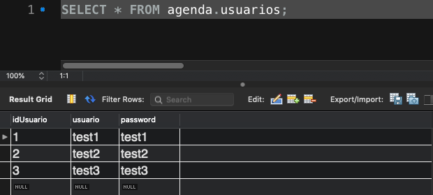

Vamos a ejecutar el proyecto iniciando en la página de login.

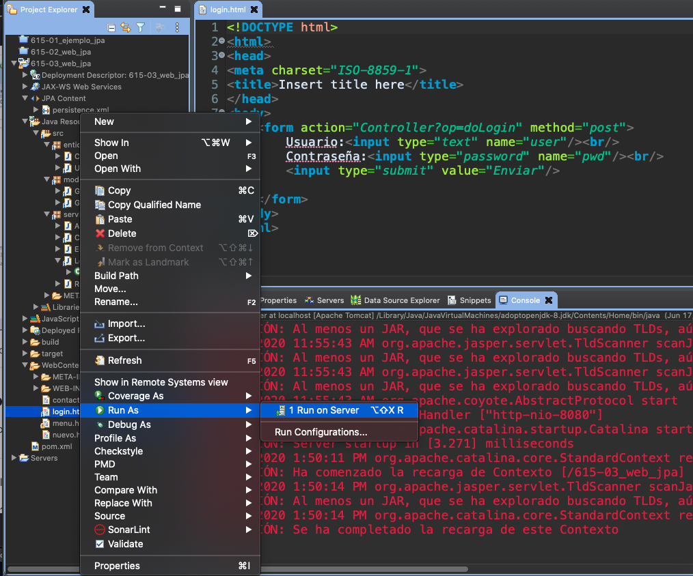

Se nos carga la página login para poder ingresar losa datos de usuario y password

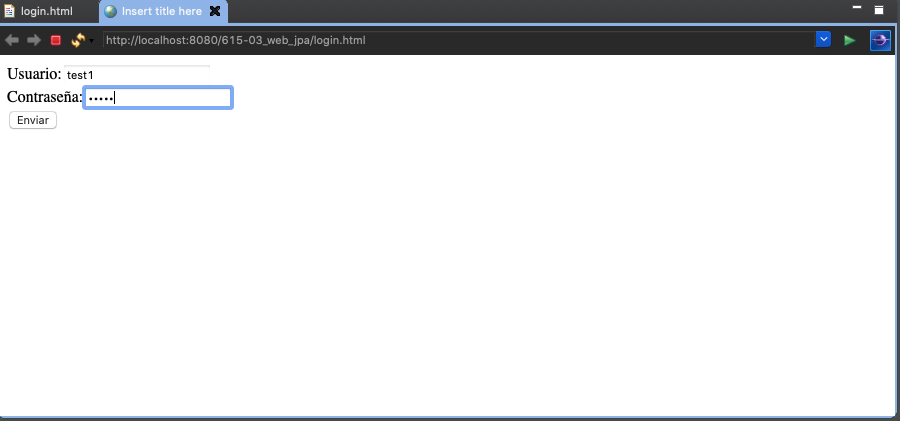

presionamos el botón Enviar y efectivamente nos lleva al menú.

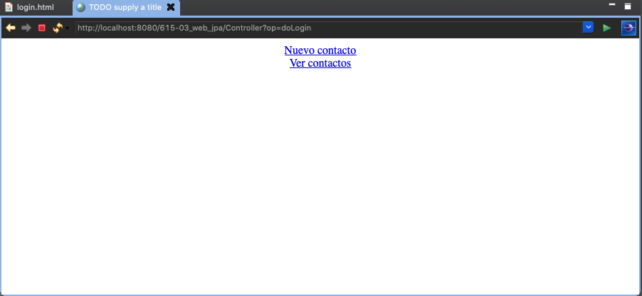

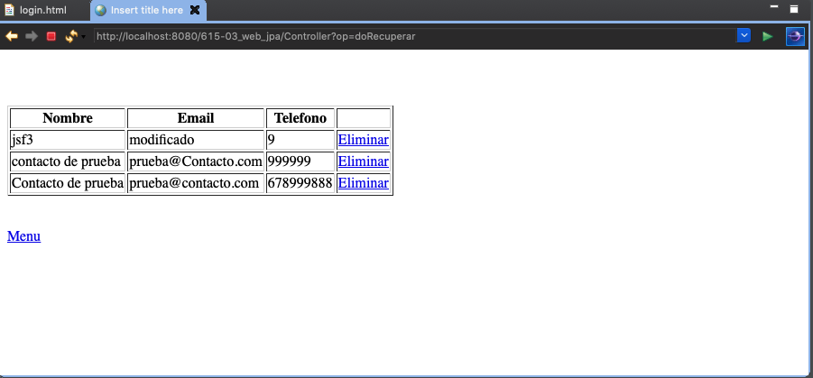

Bueno pues esto sigue funcionando exactamente igual.

Pero que habría pasado si hubieran metido un usuario que no está registrado, se produciría la excepción, devolvería `false` y en este caso lo que se ha previsto es que se quede donde está, en la propia página de login.

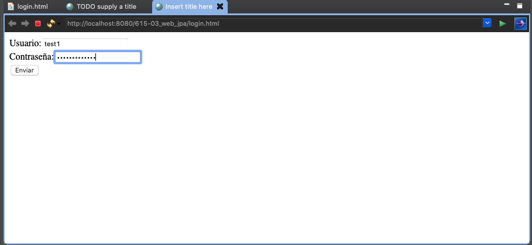

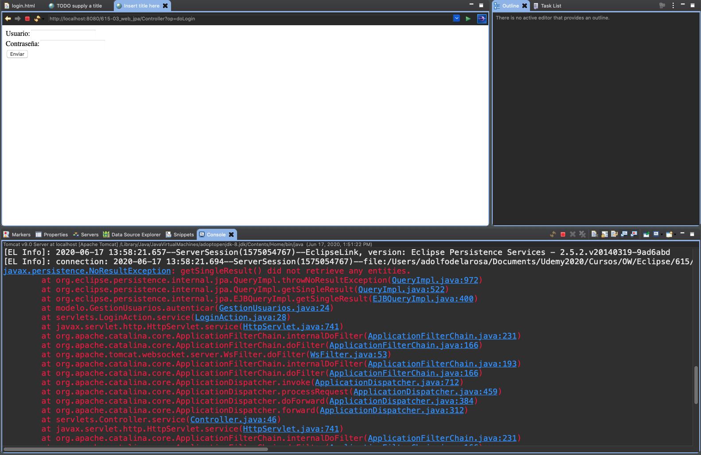

Fíjate que aquí da una traza de error de excepción que es la traza que yo le he dicho que me mostrase, la llamada `getSingleResult() did not retrieve any entities.` al no devolver ninguna entidad se produce esa excepción.

El caso es que aquí ya hemos visto una utilización de las `NamedQuery` dentro de la Entidad `Usuario` y se pueden usar tantas `NamedQuery` en tantas Entidades, como se desee, es recomendable a pesar de que no se vayan a reutilizar `NamedQuery` puesto que si luego queremos cambiar por ejemplo en el caso de la entidad Contacto cuando teníamos la Lógica de Negocio la opción de `buscarContactos`


```java
public Contacto buscarContactos(String email){
   EntityManager em = getEntityManager();
		
   String jpql = "Select c From Contacto c Where c.email = ?1";
   TypedQuery<Contacto> qr = em.createQuery(jpql, Contacto.class);
   qr.setParameter(1, email);
   //return qr.getSingleResult();
   return qr.getResultList().get(0);
}
```

Aquí utilizamos una Query normal con sus parámetros y demás. Bueno pues también sería conveniente haber puesto esta instrucción como una `NamedQuery` pues aunque sólo la vamos a utilizar aquí, pero sí prevemos hacer algún cambio, modificar alguna cosa, en vez de volvernos locos buscandola en la Lógica de Negocio, al estar localizadas perfectamente dentro de la Entidad, cualquier cambio que hagamos ya sabemos que tenemos que ir a ese punto a hacer el retoque correspondiente.

# 16 Consultas de acción 04:38


A través de un objeto Kúbera también podemos lanzar consultas de acción sobre una capa de persistencia.

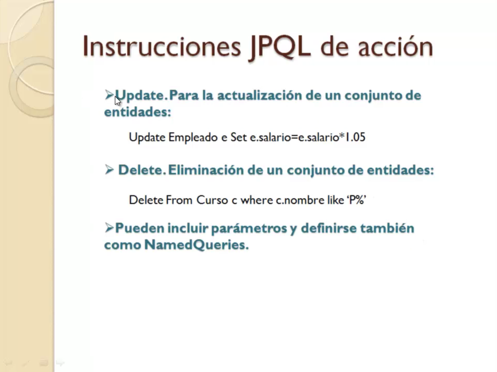

Las instrucciones JPQL para este caso serían útil para actualización de un conjunto de entidades en función de un criterio o de ley para su eliminación.

En el caso de Udai la sintaxis sería como tienen aquí en este ejemplo sería el nombre de la entidad alias sheet pues las establecimientos que veíamos hacer a los nuevos valores de los diferentes atributos de la entidad en función de alguna condición.

Por ejemplo en este caso actualizaría los salarios de todos los empleados no hemos utilizado este caso ninguna cláusula en cuanto a la eliminación.

La sintaxis sería delete from nombre de la entidad alias web y la condición que afectaría a alguno de los atributos de la entidad en estos tipo de instituciones JPQL como la de selección pueden incluir parámetros y definirse también como escuelas para ejecutarlas.

Pues crearemos una vez creado el objeto Query a través del manager utilizando create qwerty o atenerme.

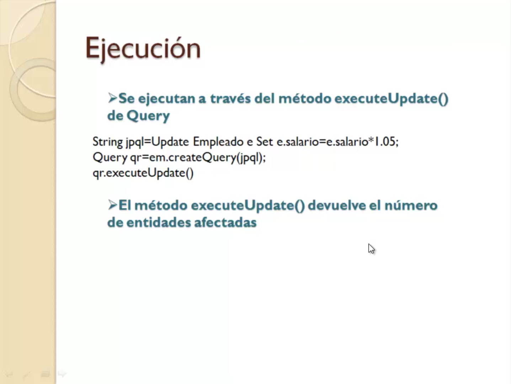

Si lo hemos definido como una Anam Mercuri utilizaremos el método execute este método se lanzaría la instrucción contra la capa de persistencia y nos devolvería el número de entidades que se han visto afectadas.

Por ejemplo si en nuestro ejercicio de la agenda de contactos quisiéramos añadir por ejemplo la posibilidad de eliminar todos los contactos a partir de un determinado email que coincidan con un determinado email o los que sean pues deberíamos ir a la capa de modelo la capa de persistencia porque lo vamos a definir como una name cuerito.

Por ejemplo en contacto definiríamos una Mercuri dejando la que ya viene Mamet la que ya viene definida que sería la de búsqueda de todos los crearíamos ésta no van a Mercuri y por lo tanto habría que definirlo dentro de una notación Gamez cueritos tenemos esto ya.

Como digo ya definida y esto respondíamos a continuación de esta guiñar esto y en este caso la llamaríamos de BAII y.

La idea sería pues un veleto con gastos 14 Wer una condición de punto y mail igual y la vamos a parametrizar sería una gran descubri parametrizada entonces a partir de ahí no seríamos mail a gestión contactos y ahí añade añadiríamos un nuevo método Bobbit eliminar contacto o contactos por email recibiríamos como parámetro el mail y procederemos a la eliminación llamando a esa usando utilizando sondas Mercuri para llamar al método Scutum deuda a través del objeto.

En cualquier caso tendríamos que obtener el Entity ayer el objeto Ueli a través del método create retendrán mezclarían y indicaremos el nombre de dicha Merkel contacto del voy y me vale este sea el nombre de la Lamec crearíamos con el objeto Ueli y antes deberíamos importar si están en antes deberíamos iniciar la transacción o obtener la transacción iniciarla debemos copiar estas instrucciones no las tenemos sean las mismas que en el resto de los métodos haríamos un Beguin de la transacción y ahí procederemos a llamar al execute si no nos interesa el número de filas que se 
han visto filas de entidades que se han visto afectadas pues no recogeremos el valor y simplemente lanzaremos la llamada para posteriormente hacer un cómic esto sería una manera de utilizar una consulta JPQL de.

# Autoevaluacion III 00:54


Autoevaluacion III

 

1. Indica cual de las siguientes instrucciones JPQL sería la correcta para recuperar las entidades de tipo Alumno cuya propiedad nota sea superior a 5:
   * `Select a From Alumno a where a.nota>5`
   * `Select Alumno a where a.nota>5`
   * `Select a From Alumno a where nota>5`
   * `Select Alumno From Alumno a where Alumno.nota>5`
   
2. Indica cual de las siguientes afirmaciones sobre las consultas de tipo NamedQuery es falsa:
   * La instrucción JPQL se define en la propia entidad
   * El objeto Query se debe crear a través de createNamedQuery()
   * Pueden ser reutilizadas desde diferentes métodos de la aplicación
   * Solo pueden incluir parámetros por nombre, no por posición

3. ¿Qué sucede si al llamar a getSingleResult() de Query la consulta devuelve más de un resultado?
   * Se produce una excepción
   * Se devuelve el primer resultado encontrado
   * Se devuelve null
   * Se devuelve un array con todos los resultados encontrados

4. Para asignar el valor 20 al parámetro de posición 1 de una query debemos de utilizar la instrucción:
   * `q.setParameter(0,20);`
   * `q.setParameter(1,20);`
   * `q.setIntParameter(20,1);`
   * `q.setIntParameter(20,0);`

5. Indica cual de las siguientes afirmaciones sobre las consultas JPQL de acción es verdadera:
   * Se ejecutan a través del método executeAction() de Query
   * No pueden incluir parámetros
   * N o pueden definirse como NamedQueries
   * Deben ejecutarse dentro de una transacción
 
SOLUCIONES:

1.- A

2.- D

3.- A

4.-B

5.- D
