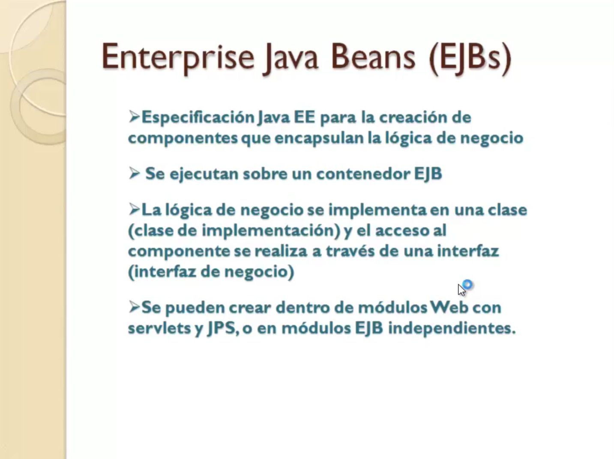
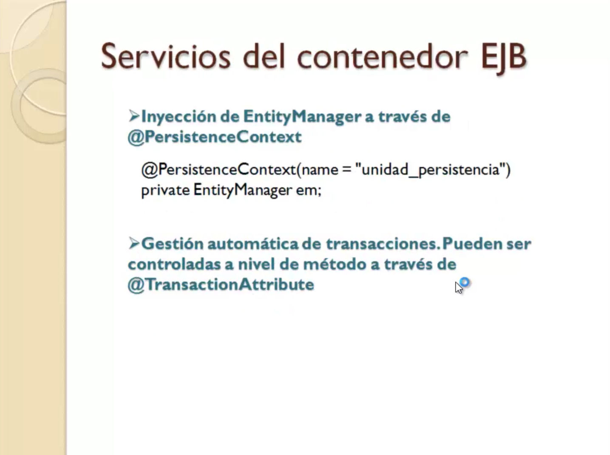
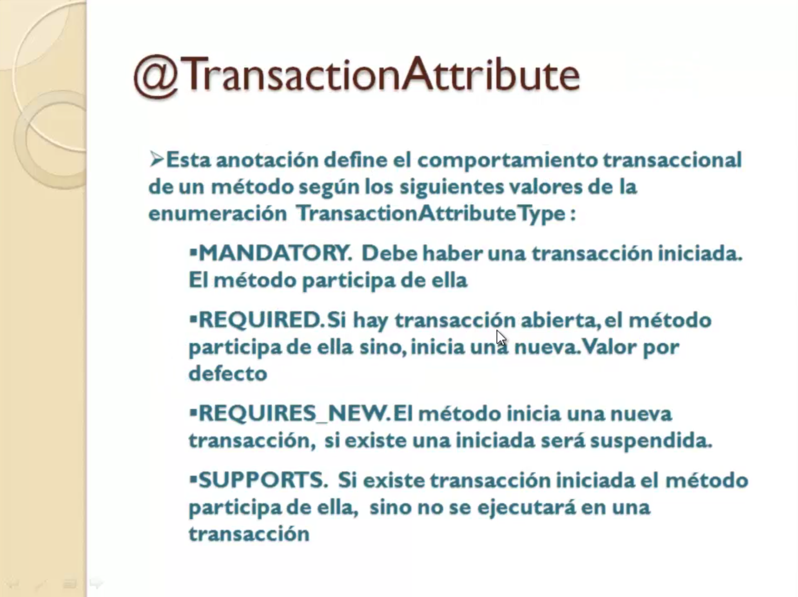
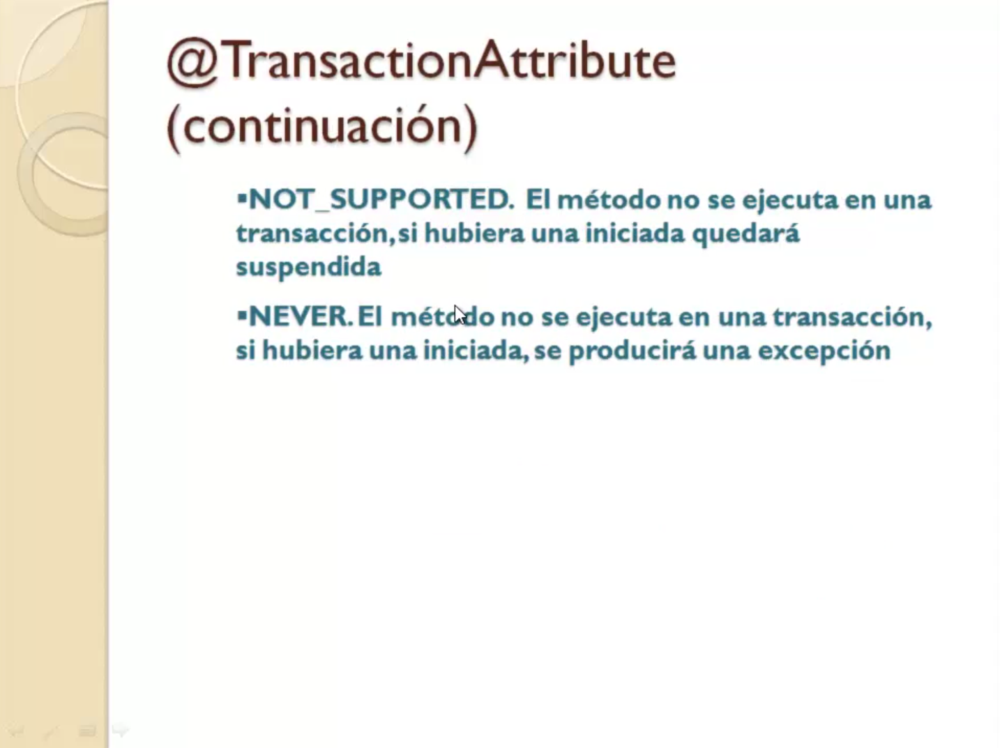
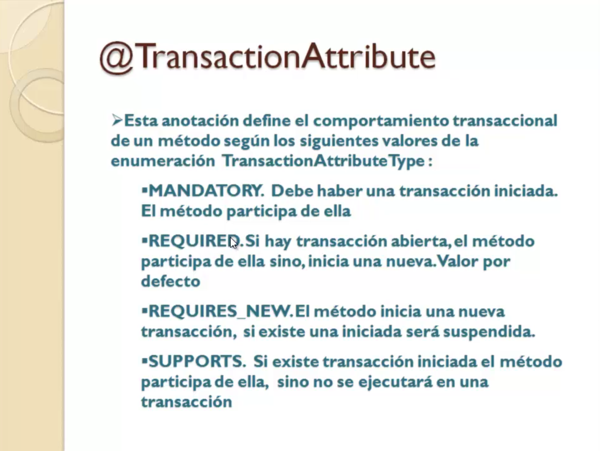

# 5. JPA en EJBs 39:50

* 17 Utilización de JPA con Enterprise JavaBeans 04:42
* 18 El servidor Glassfish 05:11
* 19 Creación de un DataSource 11:20
* 20 Ejercicio práctico III 17:57
* Autoevaluación IV 00:40

# 17 Utilización de JPA con Enterprise JavaBeans 04:42

Aunque los ejemplos vistos hasta el momento hemos utilizado JPA dentro de clases normales Java es muy habitual encapsular toda la lógica de negocio en muchas aplicaciones empresariales dentro de los llamados Enterprise Linux o en JBS y qué es exactamente un JB interpelaba JB O interpretã Babin es una especificación que forma parte de Java para la creación de componentes que encapsula la lógica de negocio de una aplicación.

Estos componentes no se ejecutan directamente sobre la máquina virtual Java como una clase normal sino que se ejecuta sobre un contenedor JB formaría parte del servidor de aplicaciones y que proporciona una serie de beneficios a la hora de implementar esa lógica de negocio.

La lógica de negocio como tal realmente se va a crear en clase es decir crear un JB No es muy diferente a crear una clase normal Java lo único que también se exponen los métodos a través de una interfaz Conci interfaz de negocio que es lo que realmente utilizan los clientes es decir la capa del controlador o serlo por ejemplo para poder acceder a esa lógica de negocio no accede directamente a la clase sino que lo hace a través de la interfaz de negocio para que sea el contenedor el que gestione directamente la clase y proporcione beneficios que ahora vamos a comentar brevemente los que nos interesan realmente de cara a JPA.

Un entorno de Java se puede crear dentro de un módulo web con los JSP como hemos visto hasta ahora con las clases normales o en módulos independientes para que puedan ser reutilizados de muchas aplicaciones bien como te decía el contenido del JB proporciona una serie de servicios que benefician al programador a la hora de realizar determinadas tareas que no va a tener que programar.

En lo que a nosotros nos concierne es decir de cara a implementar la lógica de negocio con JPA dentro de un JB Pues esos beneficios son inyección de dependencia y gestión automática de transacciones.

Qué es eso de inyección de dependencia.

Bueno pues que el objeto en Titelman ayer que nosotros hemos creado hasta ahora de código persistan Factory etcétera.

Pues ya si lo implementamos toda esa lógica dentro de un contenedor JB No vamos a tener que crear esas instrucciones a través de esta notación le vamos a decir al contenedor JB de que unidad de persistencia queremos obtener el intiman ayer y ya se encargará él de hacer todo el proceso de inyectarlo crear el objeto inyectarlo.

Esta variante es decir eso va a suponer un ahorro de código pero no sólo eso también la gestión automática de transacciones es decir el contenedor JB se va a encargar de a nivel de cada método de negocio iniciar una transacción confirmarla o rechazarla si se produce alguna excepción en tiempo de ejecución.

Por lo tanto lo de Transaction iniciar conversaciones con el Beguin confirmarlas es algo que también nos vamos a poder ahorrar desde Kodi puesto que como digo se van a gestionar automáticamente con el contenedor controlándolo eso sí a través de una anotación arroba transaction a tribute que vamos a utilizar a nivel de cada método para indicar cómo queremos que se comporte nuestro método a nivel de transacciones.

Existen distintos valores que se pueden asignar a esa anotación atraes que están definidos dentro de una serie de constantes en la numeración transaction a tributarle como por ejemplo mandatory que indicaría que para poder ejecutar ese método debe haberse ya iniciado una transacción anteriormente y que el método anticipará de esa transacción required.

Y es que si hay una transacción el método va a participar en ella y si no iniciará una nueva y algunos más que tenemos aquí resumidos en los seis posibles valores que puede tomar esa anotación.

Anotación que por otro lado no va a ser obligatorio incluir a nivel de cada método puesto que hay un valor por defecto es precisamente Recuay.

Es decir cuando se hace un llamado método JB Si hay una transacción ya iniciada por el cliente derecho la llamada pues ese método participará dentro de la transacción y si no se encargará el contenedor de iniciar una nueva y confirmarlas final.

Por lo tanto eso significa que nuestro método siempre va a estar todas las instrucciones dentro de una transacción y por lo tanto no será necesario que nosotros explicitamente las iniciemos como hemos hecho hasta ahora.

Bien pues vamos a ver después en el siguiente vídeo vamos a explicar cómo configurar nuestro entorno de desarrollo para trabajar con JB y a continuación veremos una nueva versión de la agenda de contactos implementada con Interplay Jabari.

# 18 El servidor Glassfish 05:11

El servidor de aplicaciones Tomcat que hemos utilizado los ejemplos que hemos creado hasta el momento en aplicaciones web no incluye contenedores JB.

Es por eso que necesitamos descargar e instalar un servidor que incluya este contenedor en nuestro caso.

Vamos a ver cómo trabajar con Graphics el servidor glacis incluye un contenedor JB y lo podemos descargar de esta dirección.

Una vez descargado y descomprimido puesto que se distribuye como un zip lo tendremos que registrar en Eclipse.

Lo que pasa es que el eclipse tal cual lo hemos descargado las primeras lecciones se ha seguido los pasos que yo te he explicado hasta el momento y no has incluido ninguna otra cosa más o no ya no lo tenían ya creado Deantes o instalado de antes pues probablemente vas a necesitar este plugin.

Las fístulas que ahora mismo te explicaré también cómo descargarlo e instalarlo.

Lo primero vamos a descargar el servidor donde nos vamos a ir a la dirección que aparecía en la transparencia.

Y entraremos en la web de pallar Zapallar.

Es una implementación completa del servidor Goldsmiths que podemos descargarla pulsando este botón paliará Server al pulsarlo por bueno nos va a pedir que descargamos el archivo zip lo descargamos lo descomprimir en la carpeta donde queramos tenerlo y descomprimir.

Se creará una carpeta XLI dentro de la cual tendremos una carpeta Goldfish que corresponde con el directorio raíz de nuestro servidor de aplicaciones.

Ahí dentro ya tienen las carpetas propias de Blacklist.

Una vez que ya lo tenemos descargado comprimido nos vamos a Eclipse.

Y qué tenemos que hacer en Eclipse registrarlo.

En principio tenemos que seguir los mismos pasos que seguimos para registrar el servidor Tomcat es decir en Server run their environment alegué.

Qué ocurre.

Pues que estas opciones que aparecen aquí por ejemplo la categoría Goldfish aquí no aparecerá porque no me he instalado ya el plugin y como te decía es necesario instalar el club inglãs fístulas para poder disponer de esta opción y que nos permita registrar graffitis entonces antes de intentar registrarlo nos vamos a ir a Angel Eclipse marketplaces y ahí vamos a buscar la pulsamos el botón de búsqueda y nos aparecerá Blás fístulas aquí.

Aquí me aparece el botón instales recién instalado que aparecerá al instar para que instales pulsas el botón y sigues todos los pasos con las opciones por defecto hasta el final tras instalar las fístulas te pedirá reiniciar Eclipse se reinicia y una vez reiniciado es muy Preferences.

Ahora sí si nos vamos a server Rutten environments al cursará desde ya tendrás la carpetita Classic con la opción para registrar el cuadro que tengo yo también registres.

Pero bueno te aparecerá glacis IV que es la versión de gráficos que vamos a instalar además el paliará incluye Régis 4.1.

Bien pues nada nos al siguiente paso y aquí lo que nos va a decir es el nombre del servidor evidentemente 4 y la localización la localización en la carpeta esa donde hemos descomprimido fallará concretamente la que tiene como nombre Classic dentro de pallar entonces nos vamos a buscar al directorio donde vayamos descomprimido dentro del payada.

Esa es la carta estamos y está la dirección del servidor gráfico.

Aquí ya aparece por defecto la localización de JDK de Java que nos instalamos al principio del curso por lo que sea que aparece aparece una crucecitas que no lo encuentra loquesea pues a través de este botón nos iríamos a program fails Java JDK que es donde está.

Dónde lo vas a tener que tener instalado.

Bueno pues ya está ya tenemos nuestro servidor Playfish y ya vamos a poder utilizarlo en nuestros proyectos para ello bueno también habrá que registrarlo aquí como tenemos el Tomcat de la carpeta de servidores podemos seguir manteniendo Tomka un problema o lo podemos quitar si no queremos.

A partir de ahora vamos a usar las FITS en cualquier caso si lo dejamos por ejemplo para añadir el Raffi sería botón derecho y aquí elegiríamos mi ser nos pide otra vez de nuevo el tipo de servidor pero vamos a Rajoy Nargis 4 y ahora ya sabe dónde está simplemente no aparece aquí su nombre el nombre que se le dió cuando le registramos las 6 4 y en el siguiente paso pues aquí nos pica lo que llama el dominio donde está digamos a utilizar las que se dividen dominios entonces el dominio que va a utilizar para publicar nuestras aplicaciones usuario contraseña administrador dejamos estos valores por defecto nombre mi jornada y directamente ya finalizarlos y ya tenemos nuestro servidor también registrado pasado y ahora cuando vayamos a probar una aplicación podremos optar o bien por probarlo en Tomcat o en la siguiente ejercicio que vamos a ver en el siguiente vídeo.

Va a utilizar interpolar Babin que habrá que probarlo en este servidor.

# 19 Creación de un DataSource 11:20

Hasta ahora cuando teníamos que contestar con una base de datos proporcionamos los datos de conexión a la misma dentro de la propia aplicación.

En el caso de JPA concretamente dentro del persiste en XML ahora que vamos a utilizar JBoss necesitamos hacer uso del Sur es decir en vez de conectar directamente desde la aplicación a la base de datos las conexiones lo vamos a obtener a través de una tasó que aparte de ser más eficiente por la manera de los Interplay Babin gestionar las transacciones utilizan una API que interno que se llama JPA pues es necesario que si queremos delegar dicha gestión de transacciones en el tãbet el acceso a los datos se 
haga vía la tasó porque las conexiones directas no utilizan ese tipo de transacción y entonces no podríamos delegar la transaccionalidad en un tal bien.

Primero qué es exactamente un tesoro.

Es un objeto que vive dentro de los servidores de aplicaciones y que como decía proporciona conexiones a la base de datos para la aplicación.

Esas conexiones existen ya en un puzle de conexiones que se genera dentro del servidor de aplicaciones y que gestiona el propio data Sur y que ya contiene como digo conexiones hacia la base de datos con la que vamos a trabajar.

Cuando la aplicación en nuestro caso en JPA será el proveedor de persistencia necesite conexiones con la base de datos en vez de crearla directamente contra dicha base de datos se va a pedir en tal caso sur le cogerá una conexión del pulso y la entregará y cuando el proveedor de persistencia en nuestro caso termine de usar esa conexión se la devolverá al paso para que lo devuelvan.

Entonces es mucho más eficiente porque no hay que estar constantemente creando y cerrando conexiones sino que las conexiones ya están ahí y son gestionadas por el objeto batasuno.

Bien pues vamos a ver cómo crear un data Sur en el servidor de aplicaciones Goldfish que acabamos de instalar.

Para ello lo primero que tenemos que hacer vamos a la carpeta donde tenemos instalados las Fiss reflects.

Como ya te expliqué en los vídeos anteriores pues viene en un zip pallar lo descargamos de la página web de pallar y les comprimirlo.

Se genera una carpeta dentro de la cual no quiero descomprimir aparece una carpeta Goldfish dentro de la carpeta glacis tenemos una carpeta Domains dentro de ella una Domaine 1 que es lo que llamaríamos el dominio por defecto donde automáticamente vas a ver qué Eclipse ahí arranca el servidor y gestiona el servidor dentro de ese dominio y dentro de Domaio 1 tenemos una carpeta que se llama LEP injusto dentro de eso.

Por fin llegamos a una carpeta que se llama ext.

Aquí vamos a copiar el driver de Mayes se cuele que descargamos las primeras lecciones del curso.

Por qué.

Pues porque como digo es un objeto que va a vivir dentro del servidor de aplicaciones entonces el propio servidor de aplicaciones para poder crear el Data Sur y crear esa Pul de conexiones contra la base de datos necesita el driver los driver o cualquier en general cualquier librería externa que necesitemos que use el servidor de aplicaciones gráficas la vamos a copiar en esta carpeta éx dentro y dentro del dominio por defecto que tomemos bien hecho eso ahora vamos a iniciar el servidor de aplicaciones Galaxys pero nos vamos a la carpeta raíz de blasfemas Bin y ahí ejecutarían un archivo no necesitamos Eclipse para esto como es necesitaríamos ejecutar un archivo que es estar ser punto Vacca que es lo que hace es iniciar el servidor e iniciar el servidor pues se inicia esta ventana de línea de comando donde van saliendo unos mensajes y por fin nos dice que está iniciado cuando ya termine de arrancar.

Entonces lo que hacemos es que cogemos nuestro navegador y nos vamos a ir a la siguiente dirección.

Bueno ya lo estás viendo aquí pero la voy a volver a escribir.

Local jocs 48 48 no hace falta que pongamos el resto porque automáticamente es una dirección por defecto y entraríamos en esta página.

Esto que es esto es la consola de administración del glacis es decir una aplicación que utilizan los administradores del servidor de aplicaciones para hacer tareas propias de un administrador como por ejemplo desplegar aplicaciones o crear data Suhr que es lo que vamos a hacer nosotros ya que es Batasuna vivir en un servidor de aplicaciones es un objeto administrativo que debe ser creado por un administrador y eso es lo que vamos a hacer nosotros crear el caso.

Bien pues recuerda primero el paso anterior de haber copiado el driver de SQL en la carpeta indicada porque es necesario para poder hacer la creación ahora del caso para crear el dato sur nos vamos a ir a la sección de recursos JDBC y primero se creará el pulque conexiones y a continuación se creará un Datsun asociado a dicho el puzzle de conexiones de conexiones que se pueden crear estarían dentro de esta sección JDBC conexión pulso si la seleccionamos veremos una lista de conexiones que ya están ahí creados el propio servidor de aplicaciones Magis tiene ya un servidor de conexiones que serían estos tres primeros y este bueno lo tenía yo creo que en tu caso no te deberá parecer.

Vamos a crear nuestro pull de conexiones asociado a la base de datos de agenda.

Para ello pulsamos el botón nio le vamos a dar un nombre un agenda por ejemplo que es el nombre tipo de recurso pues es un Java jaba X.

SQL data.

Los objetos datos sobre implementan esta interfaz Java del paquete Java X SQL tipo de base de datos nuestro caso Ma y SQL fíjate todas las que reconocería el servidor Fish SQL y vamos al siguiente paso en el siguiente paso vas a ver que ya nos aparecen unas propiedades por defecto y que no tenemos que tocar me refería a estas concretamente de Pulse sobre tamaño inicial del Pul máximo tamaño que pueden alcanzar.

Esto significa que el club de conexiones cuando se arranca el servidor va a tener un tamaño mínimo de 8 conexiones hasta alcanzar un máximo de 32.

Esto luego ya el propio dato azul irá encargándose de ir poblando las conexiones de cuando llegue al máximo no crear más y repartiendo las entre los clientes que se la vayan solicitando.

En fin esto es una configuración por defecto ni tampoco nosotros vamos a entrar lo que nos interesa son estas additional Properties.

Concretamente hay en tu casa a lo mejor te aparecen algunas menos 100 suelen ser entre 170 para arriba.

Evidentemente no vamos a tener que configurar las todas solamente cinco o seis propiedades que representan por los datos que necesita el bus de conexiones para poder crear las conexiones es decir dónde está la base de datos como se llama el servidor el puerto.

Bueno vamos a ordenarlas alfabéticamente.

Pulsamos aquí en name.

Entonces se ordenará la lista alfabéticamente para así centrarnos mejor en las que nos interesa.

La primera de esas propiedades que tenemos que configurar es la propiedad Database en donde debemos indicar el nombre de la base de datos con la que queremos conectar para que se generen las conexiones dentro de ese pull agenda siguiente propiedad.

La siguiente propiedad ya nos iríamos directamente al puerto de María SQL sepa donde tiene en qué puerto tiene que está escuchando SQL de cara a conectar el servidor con la base de datos y rellenar este Pul.

Como digo bueno este dato ya viene relleno pero si en tu caso por ejemplo tu y SQL no estuvieran en el 33 06 que suele ser puerto habitual de mayo SQL fuera otro por lo que habría que cambiarlo aquí en Port Vale.

Evidentemente también habría que cambiar por nombres que considera la siguiente propiedad serían los datos de conexión a la base de datos carenciales digámoslo así password realmente Paguay antes de que alfabéticamente antes Pactual meteríamos la contraseña de acceso a administrador para poder crear las conexiones contra esa base de datos siguiente propiedad en la siguiente propiedad.

Ser Bernheim nombre del servidor es decir el equipo físico donde se encuentra el servidor de base de datos de Mallea se cuele aquí habría que poner la dirección IP o el nombre de la máquina como estamos haciendo modo local.

Podemos poner los campos una vez que hayamos dado el nombre del servidor nos iríamos a las propiedades currela y digo las propiedades porque hay dos releen en minúsculas y mayúsculas.

Estas propiedades deberían ya haberse rellenado con los datos que le hemos dado de la base de datos y del servidor pero no lo han hecho.

Entonces tenemos que indicar explícitamente la cadena de conexión en ambas propiedades local los datos que faltan ya que sería el nombre del servidor y al final el nombre de la base de datos esa misma propiedad ese mismo valor habría que indicarlo en la misma propiedad que tiene mayúsculas.

Y por último nos quedaría Ussher que es el usuario con el que vamos a conectar la base de datos ya veremos el pago.

Ahora tenemos que dar el usuario es el mismo valor un usuario de mayo se y ya está.

Así han sido las propiedades que hemos tenido que proporcionar.

En definitiva los datos de conexión a la base de datos credenciales incluidos tiempos como habíamos llegado al final realizamos y ya tenemos creado nuestro caso tarda un poquito.

Podemos incluso hacer una prueba ver si efectivamente esos datos de conexión que le hemos dado están bien y conecta con la base datos y si es capaz de poblar este Pul entraríamos de nuevo en las propiedades y tenemos ahí un botoncito pin para hacer un pin hacer significa que todo ha ido bien y que es capaz de crear conexiones en ese punto con los datos que le hemos dado sin fallar algo pues tendríamos que volver a las propiedades que las tendríamos aquí.

En adición al propio país el mensaje de error nos daría una pista de que nos podría falta y volveríamos a repasarlas todos a ver si están los datos bien introducidos una vez que tenemos creado el puzzle conexiones vamos a caer en la basura asociada a ese pull y nos iríamos a la opción de arriba JDBC Resource aquí vamos al botón New y le damos el nombre del caso lo que llaman el JND Inaip que suele por costumbre suele empezar con la cadena JDBC barra y luego el nombre que queramos darle al caso que habitualmente es el nombre de la base de datos terminado en desheredar caso JNC agendados.

Pero bueno esto puede ser el nombre que tú quieras proporcionar lo único que hay que indicar aquí es el que lleva asociado este caso con la agenda pulsamos okay y ya tenemos el dato Sur creo en el siguiente vídeo.

Pues vamos a ver ya cómo utilizar este data Sur para proporcionar los datos de conexión en el persiste en XML de cara a que el JB pueda gestionarla.

La transaccionalidad como te decía antes a través de una pequeña llama JPA y podamos delegar en él dicha transaccionalidad.

# 20 Ejercicio práctico III 17:57

En el siguiente video vamos a crear una nueva versión del ejercicio.

La agenda de contactos en el que vamos a utilizar o implementar la lógica de negocio dentro del jabalí para poder aprovechar las características que comentábamos antes de gestión de transaccionalidad.

Inyección del objeto Inti-Illimani entonces vamos directamente.

Eclipse lo que vamos a hacer es que vamos a crearnos una copia del proyecto que ya teníamos hecho anteriormente con todas las funcionalidades que ya Ultimax que ya implementamos a través del botón derecho.

Creamos una copia y lo vamos a renombrar como 04.

Ejercicio práctico.

3.

Vamos a quedarnos con esta misma dirección con este mismo nombre porque como ya te comenté cuando queremos una copia de un proyecto web debemos acontinuación en las propiedades del proyecto en web settings cambiar el corte root o lo que es lo mismo la dirección asociada a la aplicación web que al hacer la copia el proyecto se Serratosa información no se cambia.

Entonces aplicamos.

Y pues lo primero que vamos a hacer es asociar este proyecto con el nuevo servidor de aplicaciones que ya registramos en todos los vídeos anteriores que es el blasfemas vale porque como sabes el servidor de aplicaciones Tomcat no incluye contenedores JB y por lo tanto no podemos utilizar Interplay Java.

Este servidor lo utilizaremos sobre clásicos como este proyecto que se creó en su momento pues estaba asociado al servidor Tomcat.

Pues ahora esta nueva copia sigue asociado a Tonka habrá que decirle que no que queremos que quede asociado a las Fiss como es aquí en las librerías del proyecto asociado con todo lo que es la librería de Java e la asociación que proporciona tongano.

Entonces esto cuando creas un nuevo proyecto Web dinámico a la hora de crearlo aquí ya le dices que servidor de aplicaciones vuelvas a trabajar como nosotros no lo hemos creado de cero pues entonces ya viene asociado con el servidor que se asoció al proyecto original y para cambiarlo nos vamos a ir a las propiedades y en Tardi runtime.

Como ves tenemos asociado Tomcat pues vamos a desactivar esta opción y asociable el servidor Majlis aplicamos ya las librerías del Java Interplay las cogerá de ese servidor y de cara a probarlo bueno también podremos elegir un otro pero bueno ya tenemos por defecto asociado el proyecto con nuestro servidor pues una vez hecho eso lo que vamos a hacer.

Lo que tenemos una copia del proyecto es que nos vamos a ir al archivo persiste en XML y vamos a cambiar la manera en la que vamos a conectar con la base de datos a través del proveedor de persistencia porque como ya te comenté en el vídeo anterior resulta que no podemos utilizar datos de conexión directos a la base de datos es decir no podemos proporcionar los datos de conexión para que el motor de persistencia que conecta la base de datos sino que hay que hacerlo a través de un data.

Porque ya creamos en el vídeo anterior esa información donde se cambia.

Bueno pues aquí vamos a abrirlo para ver este archivo lo vamos a abrir con el editor para poder hacer los cambios más comodamente en la sección conexiones pues en vez de elegir un lugar elegimos DeFalco JPA o Juanatey a secas y como veis desaparecen los datos de conexión directos a la base de datos y le indicamos la dirección del Data Suhr que creamos en el vídeo anterior y que vive dentro de ese servidor de aplicaciones blasfemas.

Vale pues ahora a ver el surveys como cambia la cosa ahora ya no hay datos de conexión con la base datos sino que está directamente centrada.

JT adapta Surt con la dirección del dato Assur.

Y bueno pues cuando ya estaba eso significa que el motor de persistencia va a utilizar este dato su del servidor va a ser mucho más óptimo y además utilizará esa sistema de gestión de transacciones que es J.T real que es el mismo que utilizan los J2.

En otro lado otra cosa que vamos a hacer es que vamos a cambiar la dirección de la Unidad de persistencia puesto que ahora estamos con el ejercicio 04 y da ese es el nombre que le vamos a asociar a la nueva unidad de resistencia.

Pues ahora lo que vamos a hacer es implementar la lógica negocio en los hoteles.

Vamos a ver clases normales como lo tenemos aquí crearemos Enterprise JavaBeans y cómo se hace eso.

Vamos a crear una Interplay Java para la gestión de usuarios y otro para la gestión de los contactos.

Nos vamos al proyecto y con el botón derecho en la opción New dentro de la categoría poder en la subcategoría JB elegimos se siembren el paquete es el mismo donde tenemos las clases y el nombre de la clase porque no Interplay dijo Babín va a estar formado por una clase de implementación muy parecida a las clases estándares Java y una interfaz de negocio con la que va a interaccionar el cliente en nuestro caso los controladores.

Bueno a la clase le vamos a llamar questión usuarios vamos a crear dos uno para la gestión de usuarios y otro para la gestión de los contactos.

JB y la interfaz de negocio no va a ser en una interfaz local puesto que el acceso va a ser no sólo acceder a Alejo tãvez remotamente desde otro servidor sino que se va a acceder desde el mismo servidor completamente de la misma aplicación pues este es el nombre que por defecto le da a dicha interfaz.

Vamos a desactivar esta opción puesto que sí que vamos a interfaz a utilizar interfaz de negocio y ya directamente aquí podemos pulsar Finish porque ya tendríamos creado LJG.

JV Cómo va a saber ahora la clase concretamente la interfaz es una simple interfaz con la clase es una clase normal y corriente Java que lleva esta notación arroba Stainless indicando que estamos ante un JB de tipo sin está bueno pues por lo demás aquí lo que vamos a tener son los métodos de Lejona que sean los mismos métodos que teníamos en gestión usuario.

Ahora vamos a ver los mismos métodos públicos porque como vamos a ver este ya no nos va a hacer falta el de obtener el mayor puesto que lo vamos a inyectar directamente entonces vamos a copiar ese método que ya tenemos creado.

Ahora veremos qué cambios vamos a hacer en su interior y cómo tenemos lentísima.

Ayer declaramos una variable de ese tipo y en este caso al utilizar JB es el contenido del JB Nos va a permitir inyectar automáticamente el objeto dentro de la variable sin que lo tengamos que crear nosotros explícitamente desde código.

Para ello se utilizará una notación existen Contes se llama la notación que nos va a permitir la inyección del Entity manager dentro de la variable lo único que habrá que indicarle es en Junín Nein el nombre de la Unidad de persistencia de la que tiene que buscar la información nombre Unidad persistencia como sabes está en el sistema XML el nombre que le hemos dado este nombre es el nombre de la Unidad de persistencia nos vamos aquí y ya lo tenemos.

Con esto ya estaríamos timãn ayer.

Por lo tanto esto de obtención a través de ese método que ya no nos hace falta pues desaparece y por lo demás todo lo mismo Escuer y se crea la Taipe y se asignan los parámetros y se llama de.

Al fin y al cabo el tema de ayer es el primero bien ese método.

Queremos que sea expuesto también a través de la interfaz para que luego veremos el cliente que sólo puedan hacer uso del mismo.

Para ello vamos aquí dentro de la clase de implementación de JB y con el botón derecho elegimos la opción refractor Pulau lo que queremos es llevarnos a esta interfaz que ya detecta como la implementa la clase ya que esta es la interfaz donde te quieres llevar la Declaración de los métodos que te indican esta lista.

Autenticar que es el único que tenemos bien si se está el método directamente finalizamos y veremos como era dicho método aparecerá definido también declarado ya en la interfaz de negocio pues ya tenemos hecho un JB que implementa la lógica de negocio de la gestión de usuarios.

Laclase gestión de usuarios podemos eliminarla tranquilamente ya no lo necesitamos.

Vamos a hacer lo mismo con gestión contactos vamos a crear un segundo JB volvemos a los mismos pasos.

New Order categoríade JB sesión Vin es el tipo de jre que vamos a crear son los que implementa la lógica de negocio.

Modelo

gestión contactos JB y lo mismo interfaz local gestión contactos cuota local y no intercedido.

Fíjate aquí que no te lo comenten en la jornada anterior que dentro de lo que son sesión mil posteamos Stainless painful habitualmente Stainless que no mantienen el Estado es decir de una llamada a otra de un método de LJ.

No hay que mantener información dentro de lo que es el propio JB no contienen variables atributos para almacenar información.

Esto permitirá que el proveedor del motor de DJ concretamente el contenedor JB Pues haga una gestión óptima de dicha instancia de LJG siempre que podamos Stainless si por lo que sea vamos a implementar una lógica de negocio que tienen que almacenar datos en atributos asociados a cada cliente que haga la llamada.

Entonces utilizaremos este bien o lo dejamos con la Stainless finalizamos se habrá creado de nuevo la clase junto con la interfaz y vamos a hacer lo mismo de antes es decir vamos a gestió en contacto nos vamos a llevar todos los métodos que teníamos ahí creados y los vamos a copiar a gestión contactos JRE el constructor lo podemos borrar lo que hace falta y de gestión usuarios JB Vamos a traernos la inyección de dependencia del Entity manager puesto que esa instrucción debe ser la misma que utilizamos en este JB Pues habrá que hacer exactamente lo mismo inyectar un atributo en JB gestión contactos entonces.

Bueno pues ahora vamos a ver los retoques que tenemos que hacer aquí a nivel de los métodos de obtener el Entity manager nada porque ya se inyecta y en estos métodos que realizan tareas de acción.

Aquí viene algo interesante que es lo que venimos comentando desde videos anteriores si es que el contenedor es JB se va a encargar de la gestión de la transaccionalidad.

No necesitamos nosotros obtener el Entity transaction comenzar confirmar o rechazar una transacción.

Eso lo gestiona automáticamente el contenido de la jota.

Por lo tanto aquí simplemente falta contacto será crear el objeto contacto y la praxis.

Punto inicial la transacción al principio confirmarlo al final lo hace automáticamente el contenedor es JB aquí es exactamente lo mismo.

Simplemente un persigas.

Cómo es esto reduce bastante pues muchos de los métodos la lógica de negocio si ya estaba de por sí reducida por utilizar JPA el hecho de que la transacción la gestione automáticamente el contenedor.

JB pues hace que aún sea más simple la lógica de negocio.

Aquí lo mismo.

En este caso eliminar también iniciamos una transacción.

Confirmamos pues todo esto ya nada más que lo mismo iniciábamos una transacción con firmábamos pues todo esto como digo ya desaparecen desconocer las cuentas.

La lógica al negocio se reduce bastante al utilizar JBS.

Pues vamos a borrar gestión contactos y ya lo único que nos queda es utilizar esos J3 desde la capa cliente en este caso los controladores de acción vamos por servlet.

Vamos a ver aquí ya no tenemos una clase de gestión contactos en la que instancias sino que tenemos que utilizar el JB concretamente la interfaz de negocio.

Para ello vamos a utilizar esta notación que forma parte de Java Enterprise Lithium JB Locanda qué es lo que hace también es inyectar una referencia al objeto de la interfaz de negocio y declara una variable del tipo de objeto que quieres y a través de la notación es el contenedor de servlets contenedor web.

Vaya pues nos inyecta una referencia a ese objeto dentro de la variable.

Gracias a esta notación.

Por lo tanto esto no sobra.

Vamos a hacer exactamente lo mismo en el resto de los servlets contactos es lo que van a ser que no nos sale el nombre del método y así por qué ocurre.

Y es que aquí ha habido una cosa que se me ha olvidado realizar que hemos analizado JB de gestión de usuarios pero no lo hemos hecho en es gestión contactos y es llevar los métodos a la interfaz de negocio.

Entonces con el botón derecho hacemos el mismo llevamos a cabo el mismo paso adelante Operator cula ya identifica de que interfaces estamos hablando.

Seleccionamos todos los métodos que nos queremos llevar menos la declaración del atributo obviamente y finalizamos y ahí lo tenemos si ahora volvemos al servlet esta instrucción que antes daba un error bueno al contacto real directamente le podemos pasar todos los atributos que hemos obtenido de la recurres al método para que funcione exactamente igual que funcionaba antes porque de hecho la firma del método no ha cambiado respecto a como lo teníamos en la versión anterior.

Vamos a eliminar contacto.

Lo mismo vamos a inyectar aquí una referencia al objeto de la interfaz de negocio gestión contacto SJL local.

Por lo tanto esa instrucción ya sobra vamos guardando en el recuperarás lo mismo borramos eso e inyectamos

el objeto de la interfaz de negocio y por último nos quedaría en la inacción que en este caso no es gestión contactos sino gestión usuarios usuarios objeto que tenemos que inyectar en un control mayuscula o para importar lo que haya que importar y pues ya tendríamos creados los servlet adaptados con la inyección de dependencia JB para realizar las mismas tareas que realizaban antes.

Nos quedan algunos errores aquí por qué puede ser posible que se hayan quedado impunes antiguos de clases como si el dato que ya no existe lo mismo ocurriría si bien y posiblemente de la naturaleza a la que estaba hecha porque aunque la vista no hay que tocar absolutamente nada pero tal y como estaba hecha esta página de contactos JSP bien es posible que tenga por ahí algunos impor aunque no los utilizaba luego después para nada porque todo estaba hecho con un lenguaje J STL y expresiones él no utilizaba código Java aquí pero sí tenía unos por aquí que los tendría yo de versiones anteriores que antes no daban ningún problema o que no los utilizaba esa clase pero como ahora no existe problema los podemos borrar tranquilamente porque esas clases ese código Java no se va a utilizar en la JSP pues ya lo tenemos todo listo y se supone que el ejercicio funcionaría exactamente igual que antes vamos a ejecutar la página de login para autenticar nos seleccionamos un servidor Goldfish yo lo tengo arrancado si estuviera parado pues se iniciaría se iniciaría ahora está publicando la aplicación y en el momento que arranque el navegador aparece aquí el navegador tendremos la página de inicio una se habrá autenticado y si se ven los contactos que está efectivamente trabajando correctamente y haciendo las operaciones correctamente contra la base de datos diferencias.

Bueno insistir la lógica negociã y la hemos implementado NJ ves la sentira que son las mismas la capa de persistencia es la misma lo único es que ahora como estamos utilizando el JB es el acceso a los datos está haciendo a través de este caso las conexiones que está utilizando para sincronizar las operaciones contra la base de datos el motor de persistencia las está realizando a través de este data Ashur que hemos creado en el servidor de aplicaciones local han visto cómo implementar ya la lógica negociã NJ ves que es muy parecido a hacerlo con clases pero incluso con menos código como es.

# Autoevaluación IV 00:40

Autoevaluación IV

1. Indica cual de las siguientes afirmaciones son EJBs es falsa:
   * El contenedor EJB gestiona de forma automática las transacciones
   * La clase del EJB de estar anotada con @EJB
   * Un EJB se compone de una clase y una interfaz :+1:
   * Los EJBs encapsulan la lógica de negocio de una aplicación

2. Para inyectar un EntityManager en un EJB se utiliza la anotación:
   * `@EJB` 
   * `@EntityManager`
   * `@PersistenceContext` :+1:
   * `@Stateless`

3. ¿Cuál de los siguientes servidores de aplicaciones no soporta el uso de EJBs?
   * Glassfish
   * Weblogic
   * Tomcat :+1:
   * WebSphere
   
4. Un DataSource es:
   * Una conexión con una base de datos
   * Una réplica de la base de datos en el servidor de aplicaciones
   * Una implementación de EntityManager en el servidor
   * Un objeto que provee conexiones a una base de datos :+1:

5. ¿Cuál de estos objetos no tenemos que utilizar cuando accedemos con el API JPA a la capa de persistencia en un EJB?:
   * `EntityTransaction` :+1:
   * `EntityManager`
   * `Query`
   * `TypedQuery`
 

SOLUCIONES:

1.- B

2.- C

3.- C

4.-D

5.- A

 
