# 6. Relación entre entidades en JPA 47:26

* 21 Relación entre entidades 07:43
* 22 Crear entidades relacionadas parte I 08:20
* 23 Crear entidades relacionadas parte 2 08:41
* 24 Ejercicio práctico IV parte I 07:19
* 25 Ejercicio práctico IV parte 2 01:57
* 26 joins 05:53
* 27 Ejercicio práctico V 06:02
* Autoevaluación V 01:30

# 21 Relación entre entidades 07:43

En todos los ejemplos vistos hasta el momento, hemos trabajado siempre con entidades asociadas a tablas independientes, pero en las bases de datos del mundo real la información se encuentra repartida en tablas relacionadas, es decir, los datos se distribuyen en varias tablas y dichas tablas cuentan con campos comunes que nos permiten identificar que registros de una tabla se corresponden con los de otras.

En JPA las relaciones entre tablas se pueden representar también en el mundo de las entidades. En esta lección te enseñaré a establecer relaciones entre entidades  y estudiaremos  los beneficios que ello nos  aportará a la hora de implementar la lógica de negocio de una aplicación. Y es que, al relacionar entidades, un objeto de una entidad contendrá el objeto u objetos de la entidad relacionada, lo que implica que al recuperar un objeto de una entidad recuperamos con él el objeto u objetos relacionados.

De cara a poder relacionar entidades, no es necesario que las tablas correspondientes se encuentren relacionadas explícitamente en la base de datos, basta con que cuenten con una columna común que permita identificar los registros de una tabla que se corresponden con los de la otra.

## Tipos de relaciones entre entidades

Lo primero que hay que tener en cuenta es que para establecer una relación entre entidades **no es necesario que las tablas asociadas se encuentren relacionadas** físicamente en la base de datos, aunque deberán tener campos o columnas comunes que permitan identificar que registros de una tabla se corresponden con los de la otra.

Según las posibles relaciones que se pudieran establecer entre las tablas, se distinguen los siguientes tipos de relaciones entre entidades:

* **Relación uno a uno**. A un objeto entidad le corresponde un objeto de otra entidad. Este tipo de relación se da cuando cada registro de una tabla de la base de datos está asociado a un único registro de otra tabla. Es el tipo de relación menos común.

* **Relación uno a muchos**. A un objeto entidad le corresponden varios objetos de otra entidad. En sentido contrario, esta relación se puede interpretar como de muchos a uno. Por ejemplo, cuando tenemos una tabla de empelados y otra de departamentos, la entidad Departamento se relaciona uno a muchos con la entidad Empleado, pero en sentido contrario, Empleado se relaciona muchos a uno con Departamento. Es el tipo de relación más habitual.

* **Relación muchos a muchos**. Un objeto de una entidad se asocia con varios objetos de otra entidad y viceversa. Este tipo de relación requiere la existencia de tres tablas en la base de datos, las tablas principales y una de unión que relacione las claves primarias de las tablas principales.

## Relación uno a muchos/muchos a uno

Para estudiar esta relación vamos a partir de las siguientes tablas de ejemplo:

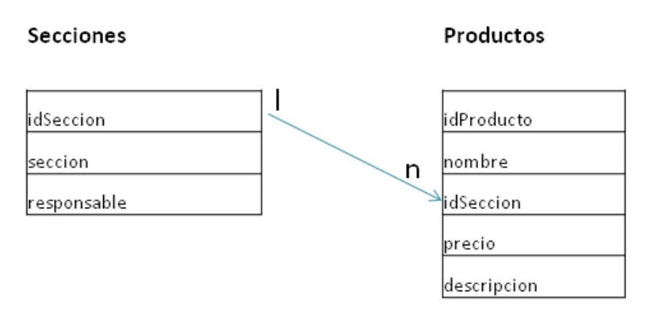

Se trata de dos tablas correspondientes a la base de datos de un almacén. En la primera tabla tenemos registradas las secciones en las que se divide el almacén, mientras que en la segunda tenemos el registro de productos existentes. En este caso, es claro que se trata de una relación uno a muchos, pues en cada sección podemos tener varios productos almacenados.

La clave primaria de la tabla Secciones, idSeccion, aparece también en la tabla de Productos como clave ajena (fereing key). Esto nos permite identificar la sección a la que pertenece cada producto almacenado.

### Atributos de relación

La relación entre entidades implica que en una entidad podemos almacenar el objeto u objetos de la entidad con la que se relaciona. Por tanto, lo  primero que tenemos que hacer para poder establecer la relación será definir dentro de la clase un atributo del tipo de objeto con el que se va a relacionar.

En el ejemplo que estamos utilizando, dentro de la entidad Seccion tendremos que definir un atributo de tipo Collection,List o Set, que contendrá la colección de objetos Producto asociados a cada objeto Seccion, mientras que en la entidad Producto, **en vez de definir el atributo clave ajena “idSeccion”, se creará una atributo de tipo de entidad** (en este caso de tipo Seccion), que guardará el objeto sección asociado a cada producto.

En el siguiente listado te mostramos como quedaría la definición de atributos de cada clase:

#### Entidad Sección

```java
@Entity
@Table(name = "Secciones")
public class Seccion implements Serializable {
   
   private static final long serialVersionUID = 1L;
   
   @Id
   @GeneratedValue(strategy = GenerationType.IDENTITY)
   private Integer idSeccion;

   private String seccion;
   private String responsable;
   private List<Producto> productos;
   //resto de código: constructores y métodos getter y setter

   ...
    
}
```
 
#### Entidad Producto

```java
@Entity
@Table(name = "Productos")
public class Producto implements Serializable {

   private static final long serialVersionUID = 1L;

   @Id
   @GeneratedValue(strategy = GenerationType.IDENTITY)
   private int idProducto;

   private String nombre;
   private double precio;
   private String descripcion;
   private Seccion seccion;
   //resto de código: constructores y métodos getter y setter

   ...

}
```

Tanto en una como en otra entidad, deberíamos añadir también la pareja de métodos set/get para acceder a los atributos de relación

### Configuración de la relación

Además de la definición de los atributos de relación, es necesario indicar cierta información de configuración al motor de persistencia para que sepa cómo obtener los objetos de las entidades relacionadas. Esta información se proporcionará a través de una serie de **anotaciones** que se colocarán delante de los atributos de relación.

### Entidad del lado uno

En primer lugar, veremos cómo configurar el atributo de relación en la entidad del lado uno. Dicho atributo será de tipo colección y tendrá que estar definido con la anotación `@OneToMany`, que indica que un objeto de la clase actual está asociado al conjunto de objetos sobre el que se aplica la anotación.

Esta anotación deberá incluir al menos el atributo *mappedBy*, en el que se indicará el nombre del atributo de relación de la entidad relacionada que contendrá el objeto de la entidad actual.

Con el ejemplo de la entidad Seccion lo veremos más claro; así tendría que quedar definido el atributo productos:

```java
@OneToMany(mappedBy = "seccion")   
private List<Producto> productos;
```

Como vemos, aquí *mappedBy* hace referencia al atributo “seccion” de la entidad Producto que contendrá el objeto de tipo Seccion asociado a cada producto.

Como indicamos anteriormente, estos campos de colección pueden ser Collection, List o Set.

### Entidad del lado muchos

La entidad del lado muchos es la propietaria de la relación, por ello la configuración del atributo de relación de esta entidad requiere algo más de trabajo, puesto que deberá indicarse en ella la información de relación. Así, en este atributo utilizaremos las siguientes anotaciones para la configuración de la relación

* `@ManyToOne`. Anotación utilizada en el campo de relación del lado muchos. Indica básicamente que varios objetos de la clase actual (en nuestro caso Producto) están asociados al objeto al que se le aplica esta anotación (Seccion)

* `@JoinColumn`. Proporciona la información de relación, indicando al motor de persistencia como están relacionadas las tablas en la base de datos. A través de los siguientes atributos se especifican los campos de relación:

   * *name*. Nombre de la columna foreing key (lado muchos)
   * *referencedColumnName*. Nombre de la columna primary key (lado uno)

Así pues en nuestro ejemplo, el atributo *seccion* de la entidad Producto deberá estar definido como se indica a continuación:

```java
@JoinColumn(name = "idSeccion", referencedColumnName = "idSeccion")
@ManyToOne
private Seccion seccion;
```

Al configurar las relaciones de este modo, cada vez que se obtenga un objeto de una entidad se obtendrá también el objeto u objetos de la entidad relacionada.

El siguiente bloque de código de ejemplo nos mostraría por pantalla el nombre de la sección a la que pertenece un producto, a partir del código del mismo:

```java
Producto p=em.find(Producto.class,2222);
if(p!=null){
   System.out.println(“Sección: “+p.getSeccion().getSeccion());
}
```

Este otro ejemplo nos muestra los nombres de todos los productos asociados a una determinada sección:

```java
Query q=em.createQuery(“select e from Seccion e where e.idSeccion=?1”);
q.setParameter(1,31);

Seccion m=(Seccion)q.getSingleResult();

//recupera los objetos Producto relacionados
List<Producto> productos=m.getProductos();

for(Producto p:productos){
   System.out.println(“Producto: “+p.getNombre());
}
```

## Relación muchos a muchos

En este tipo de relación, cada entidad tiene asociado un conjunto de objetos de la otra entidad. A nivel de tablas, se requiere de una tabla de unión.

Para analizar este tipo de relación, vamos a pensar en el caso de las cuentas bancarias y los clientes de un banco. Cada cliente puede tener varias cuentas en dicho banco, a su vez, una cuenta puede estar asociada a varios clientes. A nivel de base de datos, sería una situación como la que se muestra en el siguiente esquema, en el que hemos simplificado el número de campos de las tablas Cuentas y Clientes:

 

Las tablas Cuentas y Clientes se encuentran relacionadas muchos a muchos, pero lo hacen a través de una tabla intermedia Titulares, que contiene las claves ajenas de ambas tablas, lo que permite identificar las cuentas asociadas a cada cliente y los clientes propietarios de cada cuenta.

Observa cómo, de forma deliberada, he definido en la tabla Titulares los nombres de las claves ajenas de manera distinta a como están definidos en las tablas principales.

### Atributos de relación

A la hora de definir las entidades, Cuenta dispondrá de un atributo colección con los objetos Cliente asociados, mientras que Cliente contará con la colección de objetos Cuenta asociados:

```java
@Entity
@Table(name="Cuentas")
public class Cuenta implements Serializable{

   @Id
   private int numeroCuenta;
   
   private double saldo;
   private String tipoCuenta;
   private List<Cliente> clientes;
   //constructores y métodos setter getter

   ...

}

@Entity
@Table(name="Clientes")
public class Cliente implements Serializable{

   @Id
   private int dni;

   private String nombre;
   private String direccion;
   private int telefono;
   private List<Cuenta> cuentas;
   //constructores y métodos setter getter

   ...

}
```
 
### Configuración de la relación

De cara a configurar la relación, tenemos que tener en cuenta que una de las entidades será la propietaria de la relación mientras que la otra será la entidad del lado inverso de la relación. Al tratarse del mismo tipo de relación en ambos sentidos, da igual cual elijamos como propietaria y cual como inversa. En nuestro ejemplo, elegiremos Cliente como entidad propietaria de la relación y Cuenta como entidad inversa.

En ambas entidades, el atributo que contiene la colección de objetos relacionados deberá ser anotado con `@ManyToMany`. En el caso de la entidad del lado inverso (en nuestro ejemplo Cuenta), su atributo *mappedBy* indicará el nombre del atributo de la otra entidad que contiene los objetos relacionados de ésta:

```java
@ManyToMany(mappedBy="cuentas")
private List<Cliente> clientes;
```

Será la entidad propietaria de la relación, en nuestro caso Cliente, la que deberá incluir la información sobre la relación a través de la anotación `@JoinTable`, en la que se deberá especificar  los siguientes atributos:

* `name`. Nombre de la tabla de unión. En nuestro ejemplo, sería  "Titulares".
* `joinColumns` e `inverseJoinColumns`. Con estos atributos indicamos los campos de relación entre la tabla de join las tablas propietarias e inversa, respectivamente. El valor de cada uno de estos atributos es una anotación `@JoinColumn` con dos atributos:
   * `name`. Nombre de la columna en la tabla de join
   * `referencedColumnName`. Nombre de la columna en la tabla principal.
 
En nuestro ejemplo, el atributo *cuentas* de la entidad Cliente debería estar definido de la siguiente manera:

```java
@ManyToMany
@JoinTable(name="Titulares",
           joinColumns=@JoinColumn(name="idCliente",referencedColumnName="dni"),                inverseJoinColumns=@JoinColumn(name="idCuenta",
           referencedColumnName="numeroCuenta"))
private List<Cuenta> cuentas;
```

Teniendo las entidades relacionadas de esta manera, si, por ejemplo, quisiéramos mostrar los nombres de todos los titulares de una determinada cuenta procederíamos de la siguiente manera:

```java
String jpql="Select c From Cuenta c Where c.numeroCuenta=?1";

TypedQuery<Cuenta> q=em.createQuery(jpql,Cuenta.class):
q.setParameter(1,6666);

Cuenta cuenta=q.getSingleResult();

List<Cliente> titulares=cuenta.getClientes();

for(Cliente cl:titulares){
   System.out.println(cl.getNombre());
}
```

# 22 Crear entidades relacionadas parte I 08:20


Después de estudiar las relaciones entre entidades en la lección anterior, a continuación te voy a enseñar cómo crear entidades relacionadas utilizando el entorno de desarrollo Eclipse.

Para ello vamos a partir de la base de datos `almacen` que te mostraba en la lección anterior relativa a un almacén de productos, donde teníamos dos tablas, una tabla de `secciones` en la que teníamos registradas las secciones en las que se van a organizar los productos del almacén con los campos:

* `idSeccion` identificador de sección que es la PRIMARY KEY
* `seccion` que representa el nombre de la sección 
* `responsable` y responsable.

Mientras que en la Tabla `productos` tendríamos:

* `idProducto` el identificador de producto 
* `nombre` el nombre del producto
* `idSeccion` la sección a la que pertenece
* `precio` el precio
* `descripcion` y la descripción

Sería una relación **Uno a Muchos** de secciones a productos **Muchos a Uno** de productos a secciones.

Vamos a proceder a crear esta nueva base de datos antes que nada. Primero creamos una conección llamada `almacen`.

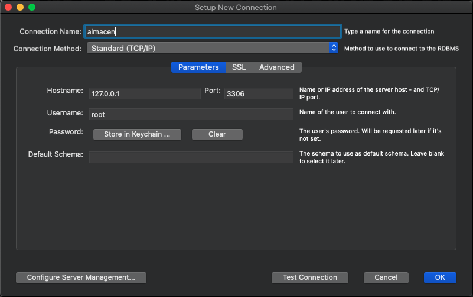

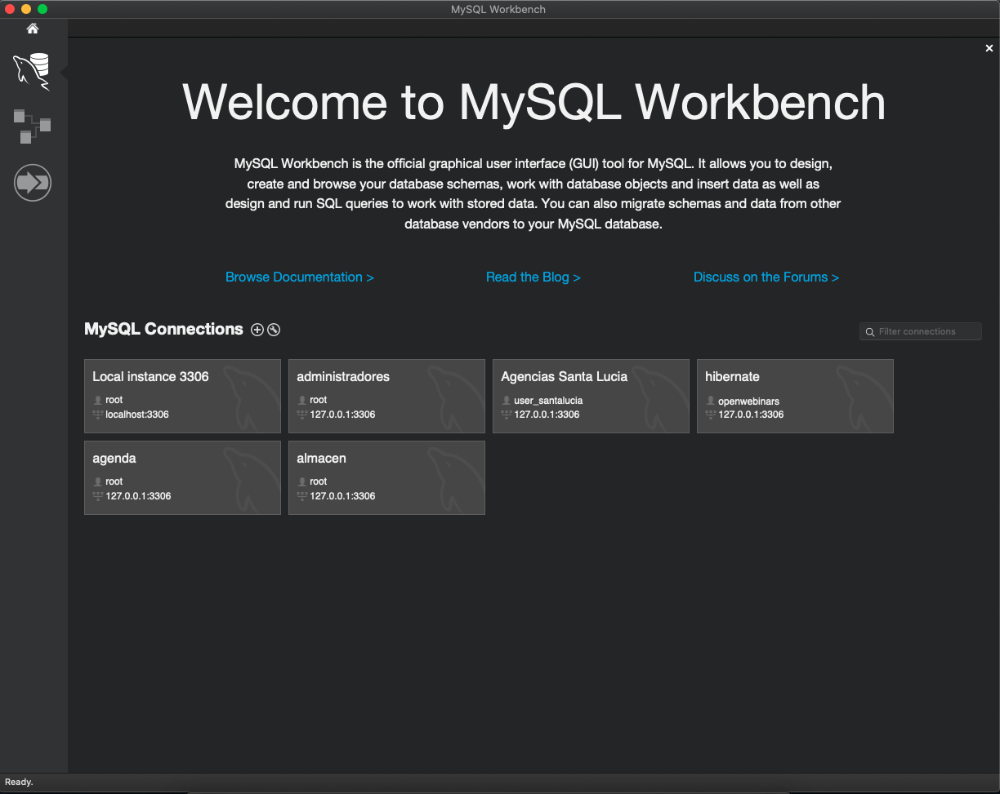

Entramos a nueva conección que hemos creado y le aplicamos el password con la instrucción:

`ALTER USER 'root'@'localhost' IDENTIFIED BY 'root';`

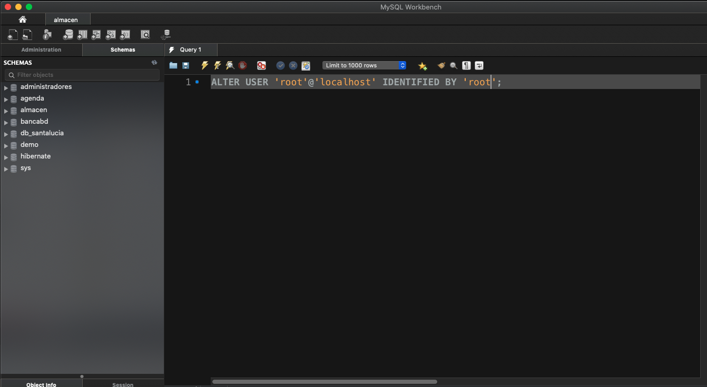

Si retornamos al Home podemos hacer un Test de conección.

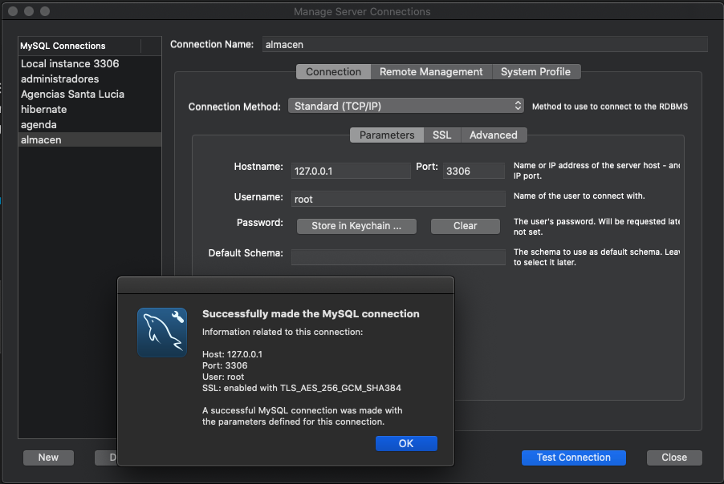

El Script SQL para crear toda la Base de Datos `almacen` es el siguiente:

```sql
--
-- Create schema almacen
--

CREATE DATABASE IF NOT EXISTS almacen;
USE almacen;

--
-- Definition of table `productos`
--

DROP TABLE IF EXISTS `productos`;
CREATE TABLE `productos` (
  `idProducto` int(10) unsigned NOT NULL auto_increment,
  `nombre` varchar(45) NOT NULL,
  `idSeccion` int(10) unsigned NOT NULL,
  `precio` double NOT NULL,
  `descripcion` varchar(45) NOT NULL,
  PRIMARY KEY  (`idProducto`)
) ENGINE=InnoDB AUTO_INCREMENT=13 DEFAULT CHARSET=latin1;

--
-- Dumping data for table `productos`
--

/*!40000 ALTER TABLE `productos` DISABLE KEYS */;
INSERT INTO `productos` (`idProducto`,`nombre`,`idSeccion`,`precio`,`descripcion`) VALUES 
 (1,'Alicates 25m',1,10.4,'Disponibles en 10 dias'),
 (2,'Bombilla led 30w',3,5.7,'duración 10 años'),
 (3,'cable cobre 10mm',3,2,'flexible y resistente'),
 (4,'Tubo de cobre',2,3.6,'precio por metro'),
 (5,'Grifo gres',2,27.5,'Alta resistencia'),
 (6,'Taladradora 1000w',3,40.6,'Sistema silencioso'),
 (7,'Bote pintura blanca 10 l',4,25.8,'Doble capa'),
 (8,'Cerradura verja 30 mm',1,37.9,'Universal para exterior'),
 (9,'Candado 25 mm',1,13.5,'Llave incluida'),
 (10,'Interruptor doble',3,22.4,'Solo color blanco'),
 (11,'Rodillo pintura 25 cm',4,14.9,'se lava facilmente'),
 (12,'Bombilla led 10w luz blanca',3,4.8,'Gran potencia');
/*!40000 ALTER TABLE `productos` ENABLE KEYS */;


--
-- Definition of table `secciones`
--

DROP TABLE IF EXISTS `secciones`;
CREATE TABLE `secciones` (
  `idSeccion` int(10) unsigned NOT NULL auto_increment,
  `seccion` varchar(45) NOT NULL,
  `responsable` varchar(45) NOT NULL,
  PRIMARY KEY  (`idSeccion`)
) ENGINE=InnoDB AUTO_INCREMENT=5 DEFAULT CHARSET=latin1;

--
-- Dumping data for table `secciones`
--

/*!40000 ALTER TABLE `secciones` DISABLE KEYS */;
INSERT INTO `secciones` (`idSeccion`,`seccion`,`responsable`) VALUES 
 (1,'ferreteria','Juan López'),
 (2,'fontaneria','Ana Marcos'),
 (3,'electricidad','Ruth Esteban'),
 (4,'pintura','Pedro Ramos');
/*!40000 ALTER TABLE `secciones` ENABLE KEYS */;


--
-- Definition of table `sucursales`
--

DROP TABLE IF EXISTS `sucursales`;
CREATE TABLE `sucursales` (
  `nombre` varchar(45) NOT NULL,
  `calle` varchar(45) NOT NULL,
  `presupuesto` double NOT NULL,
  `innauguracion` int(11) NOT NULL,
  PRIMARY KEY  (`nombre`,`calle`)
) ENGINE=InnoDB DEFAULT CHARSET=latin1;

--
-- Dumping data for table `sucursales`
--

/*!40000 ALTER TABLE `sucursales` DISABLE KEYS */;
INSERT INTO `sucursales` (`nombre`,`calle`,`presupuesto`,`innauguracion`) VALUES 
 ('bazar em','c/los altos',450000,2012),
 ('nueva era','c/povedilla',50000,2010),
 ('venta chin','c/povedilla',3000000,2009);
/*!40000 ALTER TABLE `sucursales` ENABLE KEYS */;


--
-- Definition of table `ventas`
--

DROP TABLE IF EXISTS `ventas`;
CREATE TABLE `ventas` (
  `idVenta` int(10) unsigned NOT NULL auto_increment,
  `idProducto` int(10) unsigned NOT NULL,
  `unidades` int(10) unsigned NOT NULL,
  `ciudad` varchar(45) NOT NULL,
  PRIMARY KEY  (`idVenta`)
) ENGINE=InnoDB AUTO_INCREMENT=11 DEFAULT CHARSET=latin1;

--
-- Dumping data for table `ventas`
--

/*!40000 ALTER TABLE `ventas` DISABLE KEYS */;
INSERT INTO `ventas` (`idVenta`,`idProducto`,`unidades`,`ciudad`) VALUES 
 (1,1,3,'Madrid'),
 (2,3,2,'Madrid'),
 (3,1,5,'Sevilla'),
 (4,10,4,'Avila'),
 (5,3,2,'Jaen'),
 (6,5,7,'Madrid'),
 (7,4,2,'Sevilla'),
 (8,10,3,'Salamanca'),
 (9,7,8,'Albacete'),
 (10,4,3,'Soria');
/*!40000 ALTER TABLE `ventas` ENABLE KEYS */;

--
-- Create schema bancabd
```

Lo ejecutamos y nos creara las tablas para esta base de datos.

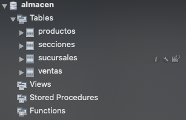

Tenemos las tablas `productos`, `secciones`, `sucursales` y `ventas`, las dos tablas de las que hablamos, más dos tablas adicionales que usaremos posteriormente.

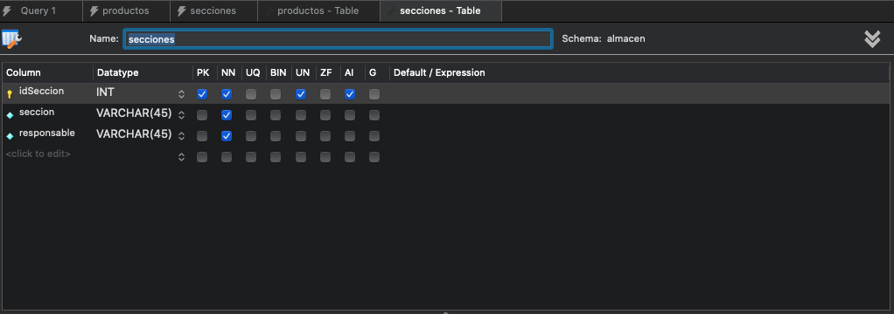

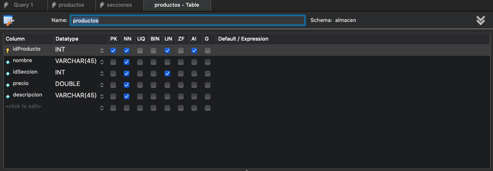


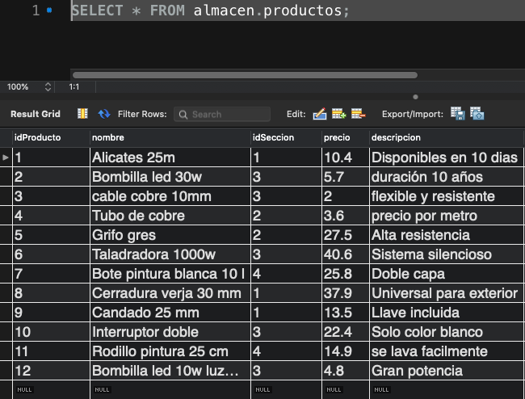

### Creación del Proyecto en Eclipse

Partiendo de que tenemos esta base de datos `almacen` con esas dos tablas `productos` y `secciones` cómo crearíamos las entidades ya relacionadas utilizando el entorno de desarrollo Eclipse.

Vamos a crearnos un proyecto Web dinámico 

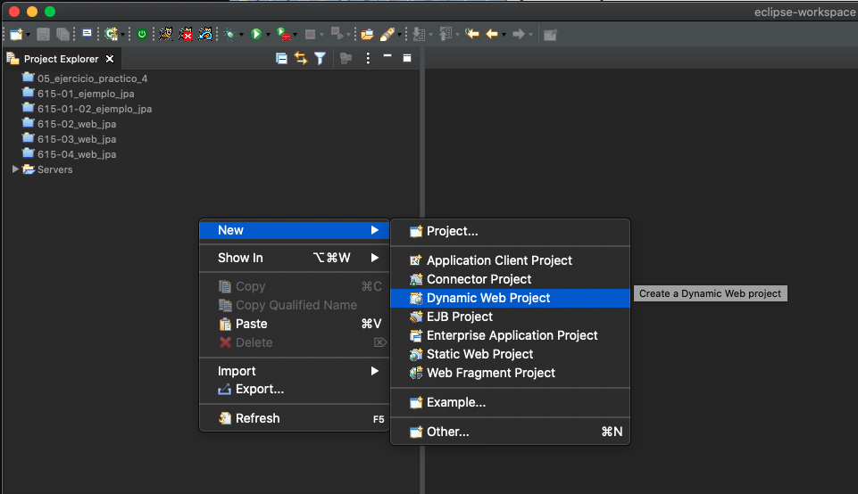

que vamos a llamar `615-05_relacion_almacen`, cómo posteriormente utilizaremos este proyecto para crear un ejercicio donde vamos a incorporar Lógica de Negocio implementada en EJB ya vamos a coger aquí como servidor de aplicaciones GlassFish en el que vamos a desplegar la aplicación el servidor GlassFish.

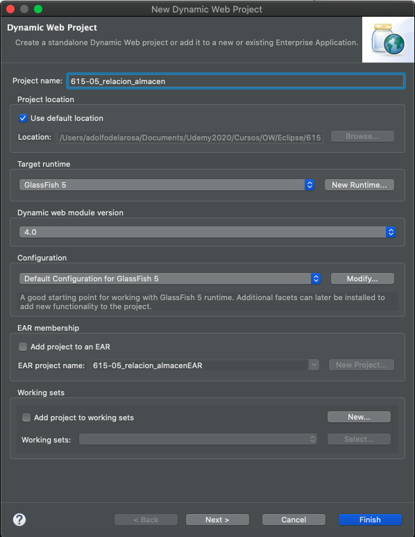

Lo primero que vamos a hacer es incorporar la característica JPA a nuestro proyecto, nos vamos a ir a través del botón derecho a las propiedades y en Project Faces activaremos JPA.


Debemos pulsar en `Futher Configuration Availible`

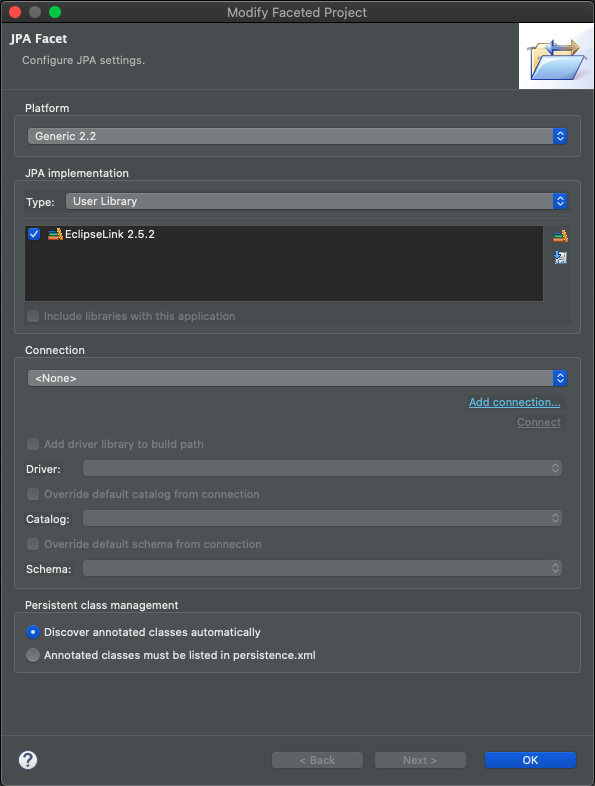

Donde la configuración disponible ya viene por defecto Eclipse Link que por cierto este es el motor de persistencia que hemos utilizado en los ejemplos realizados hasta ahora, pero si vamos a desplegar la aplicación en un servidor de aplicaciones GlassFish, GlassFish también incorpora un motor de persistencia compatible con JPA o sea que podríamos seguir utilizando este o bien lo que conocemos como GlasFish System Library que sería el motor de GlassFish, es indiferente, en cualquier caso vamos a ver que funcionaría lógicamente tanto con uno como con otro. Vamos a dejar Eclipse Link que hemos utilizado hasta ahora, bien perfecto porque ya tenemos activado la característica JPA.

Ahora vamos a proceder como siempre que queremos generar entidades a irnos a la opción botón derecho dentro del proyecto, JPA Tools - Generate entities from Tables ..., generar entidades desde tablas.

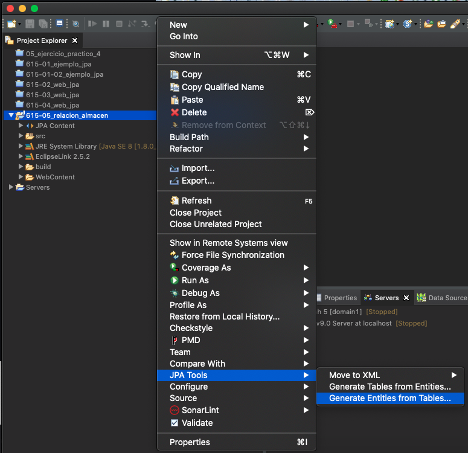


Entonces aquí lo que vamos a tener que hacer es crear una conexión a esa nueva base de datos que hemos creado, es una base de datos de MySQL vamos a llamar a la conexión por ejemplo `mysql_bd_almacen`

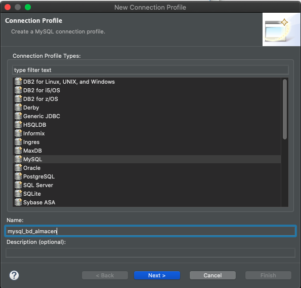

en el siguiente paso vamos a elegir el Driver `driver_para_mysql_2`, ya tenemos creado el Driver `driver_para_mysql` de otros ejercicios pero al usarlo fallo por eso se creo `driver_para_mysql_2` siguiendo los mismos pasos, podemos seguir utilizandolo porque al fin y al cabo es el mismo se trata de MySQL, indicamos el nombre de la base de datos, la URL y las credenciales.

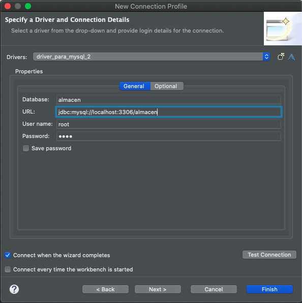

Hacemos un test de conexión para comprobar que efectivamente todo es correcto.

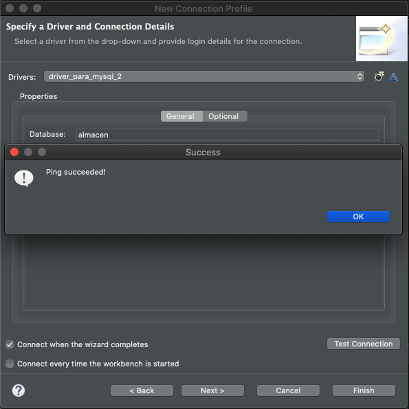

y finalizamos entonces en la lista de esquemas debe aparecer el nombre de la base de datos y todas sus tablas.


Nosotros vamos a crear Entidades para las tablas `productos` y `secciones` por lo cual las marcamos.


y además las queremos relacionar bien pues eso lo vamos a hacer precisamente en el siguiente paso.

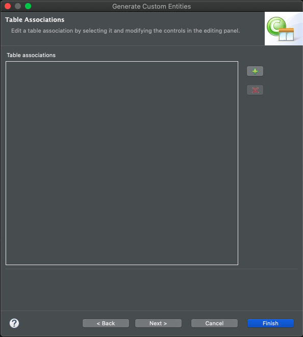

En este paso que nunca hemos hecho nada hasta el momento porque nunca hemos tenido la necesidad de crear relaciones entre entidades, pero ahora llega el momento. Por lo tanto vamos a añadir aquí una nueva *Asociación de Tablas* que es como llama Eclipse la relación entre entidades.

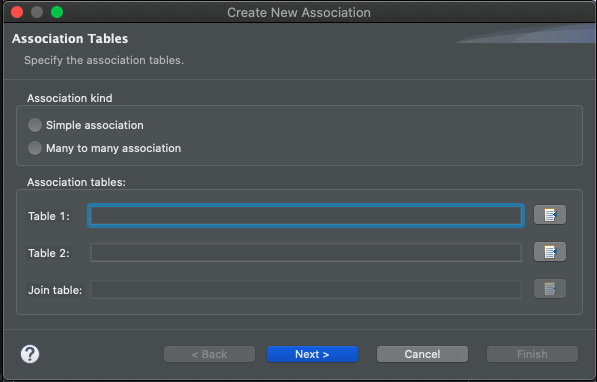

Puede ser una relación Simple (Uno a Muchos o Muchos a Uno) o una asociación digamos compleja (Muchos a Muchos). En nuestro caso se trataba de Uno a Muchos y Muchos a Uno, por lo tanto le dejaremos la opción simple. Elegimos una de las tablas `secciones` por ejemplo y tabla dos `productos`.

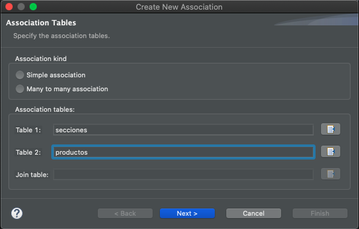

y en el siguiente paso 

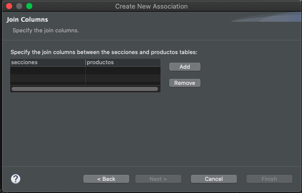

vamos a indicar de ambas tablas cuál es el campo común, la columna común a ambas tablas a través del botón Add, por defecto el indica que en secciones sería `idSeccion` y en productos `descripcion`.

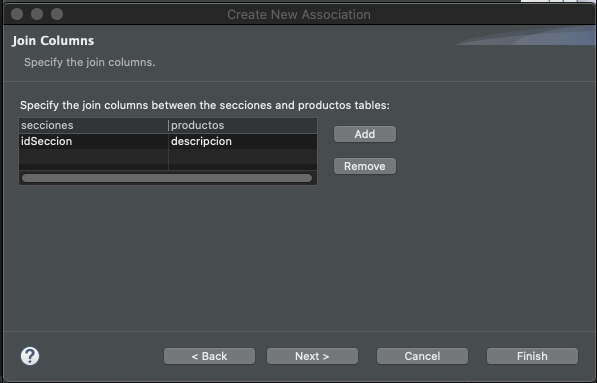

Evidentemente no pueden ser descripción sino que se también `idSeccion` la columna que permite identificar a qué sección pertenece cada producto, la columna común de ambas tablas.

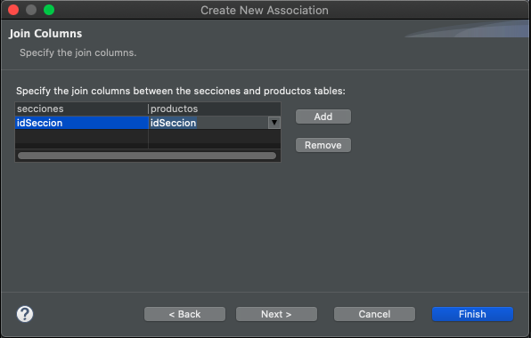

en el siguiente paso 

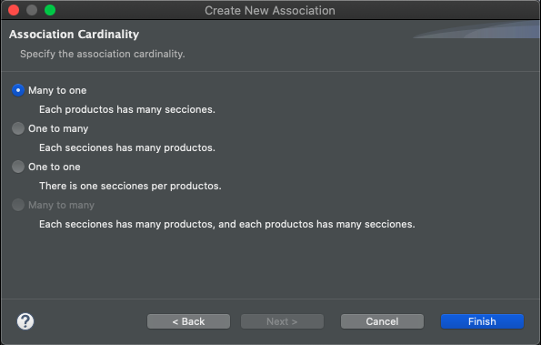

ya debemos elegir exactamente qué tipo de relación queremos entre esas dos entidades que vamos a generar a partir de esas tablas, pueden ser Muchos a Uno, de cada producto le corresponden muchas secciones no es el caso, sino Uno a Muchos cada sección le corresponden muchos productos que obviamente se traducirá en el lado de producto en una relación tipo Muchos a Uno, muchos productos una sección.

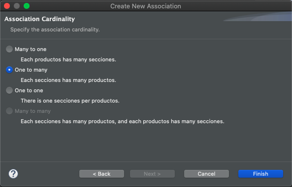

Una vez ya elegido esto finalizamos aparece aquí la información de la relación gráficamente


que si pulsamos sobre ella nos indica las propiedades simplemente que hemos configurado, si tuviéramos que cambiar algo sería aquí donde lo podríamos hacer, no tendríamos que borrarla y volver a crear sino que aquí podríamos hacer los cambios que necesitase.

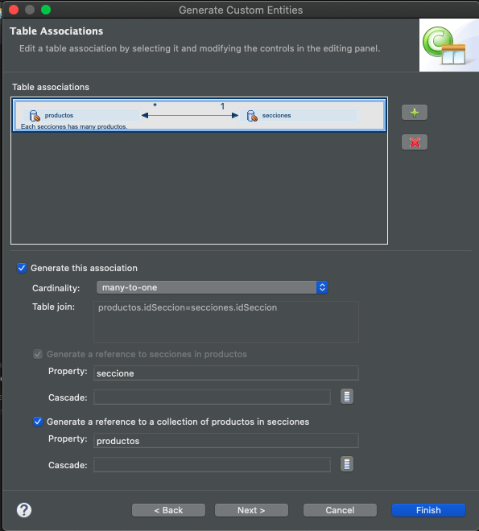

En el siguiente paso 

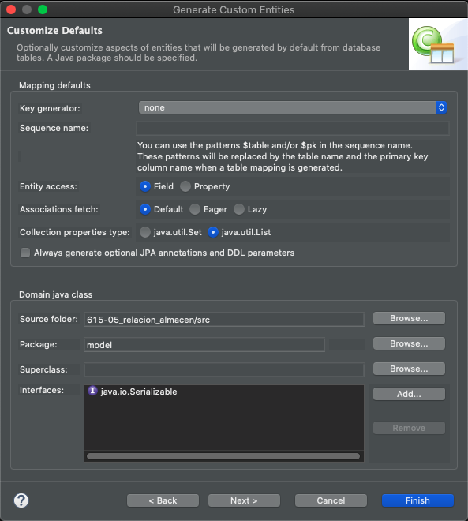

le demos indicar ya los datos que normalmente indicamos cuando vamos a crear entidades a partir de las tablas. En la generación de claves(Key generator) de momento no decimos nada, luego se lo vamos a indicar uno por uno en el paso siguiente, lo que si queremos que las entidades se generen en el paquete entidades no en model como indica lo cambiamos, muy importante ahora porque como se trata de asociación de Uno a Muchos - Muchos a Uno, va a haber entidades que tendrán campos de colección, debemos indicar en `Collection properties type` si queremos que esas colecciones sean de tipo `Set` o `List` que es el que habitualmente se suele utilizar.

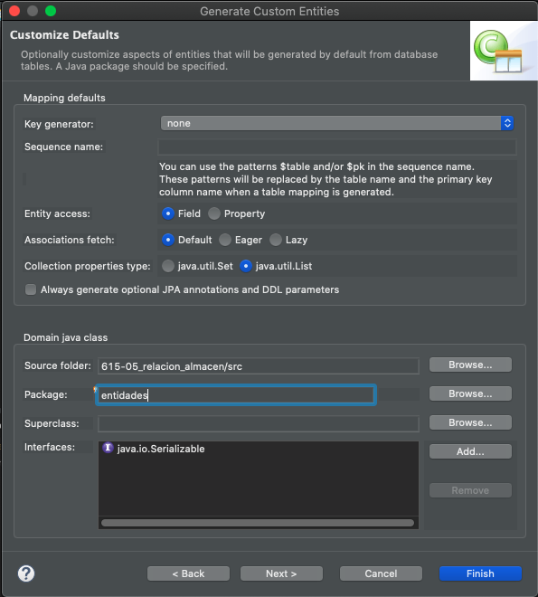

En el siguiente paso 

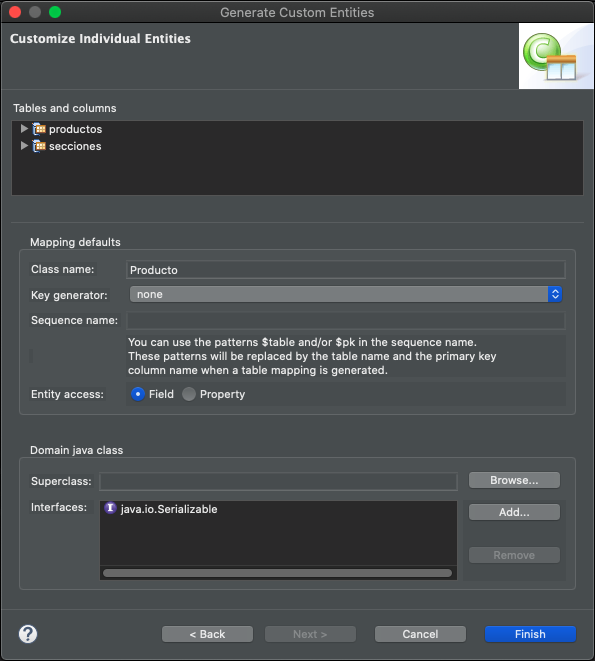

Tabla `Producto`, nombre de la entidad `Producto`, generación de clave `identity`.

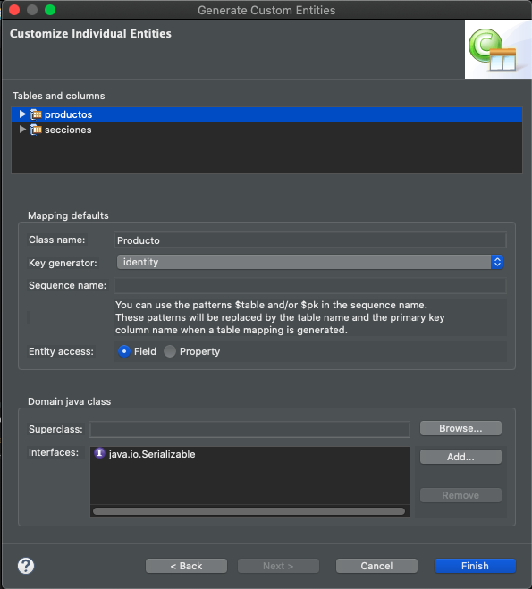

Tabla `Secciones` nombre de la clase `Seccion`, generación de clave también es `identity`.


Finalizamos y ya tenemos nuestras entidades generadas y relacionadas.

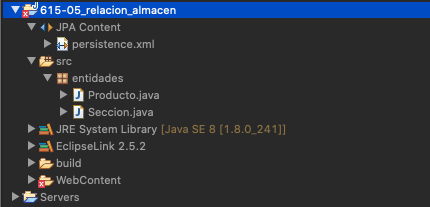

Vamos a comprobarlo. Empezamos por la Entidad `Seccion` la del lado 1.

*`Seccion`*

```java
package entidades;

import java.io.Serializable;
import javax.persistence.*;
import java.util.List;


/**
 * The persistent class for the secciones database table.
 * 
 */
@Entity
@Table(name="secciones")
@NamedQuery(name="Seccion.findAll", query="SELECT s FROM Seccion s")
public class Seccion implements Serializable {
	private static final long serialVersionUID = 1L;

	@Id
	@GeneratedValue(strategy=GenerationType.IDENTITY)
	private int idSeccion;

	private String responsable;

	private String seccion;

	//bi-directional many-to-one association to Producto
	@OneToMany(mappedBy="seccione")
	private List<Producto> productos;

	public Seccion() {
	}

	public int getIdSeccion() {
		return this.idSeccion;
	}

	public void setIdSeccion(int idSeccion) {
		this.idSeccion = idSeccion;
	}

	public String getResponsable() {
		return this.responsable;
	}

	public void setResponsable(String responsable) {
		this.responsable = responsable;
	}

	public String getSeccion() {
		return this.seccion;
	}

	public void setSeccion(String seccion) {
		this.seccion = seccion;
	}

	public List<Producto> getProductos() {
		return this.productos;
	}

	public void setProductos(List<Producto> productos) {
		this.productos = productos;
	}

	public Producto addProducto(Producto producto) {
		getProductos().add(producto);
		producto.setSeccione(this);

		return producto;
	}

	public Producto removeProducto(Producto producto) {
		getProductos().remove(producto);
		producto.setSeccione(null);

		return producto;
	}

}
```

Y aquí veremos a partir de las anotaciones clásicas, efectivamente vemos ese nuevo atributo `productos`

```java
//bi-directional many-to-one association to Producto
@OneToMany(mappedBy="seccione")
private List<Producto> productos;
```

que contienen la colección de productos asociados a esta sección anotada con `@OneToMany(mappedBy="seccione")` el nombre del atributo de la otra Entidad de Producto, que contiene el objeto `seccione` asociado, le a puesto `seccione` lo podemos cambiar o lo podemos dejar así no pasa nada.

Vamos a ver esa Entidad `Producto`

*`Producto`*

```java
package entidades;

import java.io.Serializable;
import javax.persistence.*;


/**
 * The persistent class for the productos database table.
 * 
 */
@Entity
@Table(name="productos")
@NamedQuery(name="Producto.findAll", query="SELECT p FROM Producto p")
public class Producto implements Serializable {
	private static final long serialVersionUID = 1L;

	@Id
	@GeneratedValue(strategy=GenerationType.IDENTITY)
	private int idProducto;

	private String descripcion;

	private String nombre;

	private double precio;

	//bi-directional many-to-one association to Seccion
	@ManyToOne
	@JoinColumn(name="idSeccion")
	private Seccion seccione;

	public Producto() {
	}

	public int getIdProducto() {
		return this.idProducto;
	}

	public void setIdProducto(int idProducto) {
		this.idProducto = idProducto;
	}

	public String getDescripcion() {
		return this.descripcion;
	}

	public void setDescripcion(String descripcion) {
		this.descripcion = descripcion;
	}

	public String getNombre() {
		return this.nombre;
	}

	public void setNombre(String nombre) {
		this.nombre = nombre;
	}

	public double getPrecio() {
		return this.precio;
	}

	public void setPrecio(double precio) {
		this.precio = precio;
	}

	public Seccion getSeccione() {
		return this.seccione;
	}

	public void setSeccione(Seccion seccione) {
		this.seccione = seccione;
	}

}
```

Vemos que tenemos efectivamente un atributo de tipo `Seccion` llamado `seccione`


```java
//bi-directional many-to-one association to Seccion
@ManyToOne
@JoinColumn(name="idSeccion")
private Seccion seccione;
```

lo a anotado con `@ManyToOne` a través `@JoinColumn(name="idSeccion")` como ya explicamos en la lección anterior se establece el nombre de las columnas que definen esa relación entre las tablas, como en ambas tablas se llama igual basta con indicar el atributo `name="idSeccion")` para saber que ambas columnas con ese mismo nombre, van a ser las que permiten identificar los objetos asociados a cada una de las otras entidades de la tabla relacionada.

Por lo tanto ya tenemos las entidades generadas con toda la información de configuración correspondiente a sus relaciones.

### :computer: Código Completo - 615-05_relacion_almacen

Este código realmente no hace nada, así como esta.

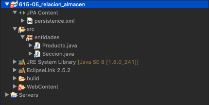

*`persistence.xml`*

```html
<?xml version="1.0" encoding="UTF-8"?>
<persistence version="2.2" xmlns="http://xmlns.jcp.org/xml/ns/persistence" xmlns:xsi="http://www.w3.org/2001/XMLSchema-instance" xsi:schemaLocation="http://xmlns.jcp.org/xml/ns/persistence http://xmlns.jcp.org/xml/ns/persistence/persistence_2_2.xsd">
	<persistence-unit name="615-05_relacion_almacen">
		<class>entidades.Producto</class>
		<class>entidades.Seccion</class>
	</persistence-unit>
</persistence>
```

**Entidades**

*`Seccion.java`*

```java
package entidades;

import java.io.Serializable;
import javax.persistence.*;
import java.util.List;


/**
 * The persistent class for the secciones database table.
 * 
 */
@Entity
@Table(name="secciones")
@NamedQuery(name="Seccion.findAll", query="SELECT s FROM Seccion s")
public class Seccion implements Serializable {
	private static final long serialVersionUID = 1L;

	@Id
	@GeneratedValue(strategy=GenerationType.IDENTITY)
	private int idSeccion;

	private String responsable;

	private String seccion;

	//bi-directional many-to-one association to Producto
	@OneToMany(mappedBy="seccione")
	private List<Producto> productos;

	public Seccion() {
	}

	public int getIdSeccion() {
		return this.idSeccion;
	}

	public void setIdSeccion(int idSeccion) {
		this.idSeccion = idSeccion;
	}

	public String getResponsable() {
		return this.responsable;
	}

	public void setResponsable(String responsable) {
		this.responsable = responsable;
	}

	public String getSeccion() {
		return this.seccion;
	}

	public void setSeccion(String seccion) {
		this.seccion = seccion;
	}

	public List<Producto> getProductos() {
		return this.productos;
	}

	public void setProductos(List<Producto> productos) {
		this.productos = productos;
	}

	public Producto addProducto(Producto producto) {
		getProductos().add(producto);
		producto.setSeccione(this);

		return producto;
	}

	public Producto removeProducto(Producto producto) {
		getProductos().remove(producto);
		producto.setSeccione(null);

		return producto;
	}

}
```

*`Producto.java`*

```java
package entidades;

import java.io.Serializable;
import javax.persistence.*;


/**
 * The persistent class for the productos database table.
 * 
 */
@Entity
@Table(name="productos")
@NamedQuery(name="Producto.findAll", query="SELECT p FROM Producto p")
public class Producto implements Serializable {
	private static final long serialVersionUID = 1L;

	@Id
	@GeneratedValue(strategy=GenerationType.IDENTITY)
	private int idProducto;

	private String descripcion;

	private String nombre;

	private double precio;

	//bi-directional many-to-one association to Seccion
	@ManyToOne
	@JoinColumn(name="idSeccion")
	private Seccion seccione;

	public Producto() {
	}

	public int getIdProducto() {
		return this.idProducto;
	}

	public void setIdProducto(int idProducto) {
		this.idProducto = idProducto;
	}

	public String getDescripcion() {
		return this.descripcion;
	}

	public void setDescripcion(String descripcion) {
		this.descripcion = descripcion;
	}

	public String getNombre() {
		return this.nombre;
	}

	public void setNombre(String nombre) {
		this.nombre = nombre;
	}

	public double getPrecio() {
		return this.precio;
	}

	public void setPrecio(double precio) {
		this.precio = precio;
	}

	public Seccion getSeccione() {
		return this.seccione;
	}

	public void setSeccione(Seccion seccione) {
		this.seccione = seccione;
	}

}
```

# 23 Crear entidades relacionadas parte 2 08:41

En esta nueva lección después de haber explicado cómo crear una relación Una a Muchos - Muchos a Uno entre entidades a través de Eclipse, vamos a ver ahora cómo crear una relación Muchos a Muchos y vamos a utilizar el ejemplo de base de datos que vimos en la lección anterior.

Lo primero vamos a irnos a Workbeanch donde vamos a crear una nueva conexión de base de datos llamada `bancadb`.

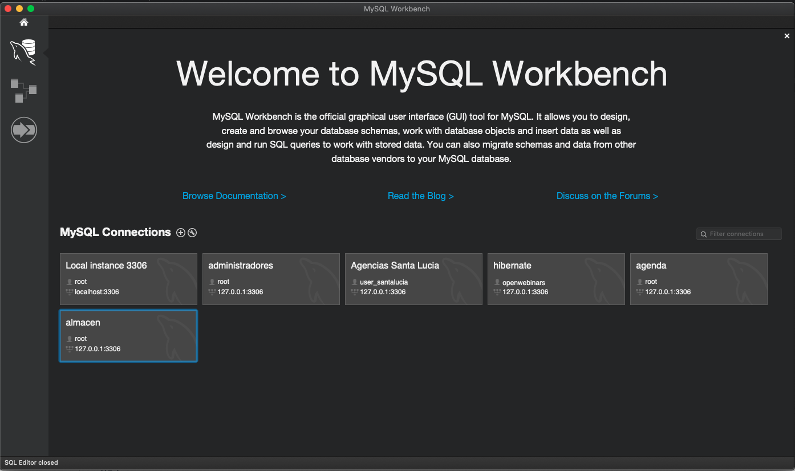


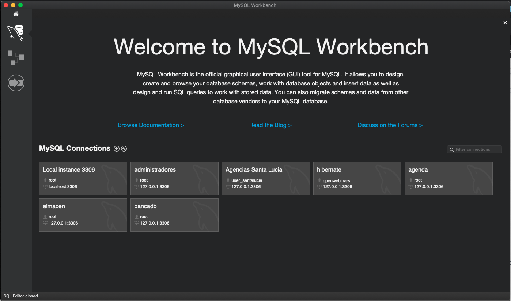

Entramos a esa nueva conexión para asignarle el password con:

`ALTER USER 'root'@'localhost' IDENTIFIED BY 'root';`

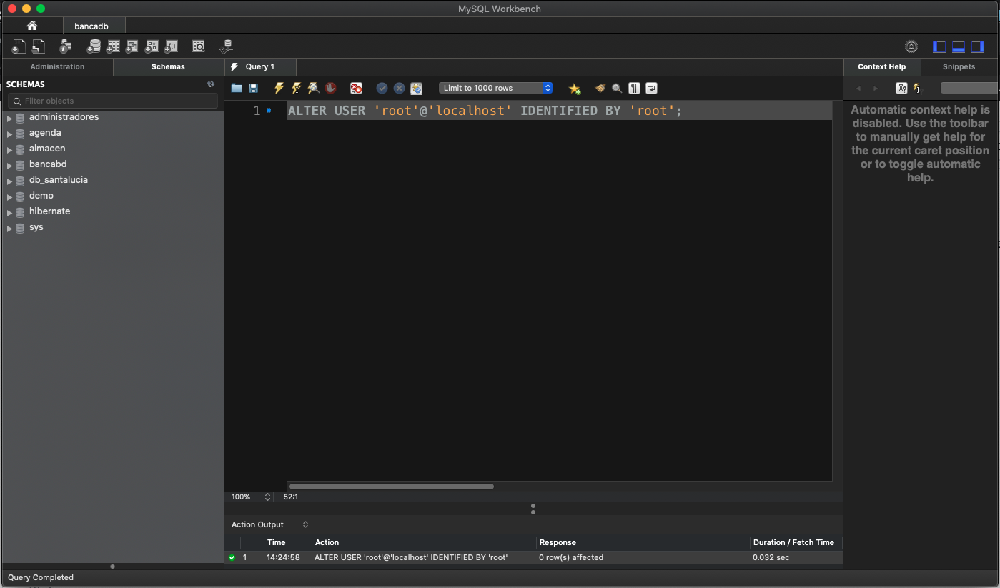

Vamos a ejecutar el siguiente Script para crear la BD `bancadb`.

```sql
--
-- Create schema bancabd
--

CREATE DATABASE IF NOT EXISTS bancabd;
USE bancabd;

--
-- Definition of table `clientes`
--

DROP TABLE IF EXISTS `clientes`;
CREATE TABLE `clientes` (
  `dni` int(10) unsigned NOT NULL,
  `nombre` varchar(45) NOT NULL,
  `direccion` varchar(45) NOT NULL,
  `telefono` int(10) unsigned NOT NULL,
  PRIMARY KEY  (`dni`)
) ENGINE=InnoDB DEFAULT CHARSET=latin1;

--
-- Dumping data for table `clientes`
--

/*!40000 ALTER TABLE `clientes` DISABLE KEYS */;
INSERT INTO `clientes` (`dni`,`nombre`,`direccion`,`telefono`) VALUES 
 (1111,'Pepito','c/marte',1111),
 (2222,'Alicia','c/ jupiter',2222),
 (3333,'Marta','c/venus',3333);
/*!40000 ALTER TABLE `clientes` ENABLE KEYS */;


--
-- Definition of table `cuentas`
--

DROP TABLE IF EXISTS `cuentas`;
CREATE TABLE `cuentas` (
  `numeroCuenta` int(10) unsigned NOT NULL,
  `saldo` double NOT NULL,
  `tipocuenta` varchar(45) NOT NULL,
  PRIMARY KEY  (`numeroCuenta`)
) ENGINE=InnoDB DEFAULT CHARSET=latin1;

--
-- Dumping data for table `cuentas`
--

/*!40000 ALTER TABLE `cuentas` DISABLE KEYS */;
INSERT INTO `cuentas` (`numeroCuenta`,`saldo`,`tipocuenta`) VALUES 
 (1000,300,'ahorro'),
 (2000,3450,'ahorro'),
 (3000,670,'recibos'),
 (4000,880,'ahorro'),
 (5000,6700,'recibos');
/*!40000 ALTER TABLE `cuentas` ENABLE KEYS */;


--
-- Definition of table `titulares`
--

DROP TABLE IF EXISTS `titulares`;
CREATE TABLE `titulares` (
  `idCuenta` int(10) unsigned NOT NULL,
  `idCliente` int(10) unsigned NOT NULL,
  PRIMARY KEY  (`idCuenta`,`idCliente`)
) ENGINE=InnoDB DEFAULT CHARSET=latin1;

--
-- Dumping data for table `titulares`
--

/*!40000 ALTER TABLE `titulares` DISABLE KEYS */;
INSERT INTO `titulares` (`idCuenta`,`idCliente`) VALUES 
 (1000,3333),
 (1000,5555),
 (2000,1111),
 (2000,3333),
 (3000,1111),
 (4000,2222),
 (5000,4444);
/*!40000 ALTER TABLE `titulares` ENABLE KEYS */;


/*!40101 SET SQL_MODE=@OLD_SQL_MODE */;
/*!40014 SET FOREIGN_KEY_CHECKS=@OLD_FOREIGN_KEY_CHECKS */;
/*!40014 SET UNIQUE_CHECKS=@OLD_UNIQUE_CHECKS */;
/*!40101 SET CHARACTER_SET_CLIENT=@OLD_CHARACTER_SET_CLIENT */;
/*!40101 SET CHARACTER_SET_RESULTS=@OLD_CHARACTER_SET_RESULTS */;
/*!40101 SET COLLATION_CONNECTION=@OLD_COLLATION_CONNECTION */;
/*!40101 SET CHARACTER_SET_CLIENT=@OLD_CHARACTER_SET_CLIENT */;

```

Al ejecutar el Script anterior se crea la base de datos `bancadb` y las tablas `clientes`, `cuentas` y `titulares`

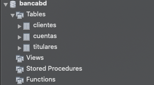

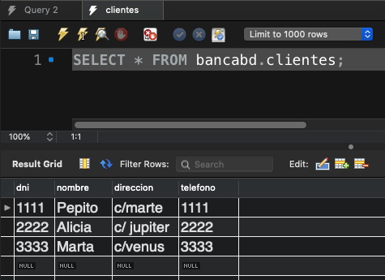

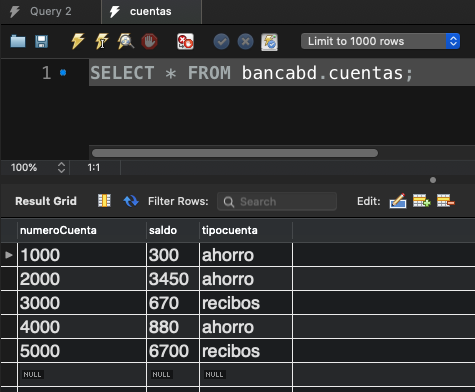

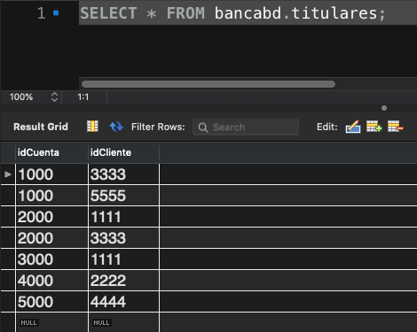

La base datos se llama `bancadb` donde tenemos una tabla de `clientes`

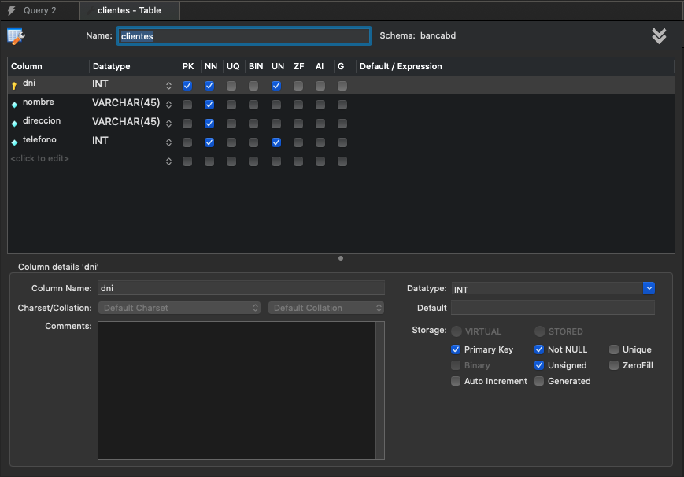

con los datos registrados de todos los clientes DNI, nombre, dirección y teléfono.

La tabla `cuentas` 

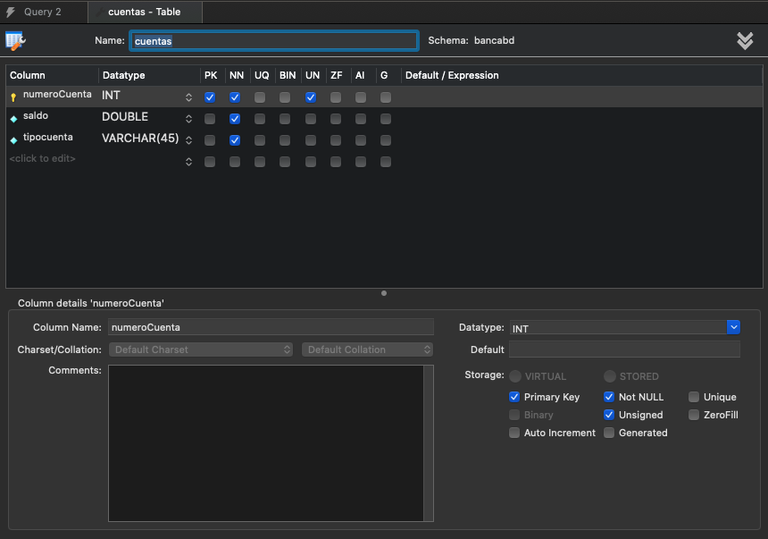

que son las cuentas de esos clientes el número de cuenta, saldo o el tipo de cuenta y luego la tabla `titulares` tabla intermedia o joing

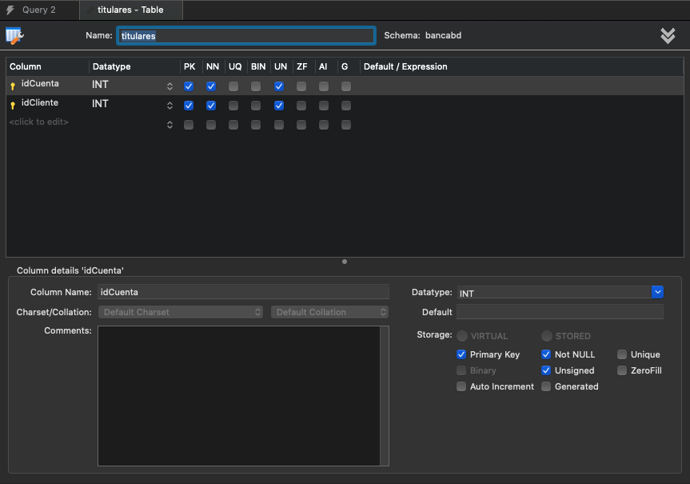

que relaciona las Foreign Keys de cada una de las tablas principales de modo que podamos establecer esa relación Muchos a Muchos entre `clientes` y `cuentas` que como vemos la clave primaria de esta tabla intermedia sería la combinación de ambas claves Foreign Keys el `idCuenta` e `idCliente`.

Aquí como ya viste en la lección anterior el `idCliente` aposta se ha llamado diferente a como se llama esa columna de clientes que es `dni` mientras que `idCuenta` también se llama de forma diferente a como se llama la Primary Key de la tabla `cuentas` que es `numeroCuenta`.


### Creación Proyecto en Eclipse

Pues bien vamos a establecer la relación de tipo Muchos a Muchos entre las dos entidades que vamos a generar a partir de esas tablas `clientes` y `cuentas`.

Vamos a crearnos un nuevo proyecto Dynamic Web Project

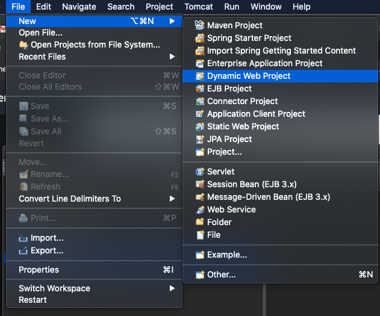

lo vamos a llamar `615-06_relacion_bancadb` también sobre el servidor GlassFish aunque ahora eso nos da un poquito igual de cara a generar las entidades.

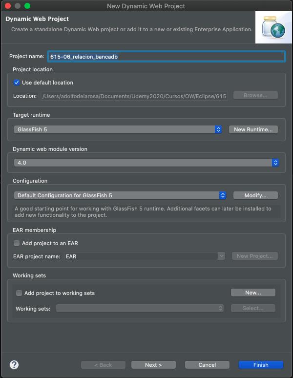

y finalizamos. Procedemos como en el ejemplo anterior a las propiedades siempre y Project Facets 

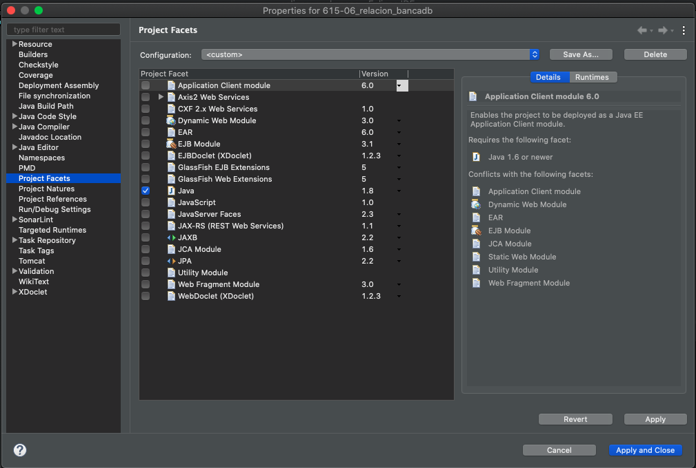

activamos JPA

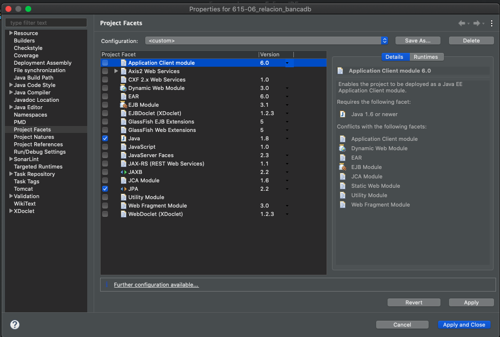

para que el asistente nos permita generar las entidades, así que através del botón derecho JPA Tools - Generated Entity Tables.. generar entidades desde tablas.

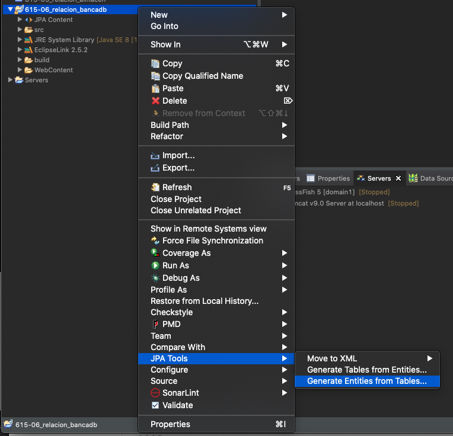

Vamos a crear la conexión a esa base de datos que llamaremos `mysql_bd_bancadb`.

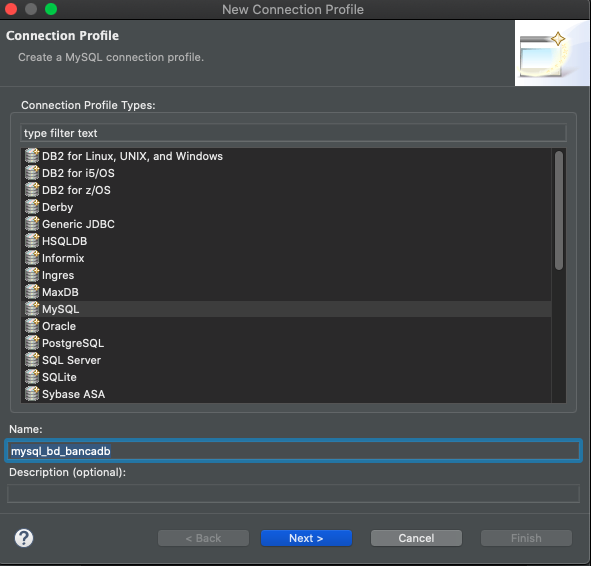

En el siguiente paso seleccionamos el Driver de MySQL que estamos usando y metemos los datos de conexión de la base de datos, ojo por que el Schema lo llamamos `bancadb` y la base de datos realmente se llama `bancabd`.

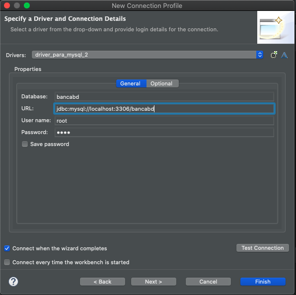

Al hacer el Test de Conexión nos dimos cuenta de este pequeño fallo y así ponemos el nombre adecuado.

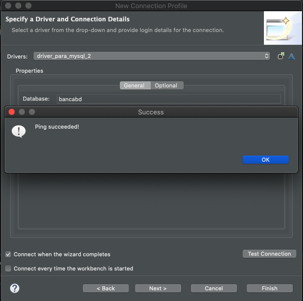

**NOTA:** Un pequeño parentesis, antes de continuar. Si necesitamos por algún motivo editar las conexiones de base de datos que tenemos. Bueno tenemos aquí un pequeño truquillo si nos vamos a las perspectivas hay una de las perspectivas en Eclipse que se llama `Database Development`. Por ejemplo yo no he estado salvando el password de la conexión y he notado que al momento de hacer el ping no me lo hace, el motivo puede ser ese, por lo que tendría que editar dichas conexiones. La forma de hacerlo es abrir la perspectiva `Database Development`.

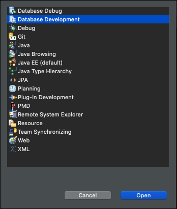

Si entramos en esa perspectiva vemos aquí todas las conexiones que se han ido creando con el asistente y uno de ellos es precisamente `bancabd`.

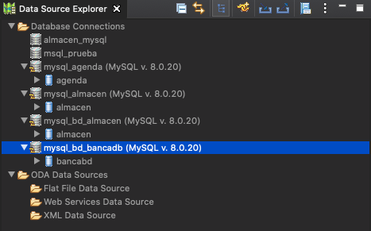

Para posteriores veces donde quieras crear a lo mejor otra vez las entidades o nuevas entidades de esa base de datos para que no tengas que volver a crear de nuevo otra conexión 

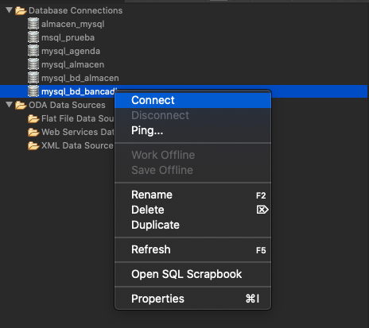

te vas aquí y deberíamos conectarnos. 

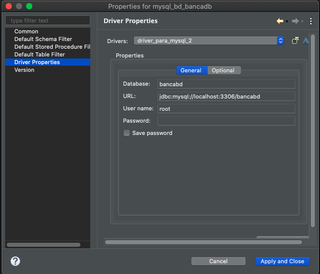

aparecen los datos de conexión que habiamos insertado, lo único que me falta es la contraseña porque no le di a la opción de guardar para que se quedara guardada para las siguientes veces

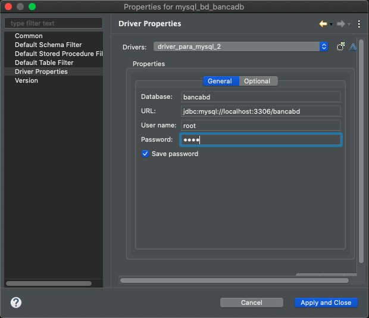

entonces usamos el botón Apply and Close y se genera la conexión con esa base de datos.

Si volvemos a la perspectiva Java EE ya voy a poder volver al asistente JPA Tools - Generate Entity Tables ... y así elegir la conexión `mysql_bd_bancabd`  y aparecen los datos de la base de datos y las tres tablas que hay.

Una vez creada la conexión a la base de datos ya podemos seleccionar el Schema y me aparecen las tablas.

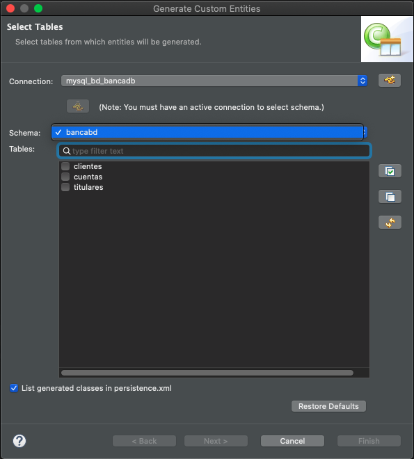

Nosotros vamos a generar entidades de dos tablas `clientes` y `cuentas` no de `titulares`, `titulares` es la tabla de Join no la tenemos que elegir aquí 

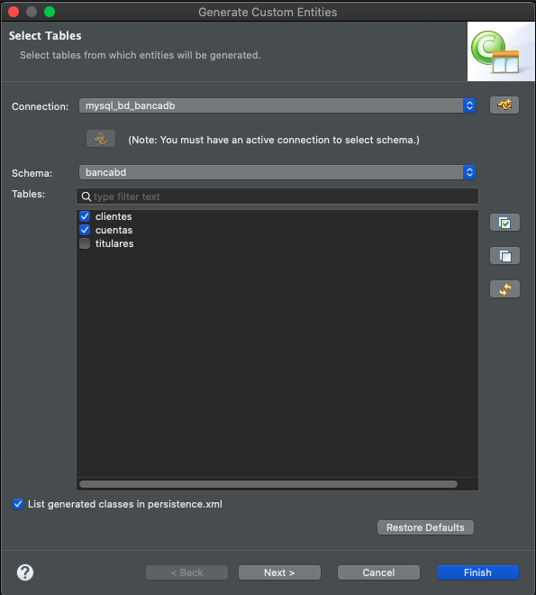

vamos al siguiente paso 


y pulsamos el botón `New Association`

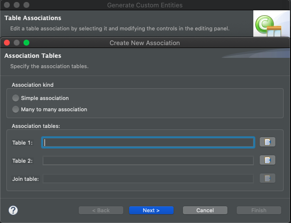

para crear la asociación que va a ser de tipo Muchos a Muchos, primera tabla por ejemplo `cuentas` segunda tabla `clientes`,  tabla Join, tabla de unión que contiene las Primary Keys de las dos tablas o le damos a este botoncito y ahora sí aparecen las tres aunque no haya elegido titulares pero aparecen todas las que hay para que pueda elegir `titulares`.

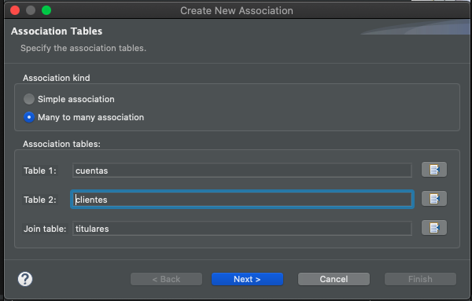

En el siguiente paso 

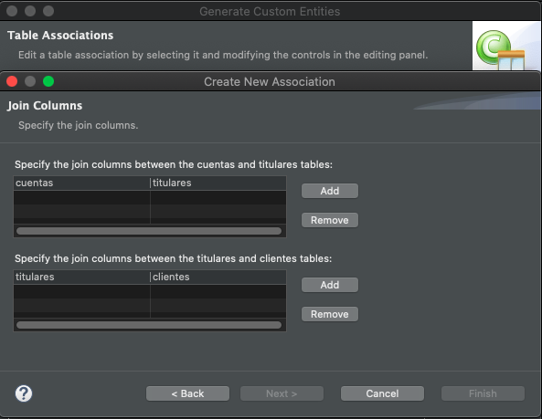

nos va a decir que especificamos las columnas de unión entre cuentas y titulares y entre titulares y clientes, bien aquí pulsando el boton Add

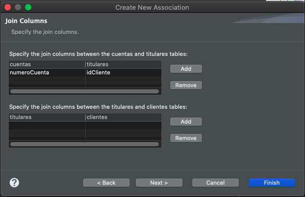

Lógicamente el `numeroCuenta` en `cuentas` y tenemos que cambiar `idCliente` por `idCuenta` para `titulares` que es la tabla de Join.

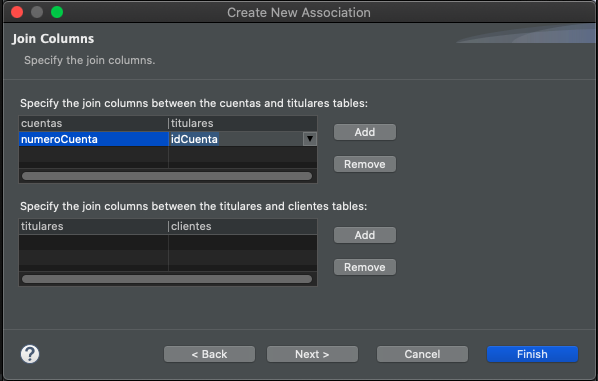

Abajo hacemos lo mismo presionamos Add,

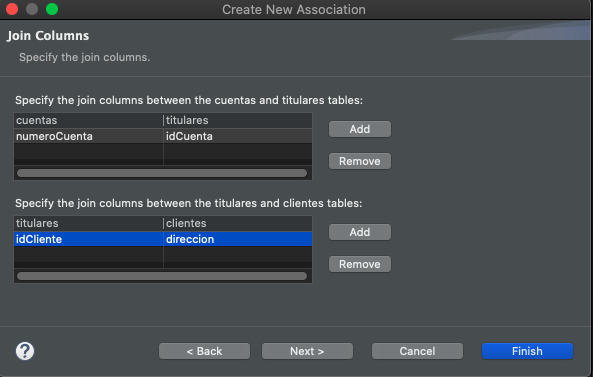

en `titulares` esta bien `idCliente` pero en `clientes` debe ser `dni`.

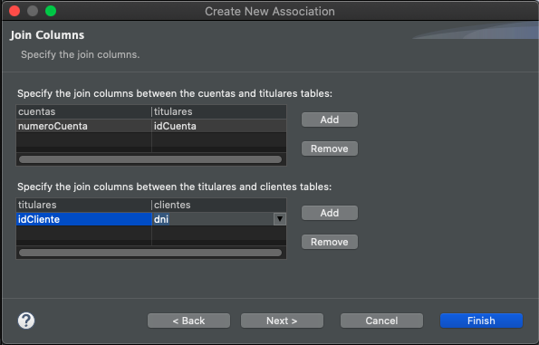

Pues ya tenemos toda la información de unión, el siguiente paso.

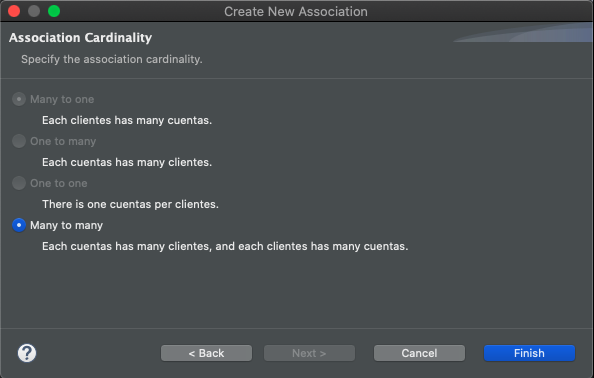

La única opción que cabe es Many to Many finalizamos.

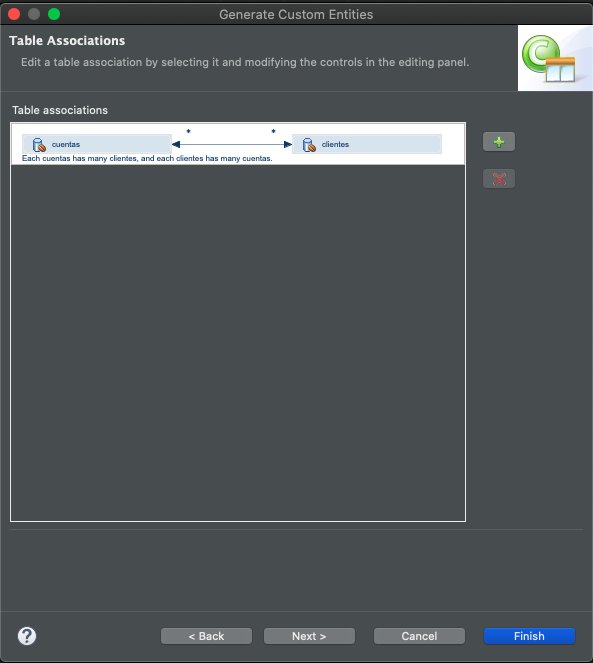

Aquí aparece la relación, si pinchamos en la imagen aparecen los detalles

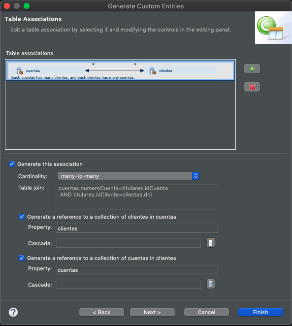

y ya en el siguiente paso 

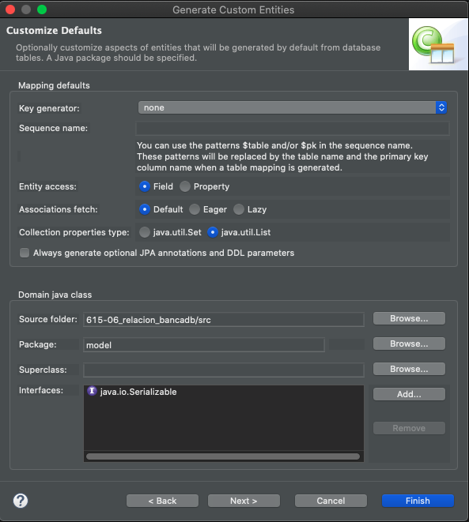

pues como de costumbre debemos indicarnos cuáles son la la forma de generación de las claves y cómo van a ser los campos de colección, vamos a dejar siempre por efecto List, el paquete `entidades`.

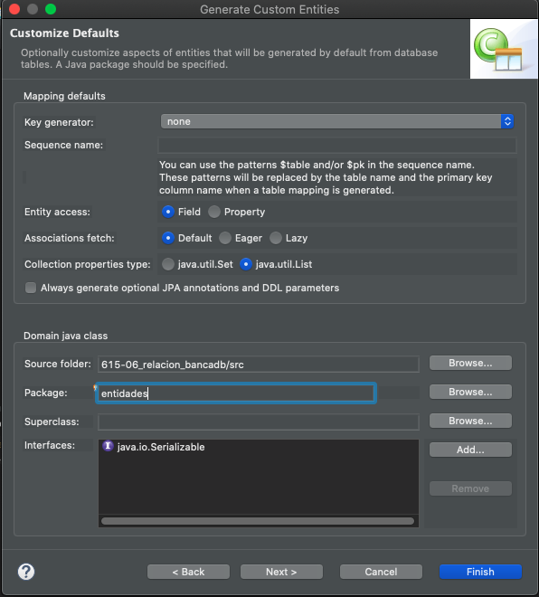

y en el siguiente paso vamos a ir tabla por tabla indicando `clientes`, entidad correspondiente `Cliente` forma de generación de clave ninguna (none), puesto que el DNI del cliente no es autogenerado, no se va a generar de forma automática.

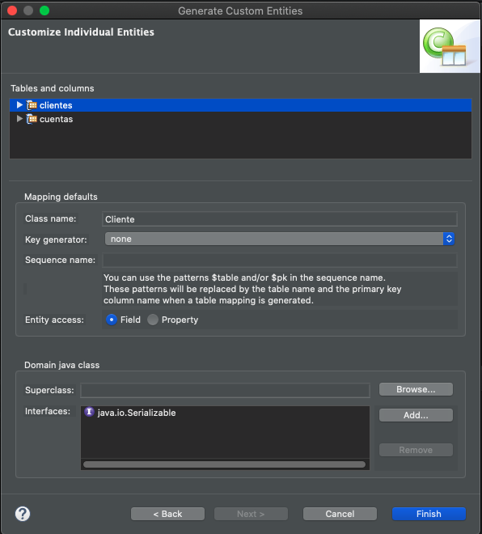

con `cuentas` lo mismo el `numeroCuenta` no se va a generar automáticamente

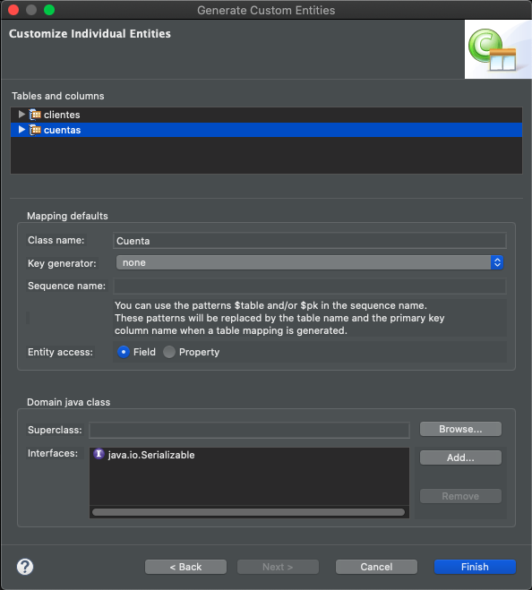

Finalizamos y vamos a ver ahora qué es lo que nos ha creado el asistente.

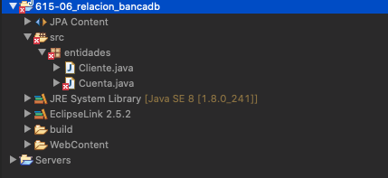

Al ver esto nos vamos a llevar una pequeña desagradable sorpresa, existen errores. Y es que por ejemplo vamos a la entidad `Cliente`.

*`Cliente`*

```java
package entidades;

import java.io.Serializable;
import javax.persistence.*;
import java.util.List;


/**
 * The persistent class for the clientes database table.
 * 
 */
@Entity
@Table(name="clientes")
@NamedQuery(name="Cliente.findAll", query="SELECT c FROM Cliente c")
public class Cliente implements Serializable {
	private static final long serialVersionUID = 1L;

	@Id
	private int dni;

	private String direccion;

	private String nombre;

	private int telefono;

	//bi-directional many-to-many association to Cuenta
	@ManyToMany(mappedBy="clientes")
	private List<Cuenta> cuentas;

	public Cliente() {
	}

	public int getDni() {
		return this.dni;
	}

	public void setDni(int dni) {
		this.dni = dni;
	}

	public String getDireccion() {
		return this.direccion;
	}

	public void setDireccion(String direccion) {
		this.direccion = direccion;
	}

	public String getNombre() {
		return this.nombre;
	}

	public void setNombre(String nombre) {
		this.nombre = nombre;
	}

	public int getTelefono() {
		return this.telefono;
	}

	public void setTelefono(int telefono) {
		this.telefono = telefono;
	}

	public List<Cuenta> getCuentas() {
		return this.cuentas;
	}

	public void setCuentas(List<Cuenta> cuentas) {
		this.cuentas = cuentas;
	}

}
```

En la entidad `Cliente` nos ha puesto efectivamente un atributo con la lista de todos los objetos cuenta asociados a ese cliente 

```java
//bi-directional many-to-many association to Cuenta
@ManyToMany(mappedBy="clientes")
private List<Cuenta> cuentas;
```

Se supone que entonces serían en `Cuenta` donde tendríamos la información de configuración de la relación. Si vemos `Cuenta`.

*`Cuenta`*

```java
package entidades;

import java.io.Serializable;
import javax.persistence.*;
import java.util.List;


/**
 * The persistent class for the cuentas database table.
 * 
 */
@Entity
@Table(name="cuentas")
@NamedQuery(name="Cuenta.findAll", query="SELECT c FROM Cuenta c")
public class Cuenta implements Serializable {
	private static final long serialVersionUID = 1L;

	@Id
	private int numeroCuenta;

	private double saldo;

	private String tipocuenta;

	//bi-directional many-to-many association to Cliente
	@ManyToMany
	@JoinColumn(name="numeroCuenta")
	private List<Cliente> clientes;

	public Cuenta() {
	}

	public int getNumeroCuenta() {
		return this.numeroCuenta;
	}

	public void setNumeroCuenta(int numeroCuenta) {
		this.numeroCuenta = numeroCuenta;
	}

	public double getSaldo() {
		return this.saldo;
	}

	public void setSaldo(double saldo) {
		this.saldo = saldo;
	}

	public String getTipocuenta() {
		return this.tipocuenta;
	}

	public void setTipocuenta(String tipocuenta) {
		this.tipocuenta = tipocuenta;
	}

	public List<Cliente> getClientes() {
		return this.clientes;
	}

	public void setClientes(List<Cliente> clientes) {
		this.clientes = clientes;
	}

}
```

Resulta que sí tenemos aquí el atributo `clientes`, con la lista de objetos clientes relacionados, aquí tendría que estar la información de configuración, pero no está, por algún motivo que tampoco se explicar, el asistente no es capaz de generar y es aquí donde nos marca el error.

```java
//bi-directional many-to-many association to Cliente
@ManyToMany
@JoinColumn(name="numeroCuenta")
private List<Cliente> clientes;
```

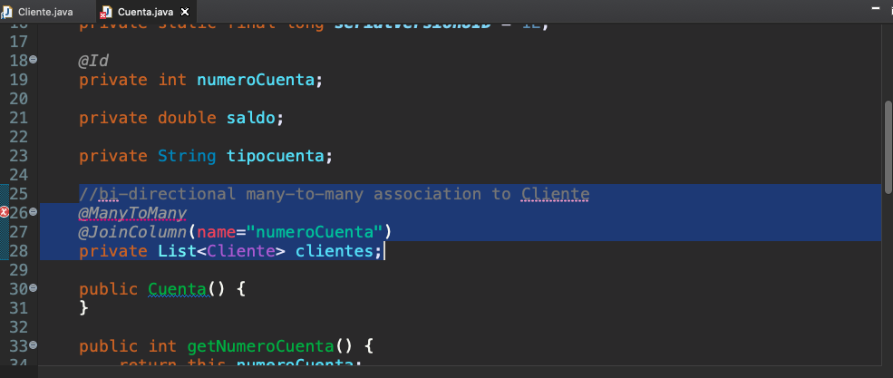

entonces eso ya lo tenemos que hacer nosotros a mano.

En `Cliente` que es la entidad que elegimos como propietaria, cuando explicamos todo esto en la lección anterior, la lección correspondiente a las relaciones entre entidades, aquí en `Cliente` concretamente en este atributo `cuentas`, la colección cuenta, es donde vamos a cambiar esto:

```java
//bi-directional many-to-many association to Cuenta
@ManyToMany(mappedBy="clientes")
private List<Cuenta> cuentas;
```

Por esto:

```java
@ManyToMany
@JoinTable(name = "Titulares", 
	joinColumns = @JoinColumn(name="idCliente", referencedColumnName = "dni"),
	inverseJoinColumns = @JoinColumn(name="idCuenta", referencedColumnName = "numeroCuenta"))
private List<Cuenta> cuentas;
```

Hemos anotado el atributo `cuentas` con `@ManyToMany` y luego con la anotación `@JoinTable` indicamos cual la tabla de Join en este caso `Titulares` y la relación de la tabla de `Titulares` con la tabla de `Clientes` con el atributo `joinColumn` y la relación entre ambas las tablas de `Titulares` con la tabla de `Cuentas` con el atributo `inverseJoinColumn`.

Y en la Entidad Cuenta tenemos que cambiar esto:


```java
//bi-directional many-to-many association to Cliente
@ManyToMany
@JoinColumn(name="numeroCuenta")
private List<Cliente> clientes;
```

Por 

```java
//bi-directional many-to-many association to Cliente
@ManyToMany(mappedBy="cuentas")
private List<Cliente> clientes;
```

El error desaparece ahora tenemos completamente relacionada ambas entidades, ahora si estan relacionadas Muchos a Muchos correctamente ya podríamos operar con ellas.

### :computer: Código Completo - 615-06_relacion_bancadb

Este código realmente no hace nada, así como esta.

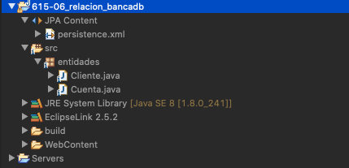


*`persistence.xml`*

```html
<?xml version="1.0" encoding="UTF-8"?>
<persistence version="2.2" xmlns="http://xmlns.jcp.org/xml/ns/persistence" xmlns:xsi="http://www.w3.org/2001/XMLSchema-instance" xsi:schemaLocation="http://xmlns.jcp.org/xml/ns/persistence http://xmlns.jcp.org/xml/ns/persistence/persistence_2_2.xsd">
	<persistence-unit name="615-06_relacion_bancadb">
		<class>entidades.Cliente</class>
		<class>entidades.Cuenta</class>
	</persistence-unit>
</persistence>
```

**Entidades**

*`Cliente.java`*

```java
package entidades;

import java.io.Serializable;
import java.util.List;

import javax.persistence.Entity;
import javax.persistence.Id;
import javax.persistence.JoinColumn;
import javax.persistence.JoinTable;
import javax.persistence.ManyToMany;
import javax.persistence.NamedQuery;
import javax.persistence.Table;


/**
 * The persistent class for the clientes database table.
 * 
 */
@Entity
@Table(name="clientes")
@NamedQuery(name="Cliente.findAll", query="SELECT c FROM Cliente c")
public class Cliente implements Serializable {
	private static final long serialVersionUID = 1L;

	@Id
	private int dni;

	private String direccion;

	private String nombre;

	private int telefono;

	//bi-directional many-to-many association to Cuenta
	@ManyToMany
	@JoinTable(name = "Titulares", 
	joinColumns = @JoinColumn(name="idCliente", referencedColumnName = "dni"),
	inverseJoinColumns = @JoinColumn(name="idCuenta", referencedColumnName = "numeroCuenta"))
	private List<Cuenta> cuentas;

	public Cliente() {
	}

	public int getDni() {
		return this.dni;
	}

	public void setDni(int dni) {
		this.dni = dni;
	}

	public String getDireccion() {
		return this.direccion;
	}

	public void setDireccion(String direccion) {
		this.direccion = direccion;
	}

	public String getNombre() {
		return this.nombre;
	}

	public void setNombre(String nombre) {
		this.nombre = nombre;
	}

	public int getTelefono() {
		return this.telefono;
	}

	public void setTelefono(int telefono) {
		this.telefono = telefono;
	}

	public List<Cuenta> getCuentas() {
		return this.cuentas;
	}

	public void setCuentas(List<Cuenta> cuentas) {
		this.cuentas = cuentas;
	}

}
```

*`Cuenta.java`*

```java
package entidades;

import java.io.Serializable;
import javax.persistence.*;
import java.util.List;


/**
 * The persistent class for the cuentas database table.
 * 
 */
@Entity
@Table(name="cuentas")
@NamedQuery(name="Cuenta.findAll", query="SELECT c FROM Cuenta c")
public class Cuenta implements Serializable {
	private static final long serialVersionUID = 1L;

	@Id
	private int numeroCuenta;

	private double saldo;

	private String tipocuenta;

	//bi-directional many-to-many association to Cliente
	@ManyToMany(mappedBy="cuentas")
	private List<Cliente> clientes;

	public Cuenta() {
	}

	public int getNumeroCuenta() {
		return this.numeroCuenta;
	}

	public void setNumeroCuenta(int numeroCuenta) {
		this.numeroCuenta = numeroCuenta;
	}

	public double getSaldo() {
		return this.saldo;
	}

	public void setSaldo(double saldo) {
		this.saldo = saldo;
	}

	public String getTipocuenta() {
		return this.tipocuenta;
	}

	public void setTipocuenta(String tipocuenta) {
		this.tipocuenta = tipocuenta;
	}

	public List<Cliente> getClientes() {
		return this.clientes;
	}

	public void setClientes(List<Cliente> clientes) {
		this.clientes = clientes;
	}

}
```

# 24 Ejercicio práctico IV parte I 07:19


Bueno pues después de haber visto cómo crear entidades relacionadas utilizando Eclipse, qué te parece si hacemos una aplicación donde pongamos en práctica lo que hemos estudiado.

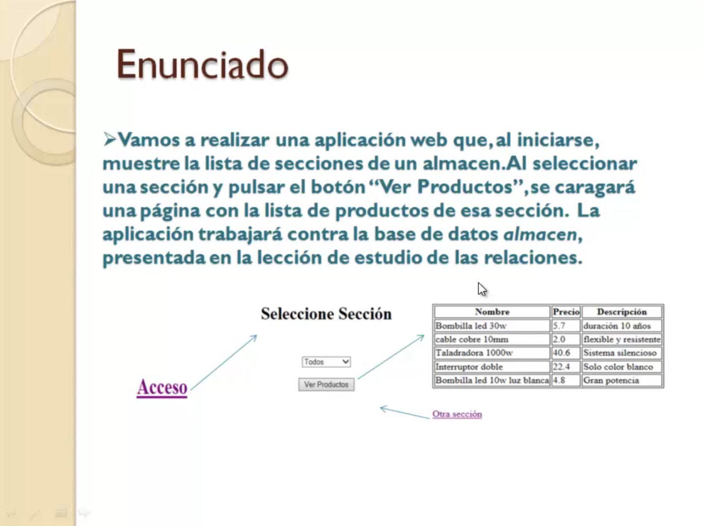

La idea se trataría de desarrollar una aplicación Web en la que vamos a trabajar con la base de datos de almacén la que hemos creado las relaciones Uno a Muchos - Muchos a Uno anteriormente y se trataría de tener una página inicial con un enlace que nos daría acceso a una página en la que podríamos seleccionar la sección cuyos productos queremos consultar, es una aplicación para consulta de productos.

Si seleccionamos una sección al pulsar el botón *Ver Productos* veríamos los productos que pertenecen a dicha sección su nombre, precio y descripción. Tendríamos también una opción Todos que al seleccionarlo nos mostraría los productos de todas las secciones.

En la tercera página habría un enlace para volver otra vez a la página de Selección de Sección.

### Creación de la Aplicación

Lo primero que vamos a recordar son los datos de nuestra la base de datos que usaremos en esta aplicación el nombre es `almacen`.


La base de datos tiene 4 tablas pero para esta aplicación solo vamos a usar dos de ellas `secciones` y `productos`, los datos que contienen actualmente son:

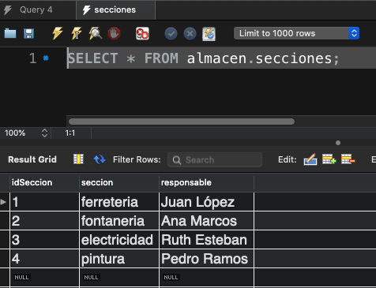

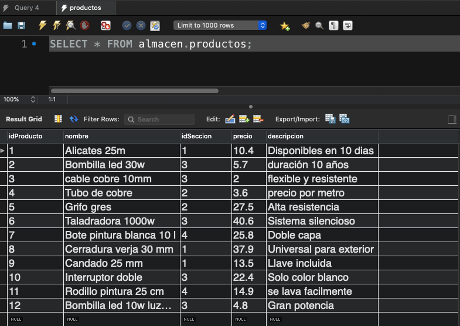

#### 1. Creación DataSource y JNDI en GlassFish.

Lo primero que vamos a hacer antes de nada será crear el DataSource en GlassFish para poder acceder a la base de datos `almacen`.

Por lo que nos vamos a GlassFish - Resources - JDBC - JDBC Connections Pools

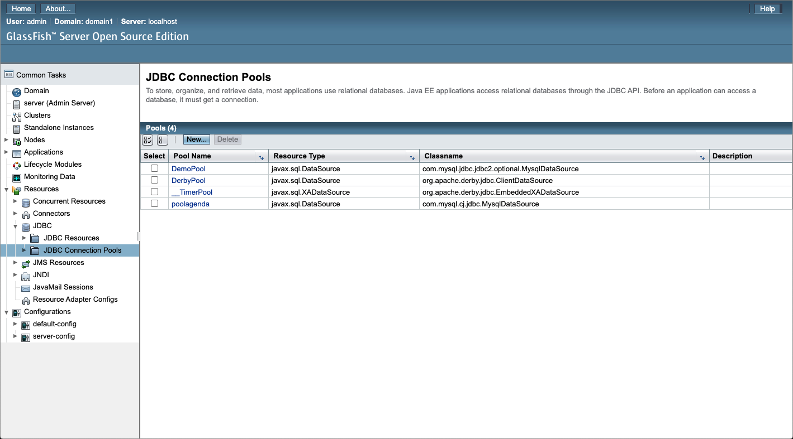

Vamos a presionar el botón New

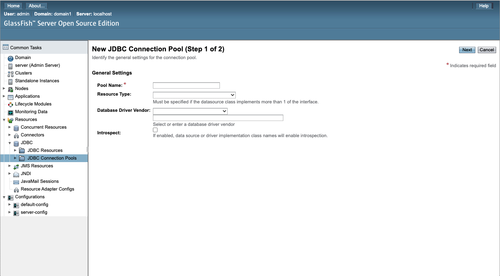

Ingresamos los datos para este nuevo DataSource.

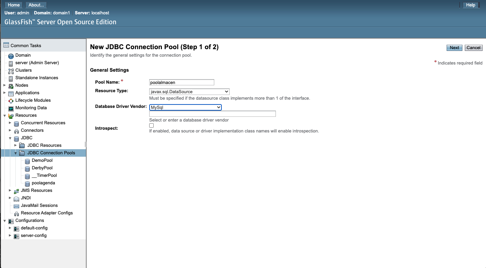

Damos a siguiente paso

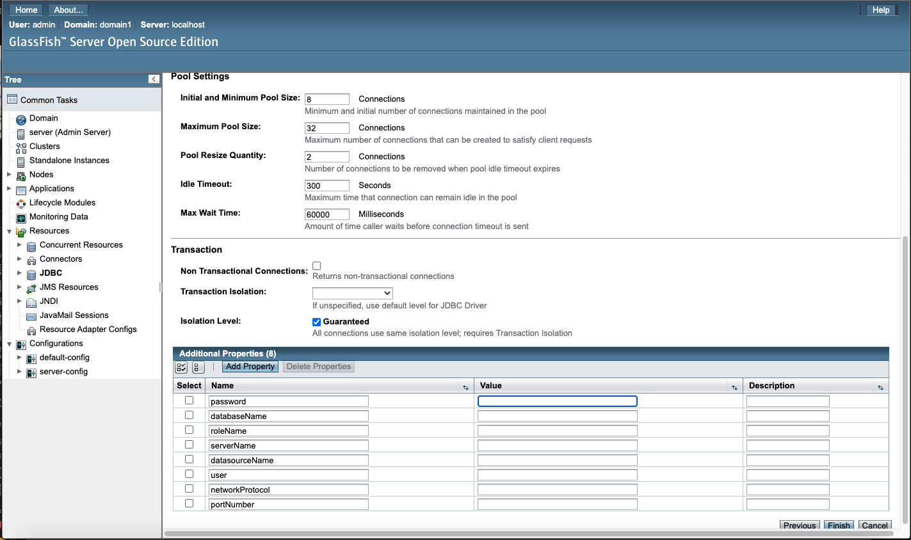

Aquí debemos meter las propiedades necesarias para poder hacer la conexión, algunas de las que necesitamos no aparecen hay que añadirlas.

Las propiedades completas son:

databaseName: almacen
password: root
Port: 3306
portNumber: 3306
serverName: localhost
Url: jdbc:mysql://localhost:3306/almacen?serverTimezone=UTC
URL: jdbc:mysql://localhost:3306/almacen?serverTimezone=UTC
user: root
useSSL: false

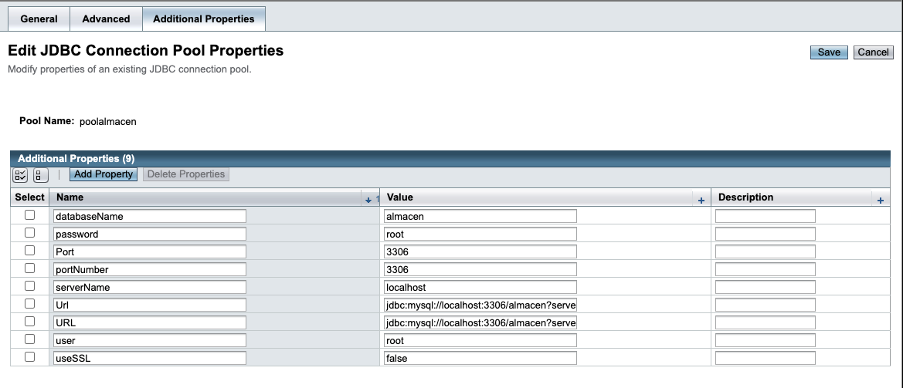

ademas en la pestaña General en el dato Datasource Classname: tuvimos que cambiar el valor que salia por `com.mysql.cj.jdbc.MysqlDataSource` para que funcione.

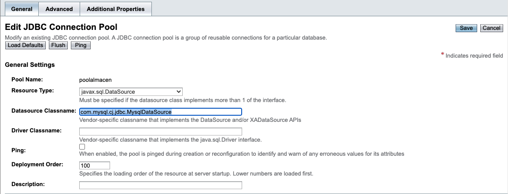

Al presionar el botón Ping para probar la conexión a la base de datos nos muesta **Ping Succeeded**

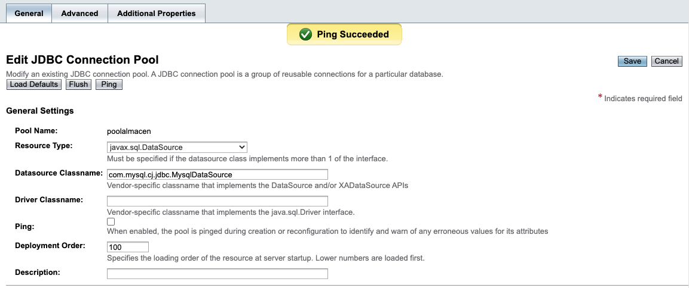

Por lo que ya tenemos nuestra JDBC Connection Pools `poolalmacen` funcionando.

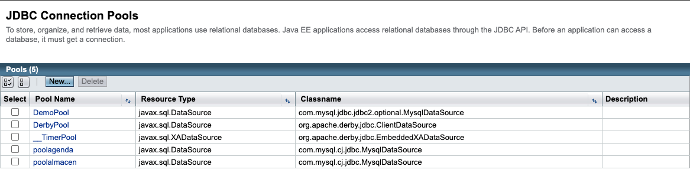

Nos fata hacer el JNDI para lo cual vamos a JDBC Resources 

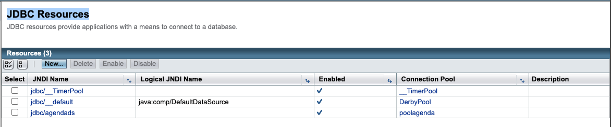

Presionamos New para crear un nuevo JNDI e ingresamos los datos solicitados.

JNDI Name: `jdbc/almacends`
Pool Name: `poolalmacen`

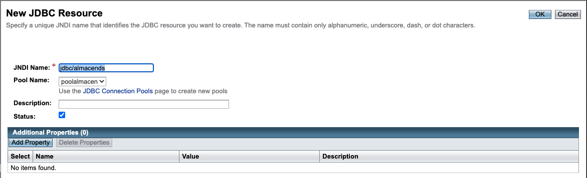

Presionamos OK.

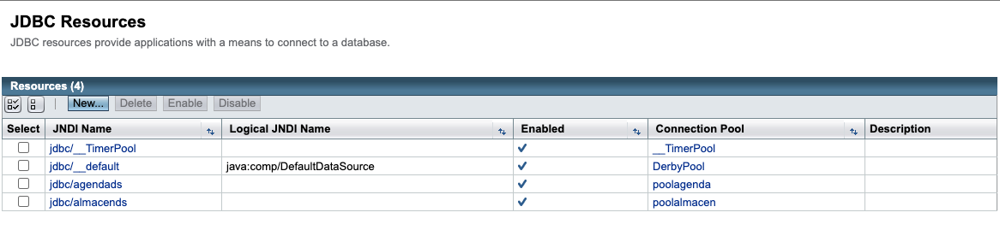

Perfecto ahora si ya esta nuestro DataSource y JNDI completamente funcional.

#### 2. Creación Proyecto Eclipse 615-07_proyecto_relacion_almacen. Repetir los pasos de la sección "22 Crear entidades relacionadas parte I" para crear la capa de Persistencia y las Entidades Seccion y Producto.

1. Creación Proyecto Eclipse

   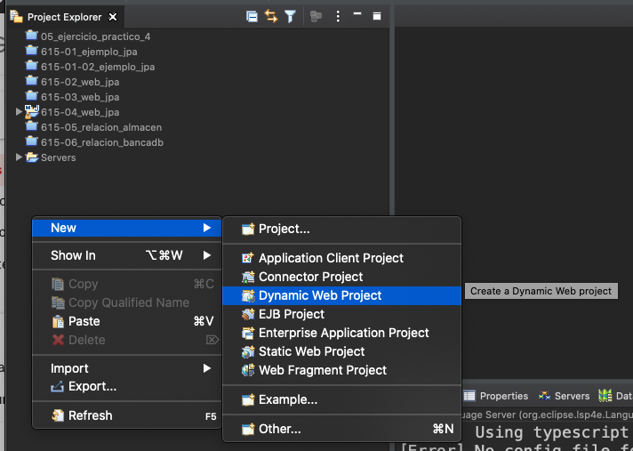

   Metemos nombre y tipo de Servidor que vamos a usar en este proyecto.

   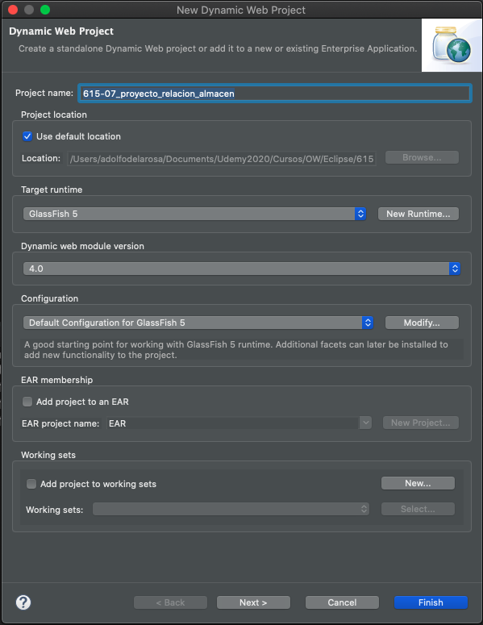

   Finalizamos. Y el proyecto se crea con la estructura básica.

   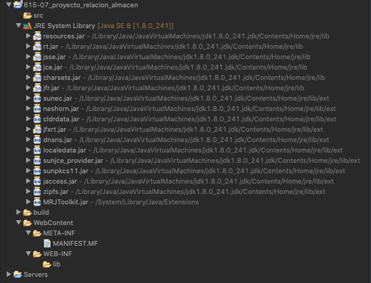

2. Lo primero que vamos a hacer es incorporar la característica JPA a nuestro proyecto, nos vamos a ir a través del botón derecho a las propiedades y en Project Faces activaremos JPA.

   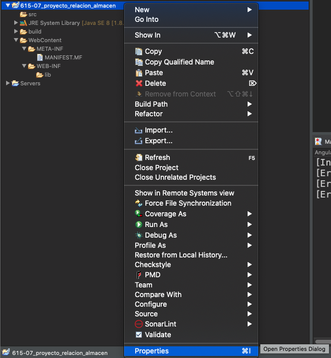

   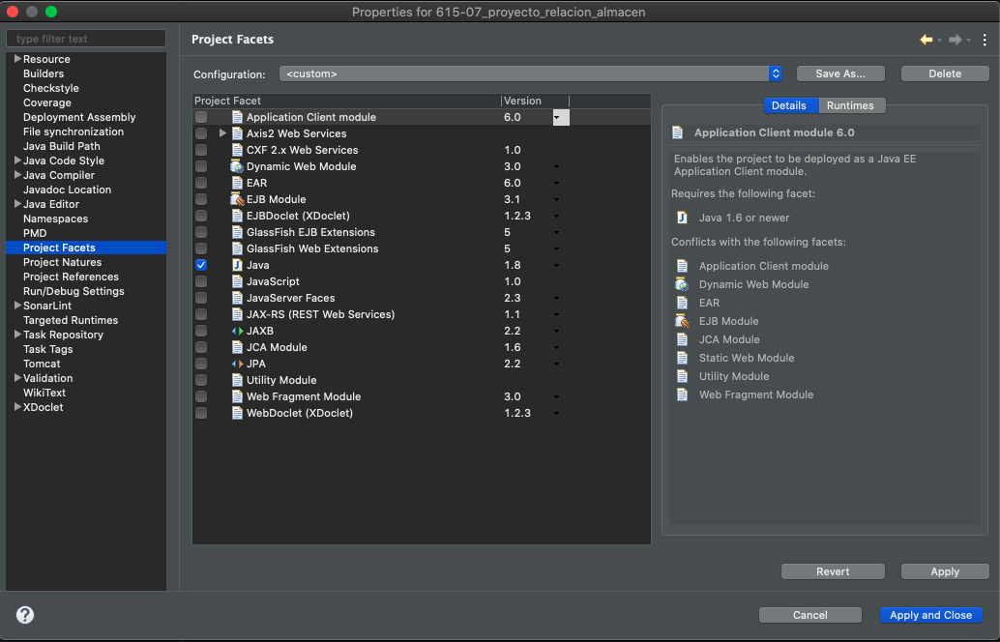

   

   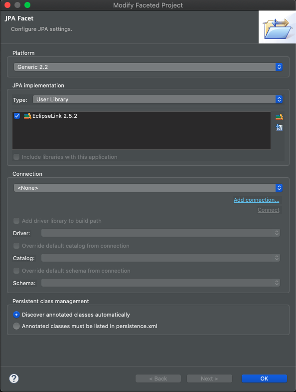

   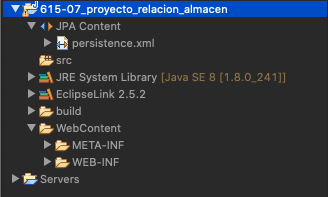

   Con esto vemos que se ha creado el archivo `persistence.xml` con el siguiente contenido.

   *`persistence.xml`*

   ```html
   <?xml version="1.0" encoding="UTF-8"?>
   <persistence version="2.2" xmlns="http://xmlns.jcp.org/xml/ns/persistence" xmlns:xsi="http://www.w3.org/2001/XMLSchema-instance" xsi:schemaLocation="http://xmlns.jcp.org/xml/ns/persistence http://xmlns.jcp.org/xml/ns/persistence/persistence_2_2.xsd">
      <persistence-unit name="615-07_proyecto_relacion_almacen">
      </persistence-unit>
   </persistence>
   ```

   Podemos observar que la Unidad de Persistencia se llama `615-07_proyecto_relacion_almacen`.

3. Ahora vamos a proceder como siempre que queremos generar entidades a irnos a la opción botón derecho dentro del proyecto, JPA Tools - Generate entities from Tables ..., generar entidades desde tablas.

   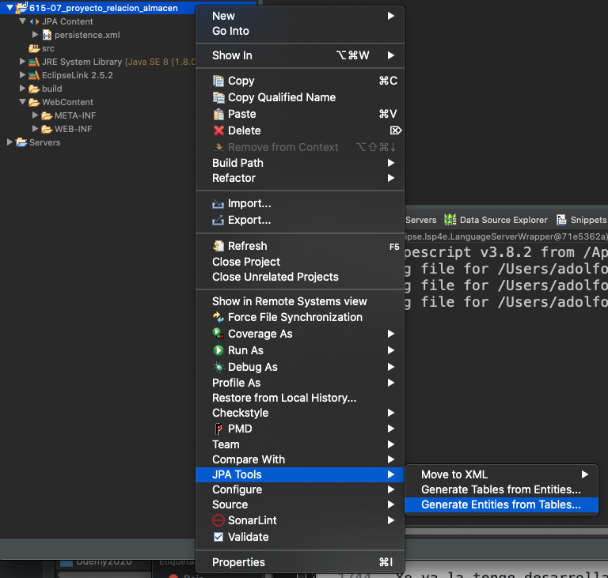
   
   
   
   Entonces aquí lo que vamos a tener que hacer es crear una conexión a la base de datos `almacen` que hemos creado, es una base de datos de MySQL vamos a llamar a la conexión por ejemplo `mysql_proyecto_almacen`. Podríamos haber usado la conexión `mysql_bd_almacen` que creamos en la lección 22, pero lo hacemos para repasar la creación de conexiones.
   
   
   
   En el siguiente paso.
   
   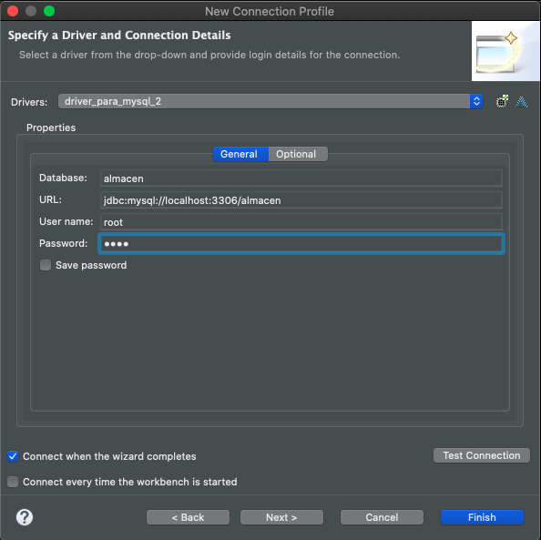
   
   Seleccionamos el Driver y rellenamos los datos para la conexión a la base de datos `almacen`. Podemos hacer un Test de la conexión.
   
   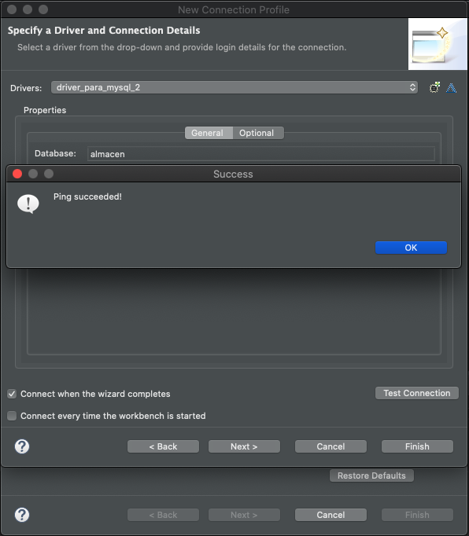
   
   Al dar el botón OK, regresamos a la pantalla inicial.
   
   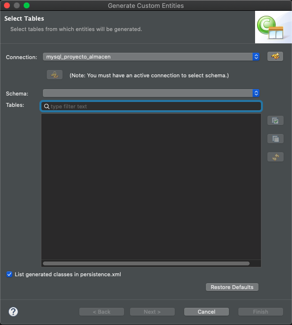
   
   Aquí seleccionamos el Schema `almacen` y con esto nos aparecen las 4 tablas de este esquema.
   
   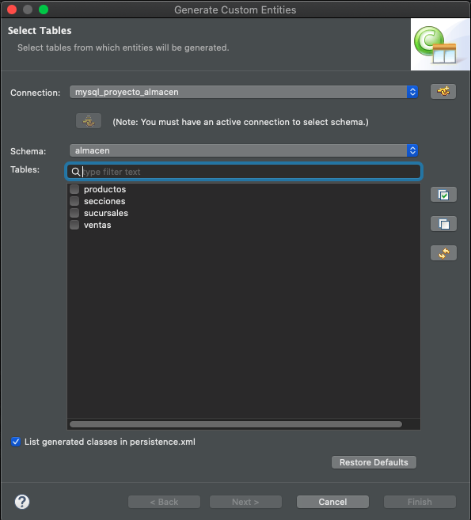
   
   Seleccionamos las dos tablas con las que vamos a trabajar en este proyecto `Productos` y `Secciones`.
   
   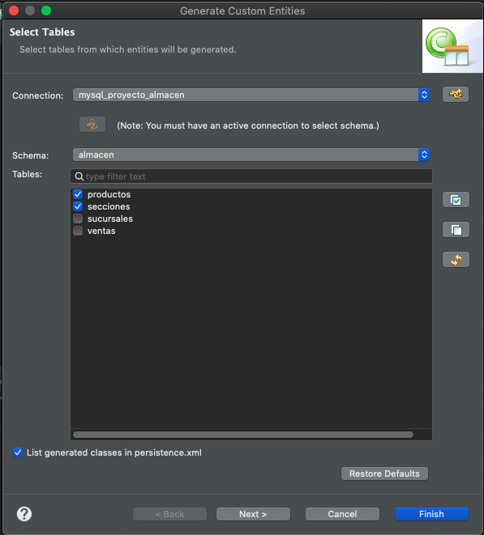
   
   Damos al botón siguiente donde se van a crear la relación entre tablas.
   
   
   
   Presionamos el botón New Association
   
   
   
   Vamos a añadir aquí una nueva Asociación de Tablas que es como llama Eclipse la relación entre entidades. En nuestro caso se trataba de una Relación Uno a Muchos y Muchos a Uno, por lo tanto le dejaremos la opción simple. Elegimos una de las tablas secciones por ejemplo y tabla dos productos.
   
   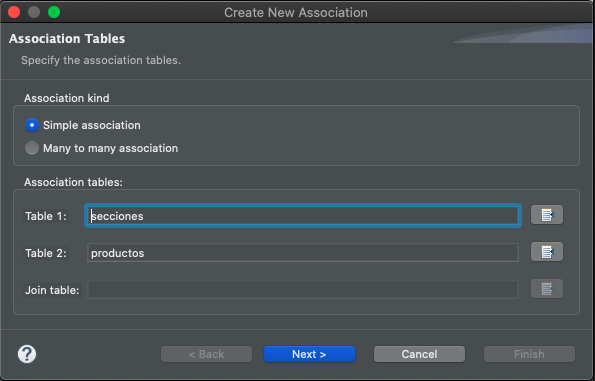
   
   En el siguiente paso. 
   
   
   
   Vamos a indicar de ambas tablas cuál es el campo común, la columna común a ambas tablas a través del botón Add, ponemos para ambas tablas el campo `idSeccion`.
   
   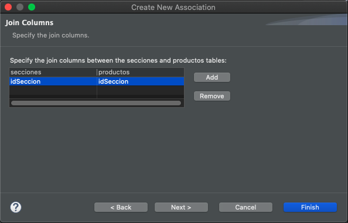
   
   Vamos al siguiente paso.
   
   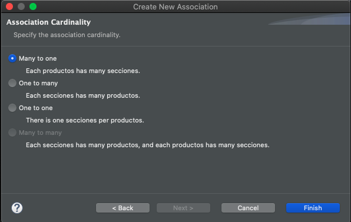
   
   Debemos elegir el tipo de relación queremos entre las dos Entidades que vamos a generar a partir de las tablas, pueden ser Muchos a Uno, a cada producto le corresponden muchas secciones no es el caso, sino Uno a Muchos a cada sección le corresponden muchos productos, que obviamente se traducirá en el lado de producto en una relación tipo Muchos a Uno, muchos productos a una sección.
   
   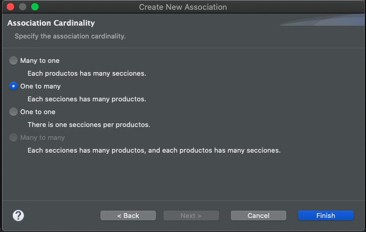
   
   Una vez ya elegido esto finalizamos aparece aquí la información de la relación gráficamente.
   
   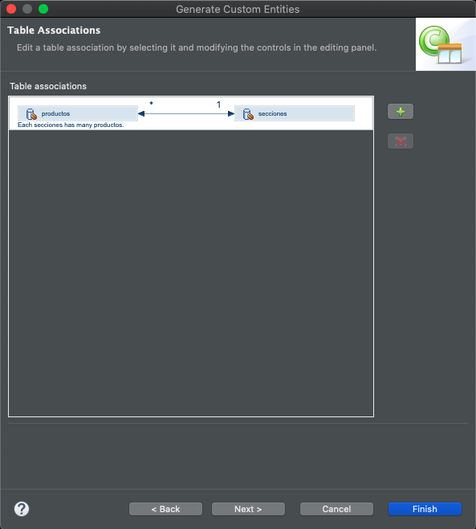
   
   Si pulsamos sobre ella nos indica las propiedades que hemos configurado.
   
   
   
   En el siguiente paso.
   
   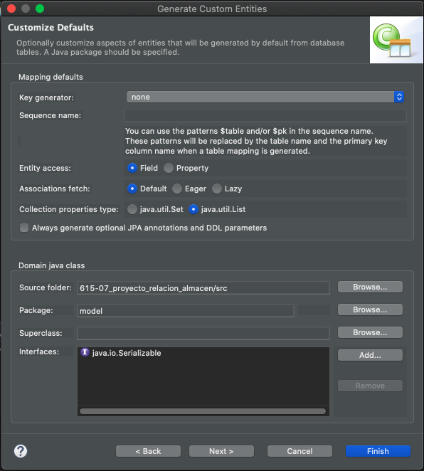
   
   Demos indicar ya los datos que normalmente indicamos cuando vamos a crear entidades a partir de las tablas. En la generación de claves(Key generator) de momento no decimos nada, luego se lo vamos a indicar uno por uno en el paso siguiente, lo que si queremos que las entidades se generen en el paquete `entidades` no en model como indica lo cambiamos, muy importante ahora porque como se trata de asociación de Uno a Muchos - Muchos a Uno, va a haber entidades que tendrán campos de colección, debemos indicar en Collection properties type si queremos que esas colecciones sean de tipo Set o List que es el que habitualmente se suele utilizar.
   
   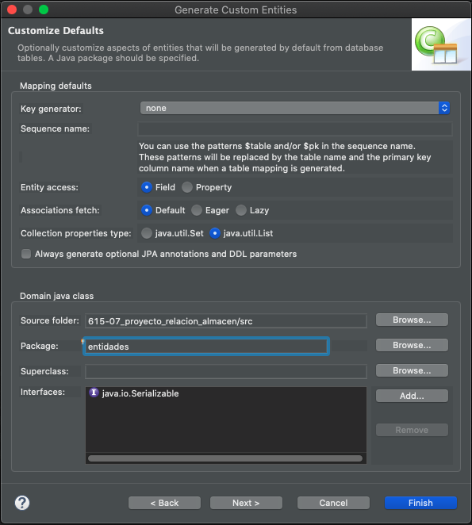
   
   En el siguiente paso
   
   
   
   Tabla `Productos`, nombre de la entidad `Producto`, generación de clave `identity`.
   
   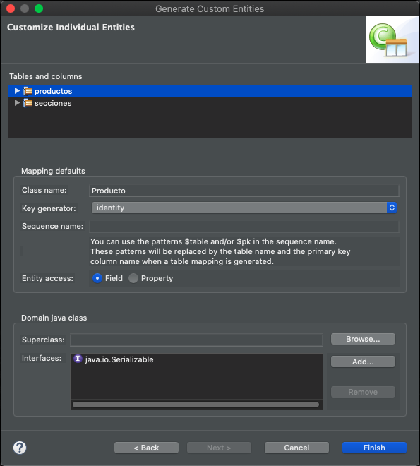
   
   Tabla `Secciones` nombre de la clase `Seccion`, generación de clave también es `identity`.
   
   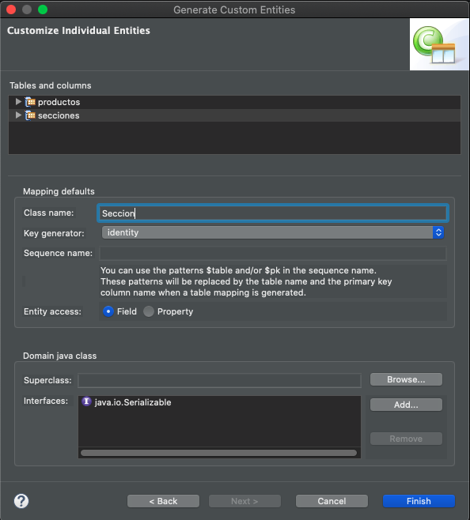
   
   Finalizamos y ya tenemos nuestras entidades generadas y relacionadas.
   
   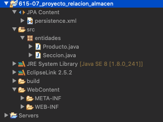
   
   Vamos a comprobarlo, empezamos por la Entidad `Seccion` la del lado 1.
   
   *`Seccion`*
   
   ```html
   package entidades;

   import java.io.Serializable;
   import javax.persistence.*;
   import java.util.List;

   /**
   * The persistent class for the secciones database table.
   * 
   */
   @Entity
   @Table(name="secciones")
   @NamedQuery(name="Seccion.findAll", query="SELECT s FROM Seccion s")
   public class Seccion implements Serializable {
	private static final long serialVersionUID = 1L;

	@Id
	@GeneratedValue(strategy=GenerationType.IDENTITY)
	private int idSeccion;

	private String responsable;

	private String seccion;

	//bi-directional many-to-one association to Producto
	@OneToMany(mappedBy="seccione")
	private List<Producto> productos;

	public Seccion() {
	}

	public int getIdSeccion() {
		return this.idSeccion;
	}

	public void setIdSeccion(int idSeccion) {
		this.idSeccion = idSeccion;
	}

	public String getResponsable() {
		return this.responsable;
	}

	public void setResponsable(String responsable) {
		this.responsable = responsable;
	}

	public String getSeccion() {
		return this.seccion;
	}

	public void setSeccion(String seccion) {
		this.seccion = seccion;
	}

	public List<Producto> getProductos() {
		return this.productos;
	}

	public void setProductos(List<Producto> productos) {
		this.productos = productos;
	}

	public Producto addProducto(Producto producto) {
		getProductos().add(producto);
		producto.setSeccione(this);

		return producto;
	}

	public Producto removeProducto(Producto producto) {
		getProductos().remove(producto);
		producto.setSeccione(null);

		return producto;
	}

   }
   ```
   
   Vemos las anotaciones clásicas y ademas ese nuevo atributo `productos``
   
   
   ```java
   //bi-directional many-to-one association to Producto
   @OneToMany(mappedBy="seccione")
   private List<Producto> productos;
   ```

   Que contienen la colección de productos asociados a esta sección anotada con @OneToMany(mappedBy="seccione") el nombre del atributo de la otra Entidad de Producto, que contiene el objeto seccione asociado, le a puesto seccione lo podemos cambiar o lo podemos dejar así no pasa nada.

   Vamos a ver esa Entidad Producto
   
   *`Producto`*
   
   ```html
   package entidades;

   import java.io.Serializable;
   import javax.persistence.*;


   /**
    * The persistent class for the productos database table.
    * 
    */
   @Entity
   @Table(name="productos")
   @NamedQuery(name="Producto.findAll", query="SELECT p FROM Producto p")
   public class Producto implements Serializable {
	private static final long serialVersionUID = 1L;

	@Id
	@GeneratedValue(strategy=GenerationType.IDENTITY)
	private int idProducto;

	private String descripcion;

	private String nombre;

	private double precio;

	//bi-directional many-to-one association to Seccion
	@ManyToOne
	@JoinColumn(name="idSeccion")
	private Seccion seccione;

	public Producto() {
	}

	public int getIdProducto() {
		return this.idProducto;
	}

	public void setIdProducto(int idProducto) {
		this.idProducto = idProducto;
	}

	public String getDescripcion() {
		return this.descripcion;
	}

	public void setDescripcion(String descripcion) {
		this.descripcion = descripcion;
	}

	public String getNombre() {
		return this.nombre;
	}

	public void setNombre(String nombre) {
		this.nombre = nombre;
	}

	public double getPrecio() {
		return this.precio;
	}

	public void setPrecio(double precio) {
		this.precio = precio;
	}

	public Seccion getSeccione() {
		return this.seccione;
	}

	public void setSeccione(Seccion seccione) {
		this.seccione = seccione;
	}

   }
   ```
   
   Vemos que tenemos efectivamente un atributo de tipo `Seccion` llamado `seccione`.
   
   ```java
   //bi-directional many-to-one association to Seccion
   @ManyToOne
   @JoinColumn(name="idSeccion")
   private Seccion seccione;
   ```
   
   Lo a anotado con `@ManyToOne` a través `@JoinColumn(name="idSeccion")` como ya explicamos en la lección 21 se establece el nombre de las columnas que definen esa relación entre las tablas, como en ambas tablas se llama igual basta con indicar el atributo name="idSeccion") para saber que ambas columnas con ese mismo nombre, van a ser las que permiten identificar los objetos asociados a cada una de las otras entidades de la tabla relacionada.

   Por lo tanto ya tenemos las entidades generadas con toda la información de configuración correspondiente a sus relaciones.
   
   Es importante saber que al crear estas dos Entidades en el archivo `persistence.xml` se han añadido.
   
   *`persistence.xml`*
   
   ```html
   <?xml version="1.0" encoding="UTF-8"?>
   <persistence version="2.2" xmlns="http://xmlns.jcp.org/xml/ns/persistence" xmlns:xsi="http://www.w3.org/2001/XMLSchema-instance" xsi:schemaLocation="http://xmlns.jcp.org/xml/ns/persistence http://xmlns.jcp.org/xml/ns/persistence/persistence_2_2.xsd">
      <persistence-unit name="615-07_proyecto_relacion_almacen">
         <class>entidades.Producto</class>
         <class>entidades.Seccion</class>
      </persistence-unit>
   </persistence>
   ```
   
   Pero lo que nos esta faltando es incluir el DataSource de conexión a la base de datos. Vamos al archivo `persistence.xml` y vamos a la pestaña `Connection`.
   
   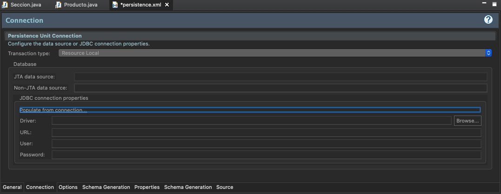
   
   En este caso como vamos a hacer la conexión a traves de DataSource vamos a seleccionar la opción `Default (JTA)` en lugar de `Resource Local` y en el campo `JTA data source:` vamos a poner el nombre del JNDI que creamos en GlassFish `jdbc/almacends`. Por lo que nuestro archivo `persistence.xml` final nos queda así:
   
   *`persistence.xml`*
   
   ```html
   <?xml version="1.0" encoding="UTF-8"?>
   <persistence version="2.2" xmlns="http://xmlns.jcp.org/xml/ns/persistence" xmlns:xsi="http://www.w3.org/2001/XMLSchema-instance" xsi:schemaLocation="http://xmlns.jcp.org/xml/ns/persistence http://xmlns.jcp.org/xml/ns/persistence/persistence_2_2.xsd">
      <persistence-unit name="615-07_proyecto_relacion_almacen">
	 <jta-data-source>jdbc/almacends</jta-data-source>     
         <class>entidades.Producto</class>
         <class>entidades.Seccion</class>
      </persistence-unit>
   </persistence>
   ``` 
   
#### 3. Configurar Proyecto Maven

Vamos a convertir el proyecto aun proyecto Maven para poder meter las dependencias JSTL y el Driver de MySQL que serán necesarias.

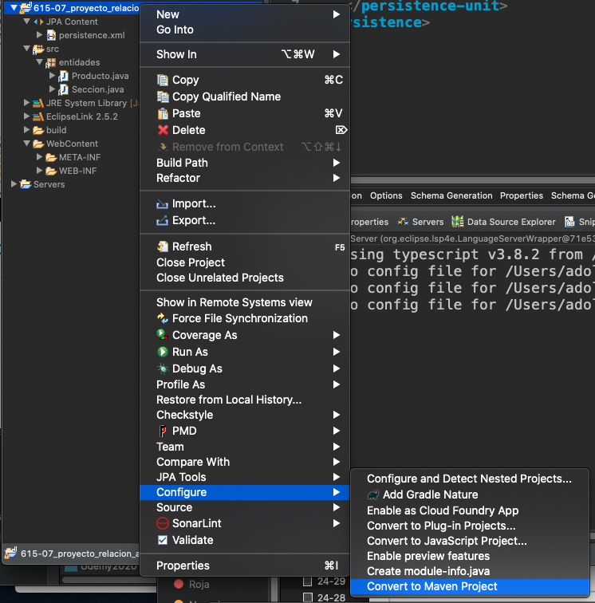

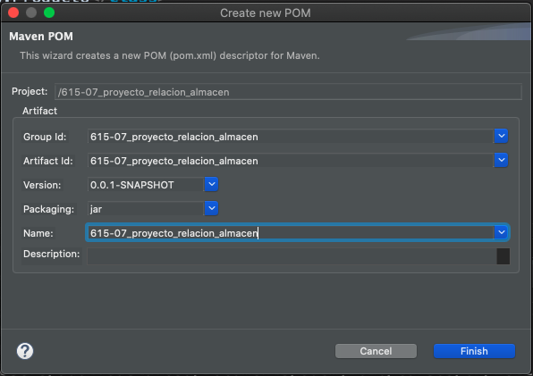

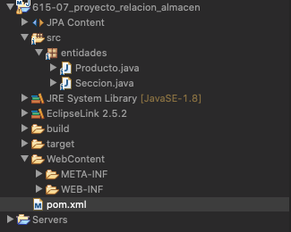

Con esto se crea el archivo `pom.xml` vamos a añadir las dependencias que mencionamos antes, JSTL, Driver MySQL pero también vamos a añadir la dependencia JavaEE ya que como vimos en ejemplos anteriores teniamos problemas para que se aceptaran sentencias relacionadas con los EJBs, en su momento insertamos el JAR localmente desde el servidor GlassFish local. En este caso insertaremos la dependecia para ver si funciona.

*`pom.xml`*

```html
<project xmlns="http://maven.apache.org/POM/4.0.0"
	xmlns:xsi="http://www.w3.org/2001/XMLSchema-instance"
	xsi:schemaLocation="http://maven.apache.org/POM/4.0.0 https://maven.apache.org/xsd/maven-4.0.0.xsd">
   <modelVersion>4.0.0</modelVersion>
   <groupId>615-07_proyecto_relacion_almacen</groupId>
   <artifactId>615-07_proyecto_relacion_almacen</artifactId>
   <version>0.0.1-SNAPSHOT</version>
   <name>615-07_proyecto_relacion_almacen</name>
   <build>
      <sourceDirectory>src</sourceDirectory>
      <plugins>
         <plugin>
            <artifactId>maven-compiler-plugin</artifactId>
            <version>3.8.1</version>
            <configuration>
               <source>1.8</source>
               <target>1.8</target>
            </configuration>
         </plugin>
      </plugins>
   </build>
   <dependencies>
      <!-- https://mvnrepository.com/artifact/javax.servlet/jstl -->
      <dependency>
         <groupId>javax.servlet</groupId>
	 <artifactId>jstl</artifactId>
	 <version>1.2</version>
      </dependency>
      <!-- https://mvnrepository.com/artifact/mysql/mysql-connector-java -->
      <dependency>
         <groupId>mysql</groupId>
         <artifactId>mysql-connector-java</artifactId>
         <version>8.0.20</version>
      </dependency>
      <!-- https://mvnrepository.com/artifact/javax/javaee-api -->
      <dependency>
         <groupId>javax</groupId>
         <artifactId>javaee-api</artifactId>
         <version>8.0.1</version>
         <scope>provided</scope>
      </dependency>
   </dependencies>
</project>
```

#### 4. Creación del Modelo.

Nos vamos al proyecto y con el botón derecho en la opción New dentro de la categoría Other en la subcategoría EJB elegimos Session Bean.

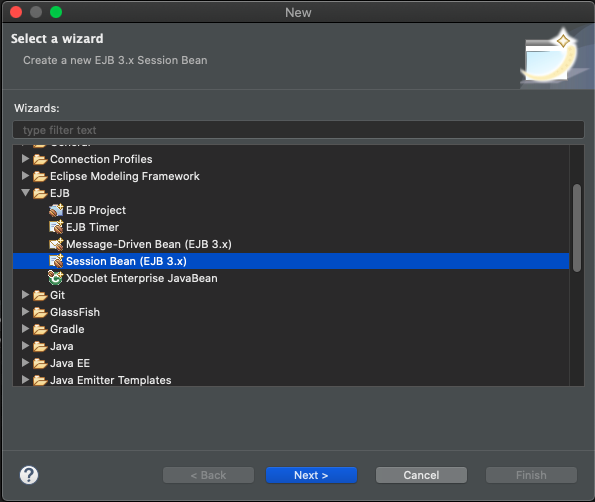

Por algún motivo no nos permite seleccionar el proyecto donde vamos a crear el EJB.

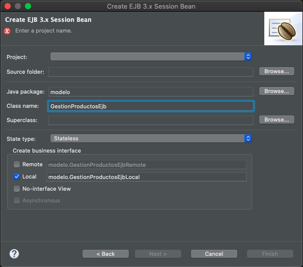

Revisando los Project Facets tenemos:

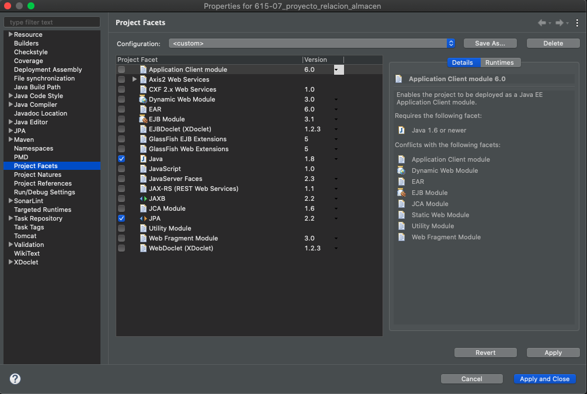

Según el proyecto anterior que si funciona tiene algunos módulo más marcados.

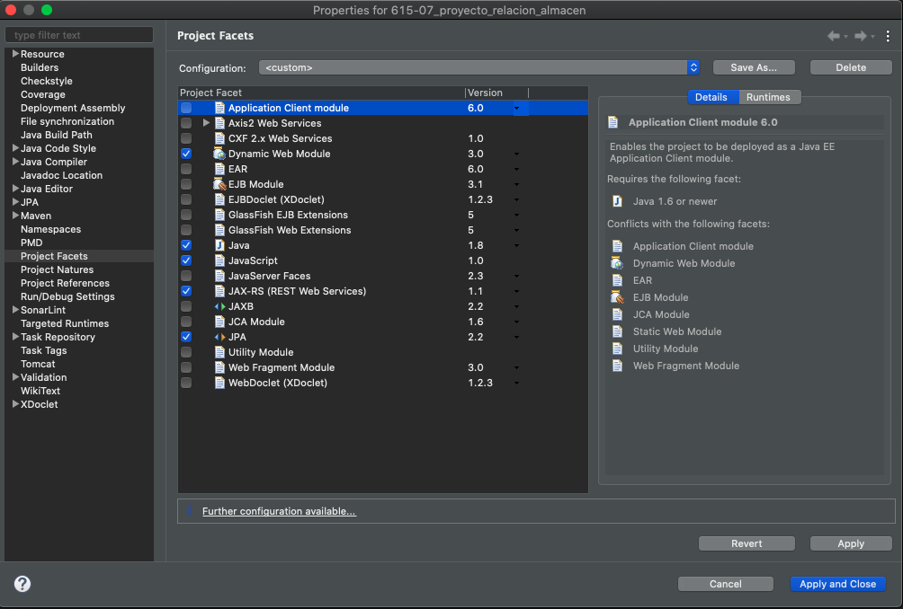

Tampoco deja marcar los modulos.

La estructura de ambos proyectos son diferentes.

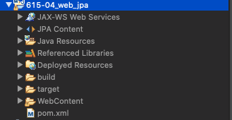

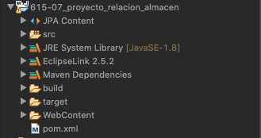

Realmente no detecto cual es el problema al crear el proyecto pero me ha estado pasando que al crear un nuevo proyecto una vez de Finalizado se queda en la misma pantalla para crear Modulos y a veces le doy a aceptar y otras a cancelar por allí puede venir el problema.

Vamos a partir del proyecto `615-04_web_jpa` para  copiarlo y partir de el, una vez hecho lo que tenemos es lo siguiente:

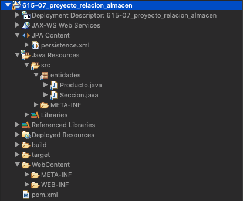

Nuevamente vamos al proyecto y con el botón derecho en la opción New dentro de la categoría Other en la subcategoría EJB elegimos Session Bean.

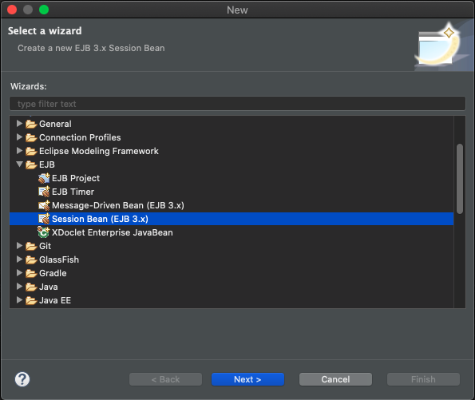

En el siguiente paso (que ya marca el nombre del proyecto) el paquete es `modelo` y el nombre del EJB  es `GestionProductosEjb` y la interfaz de negocio va a ser en una interfaz local puesto que el acceso va a ser local, no se va a acceder al EJB remotamente desde otro servidor, sino que se va a acceder desde el mismo servidor completamente de la misma aplicación, le asigna nombre que por defecto a dicha interfaz `modelo.GestionProductosEjbLocal`. Vamos a desactivar la opción No-interface View puesto que sí que vamos a utilizar interfaz de negocio y ya directamente aquí podemos pulsar Finish.

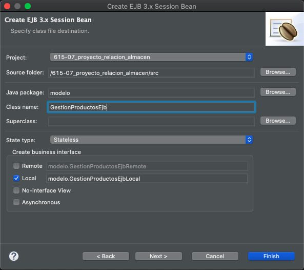

Nos genera ambos archivos.

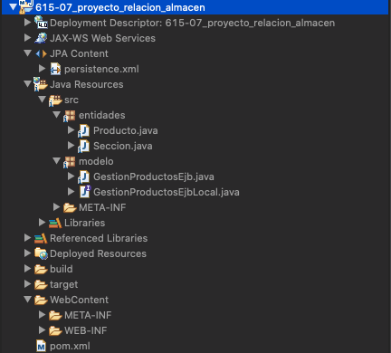

*`GestionProductosEjbLocal`*

```java
package modelo;

import javax.ejb.Local;

@Local
public interface GestionProductosEjbLocal {

}
```

*`GestionProductosEjb`*

```java
package modelo;

import javax.ejb.Stateless;

/**
 * Session Bean implementation class GestionProductosEjb
 */
@Stateless
public class GestionProductosEjb implements GestionProductosEjbLocal {


}
```

En primer lugar te voy a enseñar los métodos que deberías poner en la Lógica de Negocio a través de la interfaz `GestionProductosEjbLocal`. La interfaz de negocio obviamente tendríamos que tener:


* Un método `obtenerSecciones()` que nos devuelva todas las secciones para poder mostrarlas en la lista de selección de secciones
* Otro método `obtenerProductos()` que nos devolvería todos los productos para el caso de que elijamos qué queremos ver todos los productos
* Y un método último `obtenerProductosPorSeccion(int idSecc)` que es digamos el que más nos interesa por el tema de las relaciones que nos devolvería la lista de productos asociados a una determinada sección un determinado código de sección.

*`GestionProductosEjbLocal`*

```java
package modelo;

import java.util.List;

import javax.ejb.Local;

import entidades.Producto;
import entidades.Seccion;

@Local
public interface GestionProductosEjbLocal {
	
   List<Seccion> obtenerSecciones();
	
   List<Producto> obtenerProductos();
	
   List<Producto> obtenerProductosPorSeccion(int idSecc);

}
```

Vamos a ver su implementación:

*`GestionProductosEjb`*

```java
package modelo;

import java.util.List;

import javax.ejb.Stateless;
import javax.persistence.EntityManager;
import javax.persistence.PersistenceContext;
import javax.persistence.TypedQuery;

import entidades.Producto;
import entidades.Seccion;

/**
 * Session Bean implementation class GestionProductosEjb
 */
@Stateless
public class GestionProductosEjb implements GestionProductosEjbLocal {

   @PersistenceContext(unitName="615-07_proyecto_relacion_almacen")
   EntityManager em;
		
   @Override
   public List<Seccion> obtenerSecciones(){
      TypedQuery<Seccion> q=em.createNamedQuery("Seccion.findAll",Seccion.class);
      return q.getResultList();
   }
   
   @Override
   public List<Producto> obtenerProductos(){
      TypedQuery<Producto> q=em.createNamedQuery("Producto.findAll",Producto.class);
      return q.getResultList();
   }
   
   @Override
   public List<Producto> obtenerProductosPorSeccion(int idSecc){
      //String jpql = "Select p From Producto p Where p.idSeccion=" + idSecc;
      //String jpql = "Select p From Producto p Where p.seccione.idSeccion=" + idSecc;
      Seccion s=em.find(Seccion.class, idSecc);
      return s.getProductos();		
   }
}
```

Tanto en `obtenerSecciones()` como `obtenerProductos()` realmente son muy sencillos porque utilizamos lo que ya hemos visto en lecciones anteriores, aprovechamos las `NamedQuery` que creo automáticamente Eclipse cuando creamos las entidades de selección de todas las secciones en un caso selección de todos los productos en el otro caso. Creamos un `TypedQuery` y hacemos la llamada a `getResultList()`.

Vamos a centrarnos en el método `obtenerProductosPorSeccion(int idSecc)` que es el más interesante. Cómo podríamos obtener la lista de productos de una determinada sección a partir de su código, una forma es que podríamos construir esta JPQL:

`String jpql = "Select p From Producto p Where p.idSeccion=" + idSecc;`

Como la columna `idSeccion` forma parte de la entidad `Producto` podríamos establecer esta condición, pero las entidades están relacionadas, como están relacionadas lo primero es que este campo de `idSeccion` ya no lo tenemos en la entidad `Producto`,  tendríamos el campo o atributo `seccione` por lo que el JPQL correcto sería:

`String jpql = "Select p From Producto p Where p.seccione.idSeccion=" + idSecc;`

esta sería la forma de hacerlo, pero ya que las tenemos relacionadas vamos a aprovecharnos de esa relación, no vamos a necesitar ninguna instrucción JPQL. Por qué podemos directamente hacer una búsqueda simple de la sección a partir de su Primary Key, cómo la sección está relacionada con productos ya trae la lista de productos asociados, sería simplemente una vez que ya tenemos el objeto `Seccion` llamar al método `getProductos()` que nos devuelve todos los productos que tiene esa sección asociados. Gracias a la relación, automáticamente al hacer la búsqueda de la sección vienen con ella todos los objetos de la entidad relacionada `Producto`. 

Así de simple sería y esto es lo que nos facilita enormemente el trabajo y la Lógica de Negocio en muchas aplicaciones donde necesitamos aprovecharnos de la relación. Esto sería lo que es la parte JPA.

#### 5. Creación del Controlador.

En la parte del Controlador tendríamos:

* `Controller`
* `ProductosAction`
* `SeccionesAction`

Vamos a ver el código de cada uno de ellos.

*`ProductosAction`*

```java
package controlador;

import java.io.IOException;

import javax.ejb.EJB;
import javax.servlet.ServletException;
import javax.servlet.annotation.WebServlet;
import javax.servlet.http.HttpServlet;
import javax.servlet.http.HttpServletRequest;
import javax.servlet.http.HttpServletResponse;

import modelo.GestionProductosEjbLocal;

/**
 * Servlet implementation class ProductosAction
 */
@WebServlet("/ProductosAction")
public class ProductosAction extends HttpServlet {
   private static final long serialVersionUID = 1L;

   @EJB
   GestionProductosEjbLocal gproductos;
   protected void service(HttpServletRequest request, HttpServletResponse response) throws ServletException, IOException {
      
      int idSeccion=Integer.parseInt(request.getParameter("seccion"));
      if(idSeccion==0){
         request.setAttribute("productos", gproductos.obtenerProductos());
      }else{
         request.setAttribute("productos", gproductos.obtenerProductosPorSeccion(idSeccion));
      }
      request.getRequestDispatcher("productos.jsp").forward(request, response);
      
   }
}

```

`ProductosAction` se encargan de recuperar el parámetro que viene de la página HTML con la sección elegida, si es cero es que a pedido todos los productos llamamos al método `obtenerProductos()`, si es distinto de cero es que a pedido los productos de una determinada sección llamamos al método `obtenerProductosPorSeccion(idSeccion)`  y al final pasamos el control a la página `productos.jsp` para que los enseñe.

*`SeccionesAction`*

```java
package controlador;

import java.io.IOException;
import java.util.List;

import javax.ejb.EJB;
import javax.servlet.ServletException;
import javax.servlet.annotation.WebServlet;
import javax.servlet.http.HttpServlet;
import javax.servlet.http.HttpServletRequest;
import javax.servlet.http.HttpServletResponse;

import entidades.Seccion;
import modelo.GestionProductosEjbLocal;

/**
 * Servlet implementation class SeccionesAction
 */
@WebServlet("/SeccionesAction")
public class SeccionesAction extends HttpServlet {
   private static final long serialVersionUID = 1L;

   @EJB
   GestionProductosEjbLocal gproductos;
   protected void service(HttpServletRequest request, HttpServletResponse response) throws ServletException, IOException {
      
      List<Seccion> secciones=gproductos.obtenerSecciones();
      request.setAttribute("secciones", secciones);
      request.getRequestDispatcher("secciones.jsp").forward(request, response);
      
   }
}
```

El controlador de las secciones `SeccionesAction` que es el que es llamado cuando queremos entrar en la página donde aparece la lista de secciones, debe recuperar todas las secciones con el método `obtenerSecciones()` guardarlas también en un atributo de request `secciones` y pasar el control a la vista `secciones.jsp` para que las pinte.

Este código no es exactamente objetivo de este curso porque realmente esto ya no es JPA. 

Finalmente la clase `Controller`.

*`Controller`*

```java
package controlador;

import java.io.IOException;
import javax.servlet.ServletException;
import javax.servlet.annotation.WebServlet;
import javax.servlet.http.HttpServlet;
import javax.servlet.http.HttpServletRequest;
import javax.servlet.http.HttpServletResponse;

/**
 * Servlet implementation class Controller
 */
@WebServlet("/Controller")
public class Controller extends HttpServlet {
   private static final long serialVersionUID = 1L;

   /**
    * @see HttpServlet#service(HttpServletRequest request, HttpServletResponse response)
    */
   protected void service(HttpServletRequest request, HttpServletResponse response) throws ServletException, IOException {
		
      String op=request.getParameter("op");
      String url="inicio.html";
		
      switch(op){
         case "doSecciones":
            url="SeccionesAction";	
            break;
         case "doProductos":
            url="ProductosAction";
            break;
      }
		
      request.getRequestDispatcher(url).forward(request, response);
   }
}
```

El `Controller` es el encargado de recibir las peticiones echas en nuestra aplicación, recupera el parámetro `op` para saber que petición se a solicitado y nos redirige a esa petición.

#### 6. Creación de la Vista.

Dentro de  `WebContent` vamos a tener las páginas HTML y JSP necesarias:

* `inicio.html`
* `secciones.jsp`
* `productos.jsp`

*`inicio.html`*

```html
<!DOCTYPE html>
<html>
<head>
<meta charset="UTF-8">
<title>Insert title here</title>
</head>
<body>
   <center>
      <h1><a href="Controller?op=doSecciones">Acceso</a></h1>
   </center>
</body>
</html>
```

*`secciones.jsp`*

```html
<%@taglib uri="http://java.sun.com/jsp/jstl/core" prefix="c"%>
<!DOCTYPE html>
<html>
<head>
<title>seleccion</title>
<meta http-equiv="Content-Type" content="text/html;  charset=ISO-8859-1">
</head>
<body>
   <center>
      <h1>Seleccione Sección</h1>
      <br /><br />
      <form action="Controller?op=doProductos" method="post">
         <select name="seccion">
            <option value="0">Todos</option>
            <c:set var="sec" value="${requestScope.secciones}" />
	    <c:forEach var="s" items="${sec}">
               <option value="${s.idSeccion}">${s.seccion}</option>
            </c:forEach>
         </select>
	 <br /> <br /> 
	 <input type="submit" value="Ver Productos" />
      </form>
   </center>
</body>
</html>
```

*`productos.jsp`*

```html
<%@taglib uri="http://java.sun.com/jsp/jstl/core" prefix="c"%>
<!DOCTYPE html>
<html>
<head>
<title>libros</title>
<meta http-equiv="Content-Type" content="text/html; charset=ISO-8859-1">
</head>
<body>
   <table border="1">
      <tr><th>Nombre</th><th>Precio</th><th>Descripción</th></tr>
      <c:set var="productos" value="${requestScope.productos}"/>
         <c:forEach var="pr" items="${productos}">
    	    <tr>
               <td>${pr.nombre}</td>
               <td>${pr.precio}</td>
               <td>${pr.descripcion}</td>
            </tr>
    	 </c:forEach>
   </table>
   <br/><br/>
   <a href="Controller?op=doSecciones">Otra sección</a>
</body>
</html>
```

#### 7. Probar la Aplicación.

Vamos a ejecutar la aplicación, partiendo del archivo `inicio.html`.

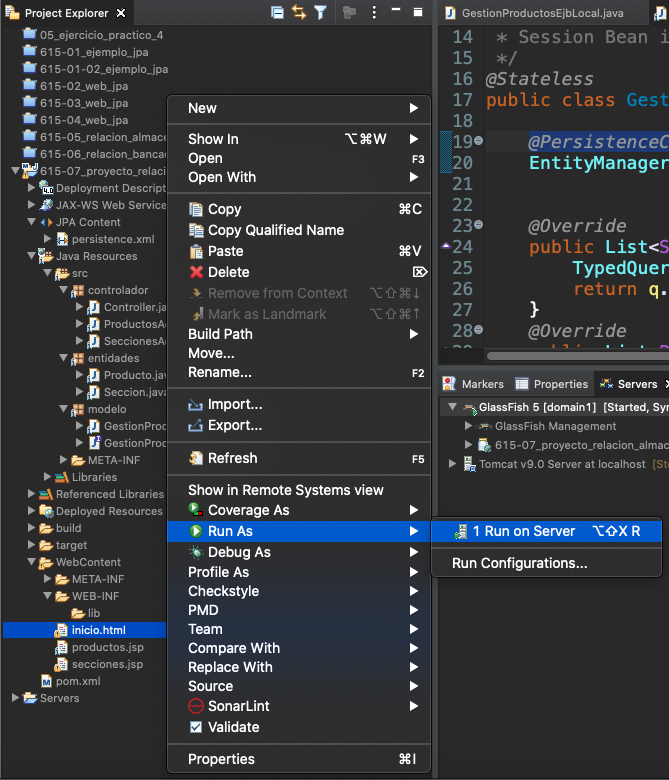

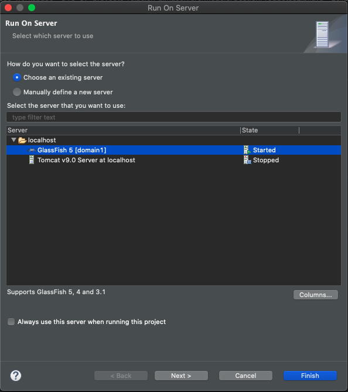

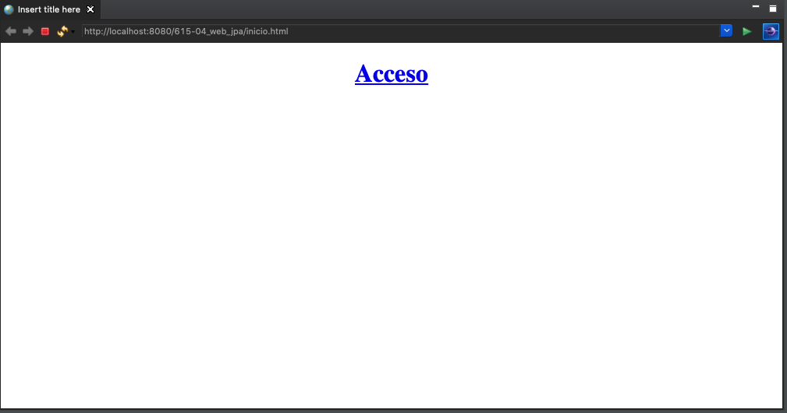

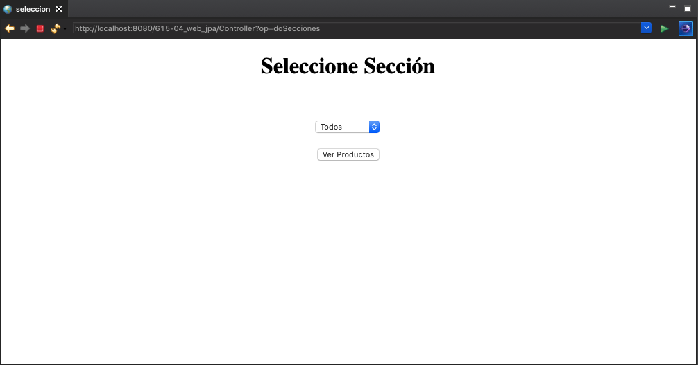

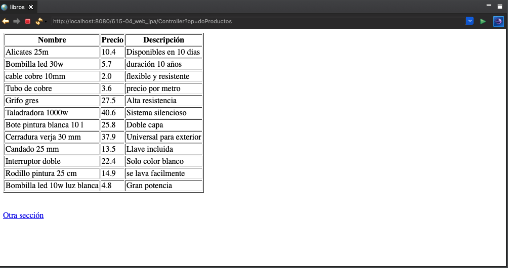

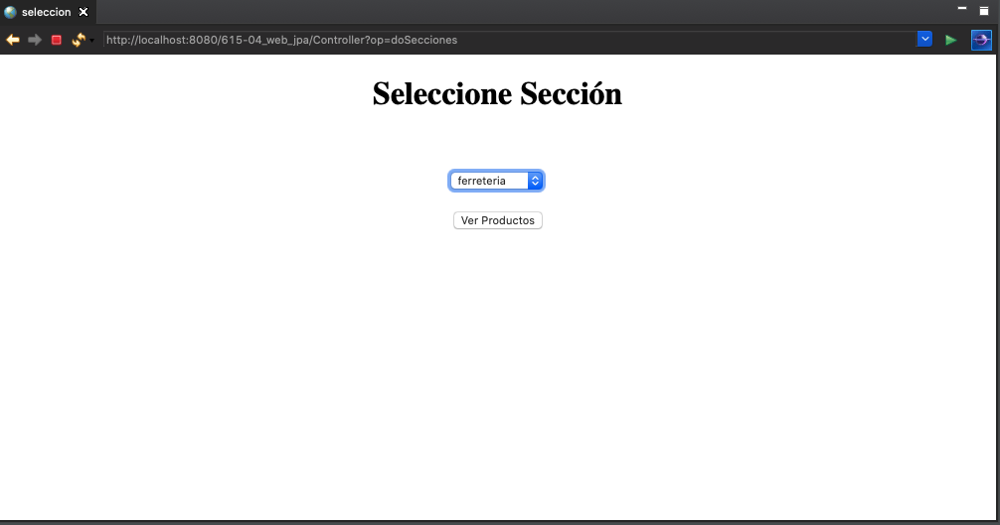

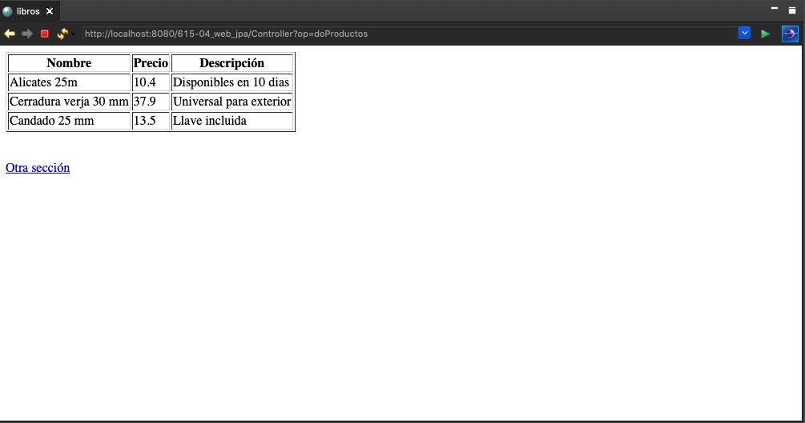

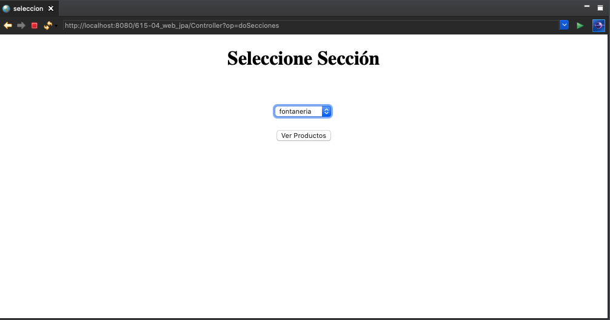

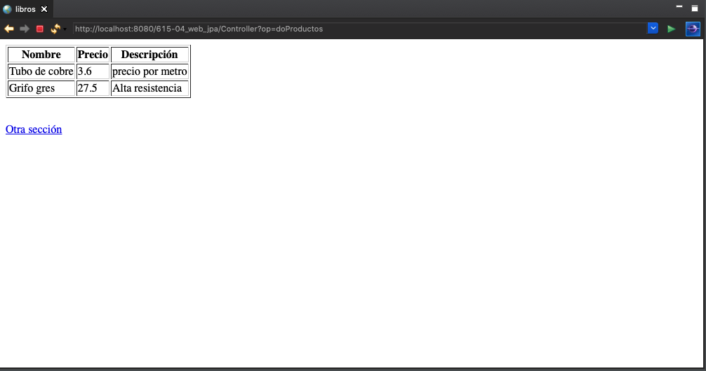

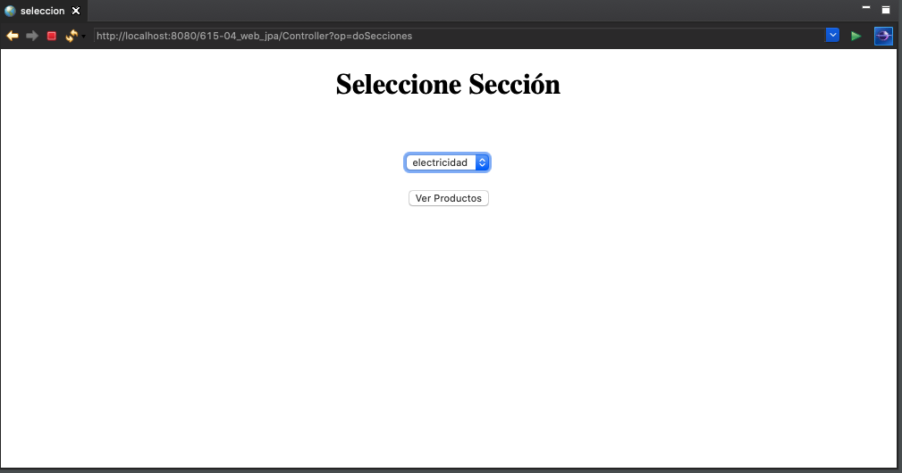

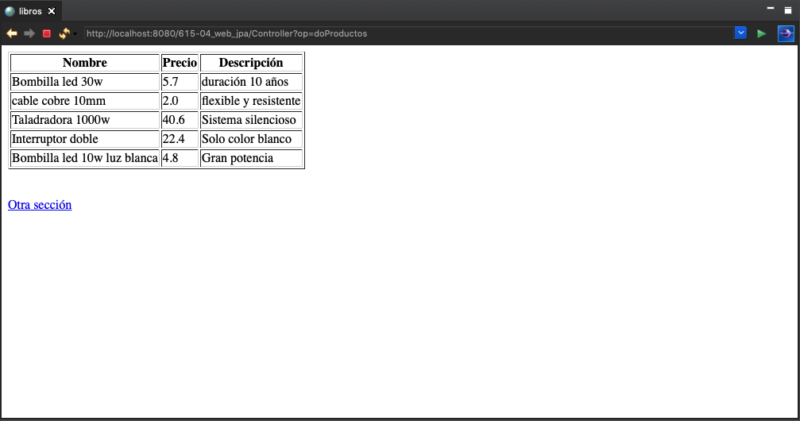


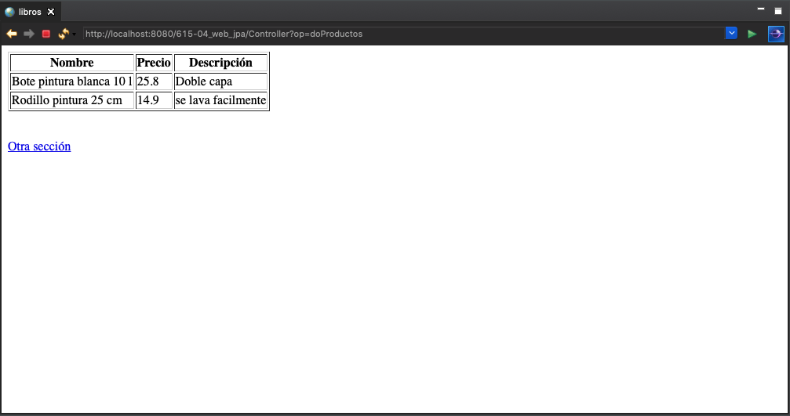

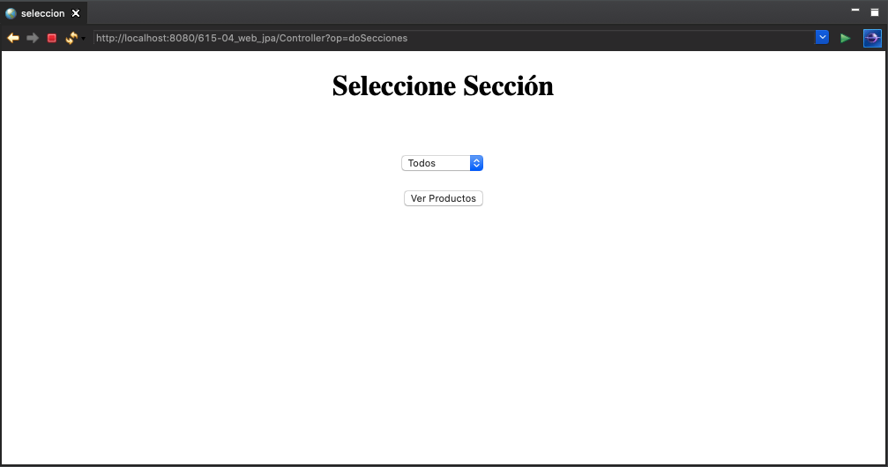

Todo funciona correctamente!!!!

Pero bueno pongamos otro caso, imagínate que queremos también incluir un método dentro de la Lógica de Negocio que nos devuelva la sección a la que pertenece un determinado producto a partir de su nombre. Bueno pues gracias a la relación, puedo hacer una búsqueda directa del producto que cumple la condición, no necesito hacer uniones en la Select entre las entidades, porque directamente buscando el producto automáticamente una vez que ya lo encuentro, con `q.getSingleResult()` que es el método que me devuelve el producto, como me trae la sección relacionada directamente llamando a su método `getSeccione()` obtengo el objeto `Seccion` y ya lo puedo devolver directamente.

```java
public Seccion obtenerSeccionDeProducto(String prod){
		
   String jpql="select p from Producto p where p.nombre=?1";
   TypedQuery<Producto> q=em.createQuery(jpql,Producto.class);
   q.setParameter(1, prod);
   return q.getSingleResult().getSeccione();
		
}
```

Simplifica la relación enormemente la Lógica de Negocio de las aplicaciones, el hecho de que traernos una Entidad nos venga ya con sus objetos relacionados.

### :computer: Código Completo - 615-07_proyecto_relacion_almacen


*`pom.xml`*

```html
<project xmlns="http://maven.apache.org/POM/4.0.0"
	xmlns:xsi="http://www.w3.org/2001/XMLSchema-instance"
	xsi:schemaLocation="http://maven.apache.org/POM/4.0.0 https://maven.apache.org/xsd/maven-4.0.0.xsd">
	<modelVersion>4.0.0</modelVersion>
	<groupId>615-04_web_jpa</groupId>
	<artifactId>615-04_web_jpa</artifactId>
	<version>0.0.1-SNAPSHOT</version>
	<packaging>war</packaging>
	<build>
		<sourceDirectory>src</sourceDirectory>
		<resources>
			<resource>
				<directory>src</directory>
				<excludes>
					<exclude>**/*.java</exclude>
				</excludes>
			</resource>
		</resources>
		<plugins>
			<plugin>
				<artifactId>maven-compiler-plugin</artifactId>
				<version>3.8.0</version>
				<configuration>
					<source>1.8</source>
					<target>1.8</target>
				</configuration>
			</plugin>
			<plugin>
				<artifactId>maven-war-plugin</artifactId>
				<version>3.2.3</version>
				<configuration>
					<warSourceDirectory>WebContent</warSourceDirectory>
				</configuration>
			</plugin>
		</plugins>
	</build>
	<dependencies>
		<!-- https://mvnrepository.com/artifact/javax.servlet/jstl -->
		<dependency>
			<groupId>javax.servlet</groupId>
			<artifactId>jstl</artifactId>
			<version>1.2</version>
		</dependency>
		<!-- https://mvnrepository.com/artifact/mysql/mysql-connector-java -->
		<dependency>
			<groupId>mysql</groupId>
			<artifactId>mysql-connector-java</artifactId>
			<version>8.0.20</version>
		</dependency>
	</dependencies>
</project>
```

*`persistence.xml`*

```html
<?xml version="1.0" encoding="UTF-8"?>
<persistence version="2.2"
	xmlns="http://xmlns.jcp.org/xml/ns/persistence"
	xmlns:xsi="http://www.w3.org/2001/XMLSchema-instance"
	xsi:schemaLocation="http://xmlns.jcp.org/xml/ns/persistence http://xmlns.jcp.org/xml/ns/persistence/persistence_2_2.xsd">
   <persistence-unit name="615-07_proyecto_relacion_almacen">
      <jta-data-source>jdbc/almacends</jta-data-source>
      <class>entidades.Producto</class>
      <class>entidades.Seccion</class>
   </persistence-unit>
</persistence>
```

**Entidades**

*`Seccion`*

```java
package entidades;

import java.io.Serializable;
import javax.persistence.*;
import java.util.List;

/**
 * The persistent class for the secciones database table.
 * 
 */
@Entity
@Table(name = "secciones")
@NamedQuery(name = "Seccion.findAll", query = "SELECT s FROM Seccion s")
public class Seccion implements Serializable {
	private static final long serialVersionUID = 1L;

	@Id
	@GeneratedValue(strategy = GenerationType.IDENTITY)
	private int idSeccion;

	private String responsable;

	private String seccion;

	// bi-directional many-to-one association to Producto
	@OneToMany(mappedBy = "seccione")
	private List<Producto> productos;

	public Seccion() {
	}

	public int getIdSeccion() {
		return this.idSeccion;
	}

	public void setIdSeccion(int idSeccion) {
		this.idSeccion = idSeccion;
	}

	public String getResponsable() {
		return this.responsable;
	}

	public void setResponsable(String responsable) {
		this.responsable = responsable;
	}

	public String getSeccion() {
		return this.seccion;
	}

	public void setSeccion(String seccion) {
		this.seccion = seccion;
	}

	public List<Producto> getProductos() {
		return this.productos;
	}

	public void setProductos(List<Producto> productos) {
		this.productos = productos;
	}

	public Producto addProducto(Producto producto) {
		getProductos().add(producto);
		producto.setSeccione(this);

		return producto;
	}

	public Producto removeProducto(Producto producto) {
		getProductos().remove(producto);
		producto.setSeccione(null);

		return producto;
	}

}
```

*`Producto`*

```java
package entidades;

import java.io.Serializable;
import javax.persistence.*;

/**
 * The persistent class for the productos database table.
 * 
 */
@Entity
@Table(name = "productos")
@NamedQuery(name = "Producto.findAll", query = "SELECT p FROM Producto p")
public class Producto implements Serializable {
	private static final long serialVersionUID = 1L;

	@Id
	@GeneratedValue(strategy = GenerationType.IDENTITY)
	private int idProducto;

	private String descripcion;

	private String nombre;

	private double precio;

	// bi-directional many-to-one association to Seccion
	@ManyToOne
	@JoinColumn(name = "idSeccion")
	private Seccion seccione;

	public Producto() {
	}

	public int getIdProducto() {
		return this.idProducto;
	}

	public void setIdProducto(int idProducto) {
		this.idProducto = idProducto;
	}

	public String getDescripcion() {
		return this.descripcion;
	}

	public void setDescripcion(String descripcion) {
		this.descripcion = descripcion;
	}

	public String getNombre() {
		return this.nombre;
	}

	public void setNombre(String nombre) {
		this.nombre = nombre;
	}

	public double getPrecio() {
		return this.precio;
	}

	public void setPrecio(double precio) {
		this.precio = precio;
	}

	public Seccion getSeccione() {
		return this.seccione;
	}

	public void setSeccione(Seccion seccione) {
		this.seccione = seccione;
	}

}
```

**Modelo**

*`GestionProductosEjbLocal`*

```java
package modelo;

import java.util.List;

import javax.ejb.Local;

import entidades.Producto;
import entidades.Seccion;

@Local
public interface GestionProductosEjbLocal {
	
   List<Seccion> obtenerSecciones();
	
   List<Producto> obtenerProductos();
	
   List<Producto> obtenerProductosPorSeccion(int idSecc);

}
```

*`GestionProductosEjb`*

```java
package modelo;

import java.util.List;

import javax.ejb.Stateless;
import javax.persistence.EntityManager;
import javax.persistence.PersistenceContext;
import javax.persistence.TypedQuery;

import entidades.Producto;
import entidades.Seccion;

/**
 * Session Bean implementation class GestionProductosEjb
 */
@Stateless
public class GestionProductosEjb implements GestionProductosEjbLocal {

	@PersistenceContext(unitName="615-07_proyecto_relacion_almacen")
	EntityManager em;
	
	
	@Override
	public List<Seccion> obtenerSecciones(){
		TypedQuery<Seccion> q=em.createNamedQuery("Seccion.findAll",Seccion.class);
		return q.getResultList();
	}
	@Override
	public List<Producto> obtenerProductos(){
		TypedQuery<Producto> q=em.createNamedQuery("Producto.findAll",Producto.class);
		return q.getResultList();
	}
	@Override
	public List<Producto> obtenerProductosPorSeccion(int idSecc){
		//String jpql = "Select p From Producto p Where p.idSeccion=" + idSecc;
		Seccion s=em.find(Seccion.class, idSecc);
		return s.getProductos();		
	}

	public Seccion obtenerSeccionDeProducto(String prod){
		
		String jpql="select p from Producto p where p.nombre=?1";
		TypedQuery<Producto> q=em.createQuery(jpql,Producto.class);
		q.setParameter(1, prod);
		return q.getSingleResult().getSeccione();
		
	}
}
```

**Controlador**

*`Controller`*

```java
package controlador;

import java.io.IOException;
import javax.servlet.ServletException;
import javax.servlet.annotation.WebServlet;
import javax.servlet.http.HttpServlet;
import javax.servlet.http.HttpServletRequest;
import javax.servlet.http.HttpServletResponse;

/**
 * Servlet implementation class Controller
 */
@WebServlet("/Controller")
public class Controller extends HttpServlet {
	private static final long serialVersionUID = 1L;

	/**
	 * @see HttpServlet#service(HttpServletRequest request, HttpServletResponse response)
	 */
	protected void service(HttpServletRequest request, HttpServletResponse response) throws ServletException, IOException {
		
		String op=request.getParameter("op");
		String url="inicio.html";
		
		switch(op){
			case "doSecciones":
				url="SeccionesAction";	
				break;
			case "doProductos":
				url="ProductosAction";
				break;
		}
		
		request.getRequestDispatcher(url).forward(request, response);
	}

}
```

*`SeccionesAction`*

```java
package controlador;

import java.io.IOException;
import java.util.List;

import javax.ejb.EJB;
import javax.servlet.ServletException;
import javax.servlet.annotation.WebServlet;
import javax.servlet.http.HttpServlet;
import javax.servlet.http.HttpServletRequest;
import javax.servlet.http.HttpServletResponse;

import entidades.Seccion;
import modelo.GestionProductosEjbLocal;

/**
 * Servlet implementation class SeccionesAction
 */
@WebServlet("/SeccionesAction")
public class SeccionesAction extends HttpServlet {
	private static final long serialVersionUID = 1L;

	@EJB
	GestionProductosEjbLocal gproductos;
	protected void service(HttpServletRequest request, HttpServletResponse response) throws ServletException, IOException {
		List<Seccion> secciones=gproductos.obtenerSecciones();
		request.setAttribute("secciones", secciones);
		request.getRequestDispatcher("secciones.jsp").forward(request, response);
	}

}
```

*`ProductosAction`*

```
package controlador;

import java.io.IOException;

import javax.ejb.EJB;
import javax.servlet.ServletException;
import javax.servlet.annotation.WebServlet;
import javax.servlet.http.HttpServlet;
import javax.servlet.http.HttpServletRequest;
import javax.servlet.http.HttpServletResponse;

import modelo.GestionProductosEjbLocal;

/**
 * Servlet implementation class ProductosAction
 */
@WebServlet("/ProductosAction")
public class ProductosAction extends HttpServlet {
	private static final long serialVersionUID = 1L;

	@EJB
	GestionProductosEjbLocal gproductos;
	protected void service(HttpServletRequest request, HttpServletResponse response) throws ServletException, IOException {
		int idSeccion=Integer.parseInt(request.getParameter("seccion"));
		if(idSeccion==0){
			request.setAttribute("productos", gproductos.obtenerProductos());
		}else{
			request.setAttribute("productos", gproductos.obtenerProductosPorSeccion(idSeccion));
		}
		request.getRequestDispatcher("productos.jsp").forward(request, response);
	}

}
```

**Vista**

*`inicio.html`*

```html
<!DOCTYPE html>
<html>
<head>
<meta charset="UTF-8">
<title>Insert title here</title>
</head>
<body>
	<center>
		<h1><a href="Controller?op=doSecciones">Acceso</a></h1>
	</center>
</body>
</html>
```

*`secciones.jsp`*

```html
<%@taglib uri="http://java.sun.com/jsp/jstl/core" prefix="c"%>
<!DOCTYPE html>
<html>
<head>
<title>seleccion</title>
<meta http-equiv="Content-Type" content="text/html;  charset=ISO-8859-1">
</head>
<body>
	<center>
		<h1>Seleccione Sección</h1>
		<br /><br />
		<form action="Controller?op=doProductos" method="post">
			<select name="seccion">
				<option value="0">Todos</option>
				<c:set var="sec" value="${requestScope.secciones}" />
				<c:forEach var="s" items="${sec}">
					<option value="${s.idSeccion}">${s.seccion}</option>
				</c:forEach>
			</select>
			<br /> <br /> 
			<input type="submit" value="Ver Productos" />
		</form>
	</center>
</body>
</html>
```

*`productos.jsp`*

```html
<%@taglib uri="http://java.sun.com/jsp/jstl/core" prefix="c"%>
<!DOCTYPE html>
<html>
<head>
<title>libros</title>
<meta http-equiv="Content-Type" content="text/html; charset=ISO-8859-1">
</head>
<body>
   <table border="1">
      <tr><th>Nombre</th><th>Precio</th><th>Descripción</th></tr>
      <c:set var="productos" value="${requestScope.productos}"/>
         <c:forEach var="pr" items="${productos}">
    	    <tr>
		       <td>${pr.nombre}</td>
		       <td>${pr.precio}</td>
		       <td>${pr.descripcion}</td>
			</tr>
    	 </c:forEach>
   </table>
   <br/><br/>
   <a href="Controller?op=doSecciones">Otra sección</a>
</body>
</html>
```

# 25 Ejercicio práctico IV parte 2 01:57

En esta segunda parte de la lección simplemente vamos a implementar un par de métodos donde vamos a aprovecharnos de la relación Muchos a Muchos que establecimos en la base de datos de `bancabd` entre las entidades `Cliente` y `Cuenta` del proyecto `615-06_relacion_bancadb`.

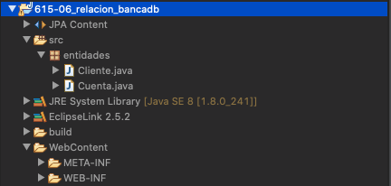

Tendríamos que crear un EJB `GestionBancoEjb` pero dado como esta este proyecto no lo podemos hacer. Vamos a partir nuevamente del proyecto `615-04_web_jpa` vamos hacer una copia para crear el proyecto `615-08_proyecto_relacion_banco` para contar con la estructura que nos permite crear los EJBs.

Listo ya tenemos la copia del proyecto con las Entidades `Cliente` y `Cuenta` y con nuestro archivo `persistence.xml`.

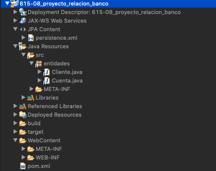

Ahora vamos a crear el `Modelo` es decir el EJB de nombre `GestionBancoEjb`.

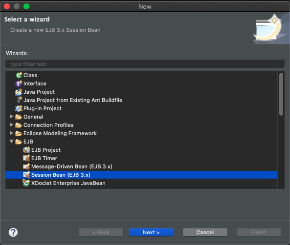

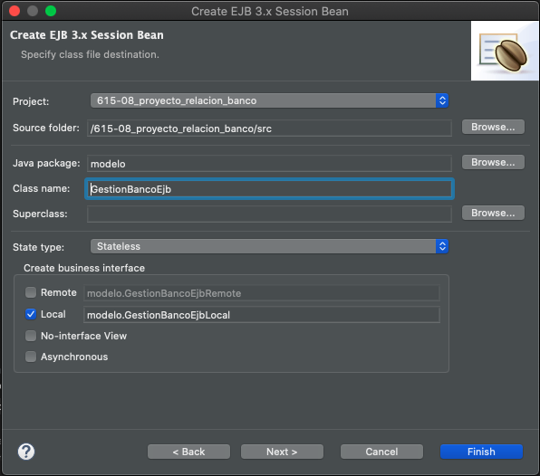

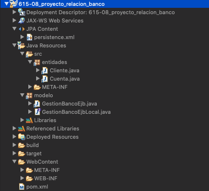

Una vez creado nuestro EJB en la Interfaz declaramos dos métodos.

*`GestionBancoEjbLocal`*

```java
package modelo;

import java.util.List;

import javax.ejb.Local;

import entidades.Cliente;
import entidades.Cuenta;

@Local
public interface GestionBancoEjbLocal {
	
   List<Cliente> obtenerClientesCuenta(int numcuenta);
   List<Cuenta> obtenerCuentasClientes(String nombre, String direccion);

}
```

Un método `obtenerClientesCuenta(int numcuenta)` que a partir del número de cuenta nos dice o nos devuelve la lista de clientes asociados a dicha cuenta y por otro método `obtenerCuentasClientes(String nombre, String direccion)` que a partir del nombre y dirección de un cliente nos da su lista de cuentas.

Para ello vamos a aprovechar como digo la relación Muchos a Muchos que establecimos entre ambas entidades.

El primer método `obtenerClientesCuenta(int numcuenta)`:

```java
@Override
public List<Cliente> obtenerClientesCuenta(int numcuenta) {
		
   Cuenta ct = em.find(Cuenta.class, numcuenta);
   return ct.getClientes();
}
```

Obtener clientes de una determinada cuenta, se trataría de realizar una búsqueda simple de una cuenta a partir de su Primary Key y como ya viene con los objetos relacionados, se trataría simplemente de llamar al método `getClientes()`. No necesitamos ninguna instrucción JPQL para implementar esta funcionalidad.

En cuanto a la obtención de las cuentas de un determinado cliente `obtenerCuentasClientes(String nombre, String direccion)`:

```java
@Override
public List<Cuenta> obtenerCuentasClientes(String nombre, String direccion) {
		
   String jpql = "Select c From Cliente c Where c.nombre=?1 and c.direccion=?2";
   TypedQuery<Cliente> q=em.createQuery(jpql, Cliente.class);
   q.setParameter(1, nombre);
   q.setParameter(2, direccion);
		
   return q.getResultList().get(0).getCuentas();
}
```

Dado que en este caso nos proporcionan el nombre y dirección es decir la Primary Key del cliente, tenemos que montar la JPQL

`jpql = "Select c From Cliente c Where c.nombre=?1 and c.direccion=?2"`

que a partir de el nombre y dirección nos devolvería en teoría un cliente, pero si nos devuelven más de uno ya lo tenemos preparado para quedarnos solamente con uno de ellos. El caso es que nos devuelven los clientes asociados a esa condición, le proporcionamos los parámetros y como digo en `q.getResultList().get(0).getCuentas()` nos quedamos solamente con el primer cliente que cumple dicha condición, puesto que solamente vamos buscando uno y en caso de que por lo que fuera hubiera más de un cliente con el mismo nombre y dirección sólo nos quedaríamos con el primero.

Al igual que antes ese objeto cliente trae todos los objetos cuentas relacionados, sería simplemente llamar a su método `getCuentas()` para recuperar la lista de objetos de entidades cuenta asociados.

# 26 joins 05:53


Bien pues ahora que ya sabemos como crear entidades relacionadas y los beneficios que esto nos aporta vamos a ver el uso de los Joins.

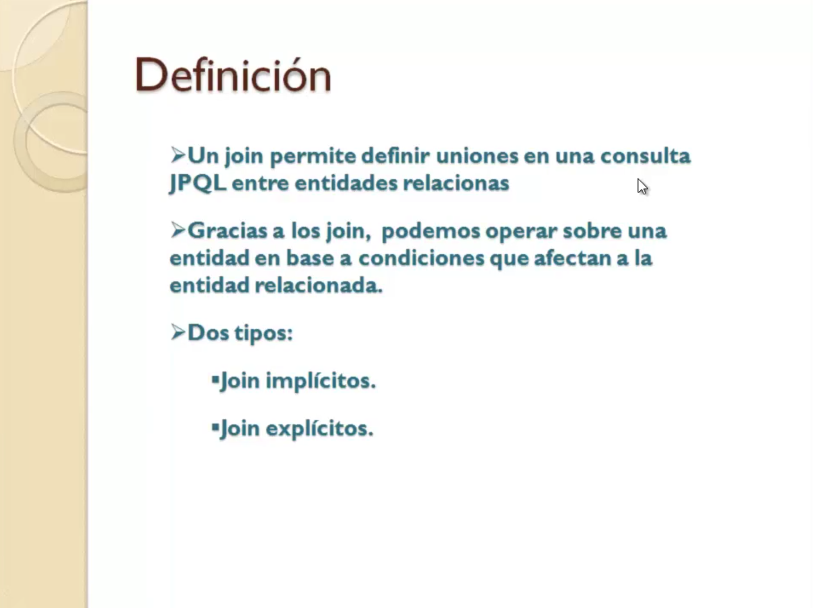

¿Qué es exactamente un Join?

Bueno pues como dice la palabra un Join es una unión que se va a realizar dentro de una consulta JPQL entre entidades relacionadas. Gracias a estos Joins vamos a poder operar sobre una entidad en base a condiciones que van a afectar a la entidad relacionada.

Bueno este tipo de cosas ya lo hemos hecho, simplemente con el hecho de tener relacionadas las entidades, por ejemplo podríamos recuperar una entidad `Seccion` a partir de ese identificador de sección y gracias al atributo producto ya sacamos todos los productos asociados a dicha sección, pero no todas las operaciones son tan simples las condiciones que afectan a entidades relacionadas son más complejas y entonces pues dependiendo también de cómo es la relación entre las entidades con una JPQL es simple, simplemente utilizando la relación no vamos a poder resolver el problema y vamos a tener que recurrir a los Joins.

Tenemos dos tipos de Joins:

* Join implícitos.
* Join explícitos.

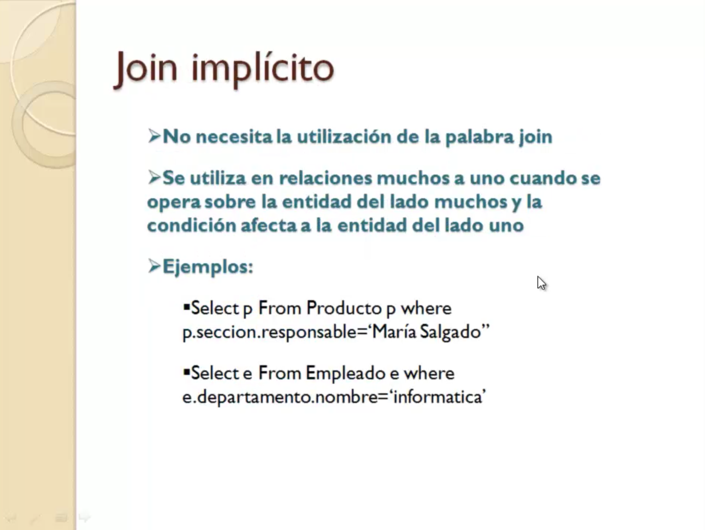

¿Qué es exactamente un Join implícito?

Pues como dice la expresión un Join implícito es aquel en el que ni siquiera hace falta utilizar la palabra Join, lo vamos a utilizar en relaciones Muchos a Uno cuando vamos a operar sobre la entidad del lado muchos y la condición afecta a la entidad en el lado uno.

De hecho esto ya lo hemos hecho en algún caso y no hemos utilizado la palabra Join porque ya implícitamente se trataba de un Join implícito.

Por ejemplo, vamos a de nuevo a nuestra base de datos almacén entidades sección y producto, imaginamos que queremos recuperar todos los productos de aquellas secciones cuyo responsable sea una determinada persona.

```java
Select p From Producto p Where p.seccion.responsable ="María Salgado"
```

Pues entonces en vez de estar jugando con la entidad ir recogiendo primero las secciones que tengan su responsable y de ahí ir sacando los productos pues sería mucho más cómodo hacerlo de esta manera, indicando recupera todos los productos donde su campo responsable de el atributo sección que está dentro de la entidad producto que están relacionadas es igual a tal valor. Esto sería muchísimo más directo.

De la misma manera queremos obtener los empleados de un departamento cuyo nombre sea informática.

```java
Select e From Empleado e Where e.departamento.nombre ="informatica"
```

Directamente recojamos los empleados y en la condición como la entidad empleado tendrá un atributo departamento, con el objeto departamento, podemos establecer la condición. Esto como ves aquí no hemos utilizado la palabra Join en ningún caso, porque como digo en aquellos casos donde se está seleccionando entidades del lado muchos y la condición afecta al lado uno, directamente se puede expresar así y no hace falta utilizar la palabra Join.

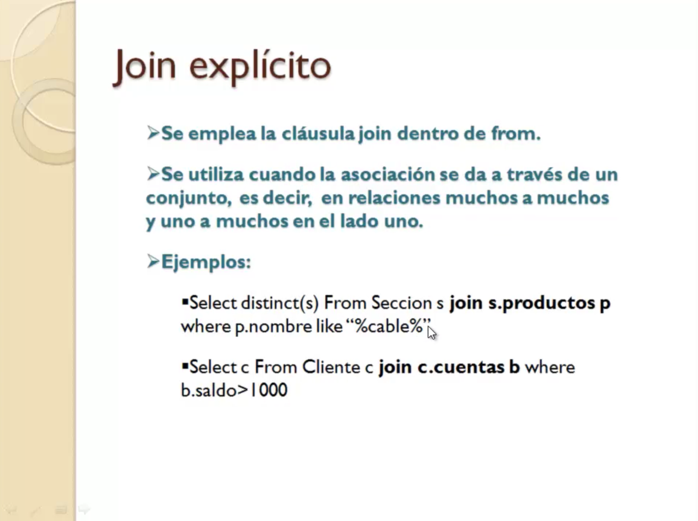

Pro qué pasa cuando estamos en caso contrario es decir tenemos por ejemplo una relación Mchos a Muchos o queremos obtener los datos del lado Uno, en el caso de una relación Uno a Muchos, pero la condición afecta a la entidad del lado Muchos. Bueno pues en ese caso ya sí que tendríamos que utilizar la palabra Join y vamos a ver dos ejemplos muy claros.

Por ejemplo imaginaros que queremos pues todas las secciones que dispongan de productos cuyo nombre contenga la palabra `cable`.

```java
Select distinct(s) From Seccion s join s.productos p Where p.nombre like "%cable%"
```

Igual en vez de estar buscando los productos que tenga la condición y luego ir sacando las secciones de cada uno y juntandolas todas en una colección, podemos hacerlo de forma mucho más directa, de la forma que vez en la instrucción, donde aquí si ves el uso de la palabra **join** puesto que el campo digamos de unión, el atributo de unión es de tipo Muchos, la condición está afectando a la entidad del lado Muchos. El **join** se utiliza dentro de la cláusula From y lo que sería el atributo que se refiere a los productos se le asocia el alias `p` y entonces ya sobre él se aplica la condición. Como ves esto ocurre como digo cuando la condición está afectando al lado muchos y lo que estamos es recuperando entidades del lado uno. El `distinct` nos permite quedarnos solamente con valores distintos,no repetir objetos.

Aquí tenemos otro caso, en el caso de la tabla de Clientes y de cuentas que tienen una relación Muchos a Muchos. Queremos todos los clientes cuyas cuentas tengan un saldo superior a mil.

```java
Select c From Cliente c join c.cuentas b Where b.saldo > 1000
```

En vez de estar sacando los datos como decía antes a través de la relacción de forma básica y luego ir juntándonos, con este Select lo podemos obtener directamente, dame aquellos clientes cuyas cuentas tengan un saldo superior a 1000, en ese caso la cláusula Join se utiliza para asignarle un alias a cada cuenta de cada cliente.

Bien pues con esto ya podemos ya digo montar cualquier instrucción JPQL que nos permita obtener datos de entidades a partir de condiciones que puedan afectar a otras.

Quedaría cubierto cualquier caso y la verdad que el uso de los Joins nos va a simplificar enormemente instrucciones y recuperaciones ciertamente complejas, cuando se ven involucradas no sólo dos entidades sino varias entidades son de una gran ayuda.

Vamos a ver después en la siguiente lección un ejercicio práctico de utilizaciones de Joins explícitos.

# 27 Ejercicio práctico V 06:02


A continuación vamos a desarrollar una nueva aplicación en la que vamos a poner en práctica el uso de los Joins.

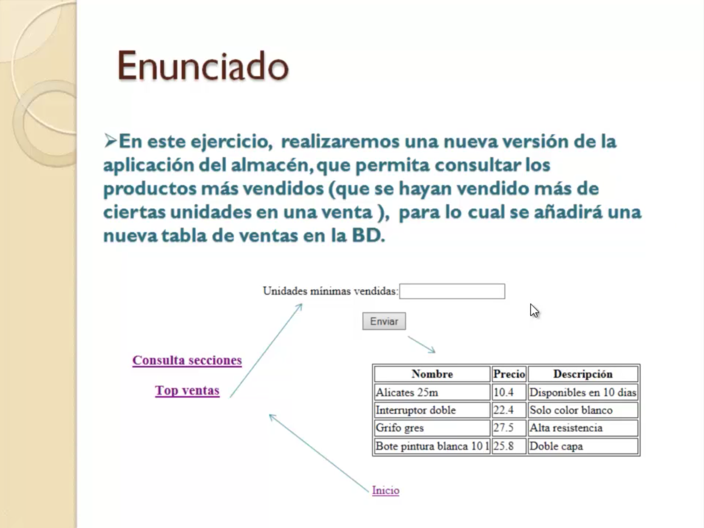

Realmente se trata de una nueva versión de la aplicación de almacén en la que además de la consulta de secciones vamos a incluir una nueva opción con ventas que nos va a llevar a una página donde se nos va a solicitar el número mínimo de unidades vendidas y al pulsar Enviar nos va salir una lista con los nombres de todos los productos que hayan sido vendidos como mínimo ese número de unidades, más o igual que ese número de unidades.

Bien pues para ello lo que vamos a incluir es una nueva tabla `ventas` en la base de datos de almacén. Vamos a verla por aquí en la tabla ventas vamos a registrar las ventas de los productos.

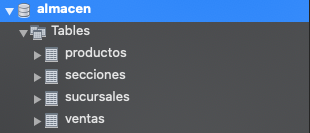

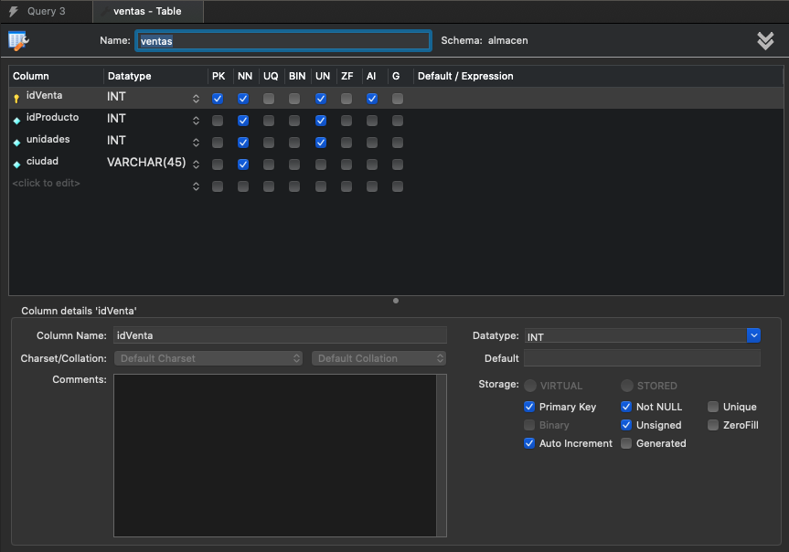

Como ves la estructura de esta tabla va a ser como ves en esta imagen estará el identificador de venta que será un auto numérico el identificador del producto que se ha vendido vale la tabla en relación las unidades que se han vendido de ese producto en esa venta y en la ciudad donde se ha vendido pongámoslo así, se tratará de una relación entre Productos y Ventas de Uno a Muchos, cada producto puede ser vendido muchas veces.

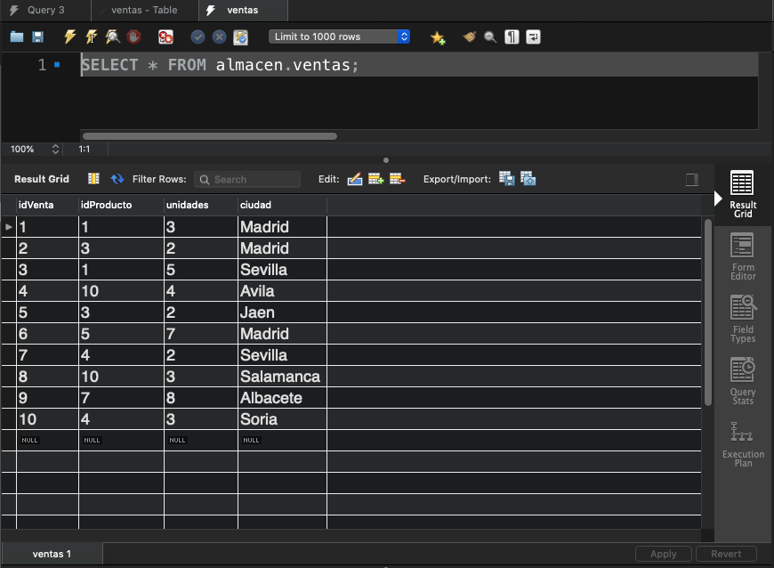

bien pues una vez visto la estructura de la tabla vamos a vemos algunos datos insertados.

### Creación Proyecto Eclipse

Basandonos en el proyecto `615-07_proyecto_relacion_almacen` vamos a hacer una copia y lo llamaremos `615-09_proyecto_relacion_almacen`.

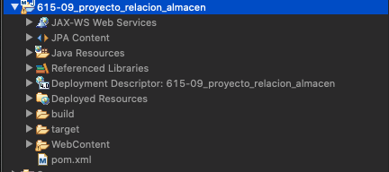

Una vez copiado vamos a las propiedades del proyecto en `Web Project Settings` para colocar el nuevo nombre `615-09_proyecto_relacion_almacen`.

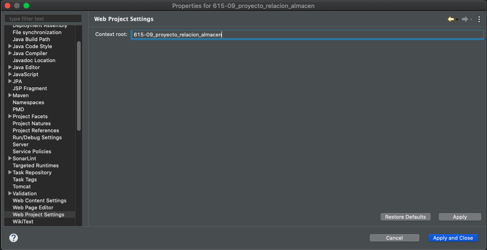

Tambien cambiamos el nombre en el `pom.xml`.

```html
<groupId>615-09_proyecto_relacion_almacen</groupId>
<artifactId>615-09_proyecto_relacion_almacen</artifactId>
```

Y tambie´n lo cambiamos en el `persistence.xml`

```html
<?xml version="1.0" encoding="UTF-8"?>
<persistence version="2.2"
	xmlns="http://xmlns.jcp.org/xml/ns/persistence"
	xmlns:xsi="http://www.w3.org/2001/XMLSchema-instance"
	xsi:schemaLocation="http://xmlns.jcp.org/xml/ns/persistence http://xmlns.jcp.org/xml/ns/persistence/persistence_2_2.xsd">
	<persistence-unit
		name="615-09_proyecto_relacion_almacen">
		<jta-data-source>jdbc/almacends</jta-data-source>
		<class>entidades.Producto</class>
		<class>entidades.Seccion</class>
	</persistence-unit>
</persistence>
```

Lo que nos obliga también cambiarlo en `GestionProductosEjb`.

```java
@PersistenceContext(unitName="615-09_proyecto_relacion_almacen")
EntityManager em;
```

Una vez hecho la copia del proyecto y los ajustes básicos necesarios vamos a ver lo que se ha aumentado.

#### 1. Aumentar el método `obtenerProductosVentas(int unidades)` en la Logica de Negocio `GestionProductosEjb` y `GestionProductosEjbLocal`

```java
@Override
public List<Producto> obtenerProductosVentas(int unidades){
   //opción 1 con join
   String jpql="select distinct(p) from Producto p join p.ventas v where v.unidades>?1";
   TypedQuery<Producto> q=em.createQuery(jpql,Producto.class);
   q.setParameter(1,unidades);
   return q.getResultList();
}
```

Este método nuevo `obtenerProductosVentas(int unidades)` obtener productos ventas a partir del número de unidades devolvera la lista de productos que han sido vendidos mayor de esas unidades.

La instrucción JPQL `select distinct(p) from Producto p join p.ventas v where v.unidades>?1` se trata de un Join. Porque lo que tenemos es que recuperar objetos de la entidad del lado 1 `Producto`, cuya condición afecta a la entidad del lado Mucho `Ventas` por eso debemos definir un Join. La asociación del alias la llamamos `v` a la entidad `Venta` de cada producto, es el Join, que nos permite a continuación establecer la condición sobre la entidad `Venta` que `unidades` en este caso sea mayor que el parámetro. Aquí también utilizamos la función `distinct` para quedarnos con una única versión del productos, por cada vez que se repite el producto. Es decir si ha habido tres ventas de un determinado producto que superen esa cantidad de unidades, sólo nos vamos a quedar con una de ellas, es decir va a ser el mismo producto si los alicates se han vendido en tres ventas una vez por cinco unidades otra 7 y otra 10 si queremos la condiciones que sea mayor de tres pues nos va a recoger tres veces ese objeto producto alicates, gracias a `distinct` solamente nos vamos a quedar con una de esas entidades con una de esas entradas nada más.

Una vez que tenemos la instrucción JPQL creamos el `TypedQuery` le asignamos el parámetro y ya simplemente lanzar la instrucción llamar a `getResultList()` es así de simple.

Qué pasaría, cómo lo habríamos tenido que hacer si no hubiéramos utilizado Joins, que habríamos tenido que hacer.

```java
@Override
public List<Producto> obtenerProductosVentas(int unidades){
   
   //opción 2 sin join
   
   String jpql="select v from Venta v where v.unidades>?1";
   TypedQuery<Venta> q=em.createQuery(jpql,Venta.class);
   q.setParameter(1,unidades);
   List<Venta> ventas=q.getResultList();
   List<Producto> prods=new ArrayList<>();
   for(Venta v:ventas){
      prods.add(v.getProducto());
   }
   return prods;
   
}
```


Bueno sin Join la cosa habría sido más compleja por qué primero habríamos tenido que sacar las ventas que cumplieran esa condición, unidades mayor que tal valor, una vez obtenidas las ventas, habría que ver de cada venta haber obtenido sus productos relacionados, con la venta viene el producto pero vienen muchas ventas y nosotros sólo nos interesan los productos. Entonces habría que haber ido recorriendo todas las ventas haber cogido cada producto y haberlo metido en una colección auxiliar uno por uno hasta que al final los tendríamos todos en `prods` y lo retornaríamos.

Cómo ves el uso de los Joins nos a simplificado enormemente el trabajo.

#### 2. Añadir el Controlador `TopVentasAction`

En cuanto al resto de la aplicación en la parte del Controlador ha habido que incluir un nuevo controlador `TopVentasAction`.

*`TopVentasAction`*

```java
package controlador;

import java.io.IOException;
import java.util.List;

import javax.ejb.EJB;
import javax.servlet.ServletException;
import javax.servlet.annotation.WebServlet;
import javax.servlet.http.HttpServlet;
import javax.servlet.http.HttpServletRequest;
import javax.servlet.http.HttpServletResponse;

import entidades.Producto;
import modelo.GestionProductosEjbLocal;

/**
 * Servlet implementation class TopVentasAction
 */
@WebServlet("/TopVentasAction")
public class TopVentasAction extends HttpServlet {
   private static final long serialVersionUID = 1L;

   @EJB
   GestionProductosEjbLocal gproductos;
   protected void service(HttpServletRequest request, HttpServletResponse response) throws ServletException, IOException {
      int unidades=Integer.parseInt(request.getParameter("unidades"));
      List<Producto> prods=gproductos.obtenerProductosVentas(unidades);
      request.setAttribute("productos", prods);
      request.getRequestDispatcher("topventas.jsp").forward(request, response);
   }

}
```

Que recupera el parámetro `unidades` que le manda la vista y manda llamar al método `.obtenerProductosVentas(unidades)` que recien creamos en la Lógica de Negocios, coloca lo obtenido en un atributo y redirige a la vista `topventas.jsp`.

#### 3. Añadir dos Vistas `unidades.html` y `topventas.jsp`


Ha siddo crear dos nuevas vistas `unidades.html` que es donde se va a recoger el número de unidades que ingrese el usuario y `topventas.jsp` que será donde se pinten los los productos que cumplen esa condición.

#### 4. Probar la Aplicación


Aquí se ha puesto de manifiesto cómo el uso de los Yeung nos va a simplificar muchas situaciones de otra manera pues la cosa sería bastante compleja si además hablamos de afectar por ejemplo a tres entidades que se verán afectadas en la instrucción J.P. Cubela y que obtener datos de una entidad cuya condición es de otra entidad que a su vez también implica condiciones de otra etcétera.

La utilización de Yeung simplemente con una única instrucción nos permite recogerlo todo y establecer todas las condiciones en ella de otra manera pues sería bastante más complejo y recurriendo entre todo el camino de relaciones hasta poder conseguir las entidades que vamos buscando no tanto el uso de Jaynes.

Es muy práctico también en JPA.


*******
cómo sería la aplicación la tengo aquí ya funcionando te voy a enseñar cómo sería el funcionamiento usaríamos dos ventas y al escribir las unidades por ejemplo tres al pulsar Enviar nos mostraría una lista con los productos que han sido vendidos más de tres unidades de cada uno de ellos en una ventana determinada.

Es decir si esto significa que ha habido ventas en la que alicates de 25 milímetros se han vendido más de tres veces interruptor doble lo mismo es lo mismo y pintura.

# Autoevaluación V 01:30
 
1. En una relación uno a muchos / muchos a uno, ¿Qué entidad debe indicar la información de la relación entre tablas?:
   * La entidad del lado muchos :+1:
   * La entidad del lado uno
   * Cualquiera de las dos
   * No es necesario indicar la información de relación entre tablas dentro de una entidad

2. Tenemos dos entidades, A y B, relacionadas uno a muchos/muchos a uno. El atributo mappedBy utilizado en la anotación `@OneToMany` dentro de la entidad A indica
   * El nombre de la columna común a ambas tablas
   * El nombre del atributo de la entidad B que contiene el objeto de la entidad A :+1:
   * El nombre del atributo de la entidad A que contiene los objetos de B
   * El nombre de la primary key

3. En una relación muchos a muchos, la información de la tabla de unión se indica a través de la anotación
   * `@ManyToMany`
   * `@JoinTable` :+1:
   * `@UnionTable`
   * `@UnionColumns`
   
4. Tenemos dos entidades, EntiA y EntiB, relacionadas uno a muchos/muchos a uno. El atributo "bs" de la entidad EntiA contiene los objetos de EntiB asociados, mientras que el atributo "a" de EntiB, contiene el objeto EntiA asociado. Queremos recuperar todas las entidades de tipo EntiA, para las que el atributo num de la entidad EntiB vale 7. ¿Cuál de las siguientes instrucciones JPQL sería la que tendríamos que utilizar?
   * `Select b From EntiB b Where b.a.num=7`
   * `Select a From EntiA a Where b.num=7`
   * `Select a From EntiA a, EntiB b Where b.num=7`
   * `Select a From EntiA a Join a.bs b Where b.num=7` :+1:
   
5. Tenemos dos entidades, EntiA y EntiB, relacionadas uno a muchos/muchos a uno. El atributo "bs" de la entidad EntiA contiene los objetos de EntiB asociados, mientras que el atributo "a" de EntiB, contiene el objeto EntiA asociado. Queremos recuperar todas las entidades de tipo EntiB, para las que el atributo longitud de la Entidad EntiA vale 10. ¿Cuál de las siguientes instrucciones JPQL sería la que tendríamos que utilizar?

   * `Select b From EntiB b Where EntiA.longitud=7`
   * `Select b From EntiB b join EntiA a Where a.longitud=7`
   * `Select b From EntiB b Where b.a.longitud=7` :+1:
   * `Select a From EntiA a Where a.bs.longitud=7`
 


SOLUCIONES:

1.- A

2.- B

3.- B

4.-D

5.- C


