# 7. Configuraciones JPA y uso de Hibernate 01:30:31

* 28 Ajuste de relaciones 06:54
* 29 Claves compuestas 07:41
* 30 Utilización de motor hibernate 12:39
* 31 Carga de datos en modo lazy con Hibernate 04:57
* 32 Utilización del framework de hibernate 13:54
* 33 El API de Hibernate 06:21
* 34 Utilización del API de Hibernate en una aplicación 18:29
* 35 Ell API Criteria 03:44
* 36 Ejercicio práctico VI 07:27
* Autoevaluación VI 01:00
* Resumen final 07:25

# 28 Ajuste de relaciones 06:54

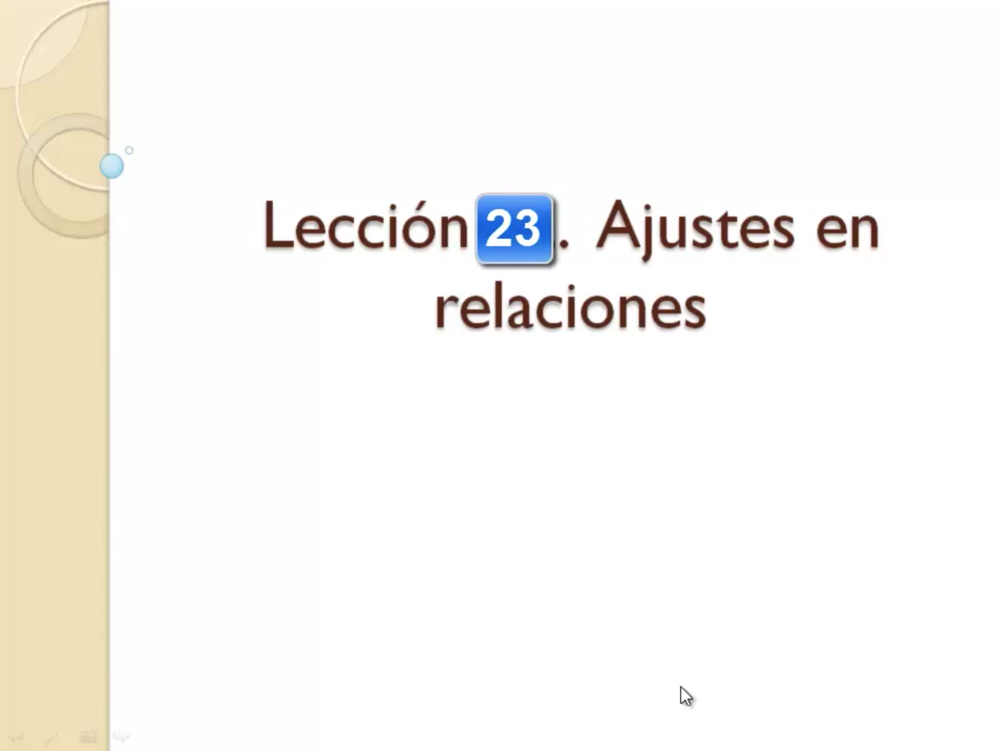

Después de estudiar la creación y manipulación de entidades relacionadas vamos a ver cómo realizar algunos ajustes en las relaciones, de manera que nos permitan optimizar el trabajo sobre la capa de persistencia.

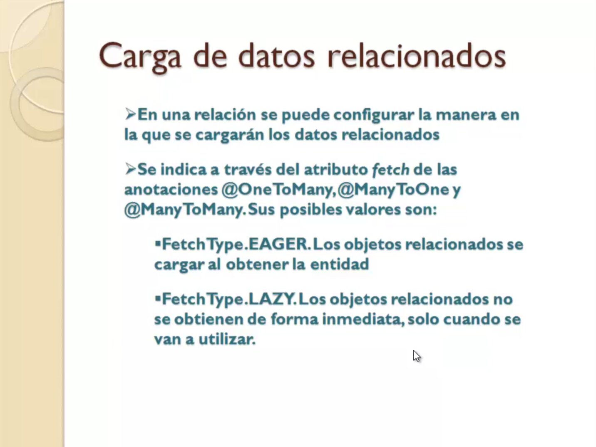

La primera de esas operaciones de ajuste que vamos a realizar vamos a ver cómo realizar es,  la Carga de Datos Relacionados, y es que en una relación podemos configurar la manera en la que se van a cargar los datos relacionados.

La manera en la que lo vamos a hacer es a través de un atributo llamado `Fetch` que vamos a poder indicar en las anotaciones `@OneToMany`, `@ManyToOne` y `@ManyToMany`.

Cuáles son los posibles valores que puede tomar este atributo:

* `FechType.EAGER` 
* `FechType.LAZY`

Son estos dos posibles valores que ves aquí, que corresponden a unas constantes definidas en la anotación `FetchType` está el valor `EAGER` y el valor `LAZY`.

Qué significa que el atributo `Fetch` tenga el valor `EAGER`, significa que a la hora de por ejemplo hacer una búsqueda en una entidad los objetos relacionados se van a cargar dentro de la colección o dentro del atributo de la clase dependiendo si OneToMany o ManyToOne en el mismo momento en el que se carga la entidad principal, la entidad localizada.

En el caso de que eligamos la acción `LAZY` entonces cuando se hace una carga de una entidad, de la entidad principal, los datos relacionados no se van a cargar en memoria en ese momento, solamente se cargarán cuando vayan a ser utilizados, es decir a la hora de llamar al método `getNombreDelAtributo()` de la entidad que vamos a recuperar.

Eso nos va a permitir hacer esos ajustes de manera que dependiendo de si queremos tenerlo todo desde el principio o si queremos optimizar el consumo de memoria y no queremos tener todos los datos cargados hasta que van a ser utilizados podemos jugar con los valores `EAGER` o `LAZY`, si no indicamos nada cada motor de persistencia definirá su propio valor y dependiendo del tipo de relación definirán su propio valor predeterminado, pero si queremos establecer uno concreto tenemos estos atributos, como vamos a ver ahora en uno de los ejercicios que hicimos en las lecciones anteriores.

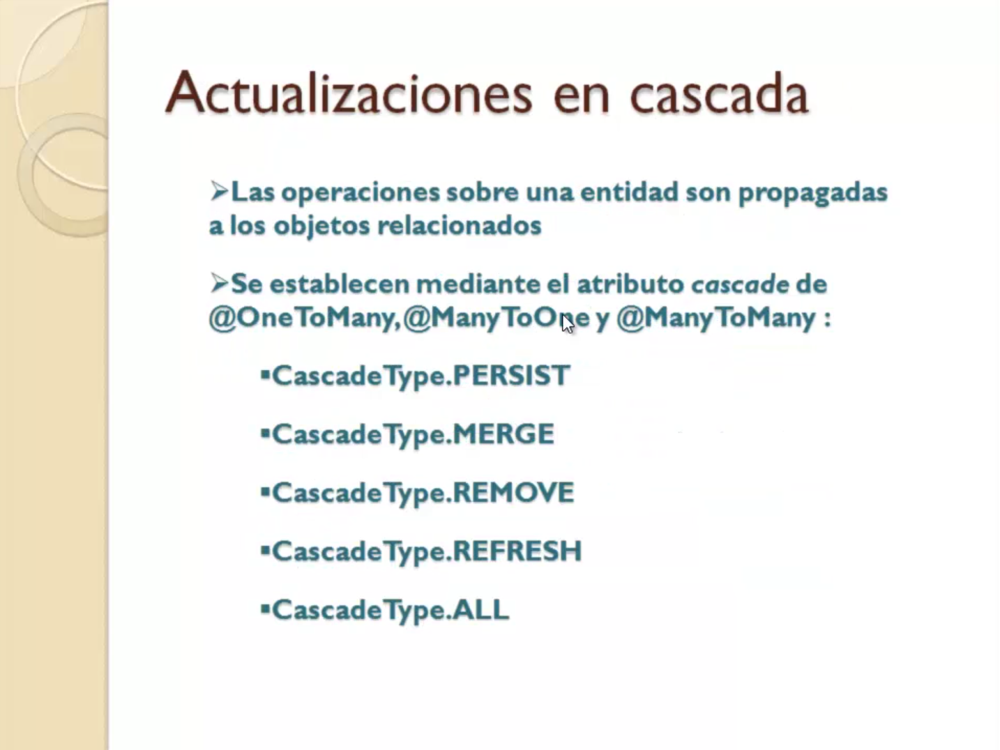

El otro tipo de ajuste que podemos realizar son las *Actualizaciones en Cascada*. Si nosotros hacemos una operación sobre una entidad, una eliminación, un refresco o una actualización qué pasa con los objetos de las entidades relacionadas, se van a actualizar también, se van a eliminar, en principio no va a pasar nada con ellos a no ser que queramos nosotros propagar alguna o todas las operaciones sobre la identidad principal también en las entidades relacionadas. Eso lo vamos a indicar a través del atributo `cascade` también de las mismas anotaciones `@OneToMany`, `@ManyToOne` y `@ManyToMany` utilizando alguna de las constantes definidas en la anotación `CascadeType`:

* `CascadeType.PERSIST`
* `CascadeType.MERGE`
* `CascadeType.REMOVE`
* `CascadeType.REFRESH`
* `CascadeType.ALL`

Por ejemplo si a la hora de eliminar una entidad queremos que también se eliminen los objetos relacionados puesto que no tendría sentido a lo mejor que quedarán esos objetos en la base de datos, las filas correspondientes en la base de datos, una vez que se ha eliminado la actividad principal, podríamos propagar la operación de eliminación utilizando el valor `CascadeType.REMOVE` en el atributo `cascade`.

Bueno lo mejor es que lo vamos a ver sobre uno de los ejercicios el último que hicimos el ejercicio práctico `615-09_proyecto_relacion_almacen` lo vamos a copiar a uno llamado `615-10_proyecto_relacion_almacen`, debemos cambiar el nombre en:

* Web Project Settings
* `pom.xml`
* `persistence.xml`
* `GestionProductosEjb`

Vamos a centrarnos concretamente en las entidades `Seccion` y `Producto` por ejemplo ya sabemos que hay una relación Uno a Muchos y Muchos a Uno en sentido contrario pero hay una relación Uno a Muchos entre `Seccion` y `Producto`. Queremos que se carguen todos los productos dentro del atributo de colección de la entidad `Seccion` cuando se haga la localización o la búsqueda de una determinada `Seccion`, dependiendo si queremos que sea así o no sea así utilizaremos y configuramos el atributo `Fetch` que hemos comentado anteriormente dentro de la anotación de la que define la relación.

Por ejemplo en `Seccion` nosotros tenemos actualmente esto:

```java
// bi-directional many-to-one association to Producto
@OneToMany(mappedBy = "seccione")
private List<Producto> productos;
```

Por ejemplo aquí no queremos que al cargar un objeto `Seccion` al hacer un `find` al objeto `Seccion` o un `Query` no queremos que se carguen todos los objetos `Producto` relacionados de cada `Seccion` en la variable `productos`, solamente cuando se llame al método `getProductos()`. Bueno pues entonces si no queremos que se carguen inmediatamente había que hacer lo que se conoce como una carga perezosa `LAZY` y eso se indica como decía antes a través del atributo `Fetch`, indicando una de las dos posibles constantes que hemos hemos dicho antes. En nuestro caso queremos que sea `LAZY`, carga perezosa para que no sean encargado inmediatamente.

```java
// bi-directional many-to-one association to Producto
@OneToMany(mappedBy = "seccione", fetch=FetchType.LAZY)
private List<Producto> productos;
```

Si queremos lo contrario, que se cargue todo al mismo momento en el que se carga también la sección, que vengan también sus productos, sería `EAGER`. Si no se dice nada, lo dejaríamos al valor por defecto que tenga cada motor de persistencia y cada relación, habría que consultar la documentación de dicho motor o proveedor de persistencia para ver cual es.

Esto por un lado, sobre el tema de las actualizaciones en cascada. Por ejemplo tenemos una relación Uno a Muchos entre `Producto` y `Venta`, queremos que al ser eliminado un producto por ejemplo se eliminen todos sus ventas relacionadas. Podría tener sentido, porque si ya no existe un producto qué sentido tiene que estén registran sus ventas en la base de datos también. Entonces lo que podríamos hacer en la relación Uno a Muchos entre `Producto` y `Venta` que actualmente esta así en `Producto`:

```java
//bi-directional many-to-one association to Venta
@OneToMany(mappedBy="producto")
private List<Venta> ventas;
```
Entonces definiríamos el atributo `cascade` indicaremos que queremos propagar la operación de eliminación atravez de `CascadeType` que tiene una serie de constantes entre las cuales está `REMOVE` si quisiéramos propagar más de una operación entonces deberíamos indicar la lista de constantes entre llaves y separar los valores por comas por ejemplo para incluir también la actualización `MERGE`. 

```java
//bi-directional many-to-one association to Venta
@OneToMany(mappedBy="producto",cascade={CascadeType.REMOVE,CascadeType.MERGE})
private List<Venta> ventas;
```

y de esta manera estaríamos propagando estas dos operaciones, si quisiéramos propagar las todas, eso ya depende de cada caso si tiene sentido o no, en este caso pues no tendría mucho sentido, a lo mejor es que si se da de alta un producto se den de alta sus ventas, porque a lo mejor no existen todavía, ese tipo de operación igual no tiene mucho sentido, pero en cualquier caso que por lo que sea queremos propagar todas las operaciones, no hace falta que pongamos todas las constantes posibles, está la constante `ALL` que significa propagar todas las operaciones a la entidad relacionada.

Bueno pues ya he visto de qué manera se puede ajustar y optimizar las relaciones entre entidades.

### :computer: Código Completo - 615-10_proyecto_relacion_almacen

Este proyecto es exactamente igaul que el proyecto `615-09_proyecto_relacion_almacen`, solo con los cambios que se mencionarón en las entidades `Seccion` y `Producto`.

# 29 Claves compuestas 07:41

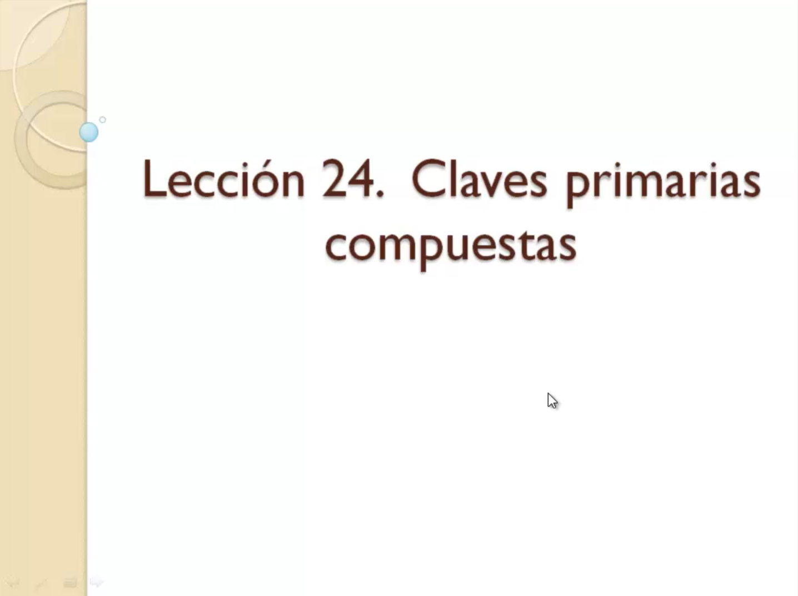

En los ejemplos de entidades que hemos visto hasta el momento, siempre hemos trabajado con claves primarias simples es decir, los atributos de esas clases estaban asociados a una única columna de la tabla en la base de datos puesto que en la propia base de datos, en la tabla la clave primaria era una única columna.

Pero qué ocurre si nos encontramos con tablas cuya clave primaria es la combinación de dos o más columnas.

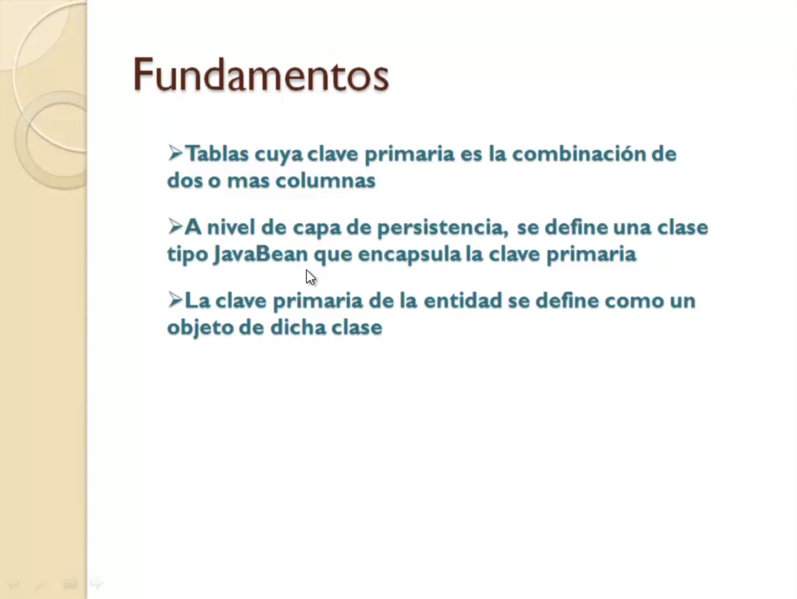

Bueno pues cómo procederíamos a nivel de Capa de Persistencia, a nivel de Capa de Persistencia tendríamos que definir una clase en tipo JavaBean que encapsule los datos de dicha Prima Key, dicha clave primaria compuesta, es decir encapsularía las dos o más columnas que formarán la Prima Key, después a nivel de la entidad en vez de definir un atributo por cada una de las columnas definiríamos un único atributo asociado a dicha clase de este JavaBean que encapsula la Prima Key, además habría que incluir unas anotaciones que vamos a ver ahora en el ejemplo que vamos a proponer a continuación.

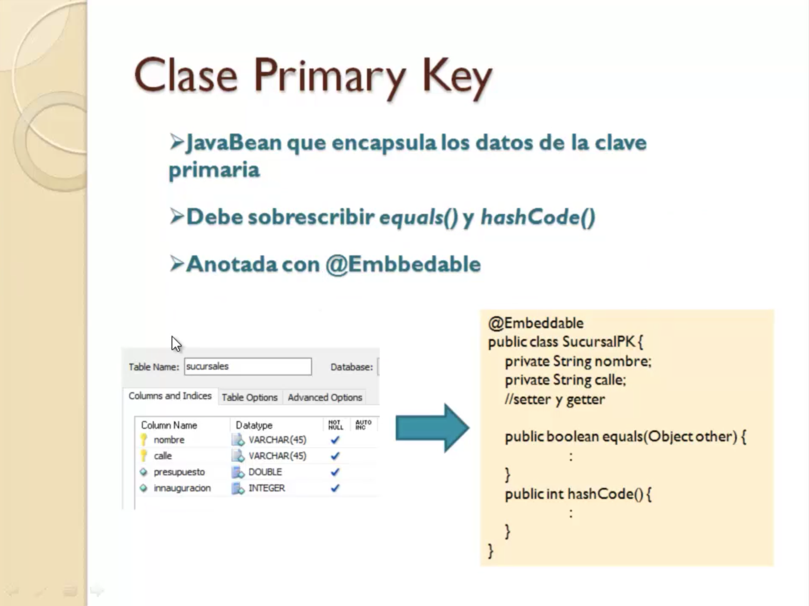

Supongamos por ejemplo que tenemos nuestra base de datos `almacen` donde hemos trabajado ya en otros ejercicios y en ella añadimos una nueva tabla `sucursales` que representa o que contienen los datos de las diferentes sucursales en las que se van a realizar las ventas del almacén, la verdad es que eso es lo de menos, lo importante es que pasamos a tener cuatro campos, cuatro columnas:

* nombre
* calle
* presupuesto
* inauguracion.

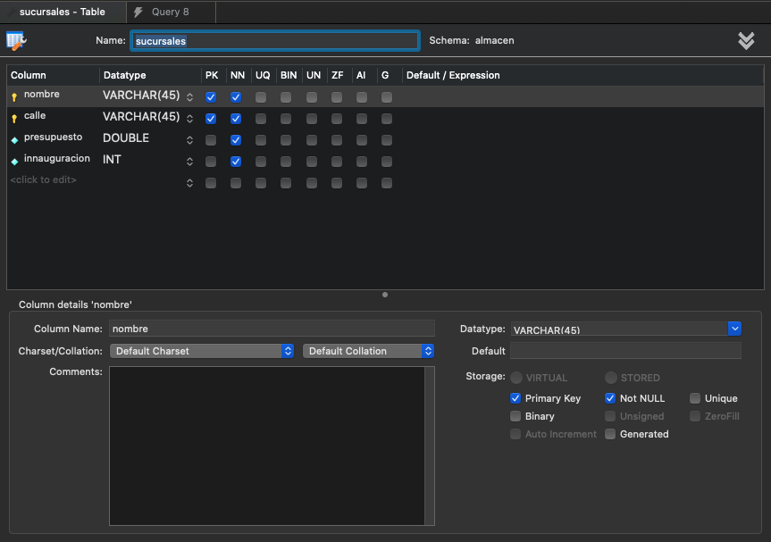

Y lo interesante, por el motivo que sea hemos decidido que la Prima Key de esta tabla es la combinación de las columnas nombre y calle, qué tendríamos que hacer a nivel de capa de persistencia. 

Tendríamos primero que crear una clase tipo JavaBean a la que llamaríamos habitualmente como el nombre de la entidad que vamos y terminaba en PK es decir `SucursalPK`, en este caso que en Capsule como ves las dos columnas nombre y calle, tendríamos entonces dos atributos, los campos asociados a estas dos columnas. Por supuesto los setters y getters para acceder a ellos y muy importante esta clase Java debe sobrescribir los métodos `equals()` y `hashcode()` puesto que en estos métodos son en los que se basa el motor de persistencia para determinar la igualdad de las entidades y por lo tanto también la igualdad de las Prima Key es decir, una Prima Key se distingue de otras no porque mire los valores de los atributos sino en función de lo que determinen los métodos `equals()` y `hashcode()`.

Otra cosa importante tendrá que estar anotada la clase con la anotación `@Embeddable` esto en cuanto a la clase Prima Key.

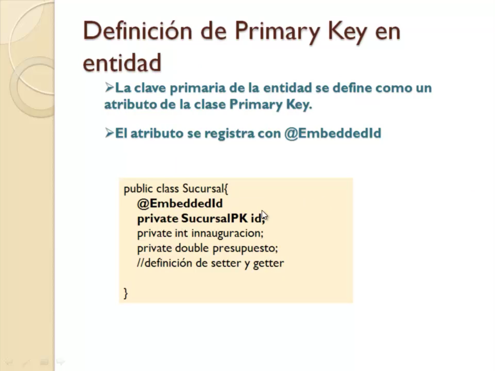

Y qué pasa con la clase entidad `Sucursal` se definirá como una entidad como otra cualquiera pero eso sí en vez de definir un atributo por cada una de las columnas define un único atributo del tipo de la Prima Key, como ves aquí definimos un atributo de tipo `SucursalPK`, el resto de los atributos igual con sus métodos setter y getter y muy importante en vez de la anotación `@Id` que es la que hemos utilizado para Prima Key simples se utilizaría la anotación `@Embeddable` para anotar la Prima Key compuesta.

### Creación Proyecto Eclipse

Vamos a ver esto con un ejemplo, vamos a crear un proyecto Web básico como el ejemplo que realizamos en la leccione `11 Ejercicio práctico I Parte`.

#### 1. Creación de un Proyecto Dynamic Web Project 


Le llamaremos `615-11_ejemplo_clave_compuesta` y usaremos el servidor Tomcat.


Se crea la estructura de nuestro proyecto Web.

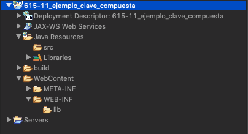

#### 2. Vamos a convertirlo en Project Facets - JPA

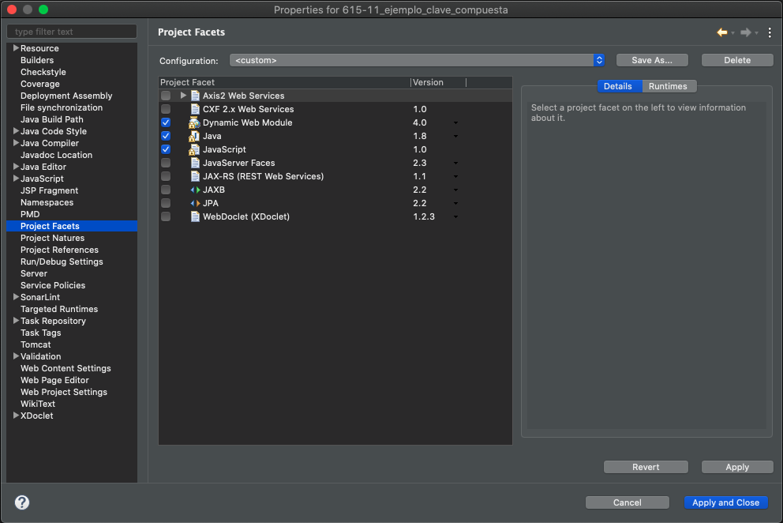

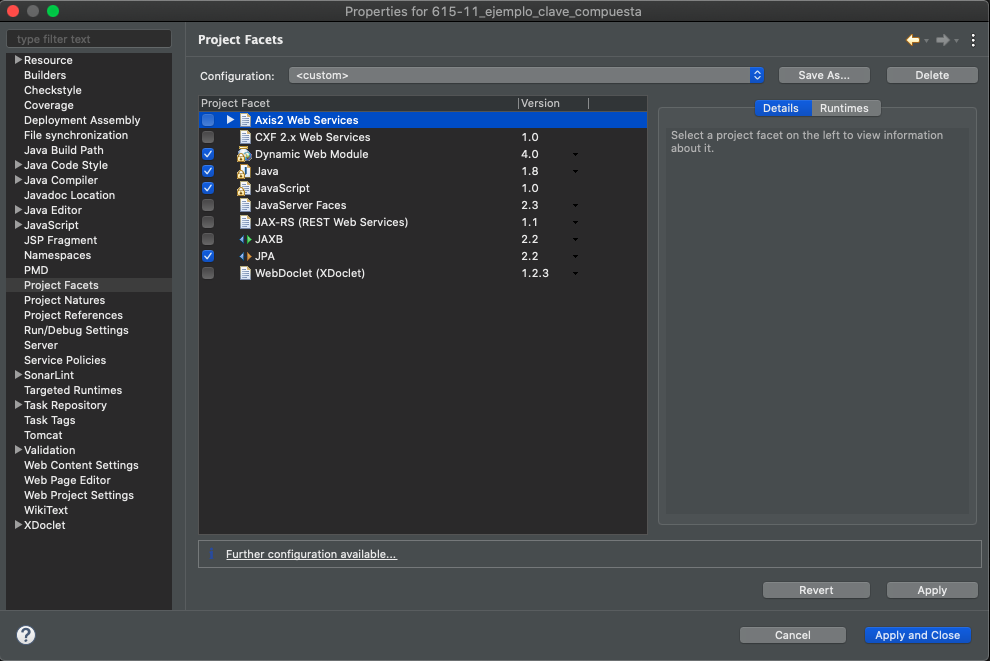

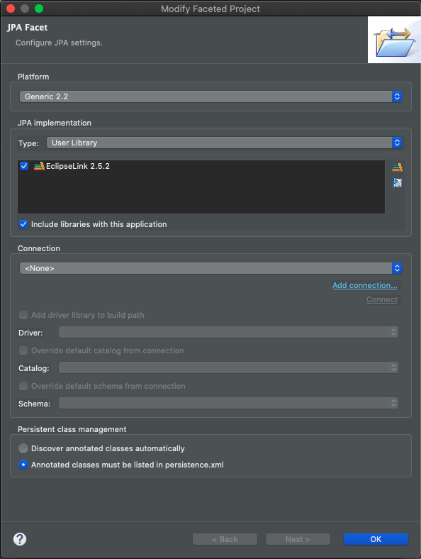


Se ha activado el Project Facets - JPA tenemos ya el archivo `persistence.xml`:

```html
<?xml version="1.0" encoding="UTF-8"?>
<persistence version="2.2" xmlns="http://xmlns.jcp.org/xml/ns/persistence" xmlns:xsi="http://www.w3.org/2001/XMLSchema-instance" xsi:schemaLocation="http://xmlns.jcp.org/xml/ns/persistence http://xmlns.jcp.org/xml/ns/persistence/persistence_2_2.xsd">
	<persistence-unit name="615-11_ejemplo_clave_compuesta">
	</persistence-unit>
</persistence>
```

#### 3. Hacer la Conexión a la Base de Datos

Dentro de `persistence.xml` vamos a la pestaña `Connection`.

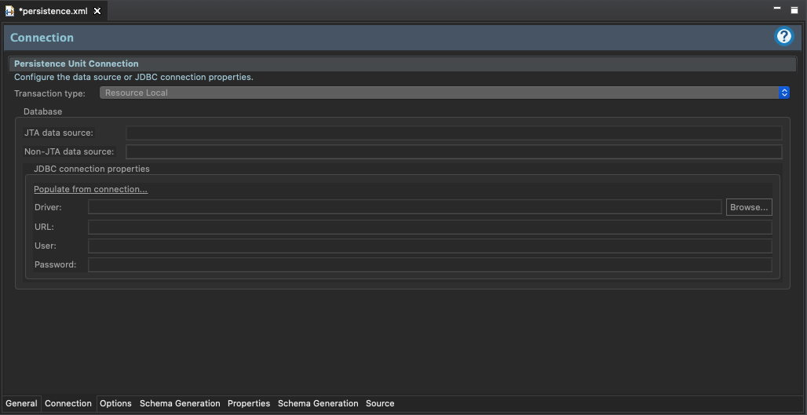

Seleccionamos `Transaction type: Resource Local`, presionamos en `Populate from connection...`.

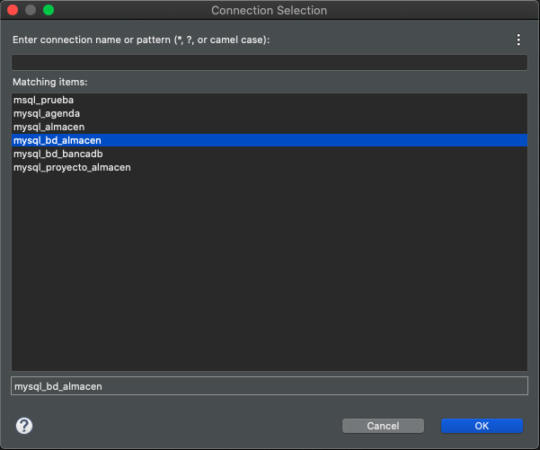

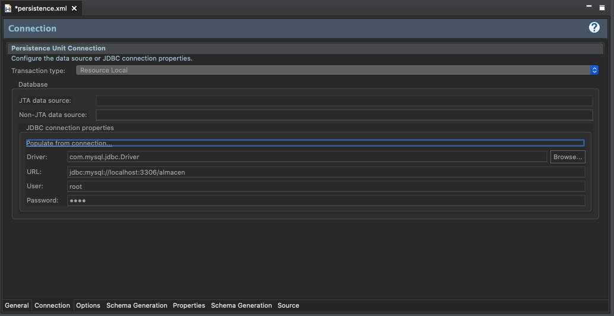

Seleccionamos nuestra conexión de base de datos `almacen`. Con esto se insertan los datos de conexión dentro de nuestro archivo `persistence.xml`.

```java
<?xml version="1.0" encoding="UTF-8"?>
<persistence version="2.2" xmlns="http://xmlns.jcp.org/xml/ns/persistence" xmlns:xsi="http://www.w3.org/2001/XMLSchema-instance" xsi:schemaLocation="http://xmlns.jcp.org/xml/ns/persistence http://xmlns.jcp.org/xml/ns/persistence/persistence_2_2.xsd">
	<persistence-unit name="615-11_ejemplo_clave_compuesta" transaction-type="RESOURCE_LOCAL">
		<properties>
			<property name="javax.persistence.jdbc.url" value="jdbc:mysql://localhost:3306/almacen"/>
			<property name="javax.persistence.jdbc.user" value="root"/>
			<property name="javax.persistence.jdbc.password" value="root"/>
			<property name="javax.persistence.jdbc.driver" value="com.mysql.jdbc.Driver"/>
		</properties>
	</persistence-unit>
</persistence>
```

#### 4. Creación de la Entidad `Sucursal`

Vamos a crear la Entidad con clave compuesta lo vamos a hacer con el asistente de Eclipse y verás cómo es exactamente igual que con el caso de las entidades que hemos creado hasta el momento con Primary Key simple, todo se va a generar de forma automática incluido la clase que encapsula la Primary Key, el proceso es el mismo con el botón derecho JPA Tools generar entidades desde tablas.

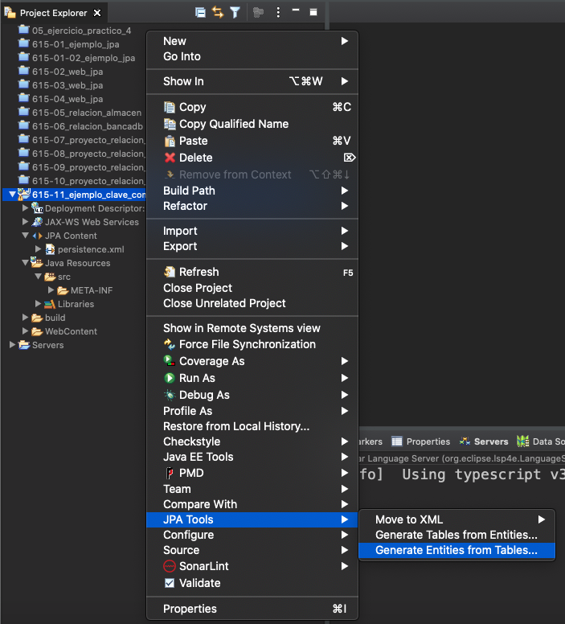

Elegimos la conexión con la base de datos que ya la tenemos creada de ejercicios anteriores `mysql_bd_almacen`

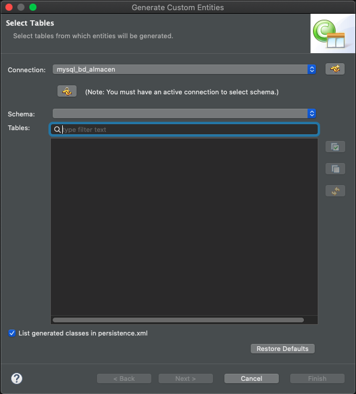

En teoría deberían podernos seleccionar el Esquema pero nada, no nos aparece nada, acuérdate del truco que te enseñé si no te aparece la lista de tablas pues entonces te vas a la perspectiva Database Deployment para editar la conexión y poder ver en que falla.

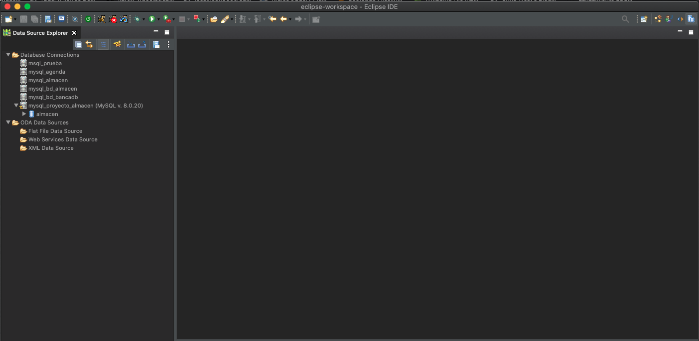

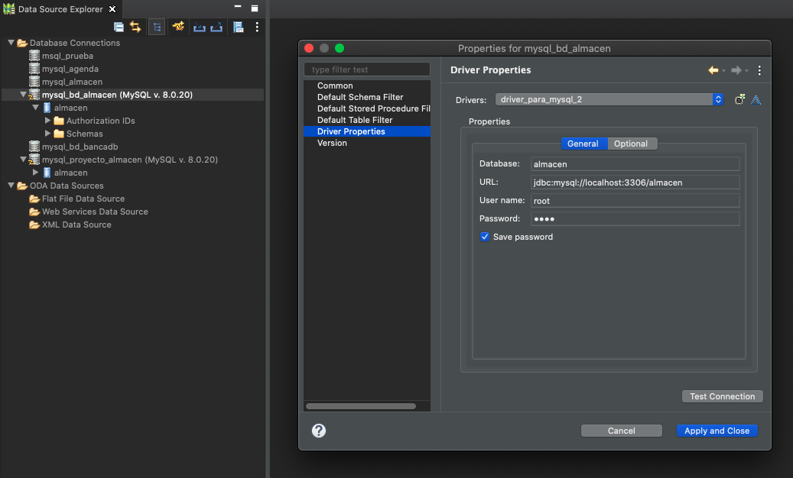

Aparentemente todo esta bien, el Ping funciona.

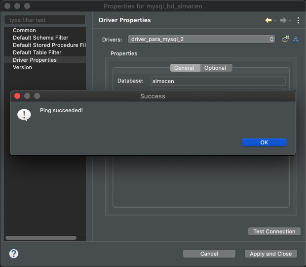

Si volvemos a seleccionar botón derecho JPA Tools - Generated Entities from Tables...

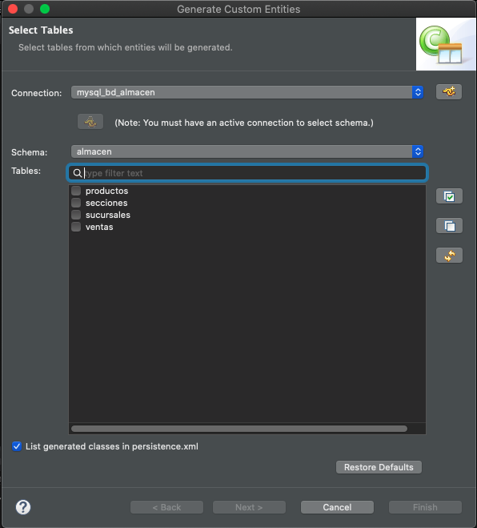

Ya aparece la lista de las tablas, seleccionamos la tabla `sucursales`.

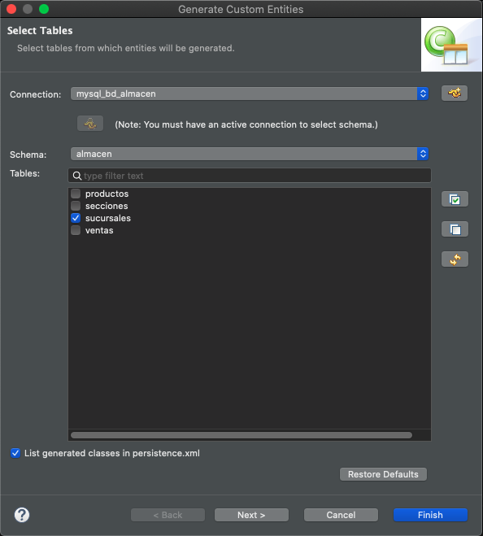

En el siguiente paso `Table Associations`

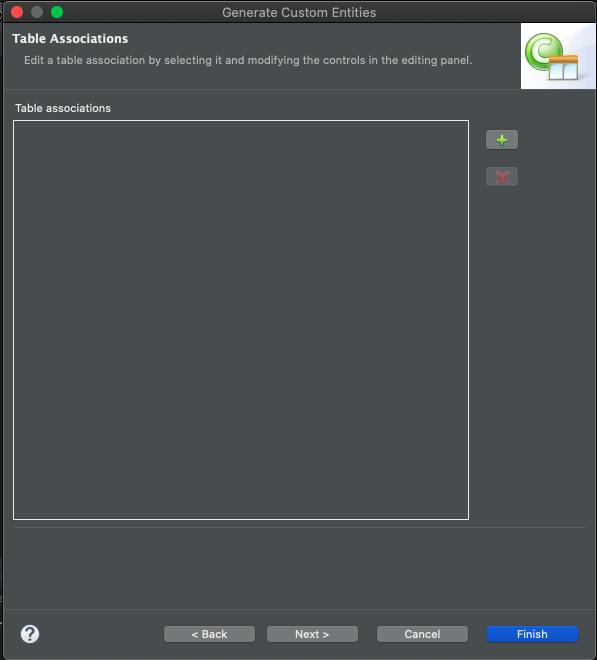

No hay asociaciones porque sólo vamos a generar una entidad con una única tabla, evidentemente si esa tabla estuviera relacionada con otras pues igual que hemos hecho en los casos de las entidades de clave primaria simple pues se añadirían aquí se indicarían cuáles son los campos de relación entre cada tabla y sería exactamente igual, el proceso es el mismo. Bueno vamos al siguiente paso.


Aquí le indicamos que el paquete es `entidades` que genere la entidad en ese paquete.

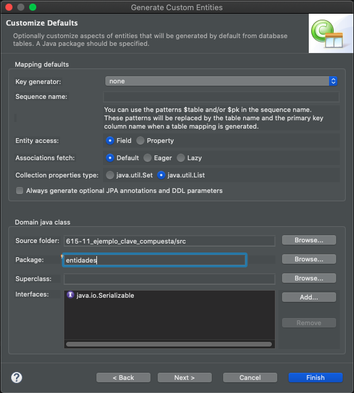

Y en el último paso decir que la clase de entidad se va a llamar `Sucursal` y evidentemente no vamos a poner nada en `Key generator` porque la Primary Key al ser compuesta está formada por la combinación de dos columnas con valores específicos. Como ven no pregunta nada sobre la Clase Primary Key (SucursalPK) la va a generar automáticamente al darse cuenta que la tabla `sucursales` tiene una Primary Key formada por dos columnas.

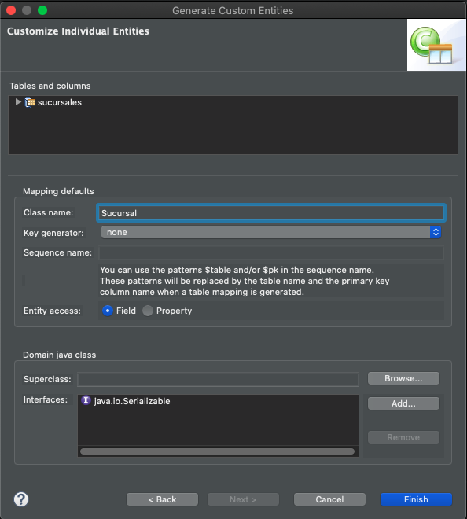

Al finalizar vemos los archivos que se han creado.

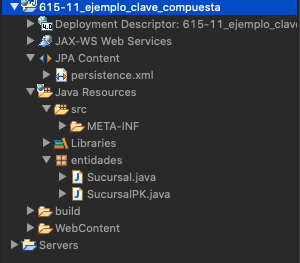

Aquí tenemos `SucursalPK` y `Sucursal`.

*`SucursalPK`*

```java
package entidades;

import java.io.Serializable;
import javax.persistence.*;

/**
 * The primary key class for the sucursales database table.
 * 
 */
@Embeddable
public class SucursalPK implements Serializable {
	//default serial version id, required for serializable classes.
	private static final long serialVersionUID = 1L;

	private String nombre;

	private String calle;

	public SucursalPK() {
	}
	public String getNombre() {
		return this.nombre;
	}
	public void setNombre(String nombre) {
		this.nombre = nombre;
	}
	public String getCalle() {
		return this.calle;
	}
	public void setCalle(String calle) {
		this.calle = calle;
	}

	public boolean equals(Object other) {
		if (this == other) {
			return true;
		}
		if (!(other instanceof SucursalPK)) {
			return false;
		}
		SucursalPK castOther = (SucursalPK)other;
		return 
			this.nombre.equals(castOther.nombre)
			&& this.calle.equals(castOther.calle);
	}

	public int hashCode() {
		final int prime = 31;
		int hash = 17;
		hash = hash * prime + this.nombre.hashCode();
		hash = hash * prime + this.calle.hashCode();
		
		return hash;
	}
}
```

Como ves es una clase con `@Embeddable` los métodos setters y getters y el `equals()` y `hashCode()` sobreescritos, ha hecho una implementación por defecto de esos métodos con la que nos podemos quedar por supuesto y estar seguros de que en cuando sean distintos nombre y distinta calle los objetos van a ser diferentes y cuando sea el mismo nombre y la misma calle van a ser iguales, es la implementación que se ha hecho.

Y bueno lo que es la entidad `Sucursal`

*`Sucursal`*

```java
package entidades;

import java.io.Serializable;
import javax.persistence.*;


/**
 * The persistent class for the sucursales database table.
 * 
 */
@Entity
@Table(name="sucursales")
@NamedQuery(name="Sucursal.findAll", query="SELECT s FROM Sucursal s")
public class Sucursal implements Serializable {
	private static final long serialVersionUID = 1L;

	@EmbeddedId
	private SucursalPK id;

	private int innauguracion;

	private double presupuesto;

	public Sucursal() {
	}

	public SucursalPK getId() {
		return this.id;
	}

	public void setId(SucursalPK id) {
		this.id = id;
	}

	public int getInnauguracion() {
		return this.innauguracion;
	}

	public void setInnauguracion(int innauguracion) {
		this.innauguracion = innauguracion;
	}

	public double getPresupuesto() {
		return this.presupuesto;
	}

	public void setPresupuesto(double presupuesto) {
		this.presupuesto = presupuesto;
	}

}
```

Aquí tenemos la entidad `Sucursal` igual con sus anotaciones de siempre y eso sí el atributo del tipo `SucursalPK` en vez de `@Id` con `@EmbeddedId`.

```java
@EmbeddedId
private SucursalPK id;
```

#### 5. Lógica de Negocio 

Por lo demás a partir de ahora la manipulación de esa entidad es exactamente igual que como las entidades de clave primaria simple, vamos crear una clase `GestionSucursales` dentro del paquete `modelo`.

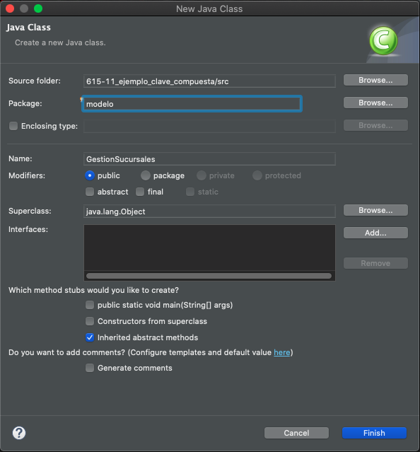

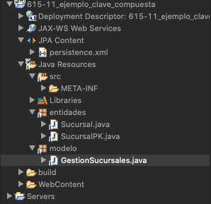

El código de esta clase es el siguiente:

*`GestionSucursales`*

```java
package modelo;

import java.util.List;

import javax.persistence.EntityManager;
import javax.persistence.EntityManagerFactory;
import javax.persistence.Persistence;
import javax.persistence.TypedQuery;

import entidades.Sucursal;
import entidades.SucursalPK;

public class GestionSucursales {
	
	//Método que permite obtener el objeto EntityManager
	private EntityManager getEntityManager() {
		EntityManagerFactory factory = Persistence.createEntityManagerFactory("615-11_ejemplo_clave_compuesta");
		return factory.createEntityManager();
	}
	
	public Sucursal buscarSucursal(String nombre, String calle) {
		SucursalPK clave = new SucursalPK();
		clave.setCalle(calle);
		clave.setNombre(nombre);
		EntityManager em = getEntityManager();
		return em.find(Sucursal.class, clave);
	}
	
	public List<Sucursal> obtenerSucursalesCalle(String calle){
		EntityManager em = getEntityManager();
		String jpql = "Select s From Sucursal s Where s.id.calle=?1";
		TypedQuery<Sucursal> q = em.createQuery(jpql, Sucursal.class);
		q.setParameter(1, calle);
		return q.getResultList();
	}

}
```

Tengo aquí una clase que la analizaremos que encapsula una serie de operaciones con esa entidad para que el tratamiento de la Entidad una vez que ya se ha creado, es exactamente igual que con las entidades que tienen clase primaria simples.

No es un EJB es una clase normal con su método `getEntityManager()` que nos permite obtener el objeto `EntityManager`.

Tenemos el método `buscarSucursal(String nombre, String calle)` que nos permite buscar una Sucursal con su clave primaria `nombre` y `calle`. Pues claro lo que va a recibir no va a ser un único valor sino recibir dos con la clave primaria que está formado por dos valores string.

Crearíamos un objeto `clave` de tipo `SucursalPK` como no tenemos un constructor con los dos parámetros en `SucursalPK`,  asignaremos los valores con los setter y a la hora de hacer el `find` como vemos vamos a buscar un objeto `Sucursal` y la clave primaria en vez de ser un `String`, un entero etc. es un objeto `clave` de tipo `SucursalPK`. Por lo demás exactamente igual.

Por ejemplo si tuviéramos que montar una Query imaginaros por ejemplo que queremos localizar todas las sucursales a partir de un determinado valor, que además es un valor de la Primary Key solamente la `calle`. Para eso tenemos al método `obtenerSucursalesCalle(String calle)` podríamos montar el JPQL
`jpql = "Select s From Sucursal s Where s.id.calle=?1";` que devuélve todas las sucursales cuyo calle como ves el atributo es `s.id.calle` que es como se llama el atributo de la Primary Key es igual al parámetro, asignarían el parámetro y con `getResultList()` recuperamos todas las Sucursales.

Es decir el tratamiento de la entidad una vez que ya se ha creado es exactamente igual que si tuviera una Primary Key simple.

### :computer: Código Completo - 615-11_ejemplo_clave_compuesta

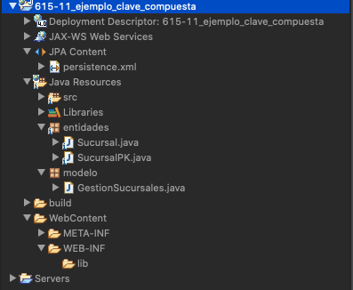

Este proyecto no se ejecuta.

*`persistence.xml`*

```html
<?xml version="1.0" encoding="UTF-8"?>
<persistence version="2.2" xmlns="http://xmlns.jcp.org/xml/ns/persistence" xmlns:xsi="http://www.w3.org/2001/XMLSchema-instance" xsi:schemaLocation="http://xmlns.jcp.org/xml/ns/persistence http://xmlns.jcp.org/xml/ns/persistence/persistence_2_2.xsd">
	<persistence-unit name="615-11_ejemplo_clave_compuesta" transaction-type="RESOURCE_LOCAL">
		<class>entidades.Sucursal</class>
		<class>entidades.SucursalPK</class>
		<properties>
			<property name="javax.persistence.jdbc.url" value="jdbc:mysql://localhost:3306/almacen"/>
			<property name="javax.persistence.jdbc.user" value="root"/>
			<property name="javax.persistence.jdbc.password" value="root"/>
			<property name="javax.persistence.jdbc.driver" value="com.mysql.jdbc.Driver"/>
		</properties>
	</persistence-unit>
</persistence>
```

**Entidades**

*`SucursalPK`*

```java
package entidades;

import java.io.Serializable;
import javax.persistence.*;

/**
 * The primary key class for the sucursales database table.
 * 
 */
@Embeddable
public class SucursalPK implements Serializable {
	//default serial version id, required for serializable classes.
	private static final long serialVersionUID = 1L;

	private String nombre;

	private String calle;

	public SucursalPK() {
	}
	public String getNombre() {
		return this.nombre;
	}
	public void setNombre(String nombre) {
		this.nombre = nombre;
	}
	public String getCalle() {
		return this.calle;
	}
	public void setCalle(String calle) {
		this.calle = calle;
	}

	public boolean equals(Object other) {
		if (this == other) {
			return true;
		}
		if (!(other instanceof SucursalPK)) {
			return false;
		}
		SucursalPK castOther = (SucursalPK)other;
		return 
			this.nombre.equals(castOther.nombre)
			&& this.calle.equals(castOther.calle);
	}

	public int hashCode() {
		final int prime = 31;
		int hash = 17;
		hash = hash * prime + this.nombre.hashCode();
		hash = hash * prime + this.calle.hashCode();
		
		return hash;
	}
}
```


*`Sucursal`*

```java
package entidades;

import java.io.Serializable;
import javax.persistence.*;


/**
 * The persistent class for the sucursales database table.
 * 
 */
@Entity
@Table(name="sucursales")
@NamedQuery(name="Sucursal.findAll", query="SELECT s FROM Sucursal s")
public class Sucursal implements Serializable {
	private static final long serialVersionUID = 1L;

	@EmbeddedId
	private SucursalPK id;

	private int innauguracion;

	private double presupuesto;

	public Sucursal() {
	}

	public SucursalPK getId() {
		return this.id;
	}

	public void setId(SucursalPK id) {
		this.id = id;
	}

	public int getInnauguracion() {
		return this.innauguracion;
	}

	public void setInnauguracion(int innauguracion) {
		this.innauguracion = innauguracion;
	}

	public double getPresupuesto() {
		return this.presupuesto;
	}

	public void setPresupuesto(double presupuesto) {
		this.presupuesto = presupuesto;
	}

}
```

**Modelo**

*`GestionSucursal`*

```java
package modelo;

import java.util.List;

import javax.persistence.EntityManager;
import javax.persistence.EntityManagerFactory;
import javax.persistence.Persistence;
import javax.persistence.TypedQuery;

import entidades.Sucursal;
import entidades.SucursalPK;

public class GestionSucursales {
	
	//Método que permite obtener el objeto EntityManager
	private EntityManager getEntityManager() {
		EntityManagerFactory factory = Persistence.createEntityManagerFactory("615-11_ejemplo_clave_compuesta");
		return factory.createEntityManager();
	}
	
	public Sucursal buscarSucursal(String nombre, String calle) {
		SucursalPK clave = new SucursalPK();
		clave.setCalle(calle);
		clave.setNombre(nombre);
		EntityManager em = getEntityManager();
		return em.find(Sucursal.class, clave);
	}
	
	public List<Sucursal> obtenerSucursalesCalle(String calle){
		EntityManager em = getEntityManager();
		String jpql = "Select s From Sucursal s Where s.id.calle=?1";
		TypedQuery<Sucursal> q = em.createQuery(jpql, Sucursal.class);
		q.setParameter(1, calle);
		return q.getResultList();
	}

}
```

# 30 Utilización del Motor Hibernate 12:39


En las aplicaciones que hemos estado desarrollando hasta el momento hemos empleado siempre el motor de Eclipse Link como motor de persistencia dentro de una aplicación.

Sin embargo una de las implementaciones clásicas de persistencia es la combinación del motor de Hibernate con el API JPA, vamos a ver cómo realizar esto.

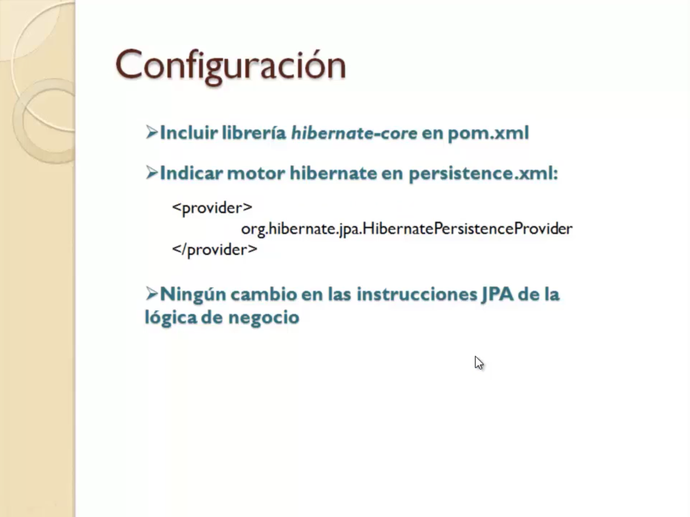

Básicamente se trata de modificar la configuración básicamente porque lo que es el código JPA es exactamente igual al que hemos estado utilizando hasta el momento.

Lo primero que tendríamos que hacer, si estamos utilizando Maven es incluir la referencia en las librerías del motor de Hibernate que es el `hibernate-core` en el `pom.xml`. Esto haría que se cargasen todos los Jar asociados a dicho motor. 

Por otro lado el  `persistence.xml` en vez de dejarlo vacío como hemos hecho hasta el momento para que cogiera el motor por defecto tendríamos que indicar a través del tag `provider`

```html
<provider>
   org.hibernate.jpa.HibernatePersistenceProvider
</provider>
```

que queremos utilizar el motor `HibernatePersistenceProvider` y nada más el resto ya es código JPA, con eso quedaría configurada la capa de persistencia. Por supuesto se crearían las entidades igual, exactamente igual que hemos estado haciendo hasta ahora. Y por supuesto JPA ningún cambio en cuanto a las instrucciones a utilizar, puesto que el motor de Hibernate es compatible con JPA. Esa es la idea.

### Creación Poyecto Eclipse

Bueno pues vamos a partir de uno de los ejercicios que tenemos hecho `615-03_web_jpa` donde habíamos creado una aplicación web como recordaras que se ejecutaba sobre Tomcat que hace los siguiente:

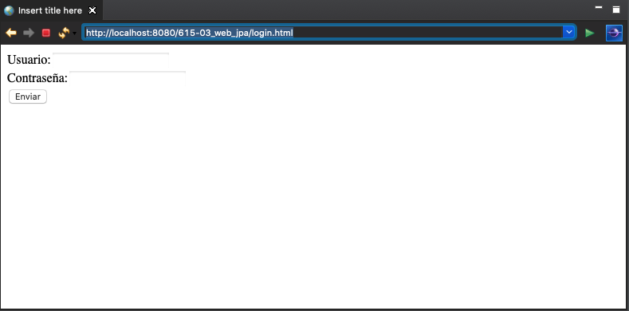

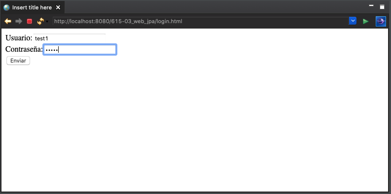


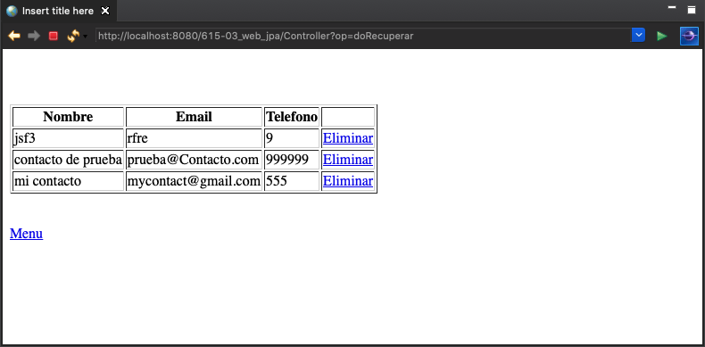

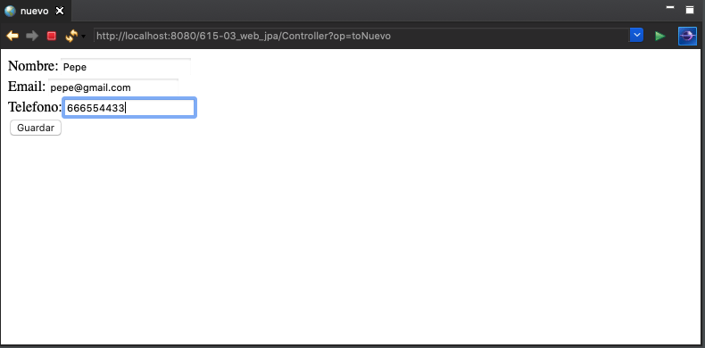

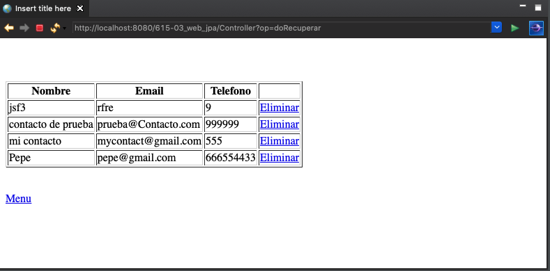

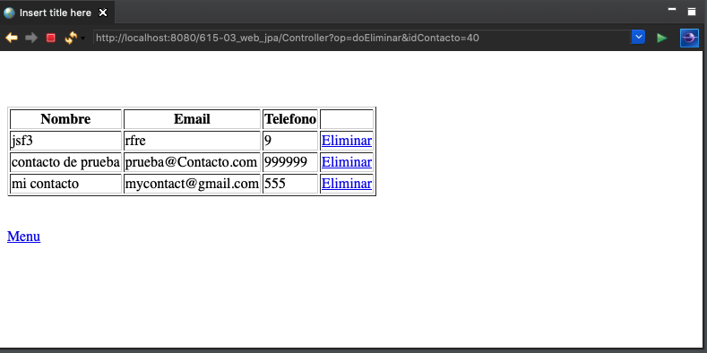

Tenemos la Capa de Lógica de Negocio implementada con clases estándares y estábamos utilizando el motor Eclipse. Vamos a migrar esta aplicación a Hibernate vamos a utilizar el motor Hibernate, entonces vamos a crear una copia del proyecto `615-03_web_jpa` y la vamos a pegar con el nombre `615-12_agenda_motor_hibernate`.

Vamos a cambiar el nombre en:

* Web Project Settings
* `pom.xml`
* `persistence.xml`
* `GestionContactos`
* `GestionUsuarios`

Una vez que hayamos hecho los cambios ya tenemos nuestro nuevo proyecto `615-12_agenda_motor_hibernate`

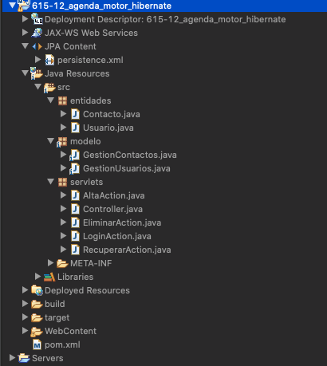

Si lo probamos todo funciona como el original.

Este es un proyecto Web, con JPA que utiliza EclipseLink, se ejecuta en Tomcat y no usa EJB.

Para la nueva configuración que vamos a usar con Hibernate necesitamos hacer algunos cambios.

#### 0. Dejar de usar el Motor EclipseLink.

Vamos a las propiedades del proyecto y en JPA, en su momento utilizamos EclipseLink 

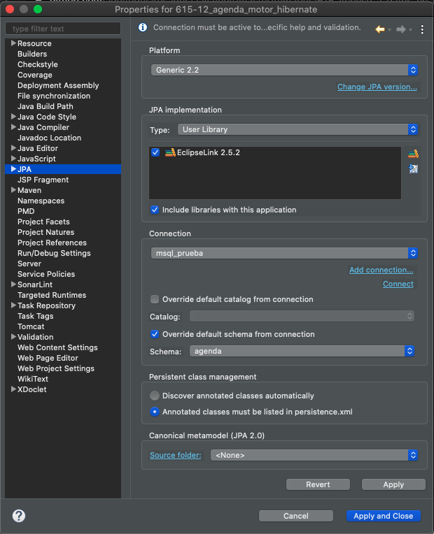

pero ahora ya no queremos utilizar ese motor, no queremos que se incorporen esas librerías simplemente, entonces si no vamos a utilizar ni EclipseLink ni tampoco las librerías del motor de GlassFish lo que hacemos es desactivar las Library Configuration.

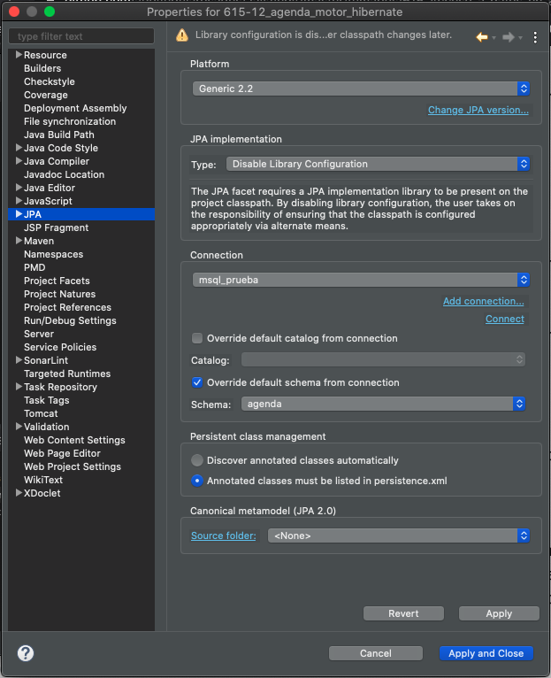

Pulsamos el botón OK y ahora ya vamos a seguir los pasos que hemos visto en la presentación.

Al hacer esto se nos presentan una serie de errores en las clases de entidades y modelo de nuestro proyecto sobre todo en el uso de las anotaciones por que ya no estamos usando ningún motor de persistencia.

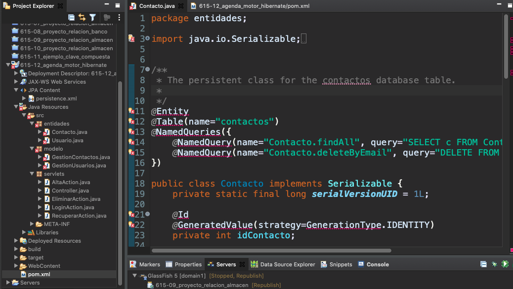

#### 1. Añadir Motor Hibernate en `pom.xml`

Vamos a añadir la dependecia `hibernate-core` correspondiente a la librería del motor Hibernate en nuestro archivo `pom.xml`.

```html
<!-- https://mvnrepository.com/artifact/org.hibernate/hibernate-core -->
<dependency>
   <groupId>org.hibernate</groupId>
   <artifactId>hibernate-core</artifactId>
   <version>5.4.18.Final</version>
</dependency>
```

Esto ya hará que se incorpore el motor de Hibernate que son varios Jars dentro de nuestro proyecto al guardar se descargan, vamos a ver la pestaña dependencias.

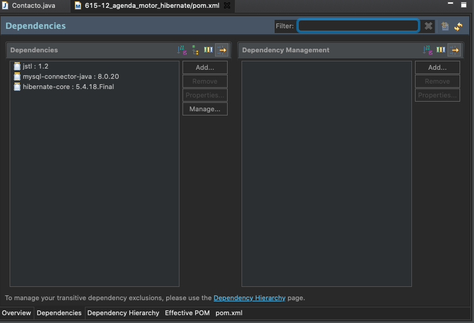

Se ha creado ademas de las dependencias que ya teníamos la dependencia `hibernate-core` y si te fijas en esta pestaña `Dependency Hierarchy` la dependencia `hibernate-core` depende de otros muchas.

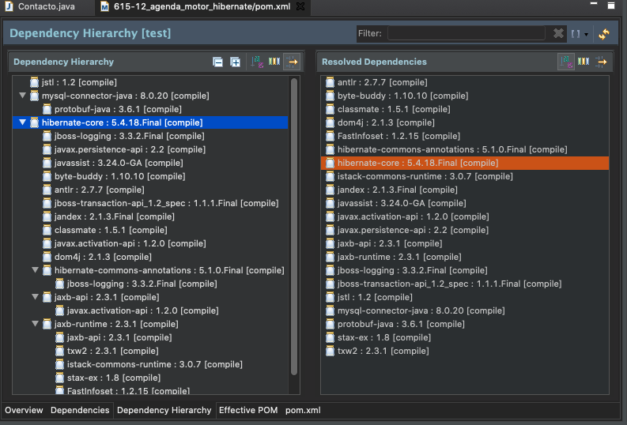

Realmente son todas las librerías que se han incluido y gracias a MAVEN no hemos tenido que ir incluyéndolas nosotros una por una.

Si en en alguna ocación por cualquier cosa en Eclipse no aparecen las dependencias Maven podemos dar en Maven - Update Project para que actualice las dependencias del proyecto y esto recargara todas las dependencias Maven dentro del proyecto.

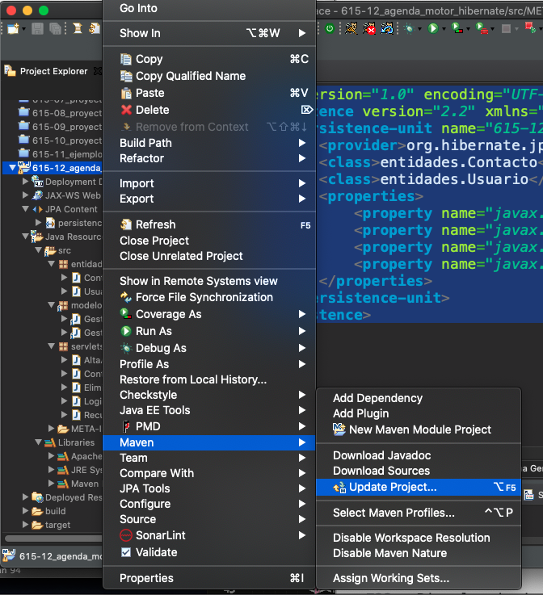

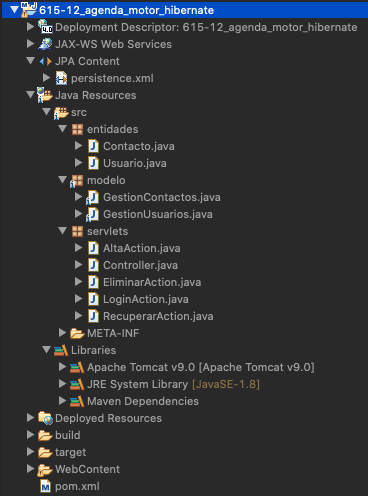

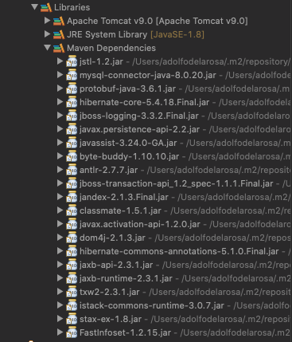

#### 2. Registrar el Motor Hibernate en `persistence.xml`

Bien lo siguiente era registrar el motor de Hibernate en `persistence.xml` es decir la etiqueta `provider`:

`<provider>org.hibernate.jpa.HibernatePersistenceProvider</provider>`

Los datos de conexión a la base de datos no cambian, es decir a pesar de que estemos utilizando este motor hay que proporcionarle igualmente las propiedades de conexión a la base de datos y esas `property` y los `name` de esas propiedades.

Sí es cierto que el motor Hibernate tiene unos nombres de propiedades que son equivalentes a estas pero estos son también nombres estandarizados de JPA que podremos utilizarlos igual puesto que como te digo el motor de Hibernate es compatible con JPA.

Bueno pues nada más el código de `persistence.xml` queda así:

```html
<?xml version="1.0" encoding="UTF-8"?>
<persistence version="2.2" xmlns="http://xmlns.jcp.org/xml/ns/persistence" xmlns:xsi="http://www.w3.org/2001/XMLSchema-instance" xsi:schemaLocation="http://xmlns.jcp.org/xml/ns/persistence http://xmlns.jcp.org/xml/ns/persistence/persistence_2_2.xsd">
	<persistence-unit name="615-12_agenda_motor_hibernate" transaction-type="RESOURCE_LOCAL">
		<provider>org.hibernate.jpa.HibernatePersistenceProvider</provider>
		<class>entidades.Contacto</class>
		<class>entidades.Usuario</class>
		<properties>
			<property name="javax.persistence.jdbc.url" value="jdbc:mysql://localhost:3306/agenda"/>
			<property name="javax.persistence.jdbc.user" value="root"/>
			<property name="javax.persistence.jdbc.password" value="root"/>
			<property name="javax.persistence.jdbc.driver" value="com.mysql.jdbc.Driver"/>
		</properties>
	</persistence-unit>
</persistence>
```

#### 3. Probar la Aplicación

Si ejecutamos la aplicación tiene que seguir funcionando exactamente igual que funcionaba antes puesto que es el motor Hibernate es compatible con JPA.

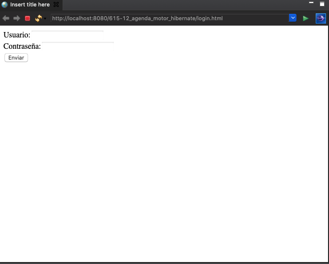

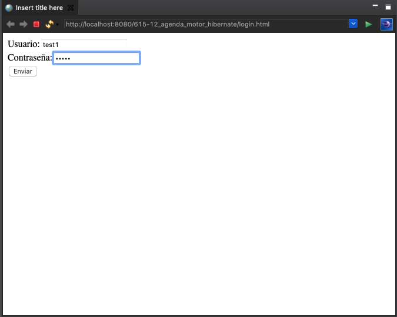

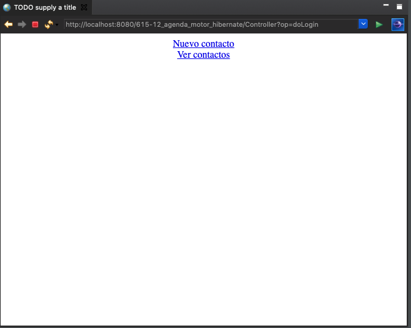

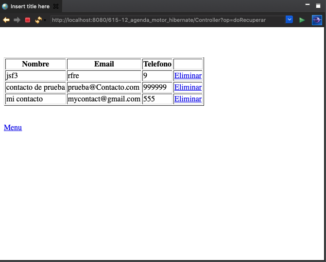

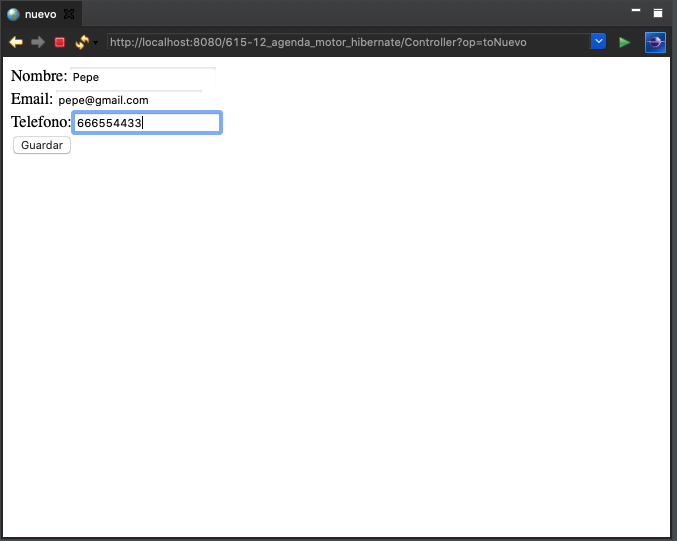

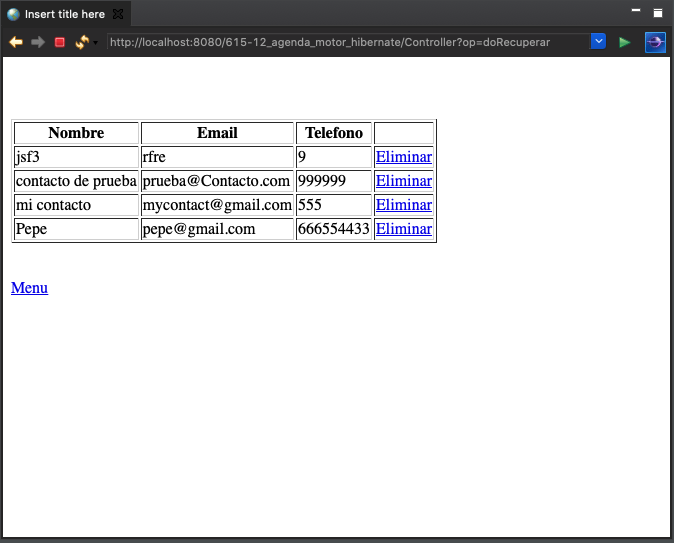

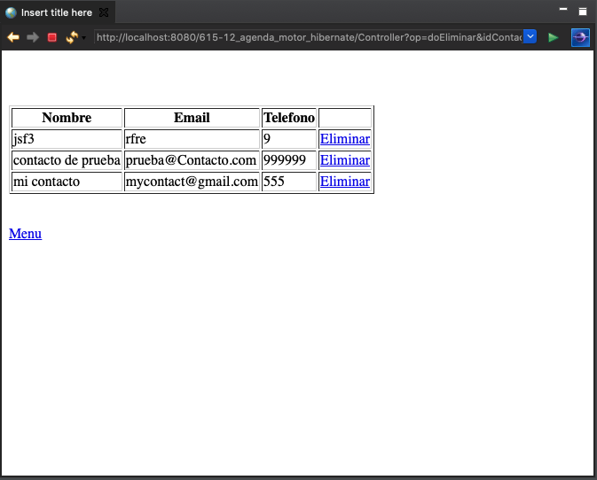

Hemos comprobado que el funcionamiento es exactamente el mismo. Nos autenticamos, vamos al menú, vemos nuestra lista de contactos, vemos que podemos añadir un nuevo contacto y por supuesto nos dejará eliminar tambien es decir que independientemente del motor utilizado JPA es el mismo en todos los casos y esta combinación JPA - Hibernate, motor Hibernate es muy utilizada en muchos de los desarrollos de aplicaciones empresariales.

### :computer: Código Completo - 615-12_agenda_motor_hibernate

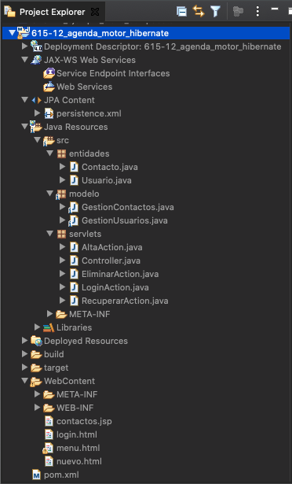

*`pom.xml`* Modificado

```html
<project xmlns="http://maven.apache.org/POM/4.0.0"
	xmlns:xsi="http://www.w3.org/2001/XMLSchema-instance"
	xsi:schemaLocation="http://maven.apache.org/POM/4.0.0 https://maven.apache.org/xsd/maven-4.0.0.xsd">
	<modelVersion>4.0.0</modelVersion>
	<groupId>615-12_agenda_motor_hibernate</groupId>
	<artifactId>615-12_agenda_motor_hibernate</artifactId>
	<version>0.0.1-SNAPSHOT</version>
	<packaging>war</packaging>
	<build>
		<sourceDirectory>src</sourceDirectory>
		<resources>
			<resource>
				<directory>src</directory>
				<excludes>
					<exclude>**/*.java</exclude>
				</excludes>
			</resource>
		</resources>
		<plugins>
			<plugin>
				<artifactId>maven-compiler-plugin</artifactId>
				<version>3.8.0</version>
				<configuration>
					<source>1.8</source>
					<target>1.8</target>
				</configuration>
			</plugin>
			<plugin>
				<artifactId>maven-war-plugin</artifactId>
				<version>3.2.3</version>
				<configuration>
					<warSourceDirectory>WebContent</warSourceDirectory>
				</configuration>
			</plugin>
		</plugins>
	</build>
	<dependencies>
		<!-- https://mvnrepository.com/artifact/javax.servlet/jstl -->
		<dependency>
			<groupId>javax.servlet</groupId>
			<artifactId>jstl</artifactId>
			<version>1.2</version>
		</dependency>
		<!-- https://mvnrepository.com/artifact/mysql/mysql-connector-java -->
		<dependency>
			<groupId>mysql</groupId>
			<artifactId>mysql-connector-java</artifactId>
			<version>8.0.20</version>
		</dependency>
		<!-- https://mvnrepository.com/artifact/org.hibernate/hibernate-core -->
		<dependency>
			<groupId>org.hibernate</groupId>
			<artifactId>hibernate-core</artifactId>
			<version>5.4.18.Final</version>
		</dependency>
	</dependencies>
</project>
```

*`persistence.xml`* Modificado

```html
<?xml version="1.0" encoding="UTF-8"?>
<persistence version="2.2" xmlns="http://xmlns.jcp.org/xml/ns/persistence" xmlns:xsi="http://www.w3.org/2001/XMLSchema-instance" xsi:schemaLocation="http://xmlns.jcp.org/xml/ns/persistence http://xmlns.jcp.org/xml/ns/persistence/persistence_2_2.xsd">
	<persistence-unit name="615-12_agenda_motor_hibernate" transaction-type="RESOURCE_LOCAL">
		<provider>org.hibernate.jpa.HibernatePersistenceProvider</provider>
		<class>entidades.Contacto</class>
		<class>entidades.Usuario</class>
		<properties>
			<property name="javax.persistence.jdbc.url" value="jdbc:mysql://localhost:3306/agenda"/>
			<property name="javax.persistence.jdbc.user" value="root"/>
			<property name="javax.persistence.jdbc.password" value="root"/>
			<property name="javax.persistence.jdbc.driver" value="com.mysql.jdbc.Driver"/>
		</properties>
	</persistence-unit>
</persistence>
```

**Entidades**

*`Contacto`*

```java
package entidades;

import java.io.Serializable;
import javax.persistence.*;


/**
 * The persistent class for the contactos database table.
 * 
 */
@Entity
@Table(name="contactos")
@NamedQueries({
	@NamedQuery(name="Contacto.findAll", query="SELECT c FROM Contacto c"),
	@NamedQuery(name="Contacto.deleteByEmail", query="DELETE FROM Contacto c WHERE c.email=?1")
})

public class Contacto implements Serializable {
	private static final long serialVersionUID = 1L;

	@Id
	@GeneratedValue(strategy=GenerationType.IDENTITY)
	private int idContacto;

	private String email;

	private String nombre;

	private int telefono;

	public Contacto() {
	}

	public Contacto(String email, String nombre, int telefono) {
		super();
		this.email = email;
		this.nombre = nombre;
		this.telefono = telefono;
	}

	public Contacto(int idContacto, String email, String nombre, int telefono) {
		super();
		this.idContacto = idContacto;
		this.email = email;
		this.nombre = nombre;
		this.telefono = telefono;
	}

	public int getIdContacto() {
		return this.idContacto;
	}

	public void setIdContacto(int idContacto) {
		this.idContacto = idContacto;
	}

	public String getEmail() {
		return this.email;
	}

	public void setEmail(String email) {
		this.email = email;
	}

	public String getNombre() {
		return this.nombre;
	}

	public void setNombre(String nombre) {
		this.nombre = nombre;
	}

	public int getTelefono() {
		return this.telefono;
	}

	public void setTelefono(int telefono) {
		this.telefono = telefono;
	}

}
```

*`Usuario`*

```java
package entidades;

import java.io.Serializable;
import javax.persistence.*;


/**
 * The persistent class for the usuarios database table.
 * 
 */
@Entity
@Table(name="usuarios")
@NamedQueries({
   @NamedQuery(name="Usuario.findAll", query="SELECT u FROM Usuario u"),
   @NamedQuery(name="Usuario.findByUserAndPwd", query="SELECT u FROM Usuario u Where u.usuario=?1 and u.password=?2")
})
public class Usuario implements Serializable {
	private static final long serialVersionUID = 1L;

	@Id
	@GeneratedValue(strategy=GenerationType.IDENTITY)
	private int idUsuario;

	private String password;

	private String usuario;

	public Usuario() {
	}

	public int getIdUsuario() {
		return this.idUsuario;
	}

	public void setIdUsuario(int idUsuario) {
		this.idUsuario = idUsuario;
	}

	public String getPassword() {
		return this.password;
	}

	public void setPassword(String password) {
		this.password = password;
	}

	public String getUsuario() {
		return this.usuario;
	}

	public void setUsuario(String usuario) {
		this.usuario = usuario;
	}

}
```

**Modelo**

*`Gestioncontactos`* Modificado

```java
package modelo;

import java.util.List;

import javax.persistence.EntityManager;
import javax.persistence.EntityManagerFactory;
import javax.persistence.EntityTransaction;
import javax.persistence.Persistence;
import javax.persistence.Query;
import javax.persistence.TypedQuery;

import entidades.Contacto;

public class GestionContactos {
	
	//Método que permite obtener el objeto EntityManager
	private EntityManager getEntityManager() {
		EntityManagerFactory factory = Persistence.createEntityManagerFactory("615-12_agenda_motor_hibernate");
		return factory.createEntityManager();
	}
	
	public void altaContacto(String nombre, String email, int telefono) {
		Contacto c = new Contacto(email, nombre, telefono);
		EntityManager em = getEntityManager();
		
		//La operación la incluimos en una transacción
		EntityTransaction tx = em.getTransaction();
		tx.begin();
		em.persist(c);
		tx.commit();
	}

	public void altacontacto(Contacto c) {
		EntityManager em = getEntityManager();
		
		//La operación la incluimos en una transacción
		EntityTransaction tx = em.getTransaction();
		tx.begin();
		em.persist(c);
		tx.commit();
	}
	
	public void eliminarContacto(int idContacto) {
		EntityManager em = getEntityManager();
		
		Contacto c = em.find(Contacto.class, idContacto);
		EntityTransaction tx = em.getTransaction();
		//Si el contacto existe lo eliminamos
		tx.begin();
		if(c != null) {
		   em.remove(c);
		}
		tx.commit();	
	}
	
	public void eliminarContactosPorEmail(String email){
		EntityManager em=getEntityManager();
		Query qr=em.createNamedQuery("Contacto.deleteByEmail");
		qr.setParameter(1, email);
		EntityTransaction tx=em.getTransaction();
		tx.begin();
		qr.executeUpdate();
		tx.commit();
	}
	
	public List<Contacto> recuperarContactos(){
		EntityManager em = getEntityManager();
		/*Query qr = em.createQuery("Select c From Contacto c");
		return (List<Contacto>)qr.getResultList();*/
		TypedQuery<Contacto> qr = em.createQuery("Select c From Contacto c", Contacto.class);
		return qr.getResultList();
	}
	
	public Contacto buscarContactos(String email){
		EntityManager em = getEntityManager();
		
		String jpql = "Select c From Contacto c Where c.email = ?1";
		TypedQuery<Contacto> qr = em.createQuery(jpql, Contacto.class);
		qr.setParameter(1, email);
		//return qr.getSingleResult();
		return qr.getResultList().get(0);
	}
}
```

*`GestionUsuarios`* Modificado

```java
package modelo;

import javax.persistence.EntityManager;
import javax.persistence.EntityManagerFactory;
import javax.persistence.Persistence;
import javax.persistence.TypedQuery;

import entidades.Usuario;

public class GestionUsuarios {
	// método que permite obtener el objeto EntityManager
	private EntityManager getEntityManager() {
		EntityManagerFactory factory = Persistence.createEntityManagerFactory("615-12_agenda_motor_hibernate");
		return factory.createEntityManager();
	}

	public boolean autenticar(String usuario, String pwd) {
		EntityManager em = getEntityManager();
		boolean res = false;
		TypedQuery<Usuario> qr = em.createNamedQuery("Usuario.findByUserAndPwd", Usuario.class);
		qr.setParameter(1, usuario);
		qr.setParameter(2, pwd);
		try {
			qr.getSingleResult();
			res = true;
		} catch (Exception ex) {
			ex.printStackTrace();
		}
		return res;
	}

}
```

**Servlets**

*`Controller`*

```java
package servlets;

import java.io.IOException;
import javax.servlet.ServletException;
import javax.servlet.annotation.WebServlet;
import javax.servlet.http.HttpServlet;
import javax.servlet.http.HttpServletRequest;
import javax.servlet.http.HttpServletResponse;

/**
 * Servlet implementation class Controller
 */
@WebServlet("/Controller")
public class Controller extends HttpServlet {
	private static final long serialVersionUID = 1L;

	/**
	 * @see HttpServlet#service(HttpServletRequest request, HttpServletResponse
	 *      response)
	 */
	protected void service(HttpServletRequest request, HttpServletResponse response)
			throws ServletException, IOException {
		String op = request.getParameter("op");
		String url = "";
		switch (op) {
		case "doLogin":
			url = "LoginAction";
			break;
		case "doAlta":
			url = "AltaAction";
			break;
		case "doEliminar":
			url = "EliminarAction";
			break;
		case "doRecuperar":
			url = "RecuperarAction";
			break;
		case "toNuevo":
			url = "nuevo.html";
			break;
		case "toMenu":
			url = "menu.html";
			break;

		}
		request.getRequestDispatcher(url).forward(request, response);
	}

}
```

*`LoginAction`*

```java
package servlets;

import java.io.IOException;

import javax.servlet.ServletException;
import javax.servlet.annotation.WebServlet;
import javax.servlet.http.HttpServlet;
import javax.servlet.http.HttpServletRequest;
import javax.servlet.http.HttpServletResponse;
import javax.servlet.http.HttpSession;

import modelo.GestionUsuarios;

/**
 * Servlet implementation class LoginAction
 */
@WebServlet("/LoginAction")
public class LoginAction extends HttpServlet {
	private static final long serialVersionUID = 1L;

	/**
	 * @see HttpServlet#service(HttpServletRequest request, HttpServletResponse response)
	 */
	protected void service(HttpServletRequest request, HttpServletResponse response) throws ServletException, IOException {
		String user=request.getParameter("user");
		String pwd=request.getParameter("pwd");
		GestionUsuarios gusuarios=new GestionUsuarios();
		if(gusuarios.autenticar(user, pwd)){
			//guardamos el nombre de usuario en un atributo de sesión
			HttpSession s=request.getSession();
			s.setAttribute("user", user);
			request.getRequestDispatcher("menu.html").forward(request, response);
		}else{
			request.getRequestDispatcher("login.html").forward(request, response);
		}
	}

}
```

*`RecuperarAction`*

```java
package servlets;

import java.io.IOException;
import java.util.List;

import javax.servlet.ServletException;
import javax.servlet.annotation.WebServlet;
import javax.servlet.http.HttpServlet;
import javax.servlet.http.HttpServletRequest;
import javax.servlet.http.HttpServletResponse;

import entidades.Contacto;
import modelo.GestionContactos;

/**
 * Servlet implementation class RecuperarAction
 */
@WebServlet("/RecuperarAction")
public class RecuperarAction extends HttpServlet {
	private static final long serialVersionUID = 1L;

	/**
	 * @see HttpServlet#service(HttpServletRequest request, HttpServletResponse response)
	 */
	protected void service(HttpServletRequest request, HttpServletResponse response) throws ServletException, IOException {
		GestionContactos gcontactos=new GestionContactos();
		List<Contacto> contactos=gcontactos.recuperarContactos();
		//guardamos contactos en un atributo de petición
		request.setAttribute("contactos", contactos);
		//trasnferencia de la petición
		request.getRequestDispatcher("contactos.jsp").forward(request, response);
	}

}
```

*`EliminarAction`*

```java
package servlets;

import java.io.IOException;

import javax.servlet.ServletException;
import javax.servlet.annotation.WebServlet;
import javax.servlet.http.HttpServlet;
import javax.servlet.http.HttpServletRequest;
import javax.servlet.http.HttpServletResponse;

import modelo.GestionContactos;

/**
 * Servlet implementation class EliminaContacto
 */
@WebServlet("/EliminarAction")
public class EliminarAction extends HttpServlet {
	private static final long serialVersionUID = 1L;

	/**
	 * @see HttpServlet#service(HttpServletRequest request, HttpServletResponse response)
	 */
	protected void service(HttpServletRequest request, HttpServletResponse response) throws ServletException, IOException {
		int idContacto=Integer.parseInt(request.getParameter("idContacto"));
		GestionContactos gcontactos=new GestionContactos();
		gcontactos.eliminarContacto(idContacto);
		request.getRequestDispatcher("RecuperarAction").forward(request, response);
	}

}
```

*`AltaAction`*

```java
package servlets;

import java.io.IOException;

import javax.servlet.ServletException;
import javax.servlet.annotation.WebServlet;
import javax.servlet.http.HttpServlet;
import javax.servlet.http.HttpServletRequest;
import javax.servlet.http.HttpServletResponse;

import modelo.GestionContactos;

/**
 * Servlet implementation class AltaContacto
 */
@WebServlet("/AltaAction")
public class AltaAction extends HttpServlet {
	private static final long serialVersionUID = 1L;

	/**
	 * @see HttpServlet#service(HttpServletRequest request, HttpServletResponse response)
	 */
	protected void service(HttpServletRequest request, HttpServletResponse response) throws ServletException, IOException {
		String nombre=request.getParameter("nombre");
		String email=request.getParameter("email");
		int telefono=Integer.parseInt(request.getParameter("telefono"));
		//creamos un objeto de la capa de lógica de negocio
		//y llamamos al método encargado de hacer el alta
		GestionContactos gcontactos=new GestionContactos();
		gcontactos.altaContacto(nombre,email,telefono);
		request.getRequestDispatcher("menu.html").forward(request, response);
	}

}
```

**Vista**

*`login`*

```html
<!DOCTYPE html>
<html>
<head>
<meta charset="ISO-8859-1">
<title>Insert title here</title>
</head>
<body>
	<form action="Controller?op=doLogin" method="post">
		Usuario:<input type="text" name="user"/><br/>
		Contraseña:<input type="password" name="pwd"/><br/>
		<input type="submit" value="Enviar"/>
	
	</form>
</body>
</html>
```

*`menu`*

```html
<!DOCTYPE html>
<!--
To change this license header, choose License Headers in Project Properties.
To change this template file, choose Tools | Templates
and open the template in the editor.
-->
<html>
    <head>
        <title>TODO supply a title</title>
        <meta charset="UTF-8">
        <meta name="viewport" content="width=device-width, initial-scale=1.0">
    </head>
    <body>
    <center>
        <a href="Controller?op=toNuevo">Nuevo contacto</a><br/>
        <a href="Controller?op=doRecuperar">Ver contactos</a><br/>
    </center>
    </body>
</html>
```

*`contactos`*

```html
<%@ page language="java" contentType="text/html; charset=ISO-8859-1"
    pageEncoding="ISO-8859-1" import="modelo.GestionContactos,java.util.ArrayList,entidades.Contacto"%>

<%@taglib uri="http://java.sun.com/jsp/jstl/core" prefix="c" %>    
<!DOCTYPE html PUBLIC "-//W3C//DTD HTML 4.01 Transitional//EN" "http://www.w3.org/TR/html4/loose.dtd">
<html>
<head>
<meta http-equiv="Content-Type" content="text/html; charset=ISO-8859-1">
<title>Insert title here</title>
</head>
<body>
	
	<c:set var="contactos" value="${requestScope.contactos}"/>
	
	<br/><br/><br/>
	
	<c:choose>
	
		<c:when test="${!empty contactos}">
	
			<table border="1">
						<tr>
							<th>Nombre</th>
							<th>Email </th>
							<th>Telefono</th>
							<th></th>
						</tr>
						
						<c:forEach var="cont" items="${contactos}">
							<tr><td>${cont.nombre}</td>
							<td>${cont.email}</td>
							<td>${cont.telefono}</td>
							<td><a href="Controller?op=doEliminar&idContacto=${cont.idContacto}">Eliminar</a></td></tr>
						
						
						</c:forEach>
						
						
						
			</table>
		</c:when>
		<c:otherwise>
			<h1>No hay contactos</h1>
		</c:otherwise>
	</c:choose>
	<br/>
	<br/>
	<a href="Controller?op=toMenu">Menu</a>
</body>
</html>
```

*`nuevo`*

```html
<!DOCTYPE HTML PUBLIC "-//W3C//DTD HTML 4.01 Transitional//EN">
<html>
<head>
<title>nuevo</title>
<meta http-equiv="Content-Type" content="text/html; charset=ISO-8859-1">
<script type="text/javascript">
 	function comprobar(){ 	
 		if(document.getElementById("nombre").value==""||
 			document.getElementById("email").value==""||
 			document.getElementById("edad").value==""){
 				alert("faltan datos");
 			return false;
 		}
 		else{
 			return true;
 		}
 		
 	}
        function comprobarEdad(){
            if(isNaN(document.getElementById("edad").value)){
                alert("Edad debe ser numérico");
                document.getElementById("edad").value="";
            }
        }
</script>
</head>
<body>
<form action="Controller?op=doAlta" method="post" onsubmit="return comprobar();">
	Nombre:<input id="nombre" type="text" name="nombre"/>
	<br/>
	Email:<input id="email" type="text" name="email"/>
	<br/>
        Telefono:<input id="edad" onblur="comprobarEdad();" type="text" name="telefono"/>
	<br/>
	<input type="submit" value="Guardar"/>
</form>
</body>
</html>
```

# 31 Carga de datos en modo lazy con Hibernate 04:57


Después de ver cómo utilizar el motor de Hibernate en una aplicación JPA en la que hemos utilizado una única entidad vamos a ver qué ocurriría cuando trabajamos con entidades relacionadas. Dónde como sabes al cargar una entidad se cargan también los datos relacionados de las entidades relacionadas que pueden ser en modo Lazy o en modo Eager. 

Cuando el modo predeterminado de cargar datos es Lazy se produce un problema que vamos a analizar a continuación.


Vamos a centrarnos por ejemplo en uno de los casos de ejemplos que hemos estado viendo donde teníamos una aplicación en la que se trabajaba con Secciones a las que se les relacionaba Productos. Al recuperar un objeto `Seccion` de la tabla secciones como las entidades estaban relacionadas recuperábamos también la lista de productos asociados.

Por ejemplo aquí tenemos la instrucción 

`Seccion s = em.find(Seccion.class, idSecc);`

Através del EntityManager llamamos al método `find` le indicamos por ejemplo para localizarlo por identificador de sección, pero podría haberse utilizado también con queries, el caso es que obtenemos el objeto `Seccion` y con él los objetos relacionados.

Pero cuando la carga es Lazy sabemos que esos datos no se obtienen en la misma consulta sino que para ganar eficiencia y menor consumo de memoria solamente se obtiene el objeto principal.

Esa es la carga Lazy de datos que es la carga predeterminada además de los motores de persistencia y concretamente en el caso de Hibernate es así. Pero qué ocurre con Hibernate. Pues que al hacer la búsqueda de ese objeto Seccion se cierra una sesión interna que utiliza Hibernate para manejar los datos, de la base de datos de modo que al intentar después a través de ese objeto sección obtener los productos

`s.getProductos();`

como la sesión se ha cerrado se produce una clásica sección llamada `LazyInitializationException` 

Cómo se soluciona esto. 

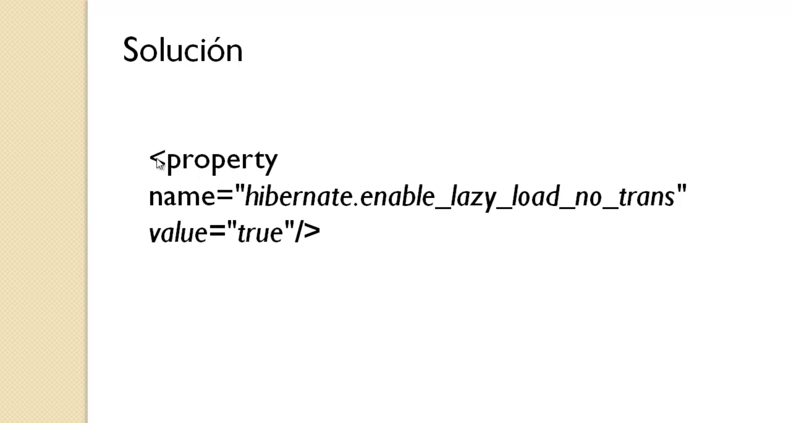

La solucion del problema es muy simple, en el `persistence.xml` simplemente tenemos que añadir esta propiedad.

<property name="hibernate.enable_lazy_load_no_trans" value="true" />

La propiedad para que la sesión no se cierre durante la carga de la entidad principal.

### Creación Proyecto Eclipse

Vamos a ver esto con un ejemplo nos vamos a basar en el proyecto `615-10_proyecto_relacion_almacen` que hace lo siguiente:

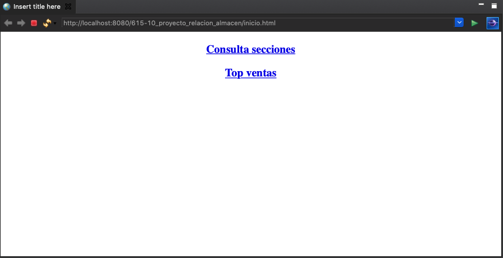

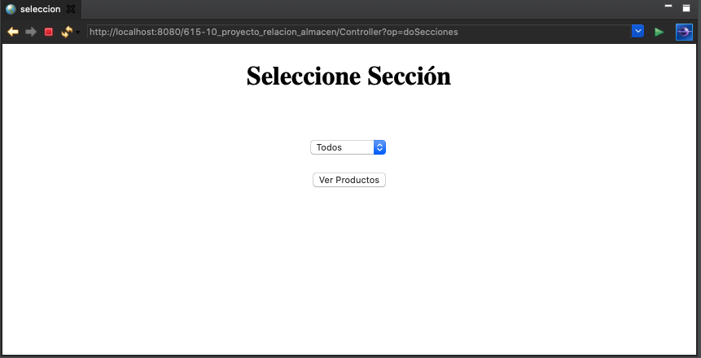

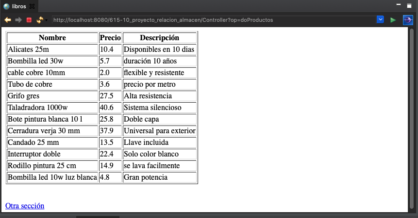

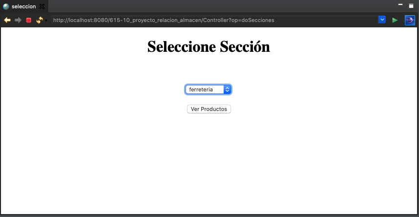

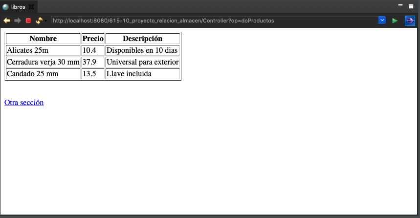

Vamos a duplicar el proyecto `615-10_proyecto_relacion_almacen` con el nombre `615-13_proyecto_relacion_almacen_hibernate`

Vamos a cambiar el nombre en:

* Web Project Settings
* `pom.xml`
* `persistence.xml`
* `GestionProductosEjb`

Una vez que hayamos hecho los cambios ya tenemos nuestro nuevo proyecto `615-13_proyecto_relacion_almacen_hibernate`

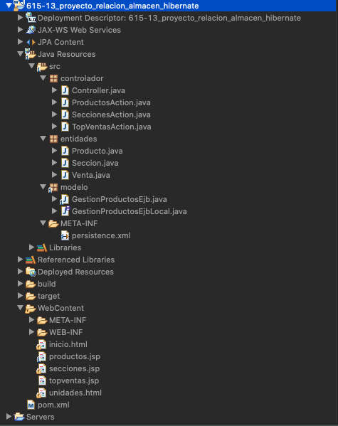

Si lo probamos todo funciona como el original.

Este es un proyecto Web, con JPA que utiliza EclipseLink, se ejecuta en GlassFish por usar EJB.

Para la nueva configuración que vamos a usar con Hibernate necesitamos hacer algunos cambios.

#### 0. Dejar de usar el Motor EclipseLink.

Vamos a las propiedades del proyecto y en JPA utilizamos EclipseLink que es suficiente para JPA.

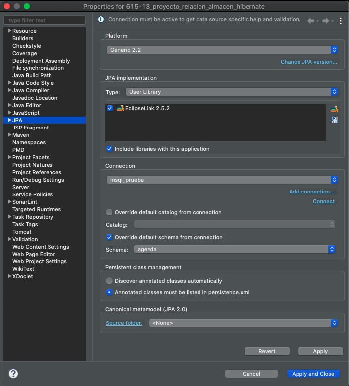

Pero ahora ya no queremos utilizar ese motor, no queremos que se incorporen esas librerías, entonces si no vamos a utilizar ni EclipseLink ni tampoco las librerías del motor de GlassFish lo que hacemos es desactivar las Library Configuration.

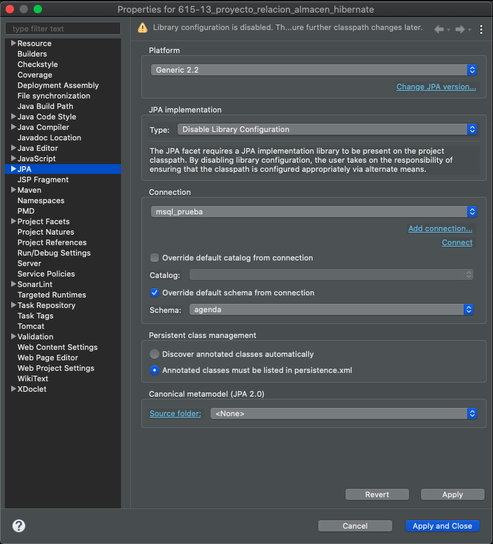

Pulsamos el botón OK y ahora ya vamos a seguir los pasos que hemos visto en la presentación y que hicimos también en la aplicación pasada.

En este caso no se se observan errores en las clases de entidades y modelo, raro.

#### 1. Añadir Motor Hibernate en `pom.xml`

Vamos a añadir la dependecia `hibernate-core` correspondiente a la librería del motor Hibernate en nuestro archivo `pom.xml`.

```html
<!-- https://mvnrepository.com/artifact/org.hibernate/hibernate-core -->
<dependency>
   <groupId>org.hibernate</groupId>
   <artifactId>hibernate-core</artifactId>
   <version>5.4.18.Final</version>
</dependency>
```

Esto ya hará que se incorpore el motor de Hibernate.

#### 2. Registrar el Motor Hibernate en `persistence.xml`

Bien lo siguiente era registrar el motor de Hibernate en `persistence.xml` es decir la etiqueta `provider`:

`<provider>org.hibernate.jpa.HibernatePersistenceProvider</provider>`

Los datos de conexión a la base de datos no cambian aquí lo estamos haciendo por medio de JNDI, a pesar de que estemos utilizando el motor Hibernate hay que proporcionarle igualmente las propiedades de conexión a la base de datos.

El código de `persistence.xml` queda así:

```html
<?xml version="1.0" encoding="UTF-8"?>
<persistence version="2.2"
	xmlns="http://xmlns.jcp.org/xml/ns/persistence"
	xmlns:xsi="http://www.w3.org/2001/XMLSchema-instance"
	xsi:schemaLocation="http://xmlns.jcp.org/xml/ns/persistence http://xmlns.jcp.org/xml/ns/persistence/persistence_2_2.xsd">
	<persistence-unit
		name="615-13_proyecto_relacion_almacen_hibernate">
		<provider>org.hibernate.jpa.HibernatePersistenceProvider</provider>
		<jta-data-source>jdbc/almacends</jta-data-source>
		<class>entidades.Producto</class>
		<class>entidades.Seccion</class>
		<class>entidades.Venta</class>
	</persistence-unit>
</persistence>
```

#### 3. Probar la Aplicación

Si ejecutamos la aplicación tiene que seguir funcionando exactamente igual que funcionaba antes puesto que es el motor Hibernate es compatible con JPA.

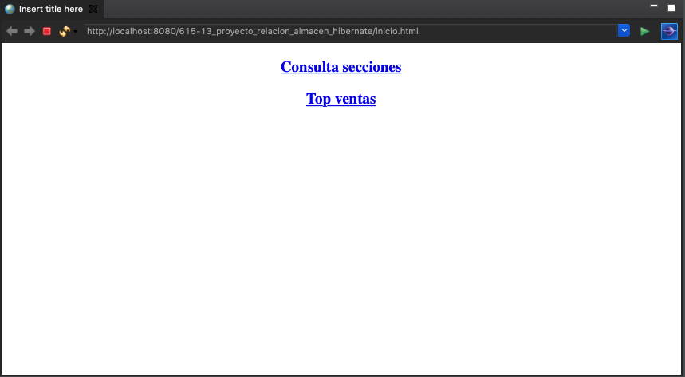

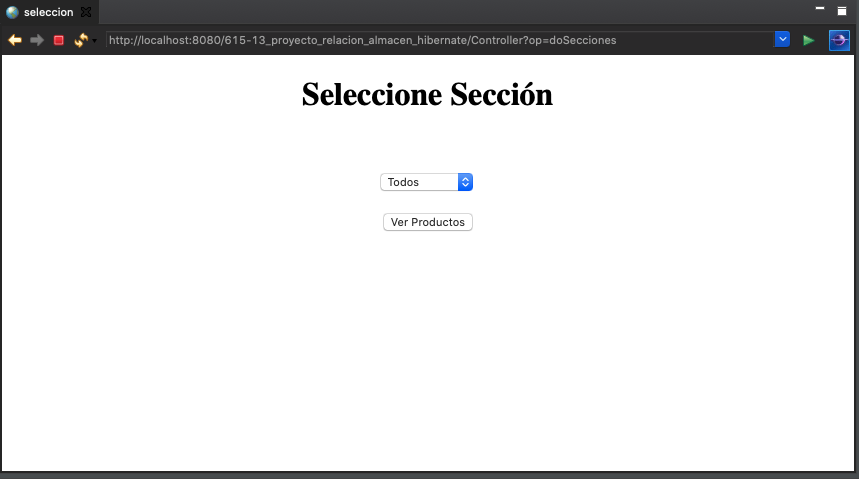

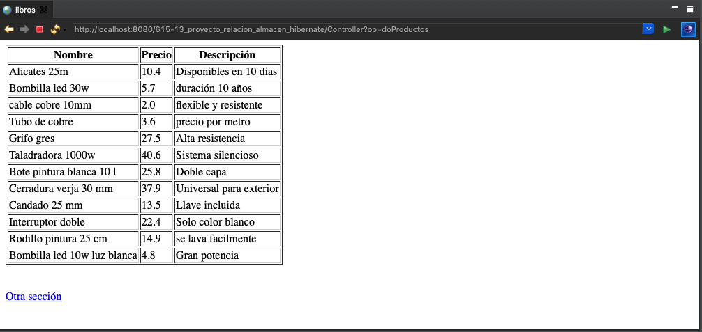

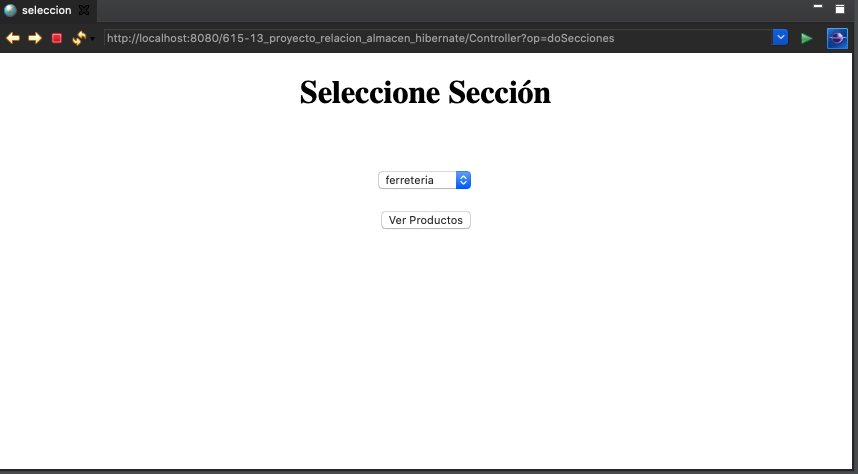

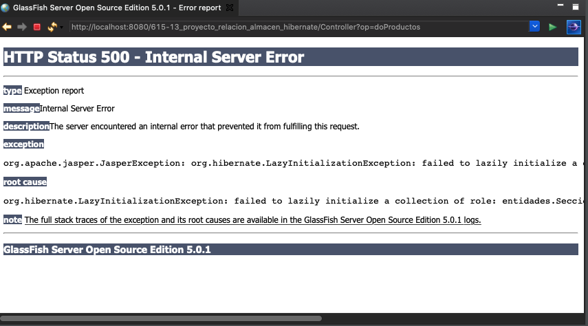

Al probar la aplicación ya usando el motor Hibernate vemos que aparentemente todo funciona igual hasta que seleccionamos una sección e intentamos recuperar sus productos nos provoca un error.

`org.apache.jasper.JasperException: org.hibernate.LazyInitializationException: failed to lazily initialize a collection of role: entidades.Seccion.productos, could not initialize proxy - no Session`

Obtenemos la excepción de la que estabamos hablando `org.hibernate.LazyInitializationException` por utilizar el motor de Hibernate. 

Lo que sucede es que en `GestionProductoEjb` se ejecuta el método `obtenerProductosPorSeccion`

```java
@Override
public List<Producto> obtenerProductosPorSeccion(int idSecc){
   //String jpql = "Select p From Producto p Where p.idSeccion=" + idSecc;
   Seccion s=em.find(Seccion.class, idSecc);
   return s.getProductos();		
}
```

Recuperamos la Seccion através de su `idSecc` y luego llamamos a `s.getProductos()` para recuperar los productos asociados con una carga Lazy con lo que se han cargado esos productos al recuperar la sección sino que se hace o se intenta hacer mejor dicho en este momento, la sesión ya se ha cerrado y se produce la `org.hibernate.LazyInitializationException` que hemos visto.

La solución como digo es irnos al `persistence.xml` y añadir esta propiedad 

`<property name="hibernate.enable_lazy_load_no_trans" value="true" />`

Y ya con esto habilitamos Hibernate para que no cierre las sesiones cuando tiene la entidad principal. Guardamos y si volvemos a ejecutar veremos que el problema ya se ha solucionado.

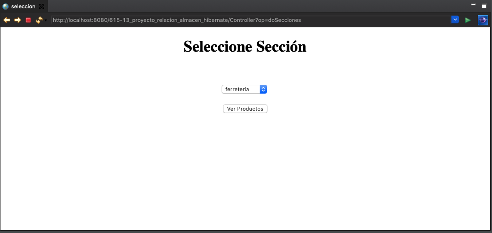

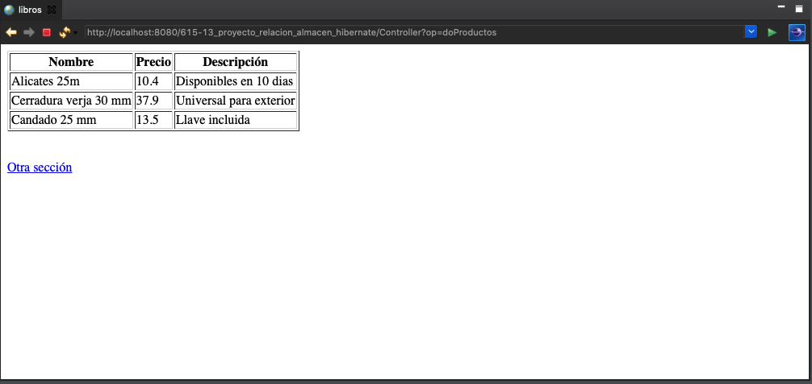

Ahora ya el problema ha quedado resuelto.

### :computer: Código Completo - 615-13_proyecto_relacion_almacen_hibernate

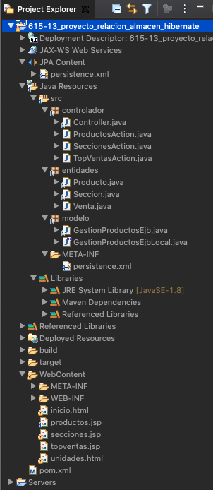

*`pom.xml`*

```html
<project xmlns="http://maven.apache.org/POM/4.0.0"
	xmlns:xsi="http://www.w3.org/2001/XMLSchema-instance"
	xsi:schemaLocation="http://maven.apache.org/POM/4.0.0 https://maven.apache.org/xsd/maven-4.0.0.xsd">
	<modelVersion>4.0.0</modelVersion>
	<groupId>615-13_proyecto_relacion_almacen_hibernate</groupId>
	<artifactId>615-13_proyecto_relacion_almacen_hibernate</artifactId>
	<version>0.0.1-SNAPSHOT</version>
	<packaging>war</packaging>
	<build>
		<sourceDirectory>src</sourceDirectory>
		<resources>
			<resource>
				<directory>src</directory>
				<excludes>
					<exclude>**/*.java</exclude>
				</excludes>
			</resource>
		</resources>
		<plugins>
			<plugin>
				<artifactId>maven-compiler-plugin</artifactId>
				<version>3.8.0</version>
				<configuration>
					<source>1.8</source>
					<target>1.8</target>
				</configuration>
			</plugin>
			<plugin>
				<artifactId>maven-war-plugin</artifactId>
				<version>3.2.3</version>
				<configuration>
					<warSourceDirectory>WebContent</warSourceDirectory>
				</configuration>
			</plugin>
		</plugins>
	</build>
	<dependencies>
		<!-- https://mvnrepository.com/artifact/javax.servlet/jstl -->
		<dependency>
			<groupId>javax.servlet</groupId>
			<artifactId>jstl</artifactId>
			<version>1.2</version>
		</dependency>
		<!-- https://mvnrepository.com/artifact/mysql/mysql-connector-java -->
		<dependency>
			<groupId>mysql</groupId>
			<artifactId>mysql-connector-java</artifactId>
			<version>8.0.20</version>
		</dependency>
		<!-- https://mvnrepository.com/artifact/org.hibernate/hibernate-core -->
		<dependency>
			<groupId>org.hibernate</groupId>
			<artifactId>hibernate-core</artifactId>
			<version>5.4.18.Final</version>
		</dependency>
	</dependencies>
</project>
```

*`persistence.xml`*

```html
<?xml version="1.0" encoding="UTF-8"?>
<persistence version="2.2"
	xmlns="http://xmlns.jcp.org/xml/ns/persistence"
	xmlns:xsi="http://www.w3.org/2001/XMLSchema-instance"
	xsi:schemaLocation="http://xmlns.jcp.org/xml/ns/persistence http://xmlns.jcp.org/xml/ns/persistence/persistence_2_2.xsd">
	<persistence-unit
		name="615-13_proyecto_relacion_almacen_hibernate">
		<provider>org.hibernate.jpa.HibernatePersistenceProvider</provider>
		<jta-data-source>jdbc/almacends</jta-data-source>
		<class>entidades.Producto</class>
		<class>entidades.Seccion</class>
		<class>entidades.Venta</class>
		<properties>
			<property name="hibernate.enable_lazy_load_no_trans" value="true" />
		</properties>
	</persistence-unit>
</persistence>
```

**Entidades**

*`Seccion`*

```java
package entidades;

import java.io.Serializable;
import javax.persistence.*;
import java.util.List;

/**
 * The persistent class for the secciones database table.
 * 
 */
@Entity
@Table(name = "secciones")
@NamedQuery(name = "Seccion.findAll", query = "SELECT s FROM Seccion s")
public class Seccion implements Serializable {
	private static final long serialVersionUID = 1L;

	@Id
	@GeneratedValue(strategy = GenerationType.IDENTITY)
	private int idSeccion;

	private String responsable;

	private String seccion;

	// bi-directional many-to-one association to Producto
	@OneToMany(mappedBy = "seccione", fetch=FetchType.LAZY)
	private List<Producto> productos;

	public Seccion() {
	}

	public int getIdSeccion() {
		return this.idSeccion;
	}

	public void setIdSeccion(int idSeccion) {
		this.idSeccion = idSeccion;
	}

	public String getResponsable() {
		return this.responsable;
	}

	public void setResponsable(String responsable) {
		this.responsable = responsable;
	}

	public String getSeccion() {
		return this.seccion;
	}

	public void setSeccion(String seccion) {
		this.seccion = seccion;
	}

	public List<Producto> getProductos() {
		return this.productos;
	}

	public void setProductos(List<Producto> productos) {
		this.productos = productos;
	}

	public Producto addProducto(Producto producto) {
		getProductos().add(producto);
		producto.setSeccione(this);

		return producto;
	}

	public Producto removeProducto(Producto producto) {
		getProductos().remove(producto);
		producto.setSeccione(null);

		return producto;
	}

}
```

*`Producto`*

```java
package entidades;

import java.io.Serializable;
import javax.persistence.*;
import java.util.List;


/**
 * The persistent class for the productos database table.
 * 
 */
@Entity
@Table(name="productos")
@NamedQuery(name="Producto.findAll", query="SELECT p FROM Producto p")
public class Producto implements Serializable {
	private static final long serialVersionUID = 1L;

	@Id
	@GeneratedValue(strategy=GenerationType.IDENTITY)
	private int idProducto;

	private String descripcion;

	private String nombre;

	private double precio;

	//bi-directional many-to-one association to Seccion
	@ManyToOne
	@JoinColumn(name="idSeccion")
	private Seccion seccione;

	//bi-directional many-to-one association to Venta
	@OneToMany(mappedBy="producto",cascade={CascadeType.REMOVE,CascadeType.MERGE})
	private List<Venta> ventas;

	public Producto() {
	}

	public int getIdProducto() {
		return this.idProducto;
	}

	public void setIdProducto(int idProducto) {
		this.idProducto = idProducto;
	}

	public String getDescripcion() {
		return this.descripcion;
	}

	public void setDescripcion(String descripcion) {
		this.descripcion = descripcion;
	}

	public String getNombre() {
		return this.nombre;
	}

	public void setNombre(String nombre) {
		this.nombre = nombre;
	}

	public double getPrecio() {
		return this.precio;
	}

	public void setPrecio(double precio) {
		this.precio = precio;
	}

	public Seccion getSeccione() {
		return this.seccione;
	}

	public void setSeccione(Seccion seccione) {
		this.seccione = seccione;
	}

	public List<Venta> getVentas() {
		return this.ventas;
	}

	public void setVentas(List<Venta> ventas) {
		this.ventas = ventas;
	}

	public Venta addVenta(Venta venta) {
		getVentas().add(venta);
		venta.setProducto(this);

		return venta;
	}

	public Venta removeVenta(Venta venta) {
		getVentas().remove(venta);
		venta.setProducto(null);

		return venta;
	}

}
```

*`Venta`*

```java
package entidades;

import java.io.Serializable;
import javax.persistence.*;


/**
 * The persistent class for the ventas database table.
 * 
 */
@Entity
@Table(name="ventas")
@NamedQuery(name="Venta.findAll", query="SELECT v FROM Venta v")
public class Venta implements Serializable {
	private static final long serialVersionUID = 1L;

	@Id
	@GeneratedValue(strategy=GenerationType.IDENTITY)
	private int idVenta;

	private String ciudad;

	private int unidades;

	//bi-directional many-to-one association to Producto
	@ManyToOne
	@JoinColumn(name="idProducto")
	private Producto producto;

	public Venta() {
	}

	public int getIdVenta() {
		return this.idVenta;
	}

	public void setIdVenta(int idVenta) {
		this.idVenta = idVenta;
	}

	public String getCiudad() {
		return this.ciudad;
	}

	public void setCiudad(String ciudad) {
		this.ciudad = ciudad;
	}

	public int getUnidades() {
		return this.unidades;
	}

	public void setUnidades(int unidades) {
		this.unidades = unidades;
	}

	public Producto getProducto() {
		return this.producto;
	}

	public void setProducto(Producto producto) {
		this.producto = producto;
	}

}
```

**Modelo**

*`GestionProductosEjbLocal`*

```java
package modelo;

import java.util.List;

import javax.ejb.Local;

import entidades.Producto;
import entidades.Seccion;

@Local
public interface GestionProductosEjbLocal {
	
	List<Seccion> obtenerSecciones();
	
	List<Producto> obtenerProductos();
	
	List<Producto> obtenerProductosPorSeccion(int idSecc);
	
	Seccion obtenerSeccionDeProducto(String prod);

	List<Producto> obtenerProductosVentas(int unidades);

}

```

*`GestionProductosEjb`*

```java
package modelo;

import java.util.List;

import javax.ejb.Stateless;
import javax.persistence.EntityManager;
import javax.persistence.PersistenceContext;
import javax.persistence.TypedQuery;

import entidades.Producto;
import entidades.Seccion;

/**
 * Session Bean implementation class GestionProductosEjb
 */
@Stateless
public class GestionProductosEjb implements GestionProductosEjbLocal {

	@PersistenceContext(unitName="615-13_proyecto_relacion_almacen_hibernate")
	EntityManager em;
	
	
	@Override
	public List<Seccion> obtenerSecciones(){
		TypedQuery<Seccion> q=em.createNamedQuery("Seccion.findAll",Seccion.class);
		return q.getResultList();
	}
	@Override
	public List<Producto> obtenerProductos(){
		TypedQuery<Producto> q=em.createNamedQuery("Producto.findAll",Producto.class);
		return q.getResultList();
	}
	@Override
	public List<Producto> obtenerProductosPorSeccion(int idSecc){
		//String jpql = "Select p From Producto p Where p.idSeccion=" + idSecc;
		Seccion s=em.find(Seccion.class, idSecc);
		return s.getProductos();		
	}

	@Override
	public Seccion obtenerSeccionDeProducto(String prod){
		
		String jpql="select p from Producto p where p.nombre=?1";
		TypedQuery<Producto> q=em.createQuery(jpql,Producto.class);
		q.setParameter(1, prod);
		return q.getSingleResult().getSeccione();
	}
	
	@Override
	public List<Producto> obtenerProductosVentas(int unidades){
		//opción 1 con join
		String jpql="select distinct(p) from Producto p join p.ventas v where v.unidades>?1";
		TypedQuery<Producto> q=em.createQuery(jpql,Producto.class);
		q.setParameter(1,unidades);
		return q.getResultList();
		
		//opción 2 sin join
		/*String jpql="select v from Venta v where v.unidades>?1";
		TypedQuery<Venta> q=em.createQuery(jpql,Venta.class);
		q.setParameter(1,unidades);
		List<Venta> ventas=q.getResultList();
		List<Producto> prods=new ArrayList<>();
		for(Venta v:ventas){
			prods.add(v.getProducto());
		}
		return prods;*/
	}
}
```

**Controlador**

*`Controller`*

```java
package controlador;

import java.io.IOException;
import javax.servlet.ServletException;
import javax.servlet.annotation.WebServlet;
import javax.servlet.http.HttpServlet;
import javax.servlet.http.HttpServletRequest;
import javax.servlet.http.HttpServletResponse;

/**
 * Servlet implementation class Controller
 */
@WebServlet("/Controller")
public class Controller extends HttpServlet {
	private static final long serialVersionUID = 1L;

	/**
	 * @see HttpServlet#service(HttpServletRequest request, HttpServletResponse response)
	 */
	protected void service(HttpServletRequest request, HttpServletResponse response) throws ServletException, IOException {
		
		String op=request.getParameter("op");
		String url="inicio.html";
		
		switch(op){
			case "doSecciones":
				url="SeccionesAction";	
				break;
			case "doProductos":
				url="ProductosAction";
				break;
			case "doTopVentas":
				url="TopVentasAction";
				break;
			case "toUnidades":
				url="unidades.html";
		}
		
		request.getRequestDispatcher(url).forward(request, response);
	}

}
```

*`SeccionesAction`*

```java
package controlador;

import java.io.IOException;
import java.util.List;

import javax.ejb.EJB;
import javax.servlet.ServletException;
import javax.servlet.annotation.WebServlet;
import javax.servlet.http.HttpServlet;
import javax.servlet.http.HttpServletRequest;
import javax.servlet.http.HttpServletResponse;

import entidades.Seccion;
import modelo.GestionProductosEjbLocal;

/**
 * Servlet implementation class SeccionesAction
 */
@WebServlet("/SeccionesAction")
public class SeccionesAction extends HttpServlet {
	private static final long serialVersionUID = 1L;

	@EJB
	GestionProductosEjbLocal gproductos;
	protected void service(HttpServletRequest request, HttpServletResponse response) throws ServletException, IOException {
		List<Seccion> secciones=gproductos.obtenerSecciones();
		request.setAttribute("secciones", secciones);
		request.getRequestDispatcher("secciones.jsp").forward(request, response);
	}

}
```

*`ProductosAction`*

```java
package controlador;

import java.io.IOException;

import javax.ejb.EJB;
import javax.servlet.ServletException;
import javax.servlet.annotation.WebServlet;
import javax.servlet.http.HttpServlet;
import javax.servlet.http.HttpServletRequest;
import javax.servlet.http.HttpServletResponse;

import modelo.GestionProductosEjbLocal;

/**
 * Servlet implementation class ProductosAction
 */
@WebServlet("/ProductosAction")
public class ProductosAction extends HttpServlet {
	private static final long serialVersionUID = 1L;

	@EJB
	GestionProductosEjbLocal gproductos;
	protected void service(HttpServletRequest request, HttpServletResponse response) throws ServletException, IOException {
		int idSeccion=Integer.parseInt(request.getParameter("seccion"));
		if(idSeccion==0){
			request.setAttribute("productos", gproductos.obtenerProductos());
		}else{
			request.setAttribute("productos", gproductos.obtenerProductosPorSeccion(idSeccion));
		}
		request.getRequestDispatcher("productos.jsp").forward(request, response);
	}

}
```

*`TopVentasAction`*

```java
package controlador;

import java.io.IOException;
import java.util.List;

import javax.ejb.EJB;
import javax.servlet.ServletException;
import javax.servlet.annotation.WebServlet;
import javax.servlet.http.HttpServlet;
import javax.servlet.http.HttpServletRequest;
import javax.servlet.http.HttpServletResponse;

import entidades.Producto;
import modelo.GestionProductosEjbLocal;

/**
 * Servlet implementation class TopVentasAction
 */
@WebServlet("/TopVentasAction")
public class TopVentasAction extends HttpServlet {
	private static final long serialVersionUID = 1L;

	@EJB
	GestionProductosEjbLocal gproductos;
	protected void service(HttpServletRequest request, HttpServletResponse response) throws ServletException, IOException {
		int unidades=Integer.parseInt(request.getParameter("unidades"));
		List<Producto> prods=gproductos.obtenerProductosVentas(unidades);
		request.setAttribute("productos", prods);
		request.getRequestDispatcher("topventas.jsp").forward(request, response);
	}

}
```

**Vista**

*`inicio`*

```html
<!DOCTYPE html>
<html>
<head>
<meta charset="UTF-8">
<title>Insert title here</title>
</head>
<body>
	<center>
		<h3><a href="Controller?op=doSecciones">Consulta secciones</a></h3>
		<h3><a href="Controller?op=toUnidades">Top ventas</a></h3>
	</center>
</body>
</html>
```

*`secciones.jsp`*

```html
<%@taglib uri="http://java.sun.com/jsp/jstl/core" prefix="c"%>
<!DOCTYPE html>
<html>
<head>
<title>seleccion</title>
<meta http-equiv="Content-Type" content="text/html;  charset=ISO-8859-1">
</head>
<body>
	<center>
		<h1>Seleccione Sección</h1>
		<br /><br />
		<form action="Controller?op=doProductos" method="post">
			<select name="seccion">
				<option value="0">Todos</option>
				<c:set var="sec" value="${requestScope.secciones}" />
				<c:forEach var="s" items="${sec}">
					<option value="${s.idSeccion}">${s.seccion}</option>
				</c:forEach>
			</select>
			<br /> <br /> 
			<input type="submit" value="Ver Productos" />
		</form>
	</center>
</body>
</html>
```

*`productos.jsp`*

```html
<%@taglib uri="http://java.sun.com/jsp/jstl/core" prefix="c"%>
<!DOCTYPE html>
<html>
<head>
<title>libros</title>
<meta http-equiv="Content-Type" content="text/html; charset=ISO-8859-1">
</head>
<body>
   <table border="1">
      <tr><th>Nombre</th><th>Precio</th><th>Descripción</th></tr>
      <c:set var="productos" value="${requestScope.productos}"/>
         <c:forEach var="pr" items="${productos}">
    	    <tr>
		       <td>${pr.nombre}</td>
		       <td>${pr.precio}</td>
		       <td>${pr.descripcion}</td>
			</tr>
    	 </c:forEach>
   </table>
   <br/><br/>
   <a href="Controller?op=doSecciones">Otra sección</a>
</body>
</html>
```

*`unidades.html`*

```html
<!DOCTYPE html>
<html>
<head>
<meta charset="ISO-8859-1">
<title>Insert title here</title>
</head>
<body>
	<center>
		<form action="Controller?op=doTopVentas" method="post">
			Unidades mínimas vendidas:<input type="number" name="unidades"/><br/><br/>
			<input type="submit" value="Enviar"/>
		</form>
	
	</center>
</body>
</html>
```

*`topventas.jsp`*

```html
<%@taglib uri="http://java.sun.com/jsp/jstl/core" prefix="c"%>
<!DOCTYPE HTML><%@page language="java"
	contentType="text/html; charset=ISO-8859-1" pageEncoding="ISO-8859-1"
	%>
<html>
<head>
<title>libros</title>
<meta http-equiv="Content-Type" content="text/html; charset=ISO-8859-1">
</head>
<body>
    


<table border="1">
    <tr><th>Nombre</th><th>Precio</th><th>Descripción</th></tr>
    		<c:set var="productos" value="${requestScope.productos}"/>
    		<c:forEach var="pr" items="${productos}">
    			<tr>
		              	<td>${pr.nombre}</td>
						<td>${pr.precio}</td>
						<td>${pr.descripcion}</td>
				</tr>
    		</c:forEach>
            
    


</table>
<br/><br/>
<a href="Controller?op=toInicio">Inicio</a>

</body>
</html>
```

# 32 Utilización del Framework de Hibernate 13:54

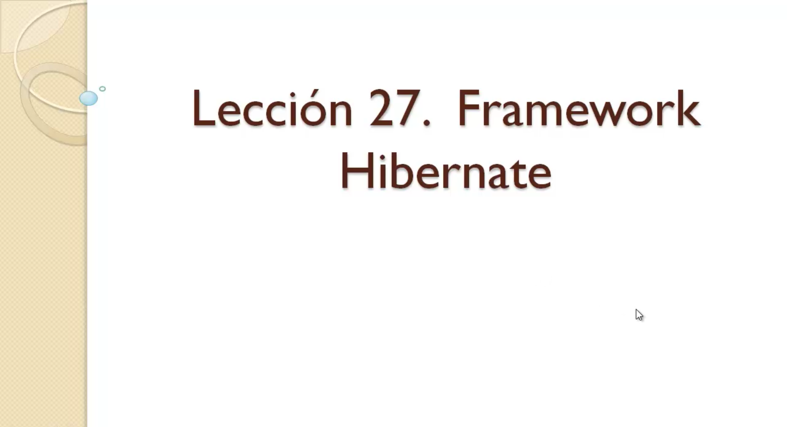

Ya hemos visto cómo utilizar el motor de Hibernate dentro de una Capa de Persistencia gestionada con JPA. Sin embargo Hibernate es un framework completo que proporciona todo lo necesario para utilizarlo por sí solo para la gestión y la utilización de una Capa de Persistencia en una aplicación.

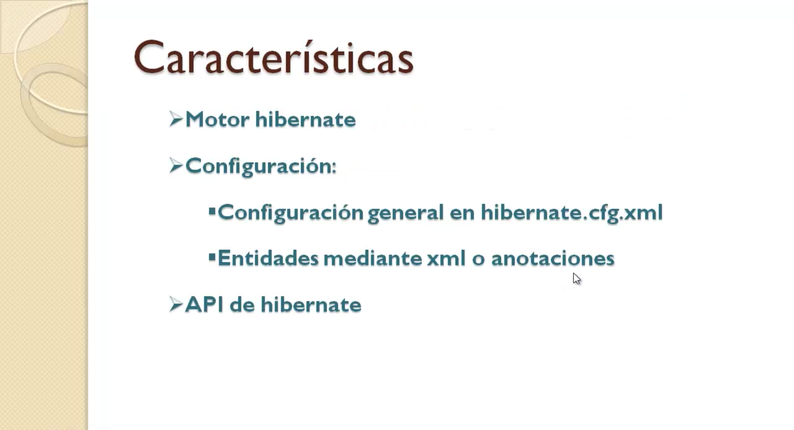

Esos componentes, son además del motor de Hibernate, un sistema de configuración podríamos decir hay un archivo de configuración general que se llama `hibernate.cfg.xml` donde es similar al `persistence.xml` pues se establecen todos los datos de conexión a la base de datos, lista de entidades.

En cuanto a la configuración de las entidades se puede hacer de dos maneras bien mediante XML o anotaciones. Si bien la primera opción es la clásica utilización de Hibernate desde las primeras versiones **está ya bastante obsoleta** y se tiende a utilizar anotaciones como hemos visto en JPA, y por supuesto cuenta también con un API, el **API de Hibernate**.

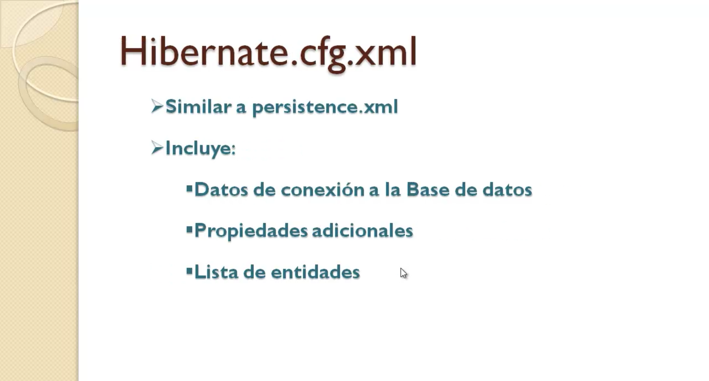

El `hibernate.cfg.xml` como decíamos antes es similar al `persistence.xml` y ahí vamos a incluir los datos de conexión a la base de datos, propiedades que necesite el motor para poder acceder a esa base de datos y gestionarla, así como la lista de entidades, lo que no vamos a incluir aquí obviamente es el motor de persistencia porque sólo puede ser el motor de Hibernate.

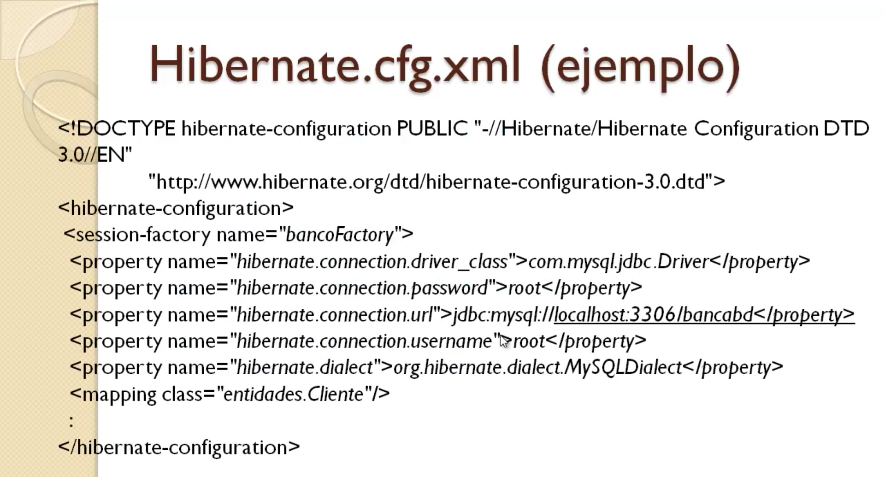

Aquí tenemos un ejemplo de cómo sería un `hibernate.cfg.xml`, como ves va a poder definir una unidad de persistencia como hace JPA. Aquí lo que se define es una `session-factory` una factoría de sesión, es el concepto similar y dentro de esa `session-factory` se establecen las propiedades y los respectivos valores, qué propiedades van a ser, el Driver  que vamos a utilizar, contraseña, URL o cadena de conexión, usuario y la ultima que no es obligatorio pero sí es conveniente que es el tipo de base datos `hibernate.dialect`, tipo de base datos con la que vamos a trabajar para que el motor optimice de alguna manera las consultas contradicha tipo de base de datos y a continuación con la etiqueta `mapping` la lista de entidades que van a formar parte de esa factoría de sesión, todo ello en un `hibernate-configuration`. 

En vez de utilizar datos de conexión se podría utilizar también un DataSource del servidor como se ha hecho con JPA, una propiedad como las anteriores pero para el DataSource contra la que pudiéramos tener configurado un servidor de base de datos.

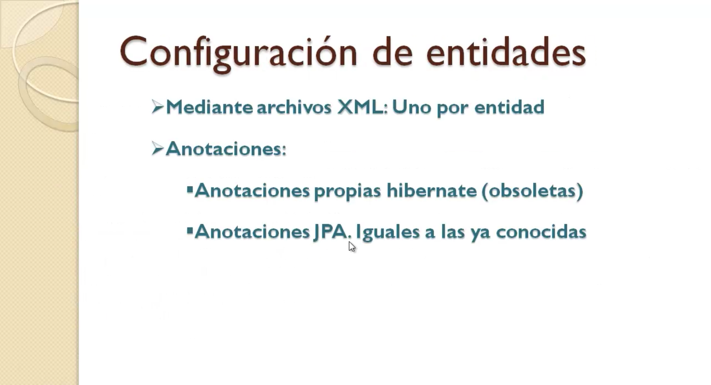

La configuración de entidades como hemos dicho se puede hacer mediante archivos XML, uno por entidad, es decir cada entidad debería llevar su archivo XML de configuración o mediante anotaciones que es la tendencia.

Hibernate es un framework que es realmente además de ser un framework es una implementación de JPA, qué quiere decir esto, pues que las anotaciones que hemos visto de JPA están incorporadas también Hibernate y podemos utilizarlas para configurar las entidades. Hibernate tiene también sus propias anotaciones pero digamos están la mayor parte de ellas obsoletas, tiene otras que no lo están y servirían para otras tareas, pero todas las anotaciones de JPA todas están incluidos también en Hibernate, porque es una implementación de la especificación JPA. Aunque insisto tiene otras propias para otras tareas que en JPA no se pueden realizar como acceder a base de datos NoSQL o alguna otra tarea que pueda realizarse también con Hibernate.

### Creación Proyecto Eclipse

Bien vamos a ver a continuación uno de los ejemplos que tenemos desarrollados de otros lecciones anteriores, por ejemplo teníamos el ejercicio `615-04_web_jpa` donde accedíamos mediante JPA y EJBs a una base de datos de contactos. Este proyecto hace lo siguiente:

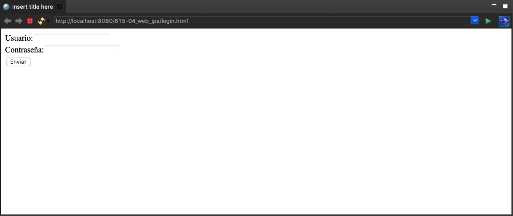

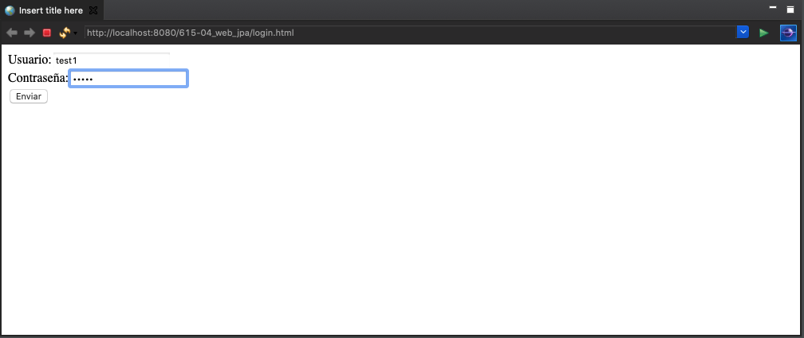

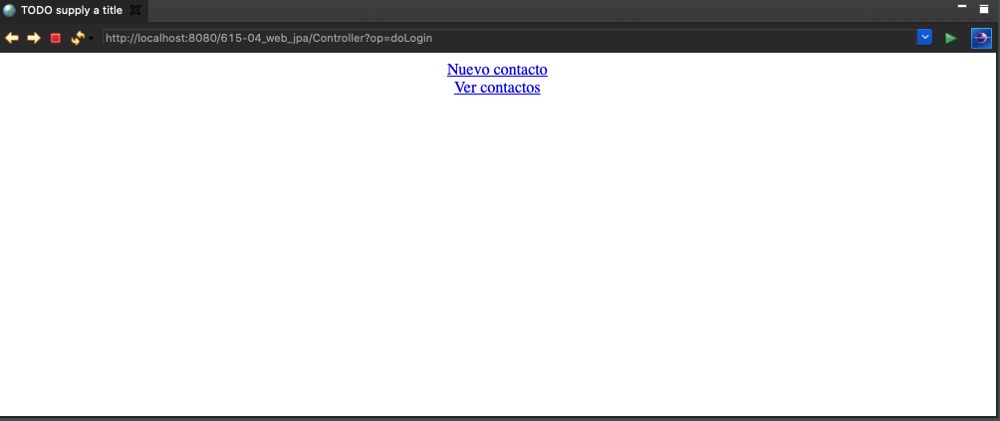

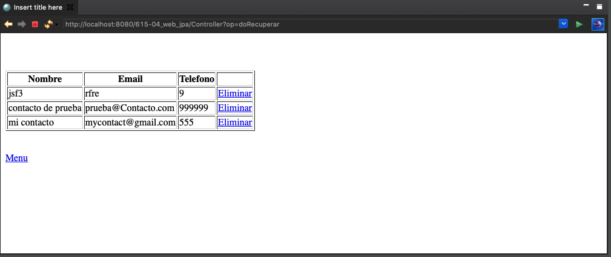

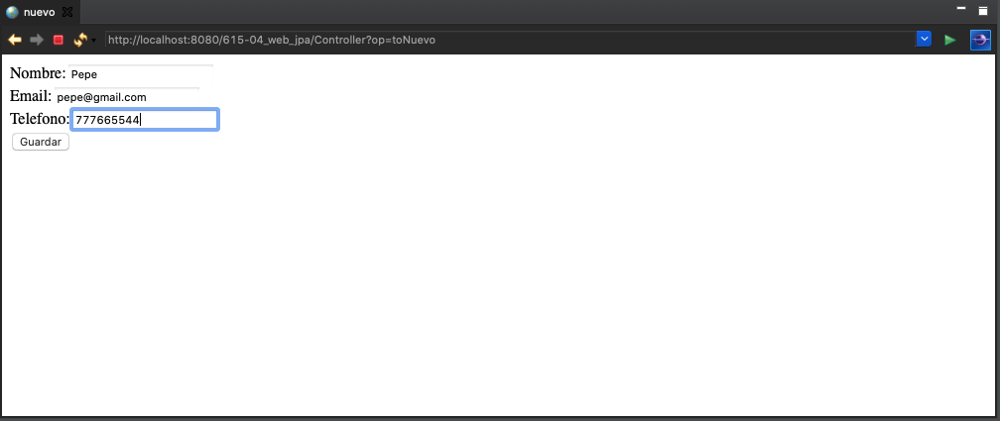

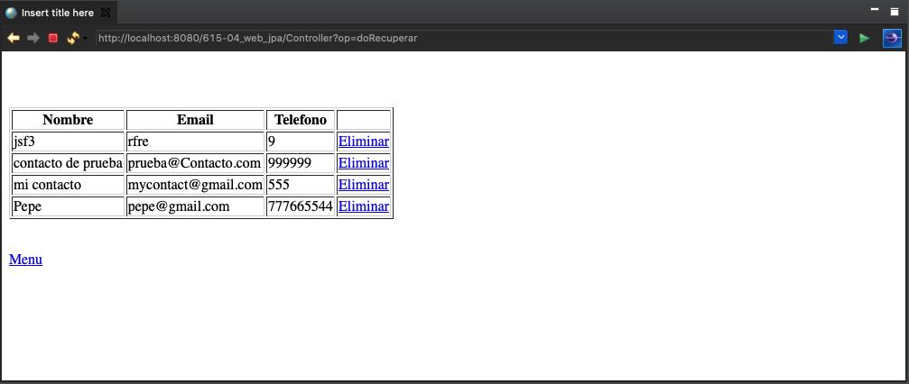

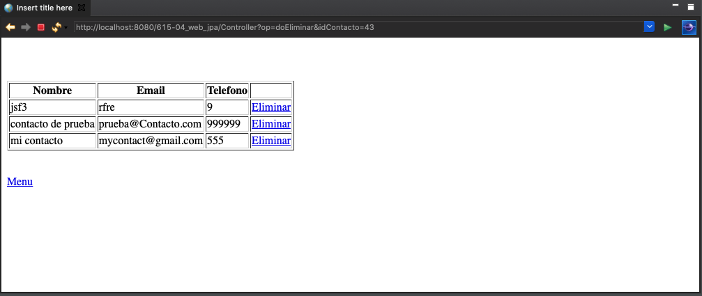

Lo que vamos a hacer es intentar migrar esta aplicación a Hibernate exclusivamente. En lugar de utilizar JPA utilizar Hibernate, que realmente como vamos a ver, la configuración de las entidades es la misma, va a ser muy parecida. Entonces nos vamos a centrar en esta lección concretamente en la configuración, el uso del API lo dejamos para la siguiente lección.

Vamos a copiar el proyecto `615-04_web_jpa` y le vamos a llamar `615-14_web_jpa_hibernate`

Vamos a cambiar el nombre en:

* Web Project Settings
* `pom.xml`
* `persistence.xml`
* `GestionContactosEjb`
* `GestionUsuarioEjb`

Una vez que hayamos hecho los cambios ya tenemos nuestro nuevo proyecto `615-14_web_jpa_hibernate`

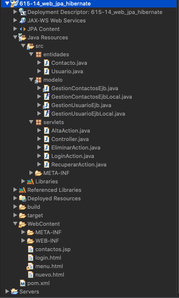

Si lo probamos todo funciona como el original, ahora mismo es exactamente igual que lo que teniamoes en `615-04_web_jpa` a excepción del nombre cambaido.

Este es un proyecto Web, con JPA que utiliza EclipseLink, se ejecuta en GlassFish por usar EJB.

Para la nueva configuración que vamos a usar con Hibernate necesitamos hacer algunos cambios.

#### 1. Añadir dependencia Hibernate en `pom.xml`

En primer lugar antes de empezar a configurar nada en el archivo XML, lo que vamos a hacer es lo que llamaríamos el setup del proyecto, es decir que librerías tengo que incorporar a través de Maven.

Bueno pues lógicamente si vamos a utilizar conexiones directas con la base datos el Driver que ya lo tenemos del proyecto anterior.

Pero por supuesto vamos a añadir la dependencia Hibernate en el `pom.xml`. 

```html
<!-- https://mvnrepository.com/artifact/org.hibernate/hibernate-core -->
<dependency>
   <groupId>org.hibernate</groupId>
   <artifactId>hibernate-core</artifactId>
   <version>5.4.18.Final</version>
</dependency>
```

Pegamos esta dependencia en el `pom.xml` para que incorpore todas la librería de Hibernate, no sólo va el motor también va el API todo lo que es la implementación de Hibernate. Bien eso por un lado.

#### 2. Eliminar rastros de JPA

Por otro lado como este proyecto estaba creado para JPA en su momento, está activada la característica JPA, está por ahí de hecho el `persistence.xml`, está esto de EclipseLink que es la librería del motor implícito que llevaba el servidor de aplicaciones GlassFish, nosotros ya no vamos a usarlo porque vamos a usar Hibernate.

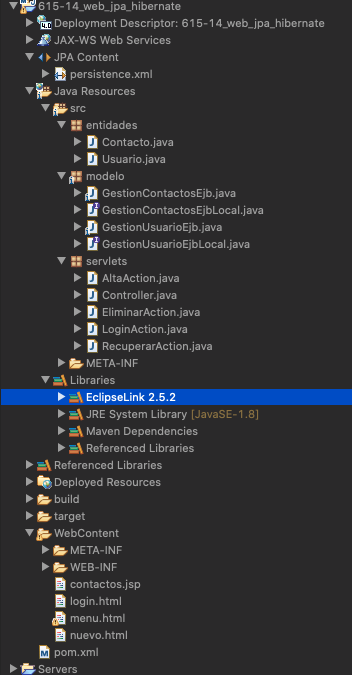

Lo que vamos a hacer es desactivar esas opciones, nos vamos a ir a las propiedades del proyecto y luego en `Java Build Path` 

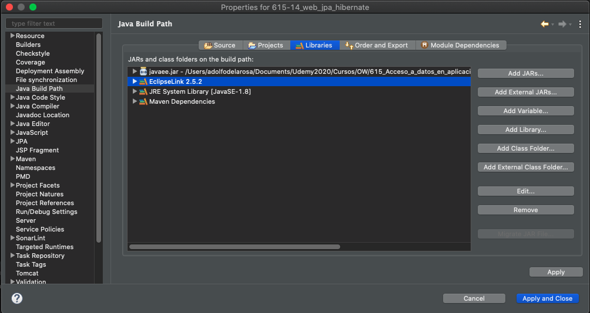

De momento EclipseLink lo vamos a quitar no necesitamos esa librería para nada, aplicamos los cambios.

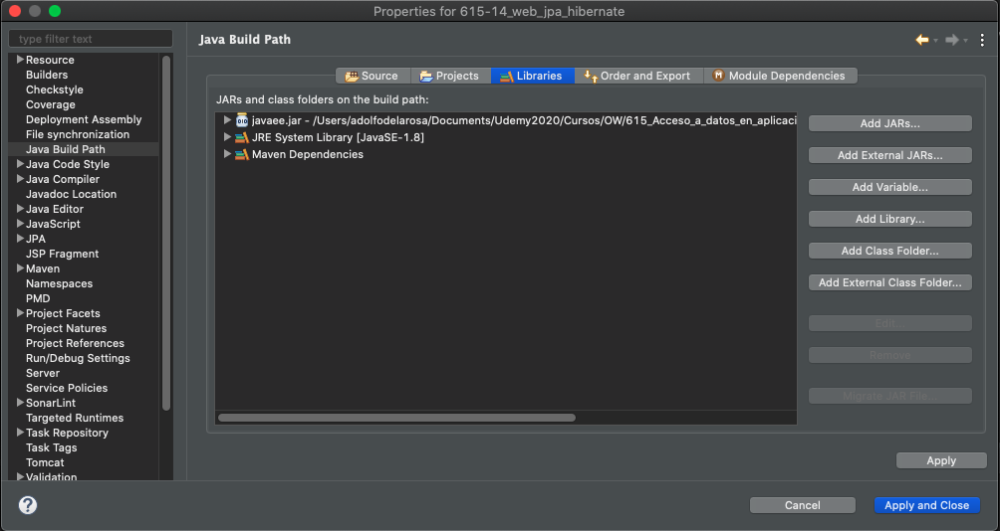

Y en `Project Facets` 

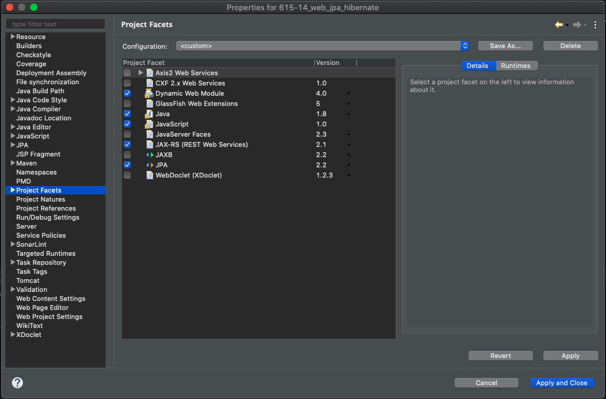

Vamos a desactir la opción JPA.

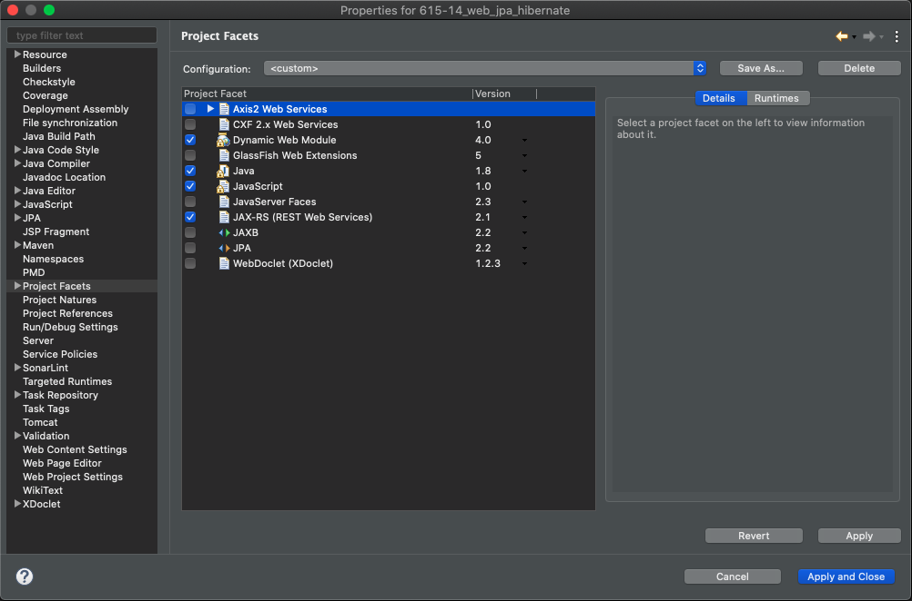

Una vez aplicados estos cambios 

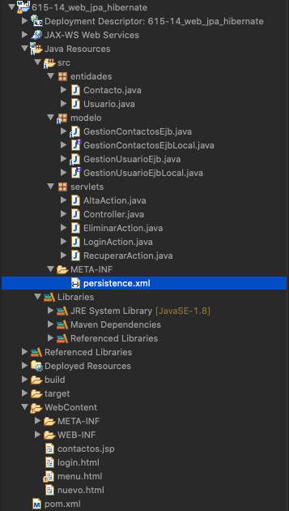

El `persistence.xml` no se ha borrado, no es que moleste pero lo vamos a quitar para que no pensemos que tendríamos que tener ese archivo, eso es de JPA y la idea es usar únicamente Hibernate.


Aunque la mayor parte de las cosas que tiene Hibernate ya son adquiridas de JPA como por ejemplo y es por donde vamos a empezar ya la configuración las Entidades.

#### 3. Configurar Entidades

Las entidades ya en su momento las creámos y las configuramos con JPA. Bueno pues tal cual están las vamos a seguir utilizando, porque insisto lo que hemos comentado antes, las entidades se configuran con anotaciones y esas anotaciones de JPA en su momento, también están incluidos ya en Hibernate y son de hecho **las que se recomienda utilizar** no las nativas de Hibernate que **están obsoletas** sólo se han mantenido como no obsoletas aquellas otras anotaciones que siguen para cosas que JPA no llega, como ya te he comentado antes acceder a bases de datos NoSQL o algún otro tipo de tarea.

Pues entonces qué significa todo esto.

Que toda la configuración que vimos en Entidades con estas anotaciones incluso las NamedQuery todo es perfectamente válido y así se va a mantener. Las Entidades `Contacto` y `Usuario` son exactamente las mismas, no han cambiado nada.

#### 4. Archivo de Configuración `hibernate.cfg.xml`

Nos hace falta el archivo de configuración `hibernate.cfg.xml`. Cómo añadimos ese archivo al proyecto. Podemos crear un XML, podemos buscarlo por internet porque hay algunas plantillas o digamos una cosa también bastante cómoda, es instalarnos en Eclipse un plugin que hay, que sirve para muchas más cosas no solamente para Hibernate pero entre otras cosas incorpora una opción de menú para poder generar el archivo de configuración de Hibernate de una forma mucho más cómoda.

¿Cómo instalaremos ese plugin? En el Eclipse Marketplaces aquí buscamos JBoos Tools.

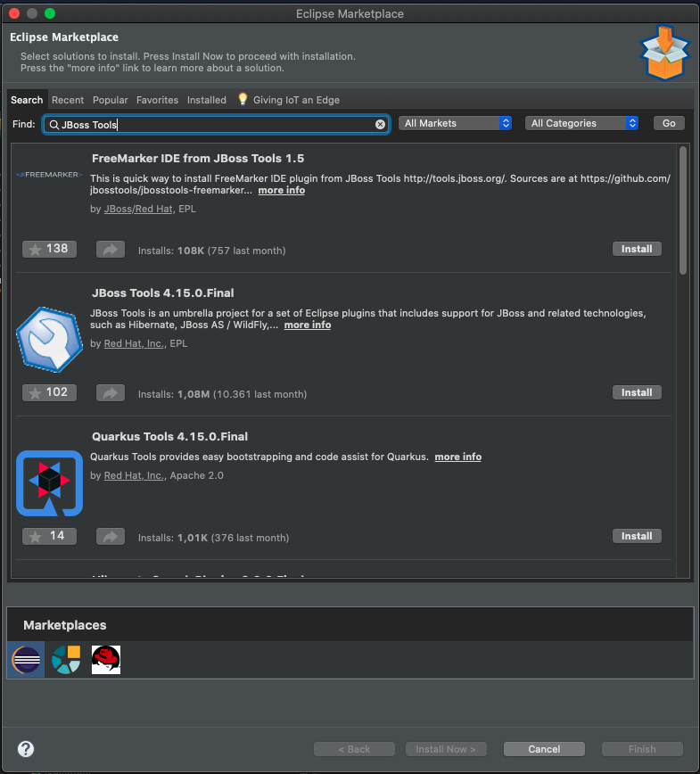

Dentro de toda la lista de opciones lo único importante son las Hibernate Tools es suficiente para que te aparezca el menú que vamos a comentar a continuación.

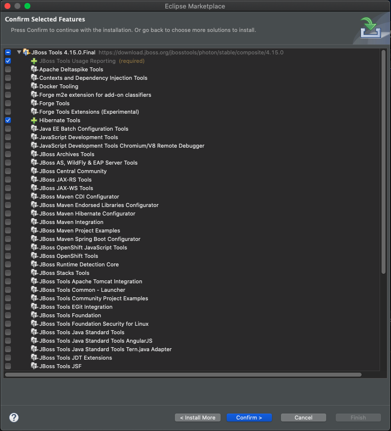

Una vez instalado el Plugin nos ponemos encima el proyecto y el botón derecho File - New -Other.

Cuando hayas instalado ese plugin que te acabo de comentar aparecerá una opción Hibernate dentro de la cual aparecen varias opciones.

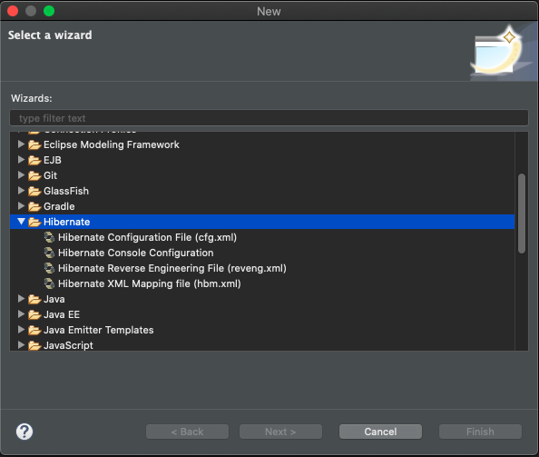

Tenemos la opción `Hibernate XML Mapping File (hbm.xml)` son los archivos de mapeo que se llaman de entidades, para configurar entidades no como lo tenemos nosotros sino con XML lo cual eso ya también está bastante desfasado y no se recomienda que se haga así, sino con anotaciones. Y bueno la que nos interesa que es el `Hibernate Configuration File (cfg.xml)` nos vamos al paso siguiente 

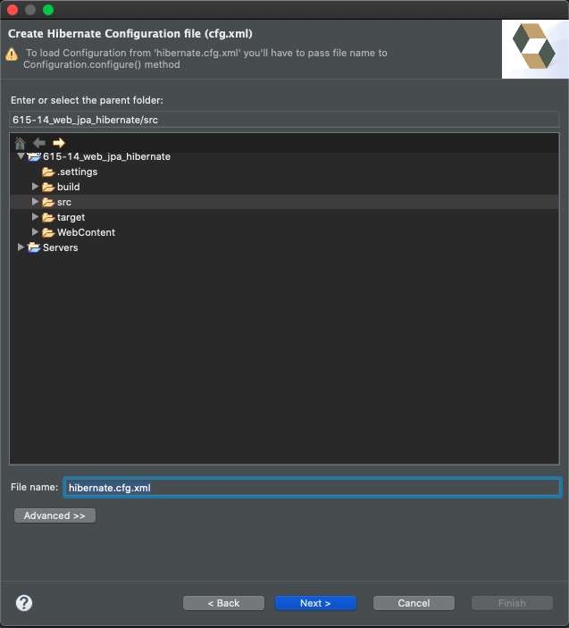

Debemos indicar donde lo va a crear, lo vamos a crear directamente en el paquete `src` la carpeta donde están las clases, se pueden meter en algún paquete o directamente en el paquete por defecto es decir en `src` y el nombre es `hibernate.cfg.xml` 

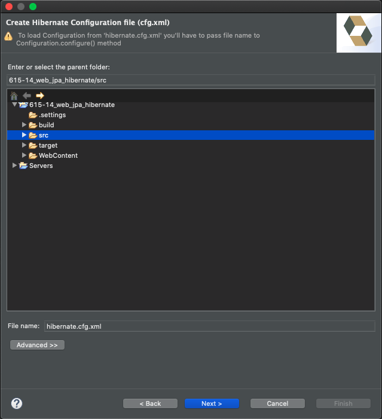

en el siguiente paso

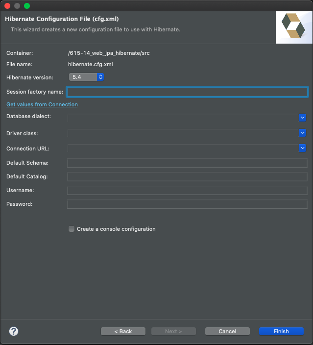

Ya nos va pidiendo incluso algunas propiedades básicas como las que hemos visto antes, la versión de Hibernate 5.4 es la más reciente. 

Bueno vamos a ir dándole algunas propiedades ya.

Realmente las que necesitamos son los datos de conexión y la lista de entidades eso habrá que dárselo después a posteriori.

`Session Factory name:` que equivale al nombre de la Unidad de Persistencia, la llamamos `factoryContactos`.

`Database dialect:` tipo de base de datos para utilizar las consultas `MySQL`.

`Driver class:` Driver de la base de datos `com.mysql.jdbc.Driver`.

`Connection URL:` Cadena de conexión clásica de MySQL `jdbc:mysql://localhost:3306/agenda`.

`Username: root`
`Password: root`

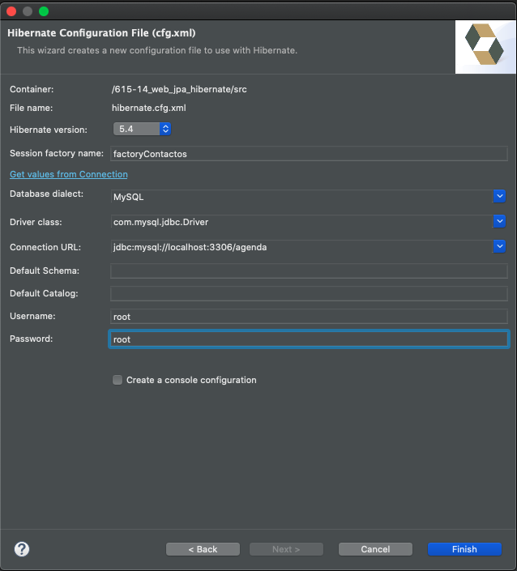

Bueno pues pulsamos el botón Finish y ahora verás `hibernate.cfg.xml`. 

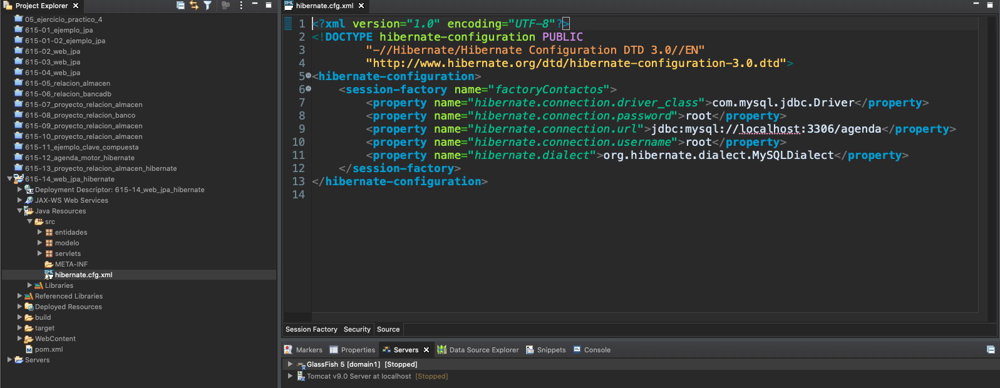

*`hibernate.cfg.xml`*

```html
<?xml version="1.0" encoding="UTF-8"?>
<!DOCTYPE hibernate-configuration PUBLIC
		"-//Hibernate/Hibernate Configuration DTD 3.0//EN"
		"http://www.hibernate.org/dtd/hibernate-configuration-3.0.dtd">
<hibernate-configuration>
    <session-factory name="factoryContactos">
        <property name="hibernate.connection.driver_class">com.mysql.jdbc.Driver</property>
        <property name="hibernate.connection.password">root</property>
        <property name="hibernate.connection.url">jdbc:mysql://localhost:3306/agenda</property>
        <property name="hibernate.connection.username">root</property>
        <property name="hibernate.dialect">org.hibernate.dialect.MySQLDialect</property>
    </session-factory>
</hibernate-configuration>
```

Tenemos la pestaña `Seccion Factory` que lo muestra de una forma más amigable.

Nos faltaría que listarse las entidades que forman parte de esa factoría de sesión. Esto se puede hacer desde la pestaña `Seccion Factory` más cómodamente.


O bien te vas al XML y los escribes directamente o desde está vista más amigable en la sección `Mappings` añadimos las Entidades.

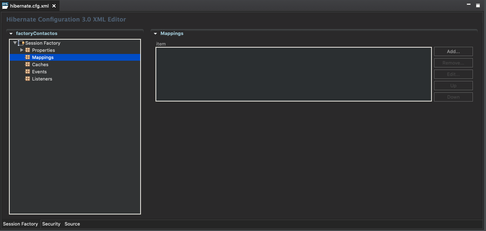

Presionamos `Add`

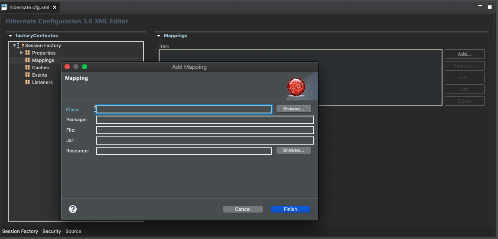

Vamos a buscarla con el asistente, la primera de las entidades es `Contacto`.

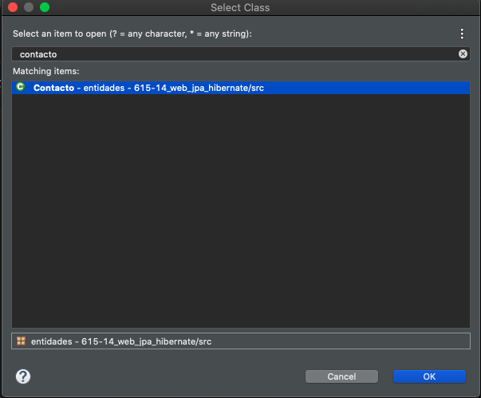

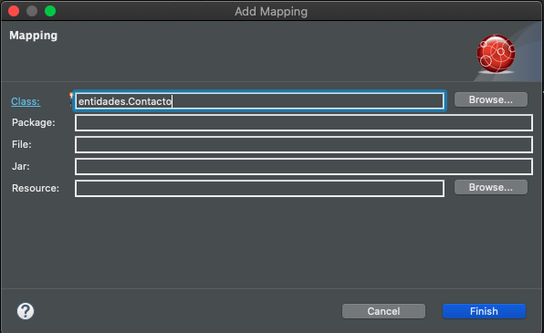

Damos Finish.

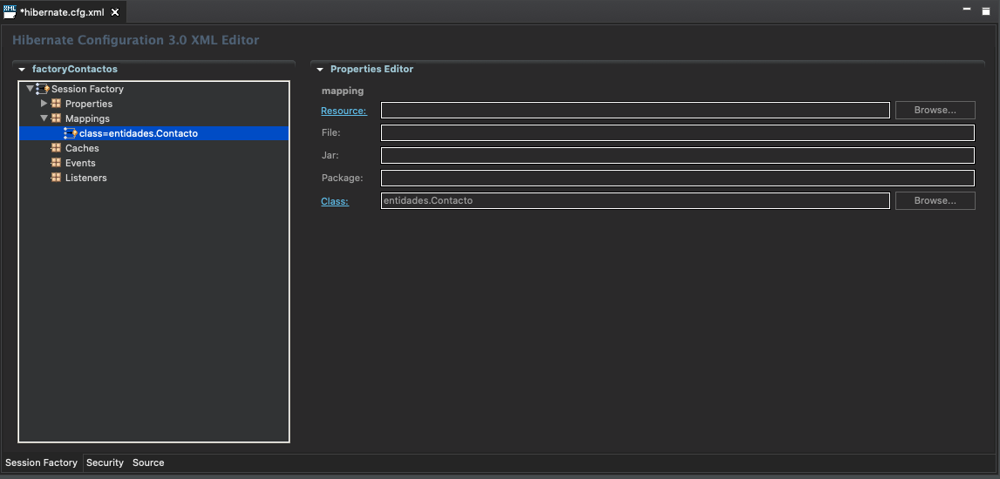

Y aquí la tenemos, nos falta la siguiente son dos clases `Contacto` y `Usuario`.

Añadimos también igual de la misma manera `Usuario`.

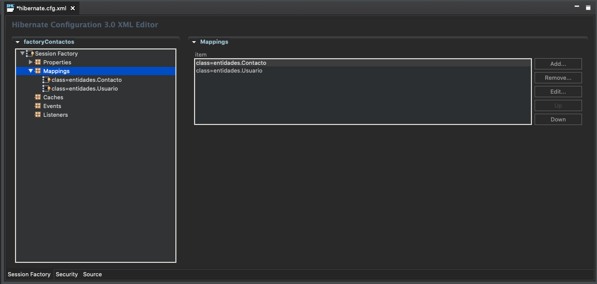

Ya tenemos mapeadas nuestras dos entidades si vemos el código de `hibernate.cfg.xml` tenemos:

```html
<?xml version="1.0" encoding="UTF-8"?>
<!DOCTYPE hibernate-configuration PUBLIC "-//Hibernate/Hibernate Configuration DTD 3.0//EN"
                                         "http://www.hibernate.org/dtd/hibernate-configuration-3.0.dtd">
<hibernate-configuration>
 <session-factory name="factoryContactos">
  <property name="hibernate.connection.driver_class">com.mysql.jdbc.Driver</property>
  <property name="hibernate.connection.password">root</property>
  <property name="hibernate.connection.url">jdbc:mysql://localhost:3306/agenda</property>
  <property name="hibernate.connection.username">root</property>
  <property name="hibernate.dialect">org.hibernate.dialect.MySQLDialect</property>
  <mapping class="entidades.Contacto"/>
  <mapping class="entidades.Usuario"/>
 </session-factory
</hibernate-configuration>
```

**Ya tenemos configurado lo que sería la Capa de Persistencia utilizando Hibernate nativo, tenemos el archivo de configuración `hibernate.cfg.xml` y las entidades configuradas con anotaciones.**

En la siguiente lección lo que vamos a ver es cómo acceder a la Capa de Persistencia desde el modelo usando el propio API de Hibernate que como ves es prácticamente el mismo de JPA, de hecho ha adquirido ya en las últimas versiones todos los métodos, todas las características de JPA aparte de tener ya los suyos propios y clásicos de antes.

# 33 El API de Hibernate 06:21


En esta lección vamos a ver cómo utilizar el API de Hibernate para manipular la Capa de Persistencia de una aplicación.

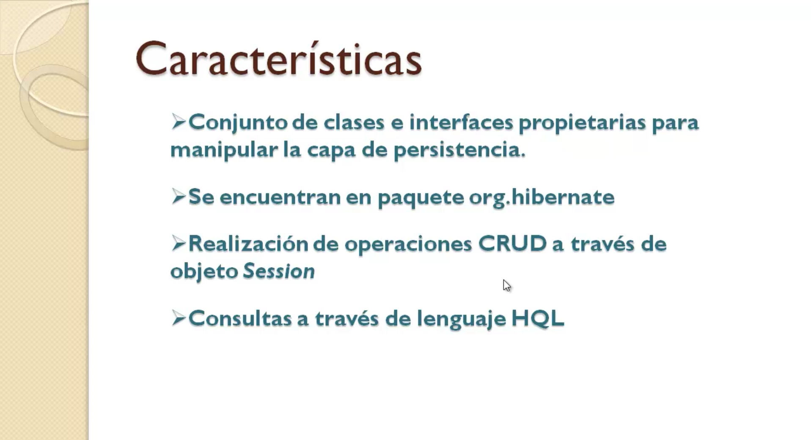

El API de Hibernate es un conjunto de clases e interfaces lo mismo que en el caso de JPA, que se utilizan para acceder desde el modelo o Capa de Lógica de Negocio de una aplicación a la Capa de Persistencia a los datos.

Estas clases e interfaces se encuentran en un paquete `org.hibernate` que forma parte de ese conjunto de librerías del API.

La realización de las operaciones básicas CRUD creación, recuperación de entidades, actualización o eliminación de las mismas, se va a realizar a través de un objeto una interfaz llamada `Session` que en vista de lo que ya conocemos de JPA podríamos decir que `Session` es el equivalente al EntityManager de JPA. 

También para operaciones no Crud, es decir más complejas como actualización de un conjunto de entidades o recuperación de conjunto entidades o entidades que no dependan de la Primary Key es decir que la condición sea diferente a obtenerla por Primary Key podemos personalizar las consultas a través de un lenguaje similar al que utilizamos, prácticamente igual podríamos decir que es el mismo en JPA que se llama HQL Hibernate QL muy parecido a JPQL que utilizamos en JPA.

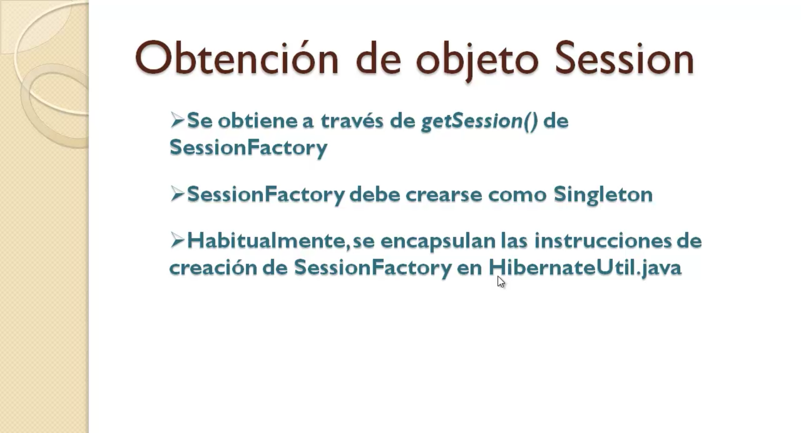

Bien lo primero para poder operar contra esa Capa de Persistencia necesitaríamos obtener una implementación de `Session`, para obtener una implementación de `Session` necesitamos un `SessionFactory` muy similares como digo al `EntityManager` en el caso de JPA.

Lo que pasa es que `SessionFactory` es un objeto bastante digamos pesado, que solamente debería ser utilizado una única instancia del mismo para todos los clientes que acceden a la aplicación. Por lo tanto se recomienda que se cree como Singleton, es decir una única instancia compartida por todos los clientes.

Para crear un `SessionFactory` de modo Singleton habría que seguir una serie de pautas, otra serie de elementos que habría que utilizar del API de Hibernate y habitualmente encapsular todo ese conjunto de instrucciones de extensión de `SessionFactory` en un archivo `HibernateUtil.java` obviamente lo podemos llamar como queramos pero desde las primeras versiones de Hibernate la costumbre es encapsular esas instrucciones de extensión de `SessionFactory` en un `HibernateUtil.java`. De hecho incluso existen ya varias versiones de este archivo que podemos encontrar por internet. Además bueno han ido evolucionando, con la evolución también de las versiones de este framework y hay bastantes ya estandarizados que podemos encontrar y no necesitamos tenernos que crear nosotros nuestro propio  `HibernateUtil.java`.

Cómo va a ver después en la siguiente lección vamos a utilizar un `HibernateUtil.java` clásico ya creado.

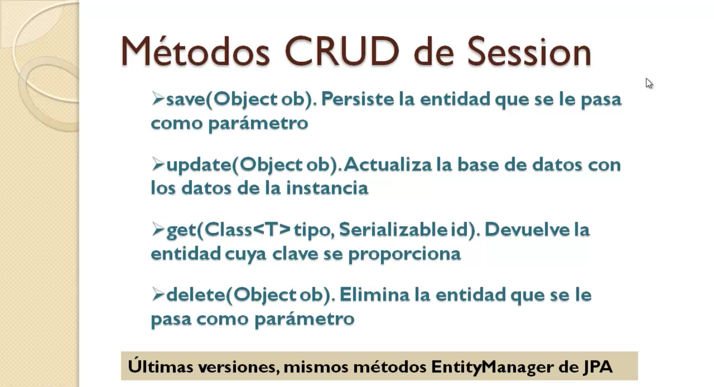

Bien pues una vez que ya tenemos el objeto `Session` ya podemos recurrir a estos métodos básicos para realizar las siguientes operaciones:

* `save(Object ob)` Persistir una entidad a partir de la entidad pasada como parámetro.
* `update(Object ob)` Actualizar la base de datos con los datos de una entidad que le pasamos como parámetro.
* `get(Class<T> tipo, Serializable id)` Para recuperar una entidad a partir de su Primary Key pasándole como primer parámetro el tipo de entidad y como segundo parámetro la Primary Key.
* `delete(Object ob)` Delete para eliminar la entidad que se le pasa como parámetro.

Como ves son métodos muy parecidos a los correspondientes de EntityManager `save` es como `persiste`, `update` como `merge`, `get` como `find` y `delete` como `remove`.

De hecho las últimas versiones de Hibernate incluyen también los mismos métodos que vimos en EntityManager en JPA, es decir que además de estos tenemos el `persice`, `merge`, `find` y `remove`.

De todas formas después veremos un ejemplo donde utilizaremos los métodos clásicos de Hibernate que son los que te estoy presentando aquí.

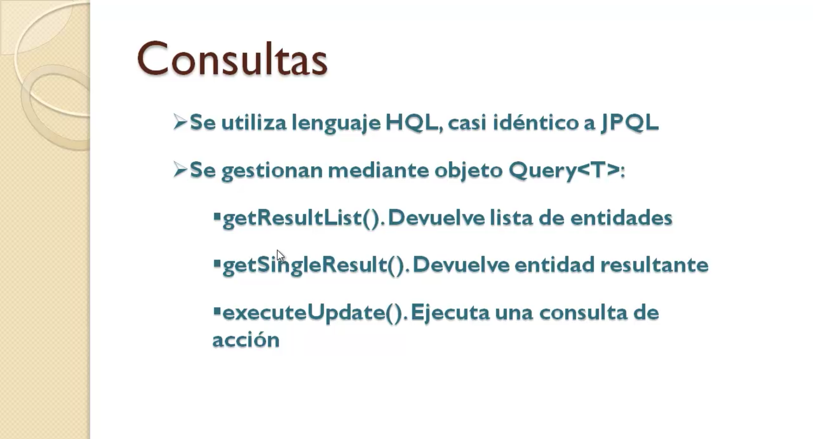

Además por supuesto tenemos las consultas para realizar operaciones complejas como recuperaciónde un conjunto de entidades o recuperación de alguna entidad a partir de una condición que no involucra la Primary Key, eliminación o actualización de conjunto entidades.

Para ello bueno igual que en JPA utilizaremos un lenguaje, una variante del SQL llamada en este caso `HQL` Hibernate QL que es casi idéntico a JPQL.

Una vez que tenemos confeccionada la consulta, la gestionaremos a través de `Query` el mismo nombre que la correspondiente interfaz de JPA. De hecho aquí no tenemos un `TypedQuery` usamos directamente `Query` con tipo, de modo que podemos crear una `Query` a partir de una HQL de selección indicando el tipo de entidad que queremos recuperar.

Los métodos como ves son los mismos que tenía la interfaz `Query` de JPA:

* `getResultList()` para devolver una lista entidades
* `getSingleResult()` cuando solamente es un único resultado una única entidad
* `executeUpdate()` si se trata de una consulta de acción

Como ves el proceso va a ser el mismo que en JPA. De hecho también tenemos la posibilidad de crear las consultas HQL como `NamedQuery` en las correspondientes entidades, de hecho en el ejemplo que hemos visto anteriormente cuando estuvimos configurando la capa de persistencia vimos que había ya una `NamedQuery` creados que también podremos utilizar desde el API de Hibernate y por supuesto pueden tener parámetros.


Por último comentar el tema de la transaccionalidad que también teníamos esta situación en JPA y es que si queremos realizar alguna operación que requiere acción sobre la base de datos añadir una nueva entidad, modificar una entidad o eliminar entidad, esas operaciones tienen que estar englobadas dentro de una transacción.

Las transacciones vienen gestionadas por el objeto `Transaction` de Hibernate.

Para crearlo utilizaremos el objeto `session` su método `begintransaction()` que ya crea el objeto de transacción y además da comienzo a la transacción, incluiriamos las operaciones de acción y para confirmar la transacción sería con el método `commit()` de la transacción.

```java
Transaction tx = objeto_session.beginTransaction();
//operaciones de acción

tx.commit();
```

# 34 Utilización del API de Hibernate en una aplicación 18:29

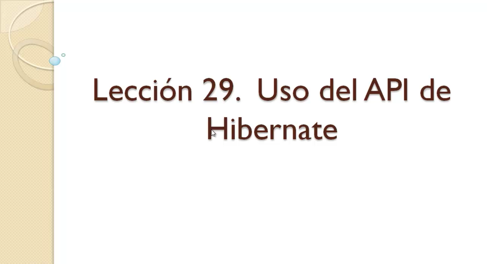

En la lección anterior hemos estado viendo el API de Hibernate y te he presentado algunos de los métodos más importantes de objetos `Session`

Ahora en esta lección vamos a ver ya su aplicación directa en el ejercicio que hemos comenzado a hacer ya sobre la configuración de Hibernate de la gestión de los contactos.

Volvamos a `615-14_web_jpa_hibernate` ya tenemos el archivo de configuración `hibernate.cfg.xml` partíamos ya de las entidades configuradas con anotaciones que teníamos originariamente en el ejercicio práctico `615-04_web_jpa` ahora lo que vamos a meter es el código del modelo pero utilizando Hibernate en lugar de JPA.

Lo primero ya lo he comentado en la lección anterior necesitamos encapsular todas las operaciones de obtención de un `SessionFactory` que es con el que obtendremos el objeto `Session` en un archivo `HibernateUtil` que normalmente se suele conocer así desde las primeras versiones de que se lleva utilizando Hibernate.

Aquí tienes la clase `HibernateUtil`.

*`HibernateUtil`*

```java
package modelo;

import org.hibernate.SessionFactory;
import org.hibernate.boot.Metadata;
import org.hibernate.boot.MetadataSources;
import org.hibernate.boot.registry.StandardServiceRegistry;
import org.hibernate.boot.registry.StandardServiceRegistryBuilder;

public class HibernateUtil {
  private static StandardServiceRegistry registry;
  private static SessionFactory sessionFactory;

  public static SessionFactory getSessionFactory() {
    if (sessionFactory == null) {
      try {
        // Create registry
        registry = new StandardServiceRegistryBuilder()
            .configure()
            .build();

        // Create MetadataSources
        MetadataSources sources = new MetadataSources(registry);

        // Create Metadata
        Metadata metadata = sources.getMetadataBuilder().build();

        // Create SessionFactory
        sessionFactory = metadata.getSessionFactoryBuilder().build();

      } catch (Exception e) {
        e.printStackTrace();
        if (registry != null) {
          StandardServiceRegistryBuilder.destroy(registry);
        }
      }
    }
    return sessionFactory;
  }

  public static void shutdown() {
    if (registry != null) {
      StandardServiceRegistryBuilder.destroy(registry);
    }
  }
}
```

Este sería el código donde como puedes ver el método estático `public static SessionFactory getSessionFactory()` nos devuelve una implementación de `SessionFactory` y claro te estaras preguntando de dónde he sacado todo esto.

Estas implementaciones están ya estandarizadas yo por ejemplo esa implementación la he sacado de esta página https://www.javaguides.net/2018/11/hibernate-5-xml-configuration-example.html y la tienes en muchos otros sitios porque es una implementación clásica de `HibernateUtil` para la versión de Hibernate 5 en adelante.

Esto ha ido evolucionando en distintas formas de obtener el `SessionFactory` que parece que cada vez es más complejo pero bueno es una forma de hacerlo de la manera más eficiente posible.

Tampoco tenemos que meternos al detalle de esto porque ya esto es un código ya bastante estandarizado y directamente cuando se llame al método estatico `getSessionFactory()` de esta clase `HibernateUtil` vamos a obtener una implementación de `SessionFactory` por muchos clientes que llamen a este método todos obtendrían la misma instancia y trabajaríamos sobre el mismo `SessionFactory`.

Bueno ya tenemos esta clase que se ha creado dentro del paquete `modelo` donde están los EJBs con la lógica de negocio vamos a hacer uso de ella para implementar todas las funcionalidades del modelo. 

Recordemos que en nuestro modelo tenemos las clases `GestionContactosEjb` y `GestionUsuarioEjb`  vamos a poner su código actual.

*`GestionContactosEjb`*

```java
package modelo;

import java.util.List;

import javax.ejb.Stateless;
import javax.persistence.EntityManager;
import javax.persistence.PersistenceContext;
import javax.persistence.Query;
import javax.persistence.TypedQuery;

import entidades.Contacto;

/**
 * Session Bean implementation class GestionContactosEjb
 */
@Stateless
public class GestionContactosEjb implements GestionContactosEjbLocal {

   @PersistenceContext(unitName="615-14_web_jpa_hibernate")
   EntityManager em;
   public void altaContacto(String nombre, String email, int telefono) {
      Contacto c = new Contacto(email, nombre, telefono);
		
      em.persist(c);
   }

   public void altacontacto(Contacto c) {
		
      em.persist(c);
		
   }
	
   public void eliminarContacto(int idContacto) {
		
      Contacto c = em.find(Contacto.class, idContacto);
		
      if(c != null) {
	 em.remove(c);
      }
		
   }
	
   public void eliminarContactosPorEmail(String email){
		
      Query qr=em.createNamedQuery("Contacto.deleteByEmail");
      qr.setParameter(1, email);
		
      qr.executeUpdate();
		
   }
	
   public List<Contacto> recuperarContactos(){
		
      /*Query qr = em.createQuery("Select c From Contacto c");
      return (List<Contacto>)qr.getResultList();*/
      TypedQuery<Contacto> qr = em.createQuery("Select c From Contacto c", Contacto.class);
      return qr.getResultList();
   }
	
   public Contacto buscarContactos(String email){
				
      String jpql = "Select c From Contacto c Where c.email = ?1";
      TypedQuery<Contacto> qr = em.createQuery(jpql, Contacto.class);
      qr.setParameter(1, email);
      //return qr.getSingleResult();
      return qr.getResultList().get(0);
   }

}
```

*`GestionUsuarioEjb`*

```java
package modelo;

import javax.ejb.Stateless;
import javax.persistence.EntityManager;
import javax.persistence.PersistenceContext;
import javax.persistence.TypedQuery;

import entidades.Usuario;


@Stateless
public class GestionUsuarioEjb implements GestionUsuarioEjbLocal {
   @PersistenceContext(unitName="615-14_web_jpa_hibernate")
   EntityManager em;
   @Override
   public boolean autenticar(String usuario, String pwd){
		
      boolean res=false;
      TypedQuery<Usuario> qr=em.createNamedQuery("Usuario.findByUserAndPwd", Usuario.class);
      qr.setParameter(1, usuario);
      qr.setParameter(2, pwd);
      try{
         qr.getSingleResult();
	 res=true;
      }catch(Exception ex){
	 ex.printStackTrace();
      }
      return res;
   }
}
```

Bueno aquí tenemos la implementación que originariamente teníamos con JPA.

Esto ya no va a ser así por ejemplo para obtener la Unidad de Persistencia tenemos:

```java
@PersistenceContext(unitName="615-14_web_jpa_hibernate")
EntityManager em;
```

Esto lo haciamos con JPA pero en este proyecto ya no tenemos ni rastro del `persistence.xml` lo hemos eliminado por lo que ambas sentencias ya no las vamos a usar con Hibertate. Ahora a nivel de cada método tendremos que obtener el objeto `Session` llamar a los métodos que hemos comentado en la lección anterior y cuando haya que aplicar transaccionalidad pues habrá que englobarlo dentro de una transacción así va a ser. 

Vamos empezando ya por este método `altaContacto` de `GestionContactosEjb`.

```java
public void altaContacto(String nombre, String email, int telefono) {
   Contacto c = new Contacto(email, nombre, telefono);
   em.persist(c);
}
```

Aquí lo que tendremos que obtener es un objeto `Session` vamos a ir declarando la variable y claro que necesitamos `Session s = HibernateUtil.getSessionFactory().getCurrentSession();` aquí nos devolvería una implementación del objeto `Session`. Finalmente su utilizo mejor `Session s = HibernateUtil.getSessionFactory().openSession();` por que el problema recide que al usar `getCurrentSession()` nos devolvería la sesión actual si es que se ubiera abierto alguna como las vamos ir abriendo y cerrando no hay ninguna abierta. El método `getCurrentSession()` lo podemos tener en un contexto donde ya hay una sesión creada y que se este compartiendo pero si lo que queremos es ir abriendo y cerrando nuestras sesiones para ganar en eso cierta eficiencia en vez de `getCurrentSession()` usamos `openSession()`.  

A partir del `Session` ya podríamos realizar la persistencia del Contacto, muy importante que el objeto `Session`, aquí tenemos que preocuparnos también nosotros no como JPA que es más automático, de **la obtención y de su cierre** entonces lo vamos a meter en un `try` con recursos, un `try` con recursos es una versión de `try-catch` de Java que te permite el cierre automático de los recursos como indica su nombre, es decir que automáticamente cuando se abandona el `try` el objeto que has creado dentro de los paréntesis se cierra y no tenemos que estar preocupándonos de cerrarlo o de meter el cierre dentro del `catch`, es más el `try` con recursos ni siquiera necesita un `catch` porque su misión, podríamos tenerlo pero no es el objetivo captura ninguna excepción sino aprovecharnos del auto cierre de los recursos. Las sentencias irian dentro del `try` y otra cosa importante necesitamos englobarlas dentro de una transacción. Como ya dijimos a partir del objeto `Session` podemos crear una transacción comenzarla es decir obtendríamos el objeto `Transaction` y ya se comenzaría esa transacción, importamos `org.hibernate.Transaction` que es el tipo que a nosotros nos interesa y a partir de ahí creamos el objeto contacto y hacemos la persistencia que era el método si recuerdas el método `save` del objeto `Session` que es el que hemos creado y le pasamos el objeto que queremos persistir ya lo tenemos.

```java
public void altaContacto(String nombre, String email, int telefono) {
   try (Session s = HibernateUtil.getSessionFactory().openSession();){
      Transaction tx = s.beginTransaction();
      Contacto c = new Contacto(email, nombre, telefono);
      s.save(c);
      tx.commit();
   }
}
```


Aquí teníamos otra versión de alta contacto donde en vez de recibir los datos por separado ya recibíamos el objeto contacto por bueno vamos a copiar esto o incluso desde aquí podríamos llamar también a este método es decir podremos hacer aquí un alto contacto y pasar directamente los parámetros punto del nombre ya que tenemos el código para no volver a repetirlo.

Punto y mail punto de teléfono pues ahí lo tenemos.

Bueno seguimos avanzando y bueno ahora tenemos un método para recuperar contactos donde tenemos una J.P. cuele que como ya te he dicho Hibernate tiene HCl que es lo mismo la misma sintaxis. 

Por lo tanto vamos a poder seguir utilizando esas mismas J.P. cueles las mismas instituciones así como la andarme arcoiris que tengamos ya creadas en las entidades bien como siempre hay que obtener esto digamos el bloque troikas la estructura troikas vamos a tener que utilizarla siempre es independiente ya ya de lo que pongamos aquí lo voy a dejar vacío pero la estructura para obtener el objeto Obsession siempre bases aquí no necesitamos transaccion porque es una instrucción de recuperación de entidades lo que necesitamos es crear un cuadri.

Voy a aprovecharme de esta instrucción que ya teníamos pero en vez de Tacuarí vamos a utilizar Cury que es una interfaz de Hibernate que ya es tipado con tipo y lancemos la llamada Create QWERTY del objeto cesion como es es el mismo método Recovery de sesión que tiene el Entity maneira.

Cuidado al importar Cuadri porque no van a salir aquí también.

A ver cuando vamos en el control mayusculo varias importaciones a ver qué es lo que nos ha importado esto como ya venía importado de antes tenemos ha importado el cuerno de Java y que persisten en ese no es que importar el cuadri de internet lo he borrado a propósito para que me pregunte cualquier importar ahora si es el cuadri Estado o como dice uno de es que aquí tenemos un cuerina en Java X persistes ni otro.

Bueno este no es obviamente no es el de JPA pero si aquí tenemos un qwerty en el BNG Hibernate y otro en el Bergère Bernadet QWERTY si su paquete y dentro de Rajoy Bernet cómo es este cuatrista de precarga es que tenemos que utilizar Balay el objeto QWERTY un tipo interfaz quali que está en el paquete qwerty de ivermectina vale ya lo tenemos y entonces ya hemos creado la QWERTY y devolveremos la lista de resultados.

Cogemos esa instrucción que nos sirve tal cual porque es el mismo método de resultas como hemos explicado en el capítulo anterior.

Esta anotación aquí como aquí no hay transaccionalidad esto no nos va a hacer falta.

Vamos a borrar tenemos una tarea de gestión automática de transacciones y eso hoy no lo necesitamos.

Además no nos va a hacer nada porque al utilizar Internet las transacciones lo vamos a tener que gestionar nosotros manualmente y solamente la vamos a aplicar cuando sean instrucciones de acción como Yakumo.

Bueno pues venga vamos a seguir copiamos esta estructura para el siguiente buscar contactos.

Bueno pues aquí tenemos lo mismo tenemos que crear un acuerdo con la J.P. cuele desde el sur.

Esta instrucción la pueden meter incluso en el tema de los parámetros normales.

Si cogemos tal o cual no lo copiamos etc..

Fuera entonces bueno pues fíjate creamos la web y establecemos el parámetro de igual método el mismo método para meter el cual es muy parecido.

Prácticamente igual al Pasquali de KPA y bueno de la lista de resultados nos quedamos con el primero en buscar contacto eliminar contacto.

Una vez más vamos a copiar la estructura lo que pasa que debía copiar la estructura del alta puesto que la instrucción para inicio de transacción aquí la voy a necesitar ya que estas instrucciones como es una eliminación deben de venir dentro de una transacción.

Cuando hacemos una búsqueda del contacto por primary key en este caso será el objeto sesión método Geeta que es el equivalente al fin.

Ya he visto que si dejaba el Fain también funcionaba porque como ya te comenté en el capítulo anterior se puede utilizar los métodos de JPA porque llevan incorporados también dentro de las nuevas versiones de la interfaz sesión de Internet.

Pero bueno estamos trabajando con los originales.

Vale y entonces.

Pues aquí lo que vamos a hacer para eliminar la instancia de contacto es un método de llamada método de alerta pasamos el todo contacto en la librería bajo la pregunta.

Efectivamente cierto que esto había que hacerlo poquito más y para preguntar si existe la estancia o si no existe la estancia no tenemos nada que eliminar.

Vale entonces la recuperamos y si existe la eliminamos compramos por su clave primaria y ya por último nos quedaría dentro de esta clase de JB pues la eliminación de contactos por email en este caso figote estamos utilizando una name equally pero es una name Kourí de acción.

Por lo tanto también tenemos que estar dentro de una transacción así que vamos a ver porque hay una cosita aquí no sé si taladrado cuenta pero se me ha olvidado realizar también en el primer ejemplo en el primer método donde salvamos la entidad y es confirmar la transacción.

Saito confirma y confirma los explicitamente entonces vamos a empezar por aquí por el alta contacto.

Cuando se me había olvidado hacer la operación commit porque si no no se confirmaría no quedaría reflejada en la base de datos aquí.

Pues lo mismo con el L.T X punto com vale.

Bueno pues nos quedaba esta eliminación de contactos por email.

Vamos a copiar toda esta estructura que nos puede servir porque en este caso si lo que necesitamos es una Mercury llamada Executiu.

Todo esto lo cortamos y vamos a sustituir por la que teníamos antes de recuperación eliminación.

Y como es creatinina name Kairi repasarla name Cuadri.

Este es el nombre original que tiene la entidad porque las entidades no las hemos cambiado mismo métodos actitude y confirmar.

Como vemos es bastante similar a como hemos trabajado con JPA sólo que aquí bueno gestionando manualmente digamos las transacciones gestión usuarios pues también teníamos aquí un método que el método autenticar.

Bueno lo mismo esto Identity Manager lo vamos a quitar y aquí tenemos que crear una Tacuri a partir de una nave Juriquilla teníamos proporcionan los parámetros.

Bueno pues esto mismo.

Venga vamos a traducirlo a Internet.

Entonces como siempre la estructura el trade con recursos lo vamos a llevar aquí no podemos poner después a continuación la declaración de la variable Pullen.

Y bueno primero la acuerdo sí que vamos a ir copiando cosas bueno mejor cortando Cory Monteith Mercuri usuario y el objeto sesione al importar QWERTY como sabes.

Pues tiene que ser el cuadri de Rajoy ni te. 

Todo esto es lo mismo que la forma de crearla es la misma.

Establecimiento de los parámetros captura de una sesión si no hay un resultado bueno esto es exactamente igual así que me lo voy a llevar también.

Aquí dentro bueno exactamente igual con la salvedad de que no hay ninguna salvedad la variable la llamada también QR o sea tal cual está.

Por lo tanto.

Bueno pues ya hemos reimplantado la lógica de negocio que teníamos hecha con JPA dentro de JB.

Pues sí con el JB es manteniendo la misma lógica forma de la lógica de negocio pero utilizando la pide y Bernays.

Pues nada ahora sería cuestión de probar el ejercicio y verificar que funciona exactamente igual que antes.

Vamos a ello nos colocamos encima la página Lubin botón derecho runas observase seleccionamos algunas feeds y esperamos a que se inicie el servidor y nos lance la página 
una vez que hayas arrancado aquí tenemos la página del Lovin para que nos adentraremos bien.

Pues venga vamos a meter las credenciales que supuestamente están en la base de datos 3 1 2 1 y al pulsar el botón Enviar.

Pues vamos a obtener un error 500.

Vamos a ver cuál es.

Ahora ya te explican en qué va a consistir el error y por qué nos dice que si vamos PJD es exception si vamos bajando llega un momento que nos dice que no hay una sesión abierta no ocurren sesión contes.

Por qué ha sido eso.

Bueno volvemos otra vez al modelo a los métodos que hemos ido creando y bueno el problema aquí reside básicamente en que al llamar al Guez ocurre sesión nos devolvería digamos la sesión actual si es que se hubiera abierto alguna como las hemos ido abriendo y cerrando no hay ninguna abierta.

Entonces served current Session es un método que si lo podemos tener un contexto donde hay una sesión ya creada y que se esté compartiendo.

Pero si lo que queremos es ir abriendo y cerrando nuestras sesiones para ganar en eso cierta eficiencia pues en vez de que curren sesión utilizaríamos Open session vale bueno o vamos a ir sustituyendo en todos los sitios donde tenemos a ver aquí sesión también aquí también y aquí tan Bale y en el otro no tenemos nada más que 1 lo tenemos guardamos todos los cambios y volvemos a probar de nuevo recuperamos la página del Odin vamos a ver 3 1 3 1 que son los usuarios que tenemos en la tabla de usuarios.

Tramos tardado un poquito lo cual significa una buena señal.

Vamos a ver la lista de contactos aquí tenemos la lista de contactos donde nos aparecen todos los contactos que teníamos en la base de datos.

Bueno por ejemplo vamos a ver si es capaz de eliminar efectivamente Limina o vamos al menú y vamos ya crear la última prueba.

1 contacto contar a junto con un número de teléfono guardamos aquí debería aparecer efectivamente el nuevo contacto o la lista.

Como veis funciona exactamente igual que el otro difrencia en el ejercicio 3 utilizamos JPA en todos los ámbitos de lo que es creación y utilización de capa persistencia y aquí hemos utilizado Internet.

# 35 Ell API Criteria 03:44

El API criteria de JPA es una alternativa al uso de Query/JPQL de cara a realizar consultas sobre la capa de persistencia. La diferencia fundamental entre uno y otro método de consulta es que mediante el API criteria construimos las consultas de forma dinámica a través de objetos, sin necesidad de predefinir las instrucciones con un lenguaje especial de consulta como JPQL.

El API criteria está formado por una serie de interfaces que podemos encontrar en el paquete javax.persistence.criteria.

### CriteriaBuilder

Para realizar cualquier operación con el API criteria necesitamos un objeto CriteriaBuilder, el cual puede obtenerse a partir del objeto EntityManager a través del método `getCriteriaBuilder()`:

`CriteriaBuilder cb=em.getCriteriaBuilder();`

Una vez que disponemos del CriteriaBuilder podemos crear objetos CriteriaQuery, que son los que nos permitirán realizar las consultas sobre la capa de persistencia

### CriteriaQuery

Como te acabo de indicar, el objeto CriteriaQuery es quién nos permitirá realizar las consultas de selección de entidades sobre la capa de persistencia. Para crearlo, recurriremos al siguiente método de CriteriaBuilder:

`CriteriaQuery<T> createQuery(Class<T> claseResultado)`

El parámetro claseResultado es el objeto Class correspondiente al tipo de entidad que vamos a tratar en la consulta.

Por ejemplo, para consultar sobre la capa de persistencia formada por objetos Contacto tendríamos que crear el objeto CriteriaQuery de la siguiente manera:

```java
CriteriaQuery<Contacto> 
cq=cb.createQuery(Contacto.class);
```

La interfaz CriteriaQuery proporciona una serie de métodos para construir la consulta. Estos métodos corresponden con las cláusulas utilizadas para crear una instrucción JPQL , así tenemos los métodos `select(), from(), where()`, etc.

### Raíz de una consulta. La interfaz Root

Para poder realizar una consulta a través de los métodos de CriteriaQuery, necesitamos primeramente disponer de la raíz u origen de la consulta, que está representado en criteria mediante un objeto Root.

Root es el punto de partida de una consulta al igual que lo es el elemento indicado en las cláusulas From de JPQL, de ahí que para obtener un objeto Root tengamos que recurrir al método `from()` de CriteriaQuery:

`Root<Contacto> raiz=cq.from(Contacto.class);`

### Ejecución de la consulta básica

A partir de aquí, ya podríamos lanzar una instrucción select simple de recuperación de todas las entidades. Para ello, utilizaremos el método `select()` de CriteriaQuery, al que tendremos que pasarle el objeto Root. La llamada a este método nos devuelve un nuevo objeto CriteriaQuery, configurado como una consulta Select básica:

`cq=cq.select(raiz);`

Lo anterior equivale a la instrucción JPQL:

`Select c From Contacto c`

Para manipular las entidades resultantes de la consulta, utilizaremos como en JPQL el objeto Query o TypedQuery, pues podemos crear uno de estos objetos a partir del método createQuery(`CriteriaQuery<T> cquery`) de EntityManager.

Para mostrar los nombres de todos los contactos sería:

```java
TypedQuery<Contacto> q=em.createQuery(cq);
List<Contacto> contactos=q.getResultList();
for(Contacto c:contactos){
   System.out.println(c.getNombre();
}
```

### Condiciones de selección

Para establecer una condición a la hora de seleccionar las entidades, emplearemos el método `where()` sobre el CriteriaQuery obtenido de la selección, al igual que en JPQL empleamos la cláusula where.

Sin embargo el uso del método where no es tan simple como el de la cláusula where, a la que le pasamos un String de la forma "columna operador valor". El método `where()` que utilizaremos en criteria tiene uno de estos formatos:

```java
CriteriaQuery<T> where(Expression<Boolean> restriction)
CriteriaQuery<T> where(Predicate... restrictions)
```


En el primer caso, se pasa como parámetro al método un objeto **Expression** de tipo boolean con la condición de selección, mientras que en la segunda versión del método se pasaría como parámetro un número variable de objetos **Predicate**.

Tanto en un caso como en otro, deberíamos recurrir a métodos de la clase CriteriaBuilder que nos proporcionarán objetos *Expression y Predicate* para formar las condiciones de selección.

Vamos a ver un ejemplo que nos sirva para aclarar el funcionamiento de este método `where()`. Supongamos que queremos recuperar un objeto Contacto a partir de su email. Utilizaremos en este ejemplo la segunda versión de `where()`, al que pasaremos como parámetro un objeto Predicate que defina la condición.

Ese objeto Predicate representa  una condición de igualdad que podemos generar a partir del método `equals()` de QueryBuilder:

`Predicate equal(Expression<?> x, Object y)`

El objeto Expression representaría el atributo al que le aplicaremos la condición de igualdad y podemos obtenerlo a partir del objeto Root, aplicando su método `get()` con el nombre del atributo. El segundo parámetro de `equals()` es el valor con el que se va a realizar la comparación.

Asi pues, el CriteriaQuery que definiría la consulta de selección de entidades Contacto cuyo email sea `"test@gmail.com"` sería:

`cq=cq.where(cb.equal(raiz.get("email"), "test@gmail.com"));`

Si lo que queremos es recuperar todos los contactos cuyo nombre comience por "pru", utilizaríamos el método `like()` de CriteriaBuilder:

`cq=cq.where(cb.like(raiz.get("nombre"), "pru%"));`

Estoy bastante de acuerdo contigo en que la utilización del API criteria resulta mucho más farragoso que JPQL, sin embargo, debes considerar una ventaja el poder definir las condiciones de selección de forma dinámica, sin usar ninguna cadena JPQL.

### Unión de condiciones

La interfaz CriteriaBuilder también dispone de los métodos `and()` y `or()` para unir varias condiciones con estos operadores lógicos. Por ejemplo, si queremos recuperar los contactos cuyo email sea `"test@gmail.com"` y su nombre comience por "Luis", sería:

```java
cq=cq.where(cb.and(cb.equal(raiz.get("email"), "test@gmail.com"),
                                cb.like(raiz.get("nombre"), "Luis%")));
```                                

### Operaciones Delete y Update

Además de la interfaz CriteriaQuery para consultas de selección, tenemos CriteriaDelete y CriteriaUpdate para realizar consultas de acción. Estos objetos son creados, respectivamente, con los métodos `createCriteriaDelete()` y `createCriteriaUpdate()` de CriteriaBuilder.

Por ejemplo, si quisiéramos eliminar los contactos cuyo telefono sea 5555 sería:

```java
CriteriaDelete<Contacto> cd=cb.createCriteriaDelete(Contacto.class);
Root<Contacto> raiz=cd.from(Contacto.class);
cd.where(cb.equal(raiz.get("telefono"), 5555));
Query qr=em.createQuery(cd);
EntityTransaction tx=em.getTransaction();
tx.begin();
qr.executeUpdate();
tx.commit();
```

# 36 Ejercicio práctico VI 07:27


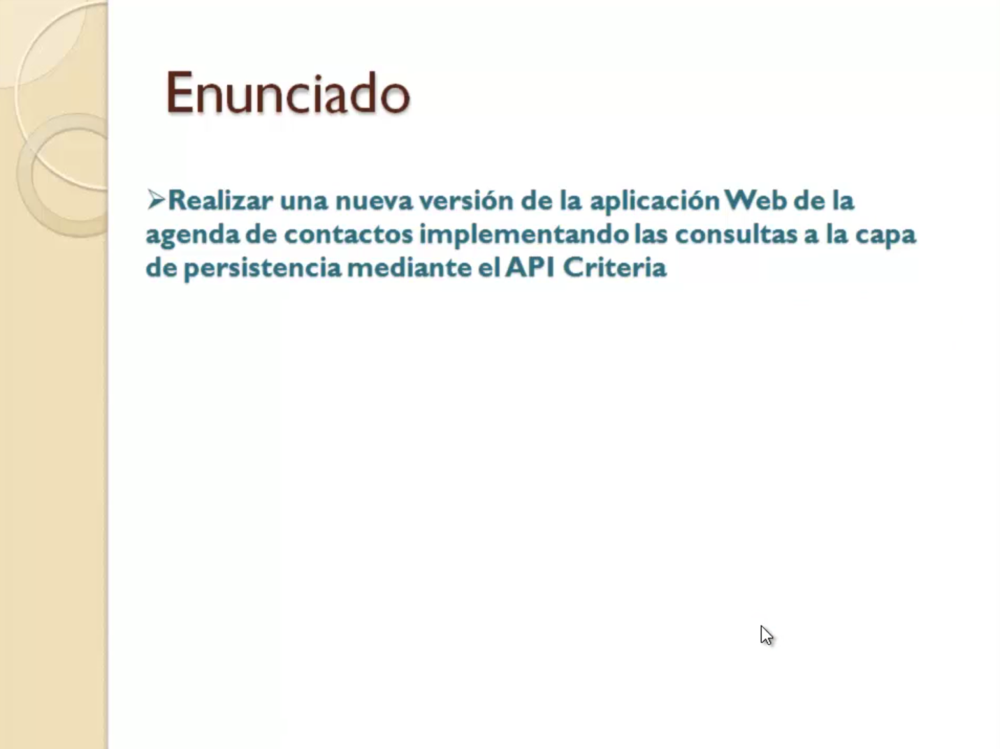

Después de haber estudiado la gritería he visto que es un poquito más complejo que la utilización de J.P. cuele para realización de consultas.

Por tanto vamos a ver si en este ejercicio práctico lo aclaramos todo su funcionamiento se trata de realizar una nueva versión más de la aplicación web de la agenda de contactos.

Pero la consulta la vamos a implementar con la Criteria en lugar de JRE en el ejercicio pues vamos a ver ya lo tengo yo hecho aquí vamos a analizarlo es el 07 quiroprácticos 6 que podrás encontrar en la zona de recursos para que te lo descargues y en principio lo que he hecho es crear una copia del ejercicio práctico 2 que ya teníamos creado e implementando una aplicación web con moda arquitectura Modelo Vista Controlador donde la lógica de negocio la teníamos en gestión contactos y gestión a usuarios.

Bueno pues todos lo teníamos hecho con JPA y ahora vamos a ver cómo sería esas mismas operaciones.

Concretamente en la parte de las consultas claramente pero utilizando la API Criteria en lugar de JPQL.

Entonces nos vamos a centrar en el único cambio a las únicas clases donde hay que hacer cambios son en contactos es decir usuarios el resto tanto entidades como servlet como páginas JSP.

Obviamente permanece igual puesto que lo único que cambia es la lógica de acceso a la capa de persistencia concretamente la manera en la que vamos a enviar las consultas.

Vamos a empezar por gestión contactos contactos teníamos una serie de métodos teníamos el método privado que nos devuelven Timaná ayer.

Lógicamente eso se mantiene.

He visto que hemos cambiado el nombre de la Unidad de persistencia.

También existen en XML lógicamente para adaptarlo al nuevo ejercicio.

Y bueno pues las dos métodos los dos métodos que teníamos de alta de contactos lo dejamos igual porque para hacer una operación básica Crook con los métodos en este caso pero si eso no lo vamos a hacer con API Criteria petitorias para hacer consultas enviar consultas en lugar de JPEG suele hacerlo con este app.

Entonces el primer método donde vamos a aplicar Criteria es recuperar contactos que se recuperan todos los contactos de la base de datos.

Aquí creamos construimos el Criteria Builder el criterio de QWERTY a partir de la clase contacto el objeto RUV también utilizando el método from de Criteria.

Y bueno pues una vez que tenemos ya el Criteria Cury configurado o lanzamos un Select con el Roiz y esto sería el equivalente pues al Seele de todos los contactos a partidos seguiría Ueli y creamos Twitter QWERTY y sulkys.

Esto lo teníamos lo habrás visto en el ejemplo que teníamos puesto en la documentación en el documento donde se explicaba la pequeña historia en la lección anterior en cuanto a buscar un contacto a partir de un determinado email aquí ya tenemos que proponer una condición.

Por lo tanto después de hacer el Select del criterio injury todas estas situaciones como son las mismas que antes pues aplicamos el método huera donde aplicamos una condición llamada método Equal de Criteria Builder donde el email tenga que ser igual al valor de la variable email que se pasa como parámetro.

A partir de ahí cuando ya tenemos el Quiteria Kuric confeccionado creamos el Taipe QWERTY y de nuevo GAD3 un Liss en este caso nos quedamos con el primer resultado por si acaso hubiera más de uno que correspondería con el contacto primero que cumplan la condición que tenga cuyo valor de email sea igual al de esa variable.

En cuanto a eliminar contactos eliminar contacto a partir de líder sigue siendo una operación básica del City Manager Remus.

Hay que hacer cambios pero teníamos un eliminar contactos por email que luego no se utilizaba desde la capa de controlador y la vista.

Pero bueno lo teníamos implementado.

Bueno pues aquí sí teníamos que crear una consulta para eliminar por email.

Bueno pues igualmente lo vamos a hacer con Criteria.

Hasta aquí sería lo mismo hasta la creación del root pero en este caso no sería lo mismo porque en vez de crear un criterio evidentemente vamos a crear un criterio del experto si tenemos el criterio Wílder.

Y como ves aquí creamos un Criteria delete de la entidad al contacto que nos devuelve un objeto Criteria delete a partir de él con el método from creamos el robot y luego aplicamos la condición de eliminación.

Igual que tenía un método web el criterio también lo tenía Criteria delete para establecer la condición de eliminación.

En este caso es llamada el método de Criteria Builder donde le vamos a indicar que la columna mail es igual a este valor de la variable.

Una vez que tenemos ya el Criteria delete configurado de esa manera pues llamamos a Criteria Juri y en este caso una llamada a Execute porque no se trata de seleccionar sino de una actualización.

Eso en cuanto a gestión de contactos teníamos otra clase que es gestión usuarios donde se hacía el lock in.

Sin embargo este método autenticar donde recibamos un usuario una contraseña y tendríamos que devolver si el usuario existía o no entonces lanzábamos en su momento en estos días JP QL vamos a verlo con Criteria Criteria aquí sería crear de nuevo un Criteria Cueli porque se trata de una selecta lanzamos una serie de raíz de decir esto serían las cuatro mismas instrucciones que en el caso de la gestión en contacto donde se hacía una búsqueda de los contactos y bueno a la hora de establecer la condición método web.

Pues en este caso ya no se trata de que cumpla una única condición que tal columna sea igual al valor que cumplir dos.

Por lo tanto deben estar dentro de una llamada al método de Criteria Builder donde le vamos a pasar las dos condiciones que usuarios e igual a la variable usuario y que sea igual a la variable PWR que tenemos el método al or si la condición fuera que cumpla una u otra podremos pasarle varias condiciones método al método y así podemos confeccionar una consulta más compleja. 

Bueno pues una vez que tenemos el criterio Aquaris pues como siempre el PP adquiere a partir de ahí una llamada Persinger Rasul para ver si se obtiene un resultado de un usuario que cumpla esa condición.

Si devuelve un resultado entonces esta instrucción se ejecutará normalmente se devuelve true bueno esto sería realmente lo mismo que ya teníamos hecho en la versión anterior puesto que a partir de inserta y pecarí todo es igual e independientemente de que es utilizado JPQL o Quiteria.

Bueno pues esto sería esas funcionalidades implementadas a través de la victoria como es pues bueno pues es un poquito más complejo que J.P. QL pero permite construir dinámicamente y no depender de una cadena corta huele que en algunos casos esto ofrece esa ventaja de poder como digo con modificar y confeccionar dinámicamente la consulta.

# Autoevaluación VI 01:00

1. Si queremos al cargar una entidad queremos que su objeto u objetos relacionados se carguen también en ese momento, habrá que indicar en la anotación de relación:
   * `load=LAZY`
   * `fetch=FetchType.LAZY`
   * `load=EAGER`
   * `fetch=FetchType.EAGER` :+1:

2. Si no se indica nada en la anotación de relación
   * Todas las operaciones que se realicen en la entidad son propagadas a los objetos relacionados
   * Ninguna de las operaciones sobre la entidad es propagada a los objetos relacionados :+1:
   * Solo la operación de actualización es propagada a los objetos relacionados
   * Solo la operación de eliminación es propagada a los objetos relacionados

3. Indica cual de las siguientes afirmaciones sobre el API Criteria es verdadera
   * Se emplea para realizar las mismas operaciones de eliminación, actualización, inserción y recuperación que se hacen con los métodos de EntityManager
   * Requiere que toda la configuración de las consultas se realice en XML
   * Es una alternativa al uso de Query y TyperQuery :+1:
   * Se basa en definir operaciones mediante anotaciones

4. La carga de datos relacionados en una relación muchos a muchos
   * Es siempre de tipo Lazy
   * Es siempre de tipo Eager
   * Es aleatoria
   * Se configura igual que en el resto de relaciones :+1:

5. Para establecer las condiciones en una consulta de selección de entidades, generada por el API Criteria
   * Utilizaremos el método select de CriteriaBuilder
   * Utilizaremos el método where de CriteriaBuilder
   * Utilizaremos el método where de CriteriaQuery :+1:
   * Utilizaremos el método where de Root
 


SOLUCIONES:

1.-D

2.- B

3.- C

4.- D

5.- C

# Resumen final 07:25

Bueno pues ya hemos llegado al final de este curso a modo de resumen si te parece vamos a repasar un poquito los conceptos que hemos visto a lo largo del mismo.

Empezamos hablando de lo que era una capa de persistencia que nos permitía exponer los datos a la aplicación en forma de objetos los que llamamos entidades y esa capa de persistencia puede ser creada y también manipulada desde la aplicación utilizando el estándar de Java Java persistan API que forma parte de la especificación Java.

Java persiste en API pues dispone de un objeto principal conocido como Timaná ayer que nos proporciona una serie de métodos para realizar las llamadas operaciones básicas Cruzat de crear recuperar actualizar y eliminar entidades que se traduce en hacer esas operaciones por detrás que las lleva a cabo el motor de persistencia.

La base de datos estos métodos serán el percibís para hacer la persistencia o añadir nuevas entidades actualizar entidades eliminar entidades y localizar entidades recuerda que estas tres operaciones que implican una acción en la base de datos están englobadas dentro de una transacción que en caso de utilizó en Enterprise Java Bin como vimos esas transacciones serán gestionadas automáticamente por el contenedor JB no tendríamos que preocuparnos del código de iniciar confirmar transacciones por supuesto también hemos visto las consultas como una parte muy importante de JPA ya que aparte de esas operaciones.

Si queremos hacer operaciones más complejas que impliquen por ejemplo recuperar entidades en base a criterios diferentes a la primera íQué y eliminar conjuntos de entidades etcétera pues tenemos que recurrir como digo a las consultas que se ejecutan a través de o bien el objeto qwerty o Taipe.

Esas consultas se definen utilizando un lenguaje basado en SQL conocido como J.P. cuelen Java persista en qn a la hora de generar las consultas que da las consultas.

Podemos utilizar consultas estándares que se definen dentro de la propia el propio código.

Como ves aquí en este ejemplo las consultas pueden ser parametrizada es decir determinados valores pueden no conocerse en el momento de crear la instrucción y proporcionarse después como parámetros en vez de andar concatenando valores y demás en la propia instrucción se pronuncian como parámetros que pueden ser parámetros definidos o bien por posición o bien por un nombre y también vimos que otra variante a la hora de crear las consultas es en lugar de definirlas como en estos casos en el propio código.

La definíamos en la entidad las llamadas equally o consultas nominadas a la hora de trabajar con ellas.

Luego en el código creábamos creamos el objeto qualia asociado a la consulta utilizando creatinina Mercuri en lugar de create QWERTY indicando el nombre de la consulta que se le había asignado al crearla dentro de la entidad como es el lenguaje JPQL es la parte esencial a la hora de crear una consulta y hemos visto que existen realmente tres tipos de instrucciones JPQL la Sele cuyos formatos ves aquí tres ejemplos de cada una.

SELECT UPDATE DELETE.

Tres ejemplos de clásicos de utilización de dichas instrucciones que una vez definidas se proporcionan al objeto a la hora de crear el objeto KERI o Taipe.

Si bien si vienen directamente o ya se han especificado Mercuri y ya una vez que ya las tenemos podemos ejecutarlas vimos también cómo podíamos relacionar entidades a fin de facilitar las operaciones.

Cuando trabajamos con un conjunto de entidades que tienen alguna relación entre ellas es decir a nivel de tabla tienen un campo común pero a nivel de entidad eso se traduce en que un objeto de una entidad incluye en su interior todos los objetos relacionados.

Entonces qué ocurre.

Que por ejemplo vas a obtener recuperar una entidad.

Por ejemplo hacer un fin o una consulta de un conjunto de entidades.

Recuperamos también los objetos relacionados con lo cual las operaciones en el código luego se simplifican bastante las relaciones podrían ser uno a muchos una entidad le corresponden muchos objetos de otra muchos a uno es decir a varias entidades estas tienen asociado el mismo objeto de otra de otra entidad o muchos a muchos a la hora de configurarlas pues aquí vemos unos ejemplos de las anotaciones que culturizar en cada caso y también de las anotaciones a nivel de definición de lo que son las columnas de relación o relaciones a nivel de tabla de la base de datos.

No todo se podía resolver con relaciones y con instrucciones J.P. cueles simples es decir hay algunas consultas complejas que solamente se pueden resolver uniendo entidades dentro de la consulta a través de una cláusula que también se dispone de ella en el lenguaje SQL estándar que la cláusula Yeung nos permite como ves aquí pues a la hora de seleccionar una entidad que es una relación del tipo de lado no mucho del lado uno por ejemplo a la hora de seleccionar producto pues esa entidad a la hora de relacionarla conventos para establecer la condición a través de ventas pues no se podría hacer directamente en una instrucción habría que recuperar todos los todos los productos y sumando lo bueno sería algo bastante complejo como ya vimos en un ejercicio que te presente entonces a través de la cláusula Yeung.

Se puede indicar cuál es ser la entidad de relación a quién sería SELECT FROM productode Yeung la palabra reservada y luego indicas cuál es el atributo muchos que contiene la colección de ventas al que se le asocia un alias para después poder establecer la condición sobre esa entidad venta sobre todo cuando tenemos varias.

Aparte de este caso sí hay varias entidades implicadas a utilizar yo y no es una cosa que simplifica enormemente lo que sería la creación de las instrucciones una vez que ya tiene la instrucción completa o con se construyen los objetos que nos van a permitir ejecutarlas.

Y por último también estuvimos hablando de la API Criteria aparte de otros elementos que vimos como por ejemplo actualizaciones en cascada la carga de datos rápida o carga perezosa.

También vimos cómo crear primero X compuestos y finalmente hablamos de la API Criteria que nos permite definir consultas dinámicamente sin utilizar JPQL.

Esto ofrece cierta flexibilidad a la hora de crear las consultas.

Vimos que también creaba o generaba cierta complejidad puesto que como veis están implicadas nuevas clases aparte de lo que son más clásicas las interfaces QWERTY el ayer evidentemente para construir las consultas en vez de utilizar una cadena instruccion J.P. suele empleábamos el Criteria Builder que es el creador de consultas el objeto root para hacer referencias a las entidades sobre las que se va a trabajar y luego ya depende de la consulta utilizar si es de selección 7 eliminación de actualización pues tienes Criteria Couric Criteria Deloitte Criterium respectivamente pues esto es todólogo lo que hemos visto en el curso espero que hayan disfrutado con él y que haya sido de tu agrado.

En cualquier caso ya sabes que estoy aquí para responder a cualquiera de tus dudas y para atenderte en todo lo que pueda necesitar.

Un saludo y gracias.
