# 1. Instalación y Configuración de Git para Eclipse 13:55

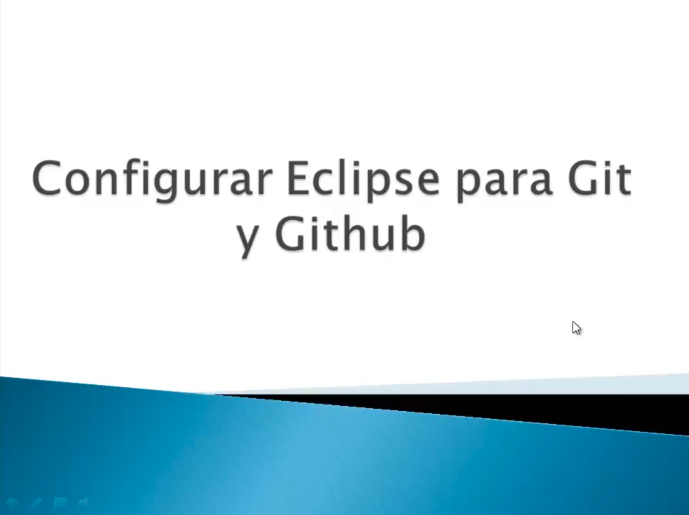

Vamos a ver trabajar con Git para trabajar con proyectos, compartirlos con los miembros del equipo y llevar un contro de versiones del mismo. Lo primero que veremos es como utilizar dentro de Eclipse tanto Git como GitHub y es que aun que son herramientas que se pueden utilizar en la línea de comandos lo habital es integrarlo dentro de los IDEs. 

## Git

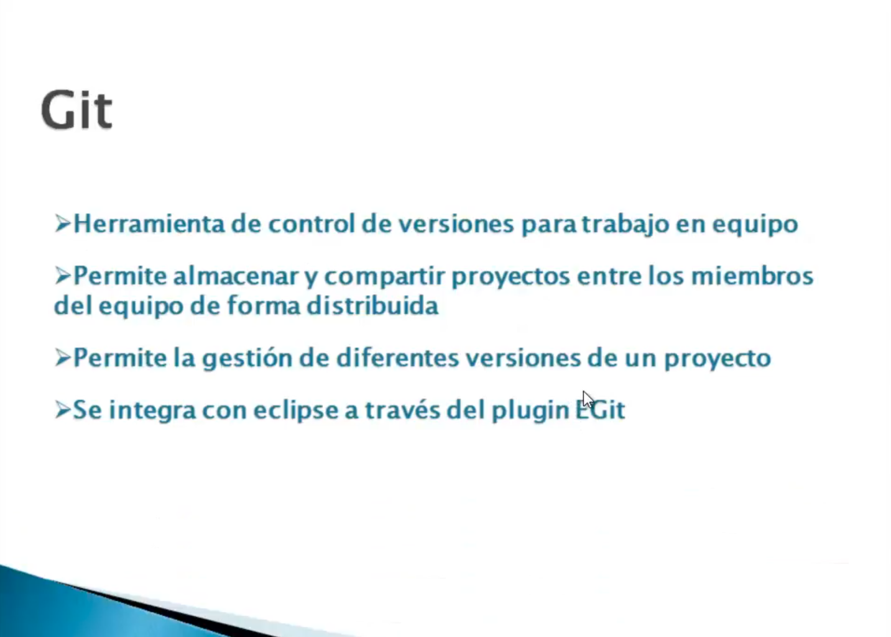

En primer lugar vamos a ver lo que es Git, Git es una herramienta de control de versiones para trabajar en equipo y a través de el podemos almacenar y compartir proyectos entre los miembros del equipo de forma distribuida, permite gestionar diferentes versiones del proyecto, mientras un miembro del equipo puede estar desarrollando parte del proyecto y subirlo a un repositorio otro miembro del equipo puede descargarse dicho proyecto a añadir sus ambios volverlo a subir etc., cada uno puede estar trabajando con su repositorio local y después sincronizarlo con el repositorio remoto.

Para poder trabajar con Git dentro de Eclipse existe el Plugin EGit que en la versiones más recientes ya viene instalado por defecto. Egit nos permite integrar Git dentro de Eclipse y poder relizar las tareas habituales de una forma comoda y sencilla.

## GitHub

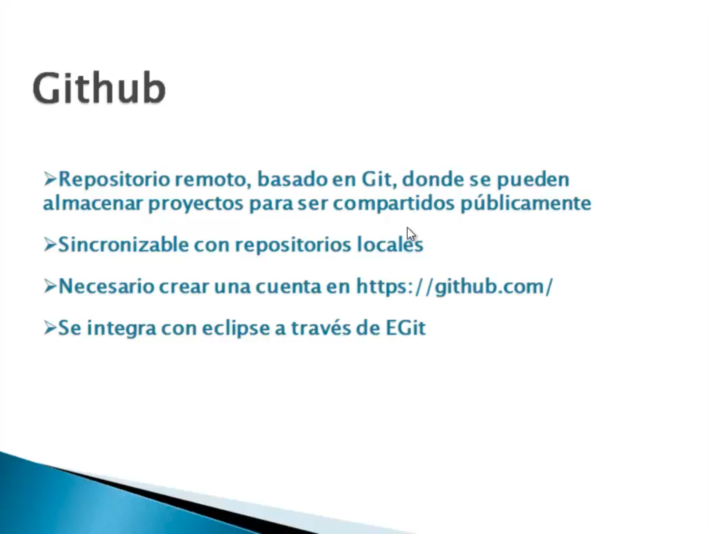

Deciamos también que ademas de que cada miembro del equipo puede tener su propio repositorio local donde puede tener las diferentes versiones de sus proyectos existe GitHub que es un repositorio remoto donde se pueden subir proyectos y compartirlos públicamente, se sincroniza con los repositorios locales de cada usuario. También podemos integrarlo con EGit de manera que todas estas tareas de subida y descarga de proyectos desde el repositorio remoto se puedan hacer sin recurrir a la línea de comandos. 

### Crear cuenta en GitHub

Para poder utilizar GitHub lo primero que tenemos que hacer es crear una cuenta en Git Hub.

http://github.com/

Entramos a la página de GitHub y para crear una cuenta nos pide:

* username
* email
* password

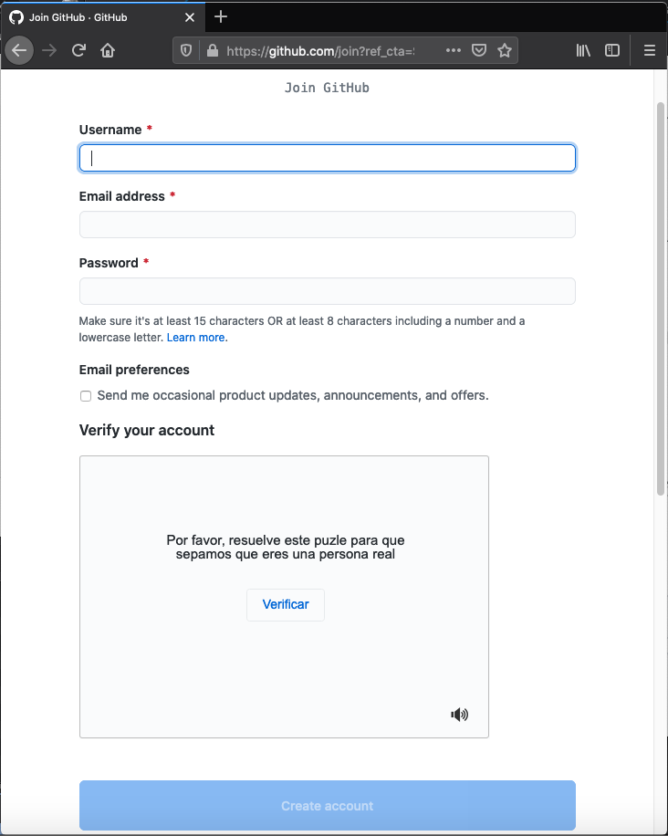

Así de sencillo una vez ingresados los datos se nos mandaría un email para verificar la cuenta y listo.

Una vez creada la cuenta nos autenticariamos y entramos a GitHub.

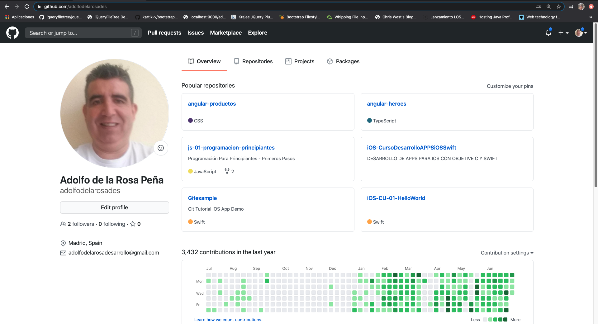

GitHub se organiza en repositorios remotos que suran subidos en nuestro caso desde nuestro entorno de trabajo Eclipse. 

### Crear un nuevo Repositorio

Lo que vamos a hacer es crear nuestro nuevo repositorio para lo cual nos pide un nombre, descripción e indicar si lo queremos crear publico o privado.

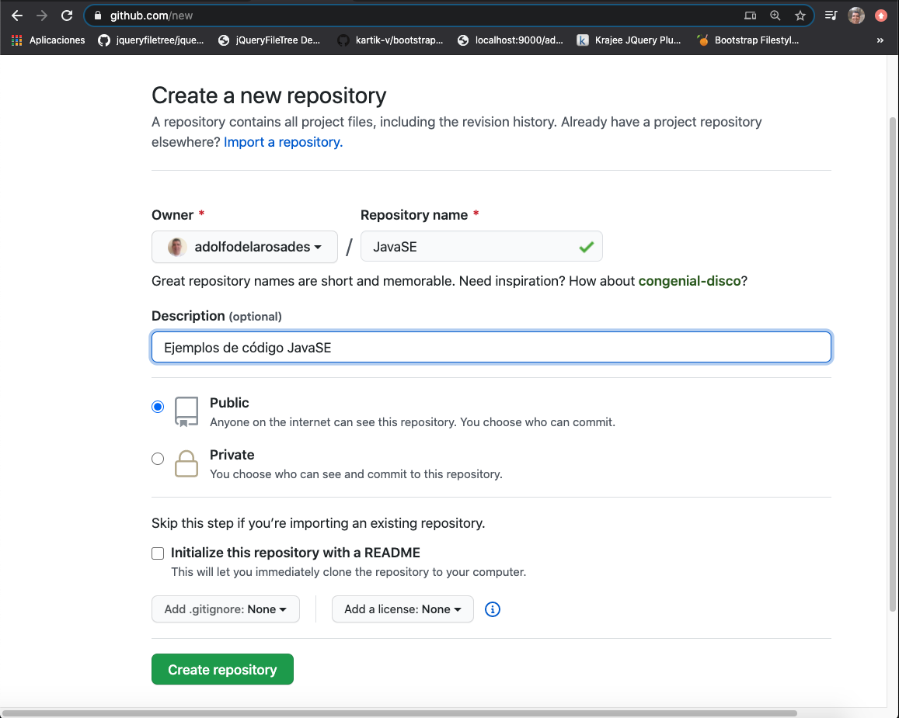

Una vez que presionamos el botón de Crear el Repositorio nos muestra una pantalla con diferetes instrucciones de compo poder usar este repositorio remoto.

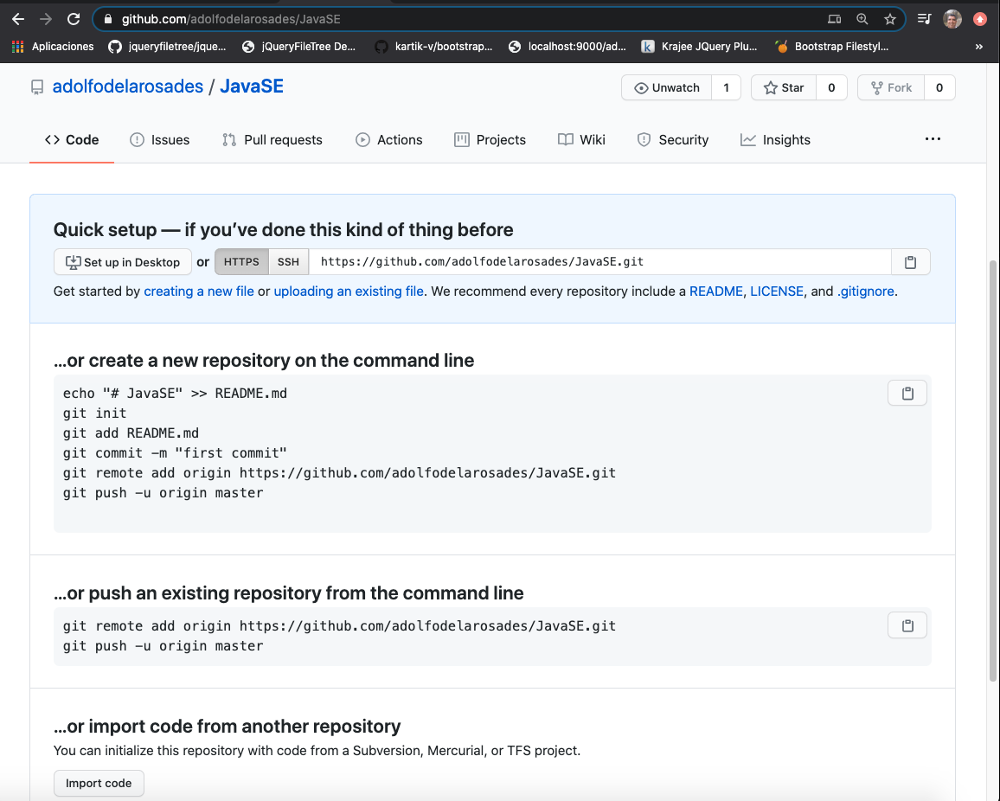

Como en nuestro caso lo vamos a usar desde Eclipse lo más relevante para nosotros es la dirección:

https://github.com/adolfodelarosades/JavaSE.git

Que como veremos más adelante nos servir para poder configurar desde Eclipse el uso de GitHub.

Hasta ahora ya hemos creado nuestra cuenta en GitHub y creado un nuevo repositorio ahora vamos a Eclipse.

### Configurar Eclipse para usar Git y GitHub

#### 1. Instalar EGit

En Eclipse lo primero que tendríamos que hacer es instalar el Plugin EGit, pero como hemos mencionado antes en las últimas versiones de Eclipse ya viene instalado por default pero si no fuera el caso hay que instalarlo. 

Nos vamos al Eclipse Markplace y buscamos Egit.

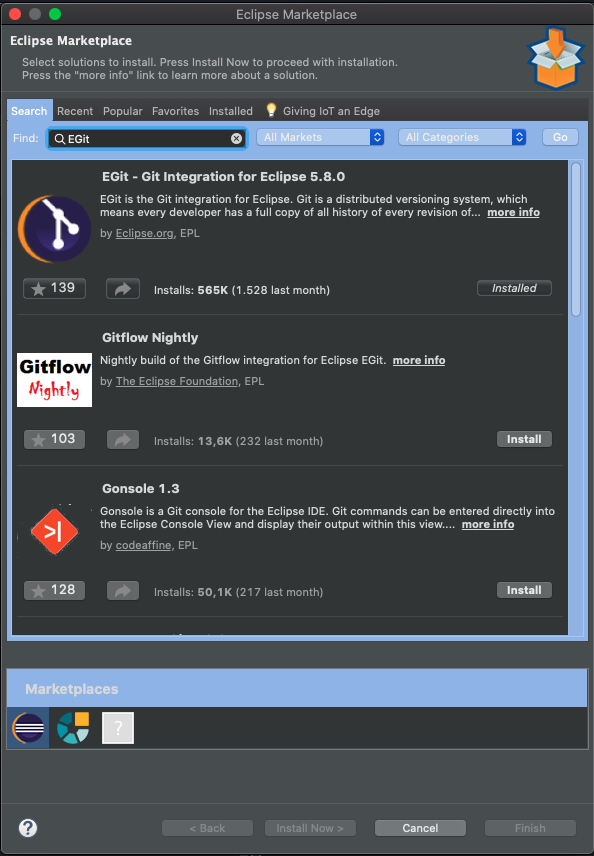

Como observamos ya esta instalado EGit, sino lo instalariamos con las opciones por default y tendríamos que reinicar Eclipse.

#### 2. Proporcionar datos de Identificación de Git y GitHub

Lo que tenemos que hacer ahora es proporcinar unos datos de identificación que nos serviran para interactuar con Git y GitHub. Vamos a *Preferences - Team - Git - Configuration*, esto aparece por que tenemos instalado EGit.

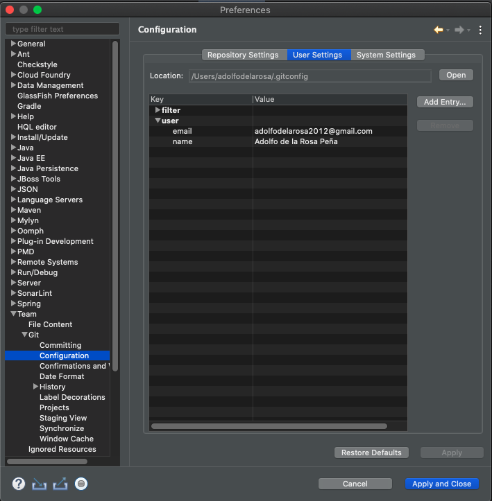

Lo que hemos hecho aquí es añadir un `user.name` y un `user.email` con sus respectivos valores. Estos datos simplemente son idenfificativos, no sirven para acceder a nada.

#### 3. Crear Repositorio Local

Lo que nos falta es crear nuestro repositorio local, tenemos que tener un repositorio donde almacenar las versiones de nuestro proyecto. Para hacer esta gestión nos va a ser de utilidad abrir la vista **Git Repositories** esto lo hacemos con *Windows - Show Views - Others...* y de la lista de vistas nos vamos a *Git - Git Repositories*.

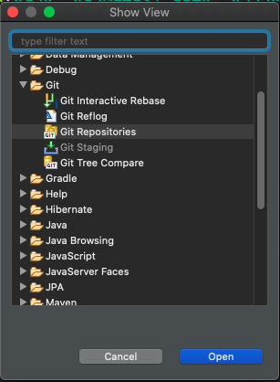

Al presionar OK nos va a aparecer la vista Git Repositories.

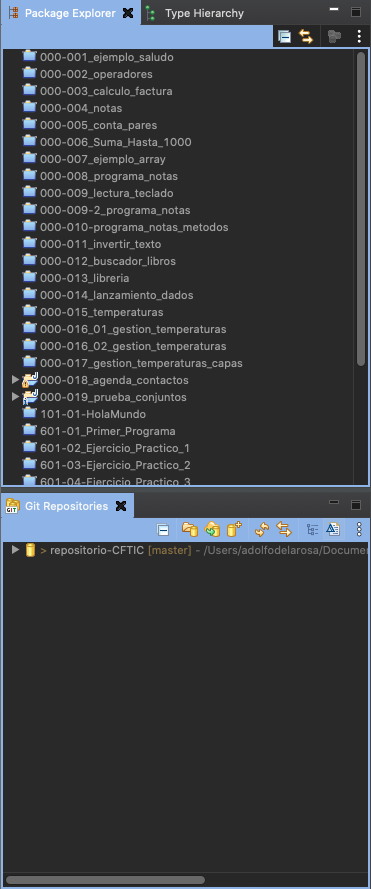

En este caso yo ya tengo un repositorio creado.

En la vista Git Repositories tenemos una serie de botonoes que nos permiten hacer diferentes tareas.

Entre ellos hay uno que es para `Create a new Git Repository and add it to this view` que es el que vamos a presionar.

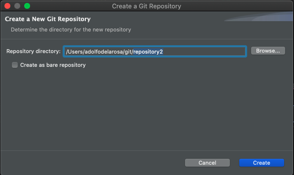

Tenemos que seleccionar la carpeta donde lo queremos tener, por defaul nos aparece el sitio que usa git por default para almacenar los repositorios pero en este caso vamos a seleccionar una carpeta diferente. Lo ideal sería haber creado primero dicha carpeta donde queremos tener almacenado el repositorio, la voy a crear.

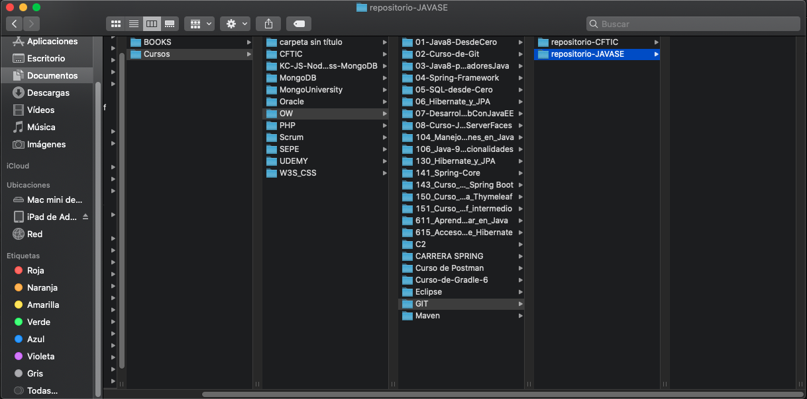

Una vez creada mi carpeta esa es la que voy a seleccionar.

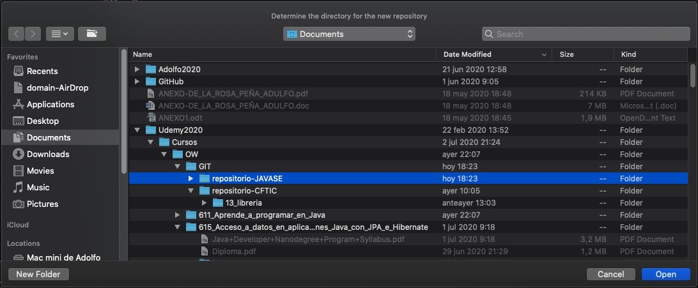

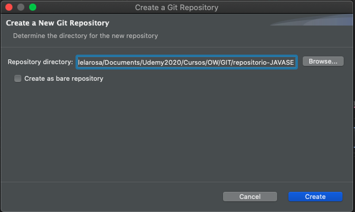

Y una vez que aceptamos ya nos aparece el nuevo repositorio local en la vista Git Repositories.

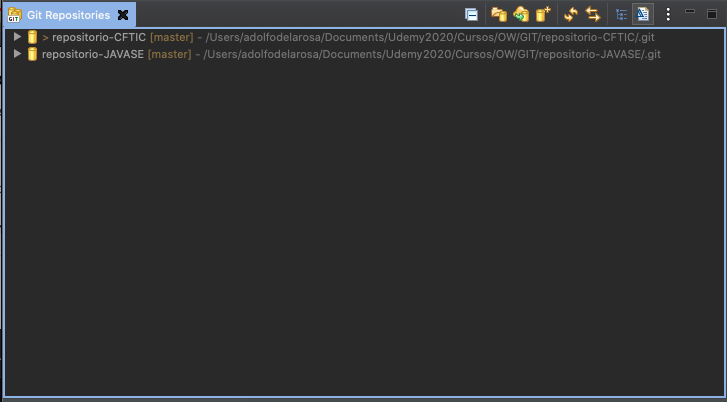

Y si nos vamos a la carpeta del repositorio dentro de ella se ha creado una carpeta oculta `.git`.

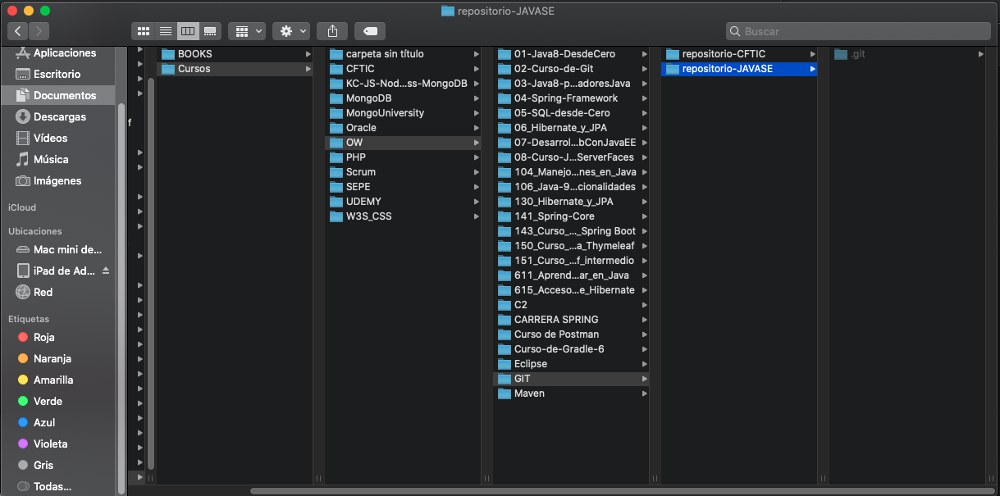

Que es donde se va ir almacenando toda la información del repositorio, las diferentes versiones,, cambios y demas.

Con esto ya tenemos creado nuestro repositorio local, de nuestro equipo y donde queremos controlar las diferentes versiones del proyecto. Pero también quremos conectarlo con el repositorio remoto para compartir las versiones de los proyectos con otros miembros del equipo.

#### 4. Conectar Repositorio Local con el Repositorio Remoto

Para hacer la conección del Repositorio Local con el Remoto lo que hacemos es expandir nuestro repositorio local `repositorio-JAVASE`.

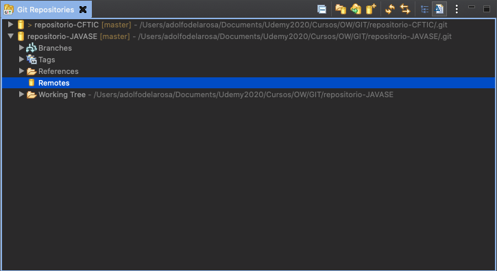

Sobre remote presionamos el botón derecho.

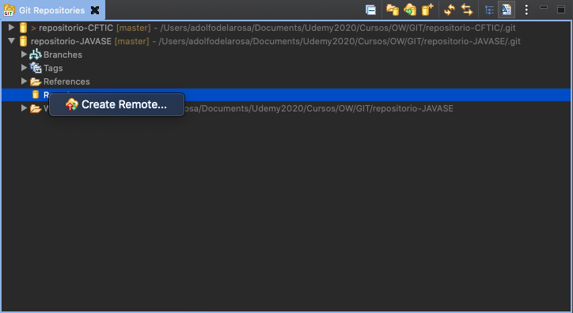

Y nos aparece `Create Remote...` lo pulsamos.

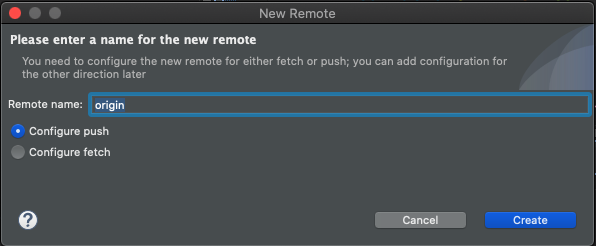

Simplemente presionamos OK dejando `origin` y presionamos el botón `Create`

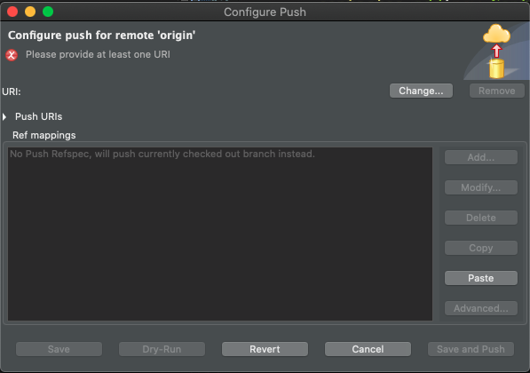

Presionamos el botón `Change...`

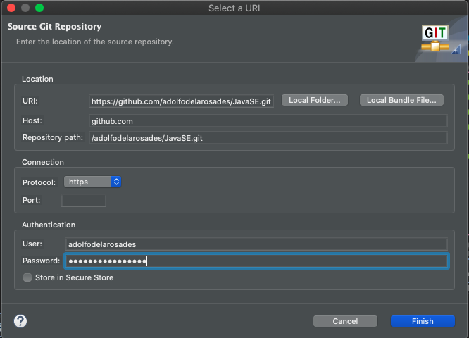

En esta ventana es donde se me pide toda la información de conección con el repositorio Remoto es aquí donde debo meter la URI que me genero al crear el repositorio en GitHub junto con mis credenciales.

Con esto tendríamos la conexión entre el repositorio Local y el remoto.

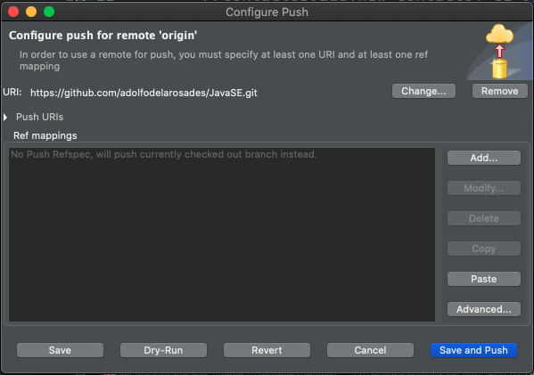

Salvamos la configuración con `Save`.

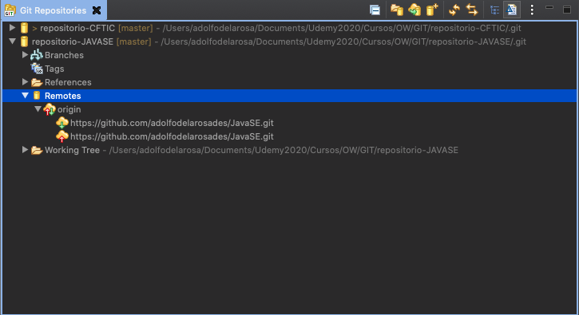

Ya tenemos todo listo para a partir de ahora empezar a crear proyectos, subirlos a GitHub, controlar versiones algo que vamos a ver en la próxima lección.

