# 3. Recuperar versiones anteriores 4:17

En esta lección vamos a ver como recuperar versiones anteriores de archivos que han sido almacenados en un repositorio Git desde Eclipse. 

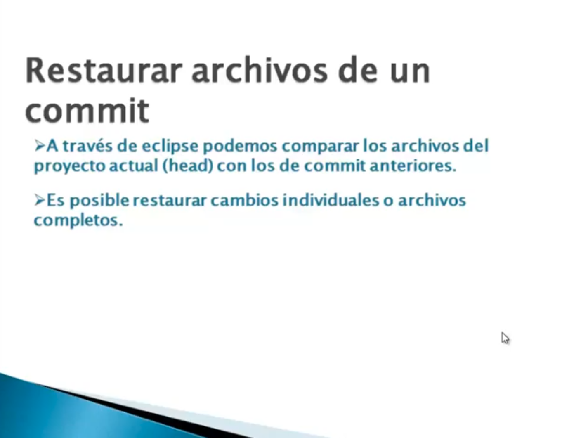

La idea es poder restaurar algún archivo desde un Commit anterior, a través de Eclipse vamos a poder comparar los archivos del proyecto actual con los Commits anteriores, ver las diferencias que hay y si queremos poder restaurar los cambios realizados a la nueva versión. Como ya hemos visto podemos dar en.

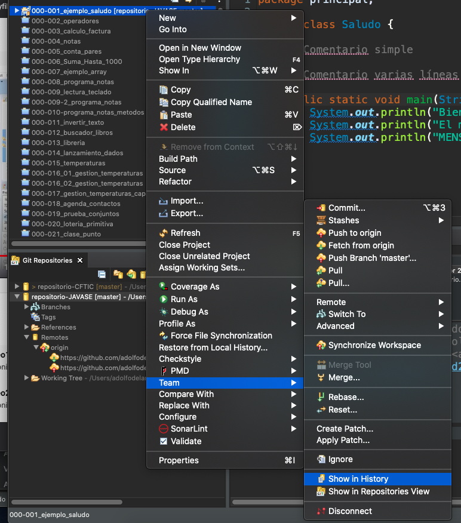

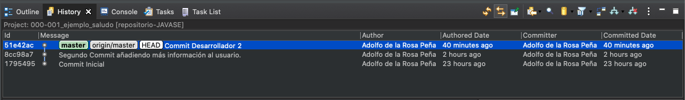

Podemos ver todos los commits realizados, si nos interesaria ver como era el estado de nuestro unico archivo en el Commit inicial nos posicionamos en el y con el botón derecho seleccionamos `Open in Commit Viewer`

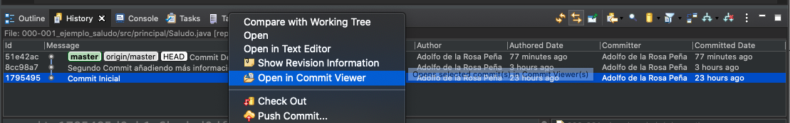

Se abre una ventana con todos los archivos que se subieron en ese Commit y podemos pulsar sobre el que nos interese.

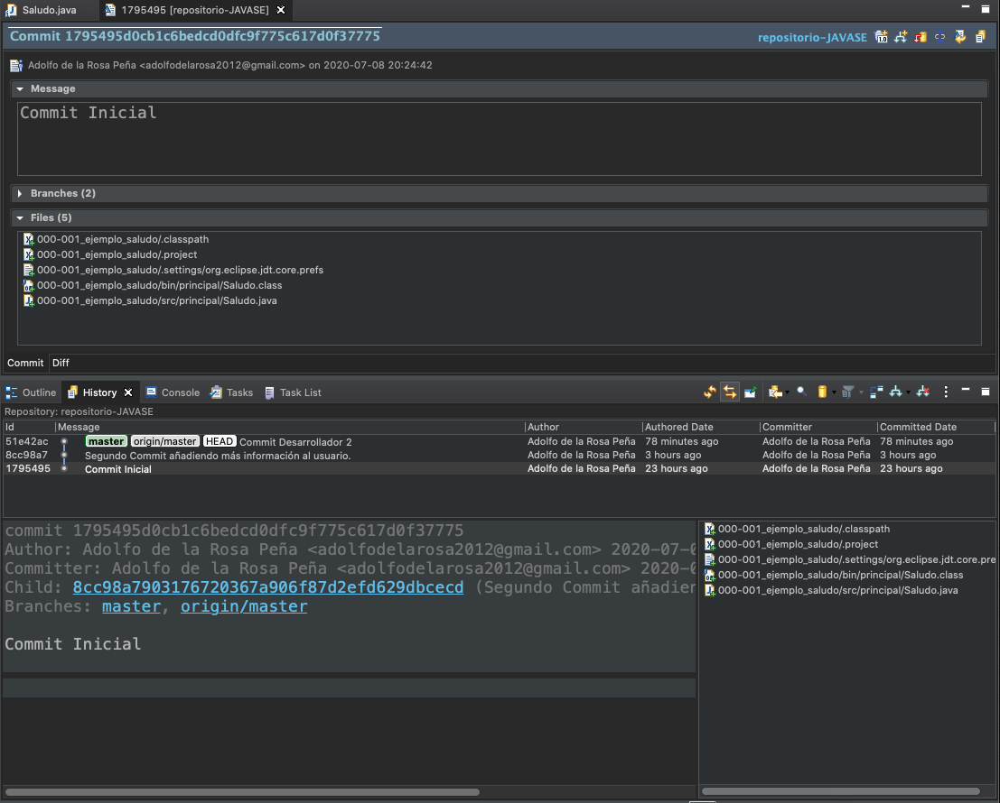

En este caso vamos a pulsar doble click sobre `Saludo.java`

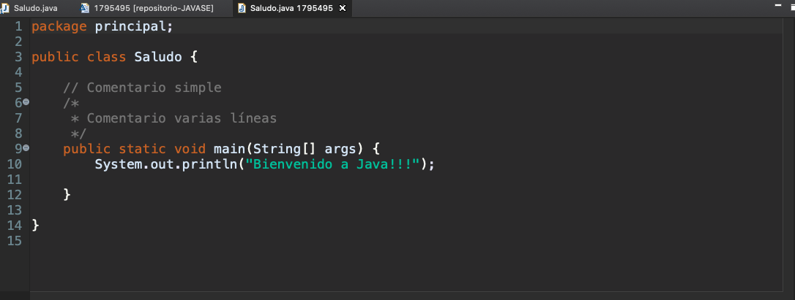

Se abre el archivo en el estado que esta en ese Commit Inicial simplemente para visualizarlo, también podríamos copiar cosas de el al archivo actual pero existe una opción más práctica.

Vamos a hacer una compariva entre el Archivo actual y el de el Commit Inicial. En este caso nos vamos a posicionar sobre el archivo botón derecho *Compare With - Commit*

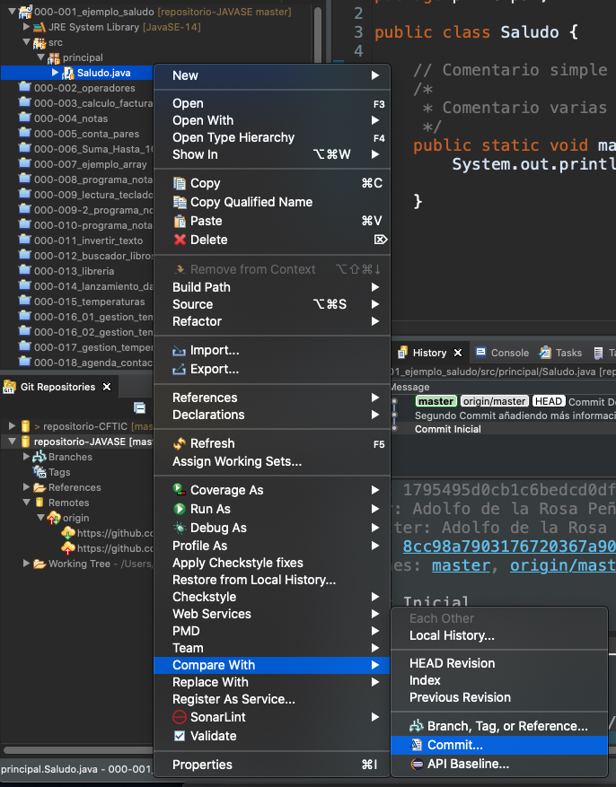

Nos sale la lista de los Commits.

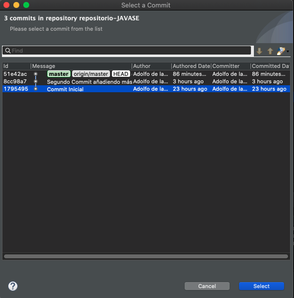

Elegimos contra cual queremos comparar, vamos a seleccionar el Commit Inicial.

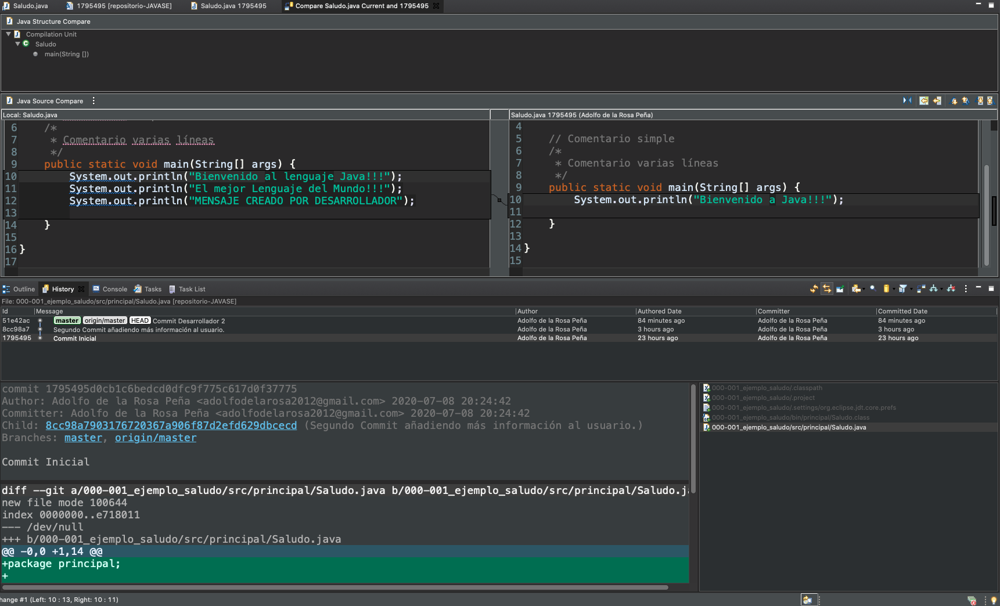

Nos sale una ventana donde compara ambos archivos como lo hacia cuando haciamos la comparación Local que vimos en la sección 2. Vamos a restaurar el archivo actual como lo teniamos en la versión inicial pulsando en el botón `copy currence Chance from rigth to Left` y nos queda lo siguiente.

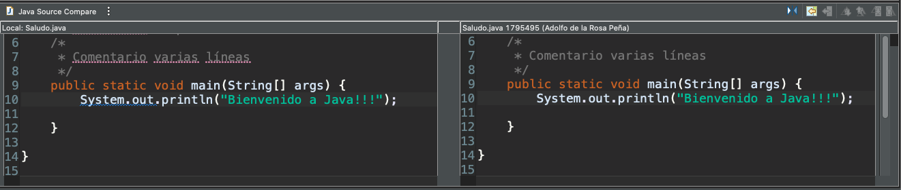

Salvamos los cambios.

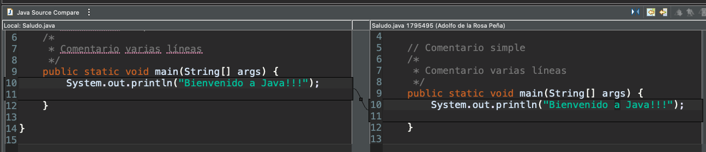

Ya no hay diferencias.

Finalmente vamos a realizar un Commit and Push para almacenar los ultimos cambios.

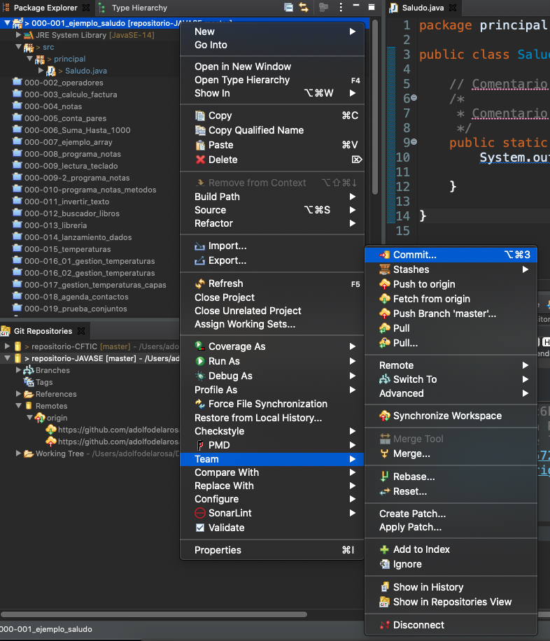

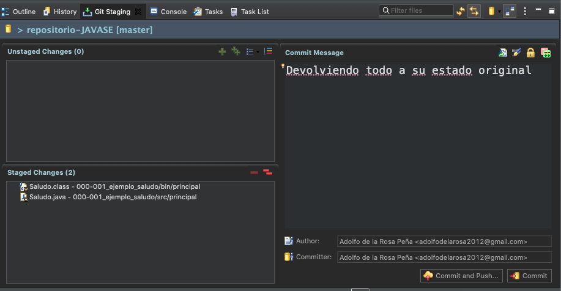

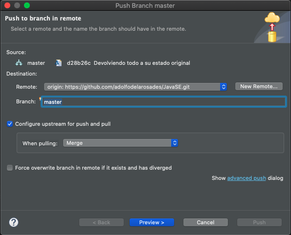

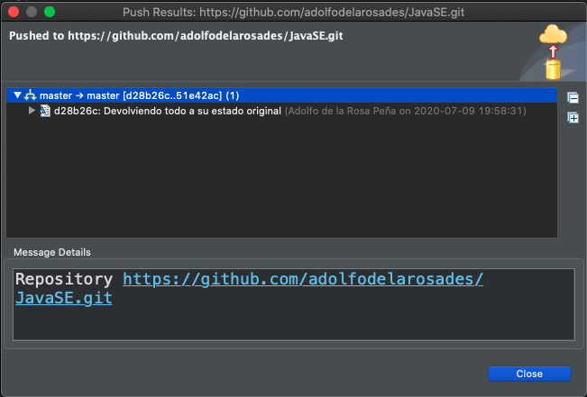

Y ya tenemos los cambios en el repositorio remoto.

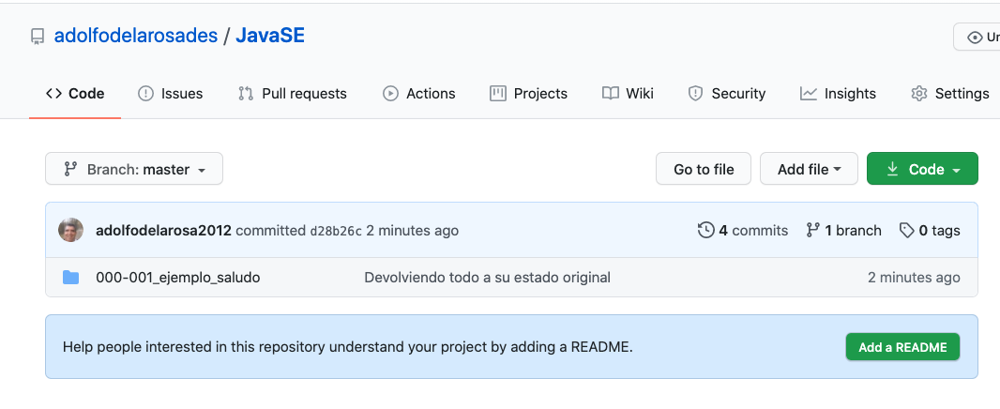

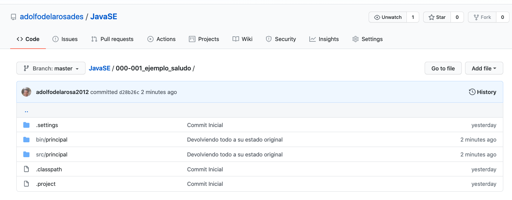

