# ANEXO I

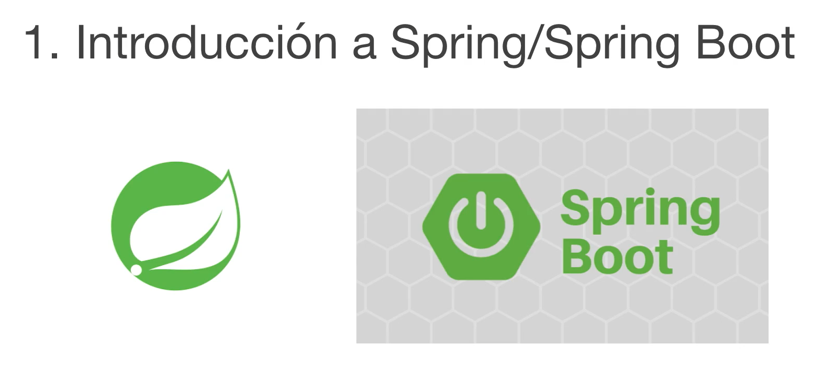

En este módulo vamos a hacer una introducción a **Spring** y **Spring Boot**, aunque realmente el curso presupone que el alumno conoce Spring y nos centramos más en la explicación de Spring Boot y más en concreto en cómo hacer API REST con Spring Boot y más tarde microservicios con **Spring Cloud**, vamos a hacer una pequeña introducción a Spring y Spring Boot y a sus conceptos principales para entender mejor porque hacemos lo que hacemos en los siguientes módulos. 

Voy a dejar también referencias dentro de los materiales del curso a distintas páginas web o libros que pueden servir para profundizar más en el tema, pero con lo que vamos a explicar en este modulo va a ser suficiente para conseguir las implementaciones que vamos a hacer a lo largo del curso.

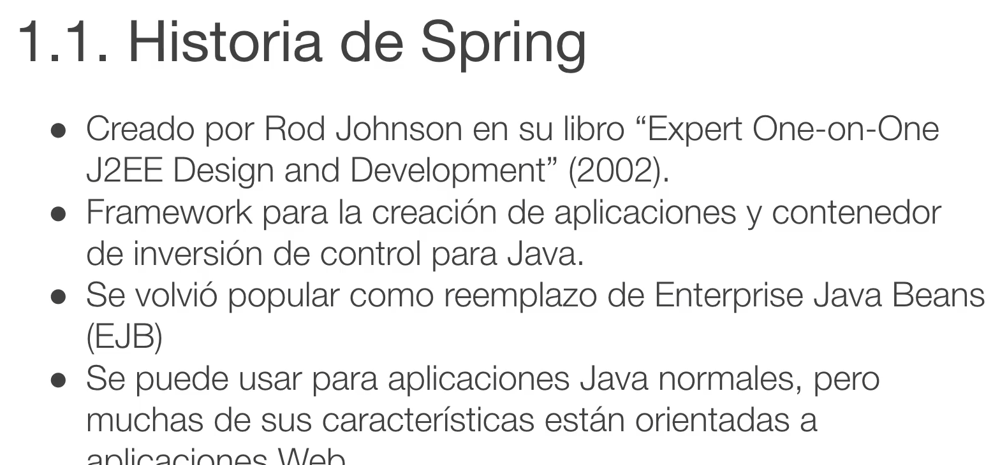

Vamos a empezar por la historia de Spring, Spring fue creado por Rod Johnson en su libro ["Expert One-on-One J2EE Design and Development"](https://learning.oreilly.com/library/view/expert-one-on-onetm-j2eetm/9780764558313/) el explicaba los patrones de arquitectura que el seguía a la hora de desarrollar aplicaciones J2EE y en este libro explicaba método de configuración a través de archivos XML externos, cómo utilizar la inyección de dependencias de manera correcta, cómo utilizar la programación orientada a aspectos y los ejemplos de este libro de cómo implementaba el las aplicaciones Java dieron lugar al ***Proyecto Spring***.

***Spring es un Framework*** para la creación de aplicaciones y a su vez ***es un Contenedor de Inversión de Control*** para Java. Ahora después veremos en qué consiste la inversión de control.

Se volvió popular como reemplazo de los Enterprise JavaBeans y también acabo sustituyendo a **Struts** como framework principal del desarrollo de aplicaciones web.

Se puede usar para aplicaciones Java normales pero muchas veces sus características están orientadas a aplicaciones Web.

Estas son las distintas versiones y el año en el que fueron publicadas hasta la fecha, ***Spring Boot sigue otra numeración***.

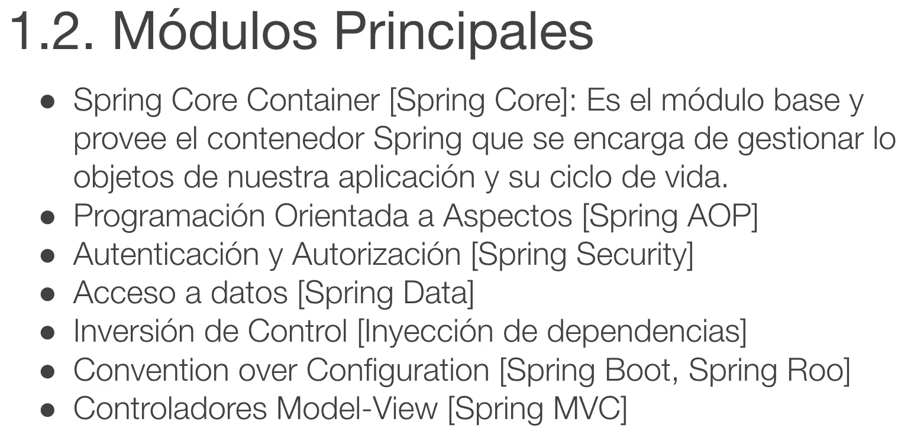

Los módulos principales, el principal es el **Spring Core Container** que está dentro del módulo **Spring Core** es el módulo base y provee el contenedor de Spring que se encarga de gestionar los objetos de nuestra aplicación y su ciclo de vida.

Con Spring y con la inversión de control el objetivo es que no tengamos que utilizar la palabra reservada 
`new` o sea nosotros no vamos a ser los responsables de instanciar los objetos de nuestra aplicación, va a ser el contenedor el que se encargue de instancia esos objetos y controlar su ciclo de vida, es decir destruirlos cuando ya no sean necesarios o reutilizarlos, almacenarlos y reutilizarlos en caso de que haya otra petición que necesite esos objetos.

Spring también provee herramientas para implementar ***Programación Orientada a Aspectos*** que básicamente es detectar puntos en nuestra aplicación en los que queremos que se apliquen una determinada funcionalidad o lógica, ahora veremos también un ejemplo de cómo se implementaría esto con Spring y nos ayudará a entender mejor a lo que me refiero.

Luego también provee un módulo **Spring Security** que nos va a facilitar la gestión de autenticación autorización y todo lo que es la seguridad dentro de nuestra aplicación.

También tiene otro módulo que es **Spring Data** que nos va a facilitar muchísimo el acceso a bases de datos tanto relacionales como no relacionales.

Implementa la inversión de control mediante la inyección de dependencias con una serie de, podemos hacerlo con archivos de configuración XML, así es como se empezó a hacer, pero más tarde se empezaron a utilizar anotaciones y hoy en día se hace todo con anotación, ya veremos como se hace.

Provee también módulos de ***Convention Over Configuration (Spring Boot, Spring Roo)*** que básicamente son proyectos que contienen dentro de si una serie de módulos que nos van a poder proveer una serie de funcionalidades todas integradas por ejemplo, si nosotros necesitamos hacer una aplicación web con seguridad y acceso base de datos pues va a haber tres módulos dentro de Spring Boot que van a ser concretos para eso para eso o sea ***Spring Web*** va a contener todas las dependencias que vayamos a necesitar para generar una aplicación web, vamos a tener otro módulo ***Spring Data*** que va a contener todas las dependencias que necesitamos para el acceso a base de datos y nos permitir generar aplicaciones de una manera muy rápida y muy sencilla y finalmente ***Spring Security*** para todo lo referente a la seguridad.

También contien ***Spring MVC***  qué son los Controladores Model View que al final son los que nos dan las funcionalidades necesarias para crear las APIs REST.

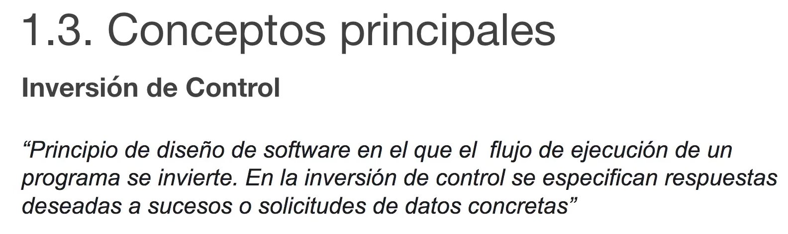

Los conceptos principales

### Inversión de Control

La definición es *"Principio de diseño de software en el que el flujo de ejecución de un programa se invierte. En la **inversión de control** se especifican respuestas deseadas a sucesos o solicitudes de datos concretos"* 

Esto significa que según el principio de la inversión de control, si una clase necesita hacer uso de otra clase, la clase que necesita hacer uso de esa otra clase no debería tener que especificar la implementación de la otra clase. 

Básicamente lo que se utiliza en la inversión de control son interfaces, una clase provee una serie de métodos que tiene disponibles, por ejemplo la interfaz `Vehiculo`, la interfaz de vehículo provee los métodos `arrancar`, `abrirPuerta`, `irHaciaAdelante` y `marchaAtras` todos esos métodos son propiedad de la interfaz `Vehiculo` y esa interfaz la puede implementar un `Turismo`, la puede implementar un `Camion`, la puede implementar una `Furgoneta`, todas esas son implementaciones de la interfaz, todas esas clases y objetos van a contener esos mismos métodos y esa misma funcionalidad, pues según la inversión de control si una clase necesita hacer uso de un `Vehiculo`, esa clase no debería dentro de su propio código decir, voy a crear un `Camion`, sino que debería ser capaz de simplemente hacer uso de un `Vehiculo` independientemente de si ese `Vehiculo` es un `Camion`, es un `Turismo`, es una `Furgoneta`, esto lo que nos da es una agilidad tremenda a la hora de desarrollar nuestras aplicaciones, de testear nuestras aplicaciones, nos da mucha versatilidad por así decirlo, porque podemos cambiar la implementación de las clases muy rápidamente sin tener que hacer muchos cambios en el código ni una refactorizacion muy costosa.

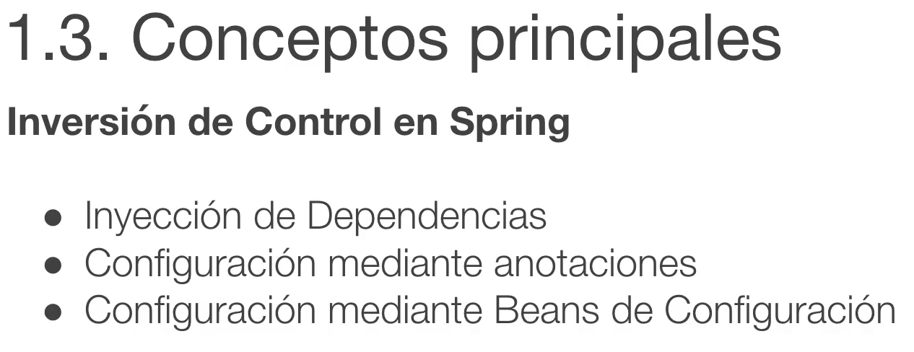

La *inversión de control* en Spring ¿Cómo se implementa?, pues básicamente con la inyección de dependencias, se configura mediante anotaciones aunque en un principio en los orígenes de Spring se hacía mediante archivos XML externos. Se pueden utilizar también Beans de configuración.

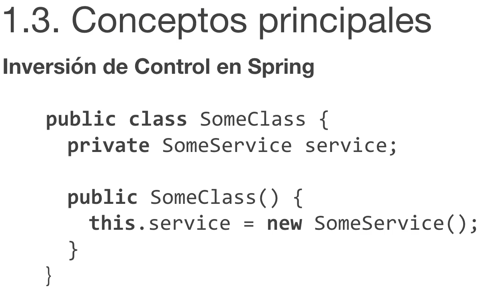

Vamos a ver este ejemplo tenemos una clase y esa clase hace uso de un servicio, imaginemos que esta clase es 
un `Chofer`, `SomeClass` es un `Chofer` y el `SomeService` es un vehículo, pues ese chófer si tiene el carnet que corresponde debería ser capaz de conducir cualquier tipo de vehículo, pero que ocurre si nosotros 
en lugar de `private SomeService service` ponemos `private Camion camion` lo que haríamos es instanciar un nuevo `Camion` y entonces este chófer ya solo sería capaz de conducir camiones.

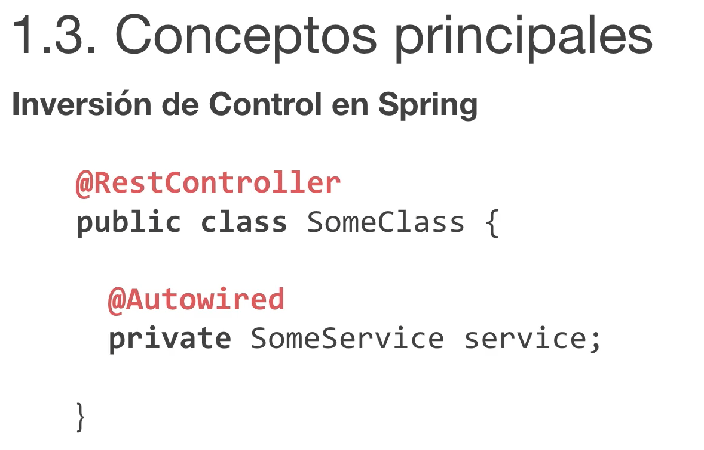

Sin embargo con la *Inversión de Control* lo que hacemos es que ese `Camion` lo vamos a convertir en lugar de que el objeto dentro de la clase `SomeClass` sea un objeto concreto, un `Camion`, este chófer tendría inyectado dentro una interfaz de tipo `Vehiculo` y con el `@Autowired` le estamos diciendo a Spring que en el futuro cuando se arranque la aplicación tiene que buscar una clase que implemente esta interfaz, podría ser un `Camion`, un `Turismo` o una `Furgoneta` nos daría igual la podemos cambiar, crear un objeto de ese tipo e inyectarlo dentro de esta clase por que nosotros ya no vamos a tener que hacer el `new` nunca.

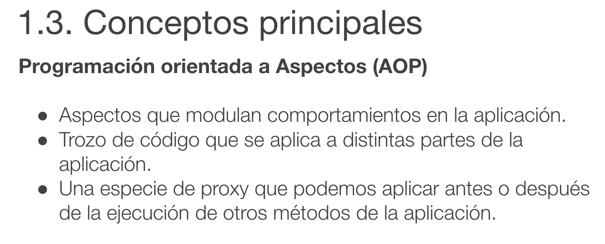

La ***Programación Orientada a Aspectos*** 

Los Aspectos modulan comportamientos en la aplicación, esto significa que es un trozo de código con una lógica concreta que podemos aplicar a distintas partes de la aplicación. Es como una especie de proxy podríamos decir y se puede aplicar antes o después de la ejecución de otros métodos de la aplicación, nosotros le indicaremos el punto en el que se tiene que ejecutar y se va a ejecutar antes o después de cada uno de los métodos que nosotros le indiquemos.

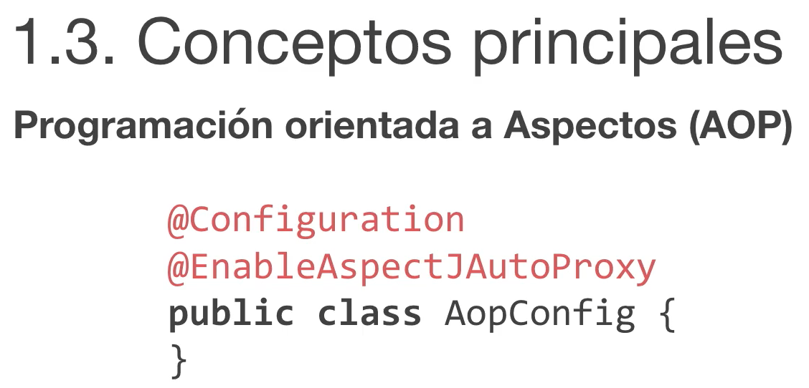

La manera de implementar la programación orientada a aspectos en Spring es mediante una clase de configuración, le podemos llamar como queramos pero lo importante es que lleve la anotación `@Configuration` y la anotación `@EnableAspectAutoProxy`.

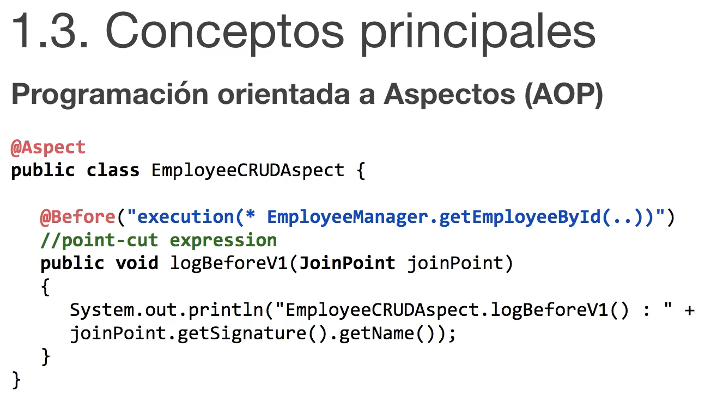

Luego podemos crear una clase tipo aspecto y decir con ese punto de corte `@Before` vamos a decir que este método se ejecute antes de la ejecución de ese método de esa clase. Tenemos una clase `EmployeeManager` que tiene dentro un método que se llama `.getEmployeeById(...)`, cada vez que nuestra aplicación ejecute ese método, antes de que se ejecute este método se va a ejecutar el `logBeforeV1`

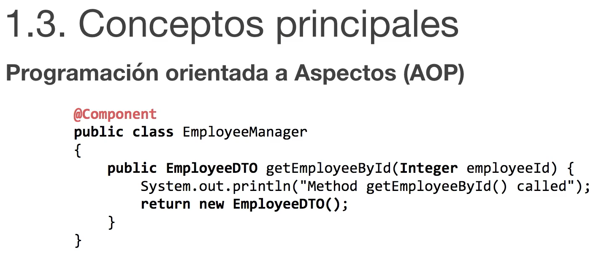

Por lo tanto en la clase `EmployeeManager` tenemos el `.getEmployeeById(...)` y si nosotros ejecutamos este método la salida por consola será:

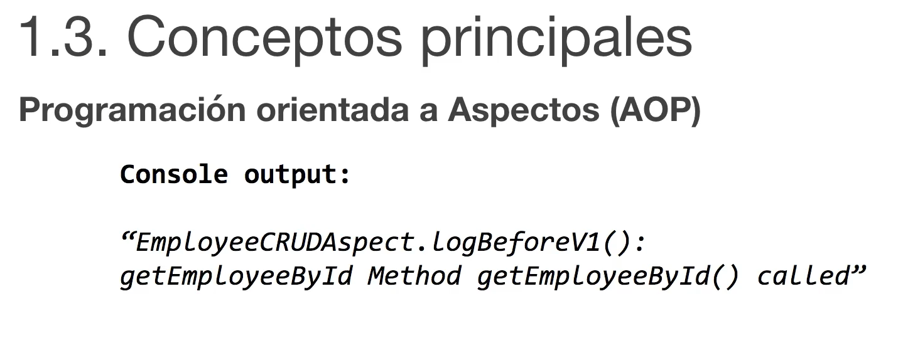

Porque le hemos dicho en la anotación que este aspecto se ejecute antes, por lo tanto la salida por consola será esta, primero se logga el aspecto y a continuación se ejecuta el método.

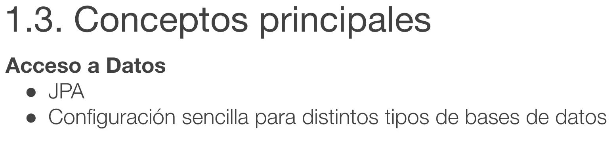

El acceso a datos lo vamos a gestionar mediante JPA.

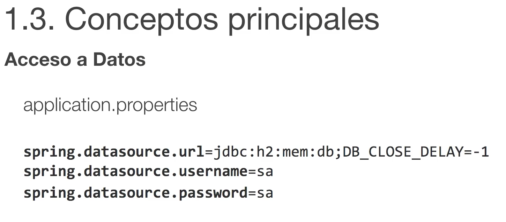

Es una configuración muy sencilla para distintos tipos de base de datos, básicamente se configura en el archivo de propiedades `application.properties`, se indica un DataSource, username y un password, tiene muchas más propiedades de configuración pero con estas tres propiedades de configuración ya tendríamos acceso a una base de datos en este caso una base de datos H2 en memoria.

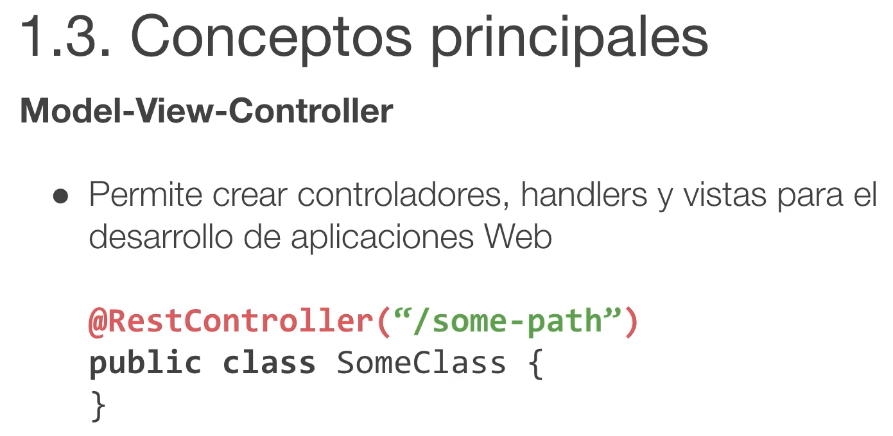

El **Model-View-Controller**

Permite crear controladores, handlers y vistas para el desarrollo de aplicaciones web, la anotación `@RestController` convierte una clase en un controlador Rest,en este caso `"/some-path"` que está entre comillas sería la URL que apuntaría dentro de nuestra aplicación a este controlador.

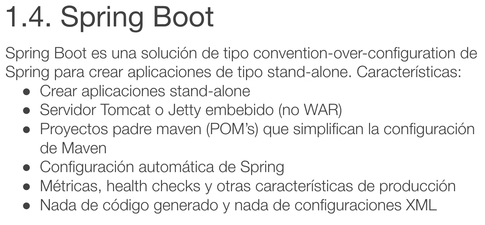

**Spring Boot**

Dentro de Spring se creó el proyecto Spring Boot es una solución de tipo convention-over-configuration de Spring para crear aplicaciones de tipo stand-alone. 

Tiene incluido un servidor de tipo Tomcat o Jetty embebido así que no necesitamos crear un WAR ni desplegarlo en otro servidor, sino que podemos ejecutar la aplicación como un JAR normal y ella automáticamente levanta un servidor de tipo Tomcat o Jetty y se despliega en ese servidir.

Tiene proyecto padre Maven que simplifican la configuración de Maven, el Spring Boot Parent es el proyecto padre de Spring que lleva al Core de todas las dependencias que necesitamos para crear una aplicación simple y sencilla, si luego añadimos el Spring Boot Parent Web, ese va a llevar todas las dependencias que necesitamos para desarrollar una aplicación web y así sucesivamente.

Luego tiene la configuración automática de Spring, no vamos a necesitar hacer nada, el automáticamente va a detectar las anotaciones que hay en nuestra aplicación y con eso vas a saber crear todos los objetos que necesita nuestra la aplicación, inyectarlos donde corresponda.

Implementa de una manera muy sencilla y eficaz métricas, health checks y otras características de producción, o sea que vamos a conseguir crear una aplicación Production-Ready muy rápidamente.

No tiene nada del código generado y no tiene configuraciones XML, todo se hacen mediante anotaciones.

Así que nada está ha sido una pequeña introducción a lo que es Spring y Spring Boot y espero que os haya servido, dejo referencias en los materiales.

