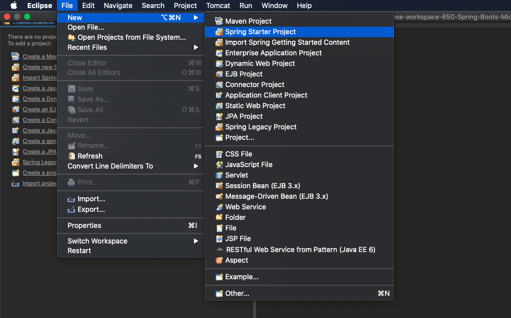
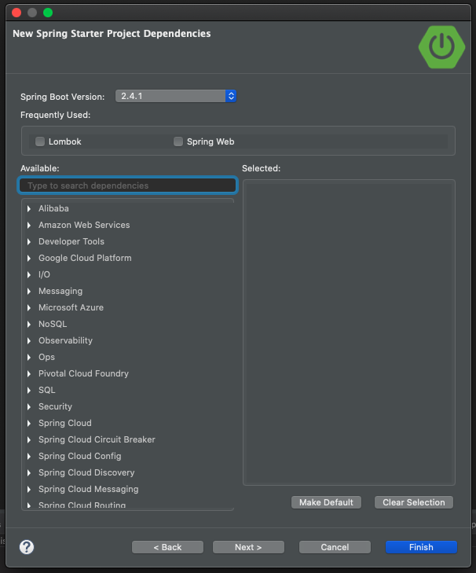
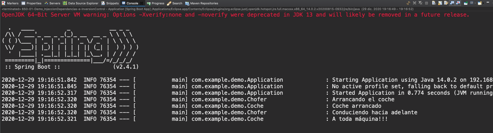
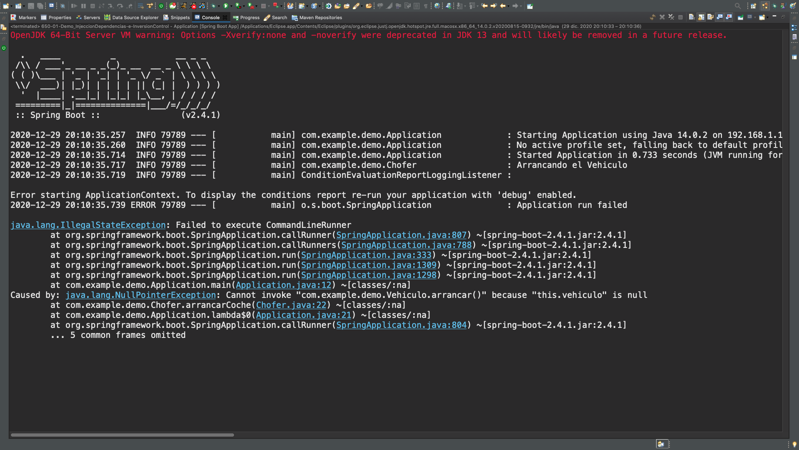

# ANEXO II. Injeccion de Dependencias e Inversion de Control

## :computer: `650-01-Demo_InjeccionDependencias-e-InversionControl`

Vamos a crear un nuevo proyecto para intentar aclarar los conceptos de Injeccion de Dependencias e Inversion de Control y ver por que es tan importante trabajar con Interfaces.

Vamos a crear el proyecto como sigue:






### 01. Crear la Clase `Coche`

`Coche`

```java
package com.example.demo;

import org.slf4j.Logger;
import org.slf4j.LoggerFactory;

public class Coche {
	
   private static final Logger LOGGER = LoggerFactory.getLogger(Coche.class);
   private boolean arrancado = false;
   private boolean enMarcha = false;
   private String direccion = "";
	
   public void arrancar() {
      LOGGER.info("Coche arrancado");
      this.arrancado = true;
   }
	
   public void conducir(String direccion) {
      LOGGER.info("A toda máquina!!!");
      enMarcha = true;
      this.direccion = direccion;
   }
}
```

### 02. Crear la Clase `Chofer`

`Chofer`

```java
package com.example.demo;

import org.slf4j.Logger;
import org.slf4j.LoggerFactory;

public class Chofer {
	
   private static final Logger LOGGER = LoggerFactory.getLogger(Chofer.class);
   private Coche coche;
	
   public Chofer() {
      this.coche = new Coche();
   }
	
   public void arrancarCoche() {
      LOGGER.info("Arrancando el coche");
      coche.arrancar();
   }
	
   public void conducir(String direccion) {
      LOGGER.info("Conduciendo hacia {}", direccion);
      coche.conducir(direccion);
   }

}
```

### 03. Modificar `Application` 

`Application`

```java
package com.example.demo;

import org.springframework.boot.CommandLineRunner;
import org.springframework.boot.SpringApplication;
import org.springframework.boot.autoconfigure.SpringBootApplication;
import org.springframework.context.annotation.Bean;

@SpringBootApplication
public class Application {

   public static void main(String[] args) {
      SpringApplication.run(Application.class, args);
   }
	
   @Bean
   public CommandLineRunner myRunner() {
			
      return args -> {
         Chofer chofer = new Chofer();
         chofer.arrancarCoche();
         chofer.conducir("adelante");
      };
      
   }
}
```

### 04. Probar la App

Al ejecutar la aplicación tenemos:



**¿Qué pasaría si yo quisiera que el `Chofer` conducierá en vez de un `Coche` un `Camion`?**

Para empezar tendría que crear una clase `Camion` con su implementación y por otro lado tengo que MODIFICAR la clase `Chofer` para que ahora use `Camion` en lugar de `Coche`.

Existe una forma mediante la Injeccion de Dependencias e Inversion de Control, de no tener que modificar la clase `Chofer` nunca y poder añadir `Vehiculos` siempre que queramos.

La manera de solucionar esto es mediante las Interfaces, en lugar de instanciar algo tan concreto como es el `Coche` dentro de `Chofer` vamos a poder eso a una Interface, la Interface la vamos a llamar `Vehiculo` y va a definir los métodos del `Coche`.

### 05. Crear la Interface `Vehiculo`


`Vehiculo`

```java
package com.example.demo;

public interface Vehiculo {
	void arrancar();
	void conducir(String direccion);

}
```

### 06. Implementar la Interface `Vehiculo` en la Clase `Coche`

`Coche`

```java
package com.example.demo;

import org.slf4j.Logger;
import org.slf4j.LoggerFactory;

@Component("coche")
public class Coche implements Vehiculo{
	
   private static final Logger LOGGER = LoggerFactory.getLogger(Coche.class);
   private boolean arrancado = false;
   private boolean enMarcha = false;
   private String direccion = "";
	
   @Override
   public void arrancar() {
      LOGGER.info("Coche arrancado");
      this.arrancado = true;
   }
	
   @Override
   public void conducir(String direccion) {
      LOGGER.info("A toda máquina!!!");
      this.enMarcha = true;
      this.direccion = direccion;
   }
}
```

* Los métodos los anotamos con `@Override` porque estan sobreescribiendo los métodos de la Interface.
* Con la anotación `@Component("coche")` se supone que Spring la instancia automaticamente para que posteriormente se pueda instanciar, además se le esta asignando un nombre.

### 07. Crear la Clase `Camion` que implemente la Interface `Vehiculo`

`Camion`

```java
package com.example.demo;

import org.slf4j.Logger;
import org.slf4j.LoggerFactory;

@Component("camion")
public class Camion implements Vehiculo{
	
   private static final Logger LOGGER = LoggerFactory.getLogger(Camion.class);
   private boolean arrancado = false;
   private boolean enMarcha = false;
   private String direccion = "";
	
   @Override
   public void arrancar() {
      LOGGER.info("Camión arrancado");
      this.arrancado = true;
   }
	
   @Override
   public void conducir(String direccion) {
      LOGGER.info("POO POOOOOOOOO!!!");
      this.enMarcha = true;
      this.direccion = direccion;
   }
}
```

### 08. Cambios en la Clase `Chofer`

Aquí en lugar de instanciar la clase `Coche` vamos a inyectar la Interface `Vehiculo`.

`Chofer`

```java
package com.example.demo;

import org.slf4j.Logger;
import org.slf4j.LoggerFactory;
import org.springframework.beans.factory.annotation.Autowired;
import org.springframework.beans.factory.annotation.Qualifier;

public class Chofer {
	
   private static final Logger LOGGER = LoggerFactory.getLogger(Chofer.class);
	
   @Autowired
   @Qualifier("coche")
   private Vehiculo vehiculo;
	
   public Chofer() {
		
   }
 
   public void arrancarCoche() {
      LOGGER.info("Arrancando el Vehiculo");
      vehiculo.arrancar();
   }
	
   public void conducir(String direccion) {
      LOGGER.info("Conduciendo hacia {}", direccion);
      vehiculo.conducir(direccion);
   }

}
```

En teoría con `@Autowired` inyecto una implementación de la Interface `Vehiculo`, en este caso tengo dos implementaciones `Coche` y `Camion` por lo que necesito indicar con `@Qualifier("coche")` cual implementación voy a usar.

ALGO SUCEDE POR QUE A LA HORA DE EJECUTAR LA APLICACIÓN NO FUNCIONA la anotación `@Component(...)` es como si no instanciara los objetos.




PERO LA IDEA ES USAR INTERFACES EN LUGAR DE CLASES.
