# 02 - Inicializando un Servicio Web con Spring Initializer

Si vamos a https://start.spring.io/ veremos Spring Initializr.

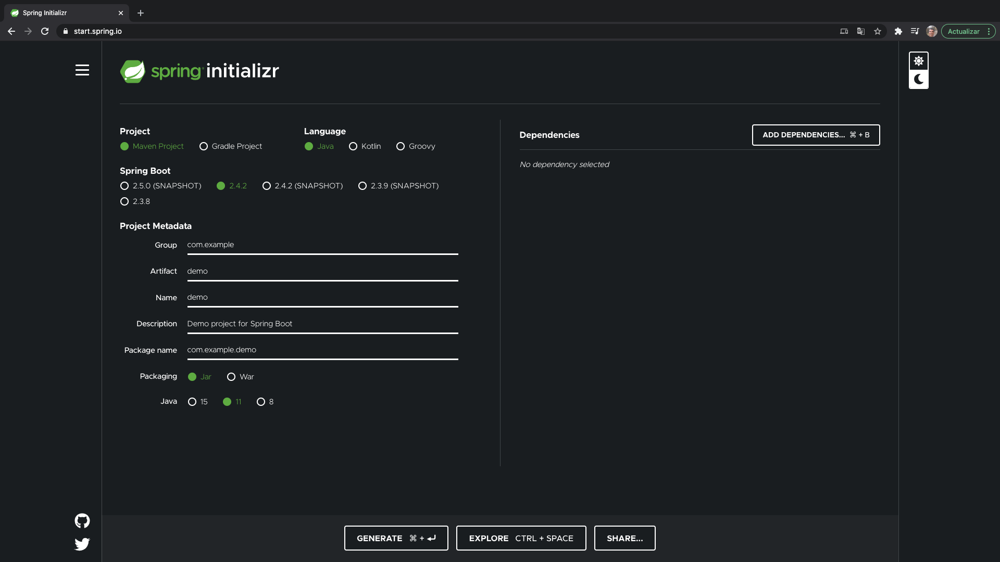

En esta página vamos a poder elegir una serie de configuraciones para nuestro proyecto Spring Boot y al final generar un proyecto Spring Boot que nos podemos descargar. 

Podemos elegir una serie de opciones dentro del proyecto, entre ellas gestor de dependencias, lenguaje, versión de Spring Boot, metadatos del proyecto, en este caso vamos a dejar todos los que vienen por default.

Una vez configurado el proyecto pasamos elegir las dependencias que vamos a ocupar para nuestro proyecto, al presionar el botón ADD DEPENDENCIES se nos presentan todas las dependencias que podemos seleccionar.

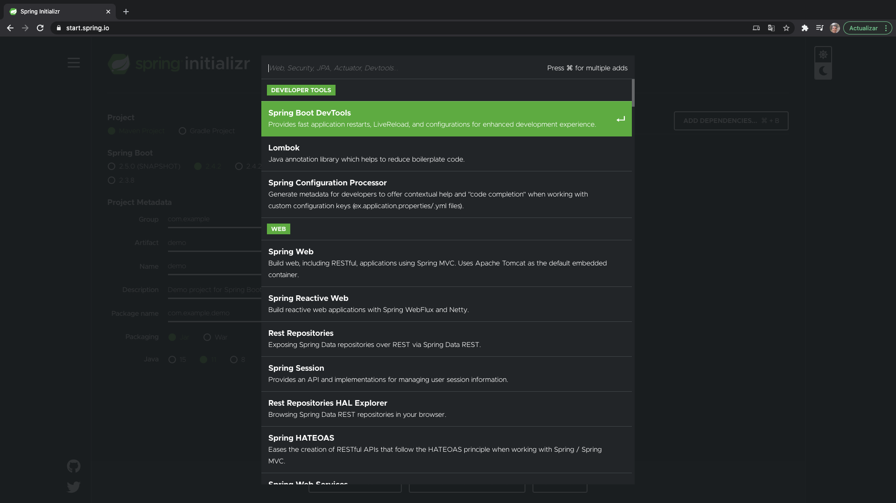

En nuestro caso vamos a añadir las que se muestran en la imagen.

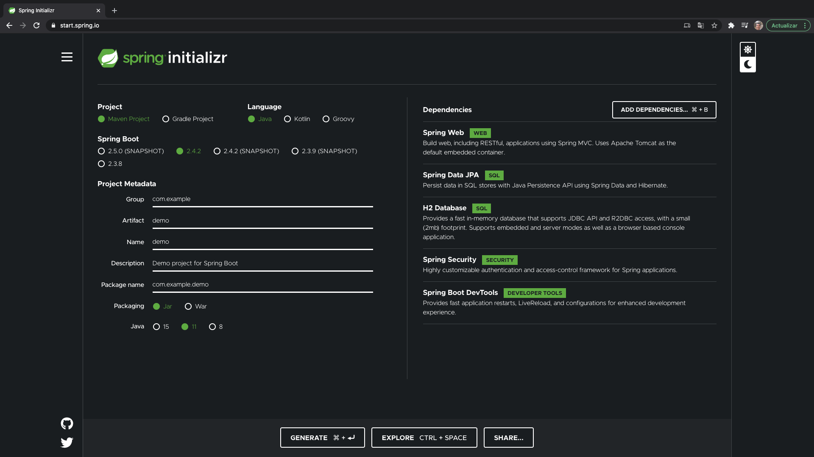

si pulsamos sobre el botón EXPLORER podemos ver una previsualización del proyecto que se va a crear, 


si lo observamos vemos que es un proyecto Maven, con un `pom.xml` con las diferentes dependencias que hemos ido añadiendo, una carpeta `src` donde va todo nuestro código Java.

Una vez visualizado esto, pulsar el botón DOWNLOAD en esta pantalla o al pulsar CLOSE regresamos a la pantalla principal donde podemos pulsar GENERATE con cualquiera de los dos botones se descarga un ZIP llamado `demo.zip`, este archivo lo desempaqutamos y lo importamos en Eclipse.

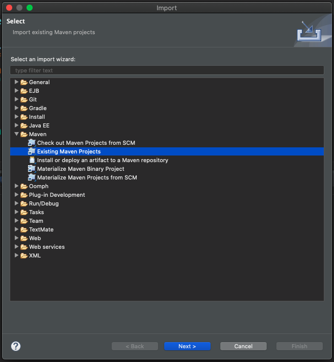
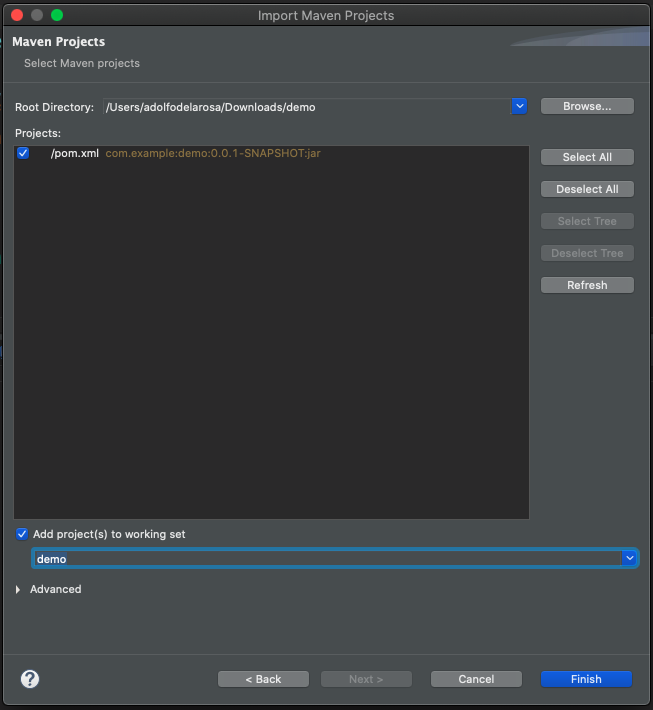

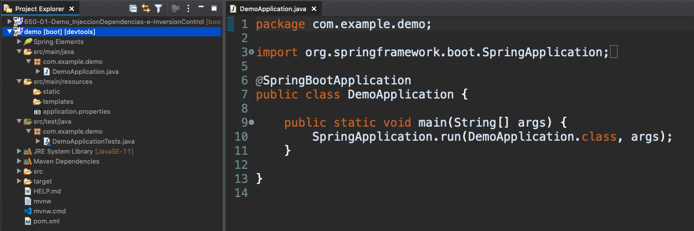

Si vemos la estructura del proyecto podemos ver los siguientes archivos relevantes.

* `application.properties` nos sirve para distintas configuraciones de la aplicación.
* `DemoApplication` es una clase anotada con `@SpringBootApplication` que indica que es la clase principal de entrada a la aplicación, esta clase se puede ejecutar como una clase Java Normal, pero es mejor ejecutarla como un proyecto Spring Boot.

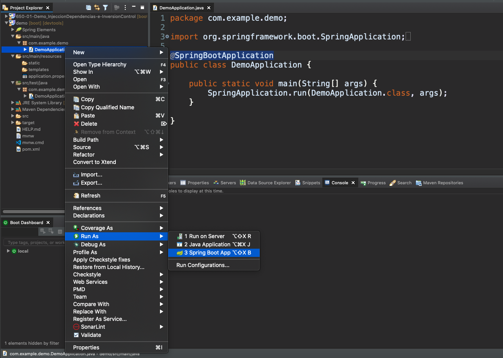

después de unos seguntos se carga la aplicación.

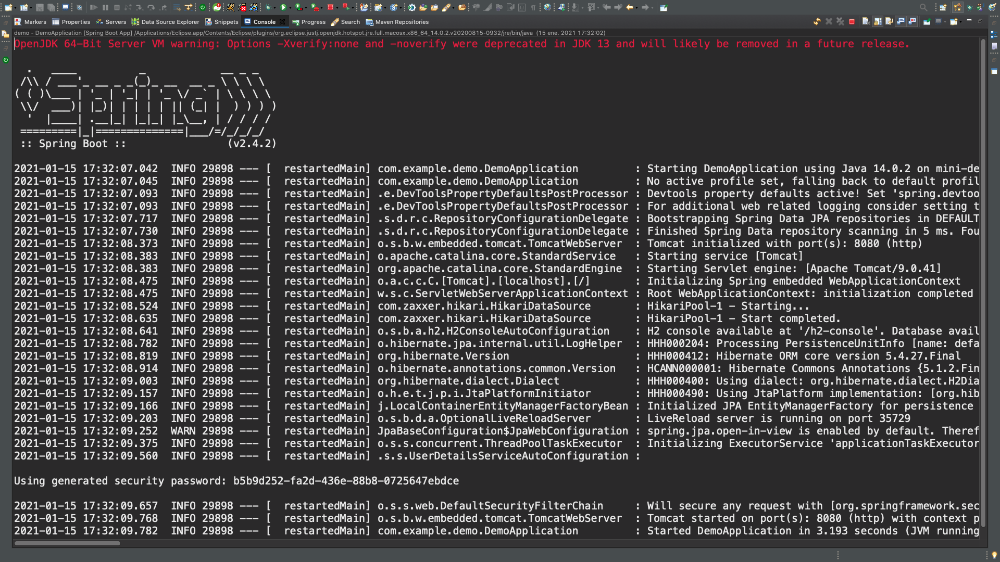

Hay que tener dos detalles en cuenta, uno es que por tan solo por añadir la dependencia de seguridad `spring-boot-starter-security`, la seguridad se va a añadir por defecto, por eso en el log se nos muestra un password:

```sh
Using generated security password: b5b9d252-fa2d-436e-88b8-0725647ebdce
```

que nos va a servir para la autenticación básica que es la que se añade por defecto, también en el log se nos indica que se ha levantado un servidor tomcat en el puerto 8080.

```sh
2021-01-15 17:32:09.768  INFO 29898 --- [  restartedMain] o.s.b.w.embedded.tomcat.TomcatWebServer  : Tomcat started on port(s): 8080 (http) with context path ''
```

Así que si en un navegador abrimos la URL http://localhost:8080/ se nos va a presentar la siguiente pantalla:

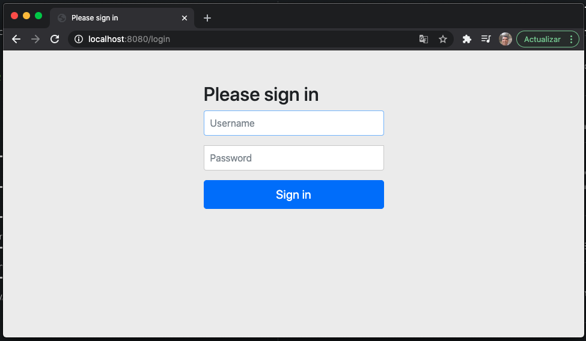

Si intentamos logearnos y las credenciales no son válidas se nos enviará un mensaje de error.

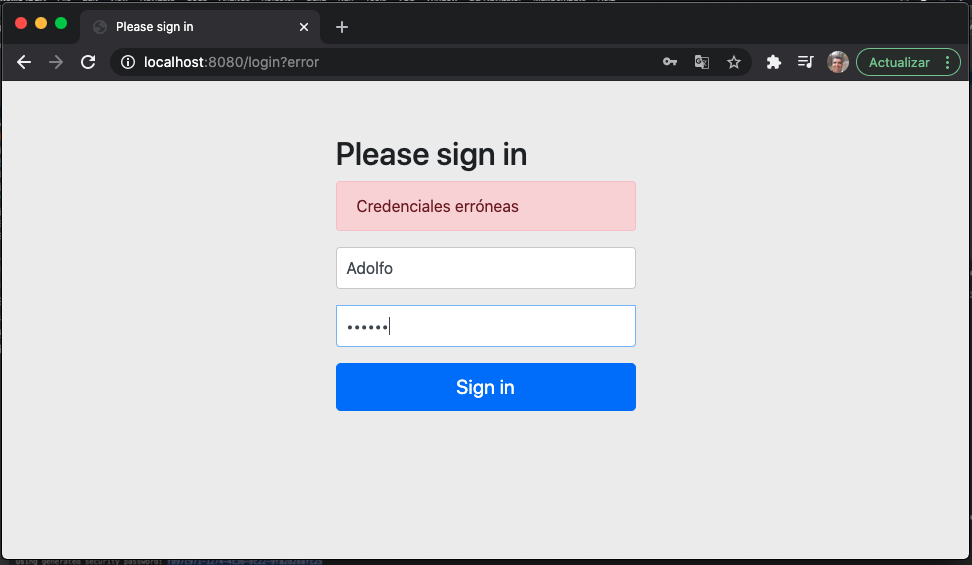

Pero las credenciales validas son `user` y el password indicado en el Log.

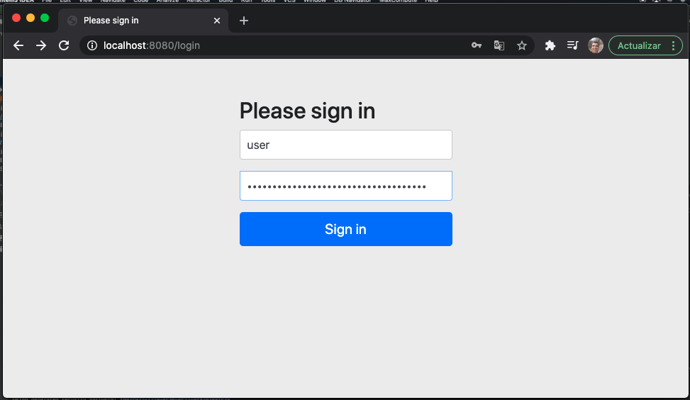

Pero como nuestra aplicación no hace nada por ahora se nos presenta la siguiente pantalla.

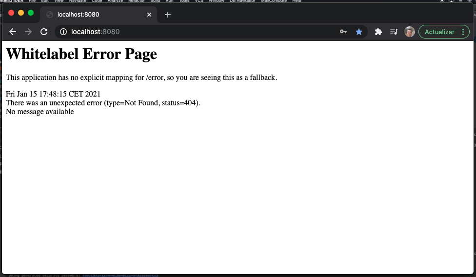

Finalmente vamos a renombrar nuestro proyecto con el nombre `650-02-Demo` para mantener nuestra organización

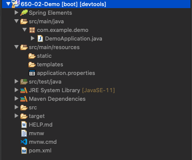


