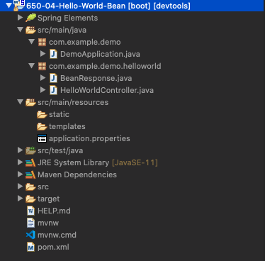
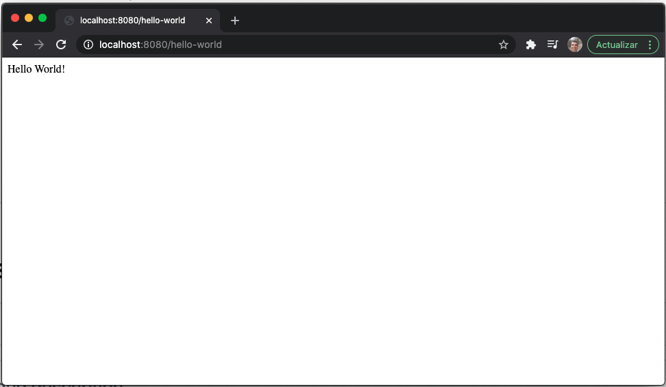
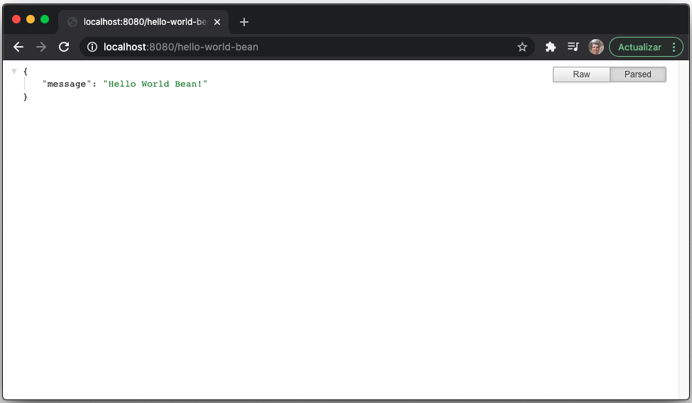

# 05 - Hello World Bean

Esta nueva lección vamos a crear una nueva versición del proyecto Hello World para que en lugar de que retorne un simple `String` nos retorne una clase POJO de Java que al final se va a representar como un JSON.

## :computer: `650-04-Hello-World-Bean`



Vamos a partir del proyecto `650-03-Hello-World` y vamos a hacer una copia a la que llamaremos `650-04-Hello-World-Bean`.

### Crear el POJO

Lo primero que vamos a hacer es crear la clase POJO que tenemos que devolver, la llamaremos `BeanResponse`

```java
package com.example.demo.helloworld;

public class BeanResponse {
   private String message;

   public BeanResponse() {
      super();
   }

   public BeanResponse(String message) {
      super();
      this.message = message;
   }

   public String getMessage() {
      return message;
   }

   public void setMessage(String message) {
      this.message = message;
   }
	
}
```

Recordar que Spring Boots internamente usa Jackson, por lo tanto al utilizar estos Beans o POJOs como respuesta o a la hora de hacer peticiones debe ser capaz de transformalos a objetos Jackson, por lo tanto si declaramos los atributos como privados necesitamos los getters y setters para acceder a la propiedad, ademas si creamos un constructor sobrecargado debemos incluir un constructor sin parámetros ya que es indispensable para que lo pueda usar Jackson para poder instanciar objetos de este tipo del bean.

Ahora en el RestController vamos a crear un nuevo método que retorne un `BeanResponse`

```java
@GetMapping("/hello-world-bean")
public BeanResponse helloWorldBean() {
   return new BeanResponse("Hello World Bean!");
}
```

Vamos a probar la aplicación, ahora tenemos dos recursos que podemos solicitar.




Nos retorna on Objeto de tipo JSON que representa a nuestro `BeanResponse`

