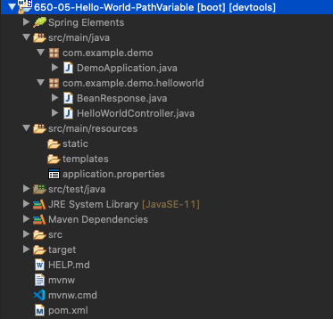
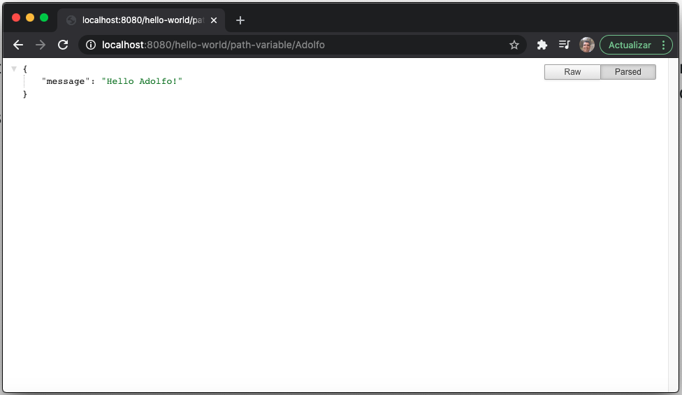
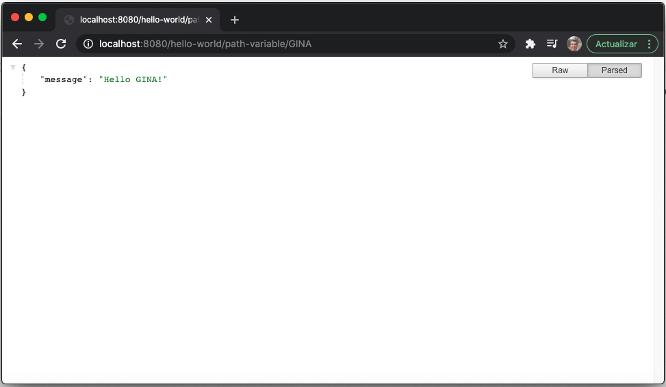

# 06 - Hello World Path Variable

En esta lección vamos a ver como usar una variable o mejor dicho una PathVariable en la URL.

## :computer: `650-05-Hello-World-Path-Variable`



Vamos a realizar una nueva copia del proyecto `650-04-Hello-World-Bean` que llamaremos `650-05-Hello-World-Path-Variable`, donde vamos a añdir un método más que reciba un PathVariable.

```java
@GetMapping("/hello-world/path-variable/{name}")
public BeanResponse helloWorldVariable(@PathVariable String name) {
   return new BeanResponse("Hello " + name + "!");
}
```

El RestController es:

```java
package com.example.demo.helloworld;

import org.springframework.web.bind.annotation.GetMapping;
import org.springframework.web.bind.annotation.PathVariable;
import org.springframework.web.bind.annotation.RestController;

@RestController
public class HelloWorldController {

   @GetMapping("/hello-world")
   public String helloWorld() {
      return "Hello World!";
   }
	
   @GetMapping("/hello-world-bean")
   public BeanResponse helloWorldBean() {
      return new BeanResponse("Hello World Bean!");
   }
	
   @GetMapping("/hello-world/path-variable/{name}")
   public BeanResponse helloWorldVariable(@PathVariable String name) {
      return new BeanResponse("Hello " + name + "!");
   }
	
}
```

Tenemos un endpoint `/hello-world/path-variable/{name}` en el cual estamos pasando un nombre, este lo vamos a recibor en el parámetro `name` que anotamos con `@PathVariable` y después usamos esta variable para formar el mensaje de respuesta, veamos la ejecución de este endpoint.



