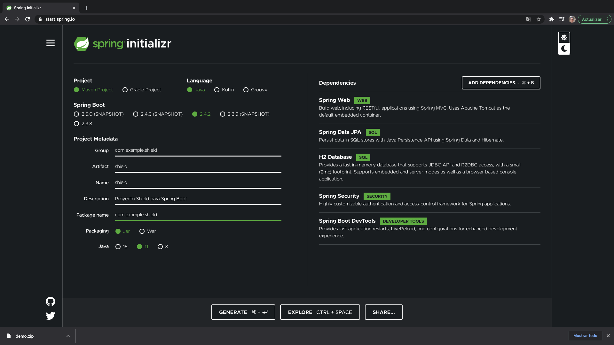
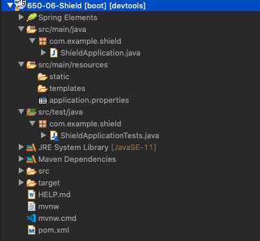

# 07 - Hero Model y Hero Service

En esta lección vamos a comenzar con nuestro proyecto SHIELD, si recordamos tenemos dos recursos Heroes y Poderes, vamos a empezar implementando el recurso de Heroes. Para esta primera parte del proyecto vamos a implementar datos estáticos por lo que los datos inicialmente los almacenaremos en un ArrayList en lugar de una BD.

## Creación del Proyecto `650-06-Shield`

Vamos a https://start.spring.io/ y vamos a crear un proyecto Spring Boot con las siguientes características.



Lo importamos como proyecto Maven dentro de nuestro Eclipse, hacemos una copia de el y lo llamamos `650-06-Shield`, comentamos el starter `spring-boot-starter-security` para facilitar el desarrollo y partimos de una estructura como la que sigue:



## Creación del Modelo

Dentro de nuestro paquete principal vamos a crear la clase `Hero` dentro del paquete `model` con la siguiente estructura:

`Hero`

```java
package com.example.shield.model;

import java.util.Date;

public class Hero {
	
   private int id;
   private String name;
   private String heroName;
   private Date birthDate;
	
   public Hero() {
      super();
   }

   public Hero(int id, String name, String heroName, Date birthDate) {
      super();
      this.id = id;
      this.name = name;
      this.heroName = heroName;
      this.birthDate = birthDate;
   }

   public int getId() {
      return id;
   }

   public void setId(int id) {
      this.id = id;
   }

   public String getName() {
      return name;
   }

   public void setName(String name) {
      this.name = name;
   }

   public String getHeroName() {
      return heroName;
   }

   public void setHeroName(String heroName) {
      this.heroName = heroName;
   }

   public Date getBirthDate() {
      return birthDate;
   }

   public void setBirthDate(Date birthDate) {
      this.birthDate = birthDate;
   }
	
}
```

## Creación del Servicio

Dentro de nuestro paquete principal vamos a crear la clase `HeroDaoService` dentro del paquete `dao`. 

`HeroDaoService`

```java
package com.example.shield.dao;

import java.util.Arrays;
import java.util.Date;
import java.util.Iterator;
import java.util.List;

import org.springframework.stereotype.Service;

import com.example.shield.model.Hero;

@Service
public class HeroDaoService {
	
   private static List<Hero> heroes = Arrays.asList(
         new Hero(1,"Peter Parker","Spiderman", new Date()),
         new Hero(2,"Tony Stark","Ironman", new Date()),
         new Hero(3,"Bruce Banner","Hulk", new Date()));
	
   private static int counter = 3;

   // Obtener todos los heroes
   public List<Hero> findAll(){
      return heroes;
   }
   
   // Obtener un heroe en concreto
   public Hero findHeroById(int id){
      Hero result = null;
      for(Hero hero: heroes) {
         if(hero.getId() == id) {
            result = hero;
         }
      }
		
      return result;
   }
	
   // Añadir un heroe
   public Hero addHero(Hero hero) {
      hero.setId(++counter);
      heroes.add(hero);
      return hero;
   }
	
   //Borrar un heroe
   public boolean deleteHero(int id) {
      Iterator<Hero> heroIterator = heroes.iterator();
      Hero heroToRemove = null;
      do {
         heroToRemove = heroIterator.next();
         if(heroToRemove.getId() == id) {
            heroIterator.remove();
            return true;
         }
      } while(heroIterator.hasNext());
      return false;
   }
}
```
* Anotamos la clase con `@Service` para indicar que es una clase de Servicio
* Declaramos un array estático con los datos de nuestros Heroes.
* Declaramos la propiedad `counter` para ir contando el número existente de heroes que tenemos y nos servira para generar el nuevo `id` en caso de insertar un nuevo Heroe.
* Va a tener una serie de métodos:
   * Obtener todos los heroes
   * Obtener un heroe en concreto
      * Necesitamos un parámetro de entrada que sea el identificador del Heroe
      * La variable `result` de tipo Heroe es la que retornaremos tanto en el caso de encontrarlo como de no encontrarlo que en este último caso retornaremos por el momento `null`.
      * Recorremos el array para buscar el Heroe que se corresponda con el `id` que nos pasan como parámetro.
   * Añadir un heroe
      * En este caso podemos devolver un `Boolean` o un `Hero` que es por lo que nos hemos decantado.
      * Recibe como parámetro un `Hero` que va a ser el nuevo Heroe a añadir
      * Vamos a asumir que este nuevo Heroe no trae un `id` por lo que se lo devemos añadir antes de persistirlo.(Ciertos motores de persistencia tratan el `save` y el `update` de la misma manera y en función de si ya trae un id o no lo actualizan o crean un elemento como nuevo)
      * Finalmente después de persistirlo devolvemos el Heroe que nos han pasado pero ya con un `id` asignado.
   * Borrar un heroe
      * Vamos a devolver un `Boolean`
      * Recibimos un `id` como parámetro de entrada para identificar al Heroe que queremos borrar.
      * Usamos un `Iterator` para recorrer el ArrayList en lugar de usar un `for` como hicimos en buscar un Heroe.
      * Recorremos el Iterador y en caso de encontrar al Heroe con el id que nos pasarón de parámetro lo eliminamos y retornamos `true` y si no lo encontramos retornamos `false`.
      
