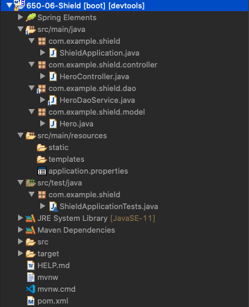
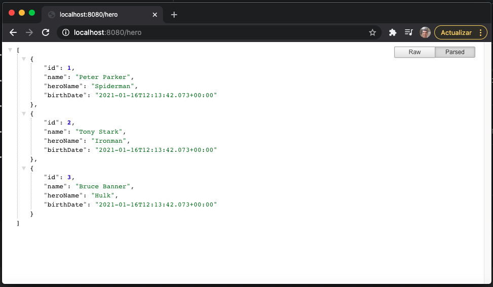
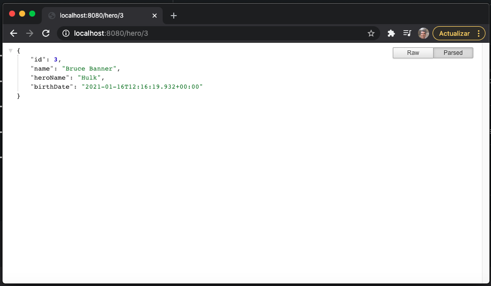
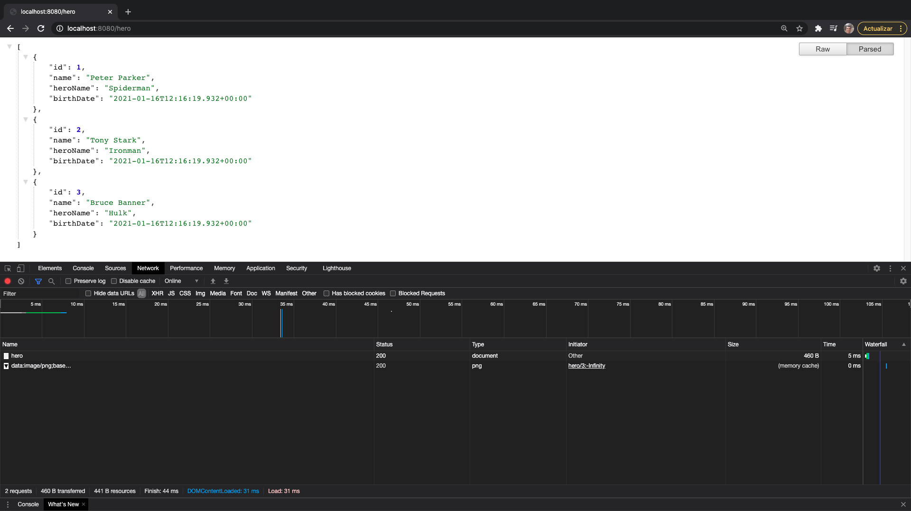
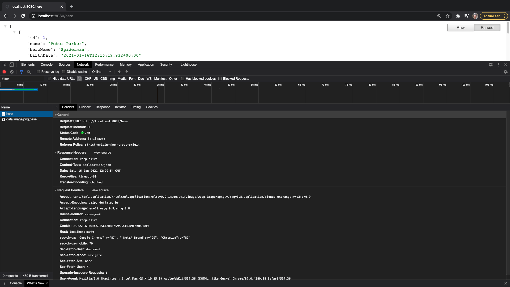
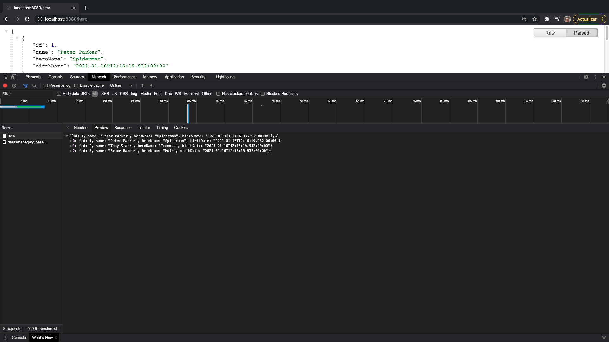
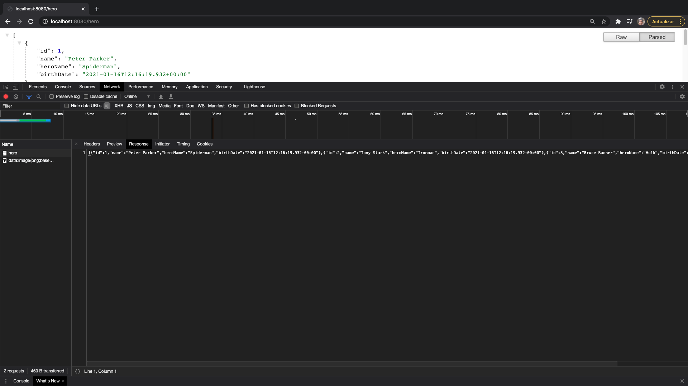
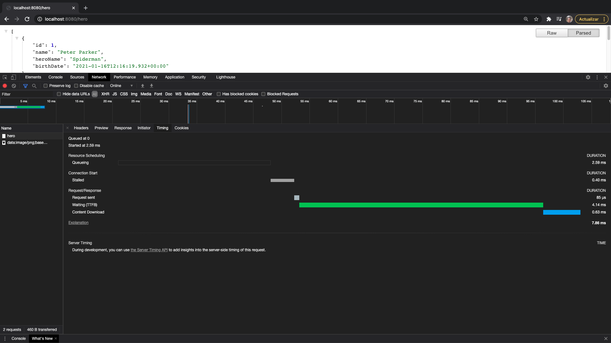
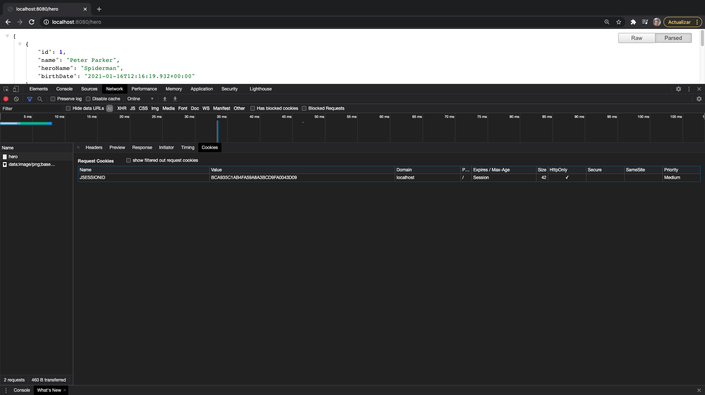

# 08 - Métodos GET de Hero

En esta lección vamos a implementar el Controlador que se va a encargar de traer los datos de los Heroes para lo cual vamos a implementar los métodos de tipo GET, es decir para `findAll()` y  `findHeroById()`

Vamos a crear la clase `HeroController` dentro de el paquete `controller`.

`HeroController`

```java
package com.example.shield.controller;

import java.util.List;

import org.springframework.beans.factory.annotation.Autowired;
import org.springframework.web.bind.annotation.GetMapping;
import org.springframework.web.bind.annotation.RestController;

import com.example.shield.dao.HeroDaoService;
import com.example.shield.model.Hero;

@RestController
public class HeroController {
	
   @Autowired
   private HeroDaoService heroDaoService;
	
   @GetMapping(value="/hero")
   public List<Hero> findAllHeroes(){
      return heroDaoService.findAll();
   }
   @GetMapping(value="/hero/{id}")
   public Hero findHeroById(@PathVariable int id) {
      return heroDaoService.findHeroById(id);
   }

}
```

* Anotamos la clase con `@RestController`
* Como esta clase `HeroController` va a referirse al Hereo podemos hacer uso del valor y añadir la URL al controlador completo, es decir `@RestController(value="/hero")`, por lo tanto todas las URLs de todos los métodos que esten dentro de este controlador serán `/hero` más la ruta particular de cada método. El detalle es que si en alguno de los métodos que implementemos necesita esta URL para ser invocado ya no tendríamos que añadir ninguna URL particular, en nuestro caso no vamos a declarar ninguna URL global sino que la declararemos en cada uno de los métodos.
* Auto inyectamos la clase `HeroDaoService` como un atributo `private`.
* Implementamos nuestros métodos asignandole sus respectivas URL con `@GetMapping` por que serán peticiones GET y usamos los métodos del Servicio para recuperar los datos. Hacer notar que en el segúndo de los métodos recibe una variable el parámetro que se recibe hay que anotarlo con `@PathVariable`.

### Probar la Aplicación

Con lo que ya llevamos programado hasta el momento



ya podemos probar nuestra App en el navegador

http://localhost:8080/hero



http://localhost:8080/hero/3



Vamos a inspección con las Herramientas de Desarrollador de Google Chrome que sucede cuando invocamos el URL http://localhost:8080/hero 

Cuando invocamos la URL se hace la petición al endpoint `hero`



Si pulsamos en el vemos más detalles, vemos que nos regresa un Status Code con un valor 200, el estado 200 en HTTP significa OK es decir que todo ha ido bien, podemos ver también las Headers de la Response y las Headers de la Request.



Si cambiamos de pestaña podemos Previsualizar la respuesta de una forma formateada.



O sin formatear



Existen otras pestañas que nos ofrecen otro tipo de información.




