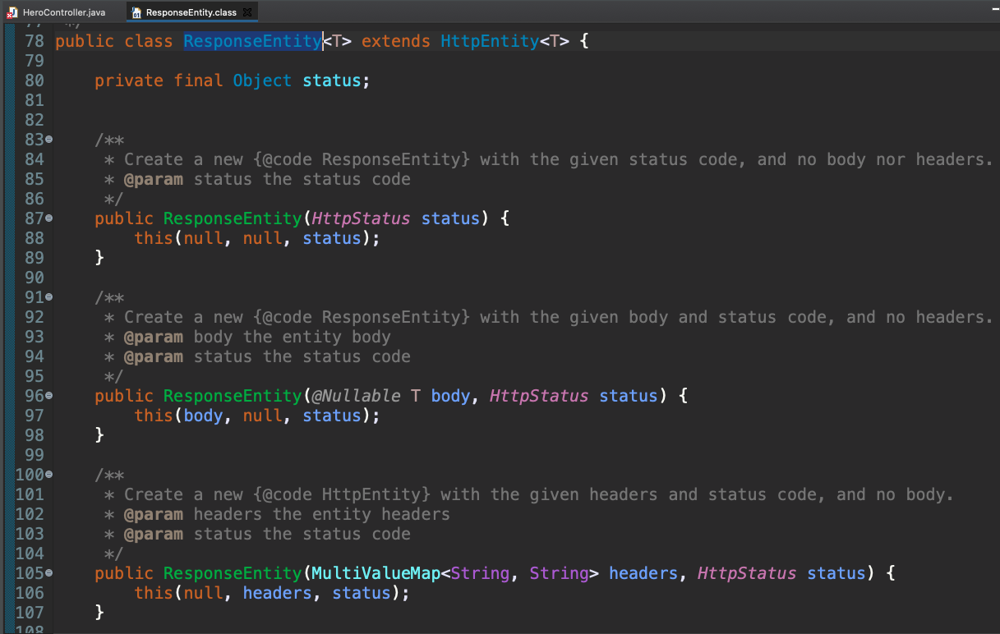
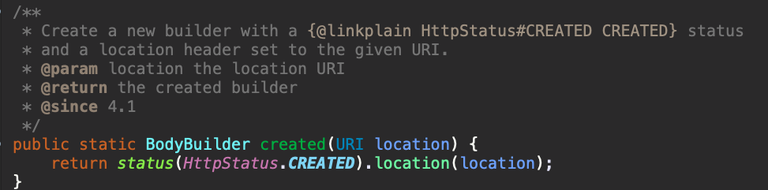
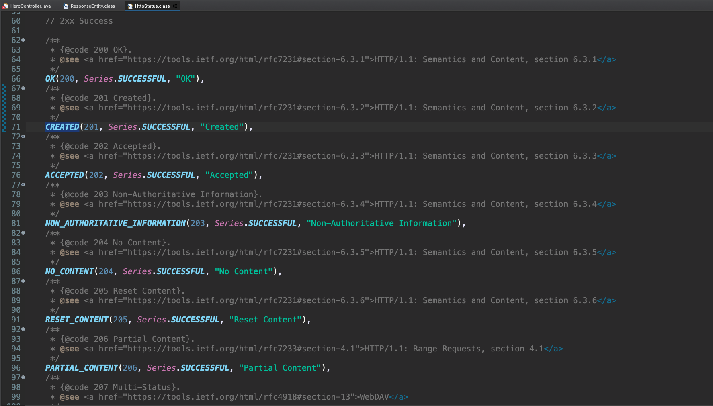
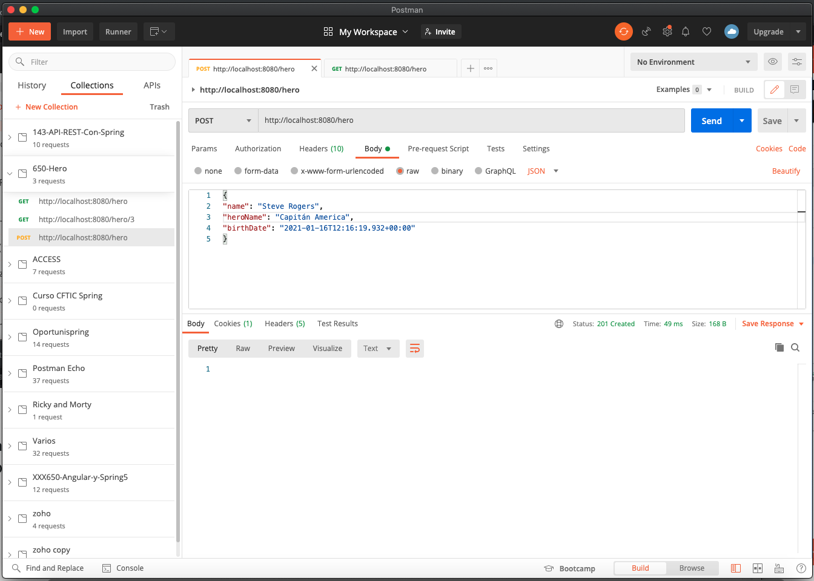
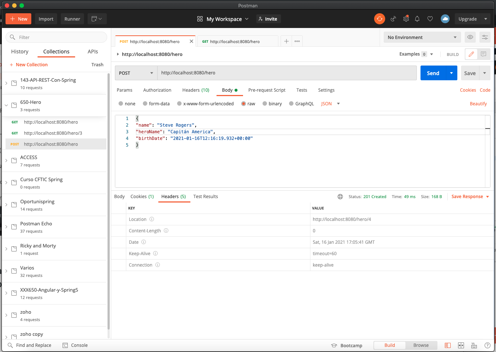
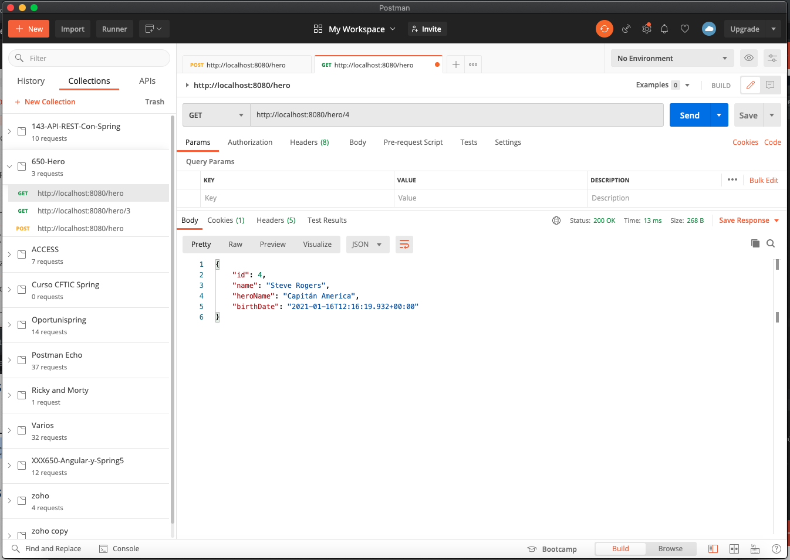

# 10 - Métodos POST de Hero II

En esta lección vamos a realizar las dos tareas pendientes que nos quedaba realizar en nuestro método POST, es decir retornar un Status Code 201 y retornar el URI del nuevo recurso.

Vamos a ver como hacemos esto, en primer lugar necesitamos devolver un objeto que pueda contener el Status para poder enviar el que nosotros necesitemos, el objeto que nos permite hacer esto es `ResponseEntity` por lo que necesitariamos algo como esto:

```java
@PostMapping("/hero")
public Hero addHero(@RequestBody Hero hero) {
   //return heroDaoService.addHero(hero);
		
   ResponseEntity.created(location).build();
}
```
Donde:

* Con el método `created` ya devolvemos un Status Code 201 y como parámetro de entrada recibe una `location` que será el URI del nuevo recurso que nos falta por crear.

Si vemos `ResponseEntity` tenemos:



`ResponseEntity` extiende de `HttpEntity` que al final son Entidades que se pueden utilizar para la comunicación por medio de HTTP. Como vimos en la sección anterior vimos que en los servicios REST la comunicación se hace a través de HTTP con objetos de tipo HTTPRequest y HTTPResponse. 

El `ResponseEntity` contiene además un objeto `status` que va a contener el estado de la respuesta que se esta devolviendo en este caso con el método `created` 



le estamos diciendo que el estado es de tipo `CREATED` si entramos a ver este estado tenemos:



que el estado `CREATED` corresponde al 201.

Bien entonces con `ResponseEntity.created(location).build();` ya estariamos compiendo el estado pero nos falta la `location`, la `location` es un objeto de tipo URI que se compone a partir de un `ServletUriComponentsBuilder` le vamos a indicar que la construya a partir de la Request actual `fromCurrentRequest()`  es decir `http://localhost:8080/hero` y le vamos a decir que añada también al PATH el id del recurso es decir `.path("/{id}")` y con `buildAndExpand(addHero.getId())` le decimos que contruya la URI y que le añada el listado de variables que en este caso que necesitamos el id del nuevo heroe y finalmente lo transformamos a un URI, en resumen la sentencia completa es:

```java
URI location = ServletUriComponentsBuilder
                  .fromCurrentRequest()
                  .path("/{id}")
                  .buildAndExpand(addHero.getId())
                  .toUri();
```

Asi que el método completo nos queda así:


```java
// POST
// Devolver estado 201: Created
// Devolver URI del nuevo recurso creado
@PostMapping("/hero")
public ResponseEntity<Object> addHero(@RequestBody Hero hero) {
   Hero addHero = heroDaoService.addHero(hero);
   URI location = ServletUriComponentsBuilder
                    .fromCurrentRequest()
                    .path("/{id}")
                    .buildAndExpand(addHero.getId())
                    .toUri();
		
   return ResponseEntity.created(location).build();
}
```
* El método retorna un `ResponseEntity<Object>`
* Nos va a retornar un código de estado 201
* Le pasamos una `location` que añade una Header a la respuesta que corresponde a la URI  del nuevo recurso.

Si arrancamos la aplicación y la probamos con Postman tenemos que ahora en el Body ya no estamos devolviendo nada por que no hemos querido, que se nos regresa un Status 201 Created.



Y si nos vamos a los Headers vemos 



que se nos regresa uno llamado Location con la URI del nuevo heroe creado `http://localhost:8080/hero/4`



Con esto ya estamos creando un Heroe devolviendo el estado correcto y ademas seguimos el Princio HATEOAS de permitir que el usuario pueda navegar por toda nuestra aplicación a partir de enlaces entre unos y otros recursos.
