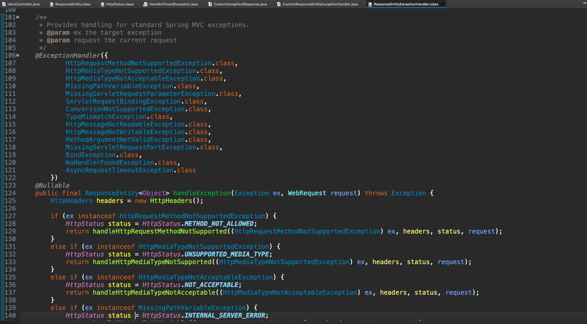
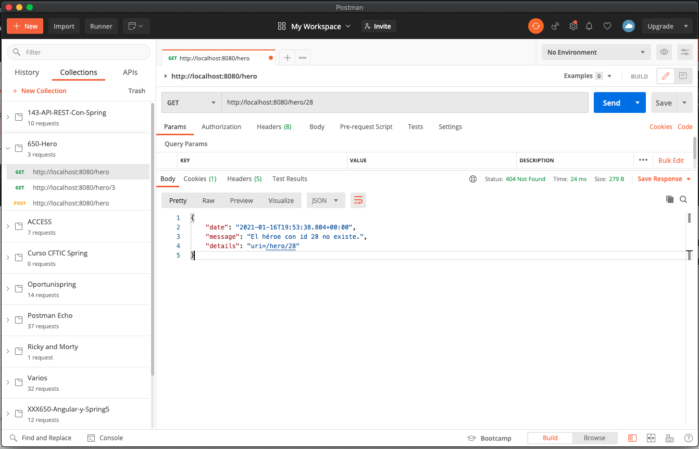

# 12 - Excepciones Personalizadas

En esta lección vamos a crear nuestras excepciones personalizadas, lo primero que vamos a hacer es crear el paquete `exception` y mover allí la excepción `HeroNotFoundException` creada en la lección anterior.

Dentro del paquete `model` vamos a crear la clase `CustomExceptionResponse` que va a representa la estructura básica de todos nuestros mensajes de error de nuestra aplicación devolveremos la fecha, un mensaje que es el que se propaga de la excepción y una serie de detalles dependiendo de la excepción que se capture en cada momento. La clase nos queda así:

`CustomExceptionResponse`

```java
package com.example.shield.model;

import java.util.Date;

public class CustomExceptionResponse {
	
   private Date date;
   private String message;
   private String details;
	
   public CustomExceptionResponse() {
      super();
   }

   public CustomExceptionResponse(Date date, String message, String details) {
      super();
      this.date = date;
      this.message = message;
      this.details = details;
   }

   public Date getDate() {
      return date;
   }

   public void setDate(Date date) {
      this.date = date;
   }

   public String getMessage() {
      return message;
   }

   public void setMessage(String message) {
      this.message = message;
   }

   public String getDetails() {
      return details;
   }

   public void setDetails(String details) {
      this.details = details;
   }

}
```

Ahoraq lo que necesitamos es un punto centralizado dentro de la aplicación que sea el encargado de manejar todas las excepciones que se lancen desde nuestra API, eso lo vamos a conseguir creando una nueva clase que llamaremos `CustomResponseEntityExceptionHandler` en el paquete `controller` que extendera de `ResponseEntityExceptionHandler`. 

* La clase la creamos dentro del paquete `controller` por que es un controlador por eso la anotamos con `@Controller`
* Esta clase da las respuestas de tipo HTTP a nuestro consumer cada vez que se produzca una excepción 
* La manera que tenemos de hacer que el código que se encuentre dentro de esta clase se aplique a todos los controladores de nuestra aplicación va a ser haciendo uso de la anotación `@ControllerAdvice`, con esta anotación los métodos que se encuentran dentro de esta clase se van a aplicar a todos los controladores de nuestra aplicación cuando corresponda.


```java
@ControllerAdvice
@Controller
public class CustomResponseEntityExceptionHandler extends ResponseEntityExceptionHandler {

}
```

Lo que nos interesa es implementar un método como : 

```java
public final ResponseEntity<Object> handleException(Exception ex, WebRequest request){
}
```

La definición la podemos tomar si entramos a `ResponseEntityExceptionHandler`,



este método devuelve un objeto `ResponseEntity<Object>` y recibe como parámetros una `Exception` y una petición `WebRequest`, ademas esta anotado con la anotación `@ExceptionHandler(...)` que recibe como parámetros un listado de excepciones que son las que va a capturar este método. 

Personalizando nuestro método tenemos:


```java
@ExceptionHandler(Exception.class)
public ResponseEntity<Object> handleCustomException(Exception ex, WebRequest request){
		
   CustomExceptionResponse customExceptionResponse = new CustomExceptionResponse(new Date(), ex.getMessage(), request.getDescription(false));
	
   return new ResponseEntity<>(customExceptionResponse, HttpStatus.INTERNAL_SERVER_ERROR);
}
```

* Con `@ExceptionHandler(Exception.class)` le estamos indicando que capture todas las excepciones que sean del tipo de la clase `Exception` o que hereden de esta clase.
* Devolvemos una `ResponseEntity` que recibe dos parámetros el primero del tipo `CustomExceptionResponse` que es el que creamos antes y el segundo es el estado que de momento vamos a poner INTERNAL_SERVER_ERROR para todas las excepciones.

Si probamos la aplicación y buscamoes el usuario que no existe tenemos:


Ahora el formato de error que se devuelve es el formato que nosotros hemos definido, en `details` esta mandando la URI que a provocado el error, en el estado estamos devolviendo un `Status: 500 Internal Server Error`.

¿Cómo podemos hacer para devolver el Status que corresponde? y modificar el `CustomExceptionResponse` a conveniencia de la excepción que recibimos.

Debemos crear otro método muy similar al anterior pero personalizado para manejar solo la excepción `HeroNotFoundException`

```java
@ExceptionHandler(HeroNotFoundException.class)
public ResponseEntity<Object> handleHeroNotFoundException(Exception ex, WebRequest request){
   CustomExceptionResponse customExceptionResponse = new CustomExceptionResponse(new Date(), ex.getMessage(), request.getDescription(false));
		
   return new ResponseEntity<>(customExceptionResponse, HttpStatus.NOT_FOUND);
}
```

* Aquí estamos personalizando el Status que devolvemos, pero podríamos modificar los valores dentro del `CustomExceptionResponse` para personalizar la fecha, mensaje o detalles en este caso lo estamos dejando todo como esta, si probamos nuevamente tenemos:



Vemos que la excepción es la misma por que no hemos echo ninguna modificación pero el estado si ha cambiando regresandonos `Status: 404 Not Found` que es lo que nos viene mejor para este caso.

Bien esta sería la forma de crear nuestras Excepciones Personalizadas (Customer Exceptions) y manejarlas todas desde un punto centralizado de la aplicación.

