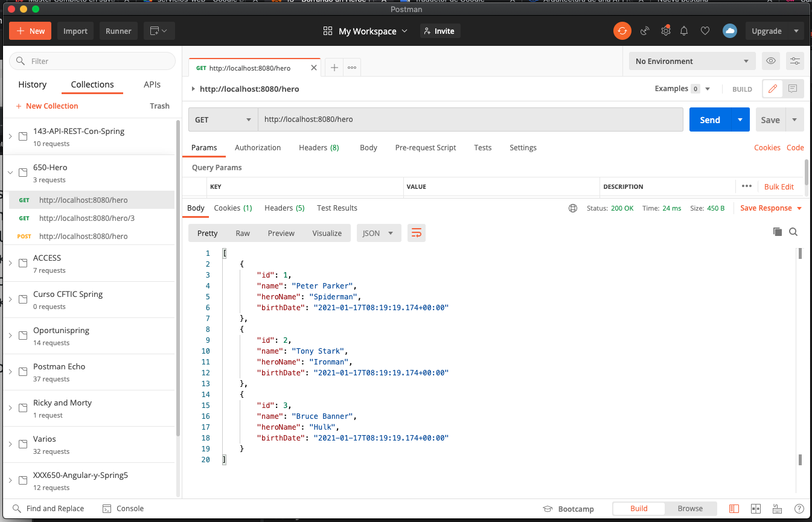
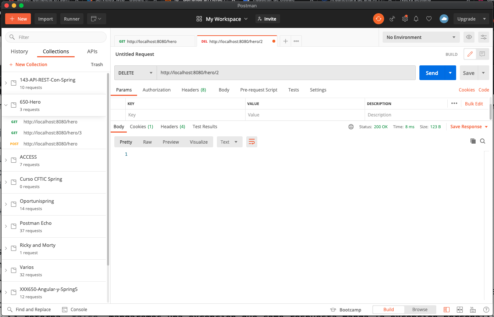
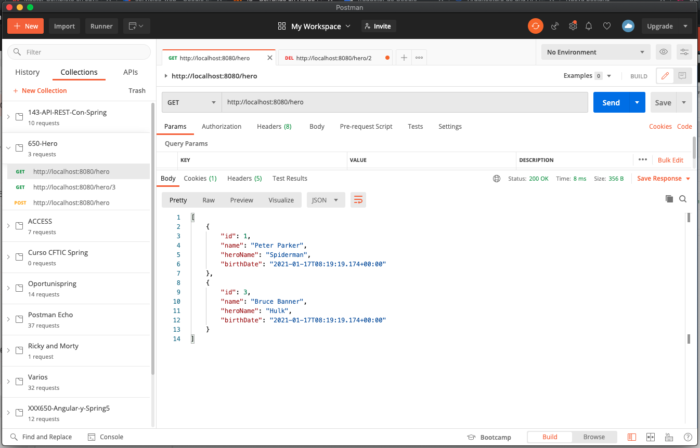
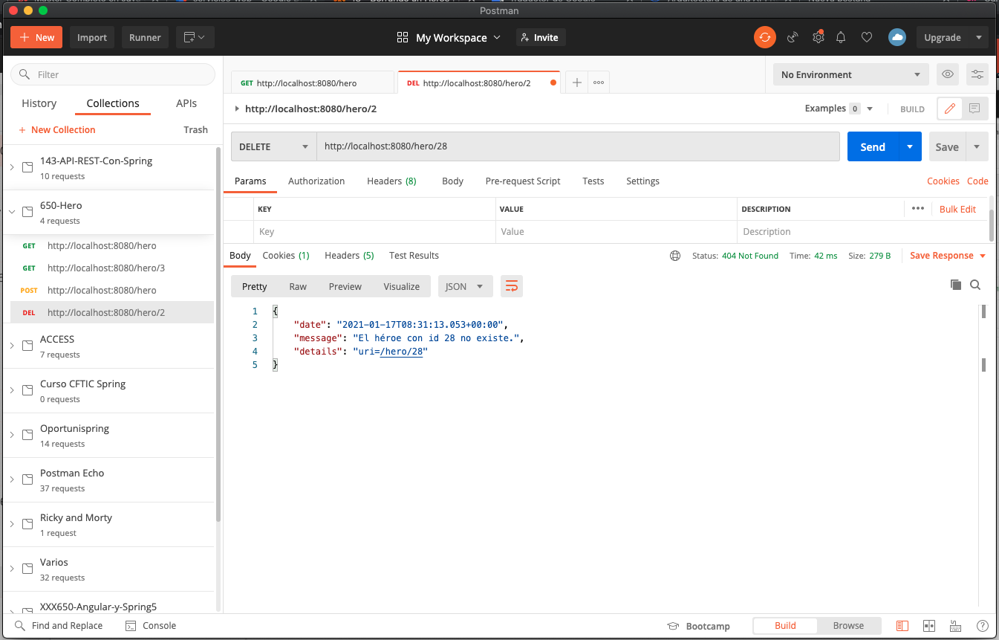

# 13 - Borrando un Heroe

En esta lección vamos a crear el método para poder eliminar un Héroe por medio de un `id` utilizando el método de HTTP `delete`.

En nuestro servicio ya habíamos implementado el método `deleteHero` que nos retorna `true` si se elimino el héroe o `false` si no fue posible. Vamos a implementar ahora el método en el controler.

```java
@DeleteMapping(value="/hero/{id}")
public void deleteHeroById(@PathVariable int id) {
   boolean result = heroDaoService.deleteHero(id);
   if(!result) {
      throw new HeroNotFoundException("El héroe con id " + id + " no existe.");
   }
}
```
* Este método lo anotamos con `@DeleteMapping` para recibir una petición DELETE.
* En este método no vamos a devolver nada.
* Al hacer el borrado nos devolvera `true` o `false`
   * Si devuelve `true` se devolvera la respuesta por defecto que siempre lleva el Status 200, así que el comportamiento será el correcto.
   * Si retorna `false` mandaremos una excepción que como respuesta manda la excepción personalizada con un Status 404

Vamos a probar la aplicación.






