# 14 - Validaciones

En esta lección vamos a ver como añadir validaciones a la hora de insertar un Héroe por que por ahora nos pueden mandar cualquier información en los atributos `name`, `heroName` o `birthDate`, por eemplo nos podrían mandar un `name` o `heroName` vacío o un `birthDate` con un formato de fecha equivocado y eso podría causar un problema a la hora de insertar nuestro nuevo héroe.

Vamos a ver como podemos añadir ciertas validaciones sobre los parámetros de la clase `Hero` y devolver mensajes personalizados en el caso de que estas validaciones no se cumplan.

Lo primero que debemos hacer es en el Controlador en el método `addHero(@RequestBody Hero hero)` tenemos que añadir al lado del objeto que queremos validar (`Hero`) la anotación `@Valid`, esta etiqueta es del paquete `javax.validation` el cual lleva una seré de anotaciones que nos permiten asignar diferentes validaciones a los atributos de nuestra Bean.

El paquete `javax.validation` vendría importado por defecto si usaramos Java 8, pero en nuestro caso el proyecto lo realizamos con Java 11 y con Java 11 han quitado dicho paquete, de hecho la anotación  nos marca error por que no encuentra el paquete. Para resolver el problema debemos añadir el siguiente starter a nuestro `pom.xml`

```xml
<!-- https://mvnrepository.com/artifact/javax.validation/validation-api -->
<dependency>
   <groupId>org.springframework.boot</groupId>
   <artifactId>spring-boot-starter-validation</artifactId>
</dependency>
```

Por lo tanto el método ya puede usar `@Valid`, nos queda así:

```java
@PostMapping("/hero")
public ResponseEntity<Object> addHero(@RequestBody @Valid Hero hero) {
   Hero addHero = heroDaoService.addHero(hero);
	 URI location = ServletUriComponentsBuilder
						.fromCurrentRequest()
						.path("/{id}")
						.buildAndExpand(addHero.getId())
						.toUri();
		
   return ResponseEntity.created(location).build();
}
```
* Estamos aplicando `@Valid` sobre el parámetro de entrada `Hero hero` para que se le apliquen las validaciones que nosotros definamos sobre los atributos de la clase `Hero`.

Vamos a poner un par de validaciones en nuestra clase `Hero`


```java
...
import javax.validation.constraints.Past;
import javax.validation.constraints.Size;

public class Hero {
	
   private int id;
	
   @Size(min = 3)
   private String name;
	
   private String heroName;
	
   @Past
   private Date birthDate;
	
   public Hero() {
   }
   ..
```
* Con la anotación `@Size(min = 3)` estamos indicando que el atributo `name` debe tener como mínimo 3 caracteres.
* Con la anotación `@Past` estamos indicando que el atributo `birthDate` debe contener una fecha del pasado, no puede ser una fecha futura.

Vamos a probar la aplicación con estas dos validaciones.

Vamos a insertar un nuevo heroe.

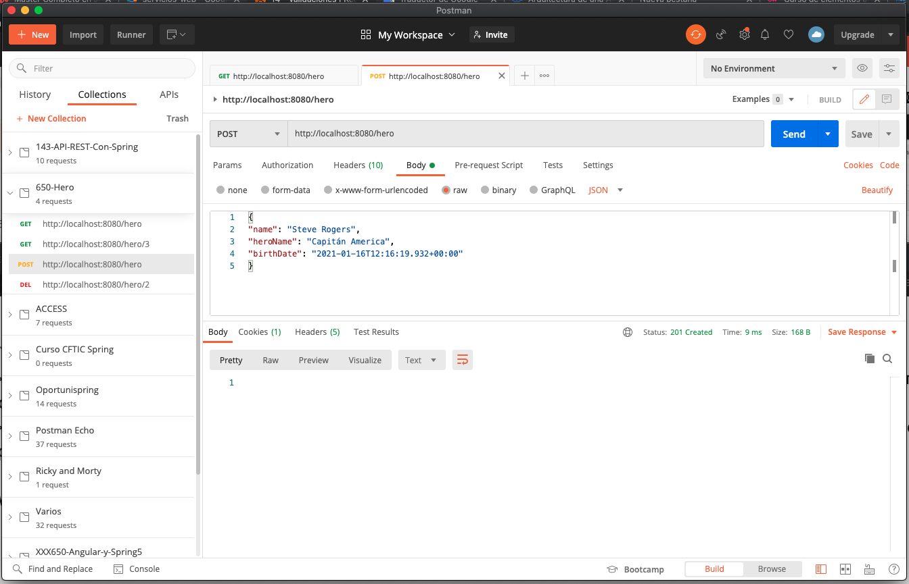

Lo realiza sin problema, ahora vamos a modificar el `name` para mandar solamente un caracter.

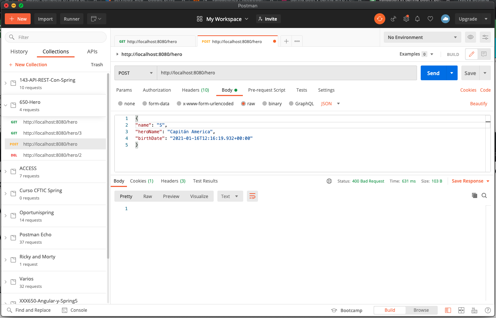

En este caso nos retorna un `Status: 400 Bad Request` la petición es incorrecta, pero en el Body no hay ninguna respuesta no le estamos indicando a nuestro Consumer, a nuestro cliente que es lo que a fallado, que validación es exactamente la que ha fallado. 

¿Cómo podemos solucionar esto? 

Para esto tenemos que ir al punto central de nuestra aplicación que controla las Excepciones es decir a `CustomResponseEntityExceptionHandler` el cual como ya vimos extiende a `ResponseEntityExceptionHandler` el cual tiene un método `handleMethodArgumentNotValid`

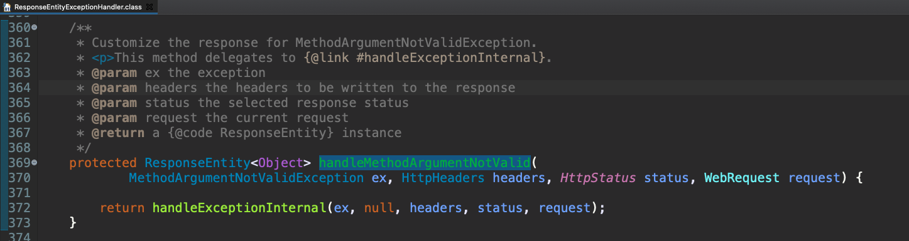

Este método es el que nosotros debemos sobreescribir para personalizar la respuesta que retornemos.

```java
@Override
protected ResponseEntity<Object> handleMethodArgumentNotValid(
  MethodArgumentNotValidException ex, HttpHeaders headers, HttpStatus status, WebRequest request) {

   CustomExceptionResponse customExceptionResponse = 
        new CustomExceptionResponse(new Date(), 
                                    ex.getMessage(), 
                                    request.getDescription(false));
		
   return new ResponseEntity<>(customExceptionResponse, HttpStatus.BAD_REQUEST);
}
```

Si volvemos a probar la aplicación tenemos:

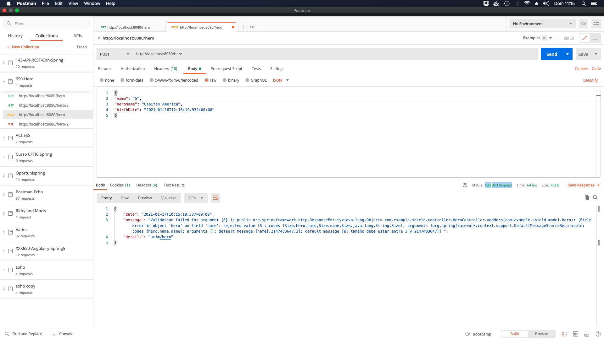

Vemos que seguimos obteniendo `Status: 400 Bad Request` gracias a que lo pusimos en nuestro método pero además nos retorna más información con el formato establecido para nuestras excepciones, pero si es verdad que el mensaje es demasiado grande, quiza ofrece demaciada información, no esta mal pero podría mejorar. Podríamos también personalizar los `details` en la respuesta.

Algunas posibles modificaciones son 

```java
@Override
protected ResponseEntity<Object> handleMethodArgumentNotValid(
  MethodArgumentNotValidException ex, HttpHeaders headers, HttpStatus status, WebRequest request) {

   CustomExceptionResponse customExceptionResponse = 
				new CustomExceptionResponse(new Date(), 
                                    "Error de Validación", 
                                    ex.getBindingResult().toString());
		
   return new ResponseEntity<>(customExceptionResponse, HttpStatus.BAD_REQUEST);
}
```
* Hemos cambiado el mensaje de la excepción por uno personalizado.
* Hemos cambiado la descripción por un BindingResult que nos dice exactamente cual es el error de validación que ha ocurrido.

Si relanzamos la aplicación ahora tenemos en el mensaje `"message": "Error de Validación",` y en los detalles tenemos el BindingResult.

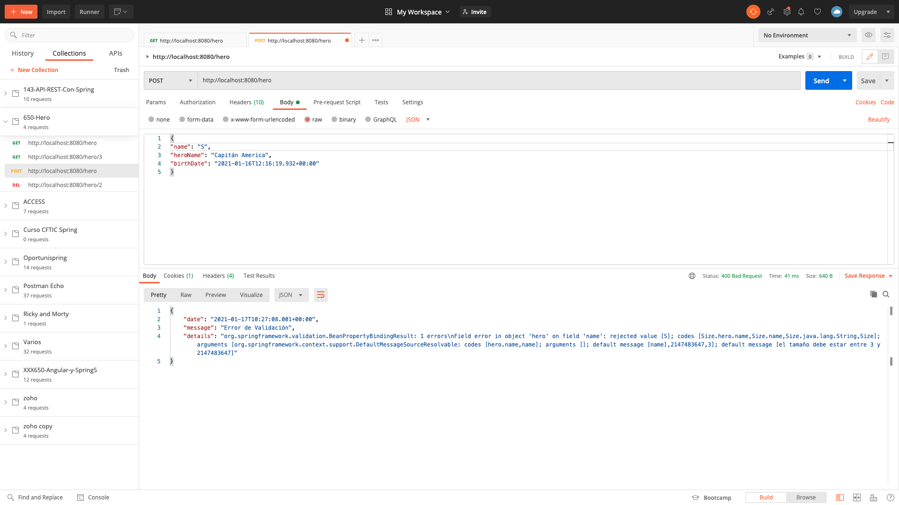

El BindingResult tiene distintos parámetros entre ellos por ejemplo `default message [el tamaño debe estar entre 3 y 2147483647]` como vemos el mensaje que retorna es un mensaje estandar el cual podemos personalizar en nuestra clase `Hero`


```java
...
public class Hero {
	
	private int id;
	@Size(min = 3, message = "El tamaño debe ser mayor que 2")
  ...
```

Si relanzamos la aplicación ahora ya tenemos en default message lo que personalizamos `default message [El tamaño debe ser mayor que 2]`

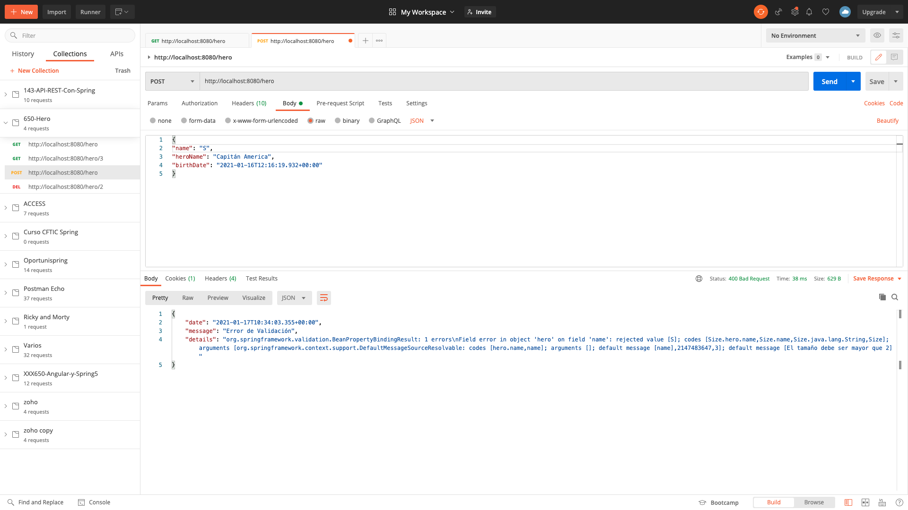

Ahora si en `details` no queremos devolver toda esa información podemos jugar con los métodos de `ex.getBindingResult()` para devolver otra información por ejemplo con:

* Con `ex.getBindingResult().getAllErrors().get(0).getDefaultMessage()` devolvemos el mensaje por default:

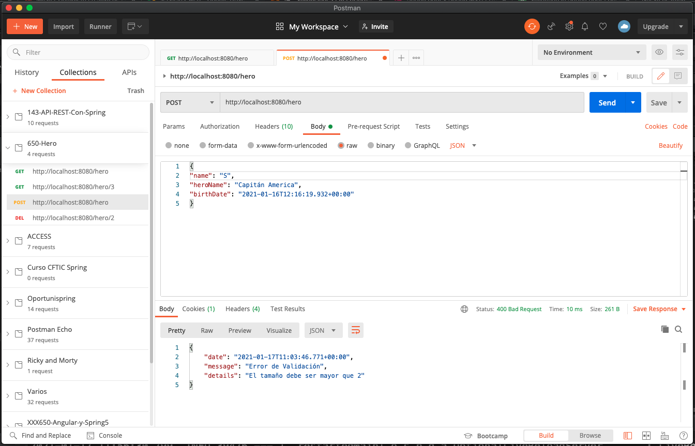

* Con `"Total de errores: " + ex.getBindingResult().getAllErrors().size()` tenemos:


* Con `ex.getBindingResult().getObjectName()` tenemos:

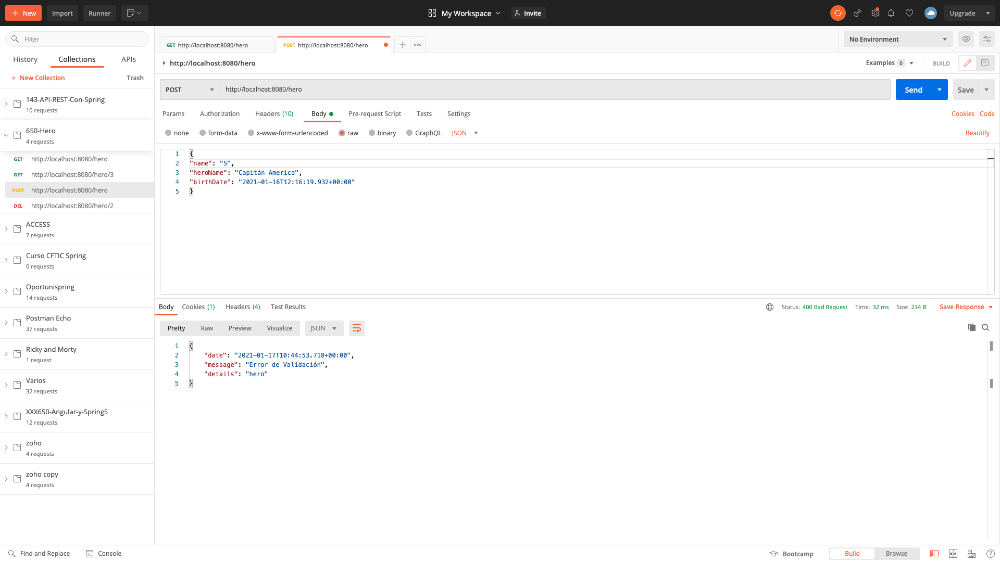

* Con `"Número total de errores: " +  ex.getBindingResult().getErrorCount()` tenemos:

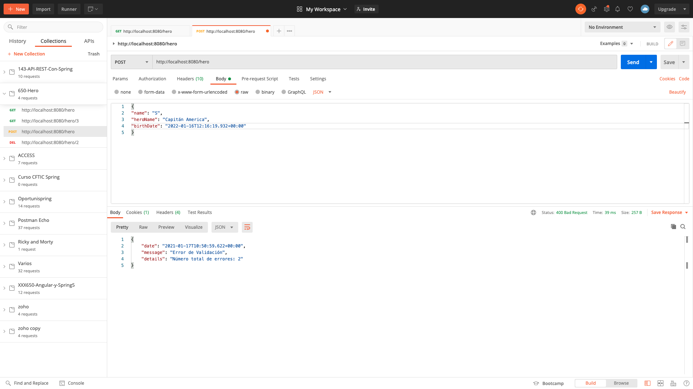

ya que también hemos metido una fecha fututa.

Otra alternativa para manejar los errores cuando estos son muchos se explica en [Custom Error Message Handling for REST API] (https://www.baeldung.com/global-error-handler-in-a-spring-rest-api) para devolver un array con todos los errores que encontramos:

Las adaptaciones que hecho para esto es crear una nueva clase para el formato de las excepciones:


`ApiError`

```java
package com.example.shield.model;

import java.util.Arrays;
import java.util.List;

import org.springframework.http.HttpStatus;

public class ApiError {

    private HttpStatus status;
    private String message;
    private List<String> errors;

    public ApiError(HttpStatus status, String message, List<String> errors) {
        super();
        this.status = status;
        this.message = message;
        this.errors = errors;
    }

    public ApiError(HttpStatus status, String message, String error) {
        super();
        this.status = status;
        this.message = message;
        errors = Arrays.asList(error);
    }

	public HttpStatus getStatus() {
		return status;
	}

	public void setStatus(HttpStatus status) {
		this.status = status;
	}

	public String getMessage() {
		return message;
	}

	public void setMessage(String message) {
		this.message = message;
	}

	public List<String> getErrors() {
		return errors;
	}

	public void setErrors(List<String> errors) {
		this.errors = errors;
	}
    
    
}
```

Y en el Controller de las expeciones el método queda así:

```java
@Override
protected ResponseEntity<Object> handleMethodArgumentNotValid(
			MethodArgumentNotValidException ex, HttpHeaders headers, HttpStatus status, WebRequest request) {

   List<String> errors = new ArrayList<String>();
   for (FieldError error : ex.getBindingResult().getFieldErrors()) {
      errors.add(error.getField() + ": " + error.getDefaultMessage());
   }
   for (ObjectError error : ex.getBindingResult().getGlobalErrors()) {
      errors.add(error.getObjectName() + ": " + error.getDefaultMessage());
   }
	    
   ApiError apiError = new ApiError(HttpStatus.BAD_REQUEST, ex.getLocalizedMessage(), errors);

   return handleExceptionInternal(ex, apiError, headers, apiError.getStatus(), request);
	}
```

El resultado que obtenemos es:

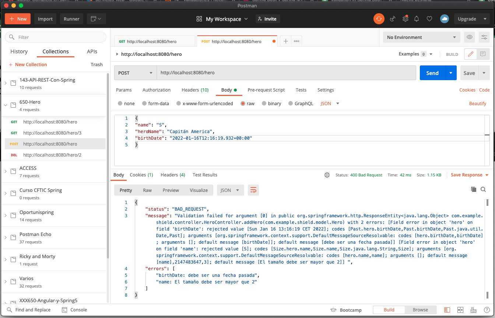

Tiene en un array todos los posibles errores que se puedan producir y esto al cliente o consumer le puede venir muy bien, como vemos la forma de retornar la respuesta puede variar dependiendo de nuestras necesidades.

Tendríamos que darle una vuelta a esta solución para adaptarla a nuestra propia aplicación ya que podemos añadir el atributo `private List<String> errors;` a nuestro `CustomExceptionResponse` y debemos modificar nuestra clase `CustomResponseEntityExceptionHandler` por que al constructor hay que pasarle la lista de errores, una solucion provicional es:


```java
@ControllerAdvice
@Controller
public class CustomResponseEntityExceptionHandler extends ResponseEntityExceptionHandler {
	
   @ExceptionHandler(Exception.class)
   public ResponseEntity<Object> handleCustomException(Exception ex, WebRequest request){
		
      List<String> errors = new ArrayList<String>();
      errors.add(ex.getMessage());
	    
      CustomExceptionResponse customExceptionResponse = 
           new CustomExceptionResponse(new Date(), 
	                               ex.getMessage(), 
				       request.getDescription(false),
				       errors);
	
      return new ResponseEntity<>(customExceptionResponse, HttpStatus.INTERNAL_SERVER_ERROR);
   }
	
   @ExceptionHandler(HeroNotFoundException.class)
   public ResponseEntity<Object> handleHeroNotFoundException(Exception ex, WebRequest request){
		
      List<String> errors = new ArrayList<String>();
      errors.add(ex.getMessage());
		
      CustomExceptionResponse customExceptionResponse = new CustomExceptionResponse(new Date(), ex.getMessage(), request.getDescription(false),errors);
		
      return new ResponseEntity<>(customExceptionResponse, HttpStatus.NOT_FOUND);
   }
	
   @Override
   protected ResponseEntity<Object> handleMethodArgumentNotValid(
      MethodArgumentNotValidException ex, HttpHeaders headers, HttpStatus status, WebRequest request) {

      List<String> errors = new ArrayList<String>();
      for (FieldError error : ex.getBindingResult().getFieldErrors()) {
         errors.add(error.getField() + ": " + error.getDefaultMessage());
      }
      for (ObjectError error : ex.getBindingResult().getGlobalErrors()) {
         errors.add(error.getObjectName() + ": " + error.getDefaultMessage());
      }
	    
      CustomExceptionResponse customExceptionResponse = 
           new CustomExceptionResponse(new Date(), 
                                       "Error de Validación", 
                                       ex.getBindingResult().toString(),
                                       errors);
		
      return new ResponseEntity<>(customExceptionResponse, HttpStatus.BAD_REQUEST);
		
   }
}
```

Lo que obtendríamos cuando se lancen excepciones es lo siguiente:

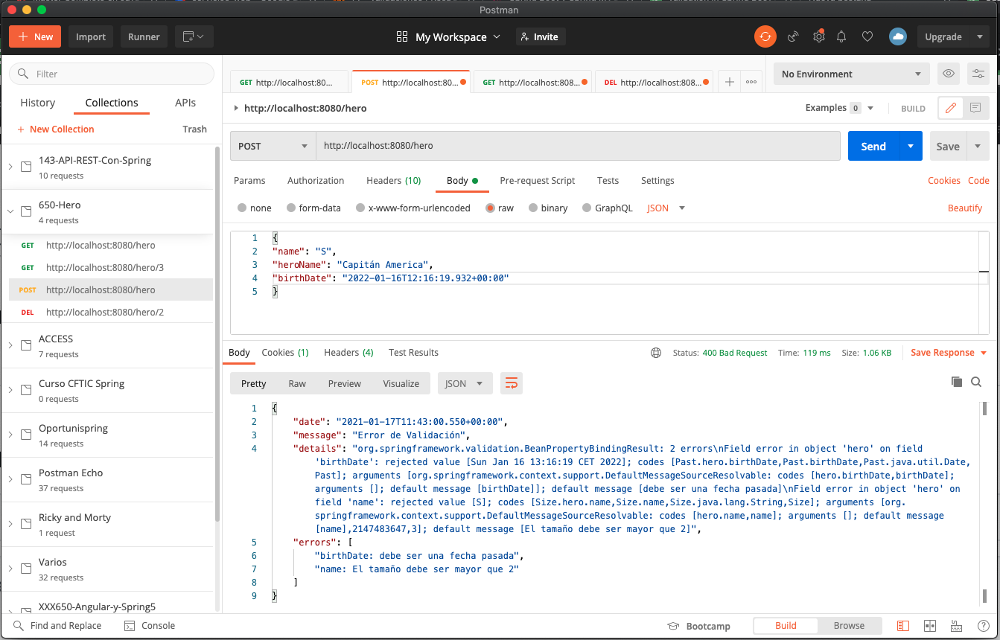
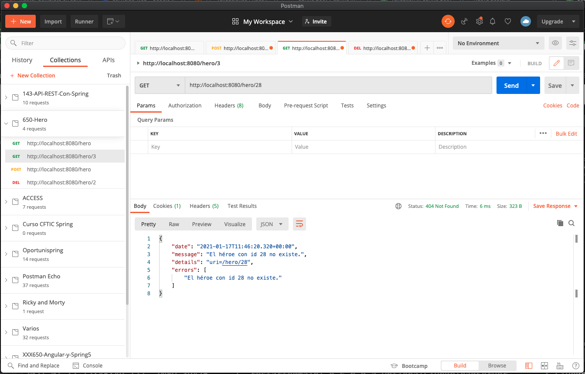
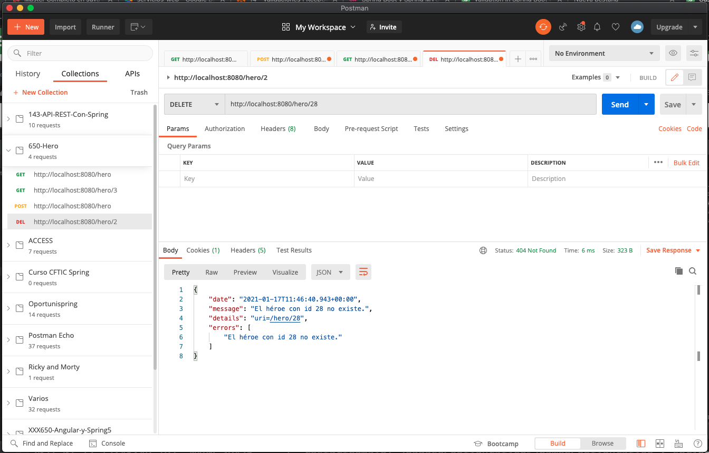


