# 15 - Internacionalización

En esta lección vamos a ver como Internacionalizar nuestra API REST, esto lo lograremos usando unos archivos properties para poder devolver diferentes mensajes estandar de nuestra aplicación en distintos idiomas, en función de un Header o bien del Locale que este configurado en el Cliente que este haciendo uso de nuestra API REST.

Si es necesario en el siguiente enlace existe un ejemplo detalla [Spring Boot REST – Internationalization](https://howtodoinjava.com/spring-boot2/rest/i18n-internationalization/)

Lo primero que vamos a necesitar es un `LocaleResolver` que lo vamos a incluir en nuestra clase principal `ShieldApplication`

```java
// configuring default locale
@Bean
public LocaleResolver localeResolver() {
   SessionLocaleResolver localeResolver = new SessionLocaleResolver();
   localeResolver.setDefaultLocale(Locale.US);
   return localeResolver;
}
```
* Lo anotamos con `@Bean` para que lo podamos inyectar donde lo necesitemos.
* Establecemos la localización por defecto a US.

Lo siguiente que vamos a necesitar es un `MessageSource` con el que podemos acceder a los distintos tipos de propiedades donde van a estar configurados los mensajes que vamos a devolver en los distintos idiomas.

```java
// configuring ResourceBundle
@Bean
public ResourceBundleMessageSource messageSource() {
   ResourceBundleMessageSource messageSource = new ResourceBundleMessageSource();
   messageSource.setBasename("messages");
   return messageSource;
}
```
* Lo anotamos con `@Bean`
* El `Basename` lo establecemos a `messages`

Estos son los dos Beans que necesitamos.

A continuación lo que vamos a hacer es crear unos Resouces Bundle, es posible que necesitemos intalar un Pluging en Eclipse para poder gestionar este tipo de archivos.

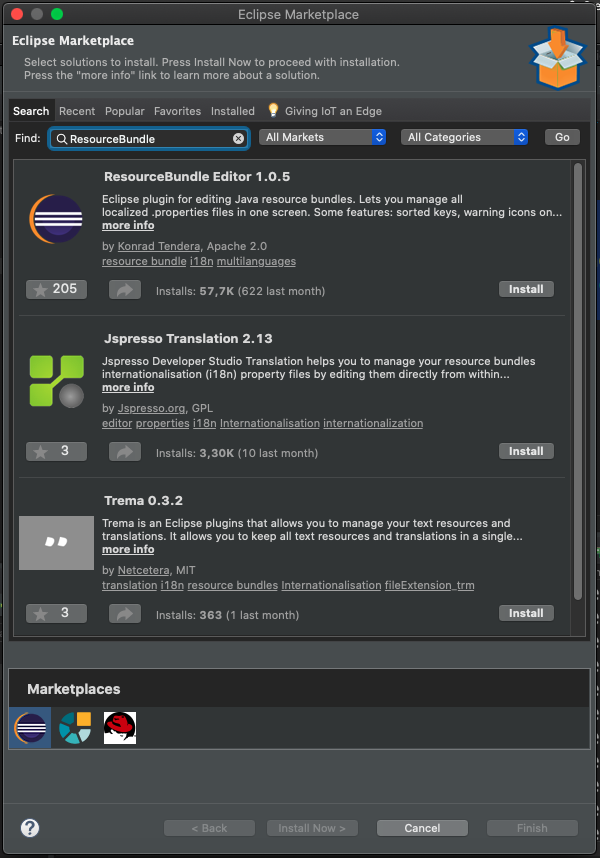


dentro de la carpeta `resources` vamos a crear un Resouce Bundle 

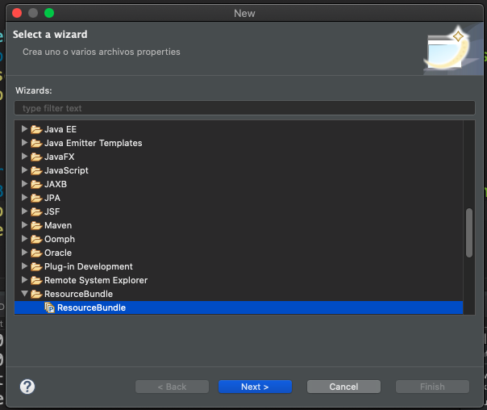
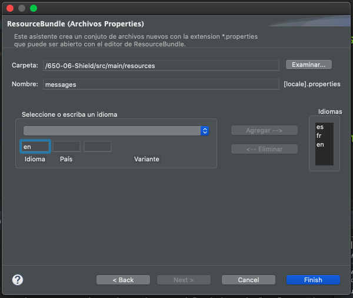
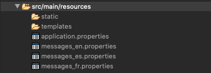

Vamos a colocar el siguiente mensaje en cada archivo:


`message.properties`
```txt
hello.world.message="Hola mundo!"
```

`message_es.properties`
```txt
hello.world.message="Hola mundo!"
```

`message_fr.properties`
```txt
hello.world.message="Salut monde!"
```

`message_en.properties`
```txt
hello.world.message="Hello World!"
```

Con esto ya tenemos los `message.properties` en los distintos idiomas.

Ahora lo que necesitamos es que en el `HelloWorldController` hacer uso del `MessageSource` inyectandolo en nuestra clase para poder usarlo:

```java
@Autowired
private MessageSource messageSource;
```

Vamos a cambiar nuestro método:

```java
@GetMapping("/hello-world")
public String helloWorld() {
   return "Hello World!";
}
```

Por 

```java
@GetMapping("/hello-world")
public String helloWorld(@RequestHeader(name = "Accept-Language", required = false) Locale locale) {
   return messageSource.getMessage("hello.world.message", null, locale);
}
```
* El método recibe como parámetro un `locale` que anotamos con `@RequestHeader` para indicar que este valor se manda como parámetro en los Headers y que en este caso es de tipo `Accept-Language` y ponemos el Header como no requerido, lo que significa que si no se manda toma el `locale` por defecto y si se manda tomara lo que le llegue. 
* En lugar de devolver un mensaje fijo hacemos uso del `messageSource` para obtener un mensaje de las properties pasando como parámetros el mensaje que queremos recuperar, como segundo parárametro pasamos `null` por que "no pasamos parámetros" y como tercer parametro es el `Locale` que pasemos como parámetro. 

Vamos a probar la aplicación.

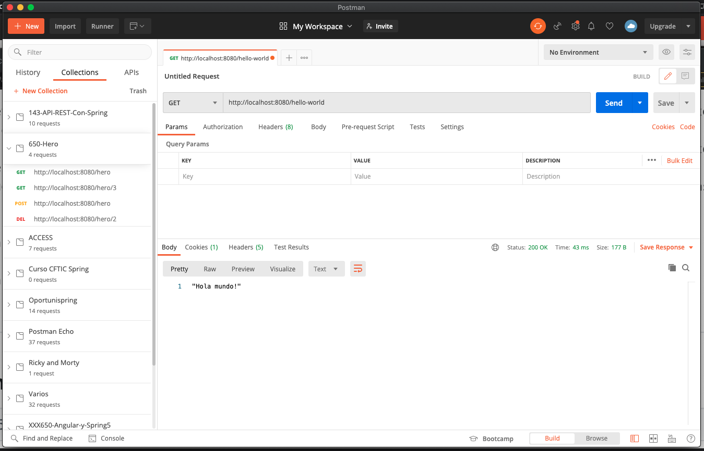
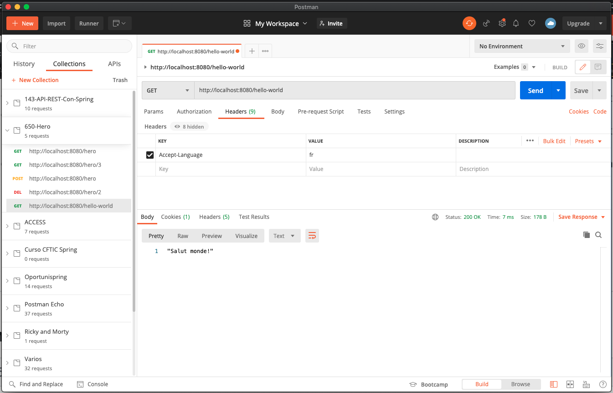


Hay un par de cosas que podemos hacer para simplificar lo que hemos hecho, por ejemplo en lugar de obtener el `Accept-Language` de un Header que nos permite enviar este valor, podemos hacer que el `Locale` lo coja del cliente que esta consumiendo el API usando el objeto `LocaleContextHolder`

Vamos a cambiar el método:

```java
@GetMapping("/hello-world")
public String helloWorld(@RequestHeader(name = "Accept-Language", required = false) Locale locale) {
   return messageSource.getMessage( "hello.world.message", null, locale);
}
```

Como sigue:

```java
@GetMapping("/hello-world")
public String helloWorld() {
   return messageSource.getMessage( "hello.world.message", null, LocaleContextHolder.getLocale());
}
```
* Ya no recibimos el parámetro `Locale`.
* Obtenemos el `Locale` del objeto `LocaleContextHolder` de acuerdo a la configuración del Cliente que acceda a nuestra API REST.

Por otro lado podemos configurar el `Basename` dentro del archivo de configuración `application.properties` colocando la siguiente propiedad:

```txt
spring.message.basename="messages"
```

Y con estas dos modificaciones podemos eliminar los dos Beans que habíamos insertado anteriormente en nuestra clase principal `ShieldApplication`:

```java
   // configuring default locale
   @Bean
   public LocaleResolver localeResolver() {
      SessionLocaleResolver localeResolver = new SessionLocaleResolver();
      localeResolver.setDefaultLocale(Locale.US);
      return localeResolver;
   }

   // configuring ResourceBundle
   @Bean
   public ResourceBundleMessageSource messageSource() {
      ResourceBundleMessageSource messageSource = new ResourceBundleMessageSource();
      messageSource.setBasename("messages");
      return messageSource;
   }
```

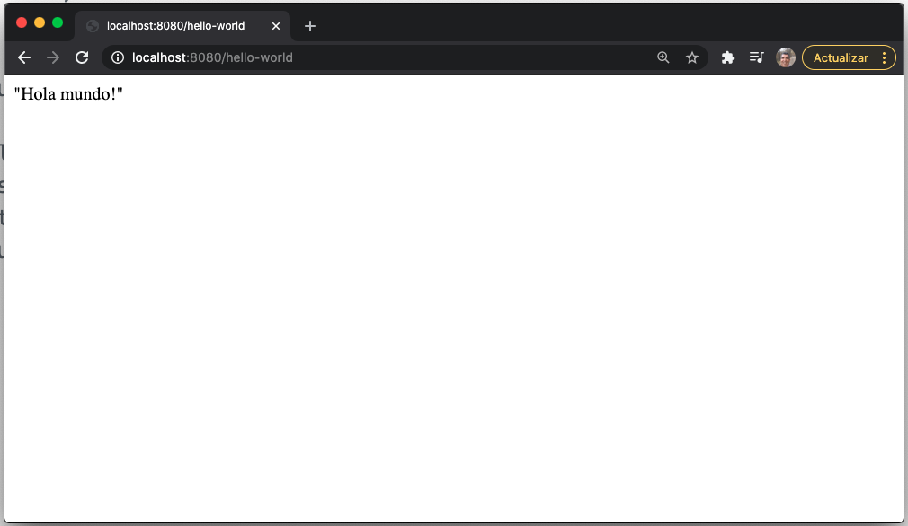

En teoría toma el Locale del Cliente.

En Postman seguimos pasando el `Accept-Language` que puede ser que lo tome como el Locale del Cliente y funciona correctamente cada petición.

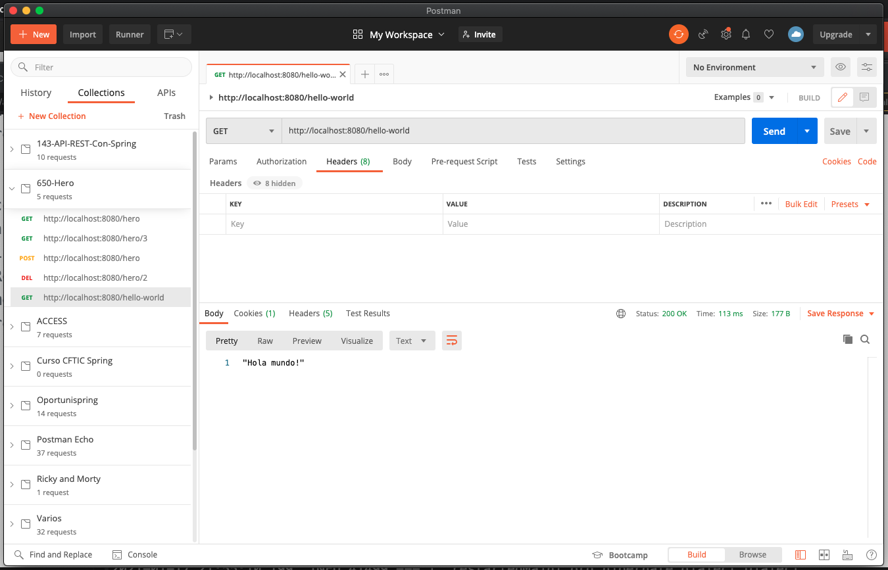
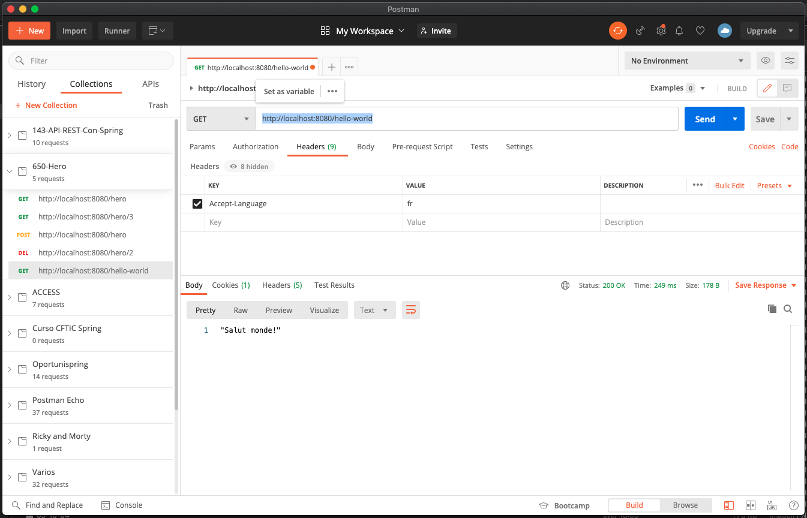
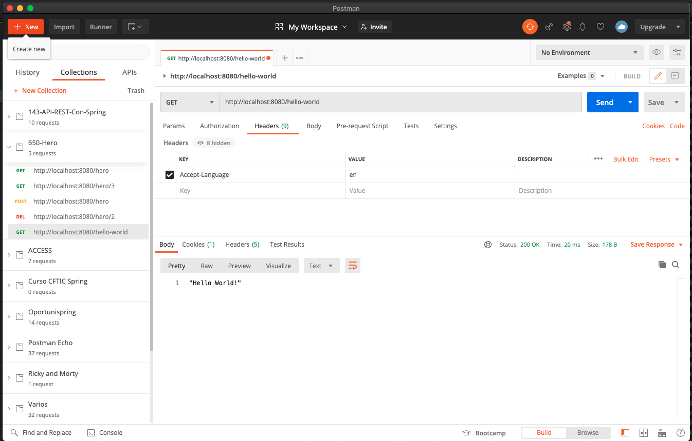
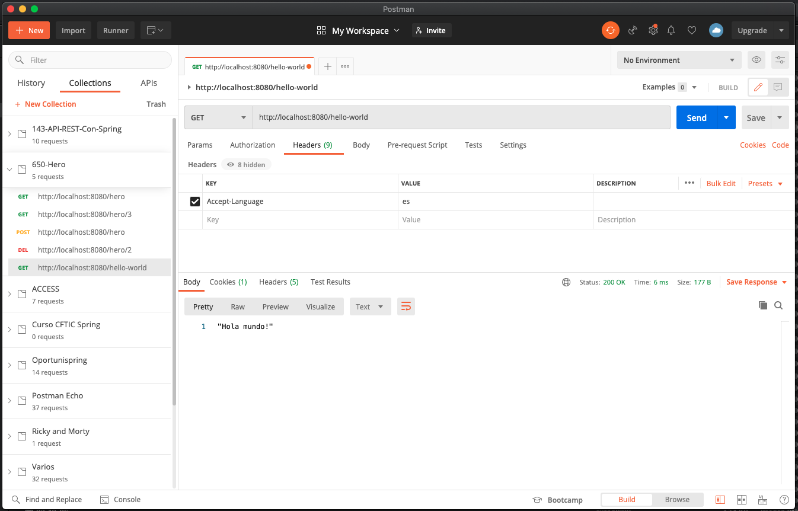
