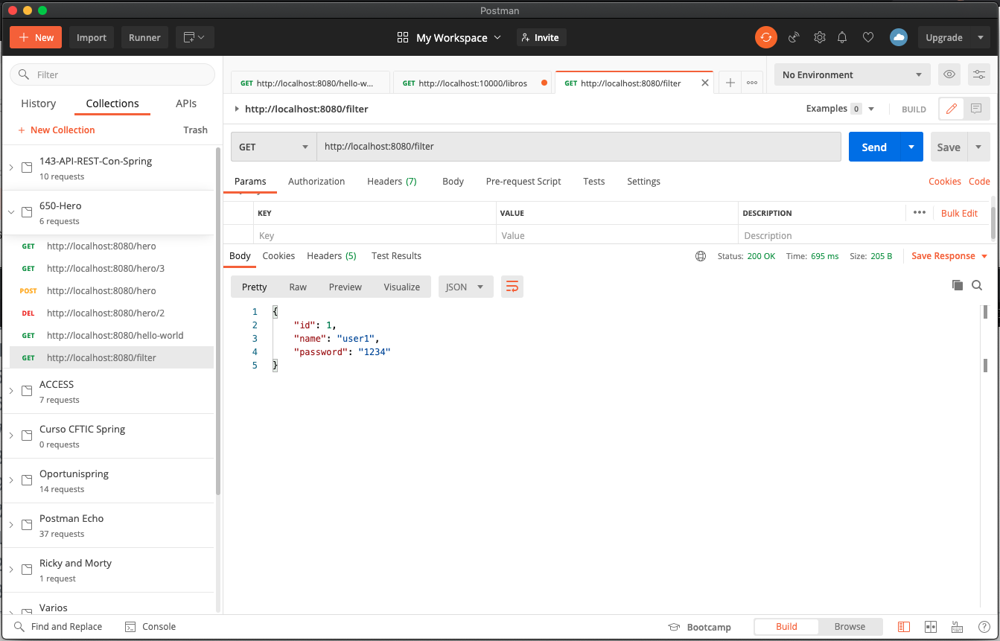
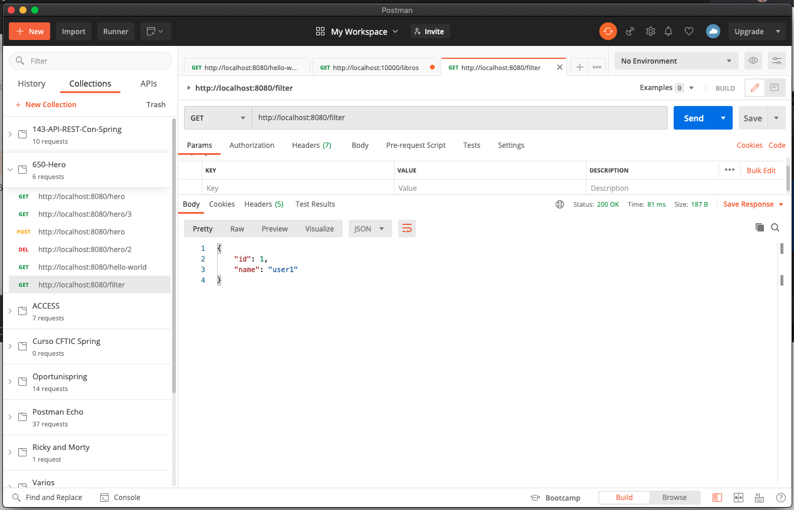

# 16 - Filtrado Estatico

En esta lección vamos a ver como podemos filtrar los datos que devolvemos cuando hacemos cualquier petición a nuestro MicroServicio. en ciertos escenarios puede ser interesante que algunos campos de una determinada entidad que nos puedan servir para procesamiento interno o para otras distintas consultas no sean devueltos para cuando se solicita la información de esa entidad en concreto, por poner un ejemplo, imaginar un Bean que representa un usuario, nosotros a la hora de almacenar ese usuario en BD vamos a utilizar una Entidad por ejemplo `UserEntity` que va a tener una serie de campos que nos van a permitir autenticarnos en nuestra aplicación:

`UserFilteredDto`

```java
package com.example.shield.filtering;

public class UserFilteredDto {
	
   private int id;
   private String name;
   private String password;
  
   public UserFilteredDto() {
      super();
   }
	
   public UserFilteredDto(int id, String name, String password) {
      super();
      this.id = id;
      this.name = name;
      this.password = password;
   }
  
   public int getId() {
      return id;
   }
   public void setId(int id) {
      this.id = id;
   }
   public String getName() {
      return name;
   }
   public void setName(String name) {
      this.name = name;
   }
   public String getPassword() {
      return password;
   }
   public void setPassword(String password) {
      this.password = password;
   }
}
```

Por lo tanto cuando se nos solicite información sobre un usuario desde la parte frontal es muy probable que no queramos enviar el campo `password` es un campo que no queremos devolver cuando nos pidan información sobre el usuario, solo queremos devolver el `id` y `name`, el `password` solo nos va a servir para comprobar cuando un usuario se quiere autenticar pero no necesitamos devolverlo al frontal, por lo tanto tendríamos que encontrar la manera de foltrar ese `password` y que no se devolviera cuando se solicite información.
 
Ahora vamos a crear un controlador que se llame `FilteringController` 


```java
package com.example.shield.filtering;

import org.springframework.web.bind.annotation.GetMapping;
import org.springframework.web.bind.annotation.RestController;

@RestController
public class FilteringController {
	
   @GetMapping("/filter")
   public UserFilteredDto getUserFiltered() {
      return new UserFilteredDto(1, "user1", "1234");
   }

}
```

Si levantamos la aplicación y hacemos una petición a la URL http://localhost:8080/filter



Se nos esta devolviendo el usuario con todos los campos, ahora si nosotros si queremos evitar devolver el campo `password` vamos a tener varias opciones que funcionan de la misma manera:

* Con la anoración `@JsonIgnore` que se puede aplicar sobre el atributo o sobre el método `getPassword()`, funciona igual.
* Podemos hacerlo a nivel de clase anotandola con `@JsonIgnoreProperties` y entre parentesis los valores de las propiedades que no queremos devolver `@JsonIgnoreProperties(value = {"password"})` (Ojo cuando se refactoriza un campo no olvidar cambiarlo)

Ambas opciones funcionan igual, vamos a probar la primera opción con sus dos variantes:

```java
public class UserFilteredDto {
	
   private int id;
   private String name;
   @JsonIgnore
   private String password;
   ...
```

```java
...
@JsonIgnore
public String getPassword() {
   return password;
}
...
```



Vemos que en ambos casos el `password` no se devuelve.

Ahora vamos a probar con la anotación `@JsonIgnoreProperties(value = {"password"})`

```java
@JsonIgnoreProperties(value = {"password"})
public class UserFilteredDto {
	
   private int id;
   private String name;
   private String password;
   
   ...
```


Nos regresa el mismo resultado.

Usando cualquiera de las tres variantes es una forma que tenemos para filtrar ciertos atributos de una entidad que no queremos devolver al frontal, esto se aplica siempre a las entidades por ejemplo si solicitamos un listado de `UserFilteredDto` todos los elementos devueltos se devolverían sin `password` por que hemos hecho el filtro en la propia entidad, no importando que variante allamos usado. El problema con esto es que es un filtrado estático siempre que se haga una petición a `/filter` no se enviará el campo `password`, pero puede haber ocaciones que queramos decidir desde el frontal que datos queremos que el Backend nos envie y cuales no, en ese caso lo que necesitamos aplicar es un filtrado dinámico 
