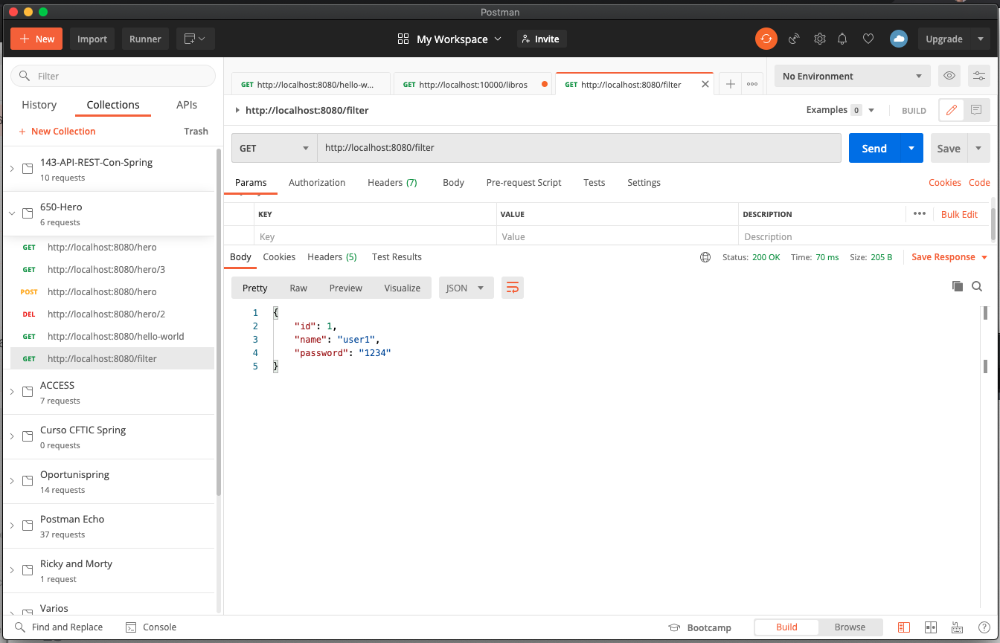
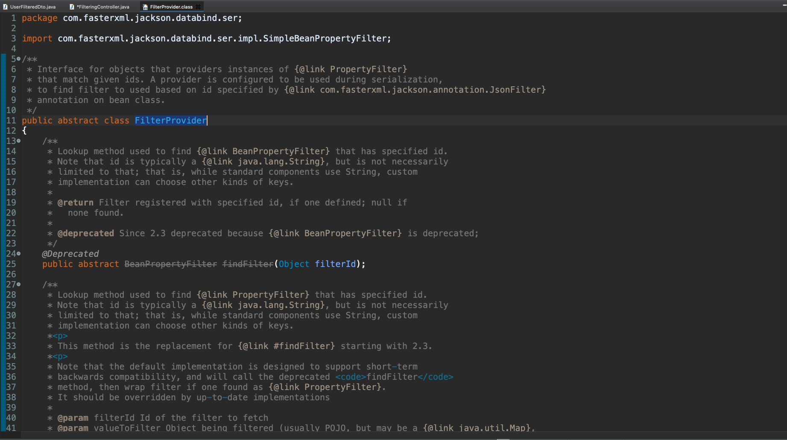
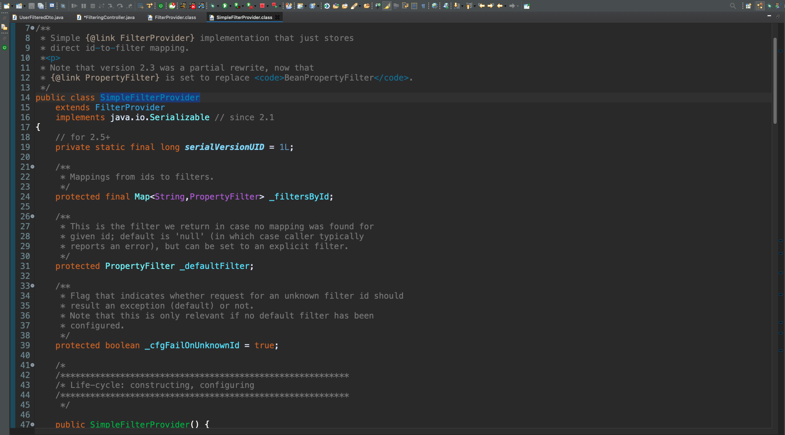
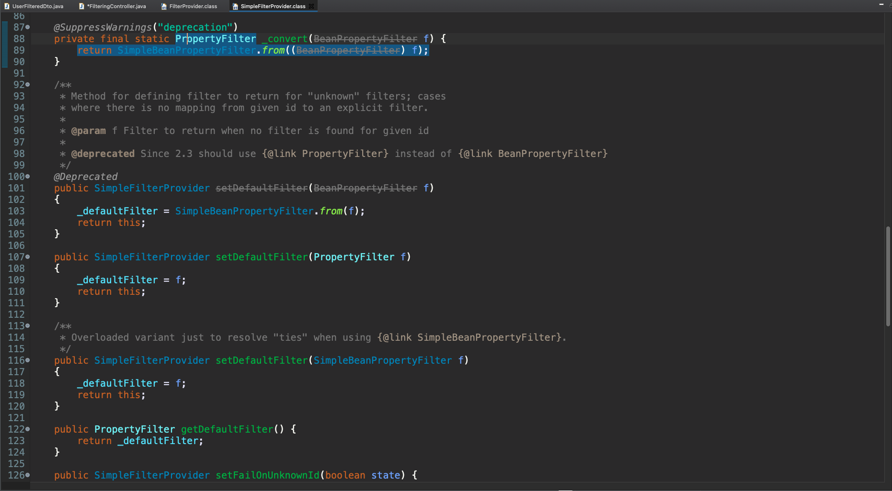
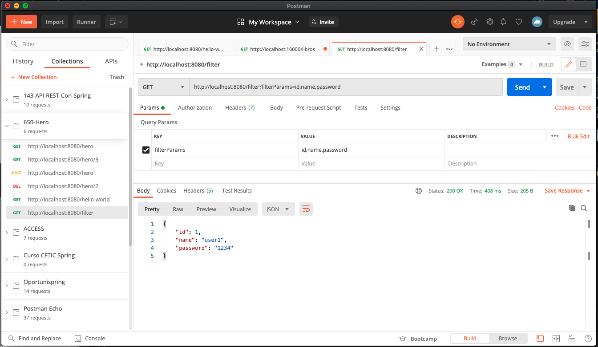
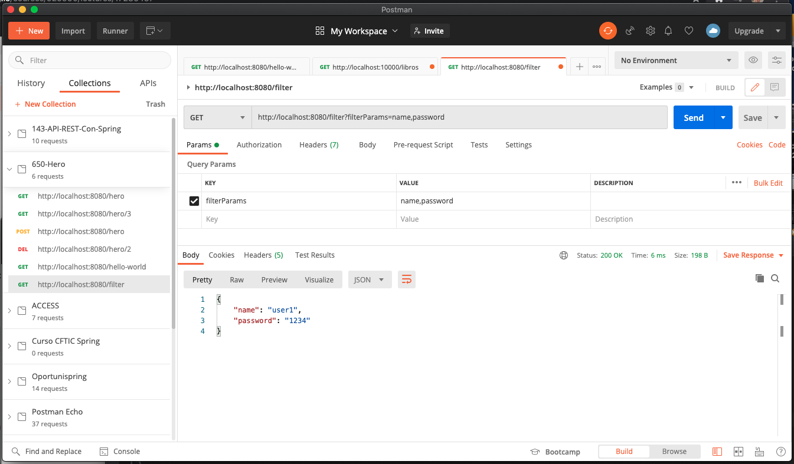
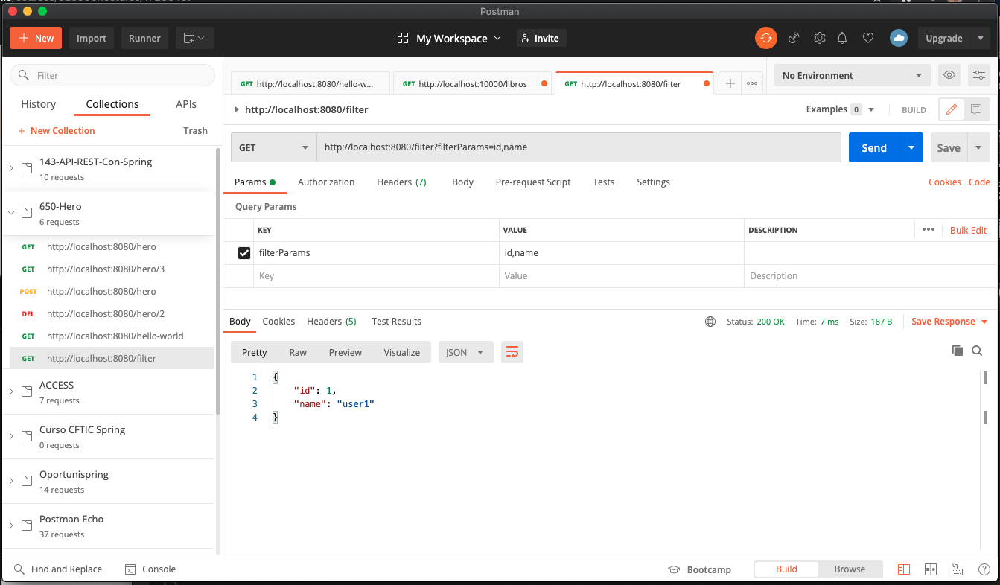
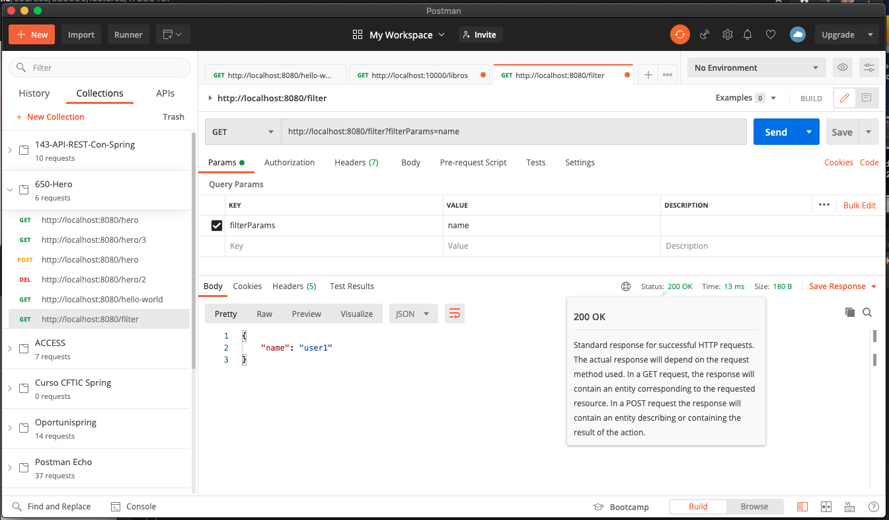
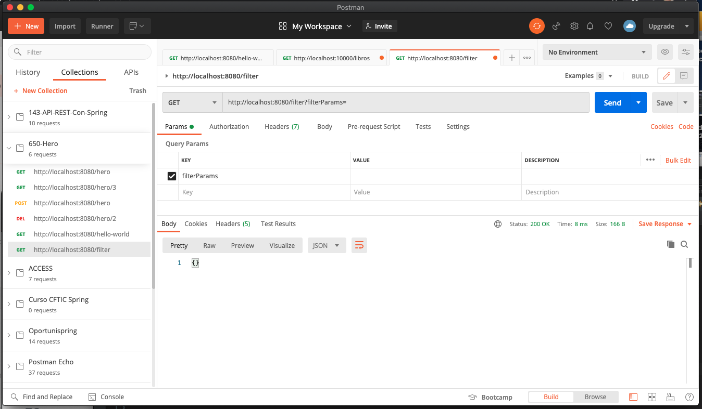

# 17 - Filtrado Dinámico

Ya vimos que el filtrado estático tenia sus limitaciones, si nosotros en otro endpoint quisieramos por ejemplo devolver el `name` y el `password` y evitar devolver el `id` no podríamos hacerlo, ya tenemos la entidad de manera estática y no podemos modificar esto a posteriory, igualmente si quisieramos hacer ese filtrado mediante un parámetro que nos enviase el front tampoco lo podríamos hacer, en esta lección vamos a hacer un filtrado dinámico que resulta ser más interesante.

Lo primero que vamos a hacer es quitar la anotación `@JsonIgnore` de la entidad, y vamos al controlador donde vamos a usar una clase que se llama  `MappingJacksonValue`.

```java
@RestController
public class FilteringController {
	
   @GetMapping("/filter")
   public MappingJacksonValue getUserFiltered() {
      UserFilteredDto userFilteredDto =  new UserFilteredDto(1, "user1", "1234");
      MappingJacksonValue mappingJacksonValue = new MappingJacksonValue(userFilteredDto);
		
      return mappingJacksonValue;
   }

}
```

Con esto estamos devolviendo el objeto tal cual por que no estamos filtrando nada.



Para filtrar debemos establecer un filtro, los filtros son de la clase `FilterProvider`, si vamos a la clase `FilterProvider` nos daremos cuenta que es una clase abstracta 



y que tiene una implementación `SimpleFilterProvider`



que es la que vamos a usar nosotros, 



el `SimpleFilterProvider` puede recibir un `PropertyFilter`, una serie de filtros que van a ser del tipo `PropertyFilter`. 

El método nos queda así:

```java
@GetMapping("/filter")
public MappingJacksonValue getUserFiltered(@RequestParam String filterParams) {
   //Creamos un Set de Strings con los parámetros que recibimos del frontal
   Set<String> filters = new HashSet<>(Arrays.asList(filterParams.split(",")));
   
   UserFilteredDto userFilteredDto =  new UserFilteredDto(1, "user1", "1234");
   
   //Indicamos que propiedades se quedan
   SimpleBeanPropertyFilter propertyFilter = SimpleBeanPropertyFilter.filterOutAllExcept(filters);
   
   //Configuramos el filter
   FilterProvider filter = new SimpleFilterProvider().addFilter("UserFilter",propertyFilter);
   
   //Establescemos datos y filtros
   MappingJacksonValue mappingJacksonValue = new MappingJacksonValue(userFilteredDto);
   mappingJacksonValue.setFilters(filter);
   
   //Retornamos la respuesta
   return mappingJacksonValue;
}
```
* El `SimpleBeanPropertyFilter` tiene una serie de métodos para filtrar.
* Con el método `filterOutAllExcept()` vamos a poder filtrar las propiedades excepto las que nosotros le indiquemos, es decir que le pasamos como parámetro las propiedades que queremos que se queden y las que no se indiquen en este set se descartaran.
* Al método le vamos a pasar las propiedades que queremos que nos mande el Backend

Lo que nos queda es asociar el filtro `"UserFilter"` al DTO que queremos filtrar.

```java
@JsonFilter("UserFilter")
public class UserFilteredDto {
	
   private int id;
   private String name;
   private String password;
   ...
```

Ahora ejecutamos la aplicación y hacemos la posibles peticiones 








