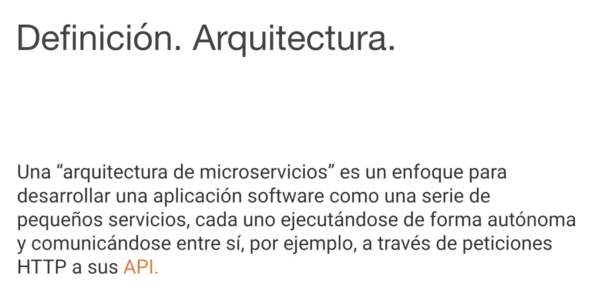
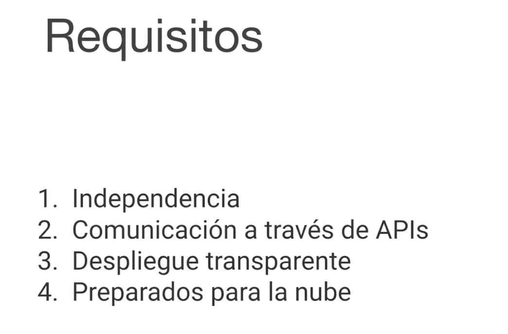

# 01 - Introducción a los microservicios

En esta lección vamos a ver una introducción a los MicroServicios, vamos a definir lo que es un Microservicio, vamos a comparar lo que son los MicroServicios con la tradicional arquitectura monolitica que serían las aplicaciones Web hasta ahora y vamos a ver también los retos que se nos presentan a la hora de implementar una arquitectura de MicroServicios.

Definir un MicroServicio es bastante complicado por que hay discrepacias en cuanto a los tamaños que los MicroServicios deben tener, la encapsulación que deben tener, podemos ver una definición en la diapositiva.

Los principales requisitos que debe cumplir los MicroServicios son:

1. Que sean **Independientes**
2. Que se **comuniquen a través de APIs**

   Con estas dos primeras característivas nos va a permitir definir los MicroServicios que componen una aplicación incluso en distintas tecnologías, una aplicación que sigue una arquitectura de MicroServicios podría estar compuesta con MicroServicios escritos con NodeJS, otros escritos en Java o .NET.

   Otros requisitos que necesitamos son:

3. El **despliegue sea transparente**.

   ¿Por qué es esto?, por que cuando nosotros creamos una aplicación basada en la arquitectura de MicroServicios los microservicios normalmente van a tener diferentes instancias, es decir si nosotros tenemos un MicroServicio de Login, es posible que este MicroServicio de Login lo tengamos desplegado en diferentes servidores a la vez, por que esa es una de las ventajas de los MicroServicios el hecho que nos permitan escalar ciertas partes de la aplicación de manera independiente, entonces si por ejemplo dentro de nuestra aplicación del MicroServicio de Login es una parte de la aplicación que recibe especialmente un numero grande de llamadas podemos necesitar escalar hacia arriba la parte en concreto de la aplicación sin tener que escalar el resto de partes de la aplicación, entonces si tuvieramos el MicroServicio que se encargara de la parte del Login, podríamos necesitar que dinamicamente ese MicroServicio este desplegado en 5 servidores por ejemplo y si nos llega más carga desplegarlo en 8 servidores y cuando la carga sea menor bajar ese despliegue a simplemente 1 servidor, que esto también nos permite ahorrarnos costes.

   ¿Qué es lo que ocurre? ¿Qué problema hay con esto?

   Cada vez que nosotros levantamos un servidor ese servidor se levanta en otro puerto distinto, no pueden estar exactamente en la misma dirección de Internet que todas las instancias del MicroServicio de Login por que chocarían unas con otras, sin embargo tampoco nos podemos permitir el hecho que cada vez que se levantye una instancia nueva del MicroServicio de Login tengamos que parar la aplicación, añadir esa instancia nueva a un listado de instancias en las que esta registrado el MicroServicio de Login y volver a levantar la aplicación, esta gestión de instancias del hecho que se puedan levantar distintas instancias de un MicroServicio o tirarlas debe ser una gestión que debe ser transparente a los programadores, debe estar externalizada y no debe necesitar intervención humana ninguna, sino que debe ser posible configurarla y que ese despliegue sea transparente para el programador.

   Otro requisito importante es:

4. Los MicroServicios deben estar **preparados para la nube**.

   Entre otra cosa este despliegue transparente es uno de los requisitos que les permite estar preparados para la nube, tienen que ser capaces de registrarse en un servidor de nombres, tienen que ser capaces de descubrir otros servicios en un servidor de nombres, tenemos que tener un balanceador de carga para que se pueda distribuir la carga en las diferentes instancias de los microservicios, todas esas caracteristicas hacen que los MicroServicios esten preparados para la nube, y veremos a posteriory como podemos implementar estas características en los MicroServicios.

