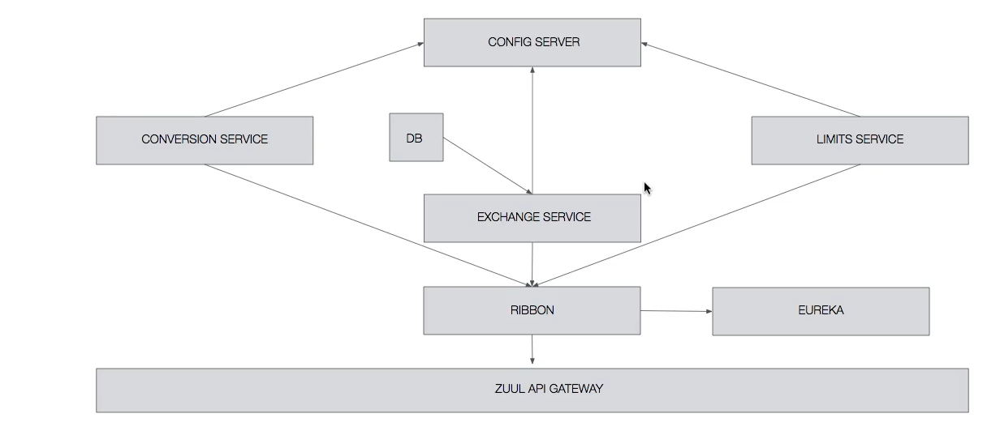

# 03 - Análisis de la aplicacion de cambio de divisas

Vamos a ver en esta lección como una pequeña estructura de la aplicación que vamos a crear, básicamente lo que vamos a implementar va a ser una aplicación que nos va a permitir hacer un cambio de divisas, entonces vamos a tener dentro de esa aplicación un CONVERSION SERVICE, un EXCHANGE SERVICE y un LIMITS SERVICE, el LIMITS SERVICE se va a encargar de indícarnos cuál es el límite mínimo y máximo a la hora de convertir las monedas, el EXCHANGE SERVICE va a ser el que nos va a decir el valor de conversión de las divisas y el CONVERSION SERVICE va a ser el que ya realmente ejecute la petición con estos datos, el que ejecute realmente el cálculo del cambio de divisas y nos devuelva el resultado.

Entonces el CONVERSION SERVICE va a tener que consultar al EXCHANGE SERVICE para saber cuál es el ratio de conversión entre 2 monedas que a el le soliciten, el EXCHANGE SERVICE consultara al LIMITS SERVICE para saber cuál es el límite máximo y mínimo de conversión y con todos esos datos el CONVERSION SERVICE al final realizará el cálculo de la composición y nos devolverá el valor.

Si os dais cuenta el EXCHANGE SERVICE va a tener una base de datos en memoria, vamos a volver a utilizar H2 dónde va a almacenar los valores de conversión entre las distintas divisas y los 3 MicroServicios deberán estar conectados al *Servidor de Configuración*, nosotros simplemente vamos a conectar el LIMITS SERVICE y el conectar los otros dos servicios se va a quedar como ejercicio.

Por otro lado también vamos a utilizar un *Balanceador de Carga* RIBBON que va a ser el que distribuya la carga entre los distintos MicroServicios a la hora de realizar peticiones, nosotros solo vamos a implementar el *Balanceador de Carga* para el EXCHANGE SERVICE o sea para la comunicación entre el CONVERSION SERVICE y el EXCHANGE SERVICE por que la comunicación entre el CONVERSION SERVICE y el EXCHANGE SERVICE si que la vamos a implementar, la comunicación entre el EXCHANGE SERVICE y el LIMITS SERVICE va a quedar como ejercicio. 

Entonces en cuanto la comunicación entre el CONVERSION SERVICE y el EXCHANGE SERVICE vamos a utilizar RIBBON para comprobar como si levantamos dos instancias del servicio EXCHANGE SERVICE cuando hagamos la petición con el CONVERSION SERVICE unas veces esa petición va ir a una instancia y otras veces va a ir a otra sin que nosotros tengamos que hacer nada, se va a encargar de todo el *Balanceador de Carga*. 

Y luego vamos a utilizar EUREKA qué es un *Servicio de Nombres*, todos los microservicios para acceder a otro microservicio dentro de la aplicación van a usar EUREKA para ser capaces de identificar a esos MicroServicios, no se va a hacer una petición directamente desde el CONVERSION SERVICE al EXCHANGE SERVICE, sino que está petición se va a hacer utilizando RIBON y EUREKA, a través de EUREKA se va a indicar cuál es el nombre del servicio que se quiere consumir y luego RIBON se encargará utilizando EUREKA de averiguar que instancias hay disponibles de EXCHANGE SERVICE y dirigir la petición a la instancia que corresponda en función de la carga.

Y por último vamos a implementar un API GATEWAY con ZUUL, con este API GATEWAY vamos a tener por ejemplo un Login comun, si queremos por ejemplo Logear todas las peticiones de la aplicación o vamos a poder tener lo que decía un punto único de autorización de entrada a la aplicación.

Esta es más o menos la estructura de lo que debería quedar al final, faltan algunas cosillas, falta por ejemplo lo que decía, la *Cola de Mensajería* para el BUS, el BUS en si, falta también el *Trazado Distribuido* y el *Servidor de Zipkin* qué es el que acumula ese *Trazado Distribuido* y nos lo muestra en un UI, son partes que se pueden considerar que son un poquito externas, que son comunes a todo. En cualquier caso veremos esto más en profundidad y sí que en el repositorio del curso va a estar descrita más en profundidad esta aplicación y con todas las URL que tiene la aplicación, así como los puertos que van a usar cada uno de los servicios que hay en esta aplicación o servidores que hay en esta aplicación, la gestión de los puertos es algo bastante importante dentro de una aplicación distribuida, por qué es muy importante que las instancias de los distintos servicios no choquen entre sí y si os acordáis cuando te descargas un Spring Boot Application normalmente se levantan en el puerto 8080, así que vamos a tener que configurar los puertos para todos los servicios de aplicación que estamos creando, así como darles un nombre explicito de servicio a cada uno de ellos en el `application.properties` para ser capaces de identificarlos dentro del *Servicio de Nombres* EUREKA.

