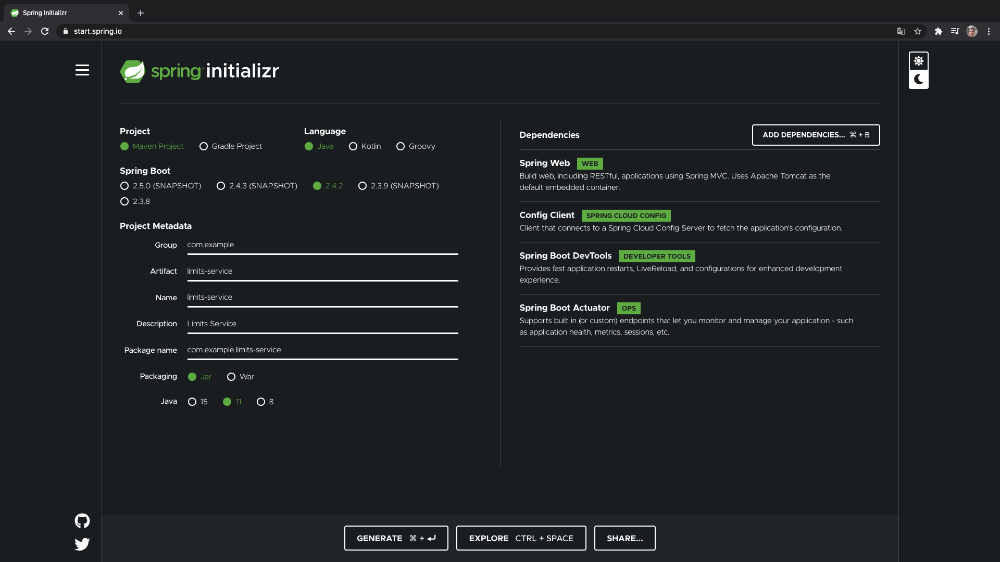
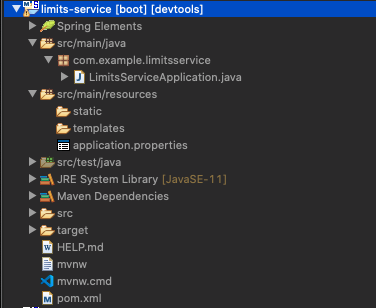
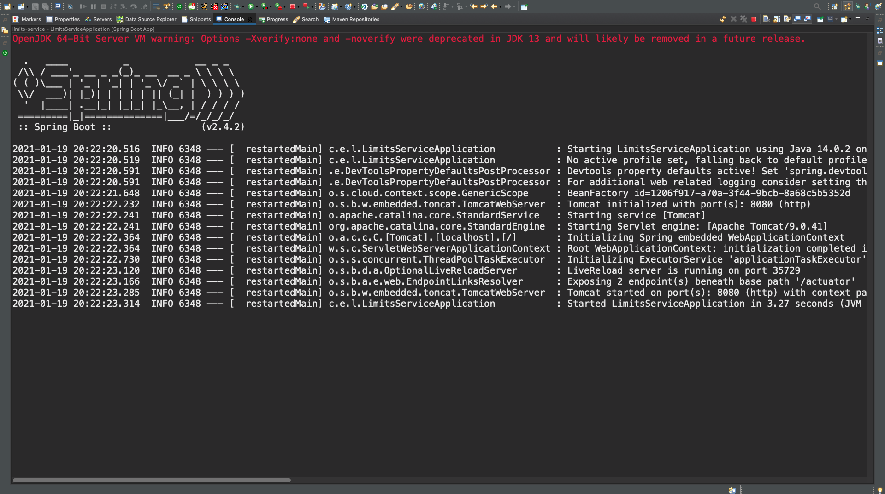
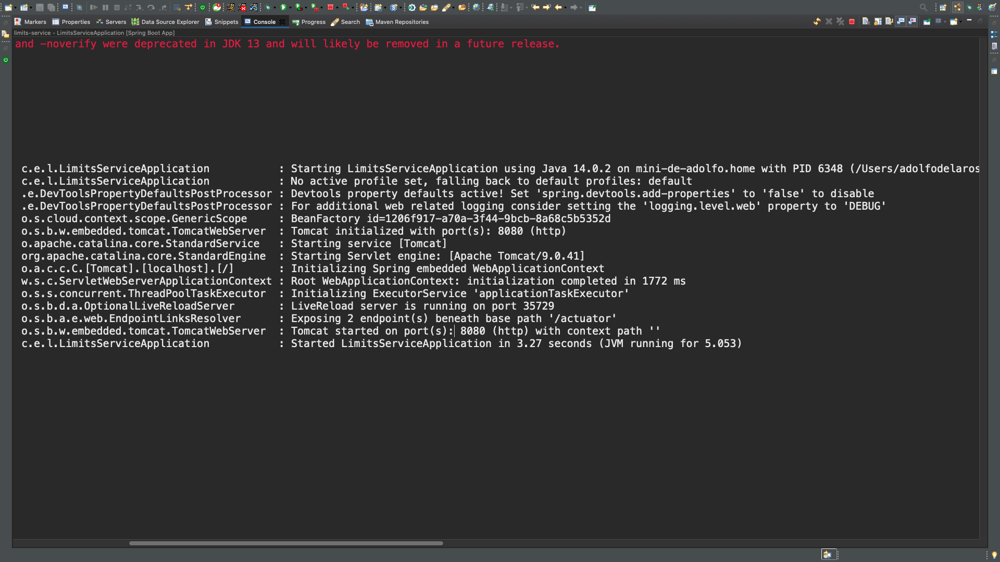
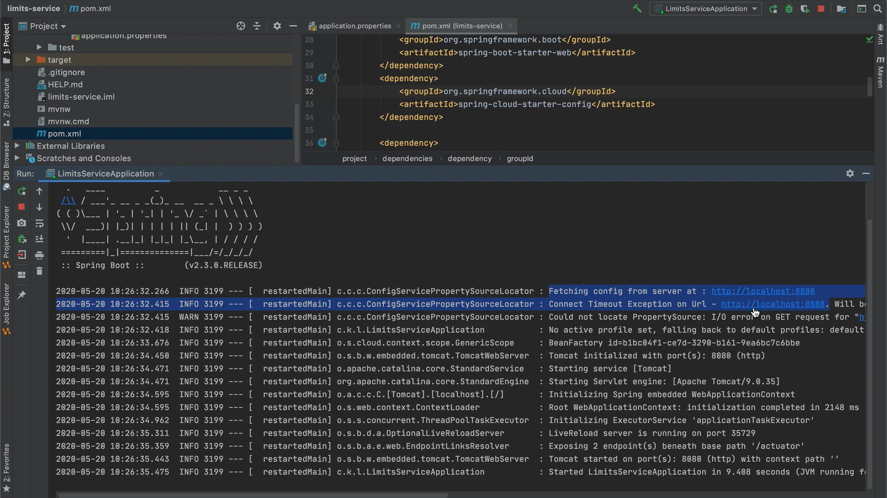

# 04 - Creando el MicroServicio de Limites

En esta lección vamos a generar el proyecto del **LIMITS SERVICE** es el que nos va a proporcionar el límite inferior y el límite superior para nuestra aplicación, en esta lección lo que vamos a hacer es configurar esos parámetros en el `application.properties` y leerlos desde allí, luego crear un servicio en el que se pueda consultar esos límites tanto superior como inferior. En lecciones posteriores conectaremos este LIMITS SERVICE con un *Servico de Configuración* en la nube de Spring Cloud para que los valores de los límites tanto superior como inferior se lean desde un *Servicio Centralizado de Configuración* que nos va a servir para configurar todos los MicroServicios de nuestra aplicación.

Lo que vamos a hacer es generar el proyecto con los siguientes nombres y caracteristicas:



Necesitamos los Starter:

* **Spring Web**: Para generar nuestros controladores y exponerlos
* **Spring Cloud Config**: Que es el que nos permite configurarnos a un *Servidor de Configuración* de Spring Cloud
* **Developer Tools**: Las Developer Tools 
* **Spring Boot Actuator**: 

Generamos el proyecto y se nos descará, lo descomprimimos y lo abrimos en Eclipse.



Los puertos del LIMITS SERVICE van a empezar en el 8080 que es el puerto por defecto por lo que no hacemos nada en el `application.properties` en cuanto a modificar el puerto, lo que si vamos a settear es el nombre de la aplicación:

```txt
spring.application.name=limits-service
```

Simplemente vamos a levantarlo para comprobar que todo funciona bien.





En teoría, al haber añadido la dependencia de `spring-cloud-starter-config` que convierte a este servicio en un cliente de ***Spring Config*** automáticamente el intenta recuperar el archivo de configuración las propiedades de configuración de la URL http://localhost:8888, (en mi ejecución no, en la del video si), de momento no tenemos ningun Servicio de Configuración desplegado en ese endpoint así que no es capaz de recuperarlo, ademas como el application se llama `application.properties` va a leer las propiedades de allí sin ningún problema, si nos damos cuenta el servidor se a levantado en el puerto 8080.
