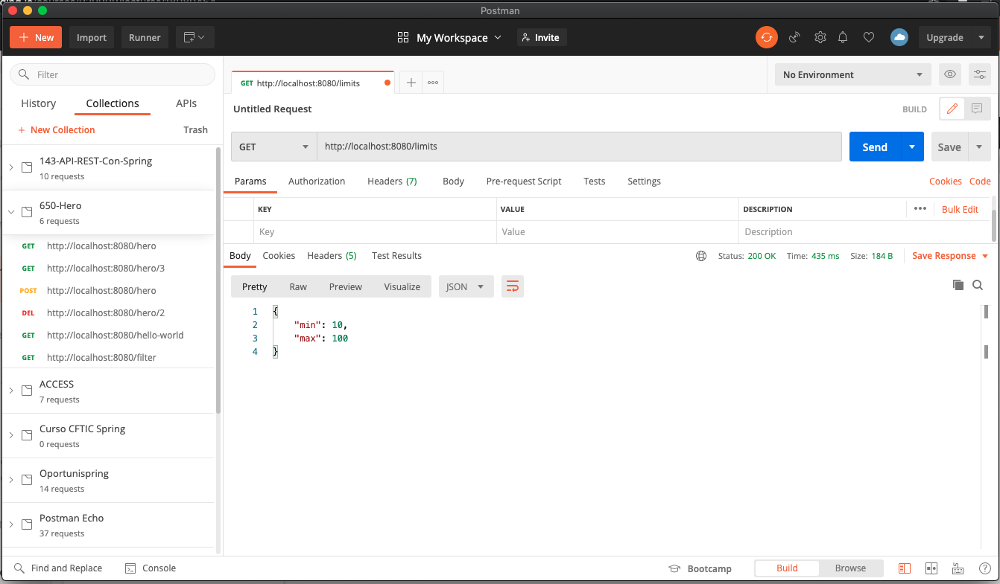

# 05 - Microservicio de Limites Hardcodeado

En esta lección vamos a crear nuestro primer Servicio para el LIMITS SERVICE que va a devolver los límites superior e inferior, vamos a hacer una primera versión Hardcodeando los valores de los límites, en la siguiente lección los recuperaremos del `application.properties` y en pasos posteriores crearemos el Servicio de Configuración y dede este Servicio de Configuración leeremos los límites.

Empezamos por crear el paquete `model` y dentro vamos a crear una clase `LimitsConfig`:

`LimitsConfig`

```java
package com.example.limitsservice.model;

public class LimitsConfig {
	
   private int min;
   private int max;
	
   public LimitsConfig() {
		
   }

   public LimitsConfig(int min, int max) {
      this.min = min;
      this.max = max;
   }

   public int getMin() {
      return min;
   }

   public void setMin(int min) {
      this.min = min;
   }

   public int getMax() {
      return max;
   }

   public void setMax(int max) {
      this.max = max;
   }

}
```

Vamos a crear dentro del paquete `controller` nuestro RestController `LimitsConfigController`

`LimitsConfigController`

```java
package com.example.limitsservice.controller;

import org.springframework.web.bind.annotation.GetMapping;
import org.springframework.web.bind.annotation.RestController;

@RestController
public class LimitsConfigController {

   @GetMapping("limits")
   public LimitsConfig getLimits() {
      return new LimitsConfig(10,100);
   }
}
```

Si probamos nuestro servicio con el URL http://localhost:8080/limits tenemos:



Con lo que hemos creado el Servicio que devuelve los límites minimo y máximo, lo hemos hecho que los devuelva de manera estática estableciendo nosotros dichos valores.
