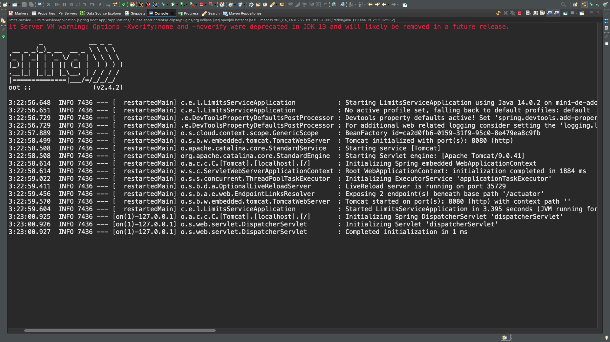
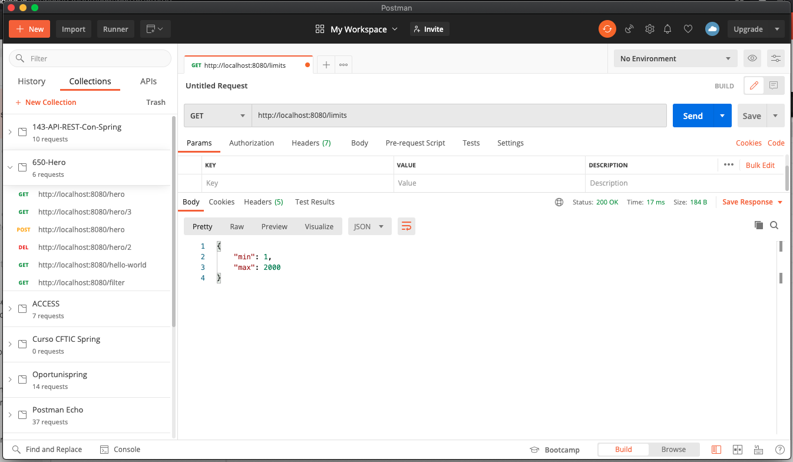

# 06 - Usando `application.properties` en el servicio de limites

Para más información vea [Guide to @ConfigurationProperties in Spring Boot](https://www.baeldung.com/configuration-properties-in-spring-boot)

Actualmente tenemos nuestro LIMITS SERVICE con unos valores Harcodeados en nuestro código con lo cual no podemos tener distintos valores, en función del entorno, no podríamos modificarlos externamente sin tener que parar la aplicación, pararla y levantarla otra vez, así que vamos ir dando pasos poco a poco hasta configurar este LIMITS SERVICE con el Configs Server, el primer paso que vamos hacer es leer estos valores del `application.properties`.

Vamos a crearnos las propiedades de límite dentro del `application.properties`.

```txt
spring.application.name=limits-service

limits.min=1
limits.max=2000
```

`limits` es una especie de Basepath para todas las propiedades de límites.

Vamos a crear la clase `LimitsProperties` dentro del paquete `properties` que anotaremos como `@components` para poderla inyectar en otras clases y ademas va a ser una clase de Configutation Properties por lo que tiene que ser anotada con `@ConfigurationProperties` y como parametro puede recibir el "Basepath" de las propiedades que deseamos leer, en nuestro caso `@ConfigurationProperties("limits")` entonces esta clase `LimitsProperties` va a ir al `application.properties` para leer las propiedades que comiencen con `limits` y va a a buscar atributos que tenga dentro de su clase con el mismo nombre a partir del `limits` y va a settearles los valores que tenga en el `application.properties`

```java
package properties;

import org.springframework.boot.context.properties.ConfigurationProperties;
import org.springframework.stereotype.Component;

@Component
@ConfigurationProperties("limits")
public class LimitsProperties {
	
   private int min;
   private int max;
   
   public LimitsProperties() {
   }

   public LimitsProperties(int min, int max) {
      super();
      this.min = min;
      this.max = max;
   }

   public int getMin() {
      return min;
   }

   public void setMin(int min) {
      this.min = min;
   }

   public int getMax() {
      return max;
   }

   public void setMax(int max) {
      this.max = max;
   }

}
```
En realidad nosotros nunca vamos a hacer uso de los Setter de esta clase por que los valores para esta clase se van a establecer a través del `application.properties`, pero Spring Boot si que necesita estos setter para establecer estos valores cuando levanta la aplicación y la carga por primera vez, por lo tanto tenemos que crear los Setters aunque sea contra intuitivo por que nunca en el código vamos a ver la instanciación de la clase `LimitsProperties` con el uso de sus métodos setters, pero si que los usa internamente Spring Boot para establecer los valores que encuentre en el `application.properties`.

En esta clase me marca este warning `Problem description: When using @ConfigurationProperties it 
 is recommended to add 'spring-boot-configuration-processor' 
 to your classpath to generate configuration metadata` 
 
 Pide añadir esta dependencia:
 
```js
<dependency>
   <groupId>org.springframework.boot</groupId>
   <artifactId>spring-boot-configuration-processor</artifactId>
   <optional>true</optional>
</dependency>
```
Pero realmente funciona si no se incluye.
 
 

En nuestro Controlador debemos inyectar este `LimitsProperties` y tomar los valores de los límites de este objeto:

```java
package com.example.limitsservice.controller;

import org.springframework.beans.factory.annotation.Autowired;
import org.springframework.web.bind.annotation.GetMapping;
import org.springframework.web.bind.annotation.RestController;

import model.LimitsConfig;
import properties.LimitsProperties;

@RestController
public class LimitsConfigController {
	
   @Autowired
   LimitsProperties limitsProperties;

   @GetMapping("limits")
   public LimitsConfig getLimits() {
      return new LimitsConfig(limitsProperties.getMin(),limitsProperties.getMax());
   }
}
```

**Nota**: Si no usamos `@Configuration` en el POJO, entonces necesitamos agregar `@EnableConfigurationProperties(LimitsProperties.class)` en la clase de aplicación principal de Spring para vincular las propiedades al POJO.

Y con esto ya tendríamos los valores establecidos a través del `application.properties` es decir 1 y 2000, vamos a comprobarlo ejecutando la aplicación.



Si nos damos cuenta al arrancar la aplicación intenta cojer un Profile `No active profile set, falling back to default profiles: default` cada vez que levanta la aplicación, en el futuro vamos a ver como poder establecer estos posibles perfiles para que las propiedades puedan ser distintas en función del entorno, la aplicación ya esta arriba si probamos con Postman tenemos:



Como podemos ver los límites recuperados son los que nosotros establecimos en el `application.properties`  
