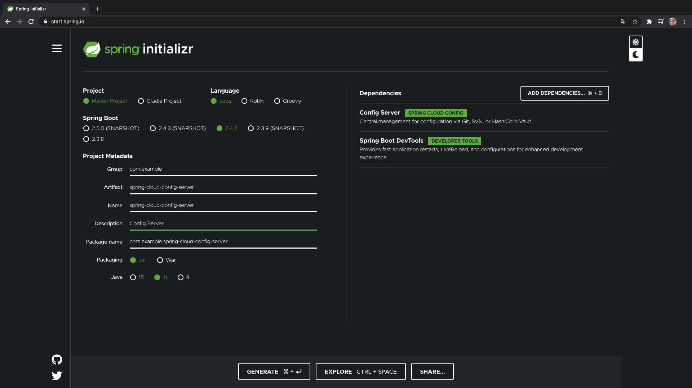
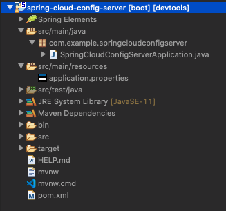
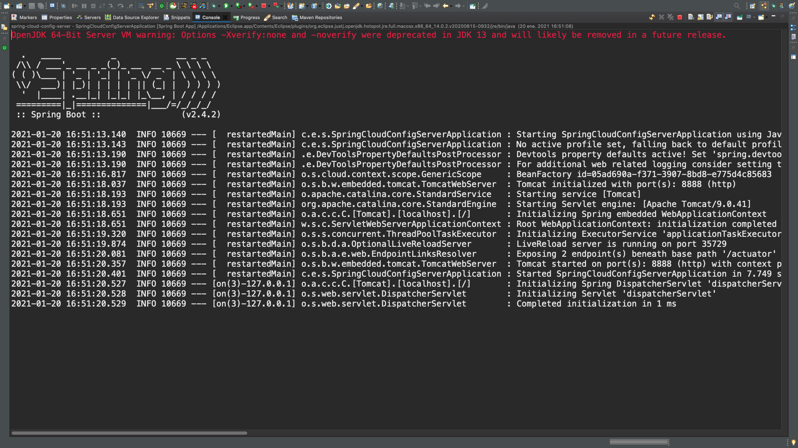

# 07 - Creando el Servicio de Configuración

En esta lección vamos a crear el **Spring Cloud Config Server** en un nuevo proyecto con las siguientes características:



Este *Servicio de Configuración* va a contener las propiedades de configuración de los distintos MicroServicios que vamos a crear en esta sección. 



Lo que vamos a hacer es establecer el puerto del servidor en el `application.properties`:

`application.properties`

```txt
spring.application.name=spring-cloud-config-server
server.port=8888
```
Establecemos el nombre de la aplicación, por que cuando trabajamos con MicroServicios es muy importante establecer un nombre único para cada MicroServicio que nos va a permitir identificarlo dentro de nuestro ecosistema de MicroServicios.

Hemos elegido el puerto 8888 para el Config Server que también es el puerto por defecto que también utiliza Spring Cloud para los servicios de configuración.

Vamos a arrancar la aplicación para ver que levanta sin problemas.



