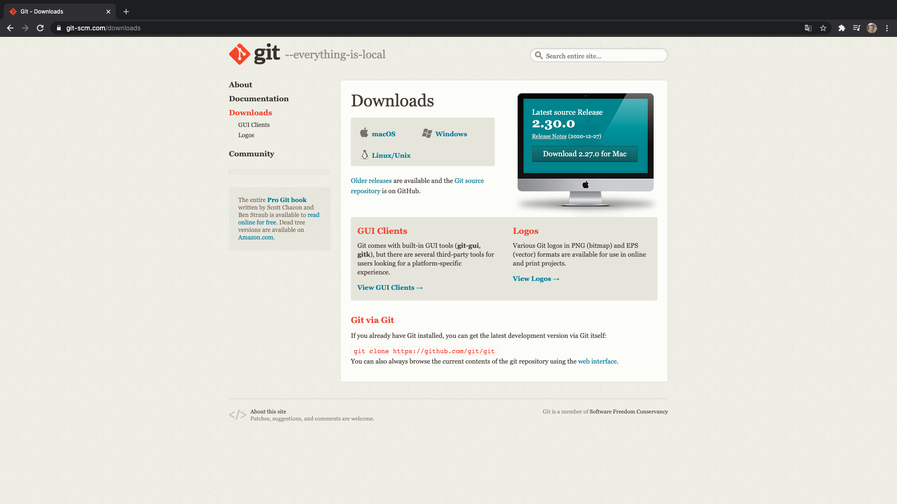
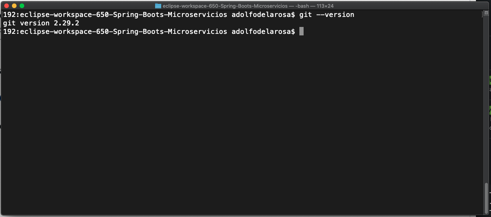
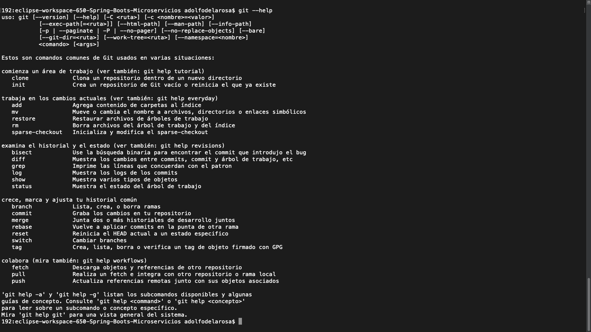
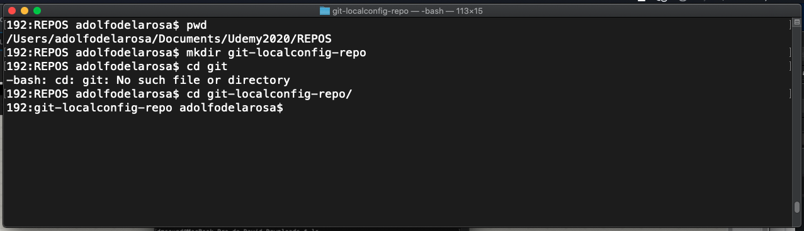
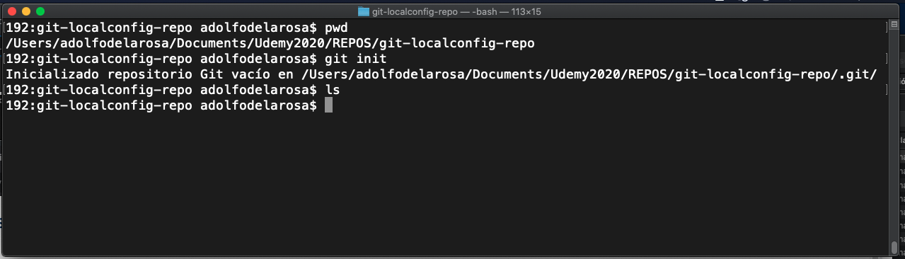
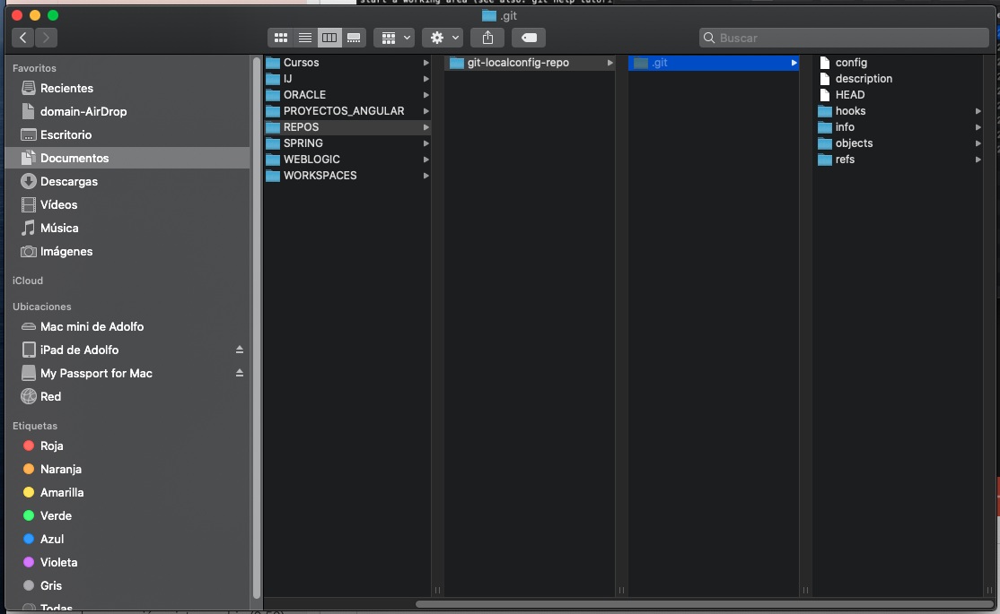
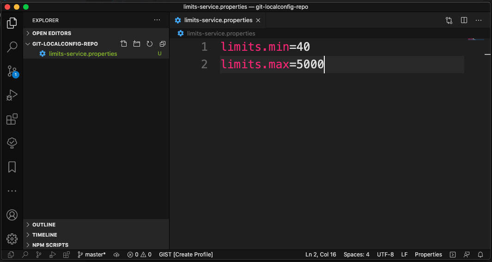
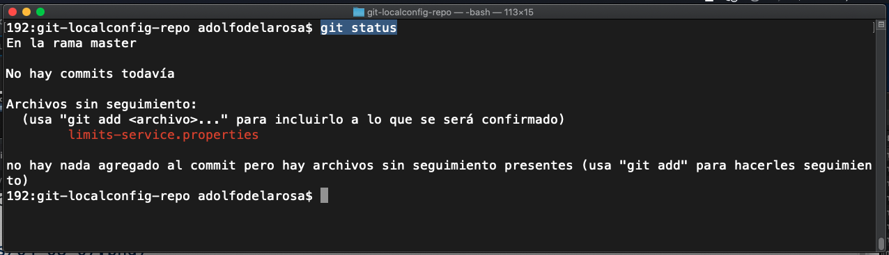
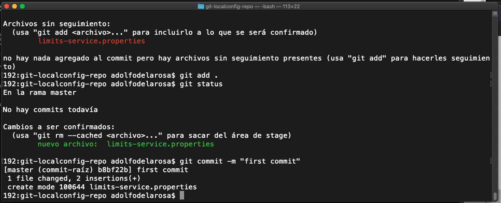
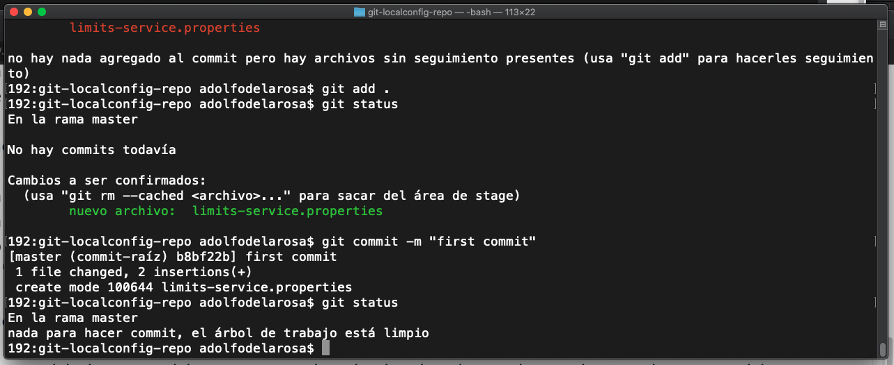

# 08 - Git

En esta lección vamos a descargar GIT, a crear un repositorio e incluir en las propiedades de nuestros MicroServicios en ese repositorio.

GIT es un sistema de control de versiones distribuido, que significa esto, que el control de versiones se hace usando repositorios y no se utiliza un repositorio centralizado para controlar todas las versiones de una aplicación sino que se divide en repositorios locales y repositorios remotos.

La página para descargar la GIT es https://git-scm.com/downloads.

 

Una vez descargado e instalado tendremos un Bash para poder teclear los comandos que vayamos a usar, en mi caso tengo un Mac y la terminal hace las mismas funciones que el Bash.

Con el comando `git --version` podemos comprobar que GIT se ha instalado y verificar la versión que tenemos.

 

Con el comando `git --help` podemos ver la ayuda de GIT.

 

Vamos a crear una carpeta donde vamos a almacenar nuestro repositorio.

 

Con el comando `git init` vamos a crear un repositorio de GIT.

 

Se a creado el repositorio pero si vemos el contenido de la carpeta no muestra nada por que son archicos ocultos, pero realmente si mostramos esos archivos ocultos vemos todo lo que se a creado.

 

Aquí esta nuestra configuración de nuestro repositorio en local.

Una vez hecho esto en la carpeta `git-localconfig-repo` que contiene nuestro repositorio vamos a crear el archivo `limits-service.properties` este nombre es el que le dimos al servicio cuando lo creamos. Lo que va a contener este archivo son las propiedades que habíamos definido en el servicio pero les vamos a poner otros valores para distingirlas del mismo.

Una vez editado y guardado este archivo es necesario que los cambios hechos dentro del repositorio los commitemos para que se almacenen en el repositorio local que tenemos y nosotros necesitamos que esten en el repositorio local para que sean accesibles desde el servicio de configuración.

¿Cómo hacemos para añadirlos al repositorio local? 

Con el comando `git status` vemos lo siguiente:

Vemos que estamos en la *rama master* y que *no hemos realizado ningún commit aún*, y nos pone los *Archivos sin seguimiento* que son los archivos que han sido modificados hasta el último commit en esta rama y que aún no estan en el repositorio, estan en nuestro ordenador local pero no en nuestro repositorio local, la manera de añadirlos es con `git add .` y con eso hemos añadido todo lo que estaba pendiente si ahora hacemos un `git status`

nos damos cuenta que ahora si ya esta añadido, que *esta en el área de stage*, pero que aún no esta commiteado, esta preparado para ser subido al repositorio pero aún no ha sido subido al repositorio, la manera de subirlo al repositorio es haciendo un commit, eso lo hacemos con el comando `git commit -m "first commit"`

Nos indica que ha cambiado un archivo y que se han hecho dos inserciones dentro de ese archivo que son las dos líneas que hemos añadido, con esto ya si ahora hicieramos un `git status` nos indica `nada para hacer commit, el árbol de trabajo está limpio`.

ya no tenemos nada para commitear el árbol de trabajo está limpio, eso significa que todos los archivos estan en el repositorio local y por consiguiente esos archivos estarán disponibles para el *Servicio de Configuración*.
