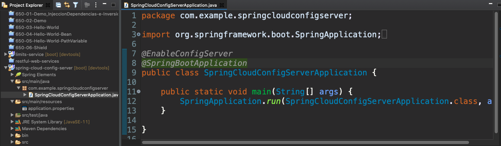
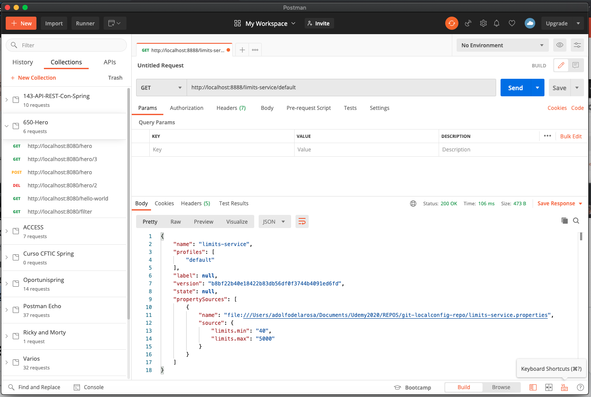

# 09 - Conectando Spring Cloud Config Service con el Repositorio de Git

En esta lección vamos a conectar el Servicio de Configuración de Spring `spring-cloud-config-server` que creamos en lecciones anteriores con el repositorio de GIT que creamos en la lección anterior, para que obtenga las propiedades directamente desde ese repositorio, esta tarea es relativamente sencilla, en el `application.properties` del `spring-cloud-config-server` vamos a incluir la ultima propiedad a las que ya teniamos:

```txt
spring.cloud.config.server.git.uri=/Users/adolfodelarosa/Documents/Udemy2020/REPOS/git-localconfig-repo
```

Cabe hacer notar que a esta URI le podemos asignar una dirección HTTP, una dirección de internet o una ruta de un archivo local, a un repositorio local, en nuestro caso como corresponde a una carpeta local debemos añadir antes de la ruta `file://` 

```txt
spring.application.name=spring-cloud-config-server
server.port=8888

spring.cloud.config.server.git.uri=file:///Users/adolfodelarosa/Documents/Udemy2020/REPOS/git-localconfig-repo
```

Con esto ya estariamos conectados al repositorio local, así que ya cuando accedamos al `spring-cloud-config-server` podremos acceder a los distintos archivos de propiedades con una URL que se va a basar en el nombre del archivo de propiedades que queremos recuperar.

Una cosa que no se nos debe olvidar es que cuando creamos una aplicación con Spring Boot que debe actuar como *Servicio de Configuración Centralizada en la Nube* debemos incluir una anotación que lo identifique como tal `@EnableConfigServer`.



Si guardamos y levantamos la aplicación que se levanta en el puerto 8888 así que si cargamos la URL http://localhost:8888 veremos:


En este endpoint no tenemos nada, pero dentro de nuestro repostitorio tenemos el archivo de propiedades `limits-service.properties`, por ahora este archivo de propiedades no lleva ninguna "extensión", podríamos hacer un `limits-service-des.properties`, un `limits-service-pre.properties`, un `limits-service-pro.properties` para tener distintos de las propiedades dependiendo del entorno, en nuestro caso `limits-service.properties` no lleva ninguna "extensión" de entorno por lo tanto pertenecera al archivo de propiedades por defecto, así que si vamos a la URL http://localhost:8888/limits-service/default veremos:



Lo que obtenemos son las propiedades que se encuentran dentro del archivo de propiedades `limits-service.properties` del repositorio que hemos creado en GIT, nos indica la versión del repositorio, y el `propertySources` nos indica el fichero del que esta extrayendo las propiedades `"file:///Users/adolfodelarosa/Documents/Udemy2020/REPOS/git-localconfig-repo/limits-service.properties"` y las propidades que tenemos disponibles:

```json
{
    "name": "limits-service",
    "profiles": [
        "default"
    ],
    "label": null,
    "version": "b8bf22b40e18422b83db56df0f3744b4091ed6fd",
    "state": null,
    "propertySources": [
        {
            "name": "file:///Users/adolfodelarosa/Documents/Udemy2020/REPOS/git-localconfig-repo/limits-service.properties",
            "source": {
                "limits.min": "40",
                "limits.max": "5000"
            }
        }
    ]
}
```
