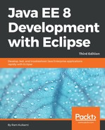

# 90001 Java EE 8 Development with Eclipse

Ram Kulkarni
June 28, 2018
596 pages

17 hours 52 minutes

### Descripción del libro

**Desarrolle e implemente aplicaciones y microservicios totalmente funcionales utilizando Tomcat, servidores Glassfish, Cloud y docker en Java EE 8**

**Sobre este libro**

* Explore el flujo de trabajo completo del desarrollo de aplicaciones Java empresariales
* Desarrolle microservicios con Docker Container e impleméntelo en la nube
* Simplifique el desarrollo de aplicaciones Java EE

**Para quien es este libro**

Si es un desarrollador de Java con poca o ninguna experiencia en el desarrollo de aplicaciones Java EE, o si tiene experiencia en tecnología Java EE pero está buscando consejos para simplificar y acelerar su proceso de desarrollo, entonces este libro es para usted.

**Lo que vas a aprender**

* Configurar servidores Eclipse, Tomcat y Glassfish para el desarrollo de aplicaciones Java EE
* Utilice JSP, Servlet, JSF y EJB para crear una interfaz de usuario y escribir lógica empresarial
* Cree aplicaciones de base de datos Java EE utilizando JDBC y JPA
* Maneje mensajes asincrónicos utilizando MDB para una mejor escalabilidad
* Implemente y depure aplicaciones Java EE y cree servicios web SOAP y REST
* Escriba pruebas unitarias y calcule la cobertura del código
* Utilice Eclipse MAT (herramienta de análisis de memoria) para depurar problemas de memoria
* Crear e implementar microservicios

**En detalle**

Java EE es una de las herramientas más populares para el diseño y desarrollo de aplicaciones empresariales. Con los cambios recientes en las especificaciones Java EE 8, el desarrollo de aplicaciones Java EE se ha vuelto mucho más simple con las nuevas especificaciones, algunas de las cuales compiten con las especificaciones existentes. Esta guía proporciona una descripción completa del desarrollo de aplicaciones empresariales altamente eficaces, robustas y seguras con Java EE con Eclipse.

El libro comienza explorando diferentes tecnologías Java EE y cómo usarlas (JSP, JSF, JPA, JDBC, EJB y más), junto con tecnologías adecuadas para diferentes escenarios. Aprenderá cómo configurar el entorno de desarrollo para aplicaciones Java EE y comprender las especificaciones de Java EE en detalle, con énfasis en los ejemplos. El libro lo lleva a través de la implementación de una aplicación en Tomcat, GlassFish Servers y también en la nube. Va más allá de lo básico y cubre temas como depuración, prueba, implementación y seguridad de sus aplicaciones Java EE. También conocerá técnicas para desarrollar microservicios listos para la nube en Java EE.

**Estilo y enfoque**

Esta guía adopta un enfoque paso a paso para desarrollar, probar, depurar y solucionar problemas de aplicaciones Java EE, completa con ejemplos y consejos.

Descarga del código de ejemplo para este libro Puede descargar los archivos de código de ejemplo para todos los libros de Packt que haya comprado en su cuenta en http://www.PacktPub.com. Si compró este libro en otro lugar, puede visitar http://www.PacktPub.com/support y registrarse para recibir los archivos directamente por correo electrónico.

## Table of Contents

Title Page

Copyright and Credits

* Java EE 8 Development with Eclipse Third Edition

Dedication

Packt Upsell

* Why subscribe?

* PacktPub.com

### 1. Introducing JEE and Eclipse

* JEE

   * The presentation layer

      * Java Servlets

      * JavaServer Pages

      * JavaServer Faces

   * The business layer

      * Enterprise JavaBeans

   * The enterprise integration layer

      * Java Database Connectivity 

      * The Java Persistence API

      * Java Connector Architecture

      * Web services

   * Eclipse IDE

      * Workspace

      * Plugin

      * Editors and views

      * Perspective

      * Eclipse preferences

* Installing products

   * Installing Eclipse

   * Installing the Tomcat server

   * Installing the GlassFish server

   * Installing MySQL

      * Installing MySQL on Windows

      * Installing MySQL on macOS X

      * Installing MySQL on Linux

      * Creating MySQL users

* Summary

### 2. Creating a Simple JEE Web Application

* Configuring Tomcat in Eclipse

* JavaServer Pages

   * Creating a dynamic web project

   * Creating JSP

   * Running JSP in Tomcat

   * Using JavaBeans in JSP

   * Using JSTL

* Java Servlet

* Creating WAR

* JavaServer Faces

* Using Maven for project management

   * Maven views and preferences in Eclipse JEE

   * Creating a Maven project

      * Maven archetype

   * Exploring the POM

   * Adding Maven dependencies

   * Maven project structure

   * Creating a WAR file using Maven

* Summary

### 3. Source Control Management in Eclipse

* The Eclipse subversion plugin

   * Installing the Eclipse Subversion plugin

   * Adding projects to an SVN repository

   * Committing changes to an SVN repository

   * Synchronizing with an SVN repository

   * Checking out a project from SVN

* Eclipse Git plugin

   * Adding a project to Git

   * Committing files in the Git repository

   * Viewing file differences after modifications

   * Creating a new branch

   * Committing a project to a remote repository

   * Pulling changes from a remote repository

   * Cloning a remote repository

* Summary

### 4. Creating JEE Database Applications

* Creating database schema

   * Script to create tables and relationships

   * Creating tables in MySQL

* Creating a database application using JDBC

   * Creating a project and setting up Maven dependencies

   * Creating JavaBeans for data storage

   * Creating JSP to add a course

   * JDBC concepts

      * Creating database connections

      * Executing SQL statements

      * Handling transactions

   * Using a JDBC database connection pool

   * Saving courses in database tables using JDBC

   * Getting courses from database tables using JDBC

   * Completing add course functionality

   * Using Eclipse Data Source Explorer

* Creating database applications using JPA

   * Creating user interfaces for adding courses using JSF

   * JPA concepts

      * Entity

      * EntityManager

      * EntityManagerFactory

   * Creating a JPA application

   * Creating a new MySQL schema

   * Setting up a Maven dependency for JPA

   * Converting a project into a JPA project

   * Creating entities

   * Configuring entity relationships

      * Configuring many-to-one relationships

      * Configuring many-to-many relationships

   * Creating database tables from entities

   * Using JPA APIs to manage data

   * Wiring user interface with JPA service classes

* Summary

### 5. Unit Testing

* Introducing JUnit

* Creating and executing unit tests using Eclipse JEE

   * Creating unit test cases

   * Running unit test cases

      * Running unit test cases using Maven

* Mocking external dependencies for unit tests

   * Using Mockito

* Calculating unit test coverage

* Summary

### 6. Debugging the JEE Application

* Debugging a remote Java application

* Debugging a web application using Tomcat in Eclipse EE

   * Starting Tomcat in Debug mode

   * Setting breakpoints

   * Running the application in Debug mode

   * Performing step operations and inspecting variables

   * Inspecting variable values

* Debugging an application in an externally configured Tomcat

* Using the debugger to know the status of program execution

* Summary

### 7. Creating JEE Applications with EJB

* Types of EJB

   * Session beans

      * Stateful session beans

      * Stateless session beans

      * Singleton session beans

   * Accessing session beans from a client

      * Creating a no-interface session bean

      * Accessing session beans using dependency injection

      * Creating session beans using local business interface

      * Accessing session beans using JNDI lookup

      * Creating session beans using remote business interface

      * Accessing remote session beans

* Configuring the GlassFish Server in Eclipse

* Creating a Course Management application using EJB

   * Creating EJB projects in Eclipse

   * Configuring datasources in GlassFish

   * Configuring JPA in an Eclipse project

   * Creating a JPA entity

   * Creating stateless EJB

   * Creating JSF and managed beans

   * Running the example

   * Creating EAR for deployment outside Eclipse

* Creating a JEE project using Maven

* Summary

### 8. Creating Web Applications with Spring MVC

* Dependency injection

* Dependency injection in Spring

   * Component scopes

* Installing Spring Tool Suite

* Creating a Spring MVC application

   * Creating a Spring project

      * Understanding files created by the Spring MVC project template

   * Building the Spring MVC application using JDBC

      * Configuring a datasource

      * Using the Spring JDBCTemplate class

      * Creating the Spring MVC Controller

      * Creating View

      * Mapping data using @ModelAttribute

      * Using parameters in @RequestMapping

      * Using Spring interceptors

   * Spring MVC application using JPA

      * Configuring JPA

      * Creating the Course entity

      * Creating CourseDAO and Controller

      * Creating the course list view

* Summary

### 9. Creating Web Services

* What is a web service?

* JAXB

   * A JAXB example

* JSON-B

   * A JSON-B example

* RESTful web services

   * Creating RESTful web services using Jersey

   * Implementing a REST GET request

   * Testing the REST GET request in the browser

   * Creating a Java client for the REST GET web service

   * Implementing a REST POST request

   * Writing a Java client for the REST POST web service

   * Invoking a POST RESTful web service from JavaScript

   * Creating a RESTful web service with form POST

   * Creating a Java client for a form-encoded RESTful web service

   * A RESTful web service using JSON-B

* SOAP web services

   * SOAP

   * WSDL

   * UDDI

   * Developing web services in Java

      * Creating a web service implementation class

      * Using JAX-WS reference implementation (Glassfish Metro)

      * Inspecting WSDL

      * Implementing a web service using an interface

      * Consuming a web service using JAX-WS

      * Specifying an argument name in a web service operation

      * Inspecting SOAP messages

      * Handling interfaces in RPC-style web services

      * Handling exceptions

* Summary

### 10. Asynchronous Programming with JMS

* Steps to send and receive messages using JMS

* Creating queues and topics in GlassFish

* Creating JEE project for a JMS application

*  Creating JMS application using JSP and JSP bean

   * Executing addCourse.jsp

   * Implementing JMS queue sender class

   * Implementing JMS queue receiver class

      * Adding multiple queue listeners

   * Implementing JMS topic publisher

   * Implementing JMS topic subscriber

* Creating JMS application using JSF and CDI beans

* Consuming JMS messages using MDBs

* Summary

### 11. Java CPU Profiling and Memory Tracking

* Creating a sample Java project for profiling

* Profiling the Java application

   * Identifying resource contention

   * Memory tracking

* Eclipse plugins for profiling memory

* Summary

### 12. Microservices

* What is a microservice?

* Eclipse MicroProfile

* Setting up a database for a microservice project

* Implementing microservices using WildFly Swarm

   * Creating a WildFly Swarm project

   * Configuring JPA

   * Creating a course entity bean and a JPA factory

* Implementing microservices using Spring Boot

* Deploying microservices in a Docker container

   * What is Docker?

   * How to get Docker

   * How to use Docker

      * Dockerfile

      * Docker commands

   * Setting up Docker Tooling in Eclipse

   * Creating a Docker network

   * Creating MySQL container

   * Deploying microservices in a Docker container

* Running containers using Docker Compose

* Summary

### 13. Deploying JEE Applications in the Cloud

* Deploying in the cloud

* Deploying in AWS Cloud

   * Creating the user group and user

   * Installing the AWS Toolkit for Eclipse

   * Launching the EC2 instance

   * Installing the CourseManagement EJB application in the EC2 instance

      * Installing the GlassFish 5 Server

      * Installing the MySQL server

      * Configuring the datasource in the GlassFish 5 Server

   * Installing the CourseManagmenet REST service using Elastic Beanstalk

      * Creating Elastic Beanstalk application from Eclipse

* Deploying in Google Cloud

   * Setting up Google Cloud Tools

      * Installing the Google Cloud SDK

      * Installing Java extensions for the App Engine SDK

      * Installing Google Cloud Tools for Eclipse

      * Setting Eclipse Preferences for Google Cloud Tools

   * Deploying the application in Google Compute Engine

      * Creating a VM instance in Google Compute Engine

      * Installing Docker in a VM instance

   * Deploying the application in Google App Engine

* Summary

### 14. Securing JEE Applications

* Authentication and authorization in JEE

* Modifying a database to save authentication information

* Securing applications in GlassFish

   * Protecting access to folders in web applications

   * Configuring a JDBC realm in GlassFish

   * Basic authentication with the JDBC realm in GlassFish

   * Form-based authentication with a JDBC realm in GlassFish

* Securing applications in Tomcat

* Securing servlets using annotations

* Securing web services

* Security enhancements in JEE 8

   * Implementing portable security in JEE 8

* Summary

### 15. Other Books You May Enjoy

* Leave a review - let other readers know what you think
