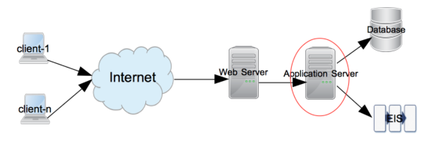

# 1. Introducing JEE and Eclipse

* JEE

   * The presentation layer

      * Java Servlets

      * JavaServer Pages

      * JavaServer Faces

   * The business layer

      * Enterprise JavaBeans

   * The enterprise integration layer

      * Java Database Connectivity 

      * The Java Persistence API

      * Java Connector Architecture

      * Web services

   * Eclipse IDE

      * Workspace

      * Plugin

      * Editors and views

      * Perspective

      * Eclipse preferences

* Installing products

   * Installing Eclipse

   * Installing the Tomcat server

   * Installing the GlassFish server

   * Installing MySQL

      * Installing MySQL on Windows

      * Installing MySQL on macOS X

      * Installing MySQL on Linux

      * Creating MySQL users

* Summary

## Introduciendo JEE y Eclipse

Java Enterprise Edition (JEE, que anteriormente se llamaba J2EE) existe desde hace muchos años. Es una plataforma muy robusta para desarrollar aplicaciones empresariales. J2EE se lanzó por primera vez en 1999, pero sufrió cambios importantes con el lanzamiento de la versión 5 en 2006. Desde la versión 5, se ha renombrado **Java Enterprise Edition ( JEE )**. Las versiones recientes de JEE han hecho que desarrollar una aplicación distribuida de múltiples niveles sea mucho más fácil. J2EE se había centrado en los servicios básicos y había dejado las tareas que hacían que el desarrollo de aplicaciones fuera más fácil para los marcos externos, por ejemplo, MVC y marcos persistentes. Pero JEE ha incorporado muchos de estos marcos a los servicios principales. Junto con el soporte para anotaciones, estos servicios simplifican el desarrollo de aplicaciones en gran medida.

Cualquier tecnología de tiempo de ejecución no es buena sin buenas herramientas de desarrollo. El  **entorno de desarrollo integrado ( IDE )** desempeña un papel importante en el desarrollo de aplicaciones más rápido, y Eclipse proporciona exactamente eso para JEE. No solo obtienes un buen soporte de edición de código en Eclipse, sino que también obtienes soporte para compilación, pruebas unitarias, control de versiones y muchas otras tareas importantes en diferentes fases del desarrollo de aplicaciones de software.

En este capítulo, vamos a cubrir los siguientes temas:

* Introducción a diferentes tecnologías en JEE
* Introducción al entorno de desarrollo de Eclipse.
* Instalación y configuración de algunos de los software utilizados con frecuencia en este libro, por ejemplo, servidores JEE, Eclipse IDE y Servidor de base de datos MySQL

El objetivo de este libro es mostrar cómo puede desarrollar eficientemente aplicaciones JEE utilizando Eclipse mediante el uso de muchas de sus características durante las diferentes fases del desarrollo de la aplicación. Pero primero, aquí hay una breve introducción a JEE y Eclipse.

*En 2017, Oracle acordó entregar el control de Java EE a Eclipse Foundation. En abril de 2018, la Fundación Eclipse renombró Java EE como Yakarta EE. Puede encontrar más información sobre Jakarta EE en  https://jakarta.ee/ . Al momento de escribir, la última versión de Java EE es 8. Pero todas las futuras versiones de Java EE se llamarán Jakarta EE.*

## JEE

JEE es una colección de muchos de los programas de Java Community Process ( https://www.jcp.org ). Actualmente, JEE está en la Versión 8. Sin embargo, las diferentes especificaciones de JEE están en sus propias versiones diferentes.

Las especificaciones JEE se pueden clasificar en términos generales en los siguientes grupos:

* Capa de presentación
* Capa empresarial
* Capa de integración empresarial

Tenga en cuenta que la especificación JEE no clasifica necesariamente las API en los grupos amplios anteriores, pero dicha clasificación podría ayudar a comprender mejor el propósito de las diferentes especificaciones y API en JEE.

Antes de ver las API en cada una de estas categorías, comprendamos un flujo típico de aplicaciones web JEE, como se muestra en el siguiente diagrama, y dónde encaja cada una de las capas anteriores:

Figura 1.1: Un flujo típico de aplicación web JEE

Las solicitudes comienzan desde los clientes. Un cliente puede ser cualquier aplicación que solicite servicios desde una aplicación remota; por ejemplo, podría ser el navegador o una aplicación de escritorio. La solicitud es recibida primero por el servidor web en el destino. Los ejemplos de servidores web incluyen el servidor web Apache, IIS y nginx. Si se trata de una solicitud de contenido estático, los servidores web la atienden. Sin embargo, una solicitud dinámica generalmente requiere un servidor de aplicaciones para procesar. Los servidores JEE son servidores de aplicaciones que manejan solicitudes dinámicas. La mayoría de las API de especificación JEE se ejecutan en el servidor de aplicaciones. Ejemplos de servidores de aplicaciones JEE son WebSphere, GlassFish y WildFly.

La mayoría de las aplicaciones JEE no triviales acceden a sistemas externos, como una base de datos o **Enterprise Integration Server ( EIS )**, para acceder a los datos y procesarlos. Se devuelve una respuesta del servidor de aplicaciones al servidor web y luego a los clientes.

Las siguientes secciones proporcionan una breve descripción de cada una de las especificaciones JEE en diferentes capas. Veremos cómo usar estas especificaciones y sus API en más detalle en los capítulos siguientes. Sin embargo, tenga en cuenta que la siguiente no es la lista exhaustiva de todas las especificaciones en JEE. Veremos las especificaciones más utilizadas aquí. Para obtener una lista exhaustiva, visite http://www.oracle.com/technetwork/java/javaee/tech/index.html .

### The presentation layer (La capa de presentación)

Las especificaciones o tecnologías JEE en esta capa reciben solicitudes del servidor web y envían la respuesta, generalmente en formato HTML. Sin embargo, también es posible devolver solo datos de la capa de presentación, por ejemplo, en **JavaScript Object Notation ( JSON )** o en formato de **Lenguaje de marcado extensible ( XML )**, que podrían ser consumidos por  llamadas **Asynchronous JavaScript y XML ( AJAX )** para actualizar solo una parte de la página, en lugar de representar la página HTML completa. Las clases en la capa de presentación se ejecutan principalmente en el contenedor web; es una parte del servidor de aplicaciones que maneja las solicitudes web. Tomcat es un ejemplo de un contenedor web popular.

Ahora echemos un vistazo a algunas de las especificaciones de esta capa.

#### Java Servlets

Los Java Servlets son módulos del lado del servidor, que se utilizan generalmente para procesar solicitudes y enviar respuestas en aplicaciones web. Los servlets son útiles para manejar solicitudes que no generan grandes respuestas de marcado HTML. Por lo general, se usan como controladores en los marcos de **Model View Controller ( MVC )** , para reenviar / redirigir solicitudes o para generar respuestas que no son HTML, como PDF. Para generar una respuesta HTML desde el servlet, debe incrustar código HTML (como una cadena Java) en el código Java. Por lo tanto, no es la opción más conveniente para generar grandes respuestas HTML. **JEE 8 contiene servlet API 4.0**. 

#### JavaServer Pages

Al igual que los servlets, las **JavaServer Pages (JSPs)** también son módulos del lado del servidor que se utilizan para procesar solicitudes web. Los JSP son excelentes para manejar solicitudes que generan grandes respuestas de marcado HTML. En las páginas JSP, el código Java o las etiquetas JSP se pueden mezclar con otro código HTML, como las etiquetas HTML, JavaScript y CSS. Dado que el código Java está incrustado en el código HTML más grande, es más fácil (que los servlets) generar una respuesta HTML desde las páginas JSP. **La especificación JSP 2.3 se incluye en JEE 8**.

#### JavaServer Faces

JavaServer Faces (JSFs) hace que la creación de una interfaz de usuario en el lado del servidor sea modular al incorporar el patrón de diseño MVC en su implementación. También proporciona etiquetas fáciles de usar para controles de interfaz de usuario comunes que pueden guardar estados en múltiples intercambios de solicitud-respuesta entre el cliente y el servidor. Por ejemplo, si tiene una página que publica datos de formulario desde un navegador, puede hacer que un JSF guarde esos datos en un bean Java para que pueda usarse posteriormente en la respuesta a la misma solicitud o a otra diferente. Los JSF también facilitan el manejo de eventos de IU en el lado del servidor y especifican la navegación de página en una aplicación.

Usted escribe el código JSF en JSP, utilizando etiquetas JSP personalizadas creadas para JSF. **JavaServer Faces API 2.3 es parte de JEE 8.**

### The business layer (La capa empresarial)

La capa empresarial es donde normalmente escribe código para manejar la lógica empresarial de su aplicación. Las solicitudes a esta capa pueden provenir de la capa de presentación, directamente de la aplicación del cliente o de la capa intermedia que consiste en, pero no se limita a, servicios web. Las clases en esta capa se ejecutan en la parte del contenedor de la aplicación del servidor JEE. GlassFish y WebSphere son ejemplos de contenedores web más contenedores de aplicaciones.

Hagamos un recorrido por algunas de las especificaciones de este grupo.

#### Enterprise JavaBeans

**Enterprise JavaBeans ( EJB )** son las clases de Java donde puede escribir su lógica de negocios. Aunque no es un requisito estricto utilizar EJB para escribir la lógica empresarial, sí proporcionan muchos de los servicios que son esenciales en las aplicaciones empresariales. Estos servicios son seguridad, gestión de transacciones, búsqueda de componentes, agrupación de objetos, etc.

Puede tener EJB distribuidos en varios servidores y dejar que el contenedor de la aplicación (también denominado contenedor EJB) se encargue de la búsqueda de componentes (componente de búsqueda) y la agrupación de componentes (útil para la escalabilidad). Esto puede mejorar la escalabilidad de la aplicación.

Los EJB son de dos tipos:

* **Session beans**: Beans de sesión son llamados directamente por clientes u objetos de nivel medio
* **Message-driven beans**: los beans controlados por mensajes se invocan en respuesta a eventos de **Java Messaging Service (JMS)**

JMS y beans controlados por mensajes se pueden usar para manejar solicitudes asincrónicas. En un escenario típico de procesamiento de solicitudes asíncronas, el cliente coloca una solicitud en una cola de mensajes o un tema y no espera una respuesta inmediata. Una aplicación en el lado del servidor recibe el mensaje de solicitud, ya sea utilizando directamente API de JMS o utilizando MDB. Procesa la solicitud y puede colocar la respuesta en una cola o tema diferente, al que el cliente escucharía y obtendría la respuesta.

**Java EE 8 contiene la especificación 3.2 de EJB y la especificación 2.0 de JMS.**

### The enterprise integration layer

#### Java Database Connectivity 

#### The Java Persistence API

#### Java Connector Architecture

#### Web services

### Eclipse IDE

#### Workspace

#### Plugin

#### Editors and views

#### Perspective

#### Eclipse preferences

## Installing products

### Installing Eclipse

### Installing the Tomcat server

### Installing the GlassFish server

### Installing MySQL

#### Installing MySQL on Windows

#### Installing MySQL on macOS X

#### Installing MySQL on Linux

#### Creating MySQL users

## Summary
