# 2. Creating a Simple JEE Web Application

* Configuring Tomcat in Eclipse

* JavaServer Pages

   * Creating a dynamic web project

   * Creating JSP

   * Running JSP in Tomcat

   * Using JavaBeans in JSP

   * Using JSTL

* Java Servlet

* Creating WAR

* JavaServer Faces

* Using Maven for project management

   * Maven views and preferences in Eclipse JEE

   * Creating a Maven project

      * Maven archetype

   * Exploring the POM

   * Adding Maven dependencies

   * Maven project structure

   * Creating a WAR file using Maven

* Summary

# Creating a Simple JEE Web Application (Crear una aplicación web JEE simple)

El capítulo anterior le dio una breve introducción a JEE y Eclipse. También aprendimos cómo instalar el paquete Eclipse JEE y también cómo instalar y configurar Tomcat. Tomcat es un contenedor de servlets y es fácil de usar y configurar. Por lo tanto, muchos desarrolladores lo usan para ejecutar aplicaciones web JEE en máquinas locales.

En este capítulo, cubriremos los siguientes temas:

* Configurar Tomcat en Eclipse e implementar aplicaciones web desde Eclipse
* Uso de diferentes tecnologías para crear aplicaciones web en JEE, por ejemplo, JSP, JSTL, JSF y servlets
* Usando la herramienta de gestión de dependencias de Maven

# Configuring Tomcat in Eclipse

Realizaremos los siguientes pasos para configurar Tomcat en Eclipse:

1. En la perspectiva Java EE de Eclipse, encontrará la  pestaña Servidores en la parte inferior. Como todavía no se ha agregado ningún servidor, verá un enlace en la pestaña como se muestra en la siguiente captura de pantalla: no hay servidores disponibles. Haga clic en este enlace para crear un nuevo servidor ... . 

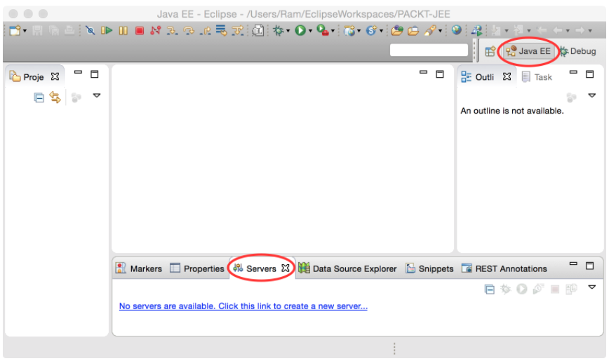

Figura 2.1: La pestaña Servidores en Eclipse JEE

2. Haga clic en el enlace en la pestaña Servidores para agregar un nuevo servidor.

3. Expanda el grupo `Apache` y seleccione la versión de Tomcat que ya ha instalado. Si Eclipse y el servidor Tomcat están en la misma máquina, deje el nombre de host del servidor como `localhost`. De lo contrario, ingrese el nombre de host o la dirección IP del servidor Tomcat. Haga clic en siguiente :

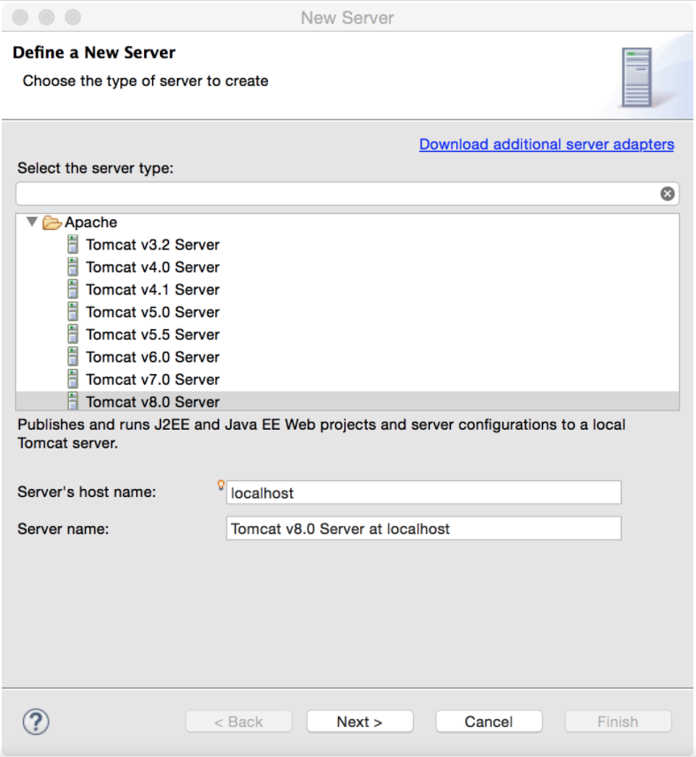

Figura 2.2: Seleccionar un servidor en el asistente de Nuevo servidor

4. Haga clic en el  botón Examinar ... y seleccione la carpeta donde está instalado Tomcat.

5. Haga clic en Siguiente hasta completar el asistente. Al final, verá el servidor Tomcat agregado a la  vista Servidores. Si Tomcat aún no se ha iniciado, verá el estado como detenido.

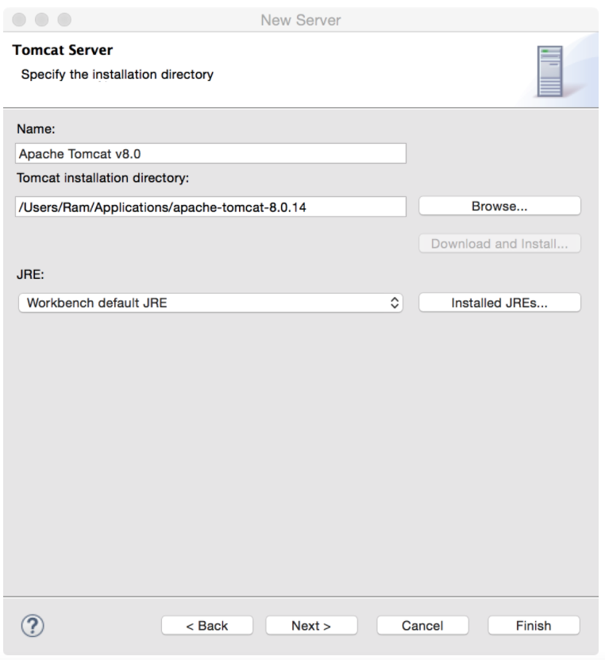

Figura 2.3: Configuración de la carpeta Tomcat en el asistente de Nuevo servidor

6. Para iniciar el servidor, haga clic derecho en el servidor y seleccione Iniciar . También puede iniciar el servidor haciendo clic en el botón Inicio en la barra de herramientas de la   vista Servidor .

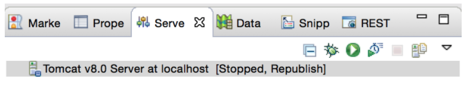

Figura 2.4: El servidor Tomcat agregado a la vista Servidores

Una vez que el servidor se inicia correctamente, verá el estado cambiado a `Started`. Si hace clic en la  pestaña Consola , verá mensajes de consola que el servidor Tomcat envía durante el inicio.

Si expande el grupo Servidores en la  vista Explorador de proyectos , verá el servidor Tomcat que acaba de agregar. Expanda el nodo del servidor Tomcat para ver los archivos de configuración. Esta es una manera fácil de editar la configuración de Tomcat para que no tenga que buscar los archivos de configuración en el sistema de archivos.

Haga doble clic `server.xml` para abrirlo en el editor XML. Obtiene la  vista Diseño , así como la  vista Fuente (dos pestañas en la parte inferior del editor). Hemos aprendido cómo cambiar el puerto predeterminado de Tomcat en el último capítulo. Puede cambiar eso fácilmente en el editor de Eclipse abriendo `server.xml` y yendo al nodo Conector. Si necesita buscar el texto, puede cambiar a la pestaña Fuente (en la parte inferior del editor).

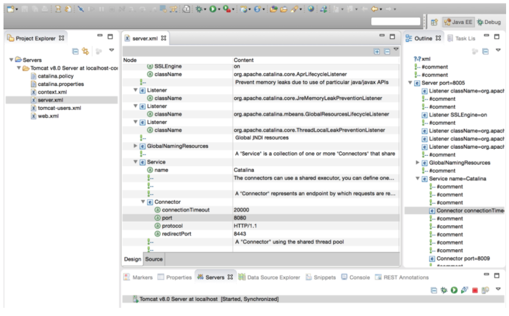

Figura 2.5: Abra server.xml

También puede editar fácilmente `tomcat-users.xml` para agregar/editar usuarios de Tomcat. Recuerde que agregamos un usuario Tomcat en el Capítulo 1 , *Introducción a JEE y Eclipse*, para administrar el servidor Tomcat.

De manera predeterminada, Eclipse no cambia nada en la carpeta de instalación de Tomcat cuando agrega el servidor en Eclipse. En su lugar, crea una carpeta en el espacio de trabajo y copia los archivos de configuración de Tomcat a esta carpeta. Las aplicaciones que se implementan en Tomcat también se copian y publican desde esta carpeta. Esto funciona bien en el desarrollo, cuando no desea modificar la configuración de Tomcat o cualquier aplicación implementada en el servidor. Sin embargo, si desea utilizar la carpeta de instalación real de Tomcat, debe modificar la configuración del servidor en Eclipse. Haga doble clic en el servidor en la vista Servidores para abrirlo en el editor.

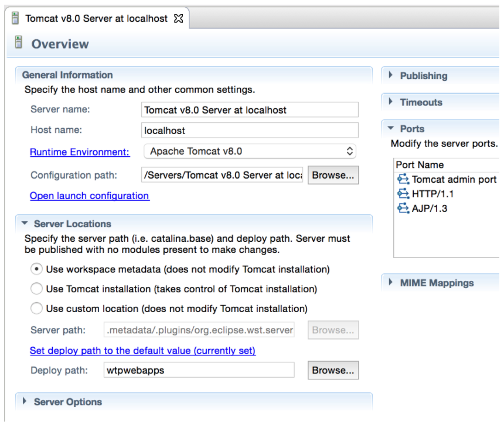

Figura 2.6: Configuración de Tomcat

Tenga en cuenta las opciones en Ubicaciones del servidor . Seleccione la segunda opción, Usar  instalación de Tomcat , si desea usar las carpetas de instalación reales de Tomcat para la configuración y para publicar aplicaciones desde Eclipse.

# JavaServer Pages

Comenzaremos con un proyecto para crear un JSP simple. Crearemos un JSP de inicio de sesión que envíe datos a sí mismo y valide al usuario.

## Creating a dynamic web project

Realizaremos los siguientes pasos para crear un proyecto web dinámico:

1. Seleccione `File | New | Other menu.` Esto abre el asistente de selección. En la parte superior del asistente, encontrará un cuadro de texto con un icono de cruz en el extremo derecho.

2. Escribe `web` en el cuadro de texto. Este es el cuadro de filtro. Muchos asistentes y vistas en Eclipse tienen un cuadro de texto de filtro de este tipo, lo que facilita la búsqueda de elementos.

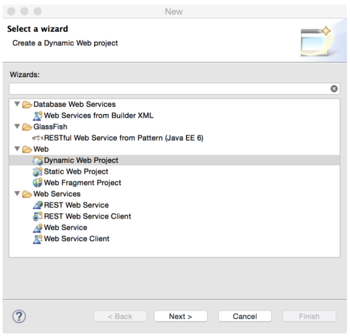

Figura 2.7: New selection wizard

Select Dynamic Web Project and click Next to open the Dynamic Web Project wizard. Enter project name, for example, LoginSampleWebApp. Note that the Dynamic web module version field in this page lists Servlet API version numbers. Select version 3.0 or greater. Click Next.

Seleccione Dynamic Web Project y haga clic en Next para abrir el asistente de Dynamic Web Project. Ingrese el nombre del proyecto, por ejemplo `LoginSampleWebApp`. Tenga en cuenta que el campo Dynamic web module version en esta página enumera los números de versión de API de Servlet. Seleccione la versión 3.0 o superior. Haga clic en Next.

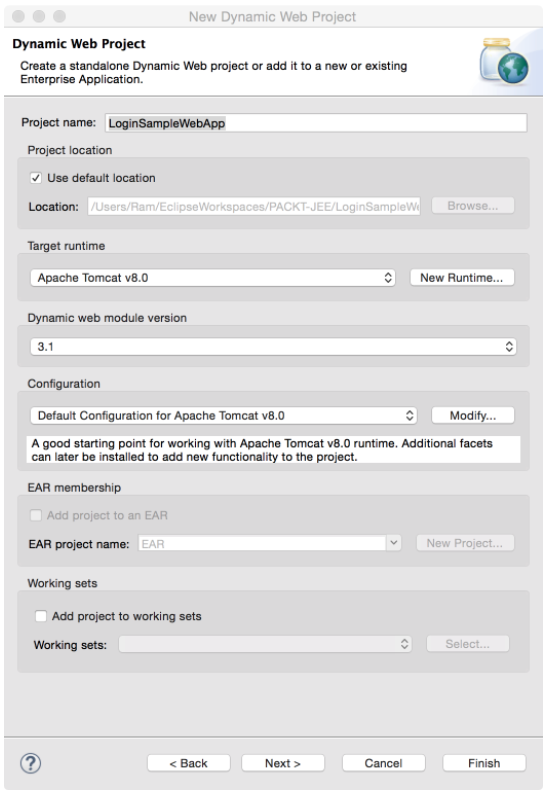

Figura 2.8: New Dynamic Web Project wizard

Haga clic en Next en las siguientes páginas y haga clic en Finish en la última página para crear un  `LoginSimpleWebApp`. Este proyecto también se agrega a Project Explorer.

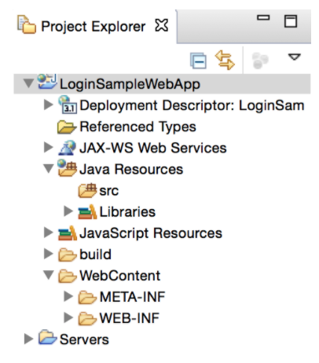

Figura 2.9: New web project

Los archivos fuente de Java van en la carpeta `src` en `Java Resources`. Los recursos web como los archivos HTML, JS y CSS van en la carpeta `WebContent`.

En la siguiente sección, crearemos una página JSP para iniciar sesión.

*Para mantener la página simple en el primer JSP, no seguiremos muchas de las mejores prácticas. Tendremos el código UI mezclado con el código comercial de la aplicación. Tal diseño no se recomienda en aplicaciones reales, pero podría ser útil para la creación rápida de prototipos. Veremos cómo escribir un mejor código JSP con una clara separación de la interfaz de usuario y la lógica empresarial más adelante en este capítulo.*

## Creating JSP

Realizaremos los siguientes pasos para crear el JSP:

1. Haga clic derecho en la carpeta `WebContent` y seleccione New | JSP File. Nómbralo `index.jsp`. El archivo se abrirá en el editor con la vista dividida. La parte superior muestra la vista de diseño y la parte inferior muestra el código. Si el archivo no se abre en el editor dividido, haga clic con el botón derecho en `index.jsp` en el Project Explorer y seleccione Open With | Web Page Editor.

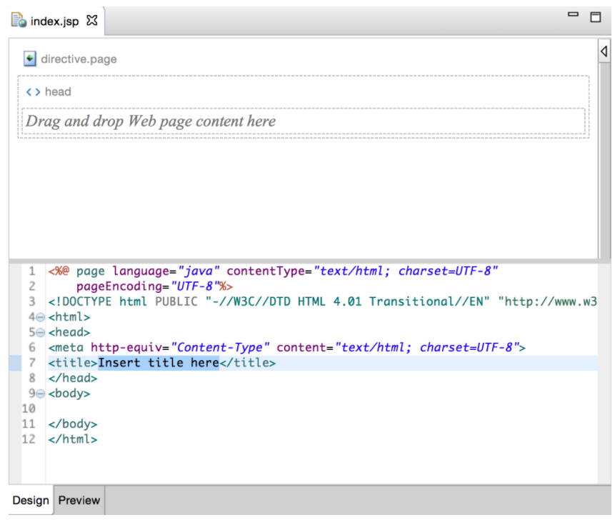

Figura 2.10: The JSP editor

2. Si no le gusta la vista dividida y desea ver la vista de diseño completo o la vista de código completo, use los botones apropiados de la barra de herramientas en la parte superior derecha, como se muestra en la siguiente captura de pantalla:


Figura 2.11: Los botones de visualización del editor JSP

3. Cambia el título `Insert title here` a `Login`.

4. Veamos ahora cómo Eclipse proporciona asistencia de código para etiquetas HTML. Tenga en cuenta que los campos de entrada deben estar en una etiqueta `form`. Añadiremos un tag `form` más tarde. Dentro del tag `body`, escriba la etiqueta `User Name:`. Luego, escribe `<`. Si espera un momento, Eclipse abre la ventana de asistencia de código que muestra las opciones para todas las etiquetas HTML válidas. También puede invocar la asistencia de código manualmente.

5. Coloque un símbolo de intercalación justo después `<` y presione Ctrl + Spacebar.

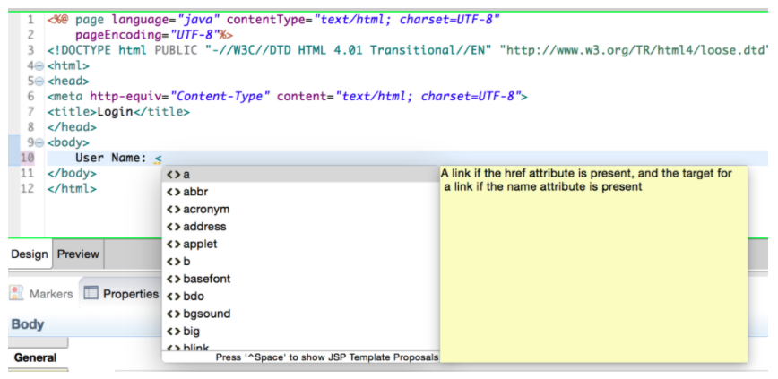

Figura 2.12: Asistencia de código HTML en JSP

La asistencia de código también funciona en texto parcial; por ejemplo, si se invoca el asistente de código después del texto `<i`, verá una lista de etiquetas HTML a partir de `i` ( `i, iframe, img, input,` y así sucesivamente). También puede usar la asistencia de código para los atributos de etiqueta y los valores de atributo.
Por ahora, queremos insertar el campo `input` para nombre de usuario.

6. Seleccione `input` de las propuestas de asistencia de código o escríbala.

7. Después de insertar el  elemento `input`, mueva el cursor dentro del cierre `>` e invoque el código de asistencia nuevamente ( *Ctrl/Cmd + Spacebar* ). Verá la lista de propuestas para los atributos del tag `input`.

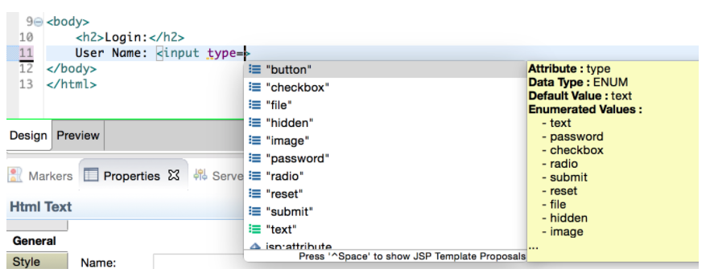

Figura 2.13: Código de asistencia para el valor del atributo de etiqueta

8. Escriba el siguiente código para crear un formulario de inicio de sesión:

```html
<body> 
  <h2> Inicio de sesión: </h2> 
  <form method = "post"> 
    Nombre de usuario: <input type = "text" name = "userName"> <br> 
    Contraseña: <input type = "password" name = "contraseña"> <br> 
    <button type = "submit" name = "submit"> Enviar </button> 
    <button type = "reset"> Restablecer </button> 
  </form> 
</body>
```

*Descarga del código de ejemplo
Puede descargar los archivos de código de ejemplo de su cuenta en http://www.packtpub.com para todos los libros de Packt Publishing que haya comprado. Si compró este libro en otro lugar, puede visitar http://www.packtpub.com/support y registrarse para recibir los archivos directamente por correo electrónico.*

Si está utilizando el editor dividido (páginas de diseño y fuente), puede ver el formulario de inicio de sesión representado en la vista de diseño. Si desea ver cómo se vería la página en el navegador web, haga clic en la  pestaña Vista previa en la parte inferior del editor. Verá que la página web se muestra en la vista del navegador dentro del editor. Por lo tanto, no necesita salir de Eclipse para probar sus páginas web.

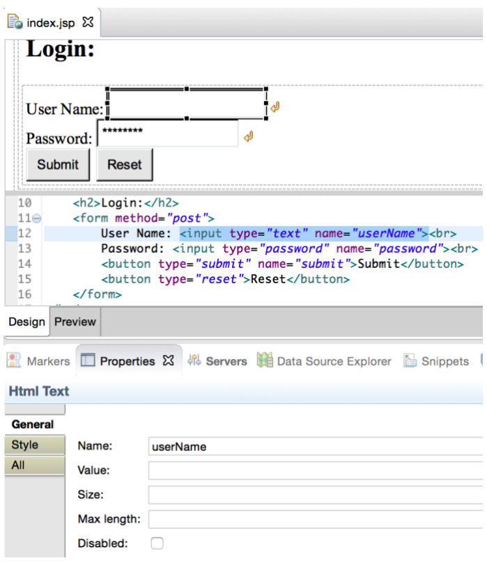

Figura 2.14: Vistas de diseño y fuente

Si hace clic en cualquier control de interfaz de usuario en la vista de diseño, verá sus propiedades en la Properties view (consulte la Figura 2.14 ). Puede editar propiedades, como el  Name y Value del elemento seleccionado. Haga clic en la  Style tab de la Properties window para editar los estilos CSS del elemento.

*No hemos especificado el atributo `action` en el formulario anterior. Este atributo especifica una URL en la que se deben publicar los datos del formulario cuando el usuario hace clic en el  botón Submit (Enviar). **Si no se especifica este atributo, la solicitud o los datos del formulario se enviarán a la misma página**; en este caso, se enviarían los datos del formulario `index.jsp`. Ahora escribiremos el código para manejar los datos del formulario.*

Como se mencionó en el Capítulo 1 , Introducción a JEE y Eclipse , puede escribir código Java y el código del lado del cliente (HTML, CSS y JavaScript) en el mismo JSP. **No se considera una buena práctica mezclar código Java con código HTML**, pero lo haremos de todos modos en este ejemplo para mantener el código más simple. Más adelante en el libro, veremos cómo hacer que nuestro código sea modular.

El código Java está escrito en JSP entre `<%` y `%>`; Tales bloques de código Java en JSP se denominan **scriptlets** . También puede establecer atributos a nivel de página en JSP. Se llaman **page directives (directivas de página)** y se incluyen entre `<%@` y `%>`. El JSP que creamos ya tiene una directiva de página para establecer el tipo de contenido de la página. El tipo de contenido le dice al navegador el tipo de respuesta (en este caso html/text) devuelta por el servidor. El navegador muestra una respuesta adecuada según el tipo de contenido:

```html
<%@ page language="java" contentType="text/html; charset=UTF-8" 
    pageEncoding="UTF-8"%> 
```

En JSP tiene acceso a varios objetos para ayudarlo a procesar y generar la respuesta, como se describe en la siguiente tabla:

Object name | Type
------------|-----
`request`   | `HttpServletRequest` (http://docs.oracle.com/javaee/7/api/javax/servlet/http/HttpServletRequest.html). Use esto para obtener request parameters y otros datos relacionados con la request.
`response`  | `HttpServletResponse` (http://docs.oracle.com/javaee/7/api/javax/servlet/http/HttpServletResponse.html). Use esto para enviar una response (respuesta).
`out`       | `JSPWriter` (http://docs.oracle.com/javaee/7/api/javax/servlet/jsp/JspWriter.html). Use esto para generar una respuesta de texto.
`session`   | `HttpSession` (http://docs.oracle.com/javaee/7/api/javax/servlet/http/HttpSession.html). Use esto para obtener o poner objetos en la sesión.
`application` | `ServletContext` (http://docs.oracle.com/javaee/7/api/javax/servlet/ServletContext.html). Use esto para obtener o poner objetos en el contexto, que se comparten entre todos los JSP y servlets en la misma aplicación.

En este ejemplo, vamos a hacer uso de los objetos `request` y `out`. Primero verificaremos si el formulario se envía utilizando el método `POST`. Si es verdadero, obtendremos valores de campos de username y password . Si las credenciales son válidas (en este ejemplo, vamos a codificar el username y password  como `admin`), imprimiremos un mensaje de bienvenida:

```html
<% 
  String errMsg = null; 
  //first check whether the form was submitted 
  if ("POST".equalsIgnoreCase(request.getMethod()) && 
   request.getParameter("submit") != null) 
  { 
    //form was submitted 
    String userName = request.getParameter("userName"); 
    String password = request.getParameter("password"); 
    if ("admin".equalsIgnoreCase(userName) && 
     "admin".equalsIgnoreCase(password)) 
    { 
      //valid user 
      System.out.println("Welcome admin !"); 
    } 
    else 
    { 
      //invalid user. Set error message 
      errMsg = "Invalid user id or password. Please try again"; 
    } 
  } 
%> 
```

Hemos utilizado dos objetos integrados en el código anterior `request` y `out`. Primero verificamos si se envió el formulario  `"POST".equalsIgnoreCase(request.getMethod()`. Luego, verificamos si el botón de enviar se utilizó para publicar el formulario `request.getParameter("submit") != null`.

Luego obtenemos el nombre de usuario y la contraseña llamando al método `request.getParameter`. Para mantener el código simple, los comparamos con los valores codificados. En la aplicación real, lo más probable es que valide las credenciales en una base de datos o algún servicio de nombres y carpetas. Si las credenciales son válidas, imprimimos un mensaje utilizando el objeto `out`( `JSPWriter` ). Si las credenciales no son válidas, establecemos un mensaje de error. Imprimiremos el mensaje de error, si lo hay, justo antes del formulario de inicio de sesión:

```html
<h2>Login:</h2> 
  <!-- Check error message. If it is set, then display it --> 
  <%if (errMsg != null) { %> 
    <span style="color: red;"><%=;"><%=;"><%=errMsg %></span> 
  <%} %> 
  <form method="post"> 
  ... 
  </form> 
```

Aquí, comenzamos otro bloque de código Java usando `<%%>`. Si un mensaje de error no es nulo, lo mostramos usando la etiqueta `span`. Observe cómo se imprime el valor del mensaje de error `<%=errMsg %>`. Esta es una sintaxis corta para `<%out.print(errMsg);%>`. Observe también que la llave que comenzó en el primer bloque de código Java se completa en el siguiente bloque de código Java separado. Entre estos dos bloques de código, puede agregar cualquier código HTML y se incluirá en la respuesta solo si la expresión condicional en el sentencia `if` se evalúa como verdadera.

Aquí está el código completo del JSP que creamos en esta sección:

```html
<%@ page language="java" contentType="text/html; charset=UTF-8" 
    pageEncoding="UTF-8"%> 
<!DOCTYPE html PUBLIC "-//W3C//DTD HTML 4.01 Transitional//EN" 
 "http://www.w3.org/TR/html4/loose.dtd"> 
<html> 
<head> 
<meta http-equiv="Content-Type" content="text/html; 
charset=UTF-8"> 
<title>Login</title> 
</head> 
<% 
  String errMsg = null; 
  //first check whether the form was submitted 
  if ("POST".equalsIgnoreCase(request.getMethod()) && 
   request.getParameter("submit") != null) 
  { 
    //form was submitted 
    String userName = request.getParameter("userName"); 
    String password = request.getParameter("password"); 
    if ("admin".equalsIgnoreCase(userName) && 
     "admin".equalsIgnoreCase(password)) 
    { 
      //valid user 
      out.println("Welcome admin !"); 
      return; 
    } 
    else 
    { 
      //invalid user. Set error message 
      errMsg = "Invalid user id or password. Please try again"; 
    } 
  } 
%> 
<body> 
  <h2>Login:</h2> 
  <!-- Check error message. If it is set, then display it --> 
  <%if (errMsg != null) { %> 
    <span style="color: red;"><%out.print(errMsg); %></span> 
  <%} %> 
  <form method="post"> 
    User Name: <input type="text" name="userName"><br> 
    Password: <input type="password" name="password"><br> 
    <button type="submit" name="submit">Submit</button> 
    <button type="reset">Reset</button> 
  </form> 
</body> 
</html> 
```

## Running JSP in Tomcat

Para ejecutar el JSP que creamos en la sección anterior en el navegador web, deberá implementar la aplicación en un contenedor de servlet. Ya hemos visto cómo configurar Tomcat en Eclipse. Asegúrese de que Tomcat se esté ejecutando verificando su estado en la vista Servidores de Eclipse:


Figura 2.15: Tomcat se inició en la vista Servidores

Hay dos formas de agregar un proyecto a un servidor configurado para que la aplicación se pueda ejecutar en el servidor:

1. Haga clic derecho en el Servers view y seleccione la opción Add and Remove option . Seleccione su proyecto de la lista de la izquierda ( Available resources ) y haga clic en Add para moverlo a la lista Configurada . Haz clic en Finalizar.

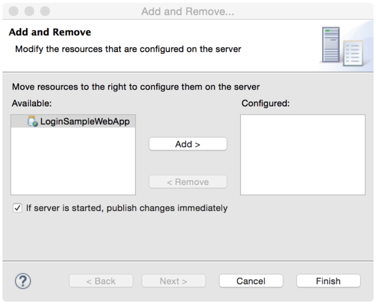

Figura 2.16: Agregar un proyecto al servidor

2. El otro método para agregar un proyecto al servidor es hacer clic derecho en el proyecto en el Project Explorer y seleccionar Properties. Esto abre el cuadro de diálogo Project Properties. Haga clic en Servidor en la lista y seleccione el servidor en el que desea implementar este proyecto. Haga clic en OK o Apply.

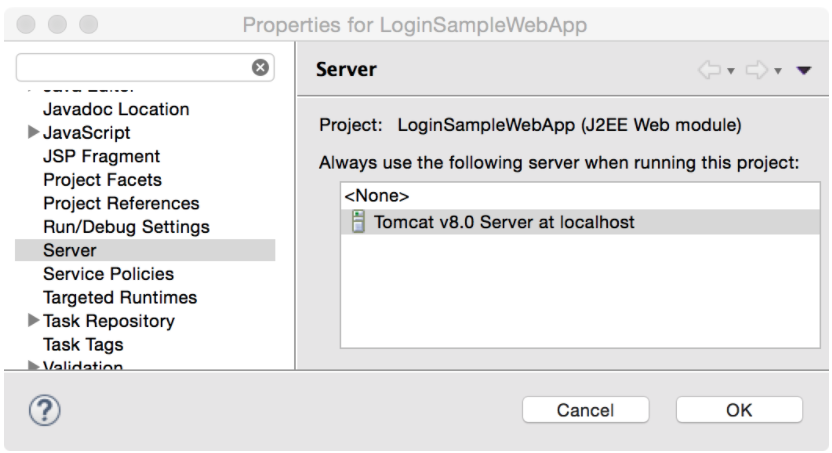

Figura 2.17: Seleccionar servidor en las propiedades del proyecto

En el primer método, el proyecto se implementa inmediatamente en el servidor. En el segundo método, se implementará solo cuando ejecute el proyecto en el servidor.

3. Para ejecutar la aplicación, haga clic derecho en el proyecto en Project Explorer y selecione Run As | Run on Server. La primera vez se le pedirá que reinicie el servidor. Una vez que se implementa la aplicación, la verá en el servidor seleccionado en la vista Servidores :

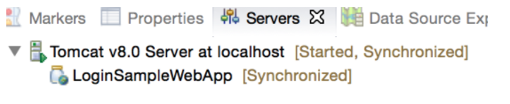

Figura 2.18: Proyecto implementado en el servidor

4. Ingrese algún texto que no sea `admin` en los cuadros de username y password
y haga clic en Submit . Debería ver el mensaje de error y volver a mostrar el mismo formulario.

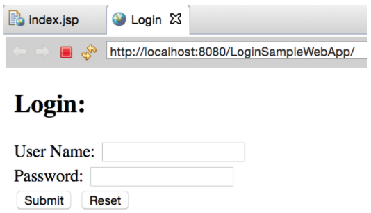

Figura 2.19: Proyecto ejecutándose en el navegador incorporado en Eclipse

5. Ahora ingrese `admin` como username y password y luego envíe el formulario. Deberías ver el mensaje de bienvenida.

Los JSP se compilan dinámicamente en clases Java, por lo que si realiza algún cambio en la página, en la mayoría de los casos, no tiene que reiniciar el servidor; simplemente actualice la página, y Tomcat volverá a compilar la página si ha cambiado y se mostrará la página modificada. En los casos en que necesite reiniciar el servidor para aplicar sus cambios, Eclipse le preguntará si desea reiniciar el servidor.

## Using JavaBeans in JSP

El JSP que creamos anteriormente no sigue las mejores prácticas de JSP. En general, es una mala idea tener scriptlets (código Java) en JSP. En la mayoría de las organizaciones grandes, el diseñador y programador de la interfaz de usuario son roles diferentes desempeñados por diferentes personas. Por lo tanto, se recomienda que JSP contenga principalmente etiquetas de marcado para que sea fácil para los diseñadores trabajar en el diseño de la página. El código Java debe estar en clases separadas. También tiene sentido desde un punto de vista de reutilización mover el código Java fuera de JSP.

Puede delegar el procesamiento de la lógica de negocios a JavaBeans desde JSP. JavaBeans son simples objetos Java con atributos y métodos getters y setters. La convención de nomenclatura para los métodos getter/setter en JavaBeans es el prefijo `get`/`set` seguido del nombre del atributo, con la primera letra de cada palabra en mayúscula, también conocida como **CamelCase**. Por ejemplo, si tiene un atributo de clase llamado `firstName`, entonces el método getter será `getFirstName` y el setter será `setFirstName`.

JSP tiene una etiqueta especial para usar JavaBeans— `jsp:useBean`:

```html
<jsp:useBean id="name_of_variable" class="name_of_bean_class" 
 scope="scope_of_bean"/>
```

El **Scope** indica la vida útil del bean. Los valores válidos son `application`, `page`, `request`, y `session`.

Scope name | Descripción
-----------|------------
`page`     | El Bean solo se puede usar en la página actual.
`request`  | El Bean se puede utilizar en cualquier página en el procesamiento de la misma solicitud (request). Una solicitud web puede ser manejada por múltiples JSP si una página reenvía la solicitud a otra página.
`session`  | El Bean se puede usar en la misma sesión HTTP. La sesión es útil si su aplicación desea guardar los datos del usuario por interacción con la aplicación, por ejemplo, para guardar artículos en el carrito de compras en una aplicación de tienda en línea.
`application` | El Bean se puede usar en cualquier página de la misma aplicación web. Por lo general, las aplicaciones web se implementan en un contenedor de aplicaciones web como archivos de archivo de aplicaciones web ( WAR ) **web application archive (WAR)**. En el ámbito de aplicación, todos los JSP en el archivo WAR pueden usar JavaBeans.

Vamos a mover el código para validar a los usuarios en nuestro ejemplo de inicio de sesión a la clase JavaBean. Primero, necesitamos crear una clase JavaBean:

1. En Project Explorer, haga clic derecho en la carpeta `src` New | Package menu option.
2. Crea un paquete llamado `packt.book.jee_eclipse.ch2.bean`.
3. Haga clic derecho en el paquete y seleccione  New | Class menu option.
4. Crea una clase llamada `LoginBean`.
5. Cree dos miembros privados `String` de la siguiente manera:

```java
public class LoginBean { 
  private String userName; 
  private String password; 
} 
```

6. Haga clic derecho en cualquier lugar dentro de la clase (en el editor) y seleccione Source | Generate Getters and Setters menu option:

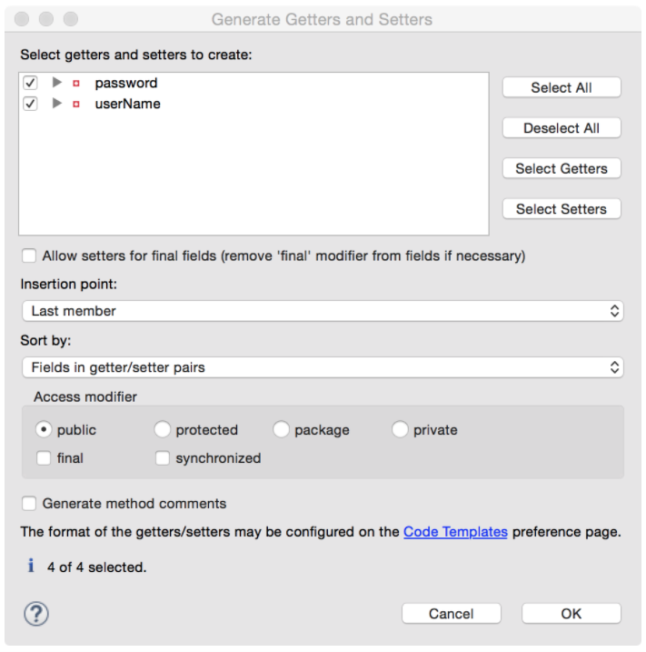

Figura 2.20: Generar getters y setters

7. Queremos generar getters y setters para todos los miembros de la clase. Por lo tanto, haga clic en el botón Select All y seleccione Last member  de la lista desplegable para Insertion point, porque queremos insertar los getters y setters después de declarar todas las variables miembro.

La clase `LoginBean` ahora debería ser la siguiente:

```java
public class LoginBean { 
  
  private String userName; 
  private String password; 
  
  public String getUserName() { 
    return userName; 
  } 
  public void setUserName(String userName) { 
    this.userName = userName; 
  } 
  public String getPassword() { 
    return password; 
  } 
  public void setPassword(String password) { 
    this.password = password; 
  } 
} 
```

8. Agregaremos un método más para validar username y password:

```java
public boolean isValidUser() 
  { 
    //Validation can happen here from a number of sources 
    //for example, database and LDAP 
    //We are just going to hardcode a valid username and 
    //password here. 
    return "admin".equals(this.userName) && 
            "admin".equals(this.password); 
  } 
```

Esto completa nuestro JavaBean para almacenar información y validación del usuario.
Ahora usaremos este bean en nuestro JSP y delegaremos la tarea de validar a los usuarios a este bean. Abra `index.jsp`. Reemplace el scriptlet Java justo arriba del tag `<body>` en el código anterior con lo siguiente:

```html
<%String errMsg = null; %> 
<%if ("POST".equalsIgnoreCase(request.getMethod()) && request.getParameter("submit") != null) {%> 
  <jsp:useBean id="loginBean" 
   class="packt.book.jee_eclipse.ch2.bean.LoginBean"> 
    <jsp:setProperty name="loginBean" property="*"/> 
  </jsp:useBean> 
  <% 
    if (loginBean.isValidUser()) 
    { 
      //valid user 
      out.println("<h2>Welcome admin !</h2>"); 
      out.println("You are successfully logged in"); 
    } 
    else 
    { 
 
      errMsg = "Invalid user id or password. Please try again"; 
 
    } 
  %> 
<%} %> 
```

Antes de analizar lo que ha cambiado en el código anterior, tenga en cuenta que también puede invocar y obtener asistencia de código para los atributos y valores de las etiquetas `<jsp:*>`. Si no está seguro de si el asistente de código está disponible, simplemente pulse *Ctrl / Cmd + C*.

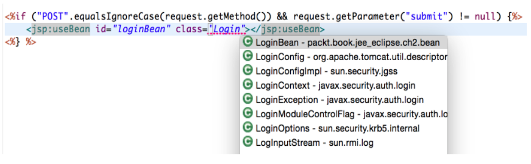

Figura 2.21: Código de asistencia en etiquetas JSP

Observe que Eclipse muestra la asistencia de código para JavaBean que acabamos de agregar.

Ahora entendamos lo que cambiamos en el JSP:

* Creamos múltiples scriptlets, uno para la declaración de la variable `errMsg` y dos más para bloques `if` separados. 

* Agregamos una etiqueta `<jsp:useBean` en la primera condición `if`. El bean se crea cuando una condición en la declaración `if` es verdadera, es decir, cuando el formulario se publica haciendo clic en el  botón Submit(Enviar).

* Usamos la etiqueta `<jsp:setProperty>` para establecer los atributos del bean:


```html
<jsp:setProperty name="loginBean" property="*"/> 
```

Estamos estableciendo valores de variables miembro de `loginBean`. Además, estamos estableciendo valores de todas las variables miembro al especificar `property="*"`. Sin embargo, ¿dónde especificamos los valores? Los valores se especifican implícitamente porque hemos nombrado miembros `LoginBean` para que sean los mismos que los campos en el formulario. Entonces, el tiempo de ejecución JSP obtiene parámetros del objeto `request` y asigna valores a los miembros JavaBean con el mismo nombre.
Si los nombres de los miembros de JavaBean no coinciden con los parámetros de la solicitud, debe establecer los valores explícitamente:

```html
<jsp:setProperty name="loginBean" property="userName" 
  value="<%=request.getParameter("userName")%>"/> 
<jsp:setProperty name="loginBean" property="password" 
  value="<%=request.getParameter("password")%>"/> 
```

* Luego verificamos si el usuario es válido llamando `loginBean.isValidUser()`. El código para manejar los mensajes de error no ha cambiado.

Para probar la página, realice los siguientes pasos:

1. Haga clic derecho en `index.jsp` en el Project Explorer .
2. Seleccione el Run As | Run on Server menu option. Eclipse le pedirá que reinicie el servidor Tomcat.
3. Haga clic en el  botón OK para reiniciar el servidor.

La página se mostrará en el navegador interno de Eclipse. Debería comportarse de la misma manera que en el ejemplo anterior.

Aunque hemos movido la validación de los usuarios a `LoginBean`, todavía tenemos mucho código en los scriptlets de Java. Idealmente, deberíamos tener la menor cantidad posible de scriptlets Java en JSP. Todavía tenemos scriptlets para verificar condiciones y para asignaciones variables. Podemos escribir el mismo código usando etiquetas para que sea coherente con el código restante basado en etiquetas en JSP y sea más fácil para los diseñadores web trabajar con él. Esto se puede lograr utilizando **JSP Standard Tag Library ( JSTL )**.

## Using JSTL

Las etiquetas JSTL se pueden usar para reemplazar gran parte de los scriptlets de Java en JSP. Las etiquetas JSTL se clasifican en cinco grandes grupos:

* **Core**: Cubre el control de flujo y el soporte de variable, entre otras cosas
* **XML**: Etiquetas para procesar documentos XML
* **i18n** : Etiquetas para apoyar la internacionalización
* **SQL** : Etiquetas para acceder a la base de datos
* **Funciones** : Etiquetas para realizar algunas de las operaciones de cadena comunes

Consulte http://docs.oracle.com/javaee/5/tutorial/doc/bnake.html para obtener más detalles sobre JSTL.

Modificaremos el JSP de inicio de sesión para usar JSTL, de modo que no haya scriptlets Java en él:

1. Descargue las bibliotecas JSTL para API y su implementación. Al momento de escribir, los archivos `.jar` más recientes son `javax.servlet.jsp.jstl-api-1.2.1.jar` ( http://search.maven.org/remotecontent?filepath=javax/servlet/jsp/jstl/javax.servlet.jsp.jstl-api/1.2.1/javax.servlet .jsp.jstl-api-1.2.1.jar ) y `javax.servlet.jsp.jstl-1.2.1.jar` ( http://search.maven.org/remotecontent?filepath=org/glassfish/web/javax.servlet.jsp.jstl/1.2.1/javax.servlet .jsp.jstl-1.2.1.jar ). Asegúrese de copiar estos archivos WEB-INF/lib. Todos los archivos `.jar` en esta carpeta se agregan a la classpath aplicación web.

2. Necesitamos agregar una declaración para JSTL en nuestro JSP. Agregue la siguiente declaración `taglib` debajo de la declaración de la primera página ( `<%@ page language="java" ...>`):

```html
<%@ taglib prefix="c" uri="http://java.sun.com/jsp/jstl/core" %> 
```  

La declaración `taglib` contiene la URL de la `tag` library y el `prefix`. Todas las tags en `tag` library se acceden mediante el uso del `prefix` JSP.

3. Reemplace  `<%String errMsg = null; %>` con el tag `set` de JSTL:

```html
<c:set var="errMsg" value="${null}"/> 
<c:set var="displayForm" value="${true}"/> 
```

Hemos incluido el valor en  `${}`. Esto se llama  **Expression Language (EL)**. Encierra la expresión Java en JSTL en `${}`.

4. Reemplace el siguiente código:

```html
<%if ("POST".equalsIgnoreCase(request.getMethod()) && 
request.getParameter("submit") != null) {%> 
```

Con el tag `if` de JSTL:


```html
<c:if test="${"POST".equalsIgnoreCase(pageContext.request 
.method) && pageContext.request.getParameter("submit") != 
 null}">
```
El objeto `request` accede en el JSTL a través del tag `pageContext`.

5. Las etiquetas JavaBean van dentro de la etiqueta `if`. No hay cambios en este código:

```html
<jsp:useBean id="loginBean" 
  class="packt.book.jee_eclipse.ch2.bean.LoginBean"> 
  <jsp:setProperty name="loginBean" property="*"/> 
</jsp:useBean> 
```

6. Luego agregamos etiquetas a la llamada `loginBean.isValidUser()` y en función de su valor de retorno, colocamos los mensajes. Sin embargo, no podemos usar la etiqueta `if` de JSTL aquí, porque también necesitamos escribir la declaración `else`. JSTL no tiene una etiqueta para else. En cambio, para varias declaraciones `if...else`, debe usar la declaración `choose`, que es algo similar a la declaración `switch`:

```html
<c:choose> 
  <c:when test="${!loginBean.isValidUser()}"> 
    <c:set var="errMsg" value="Invalid user id or password. Please 
     try again"/> 
  </c:when> 
  <c:otherwise> 
    <h2><c:out value="Welcome admin !"/></h2> 
    <c:out value="You are successfully logged in"/> 
    <c:set var="displayForm" value="${false}"/> 
  </c:otherwise> 
</c:choose>
```

Si las credenciales de usuario no son válidas, configuramos el mensaje de error. O (en la etiqueta `c:otherwise`), imprimimos el mensaje de bienvenida y colocamos la bandera `displayForm` a `false`. No queremos mostrar el formulario de inicio de sesión si el usuario ha iniciado sesión correctamente.

7. Ahora reemplazaremos otro código `if` de scriptlet por etiqueta `<%if%>`. Reemplace el siguiente fragmento de código:

```html
<%if (errMsg != null) { %> 
  <span style="color: red;"><%out.print(errMsg); %></span> 
<%} %>
```

Con el siguiente código:

```html
<c:if test="${errMsg != null}"> 
  <span style="color: red;"> 
    <c:out value="${errMsg}"></c:out> 
  </span> 
</c:if>
```

Tenga en cuenta que hemos utilizado la etiqueta `out` para imprimir un mensaje de error.

8. Finalmente, incluimos todo el contenido del `<body>` en otra etiqueta `if` JSTL :

```html
<c:if test="${displayForm}"> 
<body> 
   ... 
</body> 
</c:if> 
```

Aquí está el código fuente completo de la JSP:

```html
<%@ page language="java" contentType="text/html; charset=UTF-8" 
    pageEncoding="UTF-8"%> 
<%@ taglib prefix="c" uri="http://java.sun.com/jsp/jstl/core" %> 
 
<!DOCTYPE html PUBLIC "-//W3C//DTD HTML 4.01 Transitional//EN" "http://www.w3.org/TR/html4/loose.dtd"> 
<html> 
<head> 
<meta http-equiv="Content-Type" content="text/html; charset=UTF- 
 8"> 
<title>Login</title> 
</head> 
 
<c:set var="errMsg" value="${null}"/> 
<c:set var="displayForm" value="${true}"/> 
<c:if test="${"POST".equalsIgnoreCase(pageContext.request.method) 
&& pageContext.request.getParameter("submit") != null}"> 
  <jsp:useBean id="loginBean" 
   class="packt.book.jee_eclipse.ch2.bean.LoginBean"> 
    <jsp:setProperty name="loginBean" property="*"/> 
  </jsp:useBean> 
  <c:choose> 
    <c:when test="${!loginBean.isValidUser()}"> 
      <c:set var="errMsg" value="Invalid user id or password. 
       Please try again"/> 
    </c:when> 
    <c:otherwise> 
    <h2><c:out value="Welcome admin !"/></h2> 
      <c:out value="You are successfully logged in"/> 
      <c:set var="displayForm" value="${false}"/> 
    </c:otherwise> 
  </c:choose> 
</c:if> 
 
<c:if test="${displayForm}"> 
<body> 
  <h2>Login:</h2> 
  <!-- Check error message. If it is set, then display it --> 
  <c:if test="${errMsg != null}"> 
    <span style="color: red;"> 
      <c:out value="${errMsg}"></c:out> 
    </span> 
  </c:if> 
  <form method="post"> 
    User Name: <input type="text" name="userName"><br> 
    Password: <input type="password" name="password"><br> 
    <button type="submit" name="submit">Submit</button> 
    <button type="reset">Reset</button> 
  </form> 
</body> 
</c:if> 
</html> 
```

Como puede ver, no hay scriptlets Java en el código anterior. Todos ellos, del código anterior, son reemplazados por etiquetas. Esto facilita a los diseñadores web editar la página sin preocuparse por los scriptlets de Java.

Una última nota antes de dejar el tema de JSP. En las aplicaciones del mundo real, probablemente reenvíe la solicitud a otra página después de que el usuario inicie sesión correctamente, en lugar de solo mostrar un mensaje de bienvenida en la misma página. Podrías usar la etiqueta `<jsp:forward>` para lograr esto.

# Java Servlet

Ahora veremos cómo implementar una aplicación de inicio de sesión utilizando Java Servlet. Cree una nueva aplicación web dinámica en Eclipse como se describe en la sección anterior. Llamaremos a esto `LoginServletApp`:

1. Haga clic derecho en la carpeta `src` en `Java Resources` del proyecto en Project Explorer . Seleccione el  New | Servlet menu option.

2. En el asistente Create Servlet, ingrese el nombre del paquete como `packt.book.jee_eclipse.book.servlet` y el nombre de la clase como `LoginServlet`. Luego, haga clic en Finish .

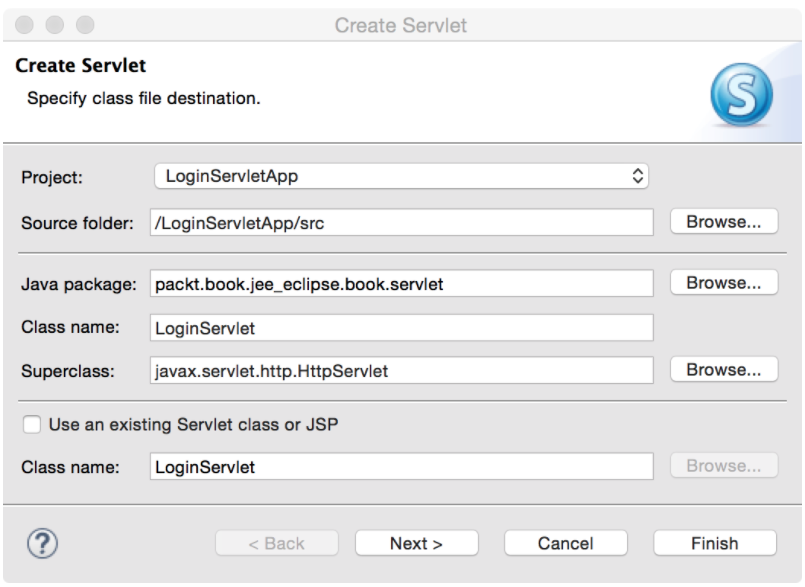

Figura 2.22: Create Servlet wizard

El asistente de servlet crea la clase para usted. Observe la anotación `@WebServlet("/LoginServlet")` justo arriba de la declaración de clase. Antes de JEE 5, tenía que declarar servlets `web.xml` en la carpeta `WEB-INF`. Todavía puede hacerlo, pero puede omitir esta declaración si usa las anotaciones adecuadas. Usando `WebServlet`, le estamos diciendo al contenedor de servlet que `LoginServlet` es un servlet, y lo estamos asignando a la ruta URL `/LoginServlet`. Por lo tanto, estamos evitando las siguientes dos entradas `web.xml` al usar esta anotación: `<servlet>` y `<servlet-mapping>`.

Ahora cambiaremos la asignación de `/LoginServleta` solo por `/login`. Por lo tanto, modificaremos la anotación de la siguiente manera:

```java
@WebServlet("/login") 
public class LoginServlet extends HttpServlet {...} 
```

4. El asistente también creó los métodos `doGet` y `doPost`. Estos métodos se redefinen partir de la siguiente clase base: `HttpServlet`. Se llama al método `doGet` para crear una respuesta para la solicitud `Get` y `doPost` se llama para crear una respuesta para la solicitud `Post`.

Crearemos un formulario de inicio de sesión en el método `doGet` y procesaremos los datos del formulario ( `Post` ) en el método `doPost`. Sin embargo, debido a que `doPost` puede necesitar mostrar el formulario, en caso de que las credenciales del usuario no sean válidas, escribiremos un método `createForm`, que podría llamarse desde ambos métodos  d`doGet` y `doPost`.

5. Agregue un método `createForm` de la siguiente manera:

```java
protected String createForm(String errMsg) { 
 StringBuilder sb = new StringBuilder("<h2>Login</h2>"); 
//check whether error message is to be displayed 
  if (errMsg != null) { 
    sb.append("<span style='color: red;'>") 
      .append(errMsg) 
      .append("</span>"); 
  } 
  //create form 
  sb.append("<form method='post'>n") 
    .append("User Name: <input type='text' 
     name='userName'><br>n")    .append("Password: <input type='password' 
     name='password'><br>n")    .append("<button type='submit' 
     name='submit'>Submit</button>n") 
    .append("<button type='reset'>Reset</button>n") 
    .append("</form>"); 
 
  return sb.toString(); 
} 
```

6. Ahora modificaremos un método `doGet` para llamar a un método `createForm` y devolver la respuesta:

```html
protected void doGet(HttpServletRequest request, 
 HttpServletResponse response) 
  throws ServletException, IOException { 
  response.getWriter().write(createForm(null)); 
} 
```

Llamamos al método `getWrite` en el objeto `response` y le escribimos el contenido del formulario llamando a la función `createForm`. Tenga en cuenta que cuando mostramos el formulario, inicialmente, no hay ningún mensaje de error, por lo que pasamos un argumento `null` a `createForm`.

7. Modificaremos `doPost` para procesar el contenido del formulario cuando el usuario publique el formulario haciendo clic en el botón Submit :

```java
protected void doPost(HttpServletRequest request, 
HttpServletResponse response) 
  throws ServletException, IOException { 
    String userName = request.getParameter("userName"); 
    String password = request.getParameter("password"); 
 
  //create StringBuilder to hold response string 
  StringBuilder responseStr = new StringBuilder(); 
  if ("admin".equals(userName) && "admin".equals(password)) { 
    responseStr.append("<h2>Welcome admin !</h2>") 
    .append("You are successfully logged in"); 
  } 
  else { 
    //invalid user credentials 
    responseStr.append(createForm("Invalid user id or password. 
     Please try again")); 
  } 
 
  response.getWriter().write(responseStr.toString()); 
} 
```

Primero obtenemos el username y password del objeto `request` llamando al método `request.getParameter`. Si las credenciales son válidas, agregamos un mensaje de bienvenida a la cadena `response`; o bien, llamamos a `createForm` con un mensaje de error y agregamos un valor de retorno (markup para el formulario) a la cadena `response`.

Finalmente, obtenemos el objeto `Writer` de la cadena `response` y escribimos la respuesta.

8. Haga clic derecho en el archivo `LoginServlet.java` en el Project Explorer y seleccione the Run As | Run on Server option. No hemos agregado este proyecto al servidor Tomcat. Por lo tanto, Eclipse le preguntará si desea usar el servidor configurado para ejecutar este servlet. Haga clic en el  botón Finish del asistente.

9. Tomcat necesita reiniciarse porque  se implementa una nueva aplicación web en el servidor . Eclipse le pedirá que reinicie el servidor. Haz clic en  OK .

Cuando el servlet se ejecuta en el navegador interno de Eclipse, observe la URL; termina con `/login`, que es la asignación que especificamos en la anotación de servlet. Sin embargo, observará que en lugar de representar el formulario HTML, la página muestra el texto marcado. Esto se debe a que perdimos una configuración importante en el objeto `response`. No le dijimos al navegador el tipo de contenido que estamos devolviendo, por lo que el navegador asumió que era texto y lo presentó como texto sin formato. Necesitamos decirle al navegador que es contenido HTML. Hacemos esto llamando `response.setContentType("text/html")` tanto en el método `doGet` como en `doPost`. Aquí está el código fuente completo:

```java
package packt.book.jee_eclipse.book.servlet; 

// skipping imports to save space
 
/** 
 * Servlet implementation class LoginServlet 
 */ 
@WebServlet("/login") 
public class LoginServlet extends HttpServlet { 
  private static final long serialVersionUID = 1L; 
 
  public LoginServlet() { 
    super(); 
  } 
  //Handles HTTP Get requests 
  protected void doGet(HttpServletRequest request, HttpServletResponse response)  
    throws ServletException, IOException { 
  response.setContentType("text/html"); 
  response.getWriter().write(createForm(null)); 
  } 
  //Handles HTTP POST requests 
  protected void doPost(HttpServletRequest request, 
   HttpServletResponse response) 
      throws ServletException, IOException { 
    String userName = request.getParameter("userName"); 
    String password = request.getParameter("password"); 
 
    //create StringBuilder to hold response string 
    StringBuilder responseStr = new StringBuilder(); 
    if ("admin".equals(userName) && "admin".equals(password)) { 
      responseStr.append("<h2>Welcome admin !</h2>") 
        .append("You're are successfully logged in"); 
    } else { 
      //invalid user credentials 
      responseStr.append(createForm("Invalid user id or password. 
       Please try again")); 
    } 
    response.setContentType("text/html"); 
    response.getWriter().write(responseStr.toString()); 
  }

 
  //Creates HTML Login form 
  protected String createForm(String errMsg) { 
    StringBuilder sb = new StringBuilder("<h2>Login</h2>"); 
    //check if error message to be displayed 
    if (errMsg != null) { 
      sb.append("<span style='color: red;'>") 
        .append(errMsg) 
        .append("</span>"); 
    } 
    //create form 
    sb.append("<form method='post'>n") 
      .append("User Name: <input type='text' 
       name='userName'><br>n")      .append("Password: <input type='password' 
       name='password'><br>n")      .append("<button type='submit' 
       name='submit'>Submit</button>n") 
      .append("<button type='reset'>Reset</button>n") 
      .append("</form>"); 
    return sb.toString(); 
  } 
} 
```

Como puede ver, no es muy conveniente escribir HTML markup en servlet. Por lo tanto, si está creando una página con mucho marcado HTML, entonces es mejor usar JSP o HTML sin formato. Los servlets son buenos para procesar solicitudes que no necesitan generar demasiado marcado, por ejemplo, controladores en  marcos de **Model-View-Controller (MVC)**, para procesar solicitudes que generan una respuesta que no es de texto, o para crear un web service o WebSocket endpoints.

# Creating WAR

Hasta ahora, hemos estado ejecutando nuestra aplicación web desde Eclipse, que hace todo el trabajo de implementar la aplicación en el servidor Tomcat. Esto funciona bien durante el desarrollo, pero cuando desea implementarlo en servidores de prueba o producción, debe crear un web application archive (WAR). Veremos cómo crear una WAR desde Eclipse. Sin embargo, primero desinstalaremos las aplicaciones existentes de Tomcat.

1. Vaya a la Servers view, seleccione la aplicación, haga clic con el botón derecho y seleccione la opción Remove :

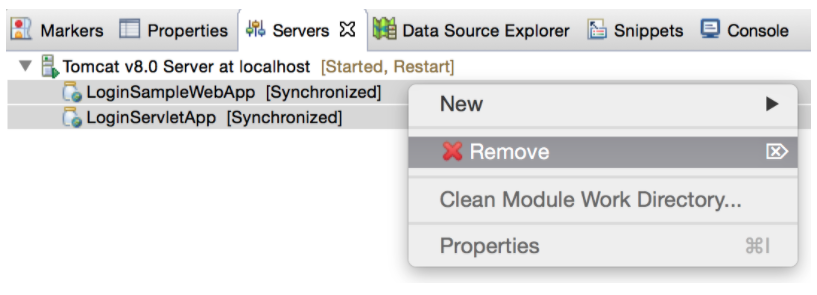

Figura 2.23 Desinstalar una aplicación web del servidor

Luego, haga clic derecho en el proyecto en el Project Explorer y seleccione Export | WAR file. Seleccione el destino para el archivo WAR:

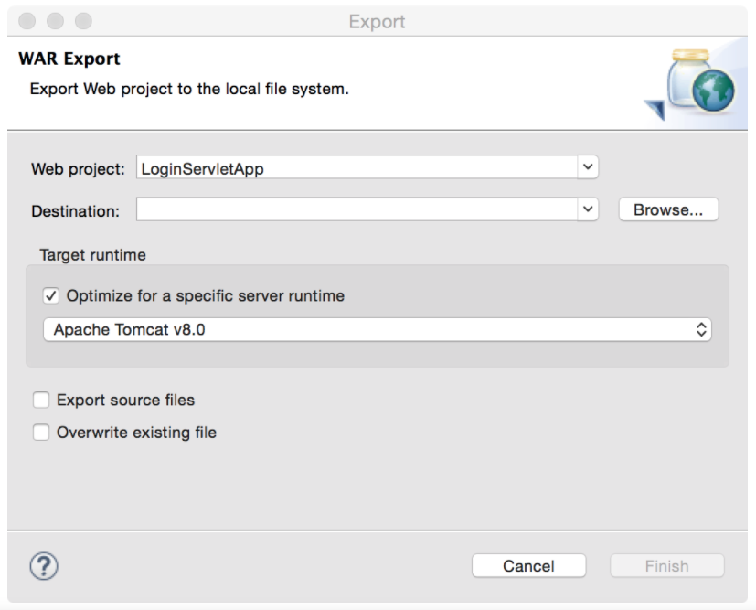

Figura 2.24 WAR de exportación

Para implementar el archivo WAR en Tomcat, cópielo en la carpeta `<tomcat_home>/webapps`. Luego, inicie el servidor si aún no se está ejecutando. Si Tomcat ya se está ejecutando, no necesita reiniciarlo.

Tomcat monitorea la carpeta `webapps` y cualquier archivo WAR copiado se implementa automáticamente. Puede verificar esto abriendo la URL de su aplicación en el navegador, por ejemplo http://localhost:8080/LoginServletApp/login,.

# JavaServer Faces

Cuando trabajamos con JSP, vimos que no es una buena idea mezclar scriptlets con el marcado HTML. Resolvimos este problema usando JavaBean. JavaServer Faces lleva este diseño más allá. Además de admitir JavaBeans, JSF proporciona etiquetas integradas para controles de usuario HTML, que son conscientes del contexto, pueden realizar la validación y pueden preservar el estado entre las solicitudes. Ahora crearemos la aplicación de inicio de sesión utilizando JSF:

1. Cree una aplicación web dinámica en Eclipse; Vamos a nombrarla `LoginJSFApp`. En la última página del asistente, asegúrese de marcar la casilla Generate web.xml deployment descriptor.

2. Descargue las bibliotecas JSF de https://maven.java.net/content/repositories/releases/org/glassfish/javax.faces/2.2.9/javax.faces-2.2.9.jar y cópielas en la carpeta `WEB-INF/lib` de su proyecto.

3. JSF sigue el patrón MVC. En el patrón MVC, el código para generar la interfaz de usuario (vista) está separado del contenedor de los datos (modelo). El controlador actúa como la interfaz entre la vista y el modelo. Selecciona el modelo para procesar una solicitud en función de la configuración, y una vez que el modelo procesa la solicitud, selecciona la vista que se generará y devolverá al cliente, en función del resultado del procesamiento en el modelo. La ventaja de MVC es que existe una clara separación de la interfaz de usuario y la lógica de negocios (que requiere un conjunto diferente de experiencia) para que puedan desarrollarse de forma independiente, en gran medida. En JSP, la implementación de MVC es opcional, pero JSF aplica el diseño de MVC.

Las vistas son JSF creadas como archivos `xhtml`. El controlador es un servlet de la biblioteca JSF y los modelos son **managed beans** (JavaBeans)

Primero configuraremos un controlador para JSF. Agregaremos la configuración del servlet y la asignación en `web.xml`. Abra `web.xml` desde la carpeta `WEB-INF` del proyecto (`web.xml` debería haber sido creado para usted por el asistente del proyecto si marcó la casilla  Generate web.xml deployment descriptor; 

1). Agregue el siguiente fragmento de XML antes </web-app>:

```html
<servlet> 
  <servlet-name>JSFServlet</servlet-name> 
  <servlet-class>javax.faces.webapp.FacesServlet</servlet-class> 
  <load-on-startup>1</load-on-startup> 
</servlet> 
 
<servlet-mapping> 
  <servlet-name>JSFServlet</servlet-name> 
  <url-pattern>*.xhtml</url-pattern> 
</servlet-mapping> 
```

Tenga en cuenta que usted puede conseguir el asistente de código al crear los elementos anteriores pulsando *Ctrl/Cmd + C*.

Puede especificar cualquier nombre como `servlet-name`; solo asegúrate de usar el mismo nombre `servlet-mapping`. La clase para el servlet es `javax.faces.webapp.FacesServlet`, que está en el archivo JAR que descargamos como la biblioteca JSF y copiamos en `WEB-INF/lib`. Además, hemos asignado cualquier solicitud que termine con `.xhtml` a este servlet.

A continuación, crearemos un bean administrado para nuestra página de inicio de sesión. Esto es lo mismo que JavaBean que habíamos creado anteriormente, pero con la adición de anotaciones específicas de JSF:

1. Haga clic derecho en la carpeta `src` en `Java Resources` del proyecto en Project Explorer .
2. Seleccione el New | Class menu option.
3. Cree JavaBean, `LoginBean` como se describe en la sección Uso de JavaBeans en JSP de este capítulo.
4. Crea dos miembros para `userName` y `password`.
5. Crea los getters y setters para ellos. Luego, agregue dos anotaciones de la siguiente manera:

```java
package packt.book.jee_eclipse.bean; 
import javax.faces.bean.ManagedBean; 
import javax.faces.bean.RequestScoped; 
 
@ManagedBean(name="loginBean") 
@RequestScoped 
public class LoginBean { 
  private String userName; 
  private String password; 
  public String getUserName() { 
    return userName; 
  } 
  public void setUserName(String userName) { 
    this.userName = userName; 
  } 
  public String getPassword() { 
    return password; 
  } 
  public void setPassword(String password) { 
    this.password = password; 
  } 
}
```

(También puede obtener asistencia de código para las anotaciones. Escriba `@` y presione *Ctrl/Cmd + C.*. La asistencia de código también funciona para los pares de atributos `key-value` por ejemplo, para el atributo `name` de la anotación `ManagedBean`).

6. Cree un nuevo archivo llamado `index.xhtml` dentro de la carpeta `WebContent` del proyecto seleccionando File | New | File menu option. Cuando use JSF, debe agregar algunas declaraciones de espacio de nombres en la parte superior del archivo:

```html
<html xmlns="http://www.w3.org/1999/xhtml" 
  xmlns:f="http://java.sun.com/jsf/core" 
  xmlns:h="http://java.sun.com/jsf/html"> 
```

Aquí, estamos declarando namespaces para las `tag` bibliotecas integradas de JSF . Accederemos a las etiquetas en la `tag` biblioteca JSF principal con el prefijo `f` y las etiquetas HTML con el prefijo `h`.

7. Agregue el título y comience la etiqueta `body`:

```html
<head> 
<title>Login</title> 
</head> 
<body> 
  <h2>Login</h2> 
```

Hay etiquetas JSF correspondientes para el `head` y el `body`, pero no utilizamos ningún atributo específico de JSF; por lo tanto, hemos usado etiquetas HTML simples.

8. Luego agregamos el código para mostrar el mensaje de error, si no es nulo:

   ```html
   <h:outputText value="#{loginBean.errorMsg}" 
              rendered="#{loginBean.errorMsg != null}" 
              style="color:red;"/> 
   ```

   Aquí, usamos una etiqueta específica para JSF y expression language para mostrar el valor del mensaje de error. La etiqueta `OutputText` es similar a la etiqueta que vimos en JSTL. También hemos agregado una condición para representarlo solo si el mensaje de error en el managed bean no es `null`. Además, hemos establecido el color de este texto de salida. 

9. Todavía no hemos agregado el miembro `errorMsg` al managed bean. Por lo tanto, agreguemos la declaración, el getter y el  setter. Abra la clase `LoginBean` y agregue el siguiente código:

```java
private String errorMsg; 
public String getErrorMsg() { 
  return errorMsg; 
} 
public void setErrorMsg(String errorMsg) { 
  this.errorMsg = errorMsg; 
} 
```

Tenga en cuenta que accedemos al managed bean en JSF utilizando el valor del atributo `name` de la anotación `ManagedBean`. Además, a diferencia de JavaBean en JSP, no lo creamos utilizando la etiqueta `<jsp:useBean>`. El tiempo de ejecución JSF crea el bean si aún no está en el ámbito requerido, en este caso, el ámbito(scope) `Request`.

10. Volvamos a la edición `index.xhtml`. Ahora agregaremos el siguiente formulario:

```html
<h:form> 
  User Name: <h:inputText id="userName" 
                value="#{loginBean.userName}"/><br/> 
  Password: <h:inputSecret id="password" 
                value="#{loginBean.password}"/><br/> 
  <h:commandButton value="Submit" 
   action="#{loginBean.validate}"/> 
</h:form> 
```

Muchas cosas están sucediendo aquí. Primero, hemos usado la etiqueta `inputText` de JSF para crear cuadros de texto para username y password.. Hemos establecido sus valores con los miembros correspondientes de `loginBean`. Hemos utilizado la  etiqueta `commandButton` de JSF para crear un  botón Submit . Cuando el usuario hace clic en el  botón Submit, lo hemos configurado para que llame al método `loginBean.validate` (usando el atributo `action`).

11. No hemos definido un método `validate` en `loginBean`, así que agreguemos eso. Abra la clase `LoginBean` y agregue el siguiente código:

```java
public String validate() 
{ 
  if ("admin".equals(userName) && "admin".equals(password)) { 
    errorMsg = null; 
    return "welcome"; 
  } else { 
    errorMsg = "Invalid user id or password. Please try 
     again"; 
    return null; 
  } 
}
```

Tenga en cuenta que el método `validate` devuelve una cadena. ¿Cómo se usa el valor de retorno? Se utiliza para fines de navegación en JSF. El tiempo de ejecución JSF busca el archivo JSF con el mismo nombre que el valor de cadena devuelto después de evaluar la expresión en el atributo `action` de `commandButton`. En el método `validate`, devolvemos `welcome` si las credenciales de usuario son válidas. En este caso, le estamos diciendo al tiempo de ejecución JSF que navegue a `welcome.xhtml`. Si las credenciales no son válidas, configuramos el mensaje de error y lo devolvemos `null`, en cuyo caso, el tiempo de ejecución de JSF muestra la misma página.

Ahora agregaremos la página `welcome.xhml`. Simplemente contiene el mensaje de bienvenida:

```html
<html xmlns="http://www.w3.org/1999/xhtml" 
      xmlns:f="http://java.sun.com/jsf/core" 
      xmlns:h="http://java.sun.com/jsf/html"> 
  <body> 
    <h2>Welcome admin !</h2> 
      You are successfully logged in 
  </body> 
</html> 
```

Aquí está el código fuente completo de `index.html`:

```html
<html xmlns="http://www.w3.org/1999/xhtml" 
  xmlns:f="http://java.sun.com/jsf/core" 
  xmlns:h="http://java.sun.com/jsf/html"> 
 
  <head> 
    <title>Login</title> 
  </head> 
  <body> 
  <h2>Login</h2> 
  <h:outputText value="#{loginBean.errorMsg}" 
  rendered="#{loginBean.errorMsg != null}" 
  style="color:red;"/> 
  <h:form> 
    User Name: <h:inputText id="userName" 
     value="#{loginBean.userName}"/><br/>    Password: <h:inputSecret id="password" 
     value="#{loginBean.password}"/><br/> 
  <h:commandButton value="Submit" action="#{loginBean.validate}"/> 
  </h:form> 
</body> 
</html>
```

Aquí está el código fuente de la clase `LoginBean`:

```java
package packt.book.jee_eclipse.bean; 
import javax.faces.bean.ManagedBean; 
import javax.faces.bean.RequestScoped; 
 
@ManagedBean(name="loginBean") 
@RequestScoped 
public class LoginBean { 
  private String userName; 
  private String password; 
  private String errorMsg; 
  public String getUserName() { 
    return userName; 
  } 
  public void setUserName(String userName) { 
    this.userName = userName; 
  } 
  public String getPassword() { 
    return password; 
  } 
  public void setPassword(String password) { 
    this.password = password; 
  } 
  public String getErrorMsg() { 
    return errorMsg; 
  } 
  public void setErrorMsg(String errorMsg) { 
    this.errorMsg = errorMsg; 
  } 
  public String validate() 
  { 
    if ("admin".equals(userName) && "admin".equals(password)) { 
      errorMsg = null; 
      return "welcome"; 
    } 
    else { 
      errorMsg = "Invalid user id or password. Please try again"; 
      return null; 
    } 
  } 
} 
```

Para ejecutar la aplicación, haga clic con el botón derecho en `index.xhtml` Project Explorer and select the Run As | Run on Server option.

JSF puede hacer mucho más de lo que hemos visto en este pequeño ejemplo: tiene el soporte para validar una entrada y crear plantillas de página también. Sin embargo, estos temas están más allá del alcance de este libro.


Visite http://docs.oracle.com/cd/E11035_01/workshop102/webapplications/jsf/jsf-app-tutorial/Introduction.html para un tutorial de JSF.

# Using Maven for project management

En los proyectos que hemos creado hasta ahora en este capítulo, hemos gestionado muchas tareas de gestión de proyectos, como descargar bibliotecas de las que depende nuestro proyecto, agregarlas a la carpeta correspondiente para que la aplicación web pueda encontrarlo y exportar el proyecto para crear el archivo WAR para su implementación. Estas son solo algunas de las tareas de gestión de proyectos que hemos realizado hasta ahora, pero hay muchas más, que veremos en los capítulos siguientes. Es útil que una herramienta realice muchas de las tareas de gestión de proyectos para que podamos centrarnos en el desarrollo de aplicaciones. Hay algunas herramientas de gestión de compilación conocidas disponibles para Java, por ejemplo, Apache Ant ( http://ant.apache.org/ ) y Maven ( http://maven.apache.org/ ).

En esta sección, veremos cómo usar Maven como herramienta de gestión de proyectos. Al seguir la convención para crear la estructura del proyecto y permitir que los proyectos definan la jerarquía, Maven hace que la gestión de proyectos sea más fácil que Ant. Ant es principalmente una herramienta de compilación, mientras que Maven es una herramienta de gestión de proyectos, que también gestiona la compilación. Consulte http://maven.apache.org/what-is-maven.html para comprender lo que Maven puede hacer.

En particular, Maven simplifica la gestión de dependencias. En el proyecto JSF anterior en este capítulo, primero descargamos los archivos `.jar` apropiados para JSF y los copiamos a la carpeta `lib`. Maven puede automatizar esto. Puede configurar los ajustes de Maven en `pom.xml`. **POM** son las siglas de **Project Object Model**.

Antes de usar Maven, es importante entender cómo funciona. Maven usa repositorios. Los repositorios contienen complementos para muchas librerias/proyectos conocidos. Un complemento incluye la información de configuración del proyecto, los archivos `.jar` necesarios para usar este proyecto en su propio proyecto y cualquier otro artefacto de soporte. El repositorio predeterminado de Maven es una colección de complementos. Puede encontrar la lista de complementos en el repositorio predeterminado de Maven en http://maven.apache.org/plugins/index.html . También puede navegar por el contenido del repositorio de Maven en http://search.maven.org/#browse. Maven también mantiene un repositorio local en su máquina. Este repositorio local contiene solo aquellos complementos de los que sus proyectos tienen dependencias específicas. En Windows, encontrará el repositorio local en `C:/Users /<username>.m2`, y en macOS X, se encuentra en `~/.m2`.

Usted define complementos de los que depende su proyecto en la sección `dependencies` de `pom.xml` (veremos la estructura en `pom.xml` breve cuando creamos un proyecto Maven). Por ejemplo, podemos especificar una dependencia en JSF. Cuando ejecuta la herramienta Maven, primero inspecciona todas las dependencias en `pom.xml`. Luego verifica si los complementos dependientes con las versiones requeridas ya están descargados en el repositorio local. Si no, los descarga del repositorio central (remoto). También puede especificar repositorios para buscar. Si no especifica ningún repositorio, las dependencias se buscan en el repositorio central de Maven.

Crearemos un proyecto Maven y exploraremos `pom.xml` con más detalle. Sin embargo, si tiene curiosidad por saber qué es `pom.xml`, visite http://maven.apache.org/pom.html#What_is_the_POM .

La versión Eclipse JEE tiene Maven incorporado, por lo que no necesita descargarlo. Sin embargo, si planea usar Maven desde fuera de Eclipse, descárguelo de http://maven.apache.org/download.cgi . 

## Maven views and preferences in Eclipse JEE

Antes de crear un proyecto Maven, exploremos las vistas y preferencias específicas de Maven en Eclipse:

1. Seleccione la Window | Show View | Other... menu.

2. Escriba `Maven` en el cuadro de filtro. Verá dos vistas para Maven :

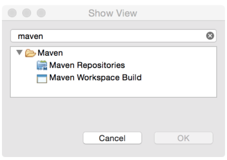

Figura 2.25: Vistas de Maven

3. Seleccione Maven Repositories view y haga clic en OK. Esta vista se abre en la ventana de la pestaña inferior de Eclipse. Puede ver la ubicación de los repositorios locales y remotos.

4. Haga clic derecho en un repositorio global para ver las opciones para indexar el repositorio:

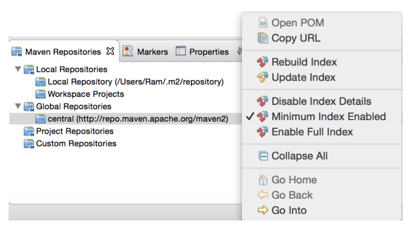

Figura 2.26: La vista de repositorios Maven

5. Abra Preferencias de Eclipse y escriba `Maven` en el cuadro de filtro para ver todas las preferencias de Maven:

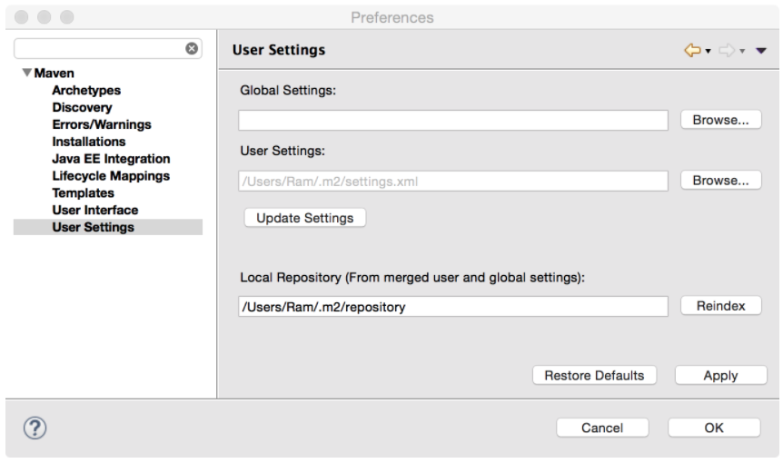

Figura 2.27: Preferencias de Maven

Debe configurar las preferencias de Maven para actualizar los índices del repositorio al inicio, de modo que las últimas libraries estén disponibles cuando agregue dependencias a su proyecto (en breve aprenderemos cómo agregar dependencias).

6. Haga clic en el nodo Maven en Preferencias y configure las siguientes opciones:

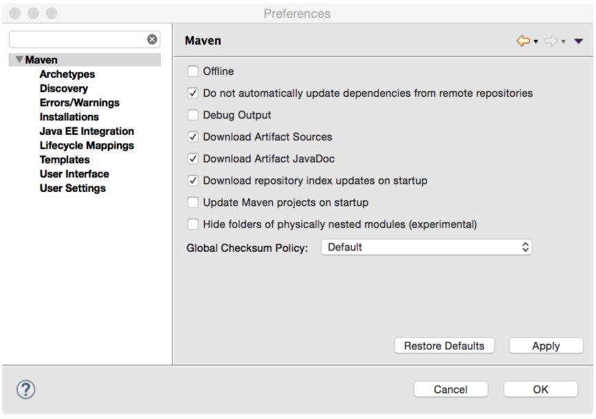

Figura 2.28: Preferencias de Maven para actualizar índices al inicio

CopiarAgregar resaltadoAñadir la nota

## Creating a Maven project

En los siguientes pasos, veremos cómo crear un proyecto Maven en Eclipse:

Seleccione New | Maven Project menu:


Figura 2.29: Maven New Project wizard

Acepte todas las opciones predeterminadas y haga clic en Next . Escriba `webapp` en el cuadro de filtro y seleccione maven-archetype-webapp :

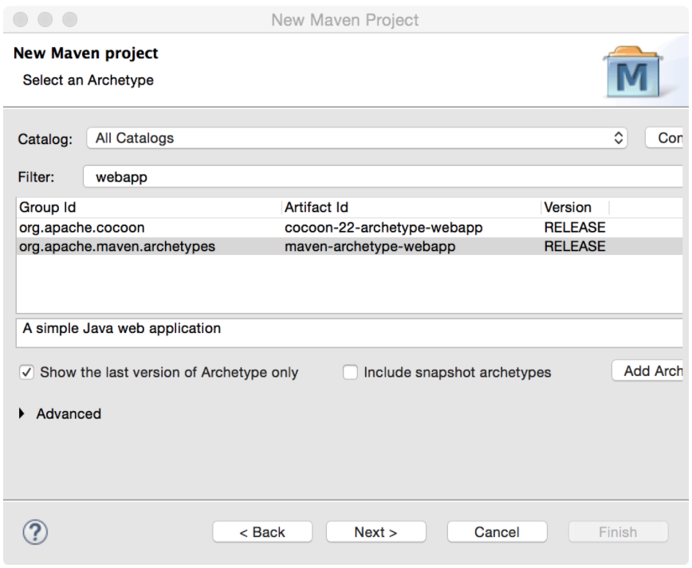

Figura 2.30: New Maven project - select archetype

### Maven archetype

Seleccionamos maven-archetype-webapp en el asistente anterior. Un arquetipo es una plantilla de proyecto. Cuando utiliza un arquetipo para su proyecto, todas las dependencias y otras configuraciones de proyecto de Maven definidas en la plantilla (arquetipo) se importan a su proyecto.

*Consulte más información sobre el arquetipo de Maven en http://maven.apache.org/guides/introduction/introduction-to-archetypes.html*.


1. Continuando con el asistente New Maven Project , haga clic en Next. En el campo Group Id, ingrese `packt.book.jee_eclipse`. En el campo Artifact Id, ingrese `maven_jsf_web_app`:

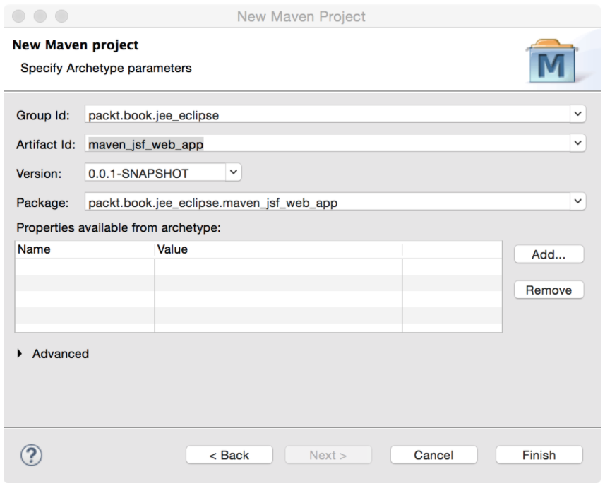

Figura 2.31: Nuevo proyecto Maven - parámetros de arquetipo

Haz clic en Finish. Se agrega un  proyecto `maven_jsf_web_app` en Project Explorer .

## Exploring the POM

Abra `pom.xml` en el editor y vaya a la pestaña `pom.xml`. El archivo debe tener el siguiente contenido:

```html
<project xmlns = "http://maven.apache.org/POM/4.0.0" xmlns: xsi = "http://www.w3.org/2001/XMLSchema-instance" 
  xsi: schemaLocation = "http://maven.apache.org/POM/4.0.0 
   http://maven.apache.org/maven-v4_0_0.xsd">
  <modelVersion> 4.0.0 </modelVersion> 
  <groupId> packt.book.jee_eclipse </groupId> 
  <artifactId> maven_jsf_web_app </artifactId> 
  <packaging> guerra </packaging> 
  <version> 0.0.1-SNAPSHOT </version> 
  <name> maven_jsf_web_app Maven Webapp </name> 
  <url> http://maven.apache.org </url> 
  <dependencias> 
    <dependencia> 
      <groupId> junit </groupId> 
      <artifactId> junit </artifactId> 
      <version> 3.8.1 </version> 
      <scope> prueba </scope> 
    </dependency> 
  </dependencies> 
  <construcción> 
    <finalName> maven_jsf_web_app </finalName> 
  </build> 
</project> 
```

Echemos un vistazo a las diferentes etiquetas en detalle, que se utilizan en el fragmento de código anterior:

* `modelVersion`: Esta en el archivo `pom.xml` es la versión de Maven.
* `groupId`: Esta es la ID común utilizada en la unidad de negocio u organización bajo la cual se agrupan los proyectos. Aunque no es necesario usar el formato de estructura de paquete para la ID de grupo, generalmente se usa.
* `artifactId`: Este es el nombre del proyecto.
* `version`: Este es el número de versión del proyecto. Los números de versión son importantes al especificar dependencias. Puede tener múltiples versiones de un proyecto, y puede especificar diferentes dependencias de versión en diferentes proyectos. Maven también agrega el número de versión a los archivos JAR, WAR o EAR que crea para el proyecto.
* `packaging`: Esto le dice a Maven qué tipo de resultado final queremos cuando se construye el proyecto. En este libro, utilizaremos los tipos de empaque JAR, WAR y EAR, aunque existen más tipos.
* `name`: Este es realmente el nombre del proyecto, pero Eclipse se muestra artifactidcomo el nombre del proyecto en Project Explorer .
* `url`: Esta es la URL de su proyecto si aloja la información del proyecto en la web. El valor predeterminado es la URL de Maven.
* `dependencies`: Esta sección es donde especificamos las bibliotecas (u otros artefactos de Maven) de las que depende el proyecto. El arquetipo que seleccionamos para este proyecto ha agregado la dependencia predeterminada de JUnit a nuestro proyecto. Aprenderemos más sobre JUnit en el Capítulo 5 , Pruebas unitarias .
* `finalName`: Esta etiqueta en la  buildetiqueta indica el nombre del archivo de salida (JAR, WAR o EAR) que Maven genera para su proyecto.

## Adding Maven dependencies

## Maven project structure

## Creating a WAR file using Maven

# Summary
