# 3. Source Control Management in Eclipse

* The Eclipse subversion plugin

   * Installing the Eclipse Subversion plugin

   * Adding projects to an SVN repository

   * Committing changes to an SVN repository

   * Synchronizing with an SVN repository

   * Checking out a project from SVN

* Eclipse Git plugin

   * Adding a project to Git

   * Committing files in the Git repository

   * Viewing file differences after modifications

   * Creating a new branch

   * Committing a project to a remote repository

   * Pulling changes from a remote repository

   * Cloning a remote repository

* Summary

# Source Control Management in Eclipse

En el capítulo anterior, aprendimos cómo crear aplicaciones web simples usando JSP, JSF y servlets. También aprendimos cómo usar Maven para la compilación y la gestión de proyectos.

En este capítulo, aprenderemos cómo integrar Eclipse con SVN y Git. El capítulo cubre los siguientes temas:

* Instalación de complementos de Eclipse para SVN y Git
* Realización de tareas de control de origen, como extraer archivos, confirmar cambios, etc. desde Eclipse
* Sincronizar proyectos con repositorios remotos

**Source Control Management ( SCM )** es una parte esencial del desarrollo de software. Al utilizar las herramientas SCM, se asegura de tener acceso a las versiones de su código en hitos importantes. SCM también ayuda a administrar el código fuente cuando está trabajando en un equipo, al proporcionarle herramientas para asegurarse de no sobrescribir el trabajo realizado por otros. Ya sea que su proyecto sea pequeño o grande, ya sea que trabaje solo o en un equipo grande, usar SCM lo beneficiaría.

Eclipse ha tenido soporte para integrar varias herramientas SCM durante mucho tiempo; esto incluye soporte para CVS, Microsoft SourceSafe, Perforce y **Subversion ( SVN )**. Las versiones recientes de Eclipse también tienen soporte incorporado para Git. 

Comenzaremos aprendiendo cómo usar SVN de Eclipse.

# The Eclipse subversion plugin

En esta sección, aprenderemos cómo instalar y usar el complemento SVN Eclipse. Crearemos un pequeño proyecto y veremos cómo registrar un proyecto en SVN desde Eclipse. También veremos cómo sincronizar con el repositorio SVN existente.

Necesitará acceso a un repositorio SVN para seguir los pasos de este capítulo. Si no tiene acceso a un repositorio SVN, puede elegir entre algunas de las ofertas gratuitas de SVN en línea. Este libro no promueve ni sugiere el uso de ningún alojamiento SVN en línea en particular, pero con el propósito de explicar las características del complemento SVN Eclipse, el autor ha utilizado https://riouxsvn.com . Sin embargo, el complemento funcionaría de la misma manera con cualquier servidor SVN.

## Installing the Eclipse Subversion plugin

1. Abra Eclipse Marketplace seleccionando Help | Eclipse Marketplace menu. Buscar por `subversion`:


Figura 3.1: Instalación del complemento Subversion

2. Instala el complemento. Antes de configurar un repositorio SVN en Eclipse, necesitamos seleccionar / instalar un conector SVN . Vaya a Preferencias de Eclipse y escriba `svn` en el cuadro de filtro. Luego, vaya a la pestaña Conector SVN :


Figura 3.2: Preferencias del conector SVN

Si no hay instalados conectores, verá un  botón Obtener conectores ... Clic en el botón.

3. Eclipse muestra una serie de conectores disponibles. Vamos a elegir la  SVN Kit  conector e instalarlo (haga clic en el  Finalizar  botón):


Figura 3.3: El asistente de descubrimiento del conector SVN

4. Ahora configuraremos un repositorio SVN existente en Eclipse. Seleccione Window | Open Perspective | Other menu y luego seleccione la perspectiva SVN Repository Exploring:


Figura 3.4: Perspectiva SVN abierta

## Adding projects to an SVN repository

Realice los siguientes pasos para agregar proyectos a un repositorio SVN:

1. Haga clic con el botón derecho en la vista SVN Repositories y seleccione New | Repository Location.
2. Ingrese la URL de su repositorio SVN, su username y password. Si necesita establecer información SSH o SSL para conectarse a su repositorio SVN, haga clic en la pestaña correspondiente e ingrese la información. Haga clic en Finish para agregar el repositorio a Eclipse:


Figura 3.5: Configuración de un repositorio SVN

1. Ahora creemos un proyecto Java simple que verifiquemos en el repositorio SVN. En este capítulo, no es importante qué código escriba en el proyecto; vamos a usar el proyecto solo para comprender cómo registrar los archivos del proyecto en SVN y luego ver cómo sincronizar el proyecto.

Cree un proyecto Java simple como se muestra en la siguiente captura de pantalla:


Figura 3.6: Un proyecto de muestra para pruebas SVN

2. El proyecto tiene un archivo source. Ahora revisaremos este proyecto en SVN. Haga clic derecho en el proyecto y seleccione  Team | Share Project.... .
3. Seleccione  SVN  y haga clic en el  botón Next. El asistente le ofrece opciones para crear un nuevo repositorio SVN o seleccionar un repositorio SVN ya configurado:


Figura 3.7: Compartir proyecto con el repositorio SVN

4. Vamos a utilizar el repositorio ya configurado. Entonces, seleccione el repositorio:


Figura 3.8: Seleccionar un repositorio SVN o crear uno nuevo

5. Podemos hacer clic en Next y configurar la opción avanzada, pero mantendremos la configuración simple y haremos clic en Finish. Se le pedirá que verifique los archivos existentes en el proyecto:


Figura 3.9: Compartir proyecto con el repositorio SVN

6. Seleccione los archivos que desea registrar e ingrese los comentarios de registro. Luego haga clic en OK . Para ver los archivos registrados en el repositorio SVN, cambie a la perspectiva SVN Repository Exploring y luego a la  vista SVN Repositories:


Figura 3.10: Archivos registrados en la vista Repositorios SVN

## Committing changes to an SVN repository

Ahora modifiquemos un archivo y verifiquemos los cambios. Vuelva a la perspectiva de Java y ábralo `SVNTestApplication.java` desde Package Explorer o Navigator . Modifique el archivo y guarde los cambios. Para comparar los archivos o las carpetas en su directorio de trabajo con los del repositorio, haga clic derecho en `file/folder/project` en Navigator y seleccione Compare With | Latest from Repository.

Ahora que hemos modificado `SVNTestApplication.java`, veamos cómo difiere del que está en el repositorio:


Figura 3.11: Comparación de archivos SVN

Agreguemos un nuevo archivo ahora, digamos `readme.txt`, en la raíz del proyecto. Para agregar el archivo al repositorio, haga clic derecho en el archivo y seleccione Team | Add to Version Control...:


Figura 3.12: Agregar archivos a un repositorio SVN

## Synchronizing with an SVN repository

Para sincronizar su proyecto local con el repositorio remoto, haga clic derecho en el proyecto y seleccione Team | Synchronize with Repository. Esto actualizará el proyecto con archivos en el repositorio remoto, mostrará los archivos que son nuevos en la carpeta local y también mostrará los archivos modificados:

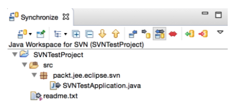

Figura 3.13: La Synchronize view

Puede filtrar la lista como modo entrante (cambios desde el repositorio remoto), modo saliente (cambios en su directorio de trabajo) o ambos. Como puede ver en la *Figura 3.13*, tenemos dos archivos que se cambian en el directorio de trabajo; uno modificado y uno nuevo. Para confirmar los cambios, haga clic en el proyecto y seleccione Commit ... . Si desea confirmar desde Navigator o Package Explorer , haga clic con el botón derecho en el proyecto y seleccione Team | Commit.... Ingrese el comentario de registro y haga clic en OK. Para actualizar el proyecto (recibir todos los cambios desde el repositorio remoto), haga clic derecho en el proyecto y seleccione Equipo | Actualizar.

Para ver el historial de revisiones del archivo o carpeta, haga clic con el botón derecho en Navigator o Package Explorer  y seleccione Team | Show History:


Figura 3.14: Historial de revisión de archivos SVN

## Checking out a project from SVN

Es fácil retirar proyectos de un repositorio SVN a un nuevo espacio de trabajo. En la vista SVN Repositories, haga clic en el proyecto que desea retirar y seleccione la opción Check Out:

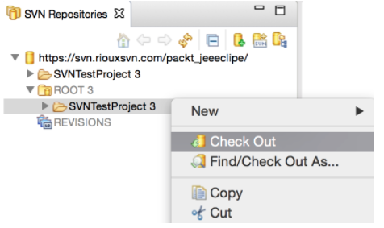

Figura 3.15: Historial de revisión de archivos SVN

Esta opción desprotege el proyecto en el espacio de trabajo actual. También puede usar la opción Import project para ver el proyecto desde SVN. Seleccione el File | Import de menú option y luego seleccione la  opción SVN | Project from SVN.

Hay muchas otras características de SVN que puede usar desde Eclipse. Consulte  http://www.eclipse.org/subversive/documentation.php .

# Eclipse Git plugin

Las versiones recientes de Eclipse están preinstaladas con el Eclipse **Git plugin (EGit)**. Si no, puede instalar el plugin desde Eclipse Marketplace . Seleccione la opción Help | Eclipse Marketplace... y escriba `egit` en el Find textbox:

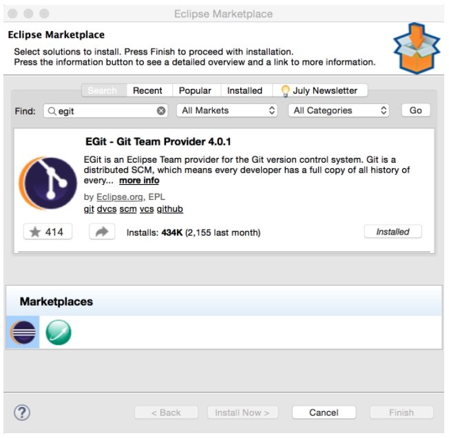

Figura 3.16: Búsqueda del complemento EGit en Eclipse Marketplace

Si el plugin ya está instalado, se marcará como Installed.

## Adding a project to Git

Git es un repositorio distribuido. A diferencia de algunos de los otros sistemas de administración de fuentes, Git también mantiene el repositorio local completo. Por lo tanto, puede realizar actividades como el check-out y el check-in en el repositorio local sin conectarse a ningún repositorio remoto. Cuando esté listo para mover su código a un repositorio remoto, puede conectarse a él y enviar sus archivos al repositorio remoto.


*Si es nuevo en Git, eche un vistazo a la siguiente documentación y tutorial:
https://git-scm.com/doc y  https://www.atlassian.com/git/tutorials/.*

Para aprender a agregar un proyecto a Git, creemos un proyecto Java simple en el espacio de trabajo. Nuevamente, como en la sección anterior, qué código escribes en este proyecto no es importante por ahora:

1. Crea una clase Java en el proyecto.
2. Para agregar este proyecto a Git, haga clic derecho en el proyecto en Package Explorer o Navigator y seleccione Team | Share Project...:

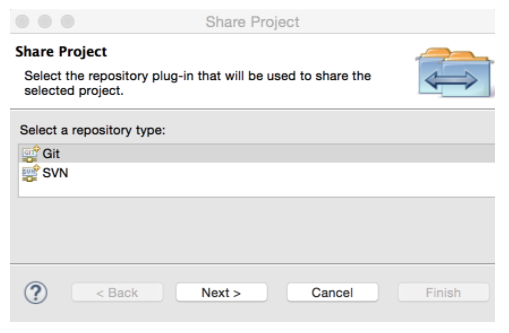

Figura 3.17: Compartir un proyecto de Eclipse con Git

3. Seleccione Git y haga clic en Next. Marque la casilla Use or create repository in parent folder of project.
4. Seleccione el proyecto (marque la casilla para el project) y haga clic en el botón Create Repository. Luego haga clic en  Finish:

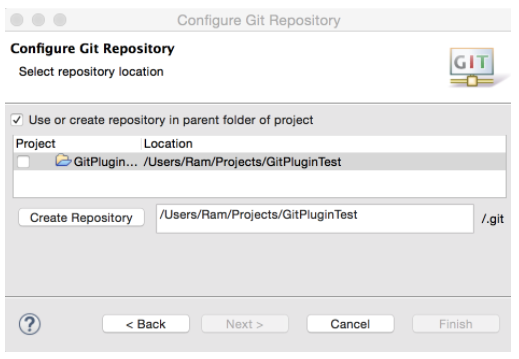

Figura 3.18: Crear un repositorio Git para un proyecto

5. Esto crea un nuevo repositorio Git en la carpeta del proyecto. Cambie a la perspectiva Git (o abra la  vista Repositorios Git desde la opción Window | Show View | Other) y debería ver el proyecto listado en la  vista Repositorios Git (vea la siguiente captura de pantalla):

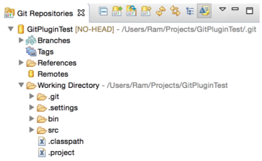

Figura 3.19: Vista de repositorios Git

## Committing files in the Git repository

En Git, los archivos nuevos o modificados se preparan para la confirmación. Para ver los archivos organizados, haga clic en la  pestaña Git Staging en la perspectiva de Git :

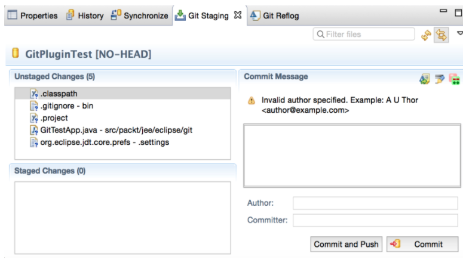

Figura 3.20: La vista Git Staging

Si no desea agregar un archivo al repositorio de Git, haga clic con el botón derecho en ese archivo (o selección de varios archivos) y seleccione la  opción Ignore. Antes de enviar(commit) archivos a Git, debe mover Unstaged Changes a Staged Changes. Vamos a agregar todos los archivos a Git. Así que selecciona todos los archivos de la vista Unstaged Changes y arrastrar y soltarlos en la vista Staged Changes. También se recomienda establecer el nombre del autor y el committer . Suele estar en formato `Name <email>`. Para configurar esta opción a nivel global en Eclipse (para que no tenga que configurar estos campos en cada confirmación), vaya a Eclipse Preferences y busque `Git`. Entonces ve a la página Team | Git | Configuration  y haga clic en el Add Entry... button:

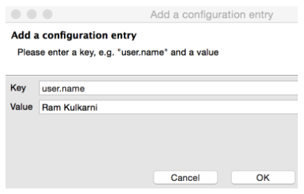

Figura 3.21: Agregar una entrada de configuración de Git

Del mismo modo, agregue la entrada `user.email`:

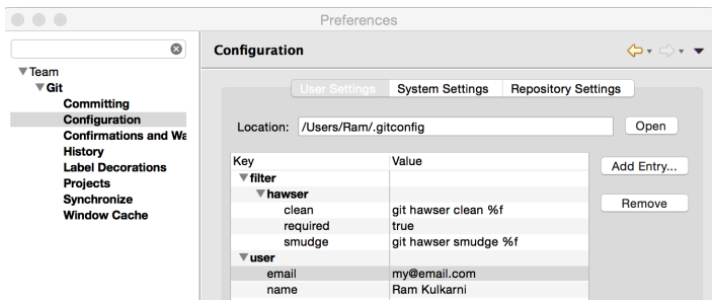

Figura 3.22: Configuraciones de Git en Preferencias

Volviendo a la vista Git Staging, introducir Author, Committer, and Commit Message. Luego haga clic en el botón Commit.

## Viewing file differences after modifications

Modifiquemos la única clase Java creada en el proyecto anterior. Si va a la  vista Git Staging después de realizar cambios en el archivo, verá que el archivo aparece en la lista Unstaged Changes. Para ver qué cambios se han realizado en el archivo desde la última confirmación (commit), haga doble clic en el archivo en la vista Git Staging .

Para confirmar estos cambios, muévalo a la vista Staged Changes, ingrese Commit Message, y haga clic en el botón Commit. También puede ver las diferencias de archivo haciendo clic en el archivo en el Package Explorer y seleccionando Compare With | Head Revision:


Figura 3.23: Ver una diferencia de archivo

Para ver el historial de cambios en el proyecto o archivo(s)/carpeta(s), haga clic derecho y seleccione Team | Shown in History:

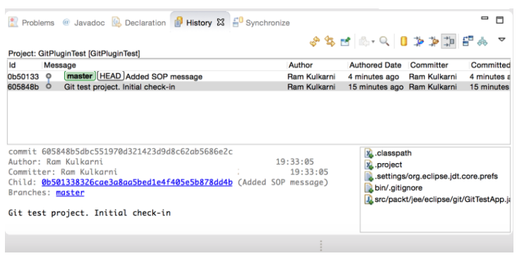

Figura 3.24: Vista del historial de Git

## Creating a new branch

Es típico cuando usa la administración de control de código fuente para crear ramas separadas para funciones o incluso para la corrección de errores. La idea es que la rama principal o la rama maestra siempre deben tener el código de trabajo y usted debe desarrollar en las ramas que pueden no ser estables. Cuando finaliza una función o corrige un error y sabe que la rama es estable, combina el código de esa rama con la rama maestra.

Para crear una nueva rama, vaya a la vista Git Repositories y haga clic derecho en el repositorio que desea bifurcar(branch). Luego seleccione la opción Switch To | New Branch...:


Figura 3.25: Crear una nueva branch

Tenga en cuenta que la casilla Checkout new branch debe estar marcada. Debido a esta opción, la nueva rama se convierte en la rama activa una vez que se crea. Cualquier cambio que confirme estará en esta rama y la rama maestra no se verá afectada. Haga clic en Finish  para crear la rama.

Hagamos algunos cambios en el código, digamos en el método `main` de la clase `GitTestApp`:

```java
public class GitTestApp { 
 
  public static void main(String[] args) { 
    System.out.println("Hello Git, from branch bug#1234 !!"); 
  } 
} 
```

Commit los cambios anteriores en la nueva rama.

Ahora veamos la rama maestra(master branch). Haga clic con el botón derecho en el repositorio en la  vista Git Repositories y seleccione Switch To | master. Abra el archivo que modificó en la nueva rama. Observará que los cambios que realizó en el archivo no están presentes. Como se mencionó anteriormente, los cambios que realice en las ramas no se comprometen con la rama maestra. Debe fusionar explícitamente los cambios.

Para fusionar(merge) los cambios de la rama bug#1234 a la master branch, haga clic con el botón derecho en el repositorio en la  vista Git Repositories y seleccione Merge...:


Figura 3.26: Merge Git braches

Seleccione branch bug#1234. Esta rama se fusionará en la rama maestra. Haz clic en Merge . Git mostrará un resumen de la fusión(merge). Haga clic en OK para completar la operación de fusión. Ahora el archivo en la master branch contendrá los cambios realizados en branch bug#1234.

Hemos fusionado todos los cambios del error de branch bug#1234 al master y ya no lo necesitamos. Entonces, eliminemos el error de branch bug#1234. Expanda el nodo Ramas en la  vista Repositorios de Git y haga clic con el botón derecho en la rama que se va a eliminar (la rama seleccionada no debe ser la rama activa al eliminar). Luego seleccione la  opción de menú Delete Branch:

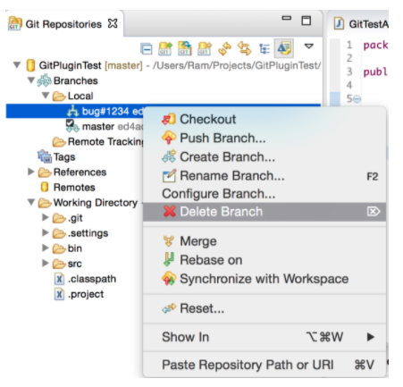

Figura 3.27: Deleting Git branch

## Committing a project to a remote repository

Hasta ahora, hemos estado trabajando en el repositorio local de Git. Pero es posible que desee llevar su proyecto a un repositorio remoto si desea compartir su código y / o asegurarse de no perder sus cambios locales. Entonces, en esta sección, aprenderemos cómo llevar un proyecto local a un repositorio Git remoto. Si no tiene acceso a un repositorio de Git, puede crear uno en http://www.github.com .

1. Cree un nuevo repositorio en el servidor remoto de Git, llamado `GitPluginTest`.
2. En la vista Git Repositories, haga clic en el nodo Remotes y seleccione la opción Create Remoto ...:

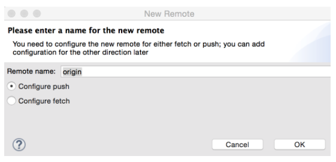

Figura 3.28: Agregar un repositorio Git remoto

3. Por convención, el nombre del repositorio remoto es `origin`. Haz clic en OK. En la página next, establezca la configuración para push. Haga clic en el  botón Change junto al cuadro de texto URI:

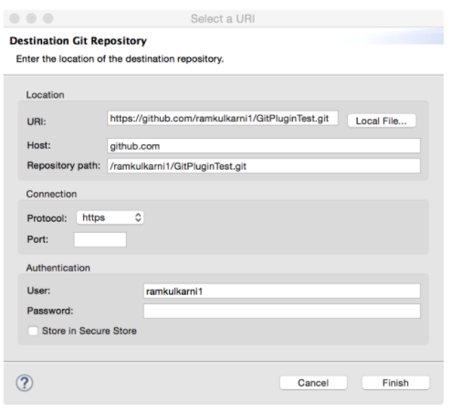

Figura 3.29: Configuración de un URI de Git remoto

4. Ingrese el URI del repositorio remoto de Git. El asistente extracts host, repository path, y protocol del URI. Ingrese su ID de usuario y contraseña y haga clic en Finish :

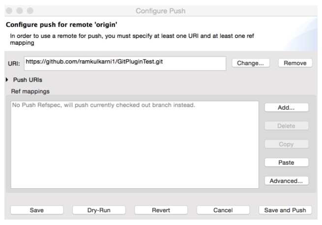

Figura 3.30: Configuración de un Git push

Haga clic en Save and Push. Esto envía archivos en la rama maestra local al repositorio Git remoto.

## Pulling changes from a remote repository

Mientras trabaja en un equipo, los miembros de su equipo también realizarán cambios en el repositorio remoto. Cuando desee que los cambios se realicen en el repositorio remoto a su repositorio local, use la opción Pull. Pero antes de realizar la operación Pull (de extracción), debe configurarla.

En el  Explorador de paquetes , haga clic con el botón derecho en el proyecto y seleccione Team | Remote | Configure Fetch from Upstream...:


Figura 3.31: Configuración de Git Fetch

*En Git, tanto  Pull  como  Fetch  pueden obtener los cambios desde un repositorio remoto. Sin embargo, la   operación Fetch no combina los cambios en el repositorio local. La operación Pull primero recupera los cambios y luego se fusiona en el repositorio local. Si desea inspeccionar los archivos antes de fusionarlos, seleccione la opción Fetch.*

Necesitamos mapear la rama maestra local con una rama en el repositorio remoto. Esto le dice a la operación Pull para buscar a los cambios de la rama en el repositorio remoto y fusionarla en el (en este caso, maestro) repositorio local determinado. Haga clic en el  botón Add ...:

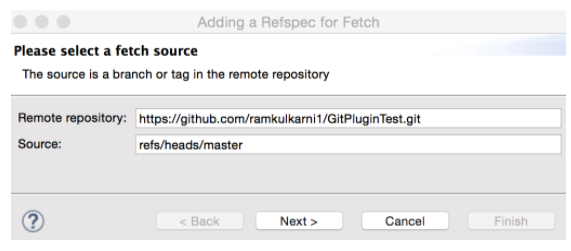

Figura 3.32: Configuración de Git Fetch

Comience a escribir el nombre de la rama en el cuadro de texto de origen y el asistente obtendrá la información de la rama del repositorio remoto y la completará automáticamente. Haga clic en Next y luego en Finish. Esto lo lleva de regreso a la página Configure Fetch con mapeo de las ramas agregadas:

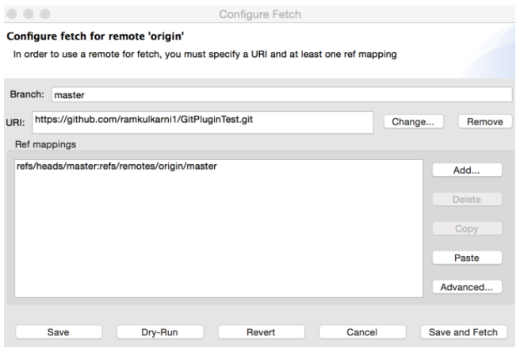

Figura 3.33: Configuración de Git Fetch con mapeo agregado

Haga clic en Save and Fetch para extraer (pull) los cambios del repositorio remoto.

## Cloning a remote repository

Hemos aprendido cómo comenzar el desarrollo utilizando un repositorio Git local y luego enviar los cambios a un repositorio remoto. Aprendamos ahora cómo podemos obtener un repositorio Git remoto existente y crear una copia local; en otras palabras, aprenderemos cómo clonar un repositorio Git remoto. La opción más fácil es importar el proyecto Git remoto. Seleccionar File | Import... desde el menú principal y luego Git | Projects from Git | Clone URI.

El asistente mostrará una página similar a la Figura 3.29 . Ingrese el URI del repositorio remoto, nombre de usuario y contraseña, y luego haga clic en Next . Seleccione remote branch y haga clic en Next:

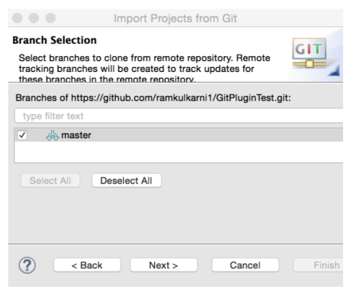

Figura 3.34: Selección de una rama remota para clonar

Haga clic en el  botón Next en la branch selection page:

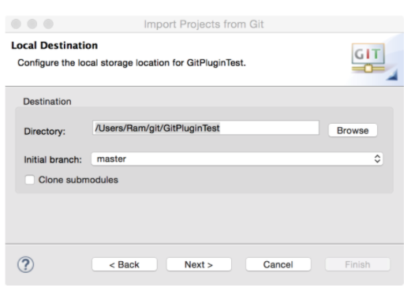

Figura 3.35: Selección de la ubicación del proyecto clonado

Seleccione la ubicación donde se guardará el proyecto y haga clic en Next:

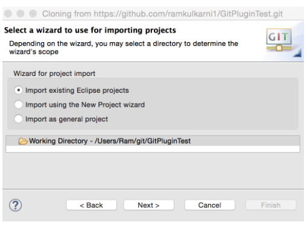

Figura 3.36: Opciones para importar el proyecto clonado

Hay tres opciones para importar el proyecto clonado. Si el repositorio remoto contiene todo el proyecto Eclipse, seleccione Import existing Eclipse projects o seleccione cualquiera de las dos opciones restantes. Como hemos verificado el proyecto Eclipse en el repositorio remoto, seleccionaremos la primera opción. Haga clic en Next y luego en Finish.

Para obtener más información sobre el complemento Eclipse Git, consulte https://wiki.eclipse.org/EGit/User_Guide.

# Summary

Hay plugins de Eclipse disponibles para una amplia variedad de sistemas SCM. En este capítulo, aprendimos cómo usar los complementos de Eclipse para SVN y Git. Con estos complementos, puede realizar muchas de las operaciones típicas de SCM, como verificar el origen, comparar versiones y confirmar cambios, directamente dentro del IDE de Eclipse. Esto proporciona una gran comodidad y puede mejorar su productividad.

En el próximo capítulo, veremos cómo crear aplicaciones de base de datos JEE utilizando JDBC y JDO.
