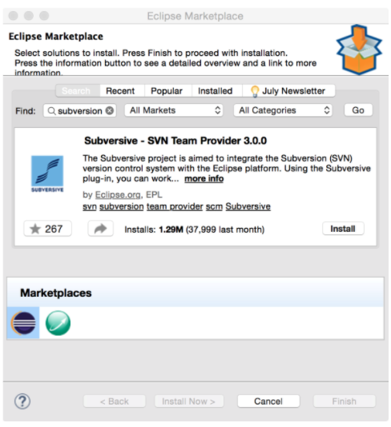

# 3. Source Control Management in Eclipse

* The Eclipse subversion plugin

   * Installing the Eclipse Subversion plugin

   * Adding projects to an SVN repository

   * Committing changes to an SVN repository

   * Synchronizing with an SVN repository

   * Checking out a project from SVN

* Eclipse Git plugin

   * Adding a project to Git

   * Committing files in the Git repository

   * Viewing file differences after modifications

   * Creating a new branch

   * Committing a project to a remote repository

   * Pulling changes from a remote repository

   * Cloning a remote repository

* Summary

# Source Control Management in Eclipse

En el capítulo anterior, aprendimos cómo crear aplicaciones web simples usando JSP, JSF y servlets. También aprendimos cómo usar Maven para la compilación y la gestión de proyectos.

En este capítulo, aprenderemos cómo integrar Eclipse con SVN y Git. El capítulo cubre los siguientes temas:

* Instalación de complementos de Eclipse para SVN y Git
* Realización de tareas de control de origen, como extraer archivos, confirmar cambios, etc. desde Eclipse
* Sincronizar proyectos con repositorios remotos

**Source Control Management ( SCM )** es una parte esencial del desarrollo de software. Al utilizar las herramientas SCM, se asegura de tener acceso a las versiones de su código en hitos importantes. SCM también ayuda a administrar el código fuente cuando está trabajando en un equipo, al proporcionarle herramientas para asegurarse de no sobrescribir el trabajo realizado por otros. Ya sea que su proyecto sea pequeño o grande, ya sea que trabaje solo o en un equipo grande, usar SCM lo beneficiaría.

Eclipse ha tenido soporte para integrar varias herramientas SCM durante mucho tiempo; esto incluye soporte para CVS, Microsoft SourceSafe, Perforce y **Subversion ( SVN )**. Las versiones recientes de Eclipse también tienen soporte incorporado para Git. 

Comenzaremos aprendiendo cómo usar SVN de Eclipse.

# The Eclipse subversion plugin

En esta sección, aprenderemos cómo instalar y usar el complemento SVN Eclipse. Crearemos un pequeño proyecto y veremos cómo registrar un proyecto en SVN desde Eclipse. También veremos cómo sincronizar con el repositorio SVN existente.

Necesitará acceso a un repositorio SVN para seguir los pasos de este capítulo. Si no tiene acceso a un repositorio SVN, puede elegir entre algunas de las ofertas gratuitas de SVN en línea. Este libro no promueve ni sugiere el uso de ningún alojamiento SVN en línea en particular, pero con el propósito de explicar las características del complemento SVN Eclipse, el autor ha utilizado https://riouxsvn.com . Sin embargo, el complemento funcionaría de la misma manera con cualquier servidor SVN.

## Installing the Eclipse Subversion plugin

1. Abra Eclipse Marketplace seleccionando Help | Eclipse Marketplace menu. Buscar por `subversion`:

Figura 3.1: Instalación del complemento Subversion

Instala el complemento. Antes de configurar un repositorio SVN en Eclipse, necesitamos seleccionar / instalar un conector SVN . Vaya a Preferencias de Eclipse y escriba svnen el cuadro de filtro. Luego, vaya a la pestaña Conector SVN :

Figura 3.2: Preferencias del conector SVN
Si no hay instalados conectores, verá un  botón Obtener conectores ... Clic en el botón.

Eclipse muestra una serie de conectores disponibles. Vamos a elegir la  SVN Kit  conector e instalarlo (haga clic en el  Finalizar  botón):

Figura 3.3: El asistente de descubrimiento del conector SVN
Ahora configuraremos un repositorio SVN existente en Eclipse. Seleccione la  ventana | Perspectiva abierta | Otro menú y luego seleccione la perspectiva Exploración del repositorio SVN :

Figura 3.4: Perspectiva SVN abierta

## Adding projects to an SVN repository

## Committing changes to an SVN repository

## Synchronizing with an SVN repository

## Checking out a project from SVN

# Eclipse Git plugin

## Adding a project to Git

## Committing files in the Git repository

## Viewing file differences after modifications

## Creating a new branch

## Committing a project to a remote repository

## Pulling changes from a remote repository

## Cloning a remote repository

# Summary
