# 3. Source Control Management in Eclipse

* The Eclipse subversion plugin

   * Installing the Eclipse Subversion plugin

   * Adding projects to an SVN repository

   * Committing changes to an SVN repository

   * Synchronizing with an SVN repository

   * Checking out a project from SVN

* Eclipse Git plugin

   * Adding a project to Git

   * Committing files in the Git repository

   * Viewing file differences after modifications

   * Creating a new branch

   * Committing a project to a remote repository

   * Pulling changes from a remote repository

   * Cloning a remote repository

* Summary

# Source Control Management in Eclipse

En el capítulo anterior, aprendimos cómo crear aplicaciones web simples usando JSP, JSF y servlets. También aprendimos cómo usar Maven para la compilación y la gestión de proyectos.

En este capítulo, aprenderemos cómo integrar Eclipse con SVN y Git. El capítulo cubre los siguientes temas:

* Instalación de complementos de Eclipse para SVN y Git
* Realización de tareas de control de origen, como extraer archivos, confirmar cambios, etc. desde Eclipse
* Sincronizar proyectos con repositorios remotos

**Source Control Management ( SCM )** es una parte esencial del desarrollo de software. Al utilizar las herramientas SCM, se asegura de tener acceso a las versiones de su código en hitos importantes. SCM también ayuda a administrar el código fuente cuando está trabajando en un equipo, al proporcionarle herramientas para asegurarse de no sobrescribir el trabajo realizado por otros. Ya sea que su proyecto sea pequeño o grande, ya sea que trabaje solo o en un equipo grande, usar SCM lo beneficiaría.

Eclipse ha tenido soporte para integrar varias herramientas SCM durante mucho tiempo; esto incluye soporte para CVS, Microsoft SourceSafe, Perforce y **Subversion ( SVN )**. Las versiones recientes de Eclipse también tienen soporte incorporado para Git. 

Comenzaremos aprendiendo cómo usar SVN de Eclipse.

# The Eclipse subversion plugin

En esta sección, aprenderemos cómo instalar y usar el complemento SVN Eclipse. Crearemos un pequeño proyecto y veremos cómo registrar un proyecto en SVN desde Eclipse. También veremos cómo sincronizar con el repositorio SVN existente.

Necesitará acceso a un repositorio SVN para seguir los pasos de este capítulo. Si no tiene acceso a un repositorio SVN, puede elegir entre algunas de las ofertas gratuitas de SVN en línea. Este libro no promueve ni sugiere el uso de ningún alojamiento SVN en línea en particular, pero con el propósito de explicar las características del complemento SVN Eclipse, el autor ha utilizado https://riouxsvn.com . Sin embargo, el complemento funcionaría de la misma manera con cualquier servidor SVN.

## Installing the Eclipse Subversion plugin

1. Abra Eclipse Marketplace seleccionando Help | Eclipse Marketplace menu. Buscar por `subversion`:

Figura 3.1: Instalación del complemento Subversion

2. Instala el complemento. Antes de configurar un repositorio SVN en Eclipse, necesitamos seleccionar / instalar un conector SVN . Vaya a Preferencias de Eclipse y escriba `svn` en el cuadro de filtro. Luego, vaya a la pestaña Conector SVN :

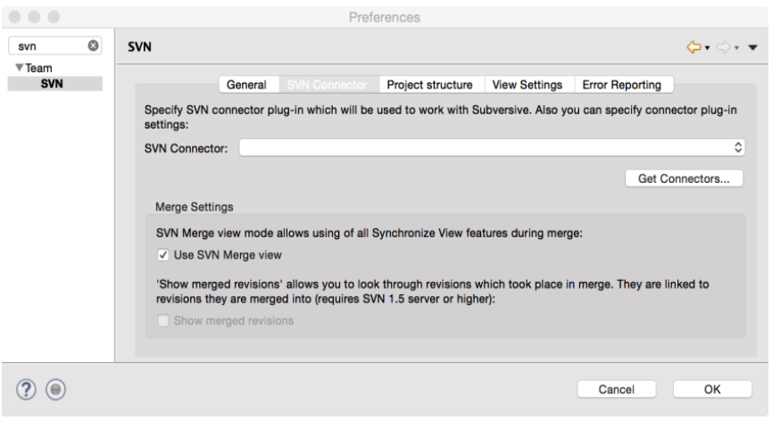

Figura 3.2: Preferencias del conector SVN

Si no hay instalados conectores, verá un  botón Obtener conectores ... Clic en el botón.

3. Eclipse muestra una serie de conectores disponibles. Vamos a elegir la  SVN Kit  conector e instalarlo (haga clic en el  Finalizar  botón):

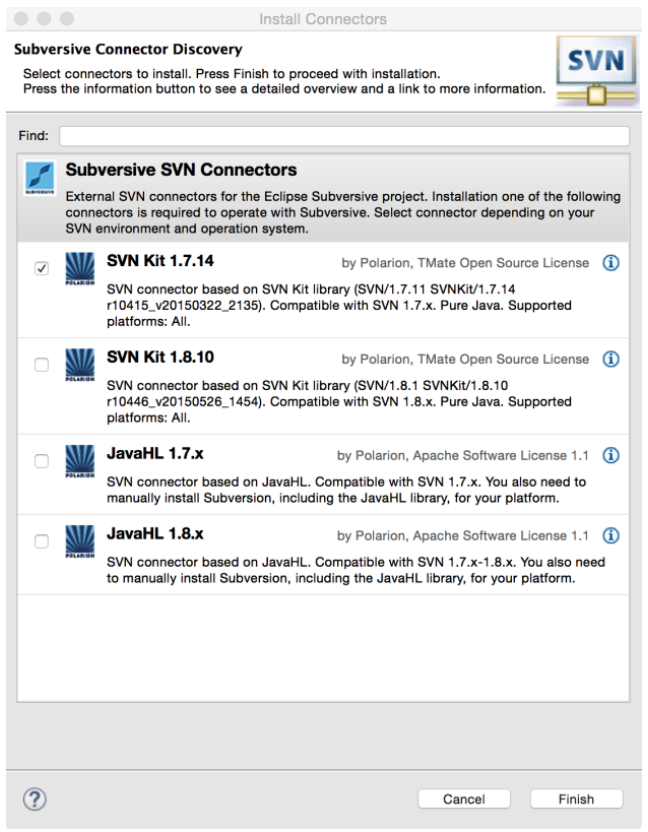

Figura 3.3: El asistente de descubrimiento del conector SVN

4. Ahora configuraremos un repositorio SVN existente en Eclipse. Seleccione Window | Open Perspective | Other menu y luego seleccione la perspectiva SVN Repository Exploring:

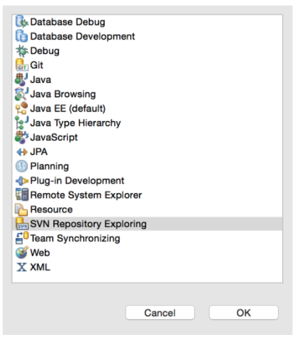

Figura 3.4: Perspectiva SVN abierta

## Adding projects to an SVN repository

Realice los siguientes pasos para agregar proyectos a un repositorio SVN:

1. Haga clic con el botón derecho en la vista SVN Repositories y seleccione New | Repository Location.
2. Ingrese la URL de su repositorio SVN, su username y password. Si necesita establecer información SSH o SSL para conectarse a su repositorio SVN, haga clic en la pestaña correspondiente e ingrese la información. Haga clic en Finish para agregar el repositorio a Eclipse:

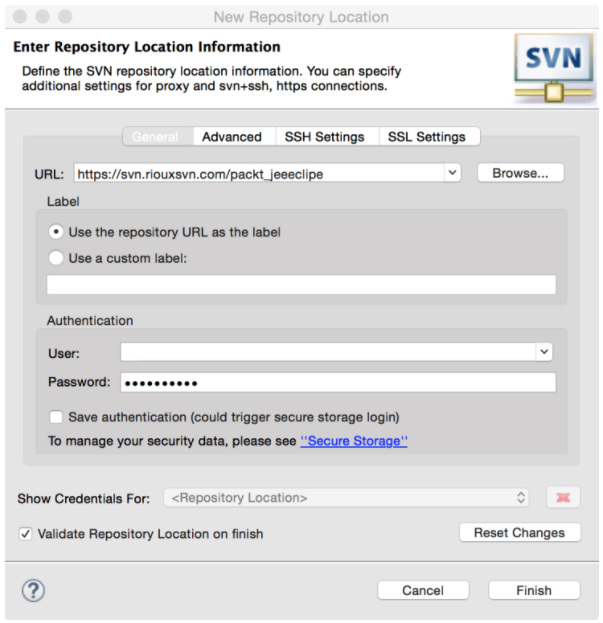

Figura 3.5: Configuración de un repositorio SVN

1. Ahora creemos un proyecto Java simple que verifiquemos en el repositorio SVN. En este capítulo, no es importante qué código escriba en el proyecto; vamos a usar el proyecto solo para comprender cómo registrar los archivos del proyecto en SVN y luego ver cómo sincronizar el proyecto.

Cree un proyecto Java simple como se muestra en la siguiente captura de pantalla:

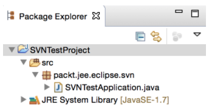

Figura 3.6: Un proyecto de muestra para pruebas SVN

2. El proyecto tiene un archivo source. Ahora revisaremos este proyecto en SVN. Haga clic derecho en el proyecto y seleccione  Team | Share Project.... .
3. Seleccione  SVN  y haga clic en el  botón Next. El asistente le ofrece opciones para crear un nuevo repositorio SVN o seleccionar un repositorio SVN ya configurado:

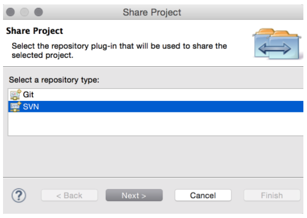

Figura 3.7: Compartir proyecto con el repositorio SVN

4. Vamos a utilizar el repositorio ya configurado. Entonces, seleccione el repositorio:

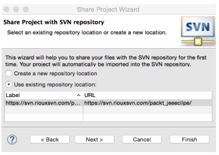

Figura 3.8: Seleccionar un repositorio SVN o crear uno nuevo

5. Podemos hacer clic en Next y configurar la opción avanzada, pero mantendremos la configuración simple y haremos clic en Finish. Se le pedirá que verifique los archivos existentes en el proyecto:

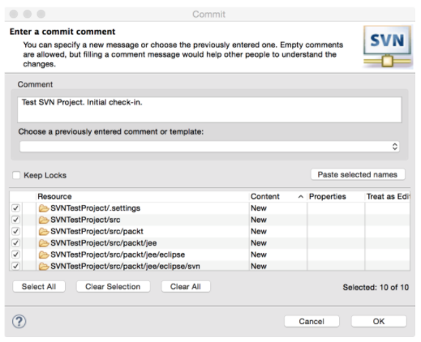

Figura 3.9: Compartir proyecto con el repositorio SVN

6. Seleccione los archivos que desea registrar e ingrese los comentarios de registro. Luego haga clic en OK . Para ver los archivos registrados en el repositorio SVN, cambie a la perspectiva SVN Repository Exploring y luego a la  vista SVN Repositories:

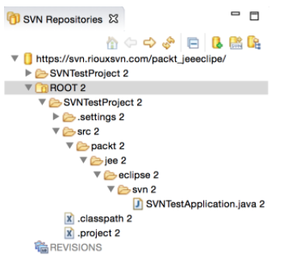

Figura 3.10: Archivos registrados en la vista Repositorios SVN

## Committing changes to an SVN repository

Ahora modifiquemos un archivo y verifiquemos los cambios. Vuelva a la perspectiva de Java y ábralo `SVNTestApplication.java` desde Package Explorer o Navigator . Modifique el archivo y guarde los cambios. Para comparar los archivos o las carpetas en su directorio de trabajo con los del repositorio, haga clic derecho en `file/folder/project` en Navigator y seleccione Compare With | Latest from Repository.

Ahora que hemos modificado `SVNTestApplication.java`, veamos cómo difiere del que está en el repositorio:

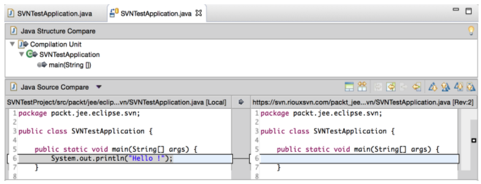

Figura 3.11: Comparación de archivos SVN

Agreguemos un nuevo archivo ahora, digamos `readme.txt`, en la raíz del proyecto. Para agregar el archivo al repositorio, haga clic derecho en el archivo y seleccione Team | Add to Version Control...:

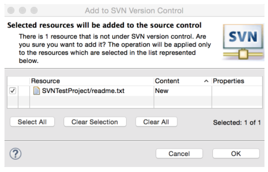

Figura 3.12: Agregar archivos a un repositorio SVN

## Synchronizing with an SVN repository

## Checking out a project from SVN

# Eclipse Git plugin

## Adding a project to Git

## Committing files in the Git repository

## Viewing file differences after modifications

## Creating a new branch

## Committing a project to a remote repository

## Pulling changes from a remote repository

## Cloning a remote repository

# Summary
