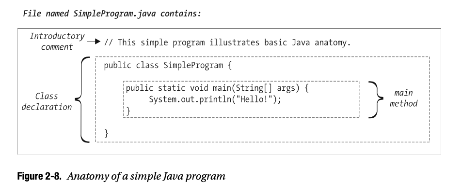
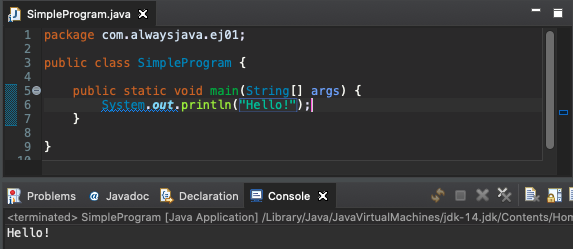

# 02 Java Básico

<span style="background-color: #FFE34F;">Java está orientado a objetos en su esencia. ***Casi todo*** en Java es un objeto</span>:

* Todos los datos, con la excepción de unos pocos tipos primitivos, se encuentran registrados como objetos.
* Todos los bloques de construcción de GUI (ventanas, botones, campos de entrada de texto, barras de desplazamiento, listas, menús, etc.) son objetos.
* Todas las funciones están asociadas con objetos y son conocidas como **métodos**.
* Incluso la función principal utilizada para lanzar la aplicación(en Java, se llama el método **main**) no está independiente, sino que está agrupada dentro de una **clase**.

Debido a esto, Java se presta particularmente bien para escribir aplicaciones que mantienen el paradigma OO. Sin embargo, como señalé en la introducción de este libro, el mero uso de dicho lenguaje orientado a objetos no garantiza que las aplicaciones que usted produzca sean fieles a este paradigma. Debe tener conocimientos sobre cómo diseñar una aplicación desde cero para hacer el mejor uso de los objetos y sobre cómo aplicar el lenguaje correctamente.

## Anatomia de un Sencillo Programa Java



En la figura se muestra una clase java de las más sencillas, la cuenta con los siguientes elementos:

## Comentarios

Los comentarios comienzan con `//`

```java
// This simple program illustrates some basic Java syntax.
```

Java soporta tres diferentes estilos de comentarios: 

* traditional
* end-of-line
* Java documentation comments.

### Traditional Comments

Los comentarios tradicionales de Java derivan del lenguaje C y comienzan con una barra inclinada seguida de un asterisco (`/*`) y terminan con un asterisco seguido de una barra inclinada (`*/`). Todo lo que se incluye entre estos delimitadores se trata como un comentario y, por lo tanto, el compilador de Java lo ignora, sin importar cuántas líneas abarque el comentario.

```java
/* Este es un comentario tradicional (Estilo C). */

/* Este es un comentario tradicional de varias líneas. Esta es una forma práctica de comentar temporalmente 
   secciones enteras de código sin tener que eliminarlas.
   Desde el momento en que el compilador encuentra el primer "slash asterisk" anterior, no le importa lo que 
   escriba aquí; incluso líneas de código legítimas,como se muestra a continuación, se tratan como líneas de 
   comentarios hasta que el  compilador se encuentre la primera combinación de "asterisk slash".

x = y + z;
a = b / c;
j = s + c + f; 
*/

/* A menudo utilizamos asteriscos iniciales desde la segunda y hasta la penúltima línea
 * de un comentario tradicional simplemente por razones estéticas, para que el comentario 
 * sea más visual distinto; pero, estos asteriscos adicionales son estrictamente cosméticos, 
 * solo los "slash asterisk" inicial y "asterisk slash" final tiene algún significado para el 
 * compilador.* /
```

Tenga en cuenta que no podemos **anidar** comentarios de bloque, es decir, lo siguiente no se compilará:

```java
/ * Esto inicia un comentario ...
x = 3;
/ * ¡Ups! Intentamos anidar un SEGUNDO comentario por error antes de terminar el PRIMER!
Esto nos va a causar problemas de compilación, porque el compilador IGNORARÁ el comienzo 
de este segundo comentario interno; después de todo, ¡ya estamos EN un comentario! - y tan 
pronto como intentemos terminar este SEGUNDO comentario interno, el compilador pensará que 
hemos terminado el PRIMER comentario externo en su lugar ... * /
z = 2;
// El compilador se "quejará" en la siguiente línea.
* /
```

Cuando el compilador alcanza lo que pretendíamos que fuera la terminación * / del comentario "externo" en la última línea del ejemplo de código anterior, se informarán los siguientes dos errores de compilación:

```java
illegal start of expression
 */
 ^
```
y 
```java
';' expected 
   */
     ^
```

### End-of-Line Comments - Comentarios de fin de línea

El segundo tipo de comentario de Java se deriva de C++ y se conoce como comentario de fin de línea. Usamos una barra doble (`//`) para anotar el comienzo de un comentario que termina automáticamente cuando se llega al final de la línea, como se muestra aquí:

x = y + z; 
// Aquí hay un BLOQUE de comentarios secuenciales de fin de línea.
// Esto sirve como una alternativa al uso de comentarios tradicionales // (/ * ... * /) y es preferido por muchos programadores de Java.
m = n * p;
```java
x = y + z; // el texto del comentario continúa hasta el final de la línea ==> a = b / c;
// Aquí hay un BLOQUE de comentarios secuenciales de fin de línea.
// Esto sirve como una alternativa al uso de comentarios tradicionales 
// (/ * ... * /) y es preferido por muchos programadores de Java.

m = n * p;
```

### Java Documentation Comments - Comentarios de la documentación de Java

El tercer y último tipo de comentario de Java, los comentarios de documentación de Java (también conocidos como comentarios de Javadoc), se pueden analizar a partir de archivos de código fuente mediante un programa de utilidad de línea de comandos especial javadoc (que viene de serie con el SDK de Java) y se pueden utilizar para generar automáticamente documentación HTML para una aplicación.
Aplazaremos una mirada en profundidad a los comentarios de Javadoc hasta el Capítulo 13.

## Declaración de la Clase

Para declarar una clase usamos la sintaxís:

```java
public class ClassName { 
   ...
}
```

por ejemplo:

```java
public class SimpleProgram { 
   ...
}
```

donde las llaves `{...}` encierran el cuerpo de la clase que incluye la lógica principal del programa junto con otros bloques de construcción opcionales de una clase.

Las palabras `public` y `class` son dos de las palabras clave de Java, es decir, palabras reservadas para uso específico dentro del lenguaje Java, mientras que `SimpleProgram` es un nombre inventado.

### El método `main`

Dentro de la declaración de la clase `SimpleProgram`, encontramos el punto de partida para el programa, llamado método `main`. El método `main` sirve como punto de entrada para un programa Java. Cuando ejecutamos un programa Java la JVM llama al método `main` para iniciar nuestra aplicación.

Con aplicaciones triviales como el ejemplo de `SimpleProgram`, toda la lógica del programa se puede contener dentro de este único método principal. Para aplicaciones más complejas, el método `main` posiblemente no puede contener toda la lógica para todo el sistema. 

La primera línea de la clase `SimpleProgram` es:

```java
public static void main(String[] args) {
```
define lo que se conoce como el **encabezado del método** del método `main`, y ***debe aparecer exactamente como se muestra*** (con una excepción menor que explicaré en el Capítulo 13 que tiene que ver con la recepción opcional de argumentos desde la línea de comandos).

El cuerpo del método de nuestro método `main`, encerrado entre llaves `{...}`, consta de una sola sentencia: 

```java
System.out.println("Hello!");
```

Note el uso de un punto y coma (;) al final de la sentencia. . Las llaves `{...}`, a su vez, delimitan bloques de código.

Otras cosas que normalmente hacemos dentro del método principal de un programa más elaborado incluyen declarar variables, crear objetos y llamar a otros métodos.

Ahora que hemos visto la anatomía de un programa Java simple, analicemos cómo se compila y ejecuta dicho programa.

#### Compilar el archivo fuente de código Java a Bytecode

Para compilar el código fuente de Java desde la línea de comandos, usamos el comando `cd`, según sea necesario, para navegar al directorio de trabajo donde reside nuestro código fuente. Luego escribimos el siguiente comando:

```sh
javac sourcecode_filename
```

Por ejemplo:

```sh
javac SimpleProgram.java
```

para compilarlo

Si hubiera más de un archivo de código fuente .java en el mismo directorio, podríamos enumere los nombres de los archivos a compilar, separados por espacios:

```sh
javac Foo.java Bar.java Another.java
```

o utilice el carácter comodín (`*`), por ejemplo: 

```sh
javac *.java
```

para compilar varios archivos al mismo tiempo.

Si todo va bien, es decir, si no surgen errores del compilador, aparecerá un archivo de código de bytes con el nombre de `SimpleProgram.class` en el mismo directorio donde reside el archivo de código fuente `SimpleProgram.java`. Si surgen errores del compilador, por otro lado, por supuesto, debemos corregir nuestro código fuente e intentar recompilarlo.

#### Ejecutar Bytecode

Una vez que un programa se ha compilado con éxito, ejecutamos la versión del código de bytes mediante el comando

```sh
java bytecode_filename 
```
tenga en cuenta que OMITIMOS el sufijo .class por ejemplo:

```sh
java SimpleProgram
```

Tenga en cuenta que es importante omitir el sufijo `.class` del nombre del archivo de código de bytes (que en este caso se llama `SimpleProgram.class`).

De forma predeterminada, la JVM buscará en su directorio de trabajo predeterminado junto con el directorio "home" donde se ha instalado el lenguaje Java en su sistema para dichos archivos de código de bytes. Si la JVM encuentra el archivo de código de bytes especificado, ejecuta su método `main` y su programa está funcionando.

Si por alguna razón el código de bytes que está intentando ejecutar no se encuentra en ninguna de estas dos ubicaciones predeterminadas, debe informar a la JVM de directorios adicionales en los que buscar. Puede hacerlo especificando una lista de directorios (separados por punto y coma [;] en Windows, o por dos puntos [:] en Solaris y Linux) después de la marca `-cp` en el comando java de la siguiente manera:

```sh
java –cp list_of_directory_names_to_be_searched bytecode_filename
```

Por ejemplo, en DOS / Windows:

```sh
java –cp C:\home\javastuff;D:\reference\workingdir;S:\foo\bar\files SimpleProgram
```

o en Solaris/Linux:

```sh
java –cp /barkerj/work:/java/examples/ex1 SimpleProgram
```

Todo lo anterior es para ejecutarlo desde la línea de comandos.

### Una mirada entre bastidores a la JVM

Echemos un vistazo más en profundidad a lo que realmente sucede detrás de escena cuando escribimos el comando

```sh
java SimpleProgram
```

para ejecutar nuestro programa.

• El comando Java hace que se inicie la JVM.
• La JVM busca el archivo de código de bytes que hemos nombrado en el comando (`SimpleProgram.class` en este caso), buscando en los directorios enumerados por el indicador `–cp`, si se proporciona, o en el directorio de trabajo predeterminado si no se usa `–cp`.
• Suponiendo que la JVM de hecho encuentra el archivo de código de bytes apropiado, carga el código de bytes en su memoria (conceptualmente, el código de bytes sirve como un "complemento" para la JVM).
• A continuación, el JVM busca el código de bytes que acaba de cargar para la presencia del encabezado del método `main`. Si se encuentra este método, la JVM lo ejecuta y nuestro programa se ejecuta.

#### Ejecutandolo desde Eclipse



## Tipos Primitivos

Se dice que Java es un lenguaje de programación fuertemente tipado, en el sentido de que cuando se declara una variable, también se debe declarar su tipo. Entre otras cosas, declarar el tipo de una variable le dice al compilador cuánta memoria asignar para la variable en tiempo de ejecución, y también restringe el contexto(s) en el que esa variable se puede usar posteriormente en nuestro programa.

El lenguaje **Java define ocho tipos primitivos** (los ocho nombres de estos tipos son palabras clave de Java), de la siguiente manera.

**Cuatro tipos de datos numéricos enteros**: 

* `byte`:  entero sin signo de 8 bits
* `short`: entero de 16 bits con signo
* `int`:   entero de 32 bits con signo
* `long`:  entero de 64 bits con signo

**Dos tipos numéricos de coma flotante**:

• `float`: punto flotante de precisión única de 32 bits
• `double`: punto flotante de doble precisión de 64 bits 

Más dos tipos primitivos adicionales:

* `char`: Un carácter único, almacenado con codificación Unicode de 16 bits (en lugar de codificación ASCII de 8 bits), que permite a Java manejar una amplia gama de juegos de caracteres internacionales.
* `boolean`: una variable que solo puede asumir uno de dos valores: `true` o `false` (ambos valores son palabras reservadas en Java). Las variables booleanas se utilizan a menudo como indicadores para señalar si algún código debe ejecutarse condicionalmente o no, como en el siguiente fragmento de código:

```java
boolean error = false; // Inicializa la bandera.
// ...
// Más adelante en el programa (pseudocódigo): si (surge alguna situación de error) {
// Establezca el indicador en verdadero para indicar que se ha producido un error.
error = true;
}
// ...
// Más adelante en el programa:
// Prueba el valor de la bandera. si (error == true) {
// Pseudocódigo.
tomar acción correctiva ...
```

## Variables

Antes de que se pueda utilizar una variable en un programa Java, el tipo y el nombre de la variable deben **declararse**, por ejemplo:

```java
int count;
```

La asignación de un valor a una variable se logra mediante el **operador de asignación** `=`. Una sentencia de asignación consta de un nombre de variable (previamente declarado) a la izquierda del `=` y una expresión que evalúa el tipo apropiado a la derecha del `=`. Por ejemplo:

```java
...
int count = 1;
total = total + 4.0; // Aquí, asumimos que el total se declaró como una 
                     // variable double anterior en el programa.
price = cost + (a + b)/length; // Una vez más asumimos que todas las variables fueron 
                               // declaradas correctamente anteriormente en el programa.
```

Se puede proporcionar un valor inicial cuando se declara una variable por primera vez:

```java
int count = 3;
```

o se puede declarar una variable en una sentencia, luego se le puede asignar un valor en una sentencia separada más adelante en el programa:

```java
double total;
// código intermedio ... detalles omitidos
total = total + 4.0;
```

Se puede asignar un valor a una variable booleana usando los literales `true` o `false`:

```java
boolean finished; 
// ...
finished = true;
```
Se puede asignar un valor literal a una variable de tipo `char` encerrando el valor (un solo carácter Unicode) entre comillas simples:

```java
char c = 'A';
```

El uso de comillas dobles (`"..."`) está reservado para asignar valores literales a las variables de tipo `String`. **Lo siguiente no se compilaría en Java**:

```java
char c = "A"; // Debemos usar comillas simples al asignar valores a variables char.
```

### Convenciones de Nombres de Variables

Al discutir los nombres de las variables de Java, hay dos aspectos a considerar:

* Primero, ¿el compilador Java considera válido un nombre en particular?
* En segundo lugar, ¿se adhiere un nombre válido en particular a la convención de nombres que ha sido adoptada por la comunidad de programación OO en todos los lenguajes?

Los nombres de variables válidos en Java **deben comenzar con un carácter alfabético**, **un guion bajo  o un signo de dólar** (cuyo uso no se recomienda, ya que el compilador lo usa al generar código) y pueden contener cualquiera de estos caracteres más dígitos numéricos. **No se permiten otros caracteres en los nombres de las variables**.

Los siguientes son todos nombres de variables válidos en Java:

```java
int simple; // comienza con un carácter alfabético
int _under; // comienza con guion bajo
int more$money_is_2much; // puede contener signos de dólar y/o guiones bajos, y/o
                         // dígitos y/o caracteres alfabéticos
```

mientras estos no son válidos:

```java
int 1bad;         // carácter inicial inapropiado
int number#sign;  // contiene un carácter no válido
int foo-bar;      // contiene un carácter no válido
int plus+sign;    // contiene un carácter no válido
int x@y;          // contiene un carácter no válido
int dot.notation; // contiene un carácter no válido
```

Dicho esto, la convención que se observa en toda la comunidad de programación OO es formar nombres de variables utilizando principalmente caracteres alfabéticos, evitando el uso de guiones bajos y, además, adherirse a un estilo conocido como **camel casing** o **camelCase**. Con el formato camelCase, la primera letra del nombre de una variable está en ***minúsculas***, la primera letra de cada palabra concatenada subsiguiente en el nombre de la variable está en ***mayúsculas*** y el resto de los caracteres en minúsculas. Todos los siguientes nombres de variables son válidos y convencionales:


```java
int grade;
double averageGrade;
String myPetRat;
boolean weAreFinished;
```

Recuerde que, como se mencionó anteriormente, **las palabras clave de Java no se pueden usar como nombres de variables**. Lo siguiente no se compilará, porque `public` es una palabra clave de Java:

```java
int public;
```

De hecho, el compilador generaría los siguientes dos mensajes de error:

```sh
not a statement
int public;
^

';' expected 
int public;
    ^
```

## Inicialización de Variable

En Java, a las variables no se les asigna necesariamente un valor inicial cuando se declaran, **pero a todas las variables se les debe asignar un valor antes de usar el valor de la variable en una sentencia de asignación**. Por ejemplo, en el siguiente fragmento de código, se declaran dos variables int(eger); un valor inicial se asigna explícitamente a la variable `foo`, pero no a la variable `bar`. Un intento posterior de sumar los valores de las dos variables da como resultado **un error del compilador**:

```java
int foo;
int bar;
// Nosotras estamos inicializando explícitamente foo, pero no bar. 
foo = 3;
foo = foo + bar; // Esta línea no se compilará.
```

El siguiente error del compilador surgiría en la última línea de código:

```sh
variable bar might not have been initialized 
foo = foo + bar;
            ^
            
The local variable bar may not have been initialized (ECLIPSE)           
```

Para corregir este error, necesitaríamos asignar un valor explícito a `bar`, así como a `foo`, antes
de usarlos en la expresión de suma:

```java
int foo;
int bar;
foo = 3;
// Ahora estamos inicializando AMBAS variables explícitamente. 
bar = 7;
foo = foo + bar; // Esta línea ahora se compilará correctamente.
```

<hr>
En el Capítulo 13, aprenderá que las reglas de inicialización automática son algo diferentes cuando se trata del "funcionamiento interno" de los objetos.
<hr>

## El tipo `String`

Veremos otro tipo de Java importante en este capítulo: el tipo `String`. Un `String` representa una secuencia de cero o más caracteres Unicode.

**El símbolo `String` comienza con una "S" mayúscula, mientras que los nombres de los tipos primitivos se expresan en minúsculas: `int`, `float`, `boolean`, etc.** Esta diferencia de uso de mayúsculas es deliberada y obligatoria; **`string` (minúscula) no funciona como un tipo** :

```java
string s = "foo"; // Esto no se compilará.
```

Aquí está el mensaje de error:

```sh
cannot find symbol
symbol:  string

string cannot be resolved to a type (ECLIPSE)
```

(Explicaré la importancia de la capitalización de `String` como tipo a su debido tiempo).

Hay varias formas de crear e inicializar una variable `String`. La más fácil y más cómoda 
es declarar una variable de tipo `String` y asignar un valor a la variable utilizando un **string literal** literal de cadena. Un literal de cadena es cualquier texto entre comillas dobles, incluso si consta de un solo carácter:

```java
String name = "Steve";    // Tenga en cuenta el uso de comillas dobles, independientemente de la
String shortString = "A"; // longitud, cuando estamos asignando un valor literal
                          // a una variable String.
```

Dos enfoques comúnmente utilizados para inicializar una variable `String` con un placeholder temporal son los siguientes:

* Asignar una cadena vacía, representada por dos comillas dobles consecutivas:
   
   `String s = "";`

* Asignar el valor `null`, que es una palabra clave Java que se usa para indicar que a un `String` aún no se le ha asignado un valor "real" (como aprenderá más adelante en el libro, usaremos la palabra clave nula de la misma manera para referencias de objetos en general):
   
   `String s = null;`

El operador de signo más (`+`) se usa normalmente para la suma aritmética, pero cuando se usa junto con `Strings`, **representa la concatenación de cadenas**. Se puede concatenar cualquier número de valores de cadena con el operador `+`, como ilustra el siguiente fragmento de código:

```java
String x = "foo";
String y = "bar";
String z = x + y + "!"; // z asume el valor "foobar!" 
                        //(los valores de x y y no se afectan)
                  
```

Aprenderá sobre algunas de las muchas otras operaciones que se pueden realizar con o sobre `Strings`, junto con información sobre su naturaleza OO, en el Capítulo 13.

## Case Sensitivity

Java es un lenguaje **case-sensitive** que distingue entre mayúsculas y minúsculas. Es decir, el uso de mayúsculas frente a minúsculas en Java es deliberado y obligatorio, por ejemplo:

* Los nombres de las variables que se escriben de la misma manera pero que difieren en su uso de caso representan diferentes variables:

```java
// Estas son dos variables DIFERENTES en lo que respecta al compilador de Java
int x; // lowercase - minúsculas
int X; // uppercase - mayúsculas
```

• Todas las palabras clave se representan en minúsculas: `public`, `class`, `int`, `boolean` y en adelante. **No sea “creativo” al ponerlas en mayúsculas**, ya que el compilador objetará violentamente, a menudo con mensajes de error de compilación ininteligibles, como en el siguiente ejemplo, donde la palabra reservada `for` es mayúsculas incorrectamente:

```java
// La palabra reservada 'for' debe estar en minúsculas. 
For (int i = 0; i < 3; i++) {
```
que a su vez produce el siguiente error de compilador aparentemente extraño:

```sh
'.class' expected
For (int i = 0; i < 3; i++) {
         ^
         
ECLIPSE
Multiple markers at this line
	- i cannot be resolved to a variable
	- i cannot be resolved to a variable
	- Syntax error, insert ")" to complete MethodInvocation
	- Syntax error, insert ";" to complete Statement
	- Syntax error on token "<", invalid AssignmentOperator
	- Syntax error on token ")", ; expected
	- The method For(Class<Integer>) is undefined for the type 
	 SimpleProgram
	- Syntax error, insert ". class" to complete Expression
	- i cannot be resolved to a variable
```


```java

```


```java

```


```java

```


```java

```


```java

```

```java

```

