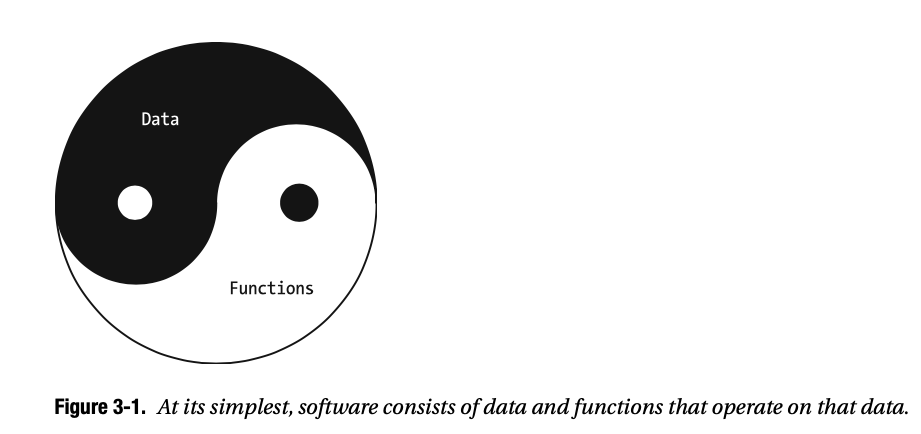
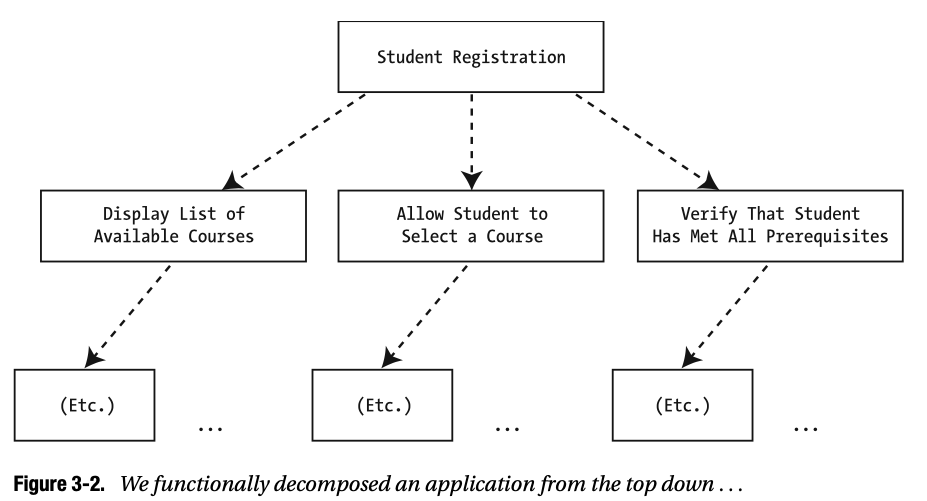
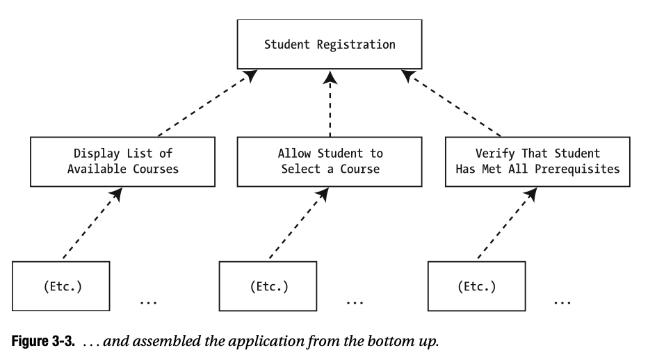
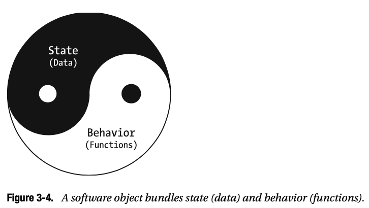
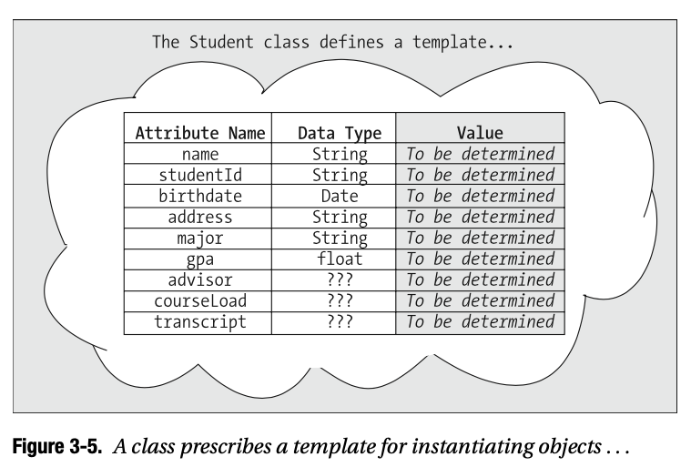
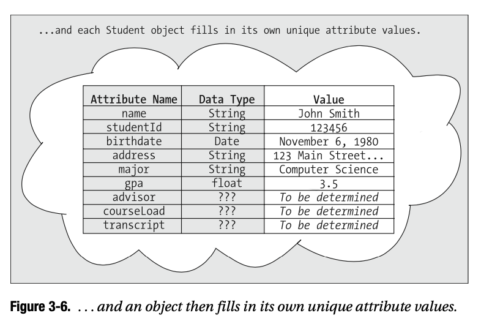

# 03 Objectos y Clases

Los objetos son los bloques de construcción fundamentales de una aplicación orientada a objetos. Tal como aprendió en el Capítulo 1 que la abstracción implica producir un modelo del mundo real, verá en este capítulo, que los objetos son "miniabstracciones" de los diversos elementos del mundo real que componen dicho modelo.

En este capítulo, aprenderá

* Las ventajas de un enfoque orientado a nuevos objetos para el desarrollo de software en comparación con el enfoque "tradicional" sin OO
* Cómo utilizar la clase para especificar los datos y el comportamiento de un objeto
* Cómo crear objetos en tiempo de ejecución
* Cómo declarar **reference variables** para referirse a objetos simbólicamente dentro de un programa
* Cómo los objetos siguen el rastro de otro en la memoria

## Software en su forma más simple

En su forma más simple, cada aplicación de software consta de dos componentes principales: datos y funciones que operan (es decir, ingresan, emiten, calculan, almacenan, recuperan, imprimen, etc.) esos datos. (Vea la Figura 3-1.)



La forma anterior a OO de diseñar software se conocía como descomposición funcional (de arriba hacia abajo). Comparemos el enfoque de descomposición funcional del diseño de software con el enfoque OO.

### Descomposición funcional

Con la descomposición funcional, comenzamos con una declaración de la función general que se esperaba que realizara un sistema, por ejemplo, "Registro de estudiantes". Luego dividimos esa función en subfunciones:

* “Agregue un nuevo curso al catálogo de cursos” 
* “Permita que un estudiante se inscriba en un curso”
* “Imprimir el horario de clases de un estudiante”

Etcétera.

A continuación, descomponemos esas funciones en subfunciones más pequeñas. Por ejemplo, podríamos
descomponer "Permitir que el alumno se inscriba en un curso" en 

* "Mostrar lista de cursos disponibles"
* "Permitir que el estudiante seleccione un curso"
* "Verificar que el alumno cumple con todos los requisitos previos"

etc. Seguimos descomponiendo funciones en piezas lógicas cada vez más pequeñas hasta que no pudimos subdividirlas más, como se ilustra en la Figura 3-2.



Luego asignamos las funciones de nivel más bajo a diferentes programadores para codificar y realizar **pruebas unitarias** (es decir, probar de forma aislada). Finalmente, ensamblamos estas funciones de forma modular de abajo hacia arriba, probando los resultados de cada etapa sucesiva en el proceso de integración, hasta tener una aplicación completa construida, como se ilustra en la Figura 3-3.



Con el enfoque de descomposición funcional para el desarrollo de software, nuestro enfoque principal
estaba en las funciones que debía realizar una aplicación; los ***datos*** fueron una ocurrencia tardía. Es decir,

* Los datos se pasaron de una función a la siguiente, como un automóvil que se está fabricando
a través de un proceso de línea de montaje en una planta automotriz.
* La estructura de datos debe ser entendida en muchos lugares (es decir, por muchas funciones) a lo largo de una aplicación.
* Si la estructura de datos de una aplicación tuvo que cambiar después de que se implementó la aplicación, a menudo surgieron importantes "efectos dominó" a lo largo de la aplicación. Uno de los ejemplos más dramáticos de un efecto dominó debido a un cambio en la estructura de datos fue la crisis del año 2000, en la que un cambio aparentemente simple en los formatos de fecha, de un año de dos a cuatro dígitos, causó un pánico mundial. Se gastaron miles de millones de dólares para tratar de encontrar y reparar lo que se esperaba que fueran efectos en cadena desastrosos antes de que el reloj marcara la medianoche del 1 de enero de 2000.
* A pesar de nuestros mejores esfuerzos para no realizar una aplicación minuciosamente antes de implementarla, los errores siempre logran infiltrarse sin ser detectados. Si los errores de integridad de los datos surgieron como resultado de una lógica defectuosa después de que una aplicación se había integrado por completo, a menudo era muy difícil identificar con precisión dónde, es decir, en qué función(es) específica(s), podría haber ocurrido el error, porque los datos se habían pasado de una función a otra tantas veces.

### El enfoque Orientado a Objetos

Como verá en los próximos capítulos, el enfoque OO para el desarrollo de software soluciona la gran mayoría de estas deficiencias.

* Con el desarrollo de software OO, nos enfocamos en diseñar la ***estructura de datos*** de la aplicación en primer lugar y en segundo lugar en sus funciones.
* Los datos se ***encapsulan*** dentro de los objetos, por lo que la estructura de los datos debe entenderse únicamente por el objeto al que pertenecen los datos.
* Si la estructura de datos de un objeto tiene que cambiar después de que se haya implementado la aplicación, virtualmente ***no hay efectos en cadena***; sólo debe cambiar la lógica interna del objeto afectado.
* ***Cada objeto es responsable de asegurar la integridad de sus propios datos***. Por lo tanto, si surgen errores de categoría dentro de los datos de un objeto dado, podemos suponer que fue el objeto ***mismo*** el que permitió que esto sucediera y, por lo tanto, podemos enfocarnos en la lógica funcional interna de ese objeto para aislar el "error".

### ¿Qué es un objeto?

Antes de hablar de objetos de software, hablemos de objetos del mundo real en general. Según el diccionario colegiado de Merriam-Webster, un objeto es

*(1) algo material que puede ser percibido por los sentidos; (2) algo mental o físico hacia el cual se dirige el pensamiento, sentimiento o acción.*

La primera parte de esta definición se refiere a los objetos tal como los pensamos habitualmente: como "cosas" físicas que podemos ver y tocar, y que ocupan espacio. Debido a que pretendemos utilizar el estudio de caso del Sistema de registro de estudiantes (SRS) como base para aprender sobre objetos a lo largo de este libro, pensemos en algunos ejemplos de **objetos físicos** que tienen sentido en el contexto general de un entorno académico, a saber

* Los ***estudiantes*** que asisten a clases
* Los ***profesores*** que atendieron a cada alumno
* Las ***aulas*** en las que se realizan las reuniones de clase 
* El ***equipo de audiovisuales*** en estas aulas
* Los ***edificios*** en los que están ubicadas las aulas 
* Los ***libros*** de texto que usan los estudiantes

Etcétera. 

Por supuesto, si bien todos estos tipos de objetos se encuentran comúnmente en un campus universitario típico, no todos son relevantes para inscribir a los estudiantes en los cursos, ni todos son necesariamente señalados por el estudio de caso de SRS, pero no nos preocuparemos sobre eso por el momento. En la Parte 2 de este libro, aprenderá una técnica para utilizar una especificación de requisitos como base para identificar qué tipos de objetos son relevantes para una abstracción particular.

Ahora, centrémonos en la segunda mitad de la definición, particularmente en la frase ***"algo mental. . . hacia el cual se dirige el pensamiento, sentimiento o acción"***. Hay una gran cantidad de **objetos conceptuales** que juegan un papel importante en un entorno académico; algunos de estos son

* Los ***cursos*** a los que asisten los estudiantes
* Los ***departamentos*** para los que trabaja el profesorado 
* Los ***grados*** que reciben los estudiantes

y, por supuesto, muchos otros. Aunque no podamos verlos, tocarlos, saborearlos, olerlos ni oírlos, los objetos conceptuales son tan importantes como los objetos físicos en una abstracción general.

Desde la perspectiva del software, un **objeto** (software) es una construcción/módulo de software que agrupa el **estado(datos)** y el **comportamiento(funciones)** que, en conjunto, representan una abstracción de un objeto del mundo real (físico o conceptual). Esto se ilustra conceptualmente en la Figura 3-4.



Exploremos los dos lados de los objetos, su estado y comportamiento, por separado, con más profundidad.

### Estado/Datos/Atributos

Si deseamos registrar información sobre un estudiante, ¿qué datos podríamos requerir? Algunos ejemplos pueden ser

* El nombre del estudiante
* Su número de identificación de estudiante
* La fecha de nacimiento del estudiante
* Su dirección
* El campo principal de estudio designado por el estudiante
* Su promedio de calificaciones acumulativas (es decir, el promedio de calificaciones del estudiante ***GPA***)
* El asesor de la facultad del alumno
* Una lista de los cursos que el estudiante está inscrito actualmente en el semestre (es decir, la carga de **cursos actual del estudiante***)
* Un historial de todos los cursos que el estudiante ha realizado hasta la fecha, el semestre/año en el que se tomó cada uno y la calificación que obtuvo para cada uno (es decir, el ***expediente académico del estudiante***)

y así. Ahora, ¿qué tal un curso académico? Quizás deseamos grabar

* El número de curso (p. Ej., "ART101")
* El nombre del curso (p. Ej., "Introducción al tejido de cestas")
* Una lista de todos los cursos que debe haber sido completado con éxito por un estudiante antes de registrarse para este curso (es decir, los ***requisitos*** previos del curso)
* El número de créditos que vale el curso
* Todos los profesores que han sido aprobados para enseñar este curso

y así. En la nomenclatura de objetos, los elementos de datos que se utilizan para describir un objeto se denominan **atributos del objeto**.

Se dice que los valores de los atributos de un objeto, cuando se toman colectivamente, definen el **estado** o condición del objeto. Por ejemplo, si quisiéramos determinar si un estudiante es "elegible para graduarse" (un **estado**), podríamos buscar una combinación de lo siguiente:

* La transcripción del estudiante (***valor de atributo***)
* La lista de los estudiantes actualmente inscritos (como ***valor de atributo***)

para determinar si se espera que el estudiante haya cumplido con los requisitos del curso para su campo de estudio principal elegido (un tercer valor de atributo) al final del año académico actual. Un atributo dado puede ser simple, por ejemplo, "GPA", que puede representarse como un número de punto flotante simple (quizás un duoble en Java), o complejo, por ejemplo, "transcripción", que representa una colección bastante extensa de información sin una simple representación.

<hr>
Los programadores nuevos en el paradigma de objetos a menudo preguntan: “¿Por qué no representar una transcripción como una cadena? Una cadena larga, sin duda, pero ¿una cadena de todos modos? Aprenderá en capítulos sucesivos que hay una manera mucho más elegante de representar la noción de la transcripción de un estudiante en términos orientados a objetos.
<hr>

### Comportamiento/Operaciones/ Métodos

Ahora, revisemos los mismos dos tipos de objetos, un estudiante y un curso, y hablemos sobre los comportamientos respectivos de estos objetos.

Los comportamientos de un estudiante (¡relevantes para asuntos académicos, en cualquier caso!) Pueden incluir

* Inscribirse en un curso
* Dejar un curso
* Designación de un campo de estudio importante
* Seleccionar un consejero de la facultad
* Díganos su GPA
* Informarnos si o si ha tomado un curso en particular y, en caso afirmativo, cuándo se tomó el curso, qué profesor lo impartió y qué calificación recibió

Es un poco más difícil pensar que un objeto conceptual inanimado, como un curso, tenga comportamientos, pero si tuviéramos que imaginar un curso como algo vivo, podemos imaginar que los comportamientos de un curso pueden incluir

* Permitir que un estudiante se registre
* Determinar si el estudiante ya está registrado
* Decirle a cuántos estudiantes se han inscrito desde lejos, o al contrario, cuántos asientos quedan antes de que el curso esté lleno.
 Informarnos cuáles son sus cursos de prerrequisito
* Contarle muchos créditos que el curso vale la pena
* Decirnos qué profesor está asignado a enseñar el curso este semestre

y así.

Cuando hablamos de objetos de software específicamente, definimos el comportamiento de un objeto, también conocido como sus **operaciones**, tanto las cosas que hace un objeto para ***acceder*** a sus valores de atributo (datos) como las cosas que hace un objeto para ***modificar/mantener*** sus valores de atributo (datos).

Si nos tomamos un momento para reflexionar sobre los comportamientos que esperamos de un estudiante como se enumeran anteriormente, vemos que cada operación involucra uno o más de los atributos del estudiante; por ejemplo:

* Decirle su GPA implica ***acceder**** al valor del atributo "GPA" del estudiante
* Elegir un campo principal de estudio implica ***modificar*** el valor del "campo principal
de estudio "atributo
* Inscribirse en un curso implica ***modificar*** el valor del atributo de "carga de curso" del estudiante

Dado que recientemente aprendió que el conjunto colectivo de valores de atributo para un objeto define su estado, ahora puede ver que las operaciones son capaces de ***cambiar el estado de un objeto***. Supongamos que definimos el estado de un estudiante que aún no ha seleccionado un campo de estudio principal como estudiante "no declarado". Pedirle a un objeto de estudiante que realice su método de “elegir un campo de estudio principal” hará que el objeto actualice el valor de su atributo de “campo de estudio principal” para reflejar el campo principal recién seleccionado. Esto, entonces, cambia el estado del estudiante de "no declarado" a "declarado".

Otra forma más de pensar en las operaciones de un objeto son los ***servicios*** que se pueden solicitar al objeto en nombre de la aplicación. Por ejemplo, un servicio que podríamos pedirle a un objeto de curso que realice es proporcionarnos una lista de todos los estudiantes que están actualmente registrados para el curso (es decir, una ***lista de estudiantes***).

Cuando realmente nos dedicamos a programar los comportamientos de un objeto en un lenguaje como Java, nos referimos a la representación del lenguaje de programación de una operación como un **método**, mientras que, estrictamente hablando, el término "operación" se usa típicamente para referirse a un comportamiento conceptualmente.

## ¿Qué es una Clase?

Una **clase** es una abstracción que describe las características comunes de todos los objetos en un grupo de objetos similares. Por ejemplo, se podría crear una clase llamada "Estudiante" para describir todos los objetos de estudiante reconocidos por el SRS.

Una clase define

* La ***estructura de datos*** (es decir, los nombres y tipos de ***atributos***) de cada objeto que pertenece a esa clase.
* Las operaciones/***métodos*** que se deben realizar por medio de estos objetos: específicamente, cuáles son estas operaciones, cómo se llama formalmente a un objeto para realizarlas y qué acciones detrás de escena debe realizar un objeto para llevarlas a cabo.

Por ejemplo, la clase de Estudiante podría diseñarse para tener los nueve atributos enumerados en la Tabla 3-1.

**Tabla 3-1.** Atributos propuestos de la Clase Student
Atributo    | Tipo
------------|------------------------
name        | String
studentId   | String
birthDate   | Date 
address     | String 
major       | String 
gpa         | double 
advisor     | ??? 
courseLoad  | ??? 
transcript  | ???

Tenga en cuenta que muchos de los atributos de Student se pueden representar mediante tipos simples de Java predefinidos (p. Ej., `String`, `double` y `Date`), pero algunos de los atributos (`advisor`, `courseLoad` y `transcript`) son demasiado complejos para que los tipos de Java integrados encargarse de. Aprenderá a abordar estos atributos un poco más adelante en el libro.

En términos de operaciones, la clase `Student` podría definir cinco métodos cuyos nombres son los siguientes:

* `registerForCourse`
* `dropCourse`
* `chooseMajor`
* `changeAdvisor`
* `printTranscript`

Aprenderá a declarar métodos formalmente en Java en el Capítulo 4.

Tenga en cuenta que un objeto solo puede hacer aquellas cosas para las que los métodos han sido definidos por la clase del objeto. En ese sentido, un objeto es como un electrodoméstico: puede hacer cualquier cosa para la que fue diseñado (un reproductor de DVD proporciona botones para reproducir, pausar, detener y buscar una escena de película en particular) y nada más (no se puede preguntar un DVD para tostar un bagel, ¡al menos no con muchas posibilidades de éxito!). Por lo tanto, un aspecto importante del diseño exitoso de un objeto es asegurarse de anticipar todos los comportamientos que necesitará realizar para llevar a cabo su "misión" dentro del sistema. Aprenderá a determinar formalmente cuál debe ser la misión, la estructura de datos y los comportamientos de un objeto, en función de los requisitos generales de la aplicación que debe admitir, en la Parte 2 del libro.

El término **característica** se usa informalmente para referirse colectivamente tanto a los atributos como a los métodos de una clase. Es decir, se dice que una definición de clase que incluye nueve declaraciones de atributos y cinco declaraciones de métodos tiene 14 características.

<hr>
El término específico de Java para la noción de característica es **miembro**. Sin embargo, el término "característica", tal como lo usaremos de manera informal a lo largo del libro, y el significado ***preciso*** de "miembro" en el sentido de Java no son exactamente lo mismo. Aplazaremos una discusión en profundidad de qué es un miembro de Java específicamente hasta el Capítulo 13.
<hr>
     
### Una Nota sobre las Convenciones de Nomenclatura

Todos los lenguajes de programación orientados a objetos (OOPL), incluido Java, mantienen las siguientes convenciones de nomenclatura:

* Al nombrar clases, ***comenzamos con una letra mayúscula***, pero usamos mayúsculas y minúsculas para el nombre general: `Student`, `Course`, `Professor`, etc. Cuando el nombre de una clase se indicaría idealmente como una frase de varias palabras, como "catálogo de cursos", comenzamos cada palabra con una letra mayúscula y concatenamos las palabras sin usar espacios, guiones o guiones bajos para separarlas, por ejemplo, `CourseCatalog`. Este estilo se conoce como **Pascal casing**.

* La convención para ***los nombres de los atributos y métodos comienza con una letra minúscula***, pero para poner en mayúscula la primera letra de las palabras subsiguientes del nombre. Los nombres de atributos típicos pueden ser, por tanto, `name`, `studentId` o `courseLoad`, mientras que los nombres de métodos típicos pueden ser `registerForCourse` e `printTranscript`. Este estilo se conoce como **camel casing**.

### Declarar una Clase, estilo Java

Una vez que hemos determinado qué estructura de datos y comportamientos comunes deseamos impartir a un conjunto de objetos similares, debemos declararlos formalmente como atributos y métodos en el contexto de una clase Java. Por ejemplo, programaríamos la estructura de datos de la clase del `Student` como se presenta en la Tabla 3-1 de la siguiente manera:


// Las declaraciones de atributos suelen aparecer primero en una 

```java
public class Student {
   // Las declaraciones de atributos suelen aparecer primero en una declaración de clase ... 
   String name;
   String studentId;
   Date birthDate;
   String address;
   String major;
   double gpa;
   // type? advisor – ¡declararemos este atributo en serio más adelante!
   // type? courseLoad - ídem
   // type? transcript - ídem
   // ... seguido de declaraciones de método (detalles omitidos - usted
   // aprende a programar métodos en Java en el Capítulo 4.)
}
```

Al igual que con todas las definiciones de clases de Java que ha visto hasta ahora en el libro, esta definición de clase residiría en un archivo fuente llamado `ClassName.java` (`Student.java`, para ser específico) y se compilaría posteriormente en forma de código de bytes como un archivo llamado `Student.class`.

<hr>
Tenga en cuenta que, para que se compile el código anterior, debemos insertar la declaración

`import java.util.Date;`

antes de la declaración

`public class Student { ... }`

Analizaremos las directivas de importación en el Capítulo 6.
<hr>

Tenga en cuenta que nuestra clase de `Student` no está obligada a declarar un método `main`. A diferencia de las clases mostradas anteriormente en el libro, que sirvieron para encapsular el método principal de un programa

```java
public class Simple {
   public static void main(String[] args) {
      System.out.println("I love Java!!!"); 
   }
}
```

la clase `Student` tiene un propósito diferente: es decir, estamos definiendo cuál es la estructura de datos y los comportamientos de los objetos de los estudiantes deben ser.

### Instantiation

Una definición de clase se puede considerar como una plantilla para crear objetos de software, un "patrón" utilizado para

* Asignar una cantidad prescrita de memoria dentro de la JVM para almacenar los ***atributos*** de un nuevo objeto.
* Asociar un determinado conjunto de ***conductas*** con ese objeto.

El término **instanciación** se utiliza para hacer referencia al proceso mediante el cual se crea un objeto en la memoria en tiempo de ejecución según una definición de clase. A partir de una sola definición de clase, por ejemplo, `Student`, podemos crear muchos objetos con estructuras de datos y comportamientos idénticos, de la misma manera que usamos un solo cortador de galletas para hacer muchas galletas de la misma forma. Entonces, otra forma de referirse a **un objeto es como una instancia de una clase** en particular, por ejemplo, "Un objeto `Student` es una instancia de la clase `Student`". (Hablaremos sobre el proceso físico de instanciar objetos tal como ocurre en Java con un poco más de detalle más adelante en este capítulo).

Por tanto, las clases se pueden diferenciar de los objetos de la siguiente manera:

* Una ***clase*** define las características — atributos, métodos — que debe poseer todo objeto que pertenece a la clase; por tanto, se puede pensar que una clase sirve como ***una plantilla de objetos***, como se ilustra en la Figura 3-5.



* Un ***objeto***, por otro lado, es una instancia única de una ***plantilla completa*** para la cual se han proporcionado valores de atributo y sobre el cual se pueden ejecutar métodos, como se ilustra en la Figura 3-6.



### Encapsulamiento

La **encapsulación** es un término formal que se refiere al mecanismo que agrupa el estado y el comportamiento de un objeto en una sola unidad lógica. Todo lo que necesitamos saber sobre un estudiante dado está, en teoría, contenido dentro de los límites de un objeto `Student`, ya sea

* Directamente, como atributo de un objetivo.
* Indirectamente, un método que puede responder a una pregunta o hacer una determinación sobre el estado del objeto.

<hr>
La encapsulación no es exclusiva de los lenguajes OO, pero en algunos sentidos la perfeccionan. 

Pero solo con los lenguajes de programación OO es la noción de encapsular datos y comportamiento en una construcción de una sola clase, para representar una abstracción de una entidad del mundo real, verdaderamente adoptada.
<hr>

### Tipos Definidos por el Usuario y Variables de Referencia

En un lenguaje de programación que no es OO como C, la declaración

`int x;`

es una **declaración** de que la variable `x` es un `int`(eger), uno de varios tipos de datos primitivos definidos para ser parte del lenguaje C. ¿Qué significa esto realmente? Esto significa que

* `x` es un nombre simbólico que hemos inventado para guardar un valor `int`(eger) almacenado en algún lugar de la memoria de la computadora. Sin embargo, no nos importa dónde se almacena este valor, porque

* Siempre que queramos operar en este valor entero en particular en nuestro programa, lo remitimos a través de su nombre simbólico `x`, por ejemplo:

`if (x > 17) x = x + 5;`

* Además, la "cosa" que hemos llamado `x` comprende cómo responder a un número de operaciones diferentes, como suma (`+`), resta (`-`), multiplicación (`*`), división (`/`), comparaciones lógicas (`>`, `<`, `=`), etc. según lo definido por el tipo `int`.

En un lenguaje OO como Java, podemos definir una clase como `Student`, y luego declarar una variable como de tipo `Student`, de la siguiente manera:

`Student y;`

¿Qué significa esto realmente? Esto significa que

* Su nombre simbólico que hemos inventado para referirse a un objeto de `Student` (es decir, una instancia de la clase `Student`) que está almacenado en algún lugar de la memoria de la computadora. Sin embargo, no nos importa dónde se almacena este objeto, porque
* Siempre que queramos operar en este objeto particular en nuestro programa, es preferible utilizar su nombre simbólico y, por ejemplo:

```java
if (y.isOnAcademicProbation()) System.out.println ("Uh oh ...");
```

• Además, la "cosa" que hemos llamado y comprende cómo responder a una serie de solicitudes de servicio diferentes (cómo registrarse en un curso, abandonar un curso, etc.) que han sido definidas por la clase `Student`.

Tenga en cuenta los paralelismos entre `y` como `Student` y `x` como `int` en los ejemplos anteriores. Así como se dice que `int` es un ***tipo predefinido*** en Java (y otros lenguajes), se dice que la clase `Student` es un tipo definido por el usuario. Y, como y en el ejemplo anterior es una variable que se refiere a una instancia (objeto) de la clase `Student`, y se conoce como **variable de referencia**.

Por el contrario, las variables declaradas como uno de los ocho tipos primitivos en Java (`int`, `double`, `float`, `byte`, `short`, `long`, `char` y `boolean`) ***no son*** variables de referencia, porque en Java, los tipos primitivos **no son tipos de referencia**; es decir, no se refieren a ***objetos***.

```java
// x NO es una variable de referencia, porque en Java,
// un int NO es un objeto.
int x;

// yesNo NO es una variable de referencia, porque en Java, 
// un booleano NO es un objeto.
boolean yesNo;
```

Varios lenguajes OO difieren en su tratamiento de tipos simples. En algunos lenguajes OO (por ejemplo, Smalltalk), todos los tipos, incluidos los tipos "simples" como `int` y `char`, son tipos de referencia, mientras que en otros lenguajes (por ejemplo, Java y C ++), no lo son.

<hr>
El hecho de que Java contenga una combinación de tipos de referencia y tipos de no referencia afecta la forma en que manipulamos las variables en determinadas circunstancias, como cuando colocamos valores primitivos en colecciones, un tema que exploraremos en el Capítulo 6. Analizaré en el Capítulo 6 y nuevamente en el Apéndice G, las mejoras realizadas en el lenguaje Java a partir de la versión 5.0 reducen un poco el impacto de esta diferencia.
<hr>

#### Convenciones de Nomenclatura para Variables de Referencia

Los nombres de las variables de referencia siguen la misma convención que los nombres de método y atributo, es decir, usan camel casing. Algunas declaraciones de variables de referencia de muestra son las siguientes:

```java
Course prerequisiteOfThisCourse;
Professor facultyAdvisor;
Student s;
Student student;
```

El último de estos, `Student student;`, puede tomar un tiempo para acostumbrarse si es nuevo en los lenguajes de programación que distinguen entre mayúsculas y minúsculas. Sin embargo, se considera una buena práctica de programación crear un patrón de nombres de variables de referencia después del nombre de la clase a la que pertenecen si solo hay una de esas variables dentro del alcance en un cuerpo de código en particular. Debido a que el nombre de la clase comienza con una "S" mayúscula y el nombre de la variable de referencia comienza con una "s" minúscula, el `Student` y `student` son ***símbolos completamente diferentes*** en lo que respecta al compilador.

### Instanciación de Objetos: Una Mirada más Cercana

Los diferentes lenguajes de OO difieren en términos de cuándo se crea una instancia (creación) de un objeto. En Java, cuando declaramos que una variable es de un tipo definido por el usuario, como en

`Student y;`

***aún no hemos creado un objeto en la memoria***. Más bien, simplemente hemos declarado una variable de referencia de tipo `Student` llamada `y`. Esta variable de referencia tiene el ***potencial*** de hacer referencia a un objeto `Student`, ***pero todavía no se refiere a uno***; más bien, al igual que con las variables de varios tipos simples, el valor de `y` no está definido en lo que respecta al compilador ***hasta que le asignamos explícitamente un valor***.
