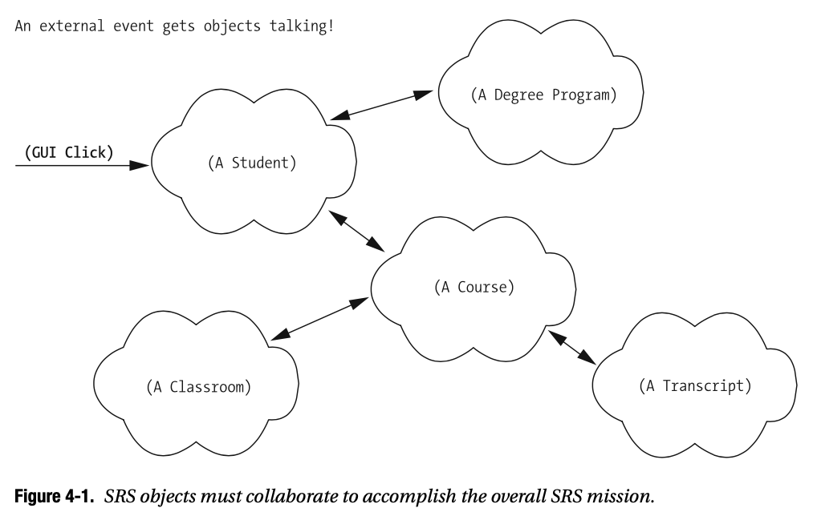
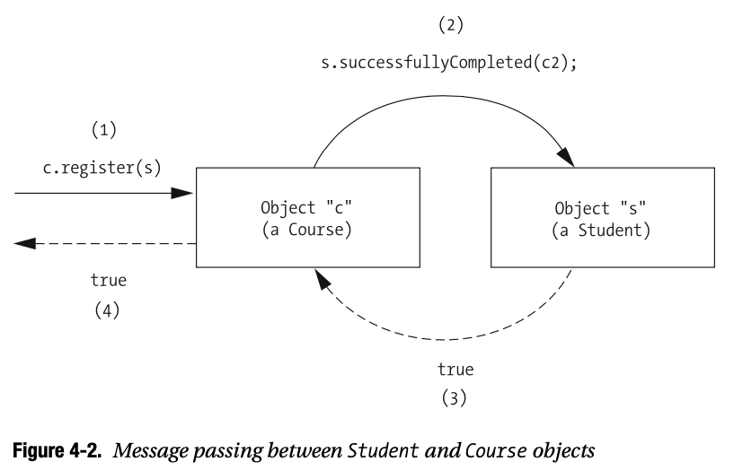
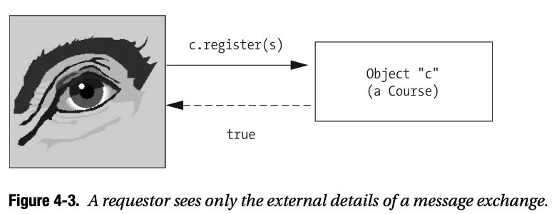
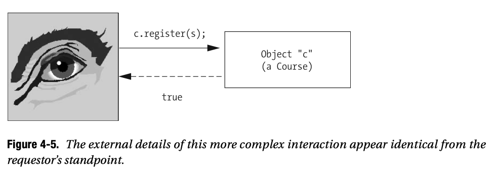
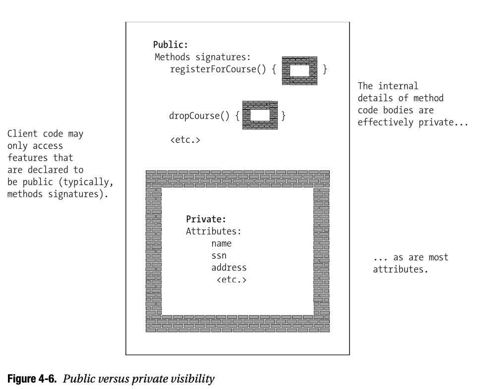
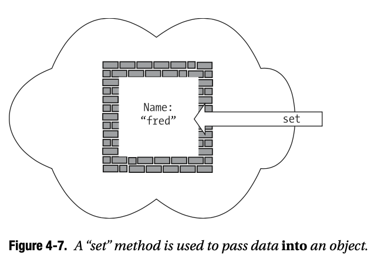
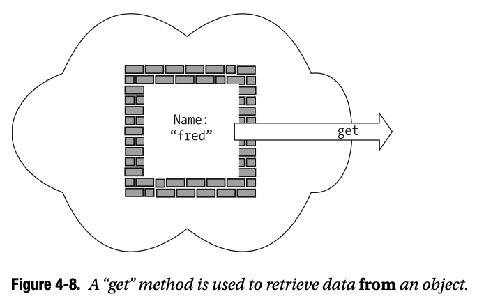
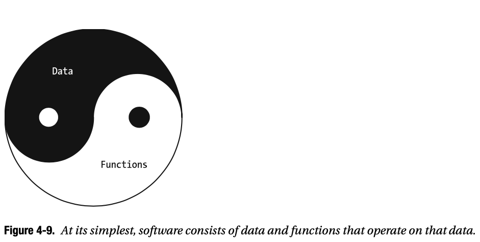
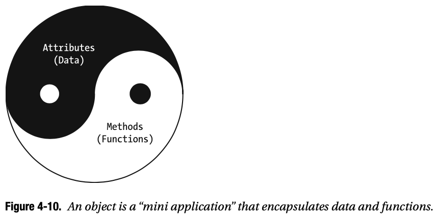

# 04 Interacciones entre Objetos

Como aprendió en el Capítulo 3, los objetos son los componentes básicos de un sistema de software orientado a objetos. En tal sistema, los objetos colaboran entre sí para lograr metas enun sistema común, similares a las hormigas en un hormiguero, o los empleados de una corporación, o las células de su cuerpo. Cada objeto tiene una estructura y una misión específicas; estas respectivas misiones se complementan entre sí para lograr la misión general del sistema en su conjunto.

En este capítulo, aprenderá

* Cómo se utilizan los métodos para especificar el comportamiento de un objeto
* Los diversos elementos del código que crean un método
* Cómo los objetos publican sus métodos como servicios para otros
* Cómo los objetos se comunican con uno, otro, y los servicios de otro para colaborar
* Cómo los objetos mantienen sus datos y cómo protegen sus datos para garantizar su integridad.
* El poder de los lenguajes OO tienen una característica conocida como **ocultación de información**, y cómo la ocultación de información se puede utilizar para limitar el efecto dominó en el código de una aplicación cuando los detalles privados de implementación de una clase cambian inevitablemente.

* Cómo un tipo especial de función conocida por un constructor puede usarse para inicializar el estado de un objeto cuando se instancia por primera vez

## Events Drive Object Collaboration - Los Eventos Impulsan la Colaboración de Objetos

En su forma más simple, el proceso de desarrollo de software orientado a objetos implica los siguientes cuatro pasos básicos:

1. Establecer adecuadamente los requisitos funcionales y la misión general de una aplicación.
2. Diseñar las clases apropiadas, sus estructuras de datos, comportamientos y relaciones entre sí, necesarias para cumplir con estos requisitos y misión.
3. Creación de instancias de estas clases para crear los tipos adecuados y el número de instancias de objetos
4. Configurar estos objetos en movimiento a través de **external triggering events- eventos desencadenantes externos**

Piense en un hormiguero: a primera vista, es posible que no vea ninguna actividad aparente. Pero si dejas caer una barra de chocolate cerca, una ráfaga de actividad comienza repentinamente cuando las hormigas se apresuran a recoger las "golosinas", así como a reparar cualquier daño que pueda haber sido causado si dejaste caer la barra de chocolate demasiado cerca del hormiguero!

Dentro de una aplicación orientada a objetos (el "hormiguero"), los objetos ("hormigas") pueden ser puestos en movimiento por un evento externo como

* El clic de un botón en la interfaz de usuario gráfica SRS, indica el deseo del alumno de registrarse en un curso en particular.
* La recepción de información de algún otro sistema automatizado, como cuando el SRS recibe una lista de todos los estudiantes que han pagado su matrícula del sistema de facturación de la universidad.

Tan pronto como un sistema OO ha detectado un evento desencadenante de este tipo, los objetos apropiados reaccionan, prestando servicios ellos mismos y/o solicitando servicios de otros objetos en forma de reacción en cadena, hasta que se haya logrado algún objetivo general de la aplicación. Por ejemplo, la solicitud para registrarse en un curso realizada por un usuario estudiante a través de la GUI de la aplicación SRS puede involucrar la colaboración de muchos objetos diferentes, como se ilustra en la Figura 4-1:

* Un objeto `Student` (una abstracción de un usuario estudiante ***real***)
* Un objeto `DegreeProgram` (programa de acuerdo) con el objetivo de garantizar que el curso solicitado sea realmente necesario para que el alumno pueda graduarse
* El objeto `Course` apropiado, para asegurarse de que haya disponible para el alumno en ese curso
* Un objeto `Classroom` (aula), que representa la sala en la que se realizará el curso, para verificar su capacidad de asientos.
* Un objeto `Transcript` (transcripción), específicamente, la `Transcript` del `Student` de interés, para asegurar que el estudiante haya cumplido con todos los requisitos previos del curso.



Mientras tanto, un estudiante que usa el SRS es felizmente ignorante de todos los objetos que están “correteando” detrás de escena para lograr su objetivo. El estudiante simplemente completa algunos campos y hace clic en un botón en la GUI de SRS, y unos momentos después ve un mensaje que confirma o rechaza su solicitud de registro.

Una vez que se ha logrado el objetivo final de una cadena de eventos (por ejemplo, registrar a un estudiante en un curso), los objetos de una aplicación se vuelven inactivos y pueden permanecer así hasta que ocurra el siguiente evento desencadenante. Una aplicación orientada a objetos es en cierto modo similar a un juego de billar: golpea la bola blanca con tu taco, y (¡con suerte!) Golpea otra bola, que podría chocar con otras tres bolas, y así sucesivamente. Eventualmente, sin embargo, todas las bolas se detendrán hasta que la bola blanca sea golpeada nuevamente.

## Declaración de Métodos

Hablemos con un poco más de detalle sobre cómo especificamos formalmente el comportamiento de un objeto como métodos Java. Recuerde del Capítulo 3 que los comportamientos de un objeto pueden considerarse como servicios que el objeto puede realizar. Para que un objeto A solicite algún servicio de un objeto B, A necesita saber el lenguaje específico con el que comunicarse con B. Es decir,

* ***El objeto A necesita ser limpiado para saber exactamente cuál de los métodos/servicios de B desea realizar**. Piense en usted mismo como el objeto A y en un perro como el objeto B. ¿Quiere que su perro se siente? ¿Permanecer? ¿Tacón? ¿Ir a buscar?
* ***Dependiendo de la solicitud de servicio, es posible que el objeto A necesite dar a B algo de información adicional para que B sepa exactamente cómo proceder**. Si le dice a su perro que vaya a buscar, el perro debe saber qué buscar: ¿una pelota? ¿Un palo? ¿El gato del vecino?
* ***El objecto B necesita saber si el objeto A espera B para informar el resultado de lo que se le ha pedido que haga**. En el caso de un comando para buscar algo, es de esperar que su perro le traiga el artículo solicitado como resultado. Sin embargo, si su perro está en otra habitación y grita el comando "¡Siéntese!", No verá el resultado de su comando; tienes que confiar en que el perro ha hecho lo que le pediste.

Nos encargamos de especificar/definir estos tres aspectos de cada método declarando un **encabezado de método**. Luego debemos programar la lógica detrás de escena de cómo B realizará el servicio solicitado en el cuerpo del método.

<hr>
Para los lectores familiarizados con el lenguaje de programación C, una declaración de método Java es prácticamente la misma sintácticamente que una declaración de función C. La única diferencia filosófica entre una función en un lenguaje que no es OO como C y un método en un lenguaje OO como Java es el contexto en el que se ejecutan: una función que no es OO es ejecutada por el entorno de programación como un todo, mientras que un método en un lenguaje OO es ejecutado por un objeto particular. Exploraremos esta diferencia con más detalle a medida que se desarrolla este capítulo.
<hr>

Veamos primero los encabezados de los métodos.

### Method Headers - Encabezados de métodos

El **encabezado de un método** es una especificación formal (desde el punto de vista de la programación) de cómo ese método debe invocarse. Un encabezado de método, como mínimo, consta de:

* **Tipo de retorno** de un método: es decir, el tipo de información que el objeto B va a devolver al objeto A, si lo hay, cuando el método de B termina de ejecutarse.
* Nombre de un método.
* Una opción de una lista de parámetros formales separados por comas (que especifican los tipos y nombres) que se pasarán al método, entre paréntesis. Si no es necesario pasar parámetros, se utiliza un conjunto vacío de paréntesis; se dice que tales métodos “no toman parámetros” y nos referiremos a ellos como sin parámetros.

Como ejemplo, aquí hay un encabezado de método típico que podríamos definir para la clase `Student`:

```java
boolean  registerForCourse(String courseID, int secNo)
- tipo de retorno 
- nombre del método 
- lista de parámetros formales separados por comas, entre paréntesis
  (los paréntesis pueden dejarse en blanco)
```

<hr>
Al referirse casualmente a un método como `registerForCourse` en texto narrativo, algunos autores adjuntan un conjunto vacío de paréntesis, (), al nombre del método, por ejemplo, `registerForCourse()`. Sin embargo, esto no implica necesariamente que el encabezado ***formal*** no tenga parámetros.

#### Convenciones de Nombres de Métodos

Los nombres de los métodos Java se crean utilizando el estilo camel casing; Recuerde del Capítulo 2 que los nombres de las variables también se elaboran con camel casing . A modo de repaso, con camel casing 

* La primera letra del nombre del método está en minúsculas.
* La primera letra de cada palabra concatenada posterior en el nombre del método está en mayúsculas y los caracteres restantes están en minúsculas.
* No use ningún carácter de "puntuación" (guiones, guiones bajos, etc.) para separar estas palabras.

Por ejemplo, `chooseAdvisor` es un nombre de método apropiado, mientras que ninguno de los siguientes sería apropiado: `ChooseAdvisor` ("C" mayúscula), `chooseadvisor` ("a" minúscula), `choose_advisor` (separando con guión bajo).

#### Pasar Argumentos a los Métodos
El propósito de pasar argumentos a un método es doble:

* Para proporcionarle el "combustible" (opcional) necesario para realizar su trabajo 
* Para orientar su comportamiento de alguna manera

Con el método `registerForCourse` mostrado anteriormente, por ejemplo, es necesario decirle al objeto `Student` específico que realiza el método en qué curso queremos que se registre; lo haremos pasando dos argumentos, un ID de curso (p. ej., "MATH 101") y un número de sección (p. ej., 10, que coincide con los lunes por la noche de 8:00 a 10:00 p. m.), como se ilustra aquí:

```java
boolean registerForCourse(String courseID, int secNo)
```

Si hubiéramos declarado en su lugar el encabezado del método `registerForCourse` con una lista de parámetros ***vacía***

```java
boolean registerForCourse()
```
la solicitud sería ambigua, porque el objeto `Student` que realiza este método no tendría idea de en qué sección se espera que se registre.

Sin embargo, no todos los métodos requieren tal "combustible"; algunos métodos pueden producir resultados basándose únicamente en la información almacenada internamente dentro de un objeto como valores de atributo, en cuyo caso no se necesita orientación adicional en forma de argumentos. Por ejemplo, el método

```java
int getAge()
```

está diseñado para no tener parámetros porque un objeto `Student` presumiblemente puede decirnos su edad sin tener que darnos ninguna información de calificación, tal vez comparando el valor de su atributo `birthDate` con la fecha del sistema. Sin embargo, digamos que queríamos que un objeto `Student` pudiera informar su edad expresada en años o meses; en tal caso, es posible que deseemos declarar el método `getAge` de la siguiente manera:

```java
int getAge(int ageType)
```

permitiéndonos pasar un argumento `int`(eger) para que sirva como indicador de control para informar al objeto `Student` de cómo queremos que se devuelva la respuesta. Es decir, podríamos programar el método `getAge` para que:

* Si spasamos un valor de 1, significa que queremos que se devuelva el valor de los años.
* Si pasamos un valor de 2, queremos que se devuelvan los datos en períodos de meses (por ejemplo, un estudiante de 21 años respondería que tiene 252 meses).

Una forma alternativa de manejar el requisito de recuperar la edad de un objeto `Student` en dos formas diferentes sería definir dos métodos separados, como quizás el siguiente:

```java
int getAgeInYears()
int getAgeInMonths()
```
pero en la programación orientada a objetos, es una práctica común controlar el comportamiento de un método a través de los valores (y tipos) de argumentos.

<hr>
<h3>UN POCO DE TERMINOLOGÍA</h3>

Para asegurarnos de que todos comprendan la diferencia entre "parámetro" y "argumento", ambos términos genéricos que son igualmente aplicables a los lenguajes de programación OO y no OO, definiremos ambos términos aquí.

Un **parámetro** es una variable de ámbito local, declarada en el encabezado de un método, que aparece temporalmente mientras se ejecuta un método. Por ejemplo, cuando se invoca el método de raíz cuadrada (lenguaje C), declarado de la siguiente manera:

```c
// C code.
double sqrt(double x) { ... }
```

el parámetro `x` (de tipo `double`) aparece temporalmente mientras se ejecuta el método. `x` se inicializa con el valor del argumento que se pasa cuando se invoca el método:

```c
// C code. 
double y = 39.7;
```

Aquí, estamos invocando la función `sqrt`, pasando un valor de argumento de 39,7.

```c
double z = sqrt(y);
```

En este caso, dado que estamos invocando el método `sqrt` con un valor de ***argumento*** de 39,7, el ***parámetro*** `x` se inicializa con el valor 39,7.

Mientras se ejecuta el método, el cuerpo del método puede hacer referencia a la variable `x` como crea conveniente; sin embargo, la variable `x` deja de existir en lo que respecta al compilador, es decir, `x` ***sale del alcance*** (un concepto que discutimos en el Capítulo 2) cuando el método termina.


```c
double sqrt(double x) {
   // Use el valor de x según corresponda. 
   if (x < 0) { ... }
   else { ... }
   // Pseudocode.
    return result; 
}
/ "x" sale del alcance aquí ... solo se define localmente en el método sqrt.
```

Aunque los términos “parámetro” y “argumento” se usan indistintamente con frecuencia y de manera casual, la conclusión es que son conceptos diferentes, es decir, ***los argumentos son valores; los parámetros son variables***.
<hr>

### Tipos de Retorno de un Método

Se muestra que el método `registerForCourse` como se declaró anteriormente tiene un tipo de retorno de `boolean`, lo que implica que este método devolverá uno de los siguientes dos valores:

* Un valor de verdadero, para indicar “misión cumplida”, es decir, que el estudiante objeto se ha registrado con éxito en el curso para el que se le indicó que se registre.
* Un valor de falso, para indicar que la solicitud de registro ha sido denegada por alguna razón. Quizás la sección deseada estaba llena, o el estudiante no cumplía con los requisitos previos del curso, o el curso/sección solicitada se ha cancelado, etc.

<hr>
En el Capítulo 13, aprenderá técnicas para comunicarse y determinar con precisión ***por qué*** ha fallado la misión de un método cuando analicemos el **manejo de excepciones**.
<hr>

Tenga en cuenta que un método puede diseñarse de manera que no devuelva nada, es decir, puede realizar sus actividades en silencio, sin necesidad de informar el resultado de sus esfuerzos. Si es así, se declara que tiene un tipo de retorno de `void` (vacío) (otra de las palabras clave de Java). Como ejemplo, considere el encabezado del método `Student`:

```java
void setName(String newName)
```

Este método requiere un argumento (una cadena que representa el nuevo nombre que queremos que asuma este objeto `Student`) y funciona "silenciosamente" al establecer el atributo de nombre interno del objeto `Student` en cualquier valor que se esté pasando al método, sin devolver ninguna respuesta.

Aquí hay un ejemplo adicional de un encabezado de método que podríamos declarar para la clase `Student` con un tipo de retorno `void`:

```java
void switchMajor(String newDepartment, Professor newAdvisor)
```

Este método representa una solicitud para que un objeto `Student` cambie su campo principal de estudio, lo que implica la designación de un nuevo departamento académico (por ejemplo, "BIOLOGÍA") y una referencia al objeto de profesor que debe servir como asesor del estudiante en este nuevo departamento.

Este método representa una solicitud para que un objeto `Student` cambie su campo principal de estudio, lo que implica la designación de un nuevo departamento académico (por ejemplo, "BIOLOGÍA") y una referencia al objeto de profesor que debe servir como asesor del estudiante en este nuevo departamento.
El ejemplo anterior demuestra que podemos declarar parámetros de cualquier tipo, incluidos los tipos definidos por el usuario, como `Professor`. Lo mismo ocurre con el tipo de retorno de un método, por ejemplo, un método con el siguiente encabezado:

```java
Professor getAdvisor()
```

podría usarse para preguntar a un objeto `Student` quién es su asesor. En lugar de simplemente devolver el nombre del asesor, el objeto `Student` devuelve una referencia al objeto `Professor` en su conjunto (según lo registrado por el atributo interno de la facultad del StudentAdvisor; aprenderá a informar a un objeto Student de qué objeto Professor debe servir como su consejero de la facultad un poco más adelante en el capítulo).
Tenga en cuenta que un método puede devolver como máximo un resultado, lo que puede parecer limitante. ¿Qué pasa si, por ejemplo, queremos pedirle a un objeto Estudiante una lista de todos los Cursos que el Estudiante ha tomado alguna vez? ¿Debemos pedirlos uno por uno a través de múltiples llamadas a métodos? Afortunadamente no: el resultado devuelto por un método en realidad puede ser una referencia a un objeto de complejidad arbitraria, incluido un tipo especial de objeto llamado colección que puede contener referencias a muchos otros objetos. Hablaremos sobre colecciones en profundidad en el Capítulo 6.
Una analogía
Usemos una analogía para ayudar a ilustrar lo que hemos discutido hasta ahora sobre los métodos. Con respecto a las tareas del hogar, digamos que una persona es capaz de
• Sacar la basura • Cortar el césped
• Lavando el carro
 











