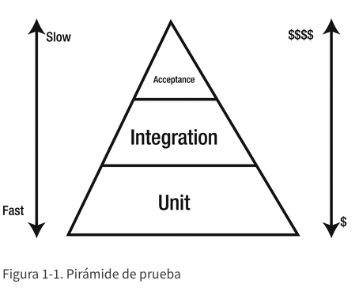

# 1. Construir software de la manera correcta

Los programadores aprenden muy rápidamente que la escritura de software es difícil y propensa a errores. Una y otra vez los proyectos de software fallan porque los equipos no pueden hacer frente a la complejidad del software. Como resultado, el proyecto no cumple con el plazo, cuesta mucho más de lo esperado y no entrega el valor comercial previsto.

Si miramos hacia atrás, la programación de software como profesión tiene solo unas pocas décadas. En su corta vida útil, hemos visto múltiples procesos de desarrollo de software y hemos descubierto algunas mejores prácticas. Hemos aprendido que, como cualquier otro proceso evolutivo, el software también evoluciona con el tiempo. Por lo tanto, debemos adaptarnos al cambio en lugar de ceñirnos a un plan estricto. También hemos descubierto que el desarrollo es un proceso colaborativo: muchas personas trabajan en diferentes partes del software para crear algo que satisfaga las necesidades del cliente. Diferentes personas desempeñan diferentes roles de manera iterativa para determinar el futuro de un producto. Muchas organizaciones están adoptando el proceso de desarrollo de software ágil para ayudarlas a hacer frente a los requisitos comerciales en constante cambio. Como dicen, *la única constante es el cambio*.

El desarrollo basado en pruebas (TDD) es una de las prácticas del desarrollo de software ágil que muchos desarrolladores utilizan de alguna forma. La premisa de TDD es que escribe un caso de prueba fallido antes de escribir el código de producción en sí. TDD, si se hace correctamente, puede ayudarlo a escribir software que cumpla con las expectativas del cliente , tenga un diseño simple y tenga menos defectos.

En este capítulo, lo ayudaremos a comprender por qué, como programador profesional, debe aprender y seguir las prácticas de TDD. Aprenderá a configurar un proyecto JUnit 5 de Java 8 basado en Gradle. Proporcionaremos una breve introducción a las nuevas funciones de Java 8 para que se sienta como en casa en caso de que no haya trabajado con Java 8 antes. Terminaremos el capítulo escribiendo un ejemplo sencillo siguiendo la práctica de TDD. Este capítulo lo preparará para futuros capítulos en los que usaremos TDD para crear una aplicación que funcione completamente y demostrar las características avanzadas de JUnit 5.

## Desarrollo basado en pruebas

¿Recuerda la última vez que quiso hacer un cambio para corregir un defecto crítico que descubrió un cliente? ¿Estaba seguro de que su solución no introduciría un error de regresión? Además, piense en la última vez que quiso refactorizar su código pero temió que su cambio pudiera romper algo más. Esto sucede mucho en el desarrollo de software: el miedo a romper el software. Incluso los mejores programadores cometen errores e introducen defectos.

Los proyectos de software implican muchas incertidumbres. Trabajamos con nuevas tecnologías, requisitos en constante cambio, movimiento de personas o una combinación de estos. Para superar el miedo y gestionar estas incertidumbres, necesitamos una práctica de desarrollo de software que pueda ayudarnos a producir software que funcione. Debe mantener las cosas simples y proporcionarnos comentarios rápidos en caso de que algo salga mal.

El desarrollo impulsado por pruebas, redescubierto por Kent Beck en 2003, es una práctica de desarrollo que aumenta la confianza del desarrollador al recomendar pruebas para todos los requisitos de software. Nos hace trabajar en ciclos de desarrollo incrementales cortos (unos minutos), proporcionando así una rápida retroalimentación sobre nuestro progreso. TDD nos obliga a escribir una prueba fallida antes de escribir el código de producción . El proceso completo se ve como sigue:

1. Agregue una prueba para la nueva funcionalidad o comportamiento.

2. Véalo fallar.

3. Escriba suficiente código para aprobar la prueba.

4. Asegúrese de que todas las pruebas anteriores también pasen.

5. Refactorice el código.

6. Repita hasta que esté listo.

La parte clave aquí es escribir primero una prueba fallida. La prueba especifica nuestra comprensión del sistema. Estamos escribiendo lo que esperamos que haga el sistema cuando se realice alguna acción. Esto nos ayuda a comprender claramente el sistema.

Este libro se centrará en el enfoque de prueba primero de TDD. Hay muchos programadores que escriben test al final. Creemos que el enfoque de la última prueba no lo ayuda a lograr el beneficio completo de TDD. A veces, TDD se denomina diseño basado en pruebas (es decir, las pruebas deberían ayudarlo a diseñar el sistema). La parte de diseño de TDD es más importante que la parte de prueba. Cuando probamos por última vez, no cosechamos el beneficio de diseño de la práctica.

En el desarrollo de software, la retroalimentación rápida es la clave para la productividad del software. TDD nos informa rápidamente de que nos estamos moviendo en la dirección correcta. De alguna manera, mantiene nuestra mente enfocada y positiva. Creemos en nuestro código, ya que cumple con las expectativas del usuario final escritas en las pruebas.

TDD nos ayuda a lograr dos objetivos importantes:

* Detecta errores de regresión.

* Mantenga el diseño del sistema simple.

Analicemos cada uno de estos aspectos en detalle.

### DETECTAR ERRORES DE REGRESIÓN

La razón más obvia para seguir TDD es detectar errores de regresión de forma automatizada. Los equipos que siguen TDD tienen la libertad de cambiar y agregar nuevas funciones sin preocuparse por introducir regresiones. Si todos los casos de prueba anteriores funcionaron bien, entonces podemos estar seguros de que no hemos introducido ningún error de regresión. Además, a medida que seguimos agregando pruebas para el nuevo comportamiento, la red de seguridad sigue creciendo. Estos casos de prueba dan sus frutos cada vez que alguien hace un cambio. Cuanto antes detectemos un error en el código, más rápido y económico será solucionarlo. Esto está validado por los datos compartidos por Google que puede ver en la Tabla 1-1 .

Tabla 1-1. Costo de corregir errores

Fase de prueba de software donde se encontró el error | Costo estimado por error
------------------------------------------------------|-------------------------
Prueba del sistema | $ 5,000
Examen de integración | $ 500
Construcción completa | $ 50
Prueba unitaria / Desarrollo basado en pruebas | $ 5

Algunas personas pueden no ver el valor de escribir pruebas. Prefieren probar el código manualmente o usar declaraciones de registro para depurar el código cuando las cosas van mal. El acto de probar manualmente es engorroso y requiere mucho tiempo. Además de esto, es difícil cubrir manualmente todos los casos de esquina de cualquier software no trivial. Los humanos suelen ser buenos para comprobar los caminos felices (es decir, escenarios que siempre funcionan). Por lo tanto, existe una gran posibilidad de que las pruebas manuales pierdan algunos casos de esquina.

Si el sistema está escrito siguiendo TDD , cada vez que descubra un error, el equipo agregará un caso de prueba adicional que reproduzca el error. Ahora, podrá realizar cambios en el código de producción para aprobar el caso de prueba fallido. Esto asegurará que se maneje la caja de la esquina. Además, como este estuche de esquina ahora es parte del conjunto de pruebas automatizadas, puede estar seguro de que no se lo volverá a perder.

### MANTENGA EL DISEÑO DEL SISTEMA SIMPLE

Las pruebas automatizadas escritas por programadores se han considerado tradicionalmente un esfuerzo de garantía de calidad. Su objetivo es verificar la corrección de una implementación en el momento de redactarla y verificar su corrección en el futuro a medida que evoluciona el código. Las pruebas son solo la mitad de la historia. Demostraremos, a lo largo de este libro, que TDD es esencialmente una herramienta de diseño y que las pruebas son solo un efecto secundario.

Una de las formas en que las personas ven el desarrollo de software es dividiéndolo en diferentes fases. Las dos fases más comunes son

* Diseño

* Codificación

A menudo, un equipo diseña el sistema y otro equipo lo implementa. Cuando las personas intentan implementar un diseño creado por otros, a menudo no funciona. Los programadores enfrentan muchos desafíos cuando comienzan a implementar el diseño propuesto.

TDD rompe el mito de la fase separada de diseño y codificación al promover la idea de que el código es diseño. No necesitamos un gran diseño inicial que siempre se queda corto cuando implementamos cosas. Necesitamos un diseño justo a tiempo que evolucionará a medida que se construya el sistema.

Cuando comenzamos a escribir pruebas , comenzamos a diseñar el código con una persona que llama en la mente. Las pruebas se convierten en cliente del código. Las pruebas nos ayudan a escribir el código suficiente para cumplir con el comportamiento requerido. Una vez que tenemos una prueba aprobada, refactorizamos el código sin piedad. TDD a menudo se ve como un ciclo continuo de ROJO -> VERDE -> REFACTOR. Es la etapa de refactorización donde emerge el diseño. La refactorización se define como la mejora del diseño del código existente sin cambiar su comportamiento externo. Las pruebas nos ayudan a ganar confianza en que nuestro código funciona como se esperaba. Ahora, podemos refactorizar el código de forma segura. En caso de que hagamos un cambio importante durante la refactorización, el caso de prueba fallará. Por lo tanto, nos ahorra la introducción de un efecto secundario no deseado durante la refactorización.

La fase de refactorización de TDD es la fase más crítica. Mientras refactoriza, piense en el Código de conducta de Boy Scout:

**Siempre deje el campamento más limpio de lo que lo encontró.**

Refactorizar no significa que tengas que perfeccionar tu código. Intente hacer que el código sea un poco mejor que cuando lo revisó por primera vez. Puede mejorar el nombre de una variable, método o clase. Puede dividir una función grande en funciones más pequeñas o extraer una preocupación a una clase diferente. El objetivo es hacer que la versión actual sea mejor que la versión anterior. Si seguimos esta práctica todos los días, avanzaremos hacia una base de código más simple y legible.

TDD como herramienta de diseño requiere un cambio de mentalidad. No sucederá en un día. Se necesita práctica constante para dominar y cosechar los beneficios.

TDD nos obliga a escribir clases poco acopladas para que podamos probarlas fácilmente de forma aislada. Nos vemos obligados a hacer que las dependencias sean explícitas para probar el código específico de forma aislada. Escribimos pequeños módulos cohesivos que hacen una cosa para que podamos probar comportamientos específicos. Los módulos se pueden ampliar en el futuro para cumplir con los requisitos cambiantes . Todas estas son buenas prácticas de diseño impuestas por TDD. Todo esto facilita la lectura y la comprensión del código. Varios estudios nos dicen que los programadores dedican más tiempo a leer y comprender el código que a escribirlo. En 2007, Microsoft realizó una encuesta en la que el 95% de los encuestados estuvo de acuerdo en que comprender el código existente es una parte importante de su trabajo.

## Niveles de prueba

A medida que comience a practicar TDD, redactará diferentes niveles de pruebas. Su aplicación debe estar compuesta por pruebas en cada uno de los siguientes niveles. Cada uno de estos niveles se centra en un aspecto diferente del código y proporciona diferentes comentarios. Veámoslos uno por uno.

* Prueba unitaria : aquí prueba componentes de software individuales para verificar si la unidad individual hace lo correcto de forma aislada.

* Prueba de integración: aquí prueba varias unidades juntas para verificar si funcionan correctamente como una unidad.

* Prueba de aceptación: aquí prueba el sistema completo para verificar si funciona según las expectativas del usuario. A menudo se denomina prueba funcional.

La figura 1-1 muestra una pirámide de prueba. El punto que transmite la Figura 1-1 es que debe tener muchas más pruebas unitarias que pruebas funcionales o de integración. Este libro se centrará principalmente en las pruebas unitarias, pero también debería dedicar tiempo a aprender sobre los otros dos tipos de pruebas.

Figura 1-1. Pirámide de prueba

El concepto de prueba unitaria se remonta a 1976 cuando David J. Panzal presentó Procedimientos de prueba: un nuevo enfoque para la verificación de software en la segunda conferencia internacional sobre ingeniería de software. El documento describe el procedimiento de prueba como una forma de invocar un caso de prueba en un módulo de destino para generar un informe que indique si el "caso de prueba" ha fallado. Estos procedimientos de prueba son parte de los entregables del producto y se pueden utilizar como validación inicial del producto y prueba de regresión posterior. Estos procedimientos se escribieron para FORTRAN en un lenguaje llamado lenguaje de procedimientos de prueba (TPL)

Beneficios de las pruebas unitarias
Como se discutió anteriormente, las pruebas unitarias ya no son un ejercicio posterior al desarrollo. Es tan importante como escribir el código de producción y debe hacerse por adelantado. Mejora la productividad del equipo al proporcionar bases sólidas. Veamos en detalle los beneficios que ofrece la prueba unitaria.

DETERMINA LAS ESPECIFICACIONES
Antes de comenzar el viaje de codificar un componente, debemos intentar determinar qué debe hacer el componente. Intente construir un caso de prueba de las posibles entradas y salidas posibles. El acto de crear casos de prueba al principio ayuda a aclarar el comportamiento esperado del componente.

Si no podemos realizar una prueba, significa que las especificaciones no son lo suficientemente explícitas y requieren más reflexión.

PROPORCIONA DETECCIÓN TEMPRANA DE ERRORES
Las pruebas unitarias son una prueba del código de trabajo. Se ejecutan en cada compilación y pueden detectar fallas en la primera instancia.

Las pruebas unitarias pueden detectar no solo errores de codificación, sino también fallas en las especificaciones del producto. Una prueba unitaria demuestra el progreso; por lo tanto, tan pronto como se complete un componente, se puede mostrar a las partes interesadas para encontrar brechas, si las hay. Cuanto antes se descubra un error, más barato será solucionarlo.

APOYA EL MANTENIMIENTO
Las especificaciones del producto evolucionan con el tiempo. Estos cambios conducen a ciclos de desarrollo. En cada uno de estos ciclos, el equipo debe comprender cómo funciona el código existente antes de que los miembros del equipo puedan realizar cambios. Las pruebas unitarias ayudan a comprender el comportamiento previsto sin verse atascados por el código real. Un conjunto de pruebas unitarias bien redactado sirve como un impulso de productividad para el equipo.

MEJORA EL DISEÑO
Las pruebas unitarias son el primer cliente del código que se prueba. Descubren varios problemas que un cliente puede enfrentar mientras interactúa con el código que se está probando. Las pruebas unitarias nos hacen pensar en términos de la entrada esperada y la salida esperada. Para los componentes internos (servicio, servicios públicos, etc.), esto puede ayudar a clasificar los límites de responsabilidad. Ayuda a mejorar las especificaciones del producto al exponer las lagunas en el diseño de la interfaz.

DOCUMENTACIÓN DEL PRODUCTO
Las pruebas unitarias describen cómo funciona un fragmento de código, es decir, el resultado esperado para una entrada determinada. Siempre describen el estado más reciente de una especificación, ya que se mantienen sincronizados con los cambios de código.

Características de las buenas pruebas unitarias
Las pruebas deben escribirse con el mismo enfoque y claridad que el código de producción. Debemos refactorizar los casos de prueba para que se mantengan delgados y correctos. Las pruebas solo obtendrán beneficios si las personas pueden comprenderlas y confiar en ellas.

Al seguir TDD, las pruebas de alta calidad son la clave del éxito. Una cosa es simplemente tener pruebas y otra cosa es tener pruebas de alta calidad. Las pruebas deben tener varias características para que sigan siendo útiles durante toda su vida. Ellos deberían ser

Legible : uno de los objetivos de una prueba es educar al lector sobre lo que hará la unidad que se está probando. Si las pruebas no son legibles, el lector no podrá comprender cuándo fallarán las pruebas. Un buen caso de prueba de unidad tiene un nombre significativo para que el lector comprenda el comportamiento de la unidad que se está probando sin mirar los detalles de implementación.

Rápido : las pruebas deben ejecutarse en unos segundos para que proporcionen comentarios rápidos. Si las pruebas toman más tiempo, el programador buscará formas de omitirlas. Las pruebas unitarias deben simular dependencias externas para que las pruebas se ejecuten de forma rápida e independiente de los servicios externos. Mocking permite probar una unidad de código simulando el comportamiento de sus dependencias de manera controlada.

Independiente y aislada : las buenas pruebas unitarias son independientes del orden de ejecución. No dependen de otras pruebas unitarias para que funcionen correctamente. Deben funcionar de forma independiente en su propio entorno aislado.

Correcto : una buena prueba unitaria hace lo que dice. Un caso de prueba debe corresponder a un solo caso (es decir, comportamiento). A menudo, las pruebas no hacen lo que sugiere su nombre. Esto es muy arriesgado, ya que en ese caso no puede confiar en sus pruebas.

Independiente del medio ambiente : una prueba de fuego para cualquier proyecto de software es la siguiente: "¿Puede verificar el código en una máquina de desarrollo limpia y ejecutar la compilación completa, incluidas las pruebas, sin ningún problema?" La mayoría de las veces, encontramos que las pruebas unitarias fallan porque dependen de algún factor externo. El factor externo podría ser un archivo en una ubicación particular, una variable de entorno u otra cosa. Esto conduce a pruebas frágiles. Una buena prueba unitaria no depende del medio ambiente.

Repetible : una buena prueba unitaria produce el mismo resultado cada vez que la ejecuta. La ejecución de la prueba debe automatizarse mediante la herramienta de compilación. Deben ser parte del proceso de compilación automatizado para que se ejecuten cada vez que ejecute la compilación. Cuando las pruebas comienzan a fallar al azar, los programadores comienzan a ignorarlas. Estas fallas de prueba aleatorias son difíciles de reproducir y normalmente ocurren en sistemas externos como servidores de integración continua. El equipo debe asegurarse de que las pruebas fallidas se solucionen tan pronto como se descubran.

Introducción a JUnit
JUnit, desarrollado por Kent Beck y Erich Gamma, es uno de los marcos de prueba de unidades más populares para los desarrolladores de Java. Originalmente se basó en SUnit, un marco de pruebas unitarias escrito en Smalltalk (desarrollado por Kent Beck). La primera versión de JUnit fue lanzada en 1997. Desde entonces se ha convertido en el estándar de facto, adoptado en muchos idiomas diferentes y por muchas herramientas. Martin Fowler destaca la importancia del marco JUnit en su cita:

Nunca en el campo del desarrollo de software tantos le deben tanto a tan pocas líneas de código.

Antes de la introducción de JUnit, la disciplina de las pruebas estaba dominada por las herramientas de prueba de captura y reproducción . Estas herramientas eran herramientas de prueba de caja negra , que solían capturar el estado del sistema con una entrada determinada y luego intentar reproducirlo. Las pruebas escritas en tal marco implicaron una enorme cantidad de esfuerzo. Estas herramientas no fueron diseñadas para realizar pruebas unitarias de un componente, ya que probaron la aplicación utilizando su interfaz gráfica de usuario (GUI).

JUnit rechazó la idea de pruebas basadas en GUI. En su lugar, proporcionó un marco ligero, que permitió la creación de pruebas escribiendo código en Java. Esto permitió a los desarrolladores crear suites de prueba para cada parte de su código. Debido a sus beneficios, JUnit se integró con todo tipo de herramientas de compilación y entornos de desarrollo integrados (IDE).

El equipo de JUnit ha sido experto en utilizar las nuevas funciones del lenguaje Java. Después del lanzamiento de Java 5, que permitió el uso de anotaciones, genéricos, etc., JUnit 4.0 se lanzó con características como @Test y @Setup. Kent Beck dijo lo siguiente sobre JUnit 4:

El tema de JUnit 4 es alentar a más desarrolladores a escribir más pruebas simplificando aún más JUnit.

JUnit 4.0 simplificó las pruebas unitarias alejándose de las convenciones de nomenclatura e introduciendo varias otras características como tiempos de espera y excepciones de prueba. JUnit 4.0 se lanzó hace una década, en algún momento de febrero de 2006. A lo largo de los siguientes diez años, hemos visto varios lanzamientos menores de JUnit, siendo el último JUnit 4.12, que se lanzó en diciembre de 2014. Antes de aprender más sobre JUnit 5, entendamos por qué necesitamos una nueva versión de JUnit framework.

¿POR QUÉ NECESITAMOS UNA NUEVA VERSIÓN DE JUNIT?
A medida que las pruebas de los desarrolladores ganaron impulso y madurez en los últimos años, los desarrolladores empezaron a esperar más de su marco de pruebas unitarias . Los siguientes son los motivos por los que se necesitaba una nueva versión:

Características : los desarrolladores quieren que su marco de prueba sea compatible con las pruebas de integración, mejores afirmaciones y muchas otras características para que no tengan que depender de otras bibliotecas.

Modularidad : las versiones anteriores de JUnit carecen de modularidad. Todo está empaquetado como un solo frasco. Hay un solo proyecto JUnit, que contiene todo el código base JUnit. Alcanza la modularidad mediante el uso de diferentes subpaquetes. Esto significa que todos dependen de JUnit jar: herramientas de compilación, IDE, sus pruebas de JUnit, extensiones, etc., todo usando el mismo código. El descubrimiento de pruebas y la ejecución de pruebas son un ejemplo de preocupación con respecto al acoplamiento estrecho.

Extensibilidad : JUnit 4 proporcionó extensibilidad mediante dos mecanismos:

Runner API (interfaz de programación de aplicaciones)

API de reglas

Ambos tenían sus fortalezas y limitaciones. Para escribir un ejecutor de pruebas personalizado, debe implementar el ciclo de vida de la prueba completo, que incluye la creación de instancias de la prueba, la ejecución de la prueba, la configuración y el desmontaje, etc. El mayor inconveniente de Runner API es que no puede combinar varios corredores juntos.

La API de reglas introducida en JUnit 4.7 es mucho más simple de trabajar, pero está limitada en lo que puede hacer. Una limitación de Rule API era que no podía haber una sola regla para las devoluciones de llamada tanto a nivel de método como a nivel de clase. Esto dejó mucho de JUnit en términos de extensibilidad.

Java 8 : Java 8 introduce muchas características nuevas como lambdas. Puede usar Java 8 con versiones anteriores de JUnit, pero JUnit en sí se puede mejorar mucho al admitir estas funciones.

JUNIT 5
Para superar las limitaciones mencionadas anteriormente, se inició el proyecto JUnit Lambda. JUnit Lambda era el nombre en código de JUnit 5. JUnit 5 es una reescritura completa de JUnit en Java 8. Necesitas Java 8 para usar JUnit 5. Está rediseñado desde cero, superando los errores y limitaciones de las versiones anteriores de JUnit. Esto no significa que las pruebas escritas en JUnit 3 y JUnit 4 no funcionarán con JUnit 5. El equipo de JUnit se ha asegurado de que JUnit 5 sea compatible con versiones anteriores, por lo que también puede ejecutar sus antiguas pruebas de JUnit con él. JUnit 5 es compatible con JUnit 3.8 y versiones superiores.

JUnit 5 se compone de tres subproyectos. Cada uno de estos subproyectos tiene varios módulos, que veremos más adelante.

Plataforma JUnit : proporciona una base para el lanzamiento de marcos de prueba de JVM (Java Virtual Machine). Esto incluye una API TestEngine que se puede utilizar para desarrollar un marco de prueba para que se ejecute la plataforma JUnit. También proporciona un ConsoleLauncher que pueden usar herramientas de compilación como Gradle y Maven.

JUnit Jupiter : proporciona el nuevo modelo de programación para escribir pruebas. Además, el nuevo mecanismo de extensión es parte de este subproyecto. Implementa la API TestEngine definida por JUnit Platform para que se puedan ejecutar las pruebas JUnit 5.

JUnit Vintage : proporciona una implementación de TestEngine para ejecutar pruebas JUnit 3 y JUnit 4.

La arquitectura de JUnit 5 se ve como se muestra en la Figura 1-2 . JUnit 5 reemplazó el concepto de corredores con el motor. Entonces, en el medio, hay una API de motor que se implementa tanto para JUnit 4 como para JUnit 5 API. Esto le permite ejecutar pruebas escritas con diferentes versiones de JUnit. Herramientas como Gradle, IntelliJ o Eclipse utilizan la API de inicio. Sus pruebas dependerán de que la API de JUnit 5 lo mantenga alejado de los componentes internos de JUnit.

A429029_1_En_1_Fig2_HTML.gif
Figura 1-2. Arquitectura JUnit 5
Los módulos principales de JUnit 5 son

junit-jupiter-api : este módulo define la API que necesita para escribir sus pruebas.

junit-platform-launcher : este módulo define la API del lanzador que utiliza la herramienta externa. Los lanzadores se pueden utilizar para descubrir, filtrar y ejecutar pruebas.

junit-platform-engine : proporciona la API que puede utilizar para escribir su propio TestEngine. TestEngine es responsable del descubrimiento y ejecución de pruebas.

junit-jupiter-engine : Es la implementación de la API junit-platform-engine para JUnit 5.

junit-vintage-engine : Es la implementación de la API junit-platform-engine para JUnit 3 y JUnit 4.

junit-platform-commons : contiene todas las utilidades que se utilizan en diferentes módulos.

junit-platform-console : Esto proporciona una implementación de un lanzador llamado ConsoleLauncher. ConsoleLauncher es una aplicación independiente que se utiliza para iniciar la plataforma JUnit desde la consola.

junit-platform-gradle-plugin : este es un complemento de Gradle que se puede usar para ejecutar pruebas JUnit 5.

junit-platform-surefire-provider : este módulo proporciona integración de Maven para JUnit 5.

El equipo de JUnit también está tratando de construir una base sólida para probar proveedores de herramientas y crear herramientas / IDE. En esta versión, han lanzado una Open Test Alliance ( https://github.com/ota4j-team/opentest4j ), que tiene como objetivo definir estándares para la ejecución de pruebas en JVM.

Introducción a Java 8
Java 8 ya no es un tema nuevo. Se han publicado muchos buenos libros al respecto. Aún así, muchos desarrolladores de Java desconocen el poder de Java 8. A lo largo de este libro, usaremos Java 8, por lo que proporcionaremos una breve introducción a las características importantes de Java 8 en esta sección.

Java 8 es la mayor versión de Java hasta la fecha. Viene con muchas características como lambdas, API de flujo, API de fecha y hora nueva, métodos predeterminados y estáticos en interfaces y muchos otros. En esta sección, veremos las tres características más importantes de Java 8: lambdas, API de flujo y opcional, que cambiarán la forma en que trabajamos con Java.

LAMBDAS
La característica más importante introducida en Java 8 son las expresiones lambda. Las expresiones lambda le permiten pasar el comportamiento como datos. En versiones anteriores de Java, usábamos clases internas anónimas para pasar el comportamiento. Veamos un ejemplo simple de función de ordenación de expresión lambda en la clase Colecciones de Java. La función de ordenación toma Lista y Comparador y ordena según el Comparador proporcionado.

List<String> books = Arrays.asList("Effective Java", "Clean Code", "Refactoring");
Collections.sort(books, (b1, b2) -> b1.length() – b2.length));
El fragmento de código ordena los títulos de los libros según su longitud. La salida del programa será [Refactorización, Código limpio, Java efectivo].

La expresión (b1, b2) -> b1.length () - b2.length () que se muestra en el fragmento de código es una expresión lambda de tipo Comparator <String>.

Los (b1, b2) son parámetros del método de comparación de Comparator .

b1.length () - b2.length () es el cuerpo de la función que compara la longitud de dos títulos de libros.

-> es el operador lambda que separa los parámetros del cuerpo de la lambda.

API DE STREAMS
Los flujos proporcionan una abstracción de nivel superior para expresar los cálculos en las colecciones de Java de forma declarativa. Es similar a cómo se usa SQL para consultar datos de forma declarativa en una base de datos. Declarativo significa que los desarrolladores escriben lo que quieren hacer en lugar de especificar todas las instrucciones sobre cómo se deben consultar los datos. Las transmisiones solo proporcionan operaciones de solo lectura. Nunca cambian la colección subyacente.

A continuación, se muestra un fragmento de código de ejemplo que procesa la colección en Java 7:

public class ExampleJava7 {

    public static void main(String[] args) {
        List<Book> books = getBooks();

        List<Book> programmingBooks = new ArrayList<>();
        for (Book book : books) {
            if (book.getType() == BookType.PROGRAMMING) {
                programmingBooks.add(book);
            }
        }
        Collections.sort(programmingBooks, new Comparator<Book>() {
            @Override
            public int compare(Book b1, Book b2) {
                return b1.getTitle().length() – b2.getTitle().length();
            }
        });
        for (Book book:  programmingBooks) {
            System.out.println(book.getTitle());
        }
    }
}
El código imprime todos los títulos de los libros de programación, los ordena por su longitud y finalmente los imprime en la consola. Los desarrolladores de Java 7 escriben este tipo de código todos los días. Para escribir un programa tan simple, tuvimos que escribir 15 líneas de código Java. El mayor problema con el código anterior no es el número de líneas que tiene que escribir un desarrollador, sino la intención (es decir, filtrar libros, clasificar por longitud de título y finalmente imprimirlos).

Podemos simplificar el código anterior usando la API de flujo de Java 8 como se muestra en el siguiente código:

public class ExampleJava8Stream {

    public static void main(String[] args) {
        List<Book> books = getBooks();

        List<String> programmingBookTitles = books.stream()
                .filter(book -> book.getType() == BookType.PROGRAMMING)
                .sorted((b1, b2) -> b1.getTitle().length() – b2.getTitle().length())
                .map(Book::getTitle)
                .collect(Collectors.toList());

        programmingBookTitles.forEach(System.out::println);
    }
}
El código construye una canalización que comprende múltiples operaciones de flujo, cada una de las cuales se analiza a continuación.

stream () : creó una canalización de flujo invocando el método stream () en la colección de origen (es decir, Tareas List <Book> ).

filter (Predicate <T>) : esta operación extrae elementos en la secuencia que coinciden con la condición definida por el predicado. Una vez que tenga una secuencia, puede llamar a cero o más operaciones intermedias en ella. El libro de expresión lambda -> book.getType () == BookType.PROGRAMMING definió un predicado para filtrar todos los libros de programación. El tipo de expresión lambda es java.util.function.Predicate <Book> .

sorted (Comparator <T>) : esta operación devuelve un flujo que consta de todos los elementos del flujo ordenados por el Comparador definido por la expresión lambda (es decir, (b1, b2) -> b1.getTitle (). length () - b2.getTitle () .length () en el ejemplo que se muestra arriba).

map (Función <T, R> ): Esta operación devuelve una secuencia después de aplicar la Función <T, R> en cada elemento de esta secuencia.

recopilar (toList ()) : esta operación recopila los resultados de las operaciones realizadas en el flujo en una lista .

<T> OPCIONAL
Java 8 introdujo un nuevo tipo de datos, java.util.Optional <T>, que encapsula un valor vacío. Deja clara la intención de la API. Si una función devuelve un valor de tipo Opcional <T>, les dice a los clientes que es posible que no haya un valor presente. El uso del tipo de datos Opcional hace que sea explícito para el cliente de API cuándo debe esperar un valor opcional. El propósito de usar el tipo Opcional es ayudar a los diseñadores de API a hacerlo visible para sus clientes, al observar la firma del método, si deben esperar o no un valor opcional. Hay tres métodos de creación que forman parte de la API opcional .

Opcional. vacío : se utiliza para crear un Opcional cuando no hay un valor presente. En lugar de devolver un valor nulo, devuelve Optional.empty .

Opcional. De (valor T) : se utiliza para crear un Opcional a partir de un valor no nulo. Lanza una NullPointerException cuando el valor es nulo. Lo usará como Optional <String> mayBeName = Optional.of (nombre).

Opcional.ofNullable (valor T) : este es un método de fábrica estático que funciona para valores nulos y no nulos. Para el valor nulo, creará un Opcional vacío y para el valor no nulo, creará un Opcional usando el valor.

Configuración del proyecto
Este libro sigue un enfoque práctico en el que aprenderemos TDD trabajando con un ejemplo. Construiremos una aplicación de libros para leer en este libro. Esta aplicación es similar a la aplicación web www.goodreads.com/ . En el próximo capítulo se tratarán más detalles funcionales de la aplicación. Este capítulo configurará el proyecto que utilizará a lo largo de este libro. Pero antes de que pueda seguir adelante, tendremos que configurarlo. Instale lo siguiente en su máquina:

Java 8 : JUnit 5 funcionará con Java 8 o superior. Descargue la última actualización de Java 8 desde el sitio web oficial de Oracle www.oracle.com/technetwork/java/javase/downloads/index.html . En el momento de escribir este artículo, la versión de Java era 1.8.0_101. Puede verificar su versión de Java ejecutando el siguiente comando:

$ java -version
java version "1.8.0_101"
Java(TM) SE Runtime Environment (build 1.8.0_101-b13)
Java HotSpot(TM) 64-Bit Server VM (build 25.101-b13, mixed mode)
IntelliJ IDEA 2016.2 o superior : muchos desarrolladores de Java han pasado de Eclipse a IntelliJ Idea IDE . Usaremos la última edición comunitaria de IntelliJ. Puede descargar la última versión del sitio web de JetBrains www.jetbrains.com/idea/download/ . IntelliJ Idea tiene un buen soporte para JUnit 5.

Gradle : Gradle es una herramienta de compilación popular en el ecosistema de JVM. Se utiliza para la gestión de dependencias y la ejecución de tareas automatizadas. No necesita instalar Gradle en su máquina local. Usaremos un contenedor de Gradle que descarga e instala Gradle para su proyecto. Para obtener más información sobre Gradle, puede consultar la documentación de Gradle https://docs.gradle.org/current/userguide/userguide.html .

Ahora que tenemos todos los requisitos previos, creemos un proyecto de Gradle con IntelliJ Idea.

Inicie IntelliJ IDEA y verá la siguiente pantalla para crear un proyecto como se muestra en la Figura 1-3 :

A429029_1_En_1_Fig3_HTML.jpg
Figura 1-3. Inicio de IntelliJ
Haga clic en Crear nuevo proyecto para iniciar el proceso de creación de un proyecto Java Gradle . Verá una pantalla para crear un nuevo proyecto. Seleccione Gradle y Java como se muestra en la Figura 1-4 .

A429029_1_En_1_Fig4_HTML.jpg
Figura 1-4. Importar proyecto
También deberá especificar el SDK del proyecto. Haga clic en el botón Nuevo para seleccionar JDK 8. Haga clic en Siguiente para pasar a la siguiente pantalla. Ahora, se le pedirá que especifique GroupId y ArtifactId como se muestra en la Figura 1-5 .

A429029_1_En_1_Fig5_HTML.jpg
Figura 1-5. Propiedades del proyecto
Haga clic en el botón Siguiente para pasar a la siguiente pantalla. Esta pantalla le pedirá que especifique algunas configuraciones de Gradle. Seleccionaremos Usar importación automática para que Gradle agregue automáticamente nuevas dependencias cuando lo agreguemos al archivo de compilación. Además, seleccionaremos la opción Crear directorios para raíces de contenido vacías automáticamente (consulte la Figura 1-6 ).

A429029_1_En_1_Fig6_HTML.jpg
Figura 1-6. Propiedades de Gradle
Haga clic en el botón Siguiente para pasar a la pantalla final. En esta pantalla, se le preguntará la ubicación donde desea crear el proyecto. Seleccione una ruta de directorio conveniente para la aplicación. Finalmente, haga clic en el botón Finalizar para completar el proceso de creación del proyecto como se muestra en la Figura 1-7 .

A429029_1_En_1_Fig7_HTML.jpg
Figura 1-7. Localización del proyecto
Cubriremos la integración de JUnit 5 Gradle más adelante en este libro. Entonces, por ahora solo siga los pasos relacionados con Gradle.

Ahora que se creó nuestro proyecto Java Gradle, tenemos que hacer un par de cambios en el archivo de compilación de Gradle (es decir, build.gradle ). Abra el archivo build.gradle en IDE y cámbielo para que coincida con los siguientes contenidos:

group 'com.junit5book'
version '1.0-SNAPSHOT'

apply plugin: 'java'

sourceCompatibility = 1.8

repositories {
    mavenCentral()
}

dependencies {
    def junitVersion = '5.0.1'
    testCompile 'org.junit.jupiter:junit-jupiter-api:' + junitVersion
    testCompile 'org.junit.jupiter:junit-jupiter-engine:' + junitVersion
}
En la construcción. gradle que se muestra en el código, hemos hecho lo siguiente:

Se modificó sourceCompatibility de 1.5 a 1.8 : esta propiedad del complemento Gradle Java se usa para especificar qué versión de JVM usar. Como usaremos JDK 1.8, lo cambiamos a 1.8.

Agregamos dependencias de JUnit 5 en la sección de dependencias : Necesitamos agregar dos dependencias: junit-jupiter-api y junit-jupiter-engine API. Como se discutió en la sección “JUnit 5”, junit-jupiter-api define la API que necesitamos para escribir pruebas. Junit-jupiter-engine es la implementación de la API junit-platform-engine para JUnit 5.

Eso es todo lo que necesitamos hacer para comenzar a usar JUnit 5. Cubriremos la integración de Gradle JUnit 5 en capítulos futuros, así que consulte esos capítulos para obtener más información. En los próximos capítulos, ejecutaremos nuestros casos de prueba desde el IDE.

Escribiendo su primera prueba
Comencemos a construir la aplicación de lectura de libros . La primera funcionalidad que admitiremos es la capacidad de agregar libros a BookShelf. En este capítulo, no implementaremos completamente esta funcionalidad. Simplemente escribiremos código suficiente para probar que cuando creamos la estantería no hay libros en ella (es decir, está vacía).

Comenzaremos escribiendo una especificación de prueba. Cree un nuevo paquete para leer dentro del directorio src / main / test . Mantendremos estructuras de paquetes planas para facilitar la lectura del código. Dentro del paquete bookstoread, crearemos una nueva clase BookShelfSpec . Si ha escrito casos de prueba JUnit antes, normalmente habría escrito clases de prueba que terminan con Prueba o Pruebas. En este libro, seguiremos la convención de nomenclatura del desarrollo impulsado por el comportamiento (BDD). La convención de nomenclatura * Test le obliga a pensar que sus pruebas unitarias son la única instalación de garantía de calidad. Queremos que piense en términos de especificación de comportamiento para que nuestras pruebas terminen con Spec .

Tendrá una clase de especificación vacía como se muestra en el fragmento de código.

package bookstoread;

public class BookShelfSpec {

}
Escribamos nuestro primer caso de prueba, que afirmará que cuando no se agrega ningún libro al estante, debe estar vacío. Dentro de BookShelfSpec , agregue el caso de prueba que sigue:

package bookstoread;

import org.junit.jupiter.api.Test;

import java.util.List;

import static org.junit.jupiter.api.Assertions.assertTrue;

public class BookShelfSpec {

    @Test
    public void shelfEmptyWhenNoBookAdded() throws Exception {
        BookShelf shelf = new BookShelf();
        List<String> books = shelf.books();
        assertTrue(books.isEmpty(), () -> "BookShelf should be empty.");
    }

}
El código no se compilará, ya que aún no existe una clase BookShelf . En este punto, acabamos de codificar a nuestro cliente asumiendo que BookShelf existirá en el futuro. Solo queremos tener la sensación de nuestra API como cliente. Hemos codificado nuestras expectativas y cómo queremos que se vea nuestra API. A medida que aprendamos más, refactorizaremos nuestra API para cumplir con nuestras expectativas.

Un caso de prueba se divide en las siguientes tres partes:

Configuramos los datos que necesita nuestro caso de prueba.

Llamamos a la unidad que se está probando.

Realizamos afirmaciones para verificar si el comportamiento esperado es correcto.

Esto también se llama AAA (Organizar, Actuar y Afirmar).

En el caso de prueba que se acaba de mostrar, notará que hemos utilizado la anotación org.unit.jupiter.api.Test . En versiones anteriores de JUnit, la anotación era org.junit.Test. Para escribir casos de prueba de JUnit 5, debe usar la anotación org.unit.jupiter.api.Test . JUnit 5 distingue entre diferentes versiones según la anotación presente en el caso de prueba.

JUnit 5 ha reducido el soporte de afirmaciones. No hay ningún método assertThat en JUnit 5. Se espera que utilice una biblioteca de aserciones de terceros como Hamcrest o AssertJ. Usaremos AssertJ en capítulos futuros. En el código que se acaba de mostrar, hemos utilizado la aserción incorporada assertTrue , que prueba si la condición es verdadera o no.

Escribamos el código para que pase nuestra prueba. Cree una nueva clase BookShelf en el directorio src / main / java . Agregue el método de libros como se muestra en la Figura 1-8 . Este código se generará si usa IntelliJ para crear una clase para usted. Para crear BookShelf usando IntelliJ, presione alt + intro en BookShelf en BookShelfSpec como se muestra en la Figura 1-8 .

A429029_1_En_1_Fig8_HTML.jpg
Figura 1-8. Crear clase
Para crear el método de libros usando el acceso directo de IntelliJ nuevamente presione alt + enter en el método de libros . Finalmente, tendrá una clase como se muestra en el código que sigue:

package bookstoread;

import java.util.List;

public class BookShelf {

    public List<String> books() {
        return null;
    }
}
Ahora que nuestro código se compila, ejecutemos nuestro caso de prueba. Para ejecutar el caso de prueba, haga clic con el botón derecho en la clase de prueba y seleccione Ejecutar 'BookShelfSpec' como se muestra en la Figura 1-9 .

A429029_1_En_1_Fig9_HTML.jpg
Figura 1-9. Ejecutar prueba
Cuando ejecute la prueba, verá la falla de la prueba como se muestra en la Figura 1-10 .

A429029_1_En_1_Fig10_HTML.jpg
Figura 1-10. Prueba fallida
Una cosa que notará en la Figura 1-10 es una mención de JUnit Jupiter. La Figura 1-10 muestra que el motor JUnit Jupiter ejecutó la prueba BookShelfSpec shelfEmptyWhenNoBookAdded . Si también tiene casos de prueba de JUnit 4, también verá JUnit Vintage. Cubriremos eso en el capítulo8.

Para que este caso de prueba pase, cambiaremos la implementación del método de libros BookShelf para devolver una lista vacía como se muestra en el siguiente código:

package bookstoread;

import java.util.Collections;
import java.util.List;

public class BookShelf {

    public List<String> books() {
        return Collections.emptyList();
    }
}
Ejecute el caso de prueba nuevamente. Esta vez verá la barra verde feliz (vea la Figura 1-11 ).

A429029_1_En_1_Fig11_HTML.jpg
Figura 1-11. Prueba exitosa
La barra verde significa que el código cumple con nuestras expectativas. Ahora podemos continuar y agregar un nuevo caso de prueba. Continuaremos esta funcionalidad en el Capítulo3 después de haber discutido los conceptos básicos de JUnit 5.

Resumen
En este capítulo, aprendió por qué las pruebas de los desarrolladores son una habilidad valiosa para todos los programadores. Cubrimos TDD en detalle y luego hablamos sobre las pruebas unitarias. Las pruebas unitarias producen un impulso de productividad necesario para los desarrolladores de software al proporcionarles una red de seguridad contra las regresiones y una guía que ayudará a los programadores a diseñar sus aplicaciones.

Este capítulo también habló sobre JUnit, el estándar de facto para pruebas unitarias en Java. JUnit 5 es una versión modular y extensible de JUnit. Concluimos el capítulo creando un proyecto Java Gradle usando IntelliJ IDEA IDE y escribimos nuestro primer caso de prueba. En el próximo capítulo, aprenderemos sobre los conceptos básicos de JUnit 5.
