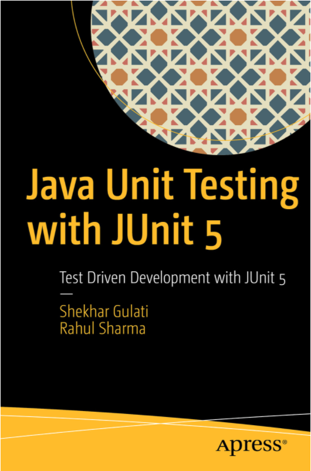

# Java Unit Testing with JUnit 5: Test Driven Development with JUnit 5

by Shekhar Gulati, Rahul Sharma 
Publisher: Apress 
Release Date: November 2017 
ISBN: 9781484230152 
Topic: Java 

### Descripción del libro

Explore la nueva forma de crear y mantener casos de prueba con el desarrollo impulsado por pruebas de Java (TDD) utilizando JUnit 5. Este libro no solo habla sobre los nuevos conceptos, sino que muestra formas de aplicarlos en TDD y Java 8 para entregar código de forma continua. que sobresale en todas las métricas. 

Las pruebas unitarias y el desarrollo impulsado por pruebas ahora se han convertido en parte del conjunto de habilidades de todos los desarrolladores. Para los desarrolladores de Java, la herramienta de prueba más popular ha sido JUnit, y JUnit 5 está construido con las últimas funciones de Java. Con  Java Unit Testing con JUnit 5 , dominará estas nuevas funciones, incluidos parámetros de método, extensiones, afirmaciones y suposiciones, y pruebas dinámicas. También verá cómo escribir pruebas limpias con menos código. 

Este libro es una desviación del uso de prácticas anteriores y presenta nuevas formas de realizar pruebas, construir afirmaciones e inyectar dependencias. 

#### Lo que vas a aprender

* Escribe pruebas de la forma JUnit 5 
* Ejecute sus pruebas desde su IDE
* Integre pruebas con sus herramientas de análisis estático y de compilación
* Migrar de JUnit 4 a JUnit 5

#### Para quien es este libro

Desarrolladores de Java con y sin experiencia previa en pruebas unitarias.

#### Tabla de contenido

Cover

Frontmatter

1. Building Software the Correct Way

2. Understanding Core JUnit 5

3. Developing an Application with JUnit 5

4. Dependency Injection, Mocking, Testing Traits, and Grouping Tests

5. Testing Exceptions

6. Integrating Tools

7. JUnit 5 Extension Model

8. Dynamic Tests and Migration from JUnit 4

Backmatter

#### Tabla de contenido

Cubrir

Frontmatter

1. Construir software de la manera correcta

2. Comprensión de Core JUnit 5

3. Desarrollo de una aplicación con JUnit 5

4. Inyección de dependencia, burlas, pruebas de rasgos y pruebas de agrupación

5. Prueba de excepciones

6. Herramientas de integración

7. Modelo de extensión JUnit 5

8. Pruebas dinámicas y migración desde JUnit 4

Backmatter
