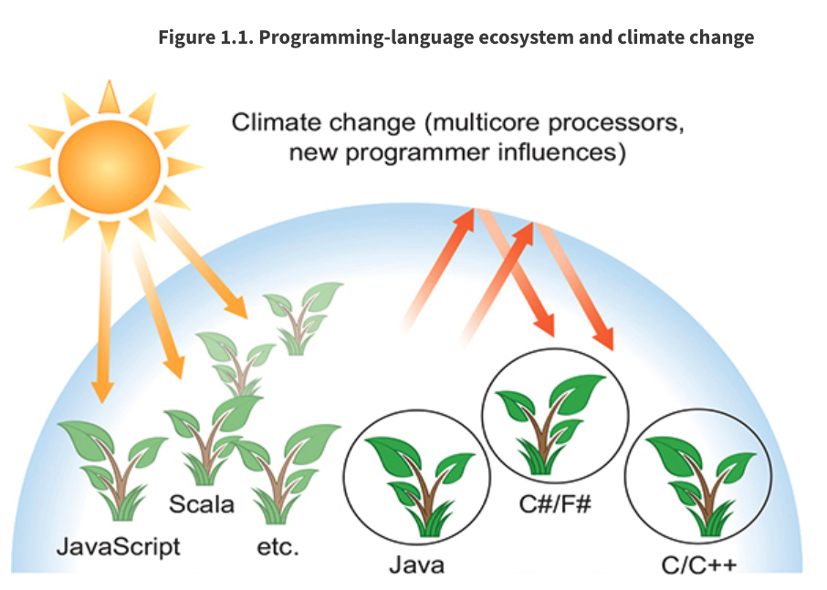
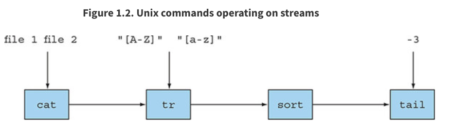
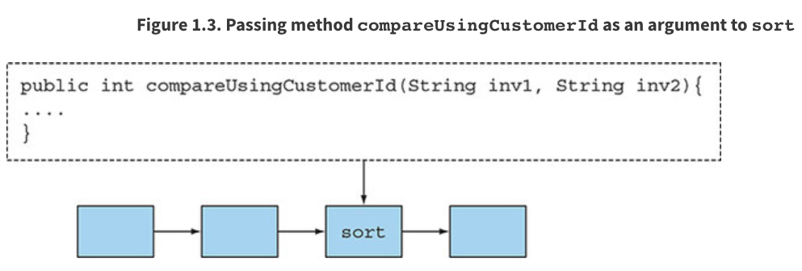
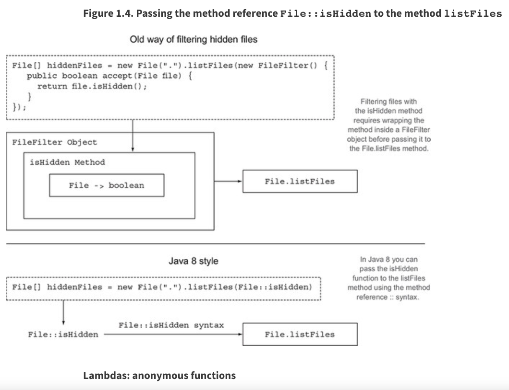
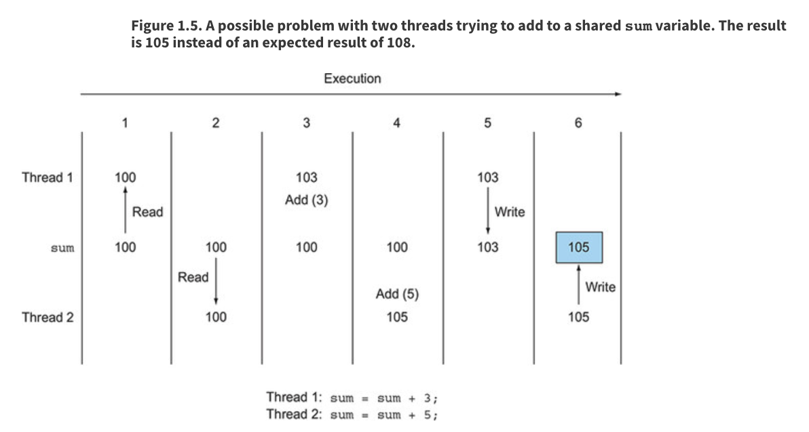
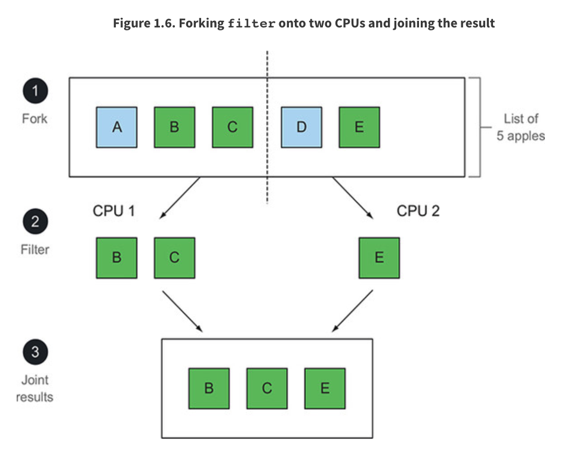

# Parte 1. Fundamentos

Esta primera parte del libro proporciona los fundamentos para ayudarlo a comenzar con las nuevas ideas de Java introducidas en Java 8. Al final de esta primera parte, tendrá una comprensión completa de lo que son las expresiones lambda y estará capaz de escribir código que sea lo suficientemente conciso y flexible para adaptarse fácilmente a los requisitos cambiantes.

En el capítulo 1, resumimos los cambios principales en Java (expresiones lambda, referencias de métodos, flujos y métodos predeterminados) y preparamos el escenario para el libro.

En el capítulo 2, aprenderá sobre la parametrización del comportamiento, un patrón de desarrollo de software en el que Java 8 se basa en gran medida y es la motivación para las expresiones lambda.

El Capítulo 3 ofrece una explicación completa, con ejemplos de código y cuestionarios en cada paso, de los conceptos de expresiones lambda y referencias a métodos.

# Capítulo 1. Java 8, 9, 10 y 11: ¿qué está pasando?

Este capítulo cubre

* Por qué Java sigue cambiando
* Cambio de experiencia informática
* Presiones para que Java evolucione
* Presentamos nuevas funciones principales de Java 8 y 9

Desde el lanzamiento de Java Development Kit (JDK 1.0) en 1996, Java ha ganado un gran número de seguidores de estudiantes, gerentes de proyectos y programadores que son usuarios activos. Es un lenguaje expresivo y se sigue utilizando para proyectos tanto grandes como pequeños. Su evolución (mediante la incorporación de nuevas funciones) de Java 1.1 (1997) a Java 7 (2011) ha sido bien gestionada. Java 8 se lanzó en marzo de 2014, Java 9 en septiembre de 2017, Java 10 en marzo de 2018 y Java 11 previsto para septiembre de 2018. La pregunta es esta: ¿Por qué deberían preocuparse por estos cambios?

## 1.1. Entonces, ¿cuál es la gran historia?

Argumentamos que los cambios en Java 8 fueron, en muchos sentidos, más profundos que cualquier otro cambio en Java en su historia (Java 9 agrega cambios de productividad importantes, pero menos profundos, como verá más adelante en este capítulo, mientras que Java 10 hace ajustes mucho más pequeños a la inferencia de tipos). La buena noticia es que los cambios le permiten escribir programas con mayor facilidad. Por ejemplo, en lugar de escribir un código detallado (para ordenar una lista de manzanas en el inventario según su peso) como

```java
Collections.sort(inventory, new Comparator<Apple>() {
    public int compare(Apple a1, Apple a2){
        return a1.getWeight().compareTo(a2.getWeight());
    }
});
```

en Java 8 puede escribir un código más conciso que se lea mucho más cerca de la declaración del problema, como el siguiente:

```java
inventory.sort(comparing(Apple::getWeight));
```


### 1 ¡El primer código Java 8 del libro!

Dice "ordenar inventario comparando el peso de la manzana". No se preocupe por este código por ahora. Este libro le explicará qué hace y cómo puede escribir un código similar.

También hay una influencia del hardware: las CPU básicas se han convertido en multinúcleo; el procesador de su computadora portátil o de escritorio probablemente contiene cuatro o más núcleos de CPU. Pero la gran mayoría de los programas Java existentes usan solo uno de estos núcleos y dejan los otros tres inactivos (o gastan una pequeña fracción de su poder de procesamiento ejecutando parte del sistema operativo o un antivirus).

Antes de Java 8, los expertos podrían decirle que debe usar subprocesos para usar estos núcleos. El problema es que trabajar con subprocesos es difícil y propenso a errores. Java ha seguido un camino evolutivo de intentar continuamente hacer que la concurrencia sea más fácil y menos propensa a errores. Java 1.0 tenía subprocesos y bloqueos e incluso un modelo de memoria, la mejor práctica en ese momento, pero estas primitivas demostraron ser demasiado difíciles de usar de manera confiable en equipos de proyectos no especializados. Java 5 agregó bloques de construcción de fuerza industrial como grupos de subprocesos y colecciones concurrentes. Java 7 agregó el marco de bifurcación/unión, lo que hace que el paralelismo sea más práctico pero aún difícil. Java 8 nos dio una forma nueva y más sencilla de pensar sobre el paralelismo. Pero aún debe seguir algunas reglas, que aprenderá en este libro.

Como verá más adelante en este libro, Java 9 agrega un método de estructuración adicional para la concurrencia: la programación reactiva. Aunque esto tiene un uso más especializado, estandariza un medio para explotar los kits de herramientas de flujos reactivos **RxJava** y **Akka** que se están volviendo populares para sistemas altamente concurrentes.

De los dos desiderata anteriores (código más conciso y uso más simple de procesadores multinúcleo) surge todo el edificio consistente capturado por Java 8. Comenzamos por darle una muestra rápida de estas ideas (con suerte lo suficiente como para intrigarlo, pero lo suficientemente breve como para resumirlas ):

* La API de Streams
* Técnicas para pasar código a métodos
* Métodos predeterminados en interfaces

Java 8 proporciona una nueva API (llamada Streams) que admite muchas operaciones paralelas para procesar datos y se parece a la forma en que podría pensar en los lenguajes de consulta de bases de datos: usted expresa lo que quiere de una manera de nivel superior y la implementación (aquí, la biblioteca Streams ) elige el mejor mecanismo de ejecución de bajo nivel. Como resultado, evita la necesidad de escribir código sincronizado, que no solo es muy propenso a errores, sino que también es más caro de lo que se imagina en las CPU multinúcleo. [1]

<hr>
[1] Las CPU multinúcleo tienen cachés separados (memoria rápida) conectados a cada núcleo del procesador. El bloqueo requiere que estos estén sincronizados, lo que requiere una comunicación entre núcleos de protocolo de coherencia de caché relativamente lenta.
Desde un punto de vista ligeramente revisionista, la adición de Streams en Java 8 puede verse como una causa directa de las otras dos adiciones a Java 8: técnicas concisas para pasar código a métodos (referencias de métodos, lambdas) y métodos predeterminados en interfaces.
<hr>

Pero pensar en pasar código a métodos como una mera consecuencia de Streams minimiza su rango de usos dentro de Java 8. Le brinda una nueva forma concisa de expresar la parametrización del comportamiento. Suponga que desea escribir dos métodos que difieren solo en unas pocas líneas de código. Ahora puede simplemente pasar el código de las partes que difieren como argumento (esta técnica de programación es más corta, más clara y menos propensa a errores que la tendencia común de usar copiar y pegar). Los expertos notarán aquí que la parametrización del comportamiento podría, antes de Java 8, codificarse usando clases anónimas, pero dejaremos que el ejemplo al principio de este capítulo, que muestra una mayor concisión del código con Java 8, hable por sí mismo en términos de claridad. .

La característica de Java 8 de pasar código a métodos (y poder devolverlo e incorporarlo en estructuras de datos) también proporciona acceso a una variedad de técnicas adicionales que comúnmente se conocen como programación de estilo funcional. En pocas palabras, dicho código, llamado funciones en la comunidad de programación funcional, puede transmitirse y combinarse de manera que produzca potentes modismos de programación que verá en Java a lo largo de este libro.

El meollo de este capítulo comienza con una discusión de alto nivel sobre por qué evolucionan los lenguajes, continúa con secciones sobre las características principales de Java 8 y luego presenta las ideas de programación de estilo funcional que las nuevas características simplifican el uso y que las nuevas arquitecturas de computadora favorecen. En esencia, la sección 1.2 analiza el proceso de evolución y los conceptos, de los que antes carecía Java, para explotar el paralelismo multinúcleo de una manera fácil. La sección 1.3 explica por qué pasar código a métodos en Java 8 es un nuevo lenguaje de programación tan poderoso, y la sección 1.4 hace lo mismo para Streams, la nueva forma de Java 8 de representar datos secuenciados e indicar si estos pueden procesarse en paralelo. La Sección 1.5 explica cómo la nueva característica de Java 8 de métodos predeterminados permite que las interfaces y sus bibliotecas evolucionen con menos complicaciones y menos recompilación; También explica la adición de módulos a Java 9, que permite que los componentes de grandes sistemas Java se especifiquen con más claridad que "solo un archivo JAR de paquetes". Finalmente, la sección 1.6 analiza las ideas de programación de estilo funcional en Java y otros lenguajes que comparten la JVM. En resumen, este capítulo introduce ideas que se elaboran sucesivamente en el resto del libro. ¡Disfruta el viaje!

## 1.2. ¿POR QUÉ JAVA AÚN ESTÁ CAMBIANDO?

Con la década de 1960 llegó la búsqueda del lenguaje de programación perfecto. Peter Landin, un famoso científico informático de su época, señaló en 1966 en un artículo histórico [2] que ya había 700 lenguajes de programación y especuló sobre cómo serían los próximos 700, incluidos argumentos para una programación de estilo funcional similar a ese en Java 8.

<hr>
[2] P. J. Landin, "The Next 700 Programming Languages", CACM 9 (3): 157–65, marzo de 1966.
<hr>

Muchos miles de lenguajes de programación más tarde, los académicos han llegado a la conclusión de que los lenguajes de programación se comportan como ecosistemas: aparecen nuevos lenguajes y los lenguajes antiguos son suplantados a menos que evolucionen. Todos esperamos un lenguaje universal perfecto, pero en realidad ciertos lenguajes se adaptan mejor a determinados nichos. Por ejemplo, C y C ++ siguen siendo populares para la construcción de sistemas operativos y varios otros sistemas integrados debido a su pequeña huella de tiempo de ejecución y a pesar de su falta de seguridad en la programación. Esta falta de seguridad puede llevar a que los programas se bloqueen de manera impredecible y expongan agujeros de seguridad para virus y similares; de hecho, los lenguajes con seguridad de tipos como Java y C# han suplantado a C y C++ en varias aplicaciones cuando la huella de tiempo de ejecución adicional es aceptable.

La ocupación previa de un nicho tiende a desanimar a los competidores. Cambiar a un nuevo idioma y cadena de herramientas suele ser demasiado doloroso para una sola función, pero los recién llegados eventualmente desplazarán los idiomas existentes, a menos que evolucionen lo suficientemente rápido como para mantenerse al día. (Los lectores mayores a menudo pueden citar una variedad de esos lenguajes en los que han codificado previamente pero cuya popularidad ha disminuido desde entonces: Ada, Algol, COBOL, Pascal, Delphi y SNOBOL, por nombrar solo algunos).

Eres un programador de Java, y Java ha logrado colonizar (y desplazar lenguajes de la competencia) un gran nicho de ecosistema de tareas de programación durante casi 20 años. Examinemos algunas razones para eso.

### 1.2.1. El lugar de Java en el ecosistema de lenguajes de programación

Java empezó bien. Desde el principio, fue un lenguaje orientado a objetos bien diseñado con muchas bibliotecas útiles. También admitió la concurrencia a pequeña escala desde el primer día con su soporte integrado para subprocesos y bloqueos (y con su temprano reconocimiento profético, en forma de un modelo de memoria neutral de hardware, que los subprocesos concurrentes en procesadores multinúcleo pueden tener comportamientos inesperados además de los que ocurren en procesadores de un solo núcleo). Además, la decisión de compilar Java en código de bytes JVM (un código de máquina virtual que pronto todos los navegadores admitieron) significó que se convirtió en el idioma preferido para los programas de subprogramas de Internet (¿recuerda los subprogramas?). De hecho, existe el peligro de que Java Virtual Machine (JVM) y su código de bytes se consideren más importantes que el propio lenguaje Java y que, para ciertas aplicaciones, Java pueda ser reemplazado por uno de sus lenguajes competidores como Scala, Groovy, o Kotlin, que también se ejecuta en JVM. Varias actualizaciones recientes de la JVM (por ejemplo, el nuevo código de bytes dinámico invocado en JDK7) tienen como objetivo ayudar a que los lenguajes de la competencia se ejecuten sin problemas en la JVM y que interoperen con Java. Java también ha tenido éxito en colonizar varios aspectos de la computación integrada (desde tarjetas inteligentes, tostadoras y decodificadores hasta sistemas de frenado de automóviles).

#### ¿Cómo entró Java en un nicho de programación general?
<hr>
La orientación a objetos se puso de moda en la década de 1990 por dos razones: su disciplina de encapsulación resultó en menos problemas de ingeniería de software que los de C; y como modelo mental, capturó fácilmente el modelo de programación WIMP de Windows 95 y versiones posteriores. Esto se puede resumir de la siguiente manera: todo es un objeto; y un clic del mouse envía un mensaje de evento a un controlador (invoca el método de clic en un objeto Mouse). El modelo de Java de escritura única y ejecución en cualquier lugar y la capacidad de los primeros navegadores para ejecutar (de forma segura) los subprogramas de código Java le dieron un nicho en las universidades, cuyos graduados entonces poblaron la industria. Hubo una resistencia inicial al costo de ejecución adicional de Java sobre C/C++, pero las máquinas se hicieron más rápidas y el tiempo del programador se volvió cada vez más importante. C# de Microsoft validó aún más el modelo orientado a objetos de estilo Java.
<hr>

Pero el clima está cambiando para el ecosistema de lenguajes de programación; Los programadores se ocupan cada vez más de los llamados big data (conjuntos de datos de terabytes y más) y desean explotar computadoras multinúcleo o clústeres informáticos de manera eficaz para procesarlos. Y esto significa usar procesamiento paralelo, algo que Java no era compatible con anterioridad. Es posible que haya encontrado ideas de otros nichos de programación (por ejemplo, map-reduce de Google o la relativa facilidad de manipulación de datos con lenguajes de consulta de bases de datos como SQL) que lo ayudan a trabajar con grandes volúmenes de datos y CPU multinúcleo. La Figura 1.1 resume gráficamente el ecosistema del lenguaje: piense en el paisaje como el espacio de los problemas de programación y la vegetación dominante de un terreno en particular como el lenguaje favorito para ese programa. El cambio climático es la idea de que nueva hardware o nuevas influencias de programación (por ejemplo, "¿Por qué no puedo programar en un estilo similar a SQL?") significan que diferentes lenguajes se convierten en el lenguaje de elección para nuevos proyectos, al igual que el aumento de las temperaturas regionales significa que las uvas ahora prosperan en latitudes más altas. . Pero hay histéresis: muchos agricultores antiguos seguirán cultivando cultivos tradicionales. En resumen, están apareciendo nuevos idiomas y se están volviendo cada vez más populares porque se han adaptado rápidamente al cambio climático.



El principal beneficio de las adiciones de Java 8 para un programador es que brindan más herramientas y conceptos de programación para resolver problemas de programación nuevos o existentes más rápidamente o, lo que es más importante, de una manera más concisa y fácil de mantener. Aunque los conceptos son nuevos en Java, han demostrado su eficacia en lenguajes de investigación de nicho. En las siguientes secciones, destacaremos y desarrollaremos las ideas detrás de tres de estos conceptos de programación que han impulsado el desarrollo de las funciones de Java 8 para aprovechar el paralelismo y escribir código más conciso en general. Los presentaremos en un orden ligeramente diferente del resto del libro para habilitar una analogía basada en Unix y exponer las dependencias de "necesito esto por eso" en el nuevo paralelismo de Java 8 para multinúcleo.

#### Otro factor de cambio climático para Java
<hr>
Un factor del cambio climático implica cómo se diseñan los grandes sistemas. Hoy en día, es común que un sistema grande incorpore subsistemas de componentes grandes de otros lugares, y tal vez estos se construyan sobre otros componentes de otros proveedores. Peor aún, estos componentes y sus interfaces también tienden a evolucionar. Java 8 y Java 9 han abordado estos aspectos proporcionando métodos y módulos predeterminados para facilitar este estilo de diseño.
<hr>

Las siguientes tres secciones examinan los tres conceptos de programación que impulsaron el diseño de Java 8.

### 1.2.2. Stream processing - Procesamiento de flujo

El primer concepto de programación es el procesamiento de flujo. Para propósitos introductorios, un flujo es una secuencia de elementos de datos que se producen conceptualmente uno a la vez. Un programa puede leer elementos de un flujo de entrada uno por uno y, de manera similar, escribir elementos en un flujo de salida. El flujo de salida de un programa bien podría ser el flujo de entrada de otro.

Un ejemplo práctico es en Unix o Linux, donde muchos programas operan leyendo datos de la entrada estándar (stdin en Unix y C, System.in en Java), operando en ella y luego escribiendo sus resultados en la salida estándar (stdout en Unix y C, System.out en Java). Primero, un poco de trasfondo: Unix cat crea un flujo concatenando dos archivos, tr traduce los caracteres en un flujo, ordena ordena las líneas en un flujo y la cola -3 da las últimas tres líneas de un flujo. La línea de comandos de Unix permite que dichos programas se vinculen con conductos (|), dando ejemplos como

```sh
cat file1 file2  |  tr "[A-Z]"  "[a-z]"  |  sort  |  tail -3
```

que (suponiendo que file1 y file2 contienen una sola palabra por línea) imprime las tres palabras de los archivos que aparecen más recientes en el orden del diccionario, después de traducirlas primero a minúsculas. Decimos que ordenar toma un flujo de líneas [3] como entrada y produce otro flujo de líneas como salida (este último está ordenado), como se ilustra en la figura 1.2. Tenga en cuenta que en Unix estos comandos (cat, tr, sort y tail) se ejecutan al mismo tiempo, por lo que sort puede procesar las primeras líneas antes de que cat o tr hayan terminado. Una analogía más mecánica es una línea de ensamblaje de fabricación de automóviles en la que un flujo de automóviles se pone en cola entre las estaciones de procesamiento, cada una de las cuales toma un automóvil, lo modifica y lo pasa a la siguiente estación para su procesamiento posterior; el procesamiento en estaciones separadas suele ser simultáneo, aunque la línea de montaje es físicamente una secuencia.

<hr>
[3] Los puristas dirán un "flujo de caracteres", pero es conceptualmente más simple pensar que el orden reordena las líneas.
<hr>



**Java 8 agrega una API Streams** (tenga en cuenta la S mayúscula) en `java.util.stream` basada en esta idea; `Stream<T>` es una secuencia de elementos de tipo `T`. Puedes pensar en él como un iterador elegante por ahora. La API de Streams tiene muchos métodos que se pueden encadenar para formar una pipeline(tubería) compleja, al igual que los comandos de Unix se encadenaron en el ejemplo anterior.

La motivación clave para esto es que ahora puede programar en Java 8 en un nivel superior de abstracción, estructurando sus pensamientos de convertir un flujo de esto en un flujo de aquello (similar a cómo piensa cuando escribe consultas de base de datos) en lugar de un elemento a la vez. Otra ventaja es que Java 8 puede ejecutar de forma transparente su canalización de operaciones `Stream` en varios núcleos de CPU en partes separadas de la entrada; esto es un paralelismo *casi gratis* en lugar de un trabajo duro con `Threads`. ***Cubrimos la API de Java 8 Streams en detalle en los capítulos 4 a 7***.

### 1.2.3. Pasando código a métodos con parametrización de comportamiento

El segundo concepto de programación agregado a Java 8 es la capacidad de pasar un fragmento de código a una API. Esto suena terriblemente abstracto. En el ejemplo de Unix, es posible que desee indicarle al comando `sort` que utilice un orden personalizado. Aunque el comando `sort` admite parámetros de línea de comandos para realizar varios tipos predefinidos de clasificación, como el orden inverso, estos son limitados.

Por ejemplo, supongamos que tiene una colección de ID de factura con un formato similar a `2013UK0001`, `2014US0002`, etc. Los primeros cuatro dígitos representan el año, las siguientes dos letras un código de país y los últimos cuatro dígitos el ID de un cliente. Es posible que desee ordenar estos ID de factura por año o quizás utilizando el ID de cliente o incluso el código de país. Lo que desea es la capacidad de decirle al comando `sort` que tome como argumento un orden definido por el usuario: un fragmento de código separado que se pasa al comando `sort`.

Ahora, como un paralelo directo en Java, desea indicar un método de clasificación para comparar utilizando un orden personalizado. Podría escribir un método `compareUsingCustomerId` para comparar dos ID de facturas, pero, antes de Java 8, ¡no podía pasar este método a otro método! Podría crear un objeto `Comparator` para pasar al método `sort` como mostramos al comienzo de este capítulo, pero esto es detallado y ofusca la idea de simplemente reutilizar un comportamiento existente. Java 8 agrega la capacidad de pasar métodos (su código) como argumentos a otros métodos. La figura 1.3, basada en la figura 1.2, ilustra esta idea. También nos referimos a esto conceptualmente como parametrización del comportamiento. ¿Porque es esto importante? La API de Streams se basa en la idea de pasar código para parametrizar el comportamiento de sus operaciones, tal como pasó `compareUsingCustomerId` para parametrizar el comportamiento de `sort.`
Ahora, como un paralelo directo en Java, desea indicar un método de clasificación para comparar utilizando un orden personalizado. Podría escribir un método `compareUsingCustomerId` para comparar dos ID de facturas, pero, antes de Java 8, ¡no podía pasar este método a otro método! Podría crear un objeto `Comparator` para pasar al método `sort` como mostramos al comienzo de este capítulo, pero esto es detallado y ofusca la idea de simplemente reutilizar un comportamiento existente. Java 8 agrega la capacidad de pasar métodos (su código) como argumentos a otros métodos. La figura 1.3, basada en la figura 1.2, ilustra esta idea. También nos referimos a esto conceptualmente como parametrización del comportamiento. ¿Porque es esto importante? La API de Streams se basa en la idea de pasar código para parametrizar el comportamiento de sus operaciones, tal como pasó `compareUsingCustomerId` para parametrizar el comportamiento de `sort`.



Resumimos cómo funciona esto en la sección 1.3 de este capítulo, pero dejamos los detalles completos para los capítulos 2 y 3. Los capítulos 18 y 19 analizan cosas más avanzadas que puede hacer usando esta característica, con técnicas de la *comunidad de programación funcional*.

### 1.2.4. Paralelismo y datos mutables compartidos

El tercer concepto de programación es bastante más implícito y surge de la frase "paralelismo casi gratis" en nuestra discusión anterior sobre el procesamiento de secuencias. ¿A qué tienes que renunciar? Es posible que deba realizar algunos pequeños cambios en la forma en que codifica el comportamiento pasado a los métodos de transmisión. Al principio, estos cambios pueden resultar un poco incómodos, pero una vez que te acostumbres, te encantarán. Debe proporcionar un comportamiento que sea seguro para ejecutar simultáneamente en diferentes partes de la entrada. *Normalmente, esto significa escribir código que no acceda a los datos mutables compartidos para hacer su trabajo*. A veces, se denominan funciones puras o funciones sin efectos secundarios o funciones sin estado, y las discutiremos en detalle en los capítulos 18 y 19. El paralelismo anterior surge solo asumiendo que varias copias de su código pueden funcionar independientemente. Si hay una variable u objeto compartido, en el que se escribe, las cosas ya no funcionan. ¿Qué pasa si dos procesos quieren modificar la variable compartida al mismo tiempo? (La sección 1.4 ofrece una explicación más detallada con un diagrama). Encontrará más información sobre este estilo a lo largo del libro.

Los streams de Java 8 explotan el paralelismo más fácilmente que la API de subprocesos existente de Java, por lo que, aunque es posible usar sincronizado para romper la regla de datos mutables no compartidos, está luchando contra el sistema porque está abusando de una abstracción optimizada en torno a esa regla. El uso de la sincronización en varios núcleos de procesamiento suele ser mucho más costoso de lo esperado, porque la sincronización obliga al código a ejecutarse de forma secuencial, lo que va en contra del objetivo del paralelismo.

Dos de estos puntos (sin datos mutables compartidos y la capacidad de pasar métodos y funciones (código) a otros métodos) son las piedras angulares de lo que generalmente se describe como ***el paradigma de la programación funcional***, que verá en detalle en los capítulos 18 y 19. Por el contrario, en ***el paradigma de programación imperativa*** normalmente se describe un programa en términos de una secuencia de declaraciones que mutan el estado. El requisito de no compartir datos mutables significa que un método se describe perfectamente únicamente por la forma en que transforma los argumentos en resultados; en otras palabras, se comporta como una función matemática y no tiene efectos secundarios (visibles).

### 1.2.5. Java necesita evolucionar

Has visto la evolución en Java antes. Por ejemplo, la introducción de genéricos y el uso de `List<String>` en lugar de solo `List` puede haber sido inicialmente irritante. Pero ahora está familiarizado con este estilo y los beneficios que trae (detectar más errores en tiempo de compilación y hacer que el código sea más fácil de leer, porque ahora sabe qué es una lista).

Otros cambios han hecho que las cosas comunes sean más fáciles de expresar (por ejemplo, usar un bucle `for-each` en lugar de exponer el uso estándar de un iterador). *Los principales cambios en Java 8 reflejan un alejamiento de la orientación a objetos clásica*, que a menudo se centra en la mutación de valores existentes, *y hacia el espectro de programación de estilo funcional* en el que lo que desea hacer en términos generales (por ejemplo, crear un valor representar todas las rutas de transporte de A a B por menos de un precio determinado) se considera principal y se separa de cómo puede lograrlo (por ejemplo, escanear una estructura de datos modificando ciertos componentes). Tenga en cuenta que la programación clásica orientada a objetos y la programación funcional, como extremos, pueden parecer estar en conflicto. Pero la idea es obtener lo mejor de ambos paradigmas de programación, para que tenga más posibilidades de tener la herramienta adecuada para el trabajo. Discutimos esto en detalle en las secciones 1.3 y 1.4.

Una conclusión podría ser la siguiente: los lenguajes deben evolucionar para seguir las expectativas cambiantes del hardware o del programador (si necesita convencerse, considere que COBOL fue una vez uno de los lenguajes más importantes comercialmente). Para perdurar, Java tiene que evolucionar añadiendo nuevas funciones. Esta evolución no tendrá sentido a menos que se utilicen las nuevas funciones, por lo que al usar Java 8 estás protegiendo tu forma de vida como programador de Java. Además de eso, tenemos la sensación de que te encantará usar las nuevas funciones de Java 8. Pregúntele a cualquiera que haya usado Java 8 si está dispuesto a volver. Además, las nuevas características de Java 8 podrían, en la analogía del ecosistema, permitir a Java conquistar el territorio de las tareas de programación que actualmente ocupan otros lenguajes, por lo que los programadores de Java 8 tendrán aún más demanda.

Ahora presentamos los nuevos conceptos en Java 8, uno por uno, señalando los capítulos que cubren estos conceptos con más detalle.

## 1.3. FUNCIONES EN JAVA

La palabra *función* en los lenguajes de programación se usa comúnmente como *sinónimo de método*, particularmente un método estático; esto se suma a que se utiliza para funciones matemáticas, sin efectos secundarios. Afortunadamente, como verá, cuando Java 8 se refiere a funciones, estas las edades casi coinciden (these usages nearly coincide).

Java 8 agrega funciones como nuevas formas de valor. Estos facilitan el uso de streams, cubiertos en la sección 1.4, que Java 8 proporciona para explotar la programación paralela en procesadores multinúcleo. Comenzamos mostrando que las funciones como valores son útiles en sí mismas.

Piense en los posibles valores manipulados por los programas Java. ***Primero, hay valores primitivos*** como `42` (de tipo `int`) y `3.14` (de tipo double). ***En segundo lugar, los valores pueden ser objetos*** (más estrictamente, *referencias a objetos*). La única forma de obtener uno de estos es *utilizando `new`*, quizás mediante un método de factory o una función de una library; las referencias a objetos apuntan a *instancias* de una clase. Los ejemplos incluyen `"abc"` (de tipo `String`), `new Integer(1111)` (de tipo `Integer`) y el resultado `new HashMap<Integer, String>(100)` de llamar explícitamente a un constructor para `HashMap`. Incluso los arrays son objetos. ¿Cuál es el problema?

Para ayudar a responder a esto, notaremos que el objetivo de un lenguaje de programación es manipular valores, que, siguiendo la tradición histórica del lenguaje de programación, se denominan valores de primera clase (o citizens, en la terminología tomada de los años sesentas, movimiento de derechos humanos en los Estados Unidos). Otras estructuras en nuestros lenguajes de programación, que quizás nos ayuden a expresar la estructura de valores pero que no se pueden transmitir durante la ejecución del programa, son citizens de segunda clase. Los valores enumerados anteriormente son ciudadanos de Java de primera clase, pero varios otros conceptos de Java, como métodos y clases, ejemplifican ciudadanos de segunda clase. Los métodos están bien cuando se usan para definir clases, que a su vez pueden instanciarse para producir valores, pero tampoco los valores en sí. ¿Importa esto? Sí, resulta que poder pasar métodos en tiempo de ejecución y, por lo tanto, convertirlos en ciudadanos de primera clase, es útil en programación, por lo que los diseñadores de Java 8 agregaron la capacidad de expresar esto directamente en Java. Por cierto, podría preguntarse si convertir a otros ciudadanos de segunda clase, como las clases, en valores de ciudadanos de primera clase también podría ser una buena idea. Varios lenguajes como Smalltalk y JavaScript han explorado esta ruta.

### 1.3.1. Métodos y lambdas como ciudadanos de primera

Los experimentos en otros lenguajes, como Scala y Groovy, han determinado que permitir que conceptos como los métodos se usen como valores de primera clase facilitó la programación al agregar al conjunto de herramientas disponible para los programadores. Y una vez que los programadores se familiarizan con una característica poderosa, se vuelven reacios a usar lenguajes sin ella. Los diseñadores de Java 8 decidieron permitir que los métodos fueran valores, para facilitarle la programación. Además, la característica de Java 8 de métodos como valores forma la base de varias otras características de Java 8 (como Streams).

**La primera característica nueva de Java 8 que presentamos es la de *referencias a métodos***. Suponga que desea filtrar todos los archivos ocultos en un directorio. Debe comenzar a escribir un método que, dado un archivo, le dirá si está oculto. Afortunadamente, existe un método de este tipo en la clase `File` llamado `isHidden`. Puede verse como una función que toma un archivo y devuelve un valor `booleano`. Pero para usarlo para el filtrado, debe envolverlo en un objeto `FileFilter` que luego pasar al método `File.listFiles`, de la siguiente manera:

```java
File[] hiddenFiles = new File(".").listFiles(new FileFilter() {
    public boolean accept(File file) {
        return file.isHidden();                        1
    }
});
```

1. ¡Filtrado de archivos ocultos!

¡Qué asco! Esto es horrible. Aunque son solo tres líneas significativas, son tres líneas opacas; todos recordamos haber dicho "¿Realmente tengo que hacerlo de esta manera?" en el primer encuentro. Ya tienes el método `isHidden` que podrías usar. ¿Por qué tiene que envolverlo en una clase `FileFilter` detallada y luego crear una instancia? Porque eso es lo que tenías que hacer antes de Java 8.

Ahora, puede reescribir ese código de la siguiente manera:

```java
File[] hiddenFiles = new File(".").listFiles(File::isHidden);
```

¡Guauu! ¿No es genial? Ya tienes la función `isHidden` disponible, así que la pasas al método `listFiles` usando el método Java 8 *method reference `::` syntax* (que significa “usar este método como un valor”); tenga en cuenta que también nos deslizamos en el uso de la palabra *función* para los métodos. Más adelante explicaremos cómo funciona la mecánica. Una ventaja es que su código ahora se lee más cerca de la declaración del problema.

He aquí una muestra de lo que se avecina: los métodos ya no son valores de segunda clase. De manera análoga a usar una referencia de objeto cuando pasa un objeto (y las referencias de objeto son creadas por `new`), en Java 8 cuando escribe `File::isHidden`, crea una *referencia de método*, que de manera similar se puede pasar. Este concepto se analiza en detalle en el capítulo 3. Dado que los métodos contienen código (el cuerpo ejecutable de un método), el uso de referencias de método permite pasar el código como en la figura 1.3. La figura 1.4 ilustra el concepto. También verá un ejemplo concreto (seleccionar manzanas de un inventario) en la siguiente sección.



Además de permitir que los métodos (con nombre) sean valores de primera clase, Java 8 permite una idea más rica de *las funciones como valores*, incluidas *las lambdas* [4] (o funciones anónimas). Por ejemplo, ahora puede escribir `(int x) -> x + 1` para significar "la función que, cuando se llama con el argumento x, devuelve el valor x + 1". Quizás se pregunte por qué es necesario esto, porque podría definir un método `add1` dentro de una clase `MyMathsUtils` y luego escribir `MyMaths-Utils::add1!` Sí!, podría, pero la nueva sintaxis lambda es más concisa para los casos en los que no tiene un método y una clase convenientes disponibles. El capítulo 3 explora las lambdas en detalle. Se dice que los programas que utilizan estos conceptos están escritos en estilo de programación funcional; esta frase significa "programas de escritura que transmiten funciones como valores de primera clase".

[4] Originalmente llamado así por la letra griega λ (lambda). Aunque el símbolo no se usa en Java, su nombre sigue vivo.

### 1.3.2. Pasando código: un ejemplo

Veamos un ejemplo de cómo esto le ayuda a escribir programas (discutido con más detalle en el capítulo 2). Todo el código de los ejemplos está disponible en un repositorio de GitHub y como descarga a través del sitio web del libro. Ambos enlaces se pueden encontrar en www.manning.com/books/modern-java-in-action. Suponga que tiene una clase `Apple` con un método `getColor` y una variable `inventory` que contiene una lista de `Apples`; entonces es posible que desee seleccionar todas las manzanas verdes (aquí usando un tipo de enumeración `Color` que incluye valores `GREEN` y `RED`) y devolverlas en una lista. La palabra *filter* se usa comúnmente para expresar este concepto. Antes de Java 8, podría escribir un método `filterGreenApples`:

```java
public static List<Apple> filterGreenApples(List<Apple> inventory) {
    List<Apple> result = new ArrayList<>();                           1
    for (Apple apple: inventory){
        if (GREEN.equals(apple.getColor())) {                         2
            result.add(apple);
        }
    }
    return result;
}
```

1. La lista de resultados acumula el resultado; comienza vacío y luego se agregan las manzanas verdes una por una.
2. El texto resaltado (if) selecciona solo manzanas verdes.

Pero a continuación, a alguien le gustaría la lista de manzanas pesadas (digamos más de 150 g), por lo que, con el corazón apesadumbrado, escribirías el siguiente método para lograrlo (tal vez incluso usando copiar y pegar):

```java
public static List<Apple> filterHeavyApples(List<Apple> inventory) {
    List<Apple> result = new ArrayList<>();
    for (Apple apple: inventory){
        if (apple.getWeight() > 150) {                1
            result.add(apple);
        }
    }
    return result;
}
```

1. Aquí el texto resaltado (if) selecciona solo manzanas pesadas.

Todos conocemos los peligros de copiar y pegar para la ingeniería de software (actualizaciones y correcciones de errores en una variante pero no en la otra), y bueno, estos dos métodos varían solo en una línea: la condición resaltada dentro de la construcción `if`. Si la diferencia entre las dos llamadas a métodos en el código resaltado hubiera sido qué rango de peso era aceptable, entonces podría haber pasado pesos aceptables inferior y superior como argumentos para filtrar, tal vez (150, 1000) para seleccionar manzanas pesadas (más de 150 g) o (0, 80) para seleccionar manzanas ligeras (menos de 80 g).

Pero como mencionamos anteriormente, Java 8 permite pasar el código de la condición como argumento, evitando la duplicación de código del método `filter`. Ahora puedes escribir esto:

```java
public static boolean isGreenApple(Apple apple) {
    return GREEN.equals(apple.getColor());
}
public static boolean isHeavyApple(Apple apple) {
    return apple.getWeight() > 150;
}
public interface Predicate<T>{                                 1
    boolean test(T t);
}
static List<Apple> filterApples(List<Apple> inventory,
                                Predicate<Apple> p) {          2
    List<Apple> result = new ArrayList<>();
    for (Apple apple: inventory){
        if (p.test(apple)) {                                   3
            result.add(apple);
        }
    }
    return result;
}
```

1. Incluido para mayor claridad (normalmente importado de `java.util.function`)
2. Se pasa un método como parámetro de `Predicate` denominado `p` (consulte la barra lateral "¿Qué es un predicado?").
3. ¿La apple coincide con la condición representada por p?

Y para usar esto, llama a:

```java
filterApples(inventory, Apple::isGreenApple);
```

o 

```java
filterApples(inventory, Apple::isHeavyApple);
```

Explicamos cómo funciona esto en detalle en los dos capítulos siguientes. La idea clave por ahora es que puede pasar un método en Java 8.

#### ¿Qué es un Predicate?
<hr>
El código anterior pasó un método `Apple::isGreenApple` (que toma un argumento de `Apple` y devuelve un `booleano`) a `filterApples`, que esperaba un parámetro `Predicate<Apple>`. La palabra *predicado* se usa a menudo en matemáticas para significar algo parecido a una función que toma un valor para un argumento y devuelve verdadero o falso. Como verá más adelante, Java 8 también le permitiría escribir `Function<Apple, Boolean>`, más familiar para los lectores que aprendieron sobre funciones pero no predicados en la escuela, pero usar `Predicate<Apple>` es más estándar (y un poco más eficiente porque evita encajonar(boxing) un `booleano` en un `Booleano`).
<hr>

### 1.3.3. De pasar métodos a lambdas

Pasar métodos como valores es claramente útil, pero es molesto tener que escribir una definición para métodos cortos como `isHeavyApple` e `isGreenApple` cuando se usan quizás solo una o dos veces. Pero Java 8 también ha resuelto esto. Introduce una nueva notación (***funciones anónimas o lambdas***) que le permite escribir solo:

```java
filterApples(inventory, (Apple a) -> GREEN.equals(a.getColor()) );
```

o 

```java
filterApples(inventory, (Apple a) -> a.getWeight() > 150 );
```

o incluso

```java
filterApples(inventory, (Apple a) -> a.getWeight() < 80 ||
                                     RED.equals(a.getColor()) );
```

Ni siquiera necesita escribir una definición de método que se use solo una vez; el código es más nítido y claro porque no necesita buscar para encontrar el código que está pasando. Pero si tal lambda excede unas pocas líneas de longitud (de modo que su comportamiento no se aclare instantáneamente), debe usar una referencia de método a un método con un nombre descriptivo en lugar de usar un lambda anónimo. ***La claridad del código debe ser su guía***.

Los diseñadores de Java 8 casi podrían haberse detenido aquí, y quizás lo hubieran hecho antes de las CPU multinúcleo. La programación de estilo funcional, tal como se ha presentado hasta ahora, resulta ser poderosa, como verá. Java podría haberse redondeado agregando un `filter` y algunos amigos como métodos de biblioteca genéricos(generic library methods), como:

```java
static <T> Collection<T> filter(Collection<T> c, Predicate<T> p);
```

Ni siquiera tendrías que escribir métodos como `filterApples` porque, por ejemplo, la llamada anterior:

```java
filterApples(inventory, (Apple a) -> a.getWeight() > 150 );
```

podría escribirse como una llamada al filtro del método de la biblioteca (library method `filter`):

```java
filter(inventory, (Apple a) -> a.getWeight() > 150 );
```

Pero, por razones centradas en aprovechar mejor el paralelismo, los diseñadores no hicieron esto. En cambio, Java 8 contiene una nueva API similar a una colección llamada Stream, que contiene un conjunto completo de operaciones similares a la operación de `filter` con las que los programadores funcionales pueden estar familiarizados (por ejemplo, `map` y `reduce`), junto con métodos para convertir entre `Collections` y `Streams`. que ahora investigamos.

## 1.4. STREAMS

Casi todas las aplicaciones Java *crean* y *procesan* colecciones. Pero trabajar con colecciones no siempre es ideal. Por ejemplo, supongamos que necesita filtrar transacciones costosas de una lista y luego agruparlas por moneda. Debería escribir una gran cantidad de código estándar para implementar esta consulta de procesamiento de datos, como se muestra aquí:

```java
Map<Currency, List<Transaction>> transactionsByCurrencies =
    new HashMap<>();                                           1
for (Transaction transaction : transactions) {                 2
    if(transaction.getPrice() > 1000){                         3
        Currency currency = transaction.getCurrency();         4
        List<Transaction> transactionsForCurrency =
            transactionsByCurrencies.get(currency);
        if (transactionsForCurrency == null) {                 5
            transactionsForCurrency = new ArrayList<>();
            transactionsByCurrencies.put(currency,
                                         transactionsForCurrency);
        }
        transactionsForCurrency.add(transaction);              6
    }
}
```

1. Crea el `Map` donde se acumulará la transacción agrupada
2. Itera la lista de transacciones
3. Filtra transacciones costosas
4. Extrae la moneda de la transacción
5. Si no hay una entrada en el `Map` de agrupación para esta moneda, créela.
6. Agrega la transacción actualmente atravesada a la Lista de transacciones con la misma moneda

Además, es difícil entender de un vistazo qué hace el código debido a las múltiples declaraciones de flujo de control anidadas.

Con la API de Streams, puede resolver este problema de la siguiente manera:

```java
import static java.util.stream.Collectors.groupingBy;
Map<Currency, List<Transaction>> transactionsByCurrencies =
    transactions.stream()
                .filter((Transaction t) -> t.getPrice() > 1000)     1
                .collect(groupingBy(Transaction::getCurrency));     2
```

1. Filtra transacciones costosas
2. Agrupa por moneda

No se preocupe por este código por ahora porque puede parecer un poco mágico. Los capítulos 4 a 7 están dedicados a explicar cómo entender la API de Streams. Por ahora, vale la pena notar que la API Streams proporciona una forma diferente de procesar datos en comparación con la API de colecciones. Con una colección, usted mismo administra el proceso de iteración. Necesita iterar a través de los elementos uno por uno usando un ciclo `for-each` procesándolos a su vez. A esta forma de iterar sobre datos la llamamos *iteración externa*. Por el contrario, al utilizar la API de Streams, no es necesario pensar en términos de bucles. El procesamiento de datos ocurre internamente dentro de la library. A esta idea la llamamos *iteración interna*. Volvemos a estas ideas en el capítulo 4.

Como segundo problema de trabajar con collections, piense por un segundo en cómo procesaría la lista de transacciones si tuviera una gran cantidad de ellas; ¿Cómo puedes procesar esta enorme lista? Una sola CPU no podría procesar esta gran cantidad de datos, pero probablemente tenga una computadora multinúcleo en su escritorio. Idealmente, le gustaría compartir el trabajo entre los diferentes núcleos de CPU disponibles en su máquina para reducir el tiempo de procesamiento. En teoría, si tiene ocho núcleos, deberían poder procesar sus datos ocho veces más rápido que usar un núcleo, porque trabajan en paralelo[5].

[5] Este nombre es desafortunado en algunos aspectos. Cada uno de los núcleos de un chip multinúcleo es una CPU en toda regla. Pero la frase CPU multinúcleo se ha vuelto común, por lo que core se usa para referirse a las CPU individuales.

**Multicore computers**
<hr>
Todas las computadoras de escritorio y portátiles nuevas son computadoras multinúcleo. En lugar de una sola CPU, tienen cuatro u ocho o más CPU (generalmente llamadas Cores5). El problema es que un programa Java clásico usa solo uno de estos núcleos y el poder de los demás se desperdicia. Del mismo modo, muchas empresas utilizan clústeres de computación (computadoras conectadas entre sí con redes rápidas) para poder procesar grandes cantidades de datos de manera eficiente. Java 8 facilita nuevos estilos de programación para aprovechar mejor estas computadoras.

El motor de búsqueda de Google es un ejemplo de un fragmento de código que es demasiado grande para ejecutarse en una sola computadora. Lee todas las páginas de Internet y crea un índice, asignando cada palabra que aparece en cualquier página de Internet a cada URL que contiene esa palabra. Luego, cuando realiza una búsqueda en Google con varias palabras, el software puede usar rápidamente este índice para brindarle un conjunto de páginas web que contengan esas palabras. Intente imaginar cómo podría codificar este algoritmo en Java (incluso para un índice más pequeño que el de Google, necesitaría aprovechar todos los núcleos de su computadora).
<hr>

### 1.4.1. El Multithreading(multiproceso) es difícil

El problema es que explotar el paralelismo escribiendo código *multithreaded* (usando la API Threads de versiones anteriores de Java) es difícil. Tienes que pensar de manera diferente: los hilos pueden acceder y actualizar variables compartidas al mismo tiempo. Como resultado, los datos podrían cambiar inesperadamente si no se coordinan [6] correctamente. Es más difícil pensar en este modelo [7] que en un modelo secuencial paso a paso. Por ejemplo, la figura 1.5 muestra un posible problema con dos hilos que intentan agregar un número a una suma de variable compartida si no están sincronizados correctamente.

[6] Tradicionalmente a través de la palabra clave `synchronized`, pero muchos errores sutiles surgen de su ubicación incorrecta. El paralelismo basado en `Stream` de Java 8 fomenta un estilo de programación funcional donde la sincronización rara vez se usa; se centra en particionar los datos en lugar de coordinar el acceso a ellos.

[7] ¡Ajá, una fuente de presión para que el lenguaje evolucione!



Java 8 también aborda ambos problemas (repetición y oscuridad que involucran el procesamiento de colecciones y dificultad para explotar multinúcleo) con la API de Streams (`java.util.stream`). El primer motivador de diseño es que hay muchos patrones de procesamiento de datos (similares a `filterApples` en la sección anterior u operaciones familiares de lenguajes de consulta de bases de datos como SQL) que ocurren una y otra vez y que se beneficiarían de formar parte de una library: *filtrado* datos basados en un criterio (por ejemplo, manzanas pesadas), extrayendo datos (por ejemplo, *extrayendo* el campo de peso de cada manzana en una lista), o *agrupando* datos (por ejemplo, agrupando una lista de números en listas separadas de pares e impares números) y así sucesivamente. El segundo motivador es que tales operaciones a menudo se pueden paralelizar. Por ejemplo, como se ilustra en la figura 1.6, se podría filtrar una lista en dos CPU pidiendo a una CPU que procese la primera mitad de una lista y a la segunda CPU que procese la otra mitad de la lista. Esto se denomina *forking step* (paso de bifurcación) (1). A continuación, las CPU filtran sus respectivas medias listas (2). Finalmente (3), una CPU uniría los dos resultados. (Esto está estrechamente relacionado con la rapidez con que funcionan las búsquedas de Google, utilizando muchos más de dos procesadores).



Por ahora, solo diremos que la nueva API de Streams se comporta de manera similar a la API de colecciones existente de Java: ambas brindan acceso a secuencias de elementos de datos. Pero por ahora es útil tener en cuenta que Collections se trata principalmente de almacenar y acceder a datos, mientras que Streams se trata principalmente de describir cálculos sobre datos. El punto clave aquí es que la API Streams permite y fomenta que los elementos dentro de una secuencia se procesen en paralelo. Aunque pueda parecer extraño al principio, a menudo la forma más rápida de filtrar una colección (por ejemplo, para usar `filterApples` en la sección anterior de una lista) es convertirla en un stream, procesarla en paralelo y luego volver a convertirla en una lista. Nuevamente, solo diremos "paralelismo casi gratis" y le daremos una idea de cómo puede filtrar manzanas pesadas de una lista de forma secuencial o en paralelo mediante secuencias y una expresión lambda.

A continuación, se muestra un ejemplo de procesamiento secuencial:

```java
import static java.util.stream.Collectors.toList;
List<Apple> heavyApples =
    inventory.stream().filter((Apple a) -> a.getWeight() > 150)
                      .collect(toList());
```

Y aquí está usando procesamiento paralelo:

```java
import static java.util.stream.Collectors.toList;
List<Apple> heavyApples =
    inventory.parallelStream().filter((Apple a) -> a.getWeight() > 150)
                              .collect(toList());
```

**Paralelismo en Java y sin estado mutable compartido**
<hr>
La gente siempre ha dicho que el paralelismo en Java es difícil, y todo esto acerca de la sincronización es propenso a errores. ¿Dónde está la fórmula mágica de Java 8?

Hay dos balas mágicas. Primero, la biblioteca maneja la partición, dividiendo un flujo grande en varios flujos más pequeños para procesarlos en paralelo. En segundo lugar, este paralelismo casi gratuito de las transmisiones funciona solo si los métodos que se pasan a los métodos de la biblioteca como el `filter` no interactúan (por ejemplo, al tener objetos compartidos mutables). Pero resulta que esta restricción se siente natural para un codificador (vea, a modo de ejemplo, nuestro ejemplo de `Apple::isGreenApple`). Aunque el significado principal de *funcional* en la *programación funcional* significa "usar funciones como valores de primera clase", a menudo tiene un matiz secundario de "sin interacción durante la ejecución entre componentes".
<hr>

El Capítulo 7 explora el procesamiento de datos en paralelo en Java 8 y su rendimiento con más detalle. Uno de los problemas prácticos que encontraron los desarrolladores de Java 8 en la evolución de Java con todos estos nuevos beneficios fue la evolución de las interfaces existentes. Por ejemplo, el método `Collections.sort` pertenece a la interfaz `List` pero nunca se incluyó. Idealmente, le gustaría hacer `list.sort` (`comparator`) en lugar de `Collections.sort` (`list, comparator`). Esto puede parecer trivial pero, ***antes de Java 8, puede actualizar una interfaz solo si actualiza todas las clases que la implementan***, ¡una pesadilla logística! Este problema se resuelve en Java 8 con *default methods*.

## 1.5. DEFAULT METHODS Y MÓDULOS JAVA

Como mencionamos anteriormente, los sistemas modernos tienden a construirse a partir de componentes, tal vez comprados en otros lugares. Históricamente, Java tenía poco soporte para esto, aparte de un archivo JAR que contenía un conjunto de paquetes Java sin una estructura particular. Además, la evolución de interfaces para dichos paquetes fue difícil: ***cambiar una interfaz Java significaba cambiar todas las clases que la implementan***. Java 8 y 9 han comenzado a abordar esto.

En primer lugar, Java 9 proporciona un sistema de módulos que le proporciona sintaxis para definir *módulos* que contienen colecciones de paquetes y mantener un control mucho mejor sobre la visibilidad y los espacios de nombres. Los módulos enriquecen un componente simple similar a JAR con estructura, tanto como documentación del usuario como para la verificación de la máquina; los explicamos en detalle en el capítulo 14. En segundo lugar, Java 8 agregó métodos predeterminados para admitir interfaces *evolutivas*. Cubrimos estos en detalle en el capítulo 13. Son importantes porque los encontrará cada vez más en las interfaces, pero debido a que relativamente pocos programadores necesitarán escribir métodos predeterminados ellos mismos y porque facilitan la evolución del programa en lugar de ayudar a escribir un programa en particular, Mantenga la explicación aquí breve y basada en ejemplos.

En la sección 1.4, dimos el siguiente ejemplo de código Java 8:

```java
List<Apple> heavyApples1 =
    inventory.stream().filter((Apple a) -> a.getWeight() > 150)
                      .collect(toList());
List<Apple> heavyApples2 =
    inventory.parallelStream().filter((Apple a) -> a.getWeight() > 150)
                              .collect(toList());
```

Pero hay un problema aquí: un `List<T>` anterior a Java 8 no tiene métodos `stream` o `parallel-Stream`, y tampoco la interfaz `Collection<T>` que implementa, porque estos métodos no han sido concebidos. Y sin estos métodos, este código no se compilará. La solución más simple, que podría emplear para sus propias interfaces, habría sido que los diseñadores de Java 8 agregaran el método `stream` a la interfaz `Collection` y agregaran la implementación en la clase `ArrayList`.

Pero hacer esto hubiera sido una pesadilla para los usuarios. Muchos frameworks de collection alternativos implementan interfaces de la API Collections. Agregar un nuevo método a una interfaz significa que todas las clases concretas deben proporcionar una implementación para ello. Los diseñadores de lenguajes no tienen control sobre las implementaciones existentes de `Collection`, por lo que tiene un dilema: ¿cómo puede evolucionar las interfaces publicadas sin interrumpir las implementaciones existentes?

La solución de Java 8 consiste en romper el último vínculo: una interfaz ahora puede contener firmas de métodos para las que una clase de implementación no proporciona una implementación. Entonces, ¿quién los implementa? Los cuerpos del método que faltan se dan como parte de la interfaz (por lo tanto, implementaciones predeterminadas) en lugar de en la clase de implementación.

Esto proporciona una forma para que un diseñador de interfaces amplíe una interfaz más allá de los métodos que se planearon originalmente, sin romper el código existente. Java 8 permite utilizar la palabra clave `default` existente en las especificaciones de la interfaz para lograr esto.

Por ejemplo, en Java 8, puede llamar al método `sort` directamente en una lista. Esto es posible con el siguiente método predeterminado en la interfaz Java 8 `List`, que llama al método estático `Collections.sort`:

```java
default void sort(Comparator<? super E> c) {
    Collections.sort(this, c);
}
```

Esto significa que cualquier clase concreta de `List` no tiene que implementar explícitamente `sort`, mientras que en versiones anteriores de Java tales clases concretas no se recompilarían a menos que proporcionaran una implementación para `sort`.

Pero espere un segundo. Una sola clase puede implementar múltiples interfaces, ¿verdad? Si tiene varias implementaciones predeterminadas en varias interfaces, ¿eso significa que tiene una forma de herencia múltiple en Java? Sí, hasta cierto punto. Mostramos en el capítulo 13 que hay algunas reglas que previenen problemas como el infame problema de herencia de diamantes en C ++.

## 1.6. OTRAS BUENAS IDEAS DE LA PROGRAMACIÓN FUNCIONAL

Las secciones anteriores introdujeron dos ideas centrales de la programación funcional que ahora son parte de Java: el uso de métodos y lambdas como valores de primera clase, y la idea de que las llamadas a funciones o métodos se pueden ejecutar de manera eficiente y segura en paralelo en ausencia de mutables compartidos estado. Ambas ideas son explotadas por la nueva API de Streams que describimos anteriormente.

Los lenguajes funcionales comunes (SML, OCaml, Haskell) también proporcionan más construcciones para ayudar a los programadores. Uno de ellos es evitar `null` mediante el uso explícito de tipos de datos más descriptivos. Tony Hoare, uno de los gigantes de la informática, dijo esto en una presentación en QCon London 2009:

*Yo lo llamo mi error de mil millones de dólares. Fue la invención de la referencia null en 1965.. . . No pude resistir la tentación de poner una referencia null, simplemente porque era muy fácil de implementar.*

Java 8 introdujo la clase `Optional<T>` que, si se usa de manera consistente, puede ayudarlo a evitar excepciones null-pointer exceptions. Es un objeto contenedor que puede contener o no un valor. `Optional<T>` incluye métodos para tratar explícitamente el caso en el que un valor está ausente y, como resultado, puede evitar las excepciones null-pointer exceptions. Utiliza el sistema de tipos para permitirle indicar cuándo se prevé que una variable tenga potencialmente un valor faltante. Discutimos `Optional<T>` en detalle en el capítulo 11.

Una segunda idea es la de la *coincidencia de patrones (estructurales)*. [8] Esto se usa en matemáticas. Por ejemplo:

[8] Esta frase tiene dos usos. Aquí nos referimos al familiar de las matemáticas y la programación funcional en el que una función se define por casos, en lugar de usar `if-then-else`. El otro significado se refiere a frases como "encontrar todos los archivos de la forma 'IMG * .JPG' en un directorio determinado" asociadas con las llamadas expresiones regulares.

```java
f(0) = 1
f(n) = n*f(n-1) otherwise
```

En Java, escribiría una declaración `if-then-else` o `switch`. Otros lenguajes han demostrado que, para tipos de datos más complejos, la coincidencia de patrones puede expresar ideas de programación de manera más concisa en comparación con el uso de `if-then-else`. Para tales tipos de datos, también puede usar polimorfismo y métodos overriding como una alternativa a `if-then-else`, pero hay una discusión continua sobre el diseño del lenguaje sobre cuál es más apropiado. [9] Diríamos que ambas son herramientas útiles y que debería tener ambas en su arsenal. Desafortunadamente, Java 8 no tiene soporte completo para la coincidencia de patrones, aunque mostramos cómo se puede expresar en el capítulo 19. También se está discutiendo una propuesta de mejora de Java para respaldar la coincidencia de patrones en una versión futura de Java (consulte http: // openjdk.java.net/jeps/305). Mientras tanto, ilustremos con un ejemplo expresado en el lenguaje de programación Scala (otro lenguaje similar a Java que utiliza la JVM que ha inspirado algunos aspectos de la evolución de Java; consulte el capítulo 20). Suponga que quiere escribir un programa que hace simplificaciones básicas en un árbol que representa una expresión aritmética. Dado un tipo de datos `Expr` que representa tales expresiones, en Scala puede escribir el siguiente código para descomponer un `Expr` en sus partes y luego devolver otro `Expr`:

[9] El artículo de Wikipedia sobre el "problema de la expresión" (un término acuñado por Phil Wadler) proporciona una entrada a la discusión.

```scala
def simplifyExpression(expr: Expr): Expr = expr match {
    case BinOp("+", e, Number(0)) => e                    1
    case BinOp("-", e, Number(0)) => e                    2
    case BinOp("*", e, Number(1)) => e                    3
    case BinOp("/", e, Number(1)) => e                    4
    case _ => expr                                        5
}
```

1. Agrega 0
2. Resta 0
3. Multiplica por 1
4. Divide por 1
5. No se puede simplificar con estos casos, así que déjelo en paz

Aquí, la sintaxis expr de Scala `match` corresponde a `switch` de Java (expr). No se preocupe por este código por ahora; leerá más sobre la coincidencia de patrones en el capítulo 19. Por ahora, puede pensar en la coincidencia de patrones como una forma extendida de `switch` que puede descomponer un tipo de datos en sus componentes al mismo tiempo. 

¿Por qué debería limitarse la instrucción `switch` en Java a cadenas y valores primitivos? Los lenguajes funcionales tienden a permitir que el `switch` se utilice en muchos más tipos de datos, incluido el permitir la coincidencia de patrones (en el código de Scala, esto se logra mediante una operación `match`). En el diseño orientado a objetos, el patrón visitor es un patrón común que se utiliza para recorrer una familia de clases (como los diferentes componentes de un automóvil: rueda, motor, chasis, etc.) y aplicar una operación a cada objeto visitado. Una ventaja de la coincidencia de patrones es que un compilador puede informar errores comunes como, “Class `Brakes` es parte de la familia de clases que se utilizan para representar componentes de la clase `Car`. Olvidaste abordarlo explícitamente ".

Los capítulos 18 y 19 ofrecen una introducción tutorial completa a la programación funcional y cómo escribir programas de estilo funcional en Java 8, incluido el conjunto de herramientas de funciones proporcionadas en su biblioteca. El capítulo 20 sigue discutiendo cómo las características de Java 8 se comparan con las de Scala, un lenguaje que, como Java, se implementa sobre la JVM y que ha evolucionado rápidamente para amenazar algunos aspectos del nicho de Java en el ecosistema de lenguajes de programación. Este material está ubicado hacia el final del libro para proporcionar información adicional sobre por qué se agregaron las nuevas características de Java 8 y Java 9.

**Funciones de Java 8, 9, 10 y 11: ¿por dónde empezar?**
<hr>
Java 8 y Java 9 proporcionaron actualizaciones significativas para Java. Pero como programador de Java, es probable que sean las adiciones de Java 8 las que más le afecten en la codificación diaria a pequeña escala: la idea de pasar un método o una lambda se está convirtiendo rápidamente en un conocimiento vital de Java. Por el contrario, las mejoras de Java 9 enriquecen nuestra capacidad para definir y utilizar componentes a mayor escala, ya sea estructurando un sistema utilizando módulos o importando un juego de herramientas de programación reactiva. Finalmente, Java 10 es un incremento mucho menor en comparación con las actualizaciones anteriores y consiste en permitir la inferencia de tipos para variables locales, que discutimos brevemente en el capítulo 21, donde también mencionamos la sintaxis más rica relacionada para los argumentos de las expresiones lambda que se introducirán en Java 11. En el momento de redactar este artículo, Java 11 está programado para ser lanzado en septiembre de 2018. Java 11 también trae una nueva biblioteca cliente HTTP asíncrona (http://openjdk.java.net/jeps/321) que aprovecha Java 8 y Desarrollos de Java 9 (detalles en los capítulos 15, 16 y 17) de `CompletableFuture` y programación reactiva.

## RESUMEN

* Tenga en cuenta la idea del ecosistema del lenguaje y la consiguiente presión de evolucionar o marchitarse sobre los lenguajes. Aunque Java puede ser sumamente saludable en este momento, podemos recordar otros lenguajes saludables, como COBOL, que no evolucionó.

* Las adiciones principales a Java 8 proporcionan nuevos conceptos y funcionalidades interesantes para facilitar la escritura de programas que son a la vez efectivos y concisos.

* Los procesadores multinúcleo no están completamente equipados con la práctica de programación anterior a Java-8.

* Las funciones son valores de primera clase; recuerde cómo se pueden pasar los métodos como valores funcionales y cómo se escriben las funciones anónimas (lambdas).

* El concepto de streams de Java 8 generaliza muchos aspectos de las colecciones, pero el primero a menudo permite un código más legible y permite que los elementos de una secuencia se procesen en paralelo.

* La programación basada en componentes a gran escala y la evolución de las interfaces de un sistema no fueron históricamente bien servidas por Java. Ahora puede especificar módulos para estructurar sistemas en Java 9 y utilizar métodos predeterminados para permitir mejorar una interfaz sin cambiar todas las clases que la implementan.

* Otras ideas interesantes de la programación funcional incluyen tratar con `null` y usar la coincidencia de patrones (pattern matching).
