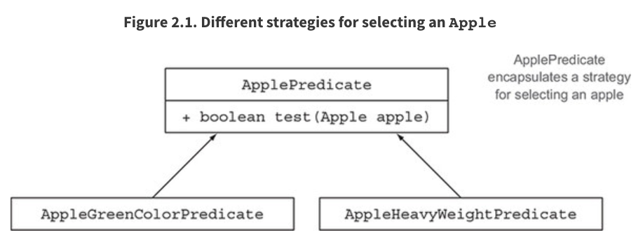
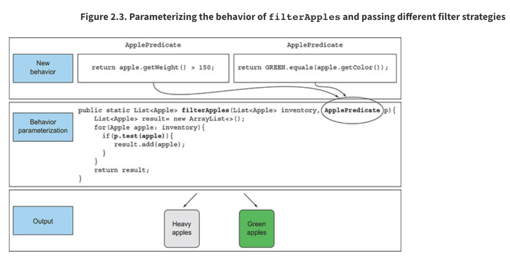
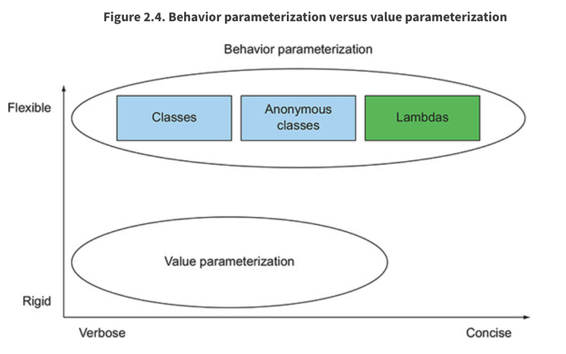

# Capítulo 2. Pasando código con parametrización de comportamiento

*Este capítulo cubre*

* Hacer frente a los requisitos cambiantes
* Parametrización de comportamiento
* Clases anónimas
* Vista previa de expresiones lambda
* Ejemplos del mundo real: `Comparator`, `Runnable` y GUI

Un problema bien conocido en la ingeniería de software es que no importa lo que haga, ***los requisitos del usuario cambiarán***. Por ejemplo, imagine una aplicación para ayudar a un agricultor a comprender su inventario. El agricultor puede querer una funcionalidad para encontrar todas las manzanas verdes en su inventario. Pero al día siguiente podría decirle: "En realidad, también quiero encontrar todas las manzanas que pesen más de 150 g". Dos días después, el agricultor regresa y agrega: "Sería realmente bueno si pudiera encontrar todas las manzanas que son verdes y pesan más de 150 g". ¿Cómo puede hacer frente a estos requisitos cambiantes? Idealmente, le gustaría minimizar su esfuerzo de ingeniería. Además, nuevas funcionalidades similares deberían ser sencillas de implementar y de mantener a largo plazo.

La ***parametrización del comportamiento*** (***Behavior parameterization***) es un patrón de desarrollo de software que le permite manejar cambios frecuentes en los requisitos. En pocas palabras, significa tomar un bloque de código y ponerlo a disposición sin ejecutarlo. Este bloque de código puede ser llamado posteriormente por otras partes de sus programas, lo que significa que puede diferir la ejecución de ese bloque de código. Por ejemplo, puede pasar el bloque de código como argumento a otro método que lo ejecutará más tarde. Como resultado, el comportamiento del método se parametriza en función de ese bloque de código. Por ejemplo, si procesa una colección, es posible que desee escribir un método que

* Puede hacer "algo" por cada elemento de una lista
* Puede hacer "otra cosa" cuando termine de procesar la lista
* Puede hacer "todavía algo más" si encuentra un error

A esto se refiere la ***parametrización del comportamiento***. He aquí una analogía: tu compañero de cuarto sabe cómo conducir hasta el supermercado y volver a casa. Puede decirle que compre una lista de cosas como pan, queso y vino. Esto es equivalente a llamar a un método **`goAndBuy`** pasando una lista de productos como argumento. Pero un día estás en la oficina y necesitas que él haga algo que nunca había hecho antes: recoger un paquete de la oficina de correos. Debe pasarle una lista de instrucciones: vaya a la oficina de correos, use este número de referencia, hable con el gerente y recoja el paquete. Puede pasarle la lista de instrucciones por correo electrónico, y cuando la reciba, podrá seguir las instrucciones. Ahora ha hecho algo un poco más avanzado que es equivalente a un método **`goAndDo`**, que puede ejecutar varios comportamientos nuevos como argumentos.

Comenzaremos este capítulo con un ejemplo de ***cómo puede evolucionar su código para que sea más flexible para los requisitos cambiantes***. Basándonos en este conocimiento, ***mostramos cómo utilizar la parametrización del comportamiento para varios ejemplos del mundo real***. Por ejemplo, es posible que ya haya usado el patrón de parametrización de comportamiento, usando clases e interfaces existentes en la API de Java para ordenar una lista, filtrar nombres de archivos o decirle a **`Thread`** que ejecute un bloque de código o incluso realice el manejo de eventos de GUI . Pronto se dará cuenta de que este patrón ha sido históricamente detallado en Java. Las expresiones lambda en Java 8 en adelante abordan el **problema de la verbosidad**. En el capítulo 3 mostraremos cómo construir expresiones lambda, dónde usarlas y cómo puede hacer que su código sea más conciso al adoptarlas.

## 2.1. HACER FRENTE A LOS REQUISITOS CAMBIANTES

Escribir código que pueda hacer frente a los requisitos cambiantes es difícil. Veamos un ejemplo que mejoraremos gradualmente, mostrando algunas prácticas recomendadas para hacer que su código sea más flexible. En el contexto de una aplicación de inventario agrícola, debe implementar una funcionalidad para filtrar manzanas ***verdes*** de una lista. Suena fácil, ¿verdad?

### 2.1.1. Primer intento: Filtrar manzanas verdes

Suponga, como en el capítulo 1, que tiene una enumeración **`Color`** disponible para representar diferentes colores de una manzana:

```java
enum Color { RED, GREEN }
```

Una primera solución podría ser la siguiente:

```java
public static List<Apple> filterGreenApples(List<Apple> inventory) {
   List<Apple> result = new ArrayList<>();                         1
   for(Apple apple: inventory){
      if( GREEN.equals(apple.getColor() ) {                        2
         result.add(apple);
      }
   }
   return result;
}
```

**1. Una lista acumulativa para manzanas**
**2. Selecciona solo manzanas verdes**

La línea resaltada (2) muestra la condición requerida para seleccionar manzanas verdes. Puede suponer que tiene una enumeración **`Color`** con un conjunto de colores, como **`GREEN`**, disponible. Pero ahora el agricultor cambia de opinión y quiere filtrar también manzanas *rojas*. ¿Qué puedes hacer? Una solución ingenua sería duplicar su método, renombrarlo como **`filterRedApples`** y cambiar la condición **`if`** para que coincida con las manzanas rojas. Sin embargo, este enfoque no se adapta bien a los cambios si el agricultor quiere varios colores. ***Un buen principio es este: cuando se encuentre escribiendo código casi repetido, intente abstraerlo***.

### 2.1.2. Segundo intento: Parametrizar el color

¿Cómo evitamos duplicar la mayor parte del código en **`filterGreenApples`** para hacer **`filterRedApples`**? Para parametrizar el color y ser más flexible a tales cambios, lo que podría hacer es agregar un parámetro a su método:

```java
public static List<Apple> filterApplesByColor(List<Apple> inventory, Color color) {
   List<Apple> result = new ArrayList<>();
   for (Apple apple: inventory) {
      if ( apple.getColor().equals(color) ) {
         result.add(apple);
      }
   }
   return result;
}
```

Ahora puede hacer feliz al agricultor e invocar su método de la siguiente manera:

```java
List<Apple> greenApples = filterApplesByColor(inventory, GREEN);
List<Apple> redApples = filterApplesByColor(inventory, RED);
...
```

Demasiado facil, verdad? Compliquemos un poco el ejemplo. El agricultor vuelve y le dice: "Sería genial diferenciar entre manzanas ligeras y pesadas. Las manzanas pesadas suelen tener un peso superior a 150g".

Con su sombrero de ingeniero de software, se da cuenta de antemano de que el agricultor puede querer variar el peso. Entonces crea el siguiente método para hacer frente a varios pesos a través de un parámetro adicional:

```java
public static List<Apple> filterApplesByWeight(List<Apple> inventory, int weight) {
   List<Apple> result = new ArrayList<>();
   for (Apple apple: inventory){
      if ( apple.getWeight() > weight ) {
         result.add(apple);
      }
   }
   return result;
}
```

Ésta es una buena solución, pero observe cómo debe duplicar la mayor parte de la implementación para recorrer el inventario y aplicar los criterios de filtrado en cada manzana. Esto es algo decepcionante porque rompe el ***principio DRY(don’t repeat yourself)*** de la ingeniería de software. ¿Qué sucede si desea modificar el desplazamiento del filtro para mejorar el rendimiento? Ahora tiene que modificar la implementación de ***todos*** sus métodos en lugar de solo uno. Esto es caro desde la perspectiva del esfuerzo de ingeniería.

Puede combinar el color y el peso en un método, llamado **`filter`**. Pero, de todos modos, necesitaría una forma de diferenciar el atributo por el que desea filtrar. Puede agregar una bandera para diferenciar entre consultas de color y peso. (¡Pero nunca hagas esto! Explicaremos por qué en breve).

### 2.1.3. Tercer intento: filtrar con todos los atributos que se te ocurran

Un feo intento de fusionar todos los atributos podría ser el siguiente:

```java
public static List<Apple> filterApples(List<Apple> inventory, Color color, int weight, boolean flag) {
   List<Apple> result = new ArrayList<>();
   for (Apple apple: inventory) {
      if ( (flag && apple.getColor().equals(color)) ||
            (!flag && apple.getWeight() > weight) ){          1
         result.add(apple);
      }
   }
   return result;
}
```

**1. Una forma fea de seleccionar color o peso**

Podrías usar esto de la siguiente manera (pero es feo):

```java
List<Apple> greenApples = filterApples(inventory, GREEN, 0, true);
List<Apple> heavyApples = filterApples(inventory, null, 150, false);
...
```

Esta solución es extremadamente mala. Primero, el código del cliente se ve terrible. ¿Qué significan **`true`** y **`false`**? Además, esta solución no se adapta bien a los requisitos cambiantes. ¿Qué pasa si el agricultor le pide que filtre con diferentes atributos de una manzana, por ejemplo, su tamaño, su forma, su origen, etc.? Además, ¿qué pasa si el agricultor le pide consultas más complicadas que combinan atributos, como manzanas verdes que también son pesadas? O tendría varios métodos **`filter`** duplicados o un método enormemente complejo. Hasta ahora, ha parametrizado el método **`filterApples`** *con valores* como **`String`**, **`Integer`**, un tipo **`enum`** o **`boolean`**. Esto puede estar bien para ciertos problemas bien definidos. Pero en este caso, lo que necesita es una mejor manera de decirle a su método **`filterApples`** los criterios de selección para las manzanas. En la siguiente sección, describimos cómo hacer uso de la parametrización del comportamiento para lograr esa flexibilidad.

## 2.2. PARAMETRIZACIÓN DE COMPORTAMIENTO

En la sección anterior vio que necesita una mejor manera que agregar muchos parámetros para hacer frente a los requisitos cambiantes. Retrocedamos y encontremos un mejor nivel de abstracción. Una posible solución es modelar sus criterios de selección: está trabajando con manzanas y devuelve un **`boolean`** basado en algunos atributos de **`Apple`**. Por ejemplo, ¿es verde? ¿Pesa más de 150 g? A esto lo llamamos **Predicado** (***una función que devuelve un `booleano`***). Por lo tanto, definamos una interfaz ***para modelar los criterios de selección***:

```java
public interface ApplePredicate{
   boolean test (Apple apple);
}
```

Ahora puede declarar múltiples implementaciones de **`ApplePredicate`** para representar diferentes criterios de selección, como se muestra a continuación (y se ilustra en la **figura 2.1**):



```java
public class AppleHeavyWeightPredicate implements ApplePredicate {   1
   public boolean test(Apple apple) {
      return apple.getWeight() > 150;
   }
}
public class AppleGreenColorPredicate implements ApplePredicate {    2
   public boolean test(Apple apple) {
      return GREEN.equals(apple.getColor());
   }
}
```

**1. Selecciona solo manzanas pesadas**
**2. Selecciona solo manzanas verdes**

Puede ver estos criterios como comportamientos diferentes para el método **`filter`**. Lo que acaba de hacer está relacionado con el **Patrón de Diseño de la Estrategia (strategy design pattern)** (consulte http://en.wikipedia.org/wiki/Strategy_pattern), ***que le permite definir una familia de algoritmos, encapsular cada algoritmo (llamado estrategia) y seleccionar un algoritmo en tiempo de ejecución***. ***En este caso la familia de algoritmos es*** **`ApplePredicate`** ***y las diferentes estrategias son*** **`AppleHeavyWeightPredicate`** ***y*** **`AppleGreenColorPredicate`**.

Pero, ¿cómo se pueden utilizar las diferentes implementaciones de **`ApplePredicate`**? Necesita su método **`filterApples`** para aceptar objetos **`ApplePredicate`** para probar una condición en un **`Apple`**. Esto es lo que significa la ***parametrización del comportamiento (behavior parameterization)***: **la capacidad de decirle a un método que tome múltiples comportamientos (o estrategias) como parámetros y los use internamente para lograr diferentes comportamientos**.

Para lograr esto en el ejemplo en ejecución, agrega un parámetro al método **`filterApples`** para tomar un objeto **`ApplePredicate`**. Esto tiene un gran beneficio de ingeniería de software: ahora puede separar la lógica de iterar la colección dentro del método **`filter-Apples`** con el comportamiento que desea aplicar a cada elemento de la colección (en este caso, un predicado).

### 2.2.1. Cuarto intento: Filtrado por criterios abstractos

Nuestro método de filtro modificado, que utiliza un **`ApplePredicate`**, se ve así:

```java
public static List<Apple> filterApples(List<Apple> inventory, ApplePredicate p) {
   List<Apple> result = new ArrayList<>();
   for(Apple apple: inventory) {
      if(p.test(apple)) {                       1
         result.add(apple);
      }
   }
   return result;
}
```

**1. El predicado `p` encapsula la condición para probar en una manzana.**
   
#### Passing code/behavior (Pasar código/comportamiento)
   
Vale la pena detenerse un momento para una pequeña celebración. Este código es mucho más flexible que nuestro primer intento, pero al mismo tiempo es fácil de leer y usar. Ahora puede crear diferentes objetos **`ApplePredicate`** y pasarlos al método **`filterApples`**. ¡Flexibilidad libre! Por ejemplo, si el agricultor le pide que busque todas las ***manzanas rojas que pesen más de 150 g***, todo lo que necesita hacer es crear una clase que implemente **`ApplePredicate`** en consecuencia. Su código ahora es lo suficientemente flexible para cualquier cambio de requisitos que involucre los atributos de **`Apple`**:

```java
public class AppleRedAndHeavyPredicate implements ApplePredicate {
   public boolean test(Apple apple){
      return RED.equals(apple.getColor())
             && apple.getWeight() > 150;
   }
}
List<Apple> redAndHeavyApples = filterApples(inventory, new AppleRedAndHeavyPredicate());
```

Has logrado algo genial; el comportamiento del método **`filterApples`** depende del código que le pase a través del objeto **`ApplePredicate`**. ***¡Ha parametrizado el comportamiento del método*** **`filterApples`**!

Tenga en cuenta que en el ejemplo anterior, el único código que importa es la implementación del método **`test`**, como se ilustra en la **figura 2.2**; esto es lo que define los nuevos comportamientos para el método **`filterApples`**. Desafortunadamente, debido a que el método **`filterApples`** solo puede tomar objetos, debe envolver ese código dentro de un objeto **`ApplePredicate`**. Lo que está haciendo es similar a pasar código en línea, porque está pasando una expresión **`boolean`** a través de un objeto que implementa el método **`test`**. Verá en la sección 2.3 (y con más detalle en el capítulo 3) que al usar lambdas, puede pasar directamente la expresión **`RED.equals(apple.getColor()) && apple.getWeight() > 150`** al método **`filterApples`** sin tener que definir varias clases **`ApplePredicate`**. ***Esto elimina la verbosidad innecesaria***.


#### Multiple behaviors, one parameter (Múltiples comportamientos, un parámetro)

Como explicamos anteriormente, la ***parametrización del comportamiento*** es excelente porque le permite separar la lógica de iterar la colección para filtrar y el comportamiento para aplicar en cada elemento de esa colección. Como consecuencia, puedes reutilizar el mismo método y darle diferentes comportamientos para lograr cosas diferentes, como se ilustra en la **figura 2.3**. Es por eso que la ***parametrización del comportamiento*** es un concepto útil que debe tener en su conjunto de herramientas para crear API flexibles.





