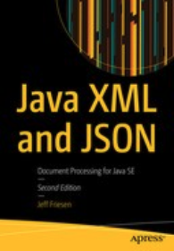

# 920 Java XML and JSON: Document Processing for Java SE

* by Jeff Friesen
* Publisher: Apress
* Release Date: January 2019
* ISBN: 9781484243305
* Topic: JSON
* Pages: 528
* https://learning.oreilly.com/library/view/java-xml-and/9781484243305/

### Descripción del libro

Utilice esta guía para dominar el metalenguaje XML y el formato de datos JSON junto con importantes API de Java para analizar y crear documentos XML y JSON a partir del lenguaje Java. La novedad de esta edición es la cobertura de Jackson (un procesador JSON para Java) y la propia API Java de Oracle para procesamiento JSON (JSON-P), que es una API de procesamiento JSON para Java EE que también se puede utilizar con Java SE. Esta nueva edición de ***Java XML y JSON*** también amplía la cobertura de DOM y XSLT para incluir contenido API adicional y ejemplos útiles.

Todos los ejemplos de este libro se han probado en Java 11. En algunos casos, el código fuente se ha simplificado para utilizar la función var del lenguaje de Java 11. Los primeros seis capítulos se centran en XML junto con las API SAX, DOM, StAX, XPath y XSLT. Los seis capítulos restantes se centran en JSON junto con las API mJson, GSON, JsonPath, Jackson y JSON-P. Cada capítulo termina con ejercicios seleccionados diseñados para desafiar su comprensión del contenido del capítulo. Un apéndice proporciona las respuestas a estos ejercicios.

#### Qué aprenderás

* Domina el lenguaje XML
* Cree, valide, analice y transforme documentos XML
* Aplicar las API SAX, DOM, StAX, XPath y XSLT de Java
* Domina el formato JSON para serializar y transmitir datos
* Código contra API de terceros como Jackson, mJson, Gson, JsonPath
* Domine la API JSON-P de Oracle en un contexto Java SE

#### Para quien es este libro

Programadores Java intermedios y avanzados que desarrollan aplicaciones que deben acceder a datos almacenados en documentos XML o JSON. El libro también está dirigido a desarrolladores que desean comprender el lenguaje XML y el formato de datos JSON.

### Table of Contents

* Cover
* [Front Matter](920_Java_XML_and_JSON/00_Front_Matter.md)
* Part I. Exploring XML
   * [1.- Introducing XML](920_Java_XML_and_JSON/01_Introducing_XML.md)
   * 2.- Parsing XML Documents with SAX
   * 3.- Parsing and Creating XML Documents with DOM
   * 4.- Parsing and Creating XML Documents with StAX
   * 5.- Selecting Nodes with XPath
   * 6.- Transforming XML Documents with XSLT
* Part II. Exploring JSON
   * 7.- Introducing JSON
   * 8.- Parsing and Creating JSON Objects with mJson
   * 9.- Parsing and Creating JSON Objects with Gson
   * 10.- Extracting JSON Values with JsonPath
   * 11.- Processing JSON with Jackson
   * 12.- Processing JSON with JSON-P
* Part III. Appendixes
   * Answers to Exercises
* Back Matter
