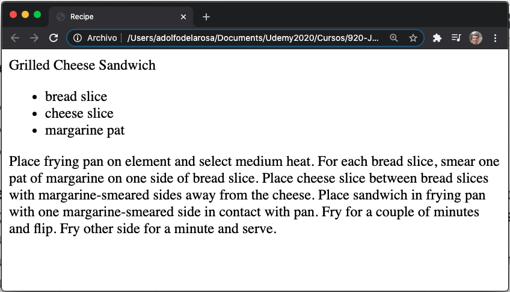

# Capítulo 1: Introducing XML

* What Is XML?
* Language Features Tour
   * XML Declaration
   * Elements and Attributes
   * Character References and CDATA Sections
   * Namespaces
   * Comments and Processing Instructions
* Well-Formed Documents
* Valid Documents
   * Document Type Definition
   * XML Schema
* Summary


Las aplicaciones suelen utilizar documentos XML para almacenar e intercambiar datos. XML define reglas para codificar documentos en un formato que es legible por humanos y legible por máquina. El Capítulo 1 presenta XML, recorre las características del lenguaje XML y analiza los documentos válidos y bien formados.

## ¿Qué es XML?

***XML*** (eXtensible Markup Language) es un *meta-language* (un lenguaje utilizado para describir otros lenguajes) para definir *vocabularios* (custom markup languages), que es la clave de la importancia y popularidad de XML. Los vocabularios basados en XML (como XHTML) le permiten describir documentos de manera significativa.

Los documentos de vocabulario XML son como documentos HTML (consulte http://en.wikipedia.org/wiki/HTML) en el sentido de que están basados en texto y constan de *markup* (descripciones codificadas de la estructura lógica de un documento) y *contenido* (el texto del documento no se interpreta como marcado). El marcado se evidencia mediante tags (etiquetas) (construcciones sintácticas delimitadas por corchetes angulares), y cada etiqueta tiene un nombre. Además, algunas etiquetas tienen *atributos* (pares de name/value).

> **NOTA** XML y HTML son descendientes del lenguaje de marcado estándar generalizado (SGML), que es el metalenguaje original para crear vocabularios; XML es esencialmente una forma restringida de SGML, mientras que HTML es una aplicación de SGML. La diferencia clave entre XML y HTML es que XML lo invita a crear sus propios vocabularios con sus propias etiquetas y reglas, mientras que HTML le brinda un vocabulario creado previamente con su propio conjunto fijo de etiquetas y reglas. XHTML y otros vocabularios basados en XML son aplicaciones XML. XHTML fue creado para ser una implementación más limpia de HTML.

Si no se ha encontrado previamente con XML, es posible que se sorprenda por su simplicidad y lo mucho que sus vocabularios se parecen a HTML. No es necesario ser un científico espacial para aprender a crear un documento XML. Para demostrárselo a usted mismo, consulte el Listado 1-1.

```xml
<recipe>
   <title>
      Grilled Cheese Sandwich
   </title>
   <ingredients>
      <ingredient qty="2">
         bread slice
      </ingredient>
      <ingredient>
         cheese slice
      </ingredient>
      <ingredient qty="2">
         margarine pat
      </ingredient>
   </ingredients>
   <instructions>
      Place frying pan on element and select medium heat.
      For each bread slice, smear one pat of margarine on
      one side of bread slice. Place cheese slice between
      bread slices with margarine-smeared sides away from
      the cheese. Place sandwich in frying pan with one
      margarine-smeared side in contact with pan. Fry for
      a couple of minutes and flip. Fry other side for a
      minute and serve.
   </instructions>
</recipe>
```
***Listado 1-1*** Receta basada en XML para un sándwich de queso a la parrilla

El Listado 1-1 presenta un documento XML que describe una receta para hacer un sándwich de queso a la parrilla. Este documento recuerda a un documento HTML en el sentido de que consta de etiquetas, atributos y contenido. Sin embargo, ahí es donde termina la similitud. En lugar de presentar etiquetas HTML como `<html>`, `<head>`, `` y `<p>`, este lenguaje de recetas informal presenta sus propias etiquetas `<recipe>`, `<ingredients>` y otras etiquetas.

> **NOTA** Aunque las etiquetas `<title>` y `</title>` del Listado 1-1 también se encuentran en HTML, difieren de sus equivalentes HTML. Los navegadores web suelen mostrar el contenido entre estas etiquetas en sus barras de título o encabezados de pestaña. Por el contrario, el contenido entre las etiquetas `<title>` y `</title>` del Listado 1-1 puede mostrarse como un encabezado de receta, hablado en voz alta o presentado de alguna otra manera, según la aplicación que analice este documento.

<hr>

## Tour de Características Lingüísticas

XML proporciona varias características de lenguaje para su uso en la definición de lenguajes de marcado personalizados: declaración XML, elementos y atributos, referencias de caracteres y secciones CDATA, namespaces (espacios de nombres) y comentarios e instrucciones de procesamiento. Aprenderá acerca de estas características del lenguaje en esta sección.

### DECLARACIÓN XML

Un documento XML generalmente comienza con la *declaración XML*, un marcado especial que le dice a un analizador XML que el documento es XML. La ausencia de la declaración XML en el Listado 1-1 revela que este marcado especial no es obligatorio. Cuando la declaración XML está presente, no puede aparecer nada antes.

La declaración XML se parece mínimamente a `<? Xml version = "1.0"?>` En la que el atributo de versión no opcional identifica la versión de la especificación XML a la que se ajusta el documento. La versión inicial de esta especificación (1.0) se introdujo en 1998 y está ampliamente implementada.

> **NOTA**: El Consorcio World Wide Web (W3C), que mantiene XML, lanzó la versión 1.1 en 2004. Esta versión admite principalmente el uso de caracteres de final de línea utilizados en plataformas EBCDIC (consulte http://en.wikipedia.org/wiki/EBCDIC) y el uso de scripts y caracteres que están ausentes en Unicode (consulte http://en.wikipedia.org/wiki/Unicode) 3.2. A diferencia de XML 1.0, XML 1.1 no está ampliamente implementado y solo debe usarse cuando se necesitan sus características únicas.

XML es compatible con Unicode, lo que significa que los documentos XML constan en su totalidad de caracteres tomados del juego de caracteres Unicode (Unicode character set). Los caracteres del documento se codifican en bytes para su almacenamiento o transmisión, y la codificación se especifica mediante el atributo opcional `encoding` de la declaración XML. Una codificación común es *UTF-8* (consulte http://en.wikipedia.org/wiki/UTF-8), que es una codificación de longitud variable del juego de caracteres Unicode. UTF-8 es un superconjunto estricto de ASCII (consulte http://en.wikipedia.org/wiki/ASCII), lo que significa que los archivos de texto ASCII puros también son documentos UTF-8.

> **NOTA** En ausencia de la declaración XML o cuando el atributo de codificación de la declaración XML no está presente, un analizador XML normalmente busca una secuencia de caracteres especial al comienzo de un documento para determinar la codificación del documento. Esta secuencia de caracteres se conoce como *marca de orden de bytes (BOM) (byte-order-mark (BOM))* y la crea un programa editor (como el Bloc de notas de Microsoft Windows) cuando guarda el documento de acuerdo con UTF-8 o alguna otra codificación. Por ejemplo, la secuencia hexadecimal `EF BB BF` significa UTF-8 como codificación. De manera similar, `FE FF` significa UTF-16 (ver http://en.wikipedia.org/wiki/UTF-16) big endian, `FF FE` significa UTF-16 little endian, `00 00 FE FF` significa UTF-32 (ver http: //en.wikipedia.org/wiki/UTF-32) big endian, y `FF FE 00 00` significa UTF-32 little endian. Se asume UTF-8 cuando no hay una lista de materiales.

Si nunca va a utilizar caracteres aparte del conjunto de caracteres ASCII, probablemente pueda olvidarse del atributo `encoding`. Sin embargo, cuando su idioma nativo no es el inglés o cuando lo llaman para crear documentos XML que incluyen caracteres que no son ASCII, debe especificar la codificación correctamente. Por ejemplo, cuando su documento contiene caracteres ASCII más caracteres de un idioma de Europa occidental que no es inglés (como ç, la cedilla que se usa en francés, portugués y otros idiomas), es posible que desee elegir `ISO-8859-1` como el atributo `encoding` valor: el documento probablemente tendrá un tamaño más pequeño cuando se codifique de esta manera que cuando se codifique con UTF-8. El Listado 1-2 le muestra la declaración XML resultante.

```xml
<?xml version="1.0" encoding="ISO-8859-1"?>
<movie>
   <name>Le Fabuleux Destin d'Amélie Poulain</name>
   <language>français</language>
</movie>
```
***Listado 1-2*** Un documento codificado que contiene caracteres no ASCII

El atributo final que puede aparecer en la declaración XML es `standalone`. Este atributo opcional, que solo es relevante con DTD (discutido más adelante), determina si hay declaraciones de marcado externas que afectan la información pasada de un *procesador XML* (un parser [analizador]) a la aplicación. Su valor predeterminado es `no`, lo que implica que existen o pueden existir tales declaraciones. Un valor de `yes` indica que no existen tales declaraciones. Para obtener más información, consulte “The standalone pseudo-attribute is only relevant if a DTD is used” (www.xmlplease.com/xml/standalone/).

### ELEMENTOS Y ATRIBUTOS

A continuación de la declaración XML hay una estructura *jerárquica* (árbol) de elementos, donde un *elemento* es una parte del documento delimitada por una start tag - etiqueta de inicio (como `<name>`) y una end tag - etiqueta de fin (como `</name>`), o es una *empty-element tag* - etiqueta de elemento vacío (una etiqueta independiente cuyo nombre termina con una barra inclinada [/], como `<break/>`). Las etiquetas de inicio y las etiquetas de finalización rodean el contenido y posiblemente otras marcas, mientras que las etiquetas de elementos vacíos no rodean nada. La Figura 1-1 muestra la estructura de árbol del documento XML del Listado 1-1.


Al igual que con la estructura de un documento HTML, la estructura de un documento XML está anclada en un *root element* - elemento raíz (el elemento superior). En HTML, el elemento raíz es `html` (el par de etiquetas `<html>` y `</html>`). A diferencia de HTML, puede elegir el elemento raíz de sus documentos XML. La Figura 1-1 muestra el elemento raíz que es `recipe`.

A diferencia de los otros elementos, que tienen elementos padre, `recipe` no tiene padre. Además, `recipe` y `ingredients` tienen elementos hijos: los elementos hijos de `recipe` son `title`, `ingredients` e `instructions`; y los hijos de `ingredients` son tres instancias de `ingredient`. El `title`, `instructions` y los elementos `ingredient` no tienen elementos hijos.

Los elementos pueden contener elementos hijos, contenido o *contenido mixto* (una combinación de elementos secundarios y contenido). El Listado 1-2 revela que el elemento `movie` contiene elementos hijos `name` y `language` y también revela que cada uno de estos elementos hijos contiene contenido (por ejemplo, `language` contiene `français`). El Listado 1-3 presenta otro ejemplo que demuestra contenido mixto junto con elementos hijos y contenido.

```xml
<?xml version="1.0"?>
<article title="The Rebirth of JavaFX" lang="en">
   <abstract>
      JavaFX 2 marks a significant milestone in the history
      of JavaFX. Now that Sun Microsystems has passed the
      torch to Oracle, JavaFX Script is gone and
      JavaFX-oriented Java APIS (such as
      <code>javafx.application.Application</code>) have
      emerged for interacting with this technology. This
      article introduces you to this refactored JavaFX,
      where you learn about JavaFX 2 architecture and key
      APIs.
   </abstract>
   <body>
   </body>
</article>
```
***Listado 1-3*** Un Elemento `Abstract` que Contiene Contenido Mixto

El elemento raíz de este documento es `article`, que contiene los elementos hijos `abstract` y `body`. El elemento `abstract` mezcla contenido con un elemento `code`, que contiene contenido. Por el contrario, el elemento `body` está vacío.

> **NOTA** Con los listados 1-1 y 1-2, el listado 1-3 también contiene *espacios en blanco* (caracteres invisibles como espacios, tabulaciones, retornos de carro y avances de línea). La especificación XML permite agregar espacios en blanco a un documento. Los espacios en blanco que aparecen en el contenido (como espacios entre palabras) se consideran parte del contenido. Por el contrario, el analizador normalmente ignora los espacios en blanco que aparecen entre una etiqueta final y la siguiente etiqueta de inicio. Este espacio en blanco no se considera parte del contenido.

La etiqueta de inicio de un elemento XML puede contener uno o más atributos. Por ejemplo, la etiqueta `<ingredient>` del Listado 1-1 tiene un atributo `qty` (cantidad) y la etiqueta `<article>` del Listado 1-3 tiene los atributos `title` y `lang`. Los atributos proporcionan detalles adicionales sobre los elementos. Por ejemplo, `qty` identifica la cantidad de un ingrediente que se puede agregar, `title` identifica el título de un artículo y `lang` identifica el idioma en el que está escrito el artículo (`en` para Inglés). Los atributos pueden ser opcionales. Por ejemplo, cuando no se especifica `qty`, se asume un valor predeterminado de `1`.

> **NOTA** Los elementos y atributos `names` pueden contener cualquier carácter alfanumérico del inglés o de otro idioma y también pueden incluir los caracteres de puntuación de subrayado (`_`), guión (`-`), punto (`.`) y dos puntos (`:`). Los dos puntos solo deben usarse con namespaces (discutidos más adelante en este capítulo) y **los `names` no pueden contener espacios en blanco**.

### CHARACTER REFERENCES AND CDATA SECTIONS - REFERENCIAS DE CARÁCTER Y SECCIONES CDATA

Ciertos caracteres no pueden aparecer literalmente en el contenido que aparece entre una etiqueta de inicio y una etiqueta de finalización o dentro de un valor de atributo. Por ejemplo, no puede colocar un carácter literal `<` entre una etiqueta de inicio y una etiqueta de finalización porque hacerlo confundiría a un analizador XML haciéndole pensar que ha encontrado otra etiqueta.

Una solución a este problema es reemplazar el carácter literal con una *character reference*, que es un código que representa el carácter. Las referencias de caracteres se clasifican como referencias de caracteres numéricos o referencias a entidades de caracteres:

Una solución a este problema es reemplazar el carácter literal con una *character reference*, que es un código que representa el carácter. Las referencias de caracteres se clasifican como referencias de caracteres numéricos o referencias a entidades de caracteres:

* Una *referencia de carácter numérico* se refiere a un carácter a través de su punto de código Unicode y se adhiere al formato `&#nnnn;` (no restringido a cuatro posiciones) o `&#xhhhh;` (no restringido a cuatro posiciones), donde `nnnn` proporciona una representación decimal del punto de código y `hhhh` proporciona una representación hexadecimal. Por ejemplo, `Σ` y `Σ` representan la letra mayúscula griega sigma. Aunque XML exige que la `x` en `&#xhhhh;` sea minúscula, es flexible porque el cero a la izquierda es opcional en cualquier formato y le permite especificar una letra mayúscula o minúscula para cada `h`. Como resultado, `Σ`, `Σ` y `Σ` también son representaciones válidas de la letra mayúscula griega sigma.

* Una *referencia de entidad de carácter* se refiere a un carácter a través del nombre de una *entidad* (datos con alias) que especifica el carácter deseado como su texto de reemplazo. Las referencias a entidades de caracteres están predefinidas por XML y tienen el formato `&name;`, en el que `name` es el nombre de la entidad. XML predefine cinco referencias a entidades de caracteres: `<`(`<`),`>` (`>`), `&` (`&`), `&apos;` (`'`) y `&quot;` (`"`).

Considere `<expression>6 < 4</expression>`. Puede reemplazar `<` con la referencia numérica `<`, dando `<expression>6 < 4</expression>`, o mejor aún con `<`, dando `<expression>6 < 4</expression>`. La segunda opción es más clara y fácil de recordar.

Suponga que desea incrustar un documento HTML o XML dentro de un elemento. Para que el documento incrustado sea aceptable para un analizador XML, necesitaría reemplazar cada carácter literal `<`(inicio de etiqueta) y `&` (inicio de entidad) con su `<` y `&` referencia de entidad de carácter predefinida, una tarea tediosa y posiblemente propensa a errores : Es posible que se olvide de reemplazar uno de estos caracteres. Para evitar el tedio y los posibles errores, XML proporciona una alternativa en forma de una sección CDATA (datos de caracteres).

Una *sección CDATA* es una sección de contenido y marcado HTML o XML literal rodeada por el prefijo `<![CDATA[` y el sufijo `]]>`. No es necesario que especifique referencias de entidades de caracteres predefinidas dentro de una sección CDATA, como se muestra en el Listado 1-4.

```xml
<?xml version="1.0"?>
<svg-examples>
   <example>
      The following Scalable Vector Graphics document
      describes a blue-filled and black-stroked
      rectangle.
      <![CDATA[<svg width="100%" height="100%"
         version="1.1"
         xmlns:="http://www.w3.org/2000/svg">
         <rect width="300" height="100"
            style="fill:rgb(0,0,255);stroke-width:1;
                  stroke:rgb(0,0,0)"/>
      </svg>]]>
   </example>
</svg-examples>
```
***Listado 1-4*** Incrustación de un documento XML en la sección CDATA de otro documento

El Listado 1-4 incluye un documento XML Scalable Vector Graphics (SVG) [consulte http://en.wikipedia.org/wiki/Scalable_Vector_Graphics] dentro del elemento de ejemplo de un documento de ejemplos SVG. El documento SVG se coloca en una sección CDATA, lo que evita la necesidad de reemplazar todos los caracteres `<` con referencias de entidades de caracteres `<` predefinidas.

### NAMESPACES

Es común crear documentos XML que combinan funciones de diferentes lenguajes XML. Los espacios de nombres se utilizan para evitar conflictos de nombres cuando aparecen elementos y otras características del lenguaje XML. Sin espacios de nombres, un analizador XML no podría distinguir entre elementos del mismo nombre u otras características del lenguaje que significan cosas diferentes, por ejemplo, dos elementos de título del mismo nombre de dos idiomas diferentes.

> **NOTA** Los espacios de nombres no forman parte de XML 1.0. Llegaron aproximadamente un año después de que se publicara esta especificación. Para garantizar la compatibilidad con versiones anteriores de XML 1.0, los espacios de nombres aprovechan los dos puntos, que son caracteres legales en los nombres XML. Los analizadores que no reconocen los espacios de nombres devuelven nombres que incluyen dos puntos.

Un *namespace* es un Uniform Resource Identifier (URI) contenedor basado que ayuda a diferenciar los vocabularios XML al proporcionar un contexto único para sus identificadores contenidos. El URI del espacio de nombres está asociado con un prefijo de espacio de nombres - *namespace prefix* (un alias para el URI) especificando, normalmente en el elemento raíz de un documento XML, el atributo `xmlns` por sí mismo (que significa el espacio de nombres predeterminado) o el atributo `xmlns`:*prefix* (que significa el espacio de nombres identificado como *prefix* prefijo) y asignar el URI a este atributo.

> **NOTA** El alcance del espacio de nombres (namespace’s scope) comienza en el elemento donde se declara y se aplica a todo el contenido del elemento, a menos que se anule por otra declaración de espacio de nombres con el mismo nombre de prefijo.

Cuando se especifica el *prefix* - prefijo, el prefijo y un carácter de dos puntos se anteponen al nombre de cada etiqueta de elemento que pertenece a ese espacio de nombres; consulte el Listado 1-5.

```xml
<?xml version="1.0"?>
<h:html xmlns:h="http://www.w3.org/1999/xhtml"
        xmlns:r="http://www.javajeff.ca/">
   <h:head>
      <h:title>
         Recipe
      </h:title>
   </h:head>
   <h:body>
   <r:recipe>
      <r:title>
         Grilled Cheese Sandwich
      </r:title>
      <r:ingredients>
         <h:ul>
         <h:li>
         <r:ingredient qty="2">
            bread slice
         </r:ingredient>
         </h:li>
         <h:li>
         <r:ingredient>
            cheese slice
         </r:ingredient>
         </h:li>
         <h:li>
         <r:ingredient qty="2">
            margarine pat
         </r:ingredient>
         </h:li>
         </h:ul>
      </r:ingredients>
      <h:p>
      <r:instructions>
         Place frying pan on element and select medium
         heat. For each bread slice, smear one pat of
         margarine on one side of bread slice. Place
         cheese slice between bread slices with
         margarine-smeared sides away from the cheese.
         Place sandwich in frying pan with one
         margarine-smeared side in contact with pan.
         Fry for a couple of minutes and flip. Fry
         other side for a minute and serve.
      </r:instructions>
      </h:p>
   </r:recipe>
   </h:body>
</h:html>
```
***Listado 1-5*** Introducción de un par de Namespaces

El Listado 1-5 describe un documento que combina elementos del lenguaje XHTML (ver http://en.wikipedia.org/wiki/XHTML) con elementos del lenguaje de recetas. Todas las etiquetas de elementos que se asocian con XHTML tienen el prefijo `h:` y todas las etiquetas de elementos que se asocian con el lenguaje de la receta tienen el prefijo `r:`.

El prefijo `h:` se asocia con el URI www.w3.org/1999/xhtml, y el prefijo `r:` se asocia con el URI www.javajeff.ca. XML no exige que los URI apunten a archivos de documentos. Solo requiere que sean únicos para garantizar espacios de nombres únicos.

La separación de este documento de los datos de la receta de los elementos XHTML hace posible preservar la estructura de estos datos al mismo tiempo que permite que un navegador web compatible con XHTML (como Mozilla Firefox) presente la receta a través de una página web (consulte la Figura 1-2).


***Figura 1-2*** Google presenta los datos de la receta a través de etiquetas XHTML

Los atributos de una etiqueta no necesitan tener un prefijo cuando esos atributos pertenecen al elemento. Por ejemplo, `qty` no tiene el prefijo en `<r:ingredient qty="2">`. Sin embargo, se requiere un prefijo para los atributos que pertenecen a otros namespaces. Por ejemplo, suponga que desea agregar un atributo `style` XHTML a la etiqueta `<r:title>` del documento para proporcionar estilo al título de la receta cuando se muestra a través de una aplicación. Puede realizar esta tarea insertando un atributo XHTML en la etiqueta del `title`, de la siguiente manera:

```xml
<r:title h:style="font-family: sans-serif;">
```

El atributo `style` XHTML tiene el prefijo `h:` porque este atributo pertenece al namespace del lenguaje XHTML y no al namespace del lenguaje de recetas.

Cuando hay varios espacios de nombres involucrados, puede ser conveniente especificar uno de estos espacios de nombres como el espacio de nombres predeterminado para reducir el tedio al ingresar prefijos de espacios de nombres. Considere el listado 1-6.

```xml
<?xml version="1.0"?>
<html xmlns:="http://www.w3.org/1999/xhtml"
      xmlns:r="http://www.javajeff.ca/">
   <head>
      <title>
         Recipe
      </title>
   </head>
   <body>
   <r:recipe>
      <r:title>
         Grilled Cheese Sandwich
      </r:title>
      <r:ingredients>
         <ul>
         <li>
         <r:ingredient qty="2">
            bread slice
         </r:ingredient>
         </li>
         <li>
         <r:ingredient>
            cheese slice
         </r:ingredient>
         </li>
         <li>
         <r:ingredient qty="2">
            margarine pat
         </r:ingredient>
         </li>
         </ul>
      </r:ingredients>
      <p>
      <r:instructions>
         Place frying pan on element and select medium
         heat. For each bread slice, smear one pat of
         margarine on one side of bread slice. Place
         cheese slice between bread slices with
         margarine-smeared sides away from the cheese.
         Place sandwich in frying pan with one
         margarine-smeared side in contact with pan.
         Fry for a couple of minutes and flip. Fry
         other side for a minute and serve.
      </r:instructions>
      </p>
   </r:recipe>
   </body>
</html>
```
***Listado 1-6*** Especificación de un Namespace predeterminado

El Listado 1-6 especifica un espacio de nombres predeterminado para el lenguaje XHTML. Ninguna etiqueta de elemento XHTML necesita tener el prefijo `h:`. Sin embargo, las etiquetas de elementos del lenguaje de recetas aún deben tener el prefijo `r:` prefijo.

### COMENTARIOS E INSTRUCCIONES DE PROCESAMIENTO

Los documentos XML pueden contener comentarios, que son secuencias de caracteres que comienzan con `<!--` y terminan con `-->`. Por ejemplo, puede colocar `<!-- Todo -->` en el elemento `body` del Listado 1-3 para recordar que necesita terminar de codificar este elemento.

Los comentarios se utilizan para aclarar partes de un documento. Pueden aparecer en cualquier lugar después de la declaración XML, excepto dentro de las etiquetas, no se pueden anidar, no pueden contener un guión doble (`--`) porque hacerlo podría confundir al analizador XML de que el comentario se ha cerrado, no debe contener un guión (`-`) por el mismo motivo, y normalmente se ignoran durante el procesamiento. Los comentarios no son contenido.

XML también permite la presencia de instrucciones de procesamiento. Una *instrucción de procesamiento* es una instrucción que está disponible para la aplicación que analiza el documento. La instrucción comienza con `<?` y termina con `?>`. El prefijo `<?` va seguido de un nombre conocido como el *target* (destino). Este nombre generalmente identifica la aplicación a la que está destinada la instrucción de procesamiento. El resto de la instrucción de procesamiento contiene texto en un formato apropiado para la aplicación. Dos ejemplos de instrucciones de procesamiento son `<? Xml-stylesheet href = "modern.xsl" type = "text / xml"?>` (Asocie un lenguaje de hoja de estilo extensible [XSL] [consulte http://en.wikipedia.org/wiki/ XSL] con un documento XML) y `<?php /* PHP code */ ?>` (Pase un fragmento de código PHP [ver http://en.wikipedia.org/wiki/PHP] a la aplicación). Aunque la declaración XML parece una instrucción de procesamiento, este no es el caso.

> **NOTA** La declaración XML no es una instrucción de procesamiento.

## Documentos Bien Formados

HTML es un lenguaje descuidado en el que se pueden especificar elementos desordenados, se pueden omitir las etiquetas finales, etc. La complejidad del código de diseño de página de un navegador web se debe en parte a la necesidad de manejar estos casos especiales. Por el contrario, XML es un lenguaje mucho más estricto. Para que los documentos XML sean más fáciles de analizar, XML exige que los documentos XML sigan ciertas reglas:

* *Todos los elementos deben tener etiquetas de inicio y finalización o constar de etiquetas de elementos vacíos*. Por ejemplo, a diferencia de la etiqueta HTML `<p>` que a menudo se especifica sin una contraparte `</p>`, `</p>` también debe estar presente desde la perspectiva de un documento XML.

* *Las etiquetas deben estar anidadas correctamente*. Por ejemplo, aunque probablemente se saldrá con la suya al especificar `<b><i>XML</b></i>` en HTML, un analizador XML informaría de un error. Por el contrario, `<b><i>XML</i></b>` no genera un error, porque los pares de etiquetas anidados se reflejan entre sí.

* *Todos los valores de los atributos deben estar entre comillas*. Se permiten las comillas simples (`'`) o las comillas dobles (`"`) (aunque las comillas dobles son las comillas más comúnmente especificadas). Es un error omitir estas comillas.

* *Los elementos vacíos deben tener el formato adecuado*. Por ejemplo, la etiqueta `<br>` de HTML debería especificarse como `<br/>` en XML. Puede especificar un espacio entre el nombre de la etiqueta y el carácter `/` aunque el espacio es opcional.

* *Tenga cuidado con el case*. XML es un lenguaje **case-sensitive** que distingue entre mayúsculas y minúsculas en el que las etiquetas que difieren en mayúsculas y minúsculas (como `394211_2_En` y `394211_2_En` :flushed:) se consideran diferentes. Es un error mezclar etiquetas de inicio y finalización de diferentes casos, por ejemplo, `394211_2_En` con `</Author>`.

Los analizadores XML que conocen los espacios de nombres imponen dos reglas adicionales:

* Cada nombre de elemento y atributo no debe incluir más de un carácter de dos puntos.

* Ningún nombre de entidad, destino de instrucción de procesamiento o nombre de notación (discutido más adelante) puede contener dos puntos.

Un documento XML que se ajuste a estas reglas está *bien formado*. El documento tiene una apariencia lógica y limpia y es mucho más fácil de procesar. Los analizadores XML solo analizarán documentos XML bien formados.

## Documentos Válidos

No siempre es suficiente que un documento XML esté bien formado; en muchos casos el documento también debe ser válido. Un *documento válido* se adhiere a las limitaciones. Por ejemplo, se podría imponer una restricción al documento de la receta del Listado 1-1 para garantizar que el elemento `ingredients` siempre precede al elemento `instructions`; quizás una aplicación primero deba procesar `ingredients`.

> **NOTA** La validación de documentos XML es similar a un compilador que analiza el código fuente para asegurarse de que el código tenga sentido en el contexto de una máquina. Por ejemplo, cada uno de `int`, `count`, `=`, `1` y; es una secuencia de caracteres Java válida, pero `1 count ; int =` no es una construcción Java válida (mientras que `int count = 1;` es una construcción Java válida).

Algunos analizadores(parsers) XML realizan la validación, mientras que otros analizadores no lo hacen porque los analizadores de validación son más difíciles de escribir. Un analizador que realiza la validación compara un documento XML con un *documento gramatical*. Cualquier desviación del documento de gramática se informa como un error a la aplicación; el documento XML no es válido. La aplicación puede optar por corregir el error o rechazar el documento XML. A diferencia de los errores de formato correcto, los errores de validez no son necesariamente fatales y el analizador puede continuar analizando el documento XML.

> **NOTA** Los analizadores XML de validación a menudo no validan de forma predeterminada porque la validación puede llevar mucho tiempo. Deben recibir instrucciones para realizar la validación.

Los documentos gramaticales están escritos en un idioma especial. Dos lenguajes gramaticales de uso común son la definición de tipo de documento y el esquema XML.

### DOCUMENT TYPE DEFINITION - DEFINICIÓN DEL TIPO DE DOCUMENTO

*Document Type Definition (DTD)* (La definición de tipo de documento (DTD)) es el lenguaje gramatical más antiguo para especificar la *gramática* de un documento XML. Los documentos de gramática DTD (conocidos como DTD) se escriben de acuerdo con una sintaxis estricta que establece qué elementos pueden estar presentes y en qué partes de un documento, y también qué está contenido dentro de los elementos (elementos hijos, contenido o contenido mixto) y qué se pueden especificar atributos. Por ejemplo, una DTD puede especificar que un elemento de `recipe` debe tener un elemento de `ingredients` seguido de un elemento de `instructions`.

El Listado 1-7 presenta un DTD para el lenguaje de recetas que se utilizó para construir el documento del Listado 1-1.

```xml
<!ELEMENT recipe (title, ingredients, instructions)>
<!ELEMENT title (#PCDATA)>
<!ELEMENT ingredients (ingredient+)>
<!ELEMENT ingredient (#PCDATA)>
<!ELEMENT instructions (#PCDATA)>
<!ATTLIST ingredient qty CDATA "1">
```
***Listado 1-7*** DTD del Lenguaje de Recetas

Este DTD primero declara los elementos del lenguaje de recetas. Las declaraciones de elementos toman la forma `<!ELEMENT name content-specifier>`, donde `name` es cualquier nombre XML legal (por ejemplo, no puede contener espacios en blanco), y `content-specifier` identifica lo que puede aparecer dentro del elemento.

La declaración del primer elemento establece que puede aparecer exactamente un elemento `recipe` en el documento XML; esta declaración no implica que la `recipe` sea el elemento raíz. Además, este elemento debe incluir exactamente uno de cada uno de los elementos hijos `title`, `ingredients` e `instructions`, y en ese orden. Los elementos hijos deben especificarse como una lista separada por comas. Además, una lista siempre está entre paréntesis.

La declaración del segundo elemento establece que el elemento `title` contiene datos de caracteres analizados (parsed character data) (texto sin marcas). La declaración del tercer elemento establece que al menos un elemento `ingredient` debe aparecer en `ingredients`. El carácter `+` es un ejemplo de una expresión regular que significa uno o más. Otras expresiones que se pueden utilizar son `*` (cero o más) y `?` (una vez o nunca). Las declaraciones del cuarto y quinto elemento son similares a la segunda al indicar que los elementos `ingredient` e `instructions` contienen datos de caracteres analizados (parsed character data).

> **NOTA** Las declaraciones de elementos admiten otros tres especificadores de contenido. Puede especificar `<!ELEMENT name ANY>` para permitir cualquier tipo de contenido de elemento o `<!ELEMENT name EMPTY>` para no permitir cualquier contenido de elemento. Para indicar que un elemento contiene contenido mixto, debe especificar `#PCDATA` y una lista de elementos names, separados por barras verticales (`|`). Por ejemplo, `<!ELEMENT ingredient (#PCDATA | measure | note)*>` indica que el elemento `ingredient` puede contener una combinación de datos de caracteres analizados, cero o más elementos `measure` (de medida) y cero o más elementos `note`. No especifica el orden en el que ocurren los datos de caracteres analizados y estos elementos. Sin embargo, `#PCDATA` debe ser el primer elemento especificado en la lista. Cuando se usa una expresión regular en este contexto, debe aparecer a la derecha del paréntesis de cierre.

El DTD del Listado 1-7 finalmente declara los atributos del lenguaje de la receta, de los cuales solo hay uno: `qty`. Las declaraciones de atributos toman la forma `<!ATTLIST ename aname type default-value>`, donde `ename` es el nombre del elemento al que pertenece el atributo, `aname` es el nombre del atributo, `type` es el tipo de atributo y `default-value` es el valor predeterminado del atributo.

La declaración de atributos identifica `qty` como un atributo de `ingredient`. También establece que el tipo de `qty` es `CDATA` (cualquier cadena de caracteres que no incluya ampersand, los signos menor o mayor que, o comillas dobles; estos caracteres se pueden representar mediante `&`, `<`, `>` y `&quot;`, respectivamente) y `qty` es opcional, asumiendo el valor predeterminado `1` cuando está ausente.


> MÁS SOBRE ATRIBUTOS
>DTD le permite especificar tipos de atributos adicionales: `ID` (crea un identificador único para un atributo que identifica un elemento), `IDREF` (el valor de un atributo es un elemento ubicado en otra parte del documento), `IDREFS` (el valor consta de múltiples `IDREF`), `ENTITY` ( puede utilizar datos binarios externos o entidades sin analizar), `ENTITIES` (el valor consta de varias entidades), `NMTOKEN` (el valor está restringido a cualquier nombre XML válido), `NMTOKENS` (el valor se compone de varios nombres XML), `NOTATION` (el valor ya está especificado mediante una declaración de notación DTD) y enumerado (una lista de posibles valores para elegir; los valores están separados por barras verticales).

> En lugar de especificar un valor predeterminado literalmente, puede especificar `#REQUIRED` para significar que el atributo debe estar siempre presente con algún valor (`<! ATTLIST ename aname type #REQUIRED>`), `#IMPLIED` para significar que el atributo es opcional y no tiene un valor predeterminado se proporciona (`<! ATTLIST ename aname type #IMPLIED>`), o `#FIXED` para significar que el atributo es opcional y siempre debe tomar el valor predeterminado asignado por DTD cuando se usa (`<! ATTLIST ename aname type #FIXED "value">`).

> Puede especificar una lista de atributos en una declaración `ATTLIST`. Por ejemplo, `<!ATTLIST ename aname1 type1 default-value1 aname2 type2 default-value2>` declara dos atributos identificados como `aname1` y `aname2`.

Un analizador XML de validación basado en DTD requiere que un documento incluya una *document type declaration* que identifique la DTD y que especifique la gramática del documento antes de validar el documento.

> **NOTA** La Document Type Definition y la document type declaration son dos cosas diferentes. El acrónimo DTD identifica una definición de tipo de documento y nunca identifica una declaración de tipo de documento.

Una declaración de tipo de documento aparece inmediatamente después de la declaración XML y se especifica de una de las siguientes formas:

* `<! DOCTYPE root-element-name SYSTEM uri>` hace referencia a una DTD externa pero privada a través de una *uri*. La DTD referenciada no está disponible para el escrutinio público. Por ejemplo, podría almacenar el archivo DTD del idioma de mi receta (`receta.dtd`) en un directorio `dtds` privado en mi sitio web www.javajeff.ca y usar `<!DOCTYPE recipe SYSTEM " http://www.javajeff.ca/dtds/recipe.dtd ">` para identificar la ubicación del DTD a través del *system identifier* http://www.javajeff.ca/dtds/recipe.dtd.

* `<!DOCTYPE root-element-name PUBLIC fpi uri>` hace referencia a una DTD externa pero pública via `fpi`(formal public identifier), un identificador público formal (consulte http://en.wikipedia.org/wiki/Formal_Public_Identifier) y *uri*. Si un analizador XML de validación no puede localizar la DTD a través del identificador público *fpi*, puede usar el identificador del sistema *uri* para localizar la DTD. Por ejemplo, `<!DOCTYPE html PUBLIC "-//W3C//DTD XHTML 1.0 Transitional//EN" " http://www.w3.org/TR/xhtml1/DTD/xhtml1-transitional.dtd ">` hace referencia al XHTML 1.0 DTD primero a través del identificador público `-//W3C//DTD XHTML 1.0 Transitional//EN` y segundo a través del identificador del sistema http://www.w3.org/TR/xhtml1/DTD/xhtml1-transitional.dtd.

* `<!DOCTYPE root-element [ dtd ]>` hace referencia a un DTD interno, uno que está incrustado en el documento XML. El DTD interno debe aparecer entre corchetes.

El Listado 1-8 presenta el Listado 1-1 (menos los elementos secundarios entre las etiquetas `<recipe>` y `</recipe>`) con un DTD interno.

```xml
<?xml version="1.0"?>
<!DOCTYPE recipe [
   <!ELEMENT recipe (title, ingredients, instructions)>
   <!ELEMENT title (#PCDATA)>
   <!ELEMENT ingredients (ingredient+)>
   <!ELEMENT ingredient (#PCDATA)>
   <!ELEMENT instructions (#PCDATA)>
   <!ATTLIST ingredient qty CDATA "1">
]>
<recipe>
   <!-- Child elements removed for brevity. -->
</recipe>
```
***Listado 1-8*** El Documento de Recipe con un DTD interno

> **NOTA** Un documento puede tener DTDs internas y externas, por ejemplo, `<!DOCTYPE recipe SYSTEM " http://www.javajeff.ca/dtds/recipe.dtd " [ <!ELEMENT ...>]>`. El DTD interno se conoce como el *internal DTD subset* (subconjunto de DTD interno), y el DTD externo se conoce como el *external DTD subset* (subconjunto de DTD externo). Ninguno de los subconjuntos puede invalidar las declaraciones de elementos del otro subconjunto.

También puede declarar notaciones y entidades generales y de parámetros dentro de los DTDs. Una *notation* (notación) es un dato arbitrario que normalmente describe el formato de los datos binarios sin analizar y normalmente tiene la forma `<!NOTATION name SYSTEM uri>`, donde `name` identifica la notación y *uri* identifica algún tipo de complemento que puede procesar los datos en nombre de la aplicación que analiza el documento XML. Por ejemplo, `<!NOTATION image SYSTEM "psp.exe">` declara una notación denominada `image` e identifica el ejecutable de Windows `psp.exe` como un complemento para procesar imágenes.

También es común usar notaciones para especificar tipos de datos binarios a través de tipos de medios (consulte http://en.wikipedia.org/wiki/Media_type). Por ejemplo, `<!NOTATION image SYSTEM "image/jpeg">` declara una notación de imagen que identifica el tipo de medio `image/jpeg` para las imágenes del Joint Photographic Experts Group.

Las *General entities* (entidades generales) son entidades a las que se hace referencia desde el interior de un documento XML a través de *general entity references* (referencias de entidades generales), construcciones sintácticas de la forma `&name;`. Entre los ejemplos se incluyen las entidades de carácter predefinidas`lt`, `gt`, `amp`, `apos` y `quot`, cuyas `<`,`>`, `&`, `&apos;` y `&quot;` caracteres de entidades son alias para los caracteres `<`,`>`, `&`, `'` y `"` y , respectivamente.

Las entidades generales se clasifican en internas o externas. Una entidad general interna es una entidad general cuyo valor se almacena en la DTD y tiene la forma `<! ENTITY name value>`, donde `name` identifica la entidad y `value` especifica su valor. Por ejemplo, `<!ENTITY copyright "Copyright &copy; 2019 Jeff Friesen. All rights reserved.">` declara una entidad general interna denominada `copyright`. El valor de esta entidad puede incluir otra entidad declarada, como `&copy;` (la entidad HTML para el símbolo de copyright), y se puede hacer referencia a él desde cualquier lugar de un documento XML especificando `&copyright;`.

Una *external general entity* (entidad general externa) es una entidad general cuyo valor se almacena fuera de la DTD. El valor puede ser datos textuales (como un documento XML) o pueden ser datos binarios (como una imagen JPEG). Las entidades generales externas se clasifican como entidad general externa analizada y entidad general externa no analizada.

Una  *external parsed general entity* (entidad general analizada externamente) hace referencia a un archivo externo que almacena los datos textuales de la entidad, que está sujeto a ser insertado en un documento y analizado por un analizador de validación cuando se especifica una referencia de entidad general en el documento, y que tiene la forma `<!ENTITY name SYSTEM uri>`, donde `name` identifica la entidad y *uri* identifica el archivo externo. Por ejemplo, `<!ENTITY chapter-header SYSTEM " http://www.javajeff.ca/entities/chapheader.xml ">` identifica `chapheader.xml` como el almacenamiento del contenido XML que se insertará en un documento XML donde `&chapter-header;` aparece en el documento. Se puede especificar la forma alternativa `<!ENTITY name PUBLIC fpi uri>`.

> **PRECAUCIÓN** Debido a que el contenido de un archivo externo se puede analizar, este contenido debe estar bien formado.

Una *external unparsed general entity* (entidad general no analizada externa) hace referencia a un archivo externo que almacena los datos binarios de la entidad y tiene la forma `<!ENTITY name SYSTEM uri NDATA nname>`, donde `name` identifica la entidad, *uri* ubica el archivo externo y `NDATA` identifica la declaración de notación denominada `nname`. La notación generalmente identifica un complemento para procesar los datos binarios o el tipo de medio de Internet de estos datos. Por ejemplo, `<!ENTITY photo SYSTEM "photo.jpg" NDATA image>` asocia la foto del nombre con el archivo binario externo `photo.png` y la notación `image`. Se puede especificar la forma alternativa `<!ENTITY name PUBLIC fpi uri NDATA nname>`.

> **NOTA** XML no permite que aparezcan referencias a entidades generales externas en los valores de los atributos. Por ejemplo, no puede especificar `&chapter-header;` en el valor de un atributo.

Las *Parameter entities* (entidades de parámetros) son entidades a las que se hace referencia desde dentro de una DTD a través de *parameter entity references* (referencias de entidades de parámetros), construcciones sintácticas de la forma `%name;`. Son útiles para eliminar el contenido repetitivo de las declaraciones de elementos. Por ejemplo, está creando una DTD para una gran empresa, y esta DTD contiene declaraciones de tres elementos: `<!ELEMENT salesperson (firstname, lastname)>`, `<!ELEMENT lawyer (firstname, lastname)>` y `<!ELEMENT accountant (firstname, lastname)>`. Cada elemento contiene elementos hijos repetidos. Si necesita agregar otro elemento hijo (como `middleinitial`), deberá asegurarse de que todos los elementos estén actualizados; de lo contrario, corre el riesgo de una DTD mal formada. Las entidades de parámetros pueden ayudarlo a resolver este problema.

Las entidades de parámetros se clasifican como internas o externas. Una *internal parameter entity* (entidad de parámetro interna) es una entidad de parámetro cuyo valor se almacena en la DTD y tiene la forma `<!ENTITY % name value>`, donde `name` identifica la entidad y `value` especifica su valor. Por ejemplo, `<!ENTITY % person-name "firstname, lastname">` declara una entidad de parámetro denominada `person-name` con el valor `firstname`, `lastname`. Una vez declarada, esta entidad puede ser referenciada en las tres declaraciones de elementos anteriores, de la siguiente manera: `<!ELEMENT salesperson (%person-name;)>`, `<!ELEMENT lawyer (%person-name;)>` y `<!ELEMENT accountant (%person-name;)>`. En lugar de agregar `middleinitial` a cada `salesperson`, `lawyer`y `accountant`, como se hizo anteriormente, ahora agregaría este elemento hijo a `person-name`, como en `<!ENTITY % person-name "firstname, middleinitial, lastname">` y este cambio se aplicaría a estas declaraciones de elementos.

Una *external parameter entity* (entidad de parámetro externa) es una entidad de parámetro cuyo valor se almacena fuera de la DTD. Tiene la forma `<!ENTITY % name SYSTEM uri>`, donde `name` identifica la entidad y `uri` ubica el archivo externo. Por ejemplo, `<!ENTITY % person-name SYSTEM " http://www.javajeff.ca/entities/names.dtd ">` identifica `names.dtd` como el almacenamiento del texto del `firstname`, `lastname` que se insertará en un DTD donde sea que `%person-name;` aparece en el DTD. Se puede especificar la forma alternativa `<!ENTITY % name PUBLIC fpi uri>`.

> **NOTA** Esta discusión resume los conceptos básicos de DTD. Un tema adicional que no se cubrió (por brevedad) es la *inclusión condicional*, que le permite especificar las partes de una DTD para que estén disponibles para los analizadores y se usa normalmente con referencias de entidades de parámetros.

### XML SCHEMA

*XML Schema* es un lenguaje gramatical para declarar la estructura, el contenido y la *semántica* (significado) de un documento XML. Los documentos gramaticales de este lenguaje se conocen como *esquemas* que son en sí mismos documentos XML. Los esquemas deben ajustarse a la XML Schema DTD (consulte www.w3.org/2001/XMLSchema.dtd).

El esquema XML fue introducido por el W3C para superar las limitaciones de DTD, como la falta de soporte de DTD para espacios de nombres. Además, XML Schema proporciona un enfoque orientado a objetos para declarar la gramática de un documento XML. Este lenguaje gramatical proporciona un conjunto mucho mayor de tipos primitivos que los tipos CDATA y PCDATA de DTD. Por ejemplo, encontrará enteros, puntos flotantes, varios tipos de fecha y hora y cadenas que forman parte del esquema XML.

> **NOTA** El esquema XML predefine 19 tipos primitivos, que se expresan mediante los siguientes identificadores: `anyURI`, `base64Binary`, `boolean`, `date`, `dateTime`, `decimal`, `double`, `duration`, `float`, `hexBinary`, `gDay`, `gMonth`, `gMonthDay`, `gYear`, `gYearMonth`, `NOTATION`, `QName`, `string` y `time`.

El esquema XML proporciona *restriction* (reduciendo el conjunto de valores permitidos mediante restricciones), `list`(permitiendo una secuencia de valores) y `union`(permitiendo una elección de valores de varios tipos) para crear nuevos *simple types* (tipos simples) a partir de estos tipos primitivos. Por ejemplo, XML Schema deriva 13 tipos de enteros desde `decimal` hasta `restriction`; estos tipos se expresan mediante los siguientes identificadores: `byte`, `int`, `integer`, `long`, `negativeInteger`, `nonNegativeInteger`, `nonPositiveInteger`, `positiveInteger`, `short`, `unsignedByte`, `unsignedInt`, `unsignedLong` y `unsignedShort`. También proporciona soporte para crear *complex types* (tipos complejos) a partir de tipos simples.

Una buena forma de familiarizarse con el esquema XML es seguir un ejemplo, como crear un esquema para el documento de lenguaje de recetas del Listado 1-1. El primer paso para crear este esquema de lenguaje de recetas es identificar todos sus elementos y atributos. Los elementos son `recipe`, `title`, `ingredients`, `instructions` y `ingredient; qty` es el atributo solitario.

El siguiente paso es clasificar los elementos de acuerdo con el *modelo de contenido* de XML Schema, que especifica los tipos de elementos hijos y *nodos* de texto (ver http://en.wikipedia.org/wiki/Node_(computer_science)) que se pueden incluir en un elemento. Se considera que un elemento está vacío *empty* cuando no tiene elementos hijos o nodos de texto, *simple* cuando solo se aceptan nodos de texto, *complex* cuando solo se aceptan elementos hijos y *mixed* cuando se aceptan elementos hijos y nodos de texto. Ninguno de los elementos del Listado 1-1 tiene modelos de contenido empty o mixed. Sin embargo, los elementos de `title`, `ingredient` e `instructions` tienen modelos de contenido simples; y los elementos `recipe` e `ingredients` tienen modelos de contenido complejos.

Para elementos que tienen un modelo de contenido simple, podemos distinguir entre elementos que tienen atributos y elementos que no tienen atributos. El esquema XML clasifica elementos que tienen un modelo de contenido simple y ningún atributo como tipos simples. Además, clasifica elementos que tienen un modelo de contenido simple y atributos, o elementos de otros modelos de contenido como tipos complejos. Además, XML Schema clasifica los atributos como tipos simples porque solo contienen valores de texto; los atributos no tienen elementos hijos. Los elementos `title` e `instructions` del listado 1-1 y su atributo `qty` son tipos simples. Su `recipe`, `ingredients` e `ingredient` son tipos complejos.

En este punto, podemos comenzar a declarar el esquema. El siguiente fragmento de código presenta el elemento `schema` introductorio:

```xml
<xs:schema xmlns:xs="http://www.w3.org/2001/XMLSchema">
```

El elemento `schema` introduce la gramática. También asigna el prefijo del namespace `xs` de uso común al espacio de nombres del esquema XML estándar; `xs:` posteriormente se antepone a los nombres de los elementos del esquema XML.

A continuación, usamos el elemento `element` para declarar el `title` e `instructions` elementos de tipo simple, de la siguiente manera:

```xml
<xs:element name="title" type="xs:string"/>
<xs:element name="instructions" type="xs:string"/>
```

El esquema XML requiere que cada elemento tenga un nombre y (a diferencia de DTD) esté asociado con un tipo, que identifica el tipo de datos almacenados en el elemento. Por ejemplo, la declaración del primer `element` identifica el `title` como el nombre a través de su atributo `name` y `string` como el tipo a través de su atributo `type` (los datos string o character aparecen entre las etiquetas `<title>` y `</title>`). El prefijo `xs:` en `xs:string` es obligatorio porque `string` es un tipo W3C predefinido.

Continuando, ahora usamos el elemento `attribute` para declarar el atributo de tipo simple `qty`, de la siguiente manera:

```xml
<xs:attribute name="qty" type="xs:unsignedInt" default="1"/>
```

Este elemento `attribute` declara un atributo llamado `qty`. Elegí `unsignedInt` como este atributo `type` porque las cantidades son valores no negativos. Además, he especificado `1` como el valor `default` para cuando no se especifica `qty`: los elementos `attribute` declaran por defecto atributos opcionales.

> **NOTA** El orden de las declaraciones de elementos y atributos no es significativo dentro de un esquema.

Ahora que hemos declarado los tipos simples, podemos comenzar a declarar los tipos complejos. Para comenzar, declararemos `recipe` de la siguiente manera:

```xml
<xs:element name="recipe">
   <xs:complexType>
      <xs:sequence>
         <xs:element ref="title"/>
         <xs:element ref="ingredients"/>
         <xs:element ref="instructions"/>
      </xs:sequence>
   </xs:complexType>
</xs:element>
```

Esta declaración establece que `recipe` es un tipo complejo (a través del elemento `complexType`) que consta de una secuencia (a través del elemento `sequence`) de un elemento `title` seguido de un elemento `ingredients` seguido de un elemento `instructions`. Cada uno de estos elementos es declarado por un `element` diferente al que hace referencia el atributo `ref` de `element`.

El siguiente tipo complejo a declarar son `ingredients`. El siguiente fragmento de código proporciona su declaración:

```xml
<xs:element name="ingredients">
   <xs:complexType>
      <xs:sequence>
         <xs:element ref="ingredient"
                     maxOccurs="unbounded"/>
      </xs:sequence>
   </xs:complexType>
</xs:element>
```

Esta declaración establece que `ingredients` son un tipo complejo que consta de una secuencia de uno o más elementos `ingredient`. El "o más" se especifica incluyendo el atributo `maxOccurs` del `element` y estableciendo el valor de este atributo en `unbounded`.

> **NOTA** El atributo `maxOccurs` identifica el número máximo de veces que puede ocurrir un elemento. Un atributo `minOccurs` similar identifica el número mínimo de veces que un elemento puede ocurrir. A cada atributo se le puede asignar `0` o un número entero positivo. Además, puede especificar `unbounded` para `maxOccurs`, lo que significa que no hay un límite superior en las ocurrencias del elemento. Cada atributo tiene un valor predeterminado de `1`, lo que significa que un elemento puede aparecer solo una vez cuando ninguno de los atributos está presente.

El último tipo de complejo a declarar es `ingredient`. Aunque `ingredient` solo puede contener nodos de texto, lo que implica que debe ser un tipo simple, es la presencia del atributo `qty` lo que lo hace complejo. Consulte la siguiente declaración:

```xml
<xs:element name="ingredient">
   <xs:complexType>
      <xs:simpleContent>
         <xs:extension base="xs:string">
            <xs:attribute ref="qty"/>
         </xs:extension>
      </xs:simpleContent>
   </xs:complexType>
</xs:element>
```

El elemento llamado `ingredient` es un tipo complejo (debido a su atributo opcional `qty`). El elemento `simpleContent` indica que `ingredient` solo puede contener contenido simple (nodos de texto), y el elemento `extension` indica que `ingredient` es un nuevo tipo que extiende el tipo predefinido `string`(especificado mediante el atributo `base`), lo que implica que `ingredient` hereda todos los atributos `string` y estructuras. Además, `ingredient` se le otorga un atributo adicional `qty`.

El listado 1-9 combina los ejemplos anteriores en un esquema completo.

```xml
<?xml version="1.0"?>
<xs:schema xmlns:xs="http://www.w3.org/2001/XMLSchema">
<xs:element name="title" type="xs:string"/>
<xs:element name="instructions" type="xs:string"/>
<xs:attribute name="qty" type="xs:unsignedInt" default="1"/>
<xs:element name="recipe">
   <xs:complexType>
      <xs:sequence>
         <xs:element ref="title"/>
         <xs:element ref="ingredients"/>
         <xs:element ref="instructions"/>
      </xs:sequence>
   </xs:complexType>
</xs:element>
<xs:element name="ingredients">
   <xs:complexType>
      <xs:sequence>
         <xs:element ref="ingredient"
                     maxOccurs="unbounded"/>
      </xs:sequence>
   </xs:complexType>
</xs:element>
<xs:element name="ingredient">
   <xs:complexType>
      <xs:simpleContent>
         <xs:extension base="xs:string">
            <xs:attribute ref="qty"/>
         </xs:extension>
      </xs:simpleContent>
   </xs:complexType>
</xs:element>
```
***Listado 1-9*** El Esquema del Documento de Recipe (receta).

Después de crear el esquema, puede hacer referencia a él desde un documento de receta. Realice esta tarea especificando los atributos `xmlns:xsi` y `xsi:schemaLocation` en la etiqueta de inicio del elemento raíz del documento (`<recipe>`), de la siguiente manera:

```xml
<recipe xmlns:="http://www.javajeff.ca/"
        xmlns:xsi="http://www.w3.org/2001/XMLSchema-instance"
        xsi:schemaLocation="http://www.javajeff.ca/schemas 
recipe.xsd">
```

El atributo `xmlns` identifica http://www.javajeff.ca/ como el espacio de nombres predeterminado del documento. Los elementos sin prefijo y sus atributos sin prefijo pertenecen a este namespace.

El atributo `xmlns:xsi` asocia el prefijo `xsi` (instancia de esquema XML) convencional con el espacio de nombres estándar http://www.w3.org/2001/XMLSchema-instance. El único elemento del documento que tiene el prefijo `xsi:` es `schemaLocation`.

El atributo `schemaLocation` se utiliza para localizar el esquema. El valor de este atributo puede ser varios pares de valores separados por espacios, pero se especifica como un solo par de dichos valores en este ejemplo. El primer valor (http://www.javajeff.ca/schemas) identifica el espacio de nombres de destino para el esquema y el segundo valor (`receta.xsd`) identifica la ubicación del esquema dentro de este espacio de nombres.

> **NOTA** A los archivos de esquema que se ajustan a la gramática del esquema XML se les suele asignar la extensión de archivo `.xsd`.

Si un documento XML declara un espacio de nombres (`xmlns` predeterminado o `xmlns:prefix`), ese espacio de nombres debe estar disponible para el esquema para que un analizador de validación pueda resolver todas las referencias a elementos y otros componentes del esquema para ese espacio de nombres. También necesitamos mencionar qué espacio de nombres describe el esquema, y lo hacemos al incluir el atributo `targetNamespace` en el elemento `schema`. Por ejemplo, supongamos que nuestro documento de recetas declara un espacio de nombres XML predeterminado, de la siguiente manera:

```xml
<?xml version="1.0"?>
<recipe xmlns:="http://www.javajeff.ca/">
```

Como mínimo, necesitaríamos modificar el elemento de esquema del Listado 1-9 para incluir `targetNameSpace` y el espacio de nombres predeterminado del documento de receta como valor de `targetNameSpace`, de la siguiente manera:

```xml
<xs:schema targetNamespace="http://www.javajeff.ca/"
           xmlns:xs="http://www.w3.org/2001/XMLSchema">
```

#### EJERCICIOS

Los siguientes ejercicios están diseñados para evaluar su comprensión del contenido del Capítulo 1:

1. Defina XML.
2. Verdadero o falso: XML y HTML son descendientes de SGML.
3. ¿Qué características de lenguaje proporciona XML para su uso en la definición de lenguajes de marcado personalizados?
4. ¿Qué es la declaración XML?
5. Identifique los tres atributos de la declaración XML. ¿Qué atributo no es opcional?
6. Verdadero o falso: un elemento siempre consta de una etiqueta de inicio seguida de un contenido seguido de una etiqueta de fin.
7. Después de la declaración XML, ¿en qué tipo de elemento se ancla un documento XML?
8. ¿Qué es contenido mixto?
9. ¿Qué es una character reference? Identifica los dos tipos de referencias de personajes.
10. ¿Qué es una sección CDATA? ¿Por qué lo usarías?
11. Defina namespace.
12. ¿Qué es un namespace prefix?
13. Verdadero o falso: Los atributos de una etiqueta no necesitan tener un prefijo cuando esos atributos pertenecen al elemento.
14. ¿Qué es un comentario? ¿Dónde puede aparecer en un documento XML?
15. Definir instrucción de procesamiento.
16. Identificar las reglas que debe seguir un documento XML para que se considere bien formado.
17. ¿Qué significa que un documento XML sea válido?
18. Un analizador que realiza la validación compara un documento XML con un documento gramatical. Identifica los dos lenguajes gramaticales comunes.
19. ¿Cuál es la sintaxis general para declarar un elemento en una DTD?
20. ¿Qué lenguaje gramatical le permite crear tipos complejos a partir de tipos simples?
21. Cree un archivo de documento `books.xml` con un elemento raíz `books`. El elemento `books` debe contener uno o más elementos de `books`, donde un elemento `books` debe contener un elemento `title`, uno o más elementos `author` y un elemento `publisher` (y en ese orden). Además, la etiqueta `<book>` del elemento `books` debe contener los atributos `isbn` y `pubyear`. Grabe `Advanced C++/James Coplien/Addison Wesley/0201548550/1992` en el primer elemento `book`, `Beginning Groovy and Grails/Christopher M. Judd/Joseph Faisal Nusairat/James Shingler/Apress/9781430210450/2008` en el segundo elemento `book`, y `Effective Java/Joshua Bloch/Addison Wesley/0201310058/2001` en el tercer elemento `book`.
 
22. Modifique `books.xml` para incluir una DTD interna que satisfaga los requisitos del ejercicio anterior.

### Resumen

Las aplicaciones suelen utilizar documentos XML para almacenar e intercambiar datos. XML define reglas para codificar documentos en un formato que es legible por humanos y legible por máquina. Es un metalenguaje para definir vocabularios, que es la clave de la importancia y popularidad de XML.

XML proporciona varias funciones de lenguaje para su uso en la definición de lenguajes de marcado personalizados. Estas características incluyen la declaración XML, elementos y atributos, referencias de caracteres y secciones CDATA, espacios de nombres y comentarios e instrucciones de procesamiento.

HTML es un lenguaje descuidado en el que se pueden especificar elementos desordenados, se pueden omitir las etiquetas finales, etc. Por el contrario, los documentos XML están bien formados porque se ajustan a reglas específicas, lo que los hace más fáciles de procesar. Los analizadores XML solo analizan documentos XML bien formados.

En muchos casos, un documento XML también debe ser válido. Un documento válido se adhiere a las restricciones descritas por un documento gramatical. Los documentos gramaticales están escritos en un lenguaje gramatical, como la definición de tipo de documento y el esquema XML de uso común.

El Capítulo 2 presenta la API SAX de Java para analizar documentos XML.

