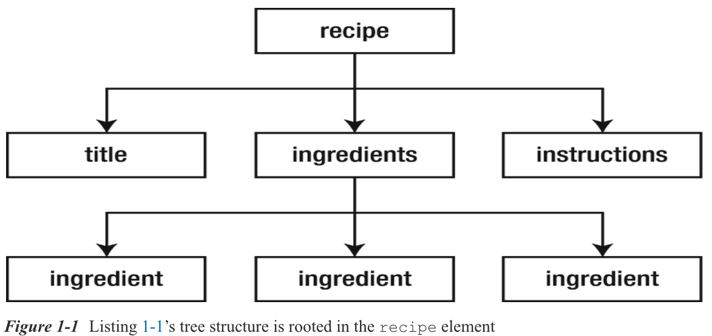

# Capítulo 1: Introducing XML

* What Is XML?
* Language Features Tour
   * XML Declaration
   * Elements and Attributes
   * Character References and CDATA Sections
   * Namespaces
   * Comments and Processing Instructions
* Well-Formed Documents
* Valid Documents
   * Document Type Definition
   * XML Schema
* Summary


Las aplicaciones suelen utilizar documentos XML para almacenar e intercambiar datos. XML define reglas para codificar documentos en un formato que es legible por humanos y legible por máquina. El Capítulo 1 presenta XML, recorre las características del lenguaje XML y analiza los documentos válidos y bien formados.

## ¿Qué es XML?

***XML*** (eXtensible Markup Language) es un *meta-language* (un lenguaje utilizado para describir otros lenguajes) para definir *vocabularios* (custom markup languages), que es la clave de la importancia y popularidad de XML. Los vocabularios basados en XML (como XHTML) le permiten describir documentos de manera significativa.

Los documentos de vocabulario XML son como documentos HTML (consulte http://en.wikipedia.org/wiki/HTML) en el sentido de que están basados en texto y constan de *markup* (descripciones codificadas de la estructura lógica de un documento) y *contenido* (el texto del documento no se interpreta como marcado). El marcado se evidencia mediante tags (etiquetas) (construcciones sintácticas delimitadas por corchetes angulares), y cada etiqueta tiene un nombre. Además, algunas etiquetas tienen *atributos* (pares de name/value).

> **NOTA** XML y HTML son descendientes del lenguaje de marcado estándar generalizado (SGML), que es el metalenguaje original para crear vocabularios; XML es esencialmente una forma restringida de SGML, mientras que HTML es una aplicación de SGML. La diferencia clave entre XML y HTML es que XML lo invita a crear sus propios vocabularios con sus propias etiquetas y reglas, mientras que HTML le brinda un vocabulario creado previamente con su propio conjunto fijo de etiquetas y reglas. XHTML y otros vocabularios basados en XML son aplicaciones XML. XHTML fue creado para ser una implementación más limpia de HTML.

Si no se ha encontrado previamente con XML, es posible que se sorprenda por su simplicidad y lo mucho que sus vocabularios se parecen a HTML. No es necesario ser un científico espacial para aprender a crear un documento XML. Para demostrárselo a usted mismo, consulte el Listado 1-1.

```xml
<recipe>
   <title>
      Grilled Cheese Sandwich
   </title>
   <ingredients>
      <ingredient qty="2">
         bread slice
      </ingredient>
      <ingredient>
         cheese slice
      </ingredient>
      <ingredient qty="2">
         margarine pat
      </ingredient>
   </ingredients>
   <instructions>
      Place frying pan on element and select medium heat.
      For each bread slice, smear one pat of margarine on
      one side of bread slice. Place cheese slice between
      bread slices with margarine-smeared sides away from
      the cheese. Place sandwich in frying pan with one
      margarine-smeared side in contact with pan. Fry for
      a couple of minutes and flip. Fry other side for a
      minute and serve.
   </instructions>
</recipe>
```
***Listado 1-1*** Receta basada en XML para un sándwich de queso a la parrilla

El Listado 1-1 presenta un documento XML que describe una receta para hacer un sándwich de queso a la parrilla. Este documento recuerda a un documento HTML en el sentido de que consta de etiquetas, atributos y contenido. Sin embargo, ahí es donde termina la similitud. En lugar de presentar etiquetas HTML como `<html>`, `<head>`, `` y `<p>`, este lenguaje de recetas informal presenta sus propias etiquetas `<recipe>`, `<ingredients>` y otras etiquetas.

> **NOTA** Aunque las etiquetas `<title>` y `</title>` del Listado 1-1 también se encuentran en HTML, difieren de sus equivalentes HTML. Los navegadores web suelen mostrar el contenido entre estas etiquetas en sus barras de título o encabezados de pestaña. Por el contrario, el contenido entre las etiquetas `<title>` y `</title>` del Listado 1-1 puede mostrarse como un encabezado de receta, hablado en voz alta o presentado de alguna otra manera, según la aplicación que analice este documento.

<hr>

## Tour de Características Lingüísticas

XML proporciona varias características de lenguaje para su uso en la definición de lenguajes de marcado personalizados: declaración XML, elementos y atributos, referencias de caracteres y secciones CDATA, namespaces (espacios de nombres) y comentarios e instrucciones de procesamiento. Aprenderá acerca de estas características del lenguaje en esta sección.

### DECLARACIÓN XML

Un documento XML generalmente comienza con la *declaración XML*, un marcado especial que le dice a un analizador XML que el documento es XML. La ausencia de la declaración XML en el Listado 1-1 revela que este marcado especial no es obligatorio. Cuando la declaración XML está presente, no puede aparecer nada antes.

La declaración XML se parece mínimamente a `<? Xml version = "1.0"?>` En la que el atributo de versión no opcional identifica la versión de la especificación XML a la que se ajusta el documento. La versión inicial de esta especificación (1.0) se introdujo en 1998 y está ampliamente implementada.

> **NOTA**: El Consorcio World Wide Web (W3C), que mantiene XML, lanzó la versión 1.1 en 2004. Esta versión admite principalmente el uso de caracteres de final de línea utilizados en plataformas EBCDIC (consulte http://en.wikipedia.org/wiki/EBCDIC) y el uso de scripts y caracteres que están ausentes en Unicode (consulte http://en.wikipedia.org/wiki/Unicode) 3.2. A diferencia de XML 1.0, XML 1.1 no está ampliamente implementado y solo debe usarse cuando se necesitan sus características únicas.

XML es compatible con Unicode, lo que significa que los documentos XML constan en su totalidad de caracteres tomados del juego de caracteres Unicode (Unicode character set). Los caracteres del documento se codifican en bytes para su almacenamiento o transmisión, y la codificación se especifica mediante el atributo opcional `encoding` de la declaración XML. Una codificación común es *UTF-8* (consulte http://en.wikipedia.org/wiki/UTF-8), que es una codificación de longitud variable del juego de caracteres Unicode. UTF-8 es un superconjunto estricto de ASCII (consulte http://en.wikipedia.org/wiki/ASCII), lo que significa que los archivos de texto ASCII puros también son documentos UTF-8.

> **NOTA** En ausencia de la declaración XML o cuando el atributo de codificación de la declaración XML no está presente, un analizador XML normalmente busca una secuencia de caracteres especial al comienzo de un documento para determinar la codificación del documento. Esta secuencia de caracteres se conoce como *marca de orden de bytes (BOM) (byte-order-mark (BOM))* y la crea un programa editor (como el Bloc de notas de Microsoft Windows) cuando guarda el documento de acuerdo con UTF-8 o alguna otra codificación. Por ejemplo, la secuencia hexadecimal `EF BB BF` significa UTF-8 como codificación. De manera similar, `FE FF` significa UTF-16 (ver http://en.wikipedia.org/wiki/UTF-16) big endian, `FF FE` significa UTF-16 little endian, `00 00 FE FF` significa UTF-32 (ver http: //en.wikipedia.org/wiki/UTF-32) big endian, y `FF FE 00 00` significa UTF-32 little endian. Se asume UTF-8 cuando no hay una lista de materiales.

Si nunca va a utilizar caracteres aparte del conjunto de caracteres ASCII, probablemente pueda olvidarse del atributo `encoding`. Sin embargo, cuando su idioma nativo no es el inglés o cuando lo llaman para crear documentos XML que incluyen caracteres que no son ASCII, debe especificar la codificación correctamente. Por ejemplo, cuando su documento contiene caracteres ASCII más caracteres de un idioma de Europa occidental que no es inglés (como ç, la cedilla que se usa en francés, portugués y otros idiomas), es posible que desee elegir `ISO-8859-1` como el atributo `encoding` valor: el documento probablemente tendrá un tamaño más pequeño cuando se codifique de esta manera que cuando se codifique con UTF-8. El Listado 1-2 le muestra la declaración XML resultante.

```xml
<?xml version="1.0" encoding="ISO-8859-1"?>
<movie>
   <name>Le Fabuleux Destin d'Amélie Poulain</name>
   <language>français</language>
</movie>
```
***Listado 1-2*** Un documento codificado que contiene caracteres no ASCII

El atributo final que puede aparecer en la declaración XML es `standalone`. Este atributo opcional, que solo es relevante con DTD (discutido más adelante), determina si hay declaraciones de marcado externas que afectan la información pasada de un *procesador XML* (un parser [analizador]) a la aplicación. Su valor predeterminado es `no`, lo que implica que existen o pueden existir tales declaraciones. Un valor de `yes` indica que no existen tales declaraciones. Para obtener más información, consulte “The standalone pseudo-attribute is only relevant if a DTD is used” (www.xmlplease.com/xml/standalone/).

### ELEMENTOS Y ATRIBUTOS

A continuación de la declaración XML hay una estructura *jerárquica* (árbol) de elementos, donde un *elemento* es una parte del documento delimitada por una start tag - etiqueta de inicio (como `<name>`) y una end tag - etiqueta de fin (como `</name>`), o es una *empty-element tag* - etiqueta de elemento vacío (una etiqueta independiente cuyo nombre termina con una barra inclinada [/], como `<break/>`). Las etiquetas de inicio y las etiquetas de finalización rodean el contenido y posiblemente otras marcas, mientras que las etiquetas de elementos vacíos no rodean nada. La Figura 1-1 muestra la estructura de árbol del documento XML del Listado 1-1.



Al igual que con la estructura de un documento HTML, la estructura de un documento XML está anclada en un *root element* - elemento raíz (el elemento superior). En HTML, el elemento raíz es `html` (el par de etiquetas `<html>` y `</html>`). A diferencia de HTML, puede elegir el elemento raíz de sus documentos XML. La Figura 1-1 muestra el elemento raíz que es `recipe`.

A diferencia de los otros elementos, que tienen elementos padre, `recipe` no tiene padre. Además, `recipe` y `ingredients` tienen elementos hijos: los elementos hijos de `recipe` son `title`, `ingredients` e `instructions`; y los hijos de `ingredients` son tres instancias de `ingredient`. El `title`, `instructions` y los elementos `ingredient` no tienen elementos hijos.

Los elementos pueden contener elementos hijos, contenido o *contenido mixto* (una combinación de elementos secundarios y contenido). El Listado 1-2 revela que el elemento `movie` contiene elementos hijos `name` y `language` y también revela que cada uno de estos elementos hijos contiene contenido (por ejemplo, `language` contiene `français`). El Listado 1-3 presenta otro ejemplo que demuestra contenido mixto junto con elementos hijos y contenido.

```xml
<?xml version="1.0"?>
<article title="The Rebirth of JavaFX" lang="en">
   <abstract>
      JavaFX 2 marks a significant milestone in the history
      of JavaFX. Now that Sun Microsystems has passed the
      torch to Oracle, JavaFX Script is gone and
      JavaFX-oriented Java APIS (such as
      <code>javafx.application.Application</code>) have
      emerged for interacting with this technology. This
      article introduces you to this refactored JavaFX,
      where you learn about JavaFX 2 architecture and key
      APIs.
   </abstract>
   <body>
   </body>
</article>
```
***Listado 1-3*** Un Elemento `Abstract` que Contiene Contenido Mixto

El elemento raíz de este documento es `article`, que contiene los elementos hijos `abstract` y `body`. El elemento `abstract` mezcla contenido con un elemento `code`, que contiene contenido. Por el contrario, el elemento `body` está vacío.

> **NOTA** Con los listados 1-1 y 1-2, el listado 1-3 también contiene *espacios en blanco* (caracteres invisibles como espacios, tabulaciones, retornos de carro y avances de línea). La especificación XML permite agregar espacios en blanco a un documento. Los espacios en blanco que aparecen en el contenido (como espacios entre palabras) se consideran parte del contenido. Por el contrario, el analizador normalmente ignora los espacios en blanco que aparecen entre una etiqueta final y la siguiente etiqueta de inicio. Este espacio en blanco no se considera parte del contenido.

La etiqueta de inicio de un elemento XML puede contener uno o más atributos. Por ejemplo, la etiqueta `<ingredient>` del Listado 1-1 tiene un atributo `qty` (cantidad) y la etiqueta `<article>` del Listado 1-3 tiene los atributos `title` y `lang`. Los atributos proporcionan detalles adicionales sobre los elementos. Por ejemplo, `qty` identifica la cantidad de un ingrediente que se puede agregar, `title` identifica el título de un artículo y `lang` identifica el idioma en el que está escrito el artículo (`en` para Inglés). Los atributos pueden ser opcionales. Por ejemplo, cuando no se especifica `qty`, se asume un valor predeterminado de `1`.

> **NOTA** Los elementos y atributos `names` pueden contener cualquier carácter alfanumérico del inglés o de otro idioma y también pueden incluir los caracteres de puntuación de subrayado (`_`), guión (`-`), punto (`.`) y dos puntos (`:`). Los dos puntos solo deben usarse con namespaces (discutidos más adelante en este capítulo) y **los `names` no pueden contener espacios en blanco**.

### CHARACTER REFERENCES AND CDATA SECTIONS - REFERENCIAS DE CARÁCTER Y SECCIONES CDATA

Ciertos caracteres no pueden aparecer literalmente en el contenido que aparece entre una etiqueta de inicio y una etiqueta de finalización o dentro de un valor de atributo. Por ejemplo, no puede colocar un carácter literal `<` entre una etiqueta de inicio y una etiqueta de finalización porque hacerlo confundiría a un analizador XML haciéndole pensar que ha encontrado otra etiqueta.

Una solución a este problema es reemplazar el carácter literal con una *character reference*, que es un código que representa el carácter. Las referencias de caracteres se clasifican como referencias de caracteres numéricos o referencias a entidades de caracteres:

Una solución a este problema es reemplazar el carácter literal con una *character reference*, que es un código que representa el carácter. Las referencias de caracteres se clasifican como referencias de caracteres numéricos o referencias a entidades de caracteres:

* Una *referencia de carácter numérico* se refiere a un carácter a través de su punto de código Unicode y se adhiere al formato `&#nnnn;` (no restringido a cuatro posiciones) o `&#xhhhh;` (no restringido a cuatro posiciones), donde `nnnn` proporciona una representación decimal del punto de código y `hhhh` proporciona una representación hexadecimal. Por ejemplo, `Σ` y `Σ` representan la letra mayúscula griega sigma. Aunque XML exige que la `x` en `&#xhhhh;` sea minúscula, es flexible porque el cero a la izquierda es opcional en cualquier formato y le permite especificar una letra mayúscula o minúscula para cada `h`. Como resultado, `Σ`, `Σ` y `Σ` también son representaciones válidas de la letra mayúscula griega sigma.

* Una *referencia de entidad de carácter* se refiere a un carácter a través del nombre de una *entidad* (datos con alias) que especifica el carácter deseado como su texto de reemplazo. Las referencias a entidades de caracteres están predefinidas por XML y tienen el formato `&name;`, en el que `name` es el nombre de la entidad. XML predefine cinco referencias a entidades de caracteres: `<`(`<`),`>` (`>`), `&` (`&`), `&apos;` (`'`) y `&quot;` (`"`).


Considere `<expression>6 < 4</expression>`. Puede reemplazar `<` con la referencia numérica `<`, dando `<expression>6 < 4</expression>`, o mejor aún con `<`, dando `<expression>6 < 4</expression>`. La segunda opción es más clara y fácil de recordar.

Suponga que desea incrustar un documento HTML o XML dentro de un elemento. Para que el documento incrustado sea aceptable para un analizador XML, necesitaría reemplazar cada carácter literal `<`(inicio de etiqueta) y `&` (inicio de entidad) con su `<` y `&` referencia de entidad de carácter predefinida, una tarea tediosa y posiblemente propensa a errores : Es posible que se olvide de reemplazar uno de estos caracteres. Para evitar el tedio y los posibles errores, XML proporciona una alternativa en forma de una sección CDATA (datos de caracteres).

Una *sección CDATA* es una sección de contenido y marcado HTML o XML literal rodeada por el prefijo `<![CDATA[` y el sufijo `]]>`. No es necesario que especifique referencias de entidades de caracteres predefinidas dentro de una sección CDATA, como se muestra en el Listado 1-4.

```xml
<?xml version="1.0"?>
<svg-examples>
   <example>
      The following Scalable Vector Graphics document
      describes a blue-filled and black-stroked
      rectangle.
      <![CDATA[<svg width="100%" height="100%"
         version="1.1"
         xmlns:="http://www.w3.org/2000/svg">
         <rect width="300" height="100"
            style="fill:rgb(0,0,255);stroke-width:1;
                  stroke:rgb(0,0,0)"/>
      </svg>]]>
   </example>
</svg-examples>
```
***Listado 1-4*** Incrustación de un documento XML en la sección CDATA de otro documento

El Listado 1-4 incluye un documento XML Scalable Vector Graphics (SVG) [consulte http://en.wikipedia.org/wiki/Scalable_Vector_Graphics] dentro del elemento de ejemplo de un documento de ejemplos SVG. El documento SVG se coloca en una sección CDATA, lo que evita la necesidad de reemplazar todos los caracteres `<` con referencias de entidades de caracteres `<` predefinidas.

### NAMESPACES

Es común crear documentos XML que combinan funciones de diferentes lenguajes XML. Los espacios de nombres se utilizan para evitar conflictos de nombres cuando aparecen elementos y otras características del lenguaje XML. Sin espacios de nombres, un analizador XML no podría distinguir entre elementos del mismo nombre u otras características del lenguaje que significan cosas diferentes, por ejemplo, dos elementos de título del mismo nombre de dos idiomas diferentes.

> **NOTA** Los espacios de nombres no forman parte de XML 1.0. Llegaron aproximadamente un año después de que se publicara esta especificación. Para garantizar la compatibilidad con versiones anteriores de XML 1.0, los espacios de nombres aprovechan los dos puntos, que son caracteres legales en los nombres XML. Los analizadores que no reconocen los espacios de nombres devuelven nombres que incluyen dos puntos.

Un *namespace* es un Uniform Resource Identifier (URI) contenedor basado que ayuda a diferenciar los vocabularios XML al proporcionar un contexto único para sus identificadores contenidos. El URI del espacio de nombres está asociado con un prefijo de espacio de nombres - *namespace prefix* (un alias para el URI) especificando, normalmente en el elemento raíz de un documento XML, el atributo `xmlns` por sí mismo (que significa el espacio de nombres predeterminado) o el atributo `xmlns`:*prefix* (que significa el espacio de nombres identificado como *prefix* prefijo) y asignar el URI a este atributo.

> **NOTA** El alcance del espacio de nombres (namespace’s scope) comienza en el elemento donde se declara y se aplica a todo el contenido del elemento, a menos que se anule por otra declaración de espacio de nombres con el mismo nombre de prefijo.

Cuando se especifica el *prefix* - prefijo, el prefijo y un carácter de dos puntos se anteponen al nombre de cada etiqueta de elemento que pertenece a ese espacio de nombres; consulte el Listado 1-5.

```xml
<?xml version="1.0"?>
<h:html xmlns:h="http://www.w3.org/1999/xhtml"
        xmlns:r="http://www.javajeff.ca/">
   <h:head>
      <h:title>
         Recipe
      </h:title>
   </h:head>
   <h:body>
   <r:recipe>
      <r:title>
         Grilled Cheese Sandwich
      </r:title>
      <r:ingredients>
         <h:ul>
         <h:li>
         <r:ingredient qty="2">
            bread slice
         </r:ingredient>
         </h:li>
         <h:li>
         <r:ingredient>
            cheese slice
         </r:ingredient>
         </h:li>
         <h:li>
         <r:ingredient qty="2">
            margarine pat
         </r:ingredient>
         </h:li>
         </h:ul>
      </r:ingredients>
      <h:p>
      <r:instructions>
         Place frying pan on element and select medium
         heat. For each bread slice, smear one pat of
         margarine on one side of bread slice. Place
         cheese slice between bread slices with
         margarine-smeared sides away from the cheese.
         Place sandwich in frying pan with one
         margarine-smeared side in contact with pan.
         Fry for a couple of minutes and flip. Fry
         other side for a minute and serve.
      </r:instructions>
      </h:p>
   </r:recipe>
   </h:body>
</h:html>
```


```xml
```


