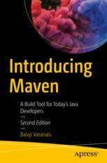

# 930 Introducing Maven: A Build Tool for Today's Java Developers

by Balaji Varanasi http://blog.inflinx.com/

Number of Pages: 140

Publisher: Apress

Release Date: October 2019

ISBN: 9781484254103

Topic: Maven

### Descripción del libro

Obtenga una comprensión de la gestión de dependencias de Maven y utilícela para organizar proyectos de Maven básicos y de varios módulos. Este breve libro es su tutorial de inicio rápido para aprender a usar Maven. Incluye colecciones inconsistentemente inmutables, mejor construcción de matrices y más de la última versión 3.6 de Maven. Esta segunda edición cubre lo más nuevo de la herramienta de compilación más popular para el desarrollo y la programación de Java.

Aprenderá todo sobre Maven y cómo configurarlo. En primer lugar, cubrirá el ciclo de vida de Maven y cómo aprovecharlo de manera efectiva. Además, verá los conceptos básicos de los complementos del sitio, la generación de Javadocs, informes de cobertura de prueba / FindBugs y notas de versión / lanzamiento. Además, aprovecharás los arquetipos de Maven para iniciar nuevos proyectos fácilmente. Finalmente, aprenderá cómo integrar el administrador de repositorio de Nexus con las fases de lanzamiento de Maven.

#### Lo que vas a aprender

* Configura tu proyecto básico en Maven
* Crea proyectos más avanzados
* Aplicar el ciclo de vida de Maven a su construcción
* Trabajar con arquetipos de Maven y administrar lanzamientos de Maven
* Integre con Jenkins, Eclipse y otros IDE
* Realizar depuración y cifrado de contraseñas
 

#### Para quien es este libro

Aquellos nuevos en Maven o aquellos que estén familiarizados con Maven, pero tal vez no con la última versión de Maven 3.6.

## Table of Contents

* Cover

* [Frontmatter](930_Introducing_Maven/00_Frontmatter.md)

1. [Getting Started with Maven](930_Introducing_Maven/01-Getting-Started-with-Maven.md)

2. [Setting Up Maven](930_Introducing_Maven/02-Setting-Up-Maven.md)

3. Maven Dependency Management

4. Maven Project Basics

5. Maven Lifecycle

6. Maven Archetypes

7. Documentation and Reporting

8. Maven Release

9. Continuous Integration

Backmatter
