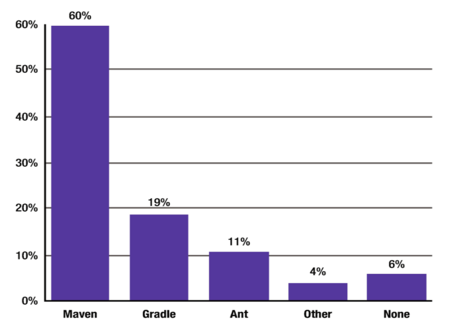

# 1. Getting Started with Maven

* Standardized Directory Structure
* Declarative Dependency Management
* Plug-ins
* Uniform Build Abstraction
* Tools Support
* Archetypes
* Open Source
* Maven Alternatives
   * Ant + Ivy
   * Gradle
* Maven Components
   * Maven SCM
   * Maven Wagon
   * Maven Doxia
* Summary

Al igual que otros artesanos, los desarrolladores de software confían en sus herramientas para crear aplicaciones. Los entornos de desarrollo integrados (IDE) de los desarrolladores, las herramientas de seguimiento de errores, las herramientas de compilación, los frameworks, los contenedores y las herramientas de depuración, como los analizadores de memoria, desempeñan un papel vital en el desarrollo y mantenimiento diarios de software de calidad. Este libro discutirá y explorará las características de Maven, que sabemos que se convertirá en una herramienta importante en su arsenal de desarrollo de software.
Apache Maven es un marco de gestión de proyectos de código abierto(open source) y basado en estándares que simplifica la creación, las pruebas, la generación de informes y el empaquetado de proyectos. Las raíces iniciales de Maven estaban en el proyecto Apache Jakarta Alexandria que tuvo lugar a principios de 2000. Posteriormente se utilizó en el proyecto Apache Turbine. Como muchos otros proyectos de Apache en ese momento, el proyecto Turbine tenía varios subproyectos, cada uno con su propio sistema de compilación basado en Ant. En aquel entonces, existía un fuerte deseo de desarrollar una forma estándar de construir proyectos y compartir fácilmente los artefactos generados entre proyectos. Este deseo dio a luz a Maven. La versión 1.0 de Maven se lanzó en 2004, seguida de la versión 2.0 en 2005 y la versión 3.0 en 2010. En el momento de escribir este libro, 3.6.1 es la versión actual de Maven.

Maven se ha convertido en uno de los programas de software de código abierto más utilizados en empresas de todo el mundo. Veamos algunas de las razones por las que Maven es tan popular.

## Estructura de directorio estandarizada

A menudo, cuando comenzamos a trabajar en un nuevo proyecto, se dedica una cantidad considerable de tiempo a decidir el diseño del proyecto y la estructura de carpetas necesarias para almacenar el código y los archivos de configuración. Estas decisiones pueden variar enormemente entre proyectos y equipos, lo que puede dificultar que los nuevos desarrolladores comprendan y adopten los proyectos de otros equipos. También puede dificultar que los desarrolladores existentes salten de un proyecto a otro y encuentren lo que buscan.

Maven aborda los problemas anteriores estandarizando la estructura de carpetas y la organización de un proyecto. Maven proporciona recomendaciones sobre dónde deben residir las diferentes partes de un proyecto, como el código fuente, el código de prueba y los archivos de configuración. Por ejemplo, Maven sugiere que todo el código fuente de Java se coloque en la carpeta 
`src\main\java`. Esto facilita la comprensión y la navegación por cualquier proyecto de Maven.

Además, estas convenciones facilitan el cambio y el uso de un nuevo IDE. Históricamente, los IDE variaban con la estructura del proyecto y los nombres de las carpetas. Un proyecto web dinámico en Eclipse podría usar la carpeta WebContent para almacenar activos web, mientras que IntelliJ IDEA podría usar la carpeta web para el mismo propósito. Con Maven, sus proyectos siguen una estructura coherente y se vuelven independientes del IDE.

## Gestión declarativa de dependencias

La mayoría de los proyectos de Java se basan en otros proyectos y frameworks de código abierto para funcionar correctamente. Puede resultar engorroso descargar estas dependencias manualmente y realizar un seguimiento de sus versiones a medida que las usa en su proyecto.

Maven proporciona una forma conveniente de declarar estas dependencias del proyecto en un archivo `pom.xml` externo separado. Luego descarga automáticamente esas dependencias y le permite usarlas en su proyecto. Esto simplifica enormemente la gestión de la dependencia del proyecto. Es importante tener en cuenta que en el archivo `pom.xml`, especifica el qué y no el cómo. El archivo `pom.xml` también puede servir como una herramienta de documentación, transmitiendo las dependencias de su proyecto y sus versiones.

## Plug-ins

Maven sigue una arquitectura basada en Plug-ins, lo que facilita el aumento y la personalización de su funcionalidad. Estos complementos encapsulan la lógica de tareas y compilaciones reutilizables. Hoy en día, hay cientos de Plug-ins de Maven disponibles que se pueden usar para realizar tareas que van desde la compilación del código hasta el empaquetado y la generación de documentación del proyecto.

Maven también facilita la creación de sus propios Plug-ins, lo que le permite integrar tareas y flujos de trabajo que son específicos de su organización.

## Abstracción de construcción uniforme

Maven proporciona una interfaz uniforme para proyectos de construcción. Puede construir un proyecto de Maven usando solo unos pocos comandos. Una vez que se familiarice con el proceso de compilación de Maven, podrá descubrir fácilmente cómo compilar otros proyectos de Maven. Esto libera a los desarrolladores de tener que aprender a construir idiosincrasias para que puedan concentrarse más en el desarrollo.

## Tools Support

Maven proporciona una potente interfaz de línea de comandos para realizar diferentes operaciones. Todos los IDE más importantes de la actualidad brindan un excelente soporte de herramientas para Maven. Además, Maven está completamente integrado con los productos de integración continua actuales, como Jenkins y Bamboo.

## Archetypes

Como ya mencionamos, Maven proporciona un diseño de directorio estándar para sus proyectos. Cuando llega el momento de crear un nuevo proyecto de Maven, debe crear cada directorio manualmente, y esto puede volverse tedioso fácilmente. Aquí es donde los arquetipos de Maven vienen a rescatar. Los arquetipos de Maven son plantillas de proyectos predefinidas que se pueden utilizar para generar nuevos proyectos. Los proyectos creados con arquetipos contendrán todas las carpetas y archivos necesarios para comenzar.

Los arquetipos también son una herramienta valiosa para agrupar las mejores prácticas y los activos comunes que necesitarán en cada uno de sus proyectos. Considere un equipo que trabaja en gran medida en aplicaciones web basadas en el marco de Spring. Todos los proyectos web basados en Spring comparten dependencias comunes y requieren un conjunto de archivos de configuración. También es muy posible que todos estos proyectos web tengan archivos de configuración `Log4j/Logback`, `CSS/Images` y diseños de página de Thymeleaf similares. Maven permite que este equipo agrupe estos activos comunes en un arquetipo. Cuando se creen nuevos proyectos utilizando este arquetipo, automáticamente se incluirán los activos comunes. No es necesario copiar y pegar código o arrastrar y soltar archivos.

## Open Source

Maven es *open source* y no cuesta nada descargar y usar. Viene con una rica documentación en línea y el apoyo de una comunidad activa.

> **Convención sobre configuración**
>
>La ***convención sobre la configuración (Convention over configuration CoC)*** o la codificación por convención es uno de los inquilinos clave de Maven. Popularizado por la comunidad de Ruby on Rails, CoC enfatiza los valores predeterminados sensibles, reduciendo así el número de decisiones a tomar. Ahorra tiempo y también da como resultado un producto final más simple, ya que la cantidad de configuración requerida se reduce drásticamente.
>
> Como parte de su adhesión al CoC, Maven proporciona varios valores predeterminados sensibles para sus proyectos. Presenta una estructura de directorio estándar y proporciona valores predeterminados para los artefactos generados. Imagínese mirando un artefacto Maven con el nombre `log4j-core-2.11.2.jar`. De un vistazo, puede ver fácilmente que está viendo un archivo JAR `log4j-core`, versión `2.11.2`.
> 
> Un inconveniente del CoC de Maven es la rigidez que experimentan los usuarios finales al usarlo. Para solucionar esto, puede personalizar la mayoría de los valores predeterminados de Maven. Por ejemplo, es posible cambiar la ubicación del código fuente de Java en su proyecto. Sin embargo, como regla general, estos cambios en los valores predeterminados deben minimizarse.

## Alternativas de Maven
Aunque el énfasis de este libro está en Maven, veamos un par de sus alternativas: **Ant + Ivy** y **Gradle**.

### ANT + IVY

Apache Ant (http://ant.apache.org) es una popular herramienta de código abierto para crear scripts. Ant está basado en Java y usa Extensible Markup Language (XML) para su configuración. El archivo de configuración predeterminado para Ant es el archivo `build.xml`.

El uso de Ant normalmente implica la definición de tareas y objetivos. Como sugiere el nombre, una *tarea Ant* es una unidad de trabajo que debe completarse. Las tareas típicas implican la creación de un directorio, la ejecución de una prueba, la compilación del código fuente, la creación de un archivo de aplicación web (WAR), etc. Es posible que un objetivo dependiente de otros objetivos. Esta dependencia nos permite secuenciar la ejecución del objetivo. El listado 1-1 muestra un archivo `build.xml` simple con un objetivo llamado *compilar*. El target(destino) `compile` tiene dos tareas `echo` y una tarea `javac`.

```xml
<project name="Sample Build File" default="compile" basedir=".">
   <target name="compile" description="Compile Source Code">
      <echo message="Starting Code Compilation"/>
      <javac srcdir="src" destdir="dist"/>
      <echo message="Completed Code Compilation"/>
   </target>
</project>
```

Listado 1-1 Archivo de muestra Ant `build.xml`

Ant no impone convenciones ni restricciones a su proyecto, y se sabe que es extremadamente flexible. Esta flexibilidad a veces ha resultado en archivos `build.xml` complejos, difíciles de entender y difíciles de mantener.

Apache Ivy (http://ant.apache.org/ivy/) proporciona administración automatizada de dependencias, lo que hace que Ant sea más agradable de usar. Con Ivy, declara las dependencias en un archivo XML llamado `ivy.xml`, como se muestra en el Listado 1-2. La integración de Ivy con Ant implica declarar nuevos objetivos en el archivo `build.xml` para recuperar y resolver dependencias.

```xml
<ivy-module version="2.0">
  <info organisation="com.apress" module="gswm-ivy" />
  <dependencies>
      <dependency org="org.apache.logging.log4j" name="log4j-api" rev="2.11.2" />
  </dependencies>
</ivy-module>
```

Listado 1-2 Listado de Ivy de ejemplo

### GRADLE

Gradle (http://gradle.org/) es una herramienta de automatización de proyectos de compilación de código abierto que se puede utilizar para proyectos Java y no Java. A diferencia de Ant y Maven, que usan XML para la configuración, Gradle usa un lenguaje específico de dominio (domain-specific language DSL) basado en Groovy.

Gradle proporciona la flexibilidad de Ant y utiliza la misma noción de tareas. El Listado 1-3 muestra un archivo `build.gradle` predeterminado.

```dsl
plugins {
     id 'java'
}
version = '1.0.0'
repositories {
   mavenCentral()
}
dependencies {
    testCompileOnly group: 'junit', name: 'junit', version: '4.10'
}
```

Listado 1-3 Archivo `build.gradle` predeterminado

El DSL de Gradle y su adherencia a CoC dan como resultado archivos de compilación compactos. La primera línea del Listado 1-3 incluye un plug-in de Java para el uso de `build`. Los complementos en Gradle proporcionan tareas y dependencias preconfiguradas para el proyecto. El complemento de Java, por ejemplo, proporciona tareas para crear archivos de origen, ejecutar pruebas unitarias e instalar artefactos. La sección de dependencias en el archivo `default.build` le indica a Gradle que use la dependencia `JUnit` durante la compilación de los archivos fuente de prueba. La flexibilidad y el rendimiento de Gradle han contribuido a su creciente popularidad. Sin embargo, la curva de aprendizaje para Gradle y Groovy DSL podría ser empinada. La compatibilidad con IDE y complementos para Gradle también es menos madura en comparación con Maven.

A pesar de la creciente competencia de otras herramientas, Maven continúa dominando el espacio de herramientas de construcción. Esto es evidente en la Figura 1-1 que muestra los resultados de una encuesta de 2018 realizada por Synk.io (https://snyk.io/blog/jvm-ecosystem-report-2018-tools/) sobre las herramientas de compilación utilizadas por los desarrolladores de Java.



Figura 1-1 Resultados de la encuesta del uso de la herramienta de compilación

> El proyecto Polyglot for Maven (https://github.com/takari/polyglot-maven) le permite crear archivos POM de Maven en dialectos distintos de XML. Los lenguajes admitidos incluyen Groovy, Ruby, Scala, YAML y Java.

## Componentes de Maven

Maven se basa en varios componentes para realizar su trabajo. Aunque es posible que no interactúe con estos componentes directamente, una descripción general de estos componentes ayuda a comprender el funcionamiento interno de Maven y le prepara mejor para solucionar los errores de Maven.

### MAVEN SCM

Maven interactúa con varios source control/code management (SCM) para realizar operaciones como verificar el código o crear una rama(branch) o una etiqueta(tag). El proyecto Maven SCM (http://maven.apache.org/scm/) proporciona una API común para realizar dichas operaciones. El complemento de lanzamiento de Maven analizado en el Capítulo 8 se basa en gran medida en los componentes de Maven SCM. Maven SCM actualmente es compatible con varios sistemas de gestión de código populares, como Git, Subversion y Perforce.

### VAGÓN MAVEN

Como se mencionó anteriormente, Maven descarga automáticamente las dependencias del proyecto, como archivos JAR, desde diferentes ubicaciones, como FTP, sistemas de archivos y sitios web. El proyecto Maven Wagon (https://maven.apache.org/wagon/) proporciona una abstracción de transporte que permite a Maven interactuar con diferentes protocolos de transporte fácilmente y recuperar dependencias. Maven Wagon es compatible con algunos de los protocolos populares, como: 

a) ***File***: permite la recuperación de dependencias mediante el protocolo del sistema de archivos.
 
B) ***HTTP***: permite la recuperación de dependencias mediante protocolos HTTP/HTTPS. Se proporcionan dos variaciones de implementación: una que usa Apache HttpClient y la otra que usa la biblioteca estándar de Java.
 
C) ***FTP***: permite la recuperación de dependencias mediante el protocolo de transferencia de archivos.
 
### MAVEN DOXIA

Maven Doxia (https://maven.apache.org/doxia/) es un framework de generación de contenido que se puede utilizar para generar contenido estático/dinámico, como archivos PDF y páginas web. Doxia admite varios lenguajes de marcado populares como Markdown, Apt, XHTML y Confluence. Maven depende en gran medida de Doxia para generar documentación e informes del proyecto (más sobre esto en el Capítulo 7).

## Resumen

Apache Maven simplifica enormemente el proceso de compilación y automatiza las tareas de gestión de proyectos. Este capítulo proporcionó una suave introducción a Maven y describió las principales razones para adoptarlo. También miramos a los pares cercanos de Maven: Ant + Ivy y Gradle.

En el siguiente capítulo, aprenderá sobre la configuración necesaria para comenzar a trabajar con Maven.
