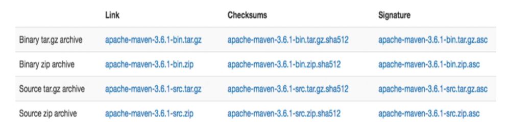
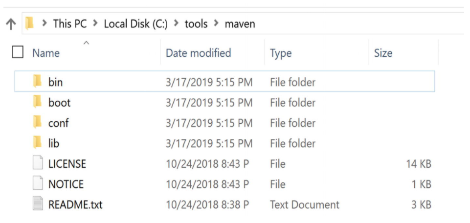
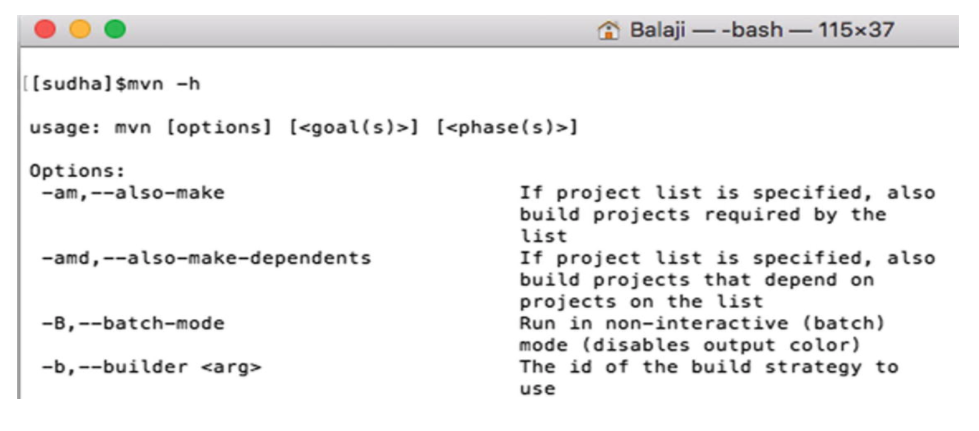

# Chapter 2: Setting Up Maven

* Installing on Windows
* Installing on Mac
* Testing Installation
* Getting Help
* Additional Settings
* Setting Up a Proxy
   * Securing Passwords
* IDE Support
* Summary

La instalación de Maven es un proceso sencillo y directo. Este capítulo explica cómo instalar y configurar Maven usando los sistemas operativos Windows 10 y Mac. Puede seguir un procedimiento similar con otros sistemas operativos.

> **NOTA**
> 
> Maven es una aplicación basada en Java y requiere Java Development Kit (JDK) para funcionar correctamente. La versión 3.6 de Maven requiere JDK 1.7 o superior. Antes de continuar con la instalación de Maven, asegúrese de tener Java instalado. De lo contrario, instale JDK (no solo Java Runtime Environment [JRE]) desde www.oracle.com/technetwork/java/javase/downloads/index.html. Asegúrese de tener la variable de entorno JAVA_HOME configurada y apuntando a la instalación de JDK. En este libro, usaremos JDK 8.
 
Comenzará el proceso de instalación descargando la última versión de Maven del sitio web de Apache Maven (http://maven.apache.org/download.html). En el momento de escribir este artículo, la última versión es 3.6.1. Descargue el archivo `.zip` binario de Maven 3.6.1 como se muestra en la Figura 2-1.



***Figura 2-1*** Descarga del archivo Maven

Una vez que se complete la descarga, descomprima la distribución en un directorio local en su computadora. Creará una carpeta llamada `apache-maven-3.6.1-bin` y el contenido de la carpeta se muestra en la Figura 2-2.



***Figura 2-2*** Contenido del directorio de instalación de Maven

La carpeta `bin` contiene ejecutables Maven específicos de la plataforma: archivo `mvn.cmd` para Windows y `mvn.sh` para plataformas Mac y Unix/Linux que puede usar para iniciar Maven. Las versiones de depuración de estos ejecutables, `mvnDebug.cmd` y `mvnDebug.sh`, incluyen argumentos de depuración que le permiten adjuntar un IDE a un proceso Maven en ejecución para la depuración remota.

Esa carpeta de arranque contiene el archivo “plexus-classworlds-2.5.2.jar”. Maven usa el marco Plexus Classworlds (https://codehaus-plexus.github.io/plexus-classworlds/) para construir su gráfico de cargador de clases.

La carpeta `conf` contiene archivos de configuración que puede utilizar para modificar los comportamientos predeterminados de Maven. Un archivo importante en esta carpeta es el archivo `settings.xml` que cubriremos más adelante en este capítulo. Otro archivo clave es el archivo `simplelogger.properties` que le permite controlar el registro de Maven. Por ejemplo, el nivel de registro se puede cambiar para depurar estableciendo la propiedad `defaultLogLevel` en depuración. De manera similar, puede cambiar la propiedad `logFile` para escribir la salida del registro de `"System.out"` en un archivo.

Finalmente, la carpeta `lib` contiene las bibliotecas que son esenciales para que Maven y sus complementos se ejecuten correctamente.

## Instalación en Windows

Mueva el contenido de apache-maven-3.6.0-bin a un nuevo directorio `c:\tools\maven`. El siguiente paso es agregar el ejecutable de Maven a la variable de entorno PATH para que pueda ejecutar los comandos de Maven desde la línea de comandos. En el cuadro de búsqueda de Windows, busque "Variable de entorno" y seleccione "Editar las variables de entorno del sistema". En la ventana resultante, haga clic en el botón Variables de entorno, seleccione la variable PATH y haga clic en Editar. Haga clic en Nuevo e introduzca el valor `“C:/tools/maven/bin”` y haga clic en Aceptar.

## Instalación en Mac

Mueva el contenido de la carpeta `apache-maven-3.6.0-bin` a `$HOME/tools/maven` donde `$HOME` es su directorio de inicio en Mac. Edite el archivo `.bash_profile` ejecutando el comando `nano ~/.bash_profile`. Agregue el ejecutable de Maven a la variable PATH agregando la siguiente línea a `.bash_profile`:

```sh
export PATH=$HOME/tools/maven/bin:$PATH
```

Esto completa la instalación de Maven. Si tiene alguna ventana/terminal de línea de comandos abierta, ciérrela y vuelva a abrir una nueva ventana de línea de comando. Cuando se agregan o modifican variables de entorno, los nuevos valores no se propagan para abrir ventanas de línea de comandos automáticamente.


> Variable de entorno Maven_Opts
> 
> Al usar Maven, especialmente en un proyecto complejo, es probable que se encuentre con errores de OutOfMemory. Esto puede suceder, por ejemplo, cuando está ejecutando una gran cantidad de pruebas JUnit o cuando está generando una gran cantidad de informes. Para solucionar este error, aumente el tamaño del montón de la máquina virtual Java (JVM) utilizada por Maven. Esto se hace globalmente creando una nueva variable de entorno llamada `MAVEN_OPTS`. Para empezar, recomendamos utilizar el valor `-Xmx512m`.

## Probando la Instalación

Ahora que Maven está instalado, es hora de probar y verificar la instalación. Abra un símbolo del sistema y ejecute el siguiente comando:

```sh
mvn –v
```

En una máquina con Windows, este comando debería generar información similar a la siguiente:

```sh
C:\> mvn –v
Apache Maven 3.6.1 (d66c9c0b3152b2e69ee9bac180bb8fcc8e6af555; 2019-04-04T13:00:29-06:00)
Maven home: C:\tools\maven\bin\..
Java version: 1.8.0_144, vendor: Oracle Corporation, runtime: C:\Java\jdk1.8.0_144\jre
Default locale: en_US, platform encoding: Cp1252
OS name: "windows 10", version: "10.0", arch: "amd64", family: "windows"
```

La opción de línea de comandos `–v` indica la ruta donde está instalado Maven y qué versión de Java está usando. También obtendría los mismos resultados ejecutando el comando expandido `mvn --version`.

## Obteniendo ayuda

Puede obtener una lista de las opciones de la línea de comandos de Maven utilizando las opciones `-h` o `--help`. La ejecución del siguiente comando producirá un resultado similar al que se muestra en la Figura 2-3.

```sh
mvn -h
```




