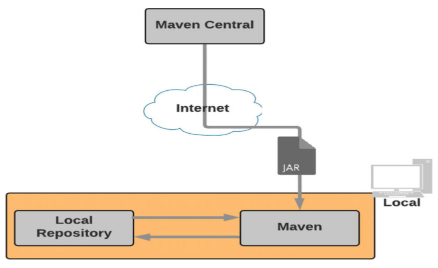
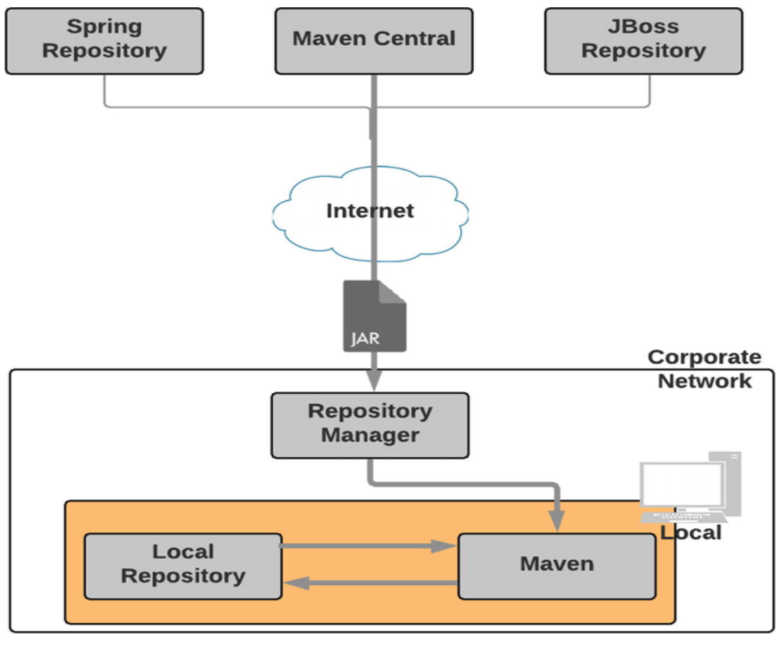
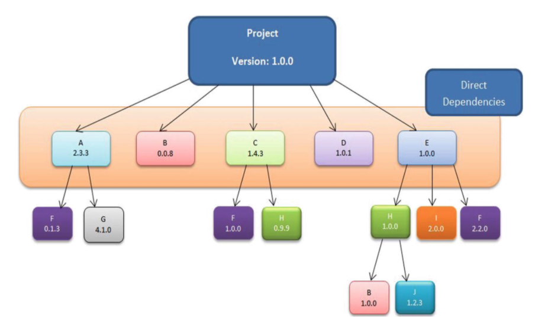
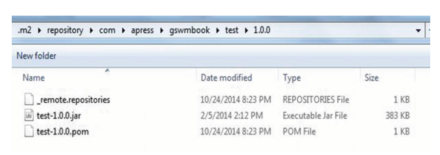

# Chapter 3: Maven Dependency Management

* Using New Repositories
* Dependency Identification
* Transitive Dependencies
* Dependency Scope
* Manual Dependency Installation
* Summary

Los proyectos de nivel empresarial generalmente dependen de una variedad de libraries de código abierto. Considere el escenario en el que desea utilizar `Log4J` para el logging(registro) de su aplicación. Para lograr esto, debe ir a la página de descarga de `Log4J`, descargar el archivo JAR y colocarlo en la carpeta `lib` de su proyecto o agregarlo a la ruta de clases del proyecto. Hay un par de problemas con este enfoque:

1. El archivo `JAR` que descargó puede depender de algunas otras bibliotecas. Ahora tendría que buscar todas esas dependencias (y sus dependencias) y agregarlas a su proyecto.
 
2. Cuando llegue el momento de actualizar el archivo `JAR`, debe comenzar el proceso de nuevo.
 
3. Debe agregar archivos `JAR` al control de fuente junto con su código fuente para que sus proyectos se puedan construir en una computadora que no sea la suya. Esto aumenta el tamaño del proyecto, el pago y el tiempo de construcción.
 
4. Compartir archivos `JAR` entre equipos dentro de su organización se vuelve difícil.
 
Para abordar estos problemas, Maven proporciona administración de dependencias declarativas. Con este enfoque, declaras las dependencias de tu proyecto en un archivo externo llamado `pom.xml`. Maven descargará automáticamente esas dependencias y las entregará a su proyecto con el propósito de construir, probar o empaquetar.

La Figura 3-1 muestra una vista de alto nivel de la gestión de dependencias de Maven. Cuando ejecuta su proyecto Maven por primera vez, Maven se conecta a la red y descarga artefactos y metadatos relacionados desde repositorios remotos. El repositorio remoto predeterminado se llama *Maven Central* y se encuentra en `repo.maven.apache.org` y `uk.maven.org`. Maven coloca una copia de estos artefactos descargados en su repositorio local. En ejecuciones posteriores, Maven buscará un artefacto en su repositorio local; y al no encontrar el artefacto, Maven intentará descargarlo desde un repositorio remoto.



***Figura 3-1*** Gestión de dependencias de Maven

Aunque la arquitectura que se muestra en la Figura 3-1 funciona en la mayoría de los casos, plantea algunos problemas en un entorno empresarial. El primer problema es que no es posible compartir artefactos relacionados con la empresa entre equipos. Por motivos de seguridad y propiedad intelectual, no querrá publicar los artefactos de su empresa en Maven Central. Otro problema se refiere a cuestiones legales y de licencias. Es posible que su empresa desee que los equipos solo utilicen software de código abierto aprobado oficialmente, y esta arquitectura no encajaría en ese modelo. El último problema tiene que ver con el ancho de banda y las velocidades de descarga. En momentos de gran carga en Maven Central, las velocidades de descarga de los artefactos de Maven se reducen, y esto podría tener un impacto negativo en sus compilaciones. Por lo tanto, la mayoría de las empresas emplean la arquitectura que se muestra en la Figura 3-2.



***Figura 3-2*** Arquitectura del repositorio Enterprise Maven

El administrador del repositorio interno actúa como un proxy para los repositorios remotos. Esto le permite almacenar en caché los artefactos de repositorios remotos, lo que resulta en descargas de artefactos más rápidas y mejoras en el rendimiento de la construcción. Debido a que tiene control total sobre el repositorio interno, puede regular los tipos de artefactos permitidos en su empresa. Además, también puede enviar los artefactos de su organización al administrador del repositorio, lo que permite la colaboración. Hay varios administradores de repositorios de código abierto, como se muestra en la Tabla 3-1.

Tabla 3-1 Administradores de repositorios de código abierto

Repository Manager      | URL
------------------------|-----
Nexus Repository OSS    | www.sonatype.com/nexus-repository-oss
Apache Archiva          | http://archiva.apache.org/
Artifactory Open Source | https://jfrog.com/open-source/#artifactory


## Usar Nuevos Repositorios

Para utilizar un nuevo repositorio, debe modificar su archivo `settings.xml`. El Listado 3-1 muestra los repositorios Spring y JBoss agregados al archivo `settings.xml`. De esta misma forma, puede agregar el administrador de repositorio de su empresa.

> **Nota**
> 
>  Se puede proporcionar información sobre los repositorios en el archivo `settings.xml` o `pom.xml`. Hay pros y contras de cada enfoque. Poner la información del repositorio en el archivo `pom.xml` puede hacer que tus compilaciones sean portátiles. Permite a los desarrolladores descargar proyectos y simplemente construirlos sin más modificaciones en su archivo `settings.xml` local. El problema con este enfoque es que cuando se liberan artefactos, los archivos `pom.xml` correspondientes tendrán la información del repositorio codificada en ellos. Si alguna vez cambiaran las URL del repositorio, los consumidores de estos artefactos se encontrarán con errores debido a rutas de repositorio rotas. Poner la información del repositorio en el archivo `settings.xml` soluciona este problema y, debido a la flexibilidad que proporciona, el enfoque `settings.xml` generalmente se recomienda en un entorno empresarial.

```xml
<?xml version="1.0" encoding="UTF-8" ?>
<settings xmlns="http://maven.apache.org/SETTINGS/1.0.0" xmlns:xsi="http://www.w3.org/2001/XMLSchema-instance" xsi:schemaLocation="http://maven.apache.org/SETTINGS/1.0.0 http://maven.apache.org/xsd/settings-1.0.0.xsd">
  .......
      <profiles>
          <profile>
            <id>your_company</id>
            <repositories>
                   <repository>
                     <id>spring_repo</id>
                     <url>http://repo.spring.io/release/</url>
                   </repository>
                   <repository>
                     <id>jboss_repo</id>
                     <url>https://repository.jboss.org/</url>
                   </repository>
            </repositories>
          </profile>
      </profiles>
      <activeProfiles>
      <activeProfile>your_company</activeProfile>
      </activeProfiles>
  .......
</settings>
```

***Listado 3-1*** Agregar repositorios en `settings.xml`

## Identificación de Dependencia

Las dependencias de Maven suelen ser archivos como JAR, WAR, archivo empresarial (EAR) y ZIP. Cada dependencia de Maven se identifica de forma única mediante las siguientes coordenadas de grupo, artefacto y versión (GAV):

* `groupId`: Identificador de la organización o grupo responsable de este proyecto. Los ejemplos incluyen `org.hibernate`, `log4j`, `org.springframework` y `com.companyname`.

* `artifactId`: Identificador del artefacto generado por el proyecto. Debe ser único entre los proyectos que utilizan el mismo `groupId`. Los ejemplos incluyen `hibernate-tools`, `log4j`, `spring-core`, etc.

* `version`: indica el número de versión del proyecto. Los ejemplos incluyen `1.0.0`, `2.3.1-SNAPSHOT` y `5.4.2.Final`.

* `type`: indica el empaquetado del artefacto generado. Los ejemplos incluyen JAR, WAR y EAR.

Los artefactos que aún están en desarrollo están etiquetados con SNAPSHOT en sus versiones. Una versión de ejemplo es 1.0-SNAPSHOT. Esto le dice a Maven que busque una versión actualizada del artefacto en repositorios remotos con una frecuencia diaria.

Las dependencias se declaran en el archivo `pom.xml` utilizando la etiqueta de dependencias como se muestra a continuación:

```xml
<dependencies>
      <dependency>
             <groupId>org.hibernate</groupId>
             <artifactId>hibernate-tools</artifactId>
             <version>5.4.2.Final</version>
      </dependency>
</dependencies>
```

### Dependencias Transitivas

Las dependencias declaradas en el archivo `pom.xml` de su proyecto a menudo tienen sus propias dependencias. Estas dependencias se denominan *dependencias transitivas*. Tome el ejemplo de Hibernate Core. Para que funcione correctamente, requiere JBoss Logging, dom4j, javaassist, etc. El núcleo de Hibernate declarado en su archivo `pom.xml` se considera una dependencia directa, y las dependencias como `dom4j` y `javaassist` se consideran dependencias transitivas de su proyecto. Un beneficio clave de Maven es que trata automáticamente las dependencias transitivas y las incluye en su proyecto.

La figura 3-3 proporciona un ejemplo de dependencias transitivas. Observe que las dependencias transitivas pueden tener sus propias dependencias. Como puede imaginar, esto puede volverse complejo rápidamente, especialmente cuando varias dependencias directas extraen diferentes versiones del mismo archivo JAR.

Maven utiliza una técnica conocida como mediación de dependencia para resolver conflictos de versiones. En pocas palabras, la mediación de dependencias permite a Maven extraer la dependencia más cercana al proyecto en el árbol de dependencias. En la Figura 3-3, hay dos versiones de la dependencia B: 0.0.8 y 1.0.0. En este escenario, la versión 0.0.8 de la dependencia B se incluye en el proyecto, porque es una dependencia directa y más cercana al árbol. Ahora observe las tres versiones de la dependencia F: 0.1.3, 1.0.0 y 2.2.0. Las tres dependencias tienen la misma profundidad. En este escenario, Maven usará la primera dependencia encontrada, que sería 0.1.3, y no la última versión 2.2.0. Si desea que Maven use la última versión 2.2.0 del artefacto F, debe agregar explícitamente esa dependencia de versión al archivo `pom.xml`.



***Figura 3-3*** Dependencias transitivas

Aunque son muy útiles, las dependencias transitivas pueden causar problemas y efectos secundarios impredecibles, ya que podría terminar incluyendo archivos JAR no deseados o versiones anteriores de archivos JAR. Maven proporciona un útil complemento de dependencia que le permite visualizar el árbol de dependencia del proyecto. El Listado 3-2 muestra el resultado de ejecutar el objetivo del árbol de dependencias en un proyecto de muestra. Puede ver que el proyecto depende de la versión 4.11 del archivo JUnit JAR. El JUnit JAR en sí depende de la versión 1.3 del archivo Hamcrest JAR.

```sh
[sudha]$mvn dependency:tree
[INFO] Scanning for projects...
[INFO] --- maven-dependency-plugin:2.8:tree (default-cli) @ gswm
[INFO] com.apress.gswmbook:gswm:jar:1.0.0-SNAPSHOT
[INFO] \- junit:junit:jar:4.11:test
[INFO]    \- org.hamcrest:hamcrest-core:jar:1.3:test
[INFO] -----------------------------------------------
[INFO] BUILD SUCCESS
```

***Listado 3-2*** Complemento de árbol de dependencias de Maven

Hay ocasiones en las que no desea incluir determinados archivos JAR de dependencia transitiva en el archivo final. Por ejemplo, al implementar una aplicación dentro de un contenedor como Tomcat o WebLogic, es posible que desee excluir ciertos archivos JAR como `servlet-api` o `javaee-api`, ya que entrarían en conflicto con las versiones cargadas por los contenedores. Maven proporciona una etiqueta `“excludes”` para excluir una dependencia transitiva. El Listado 3-3 muestra el código para excluir la library hamcrest de la dependencia JUnit. Como puede ver, el elemento `exclusion` toma las coordenadas `groupId` y `artifactId` de la dependencia que le gustaría excluir.

```xml
<dependencies>
   <dependency>
      <groupId>junit</groupId>
      <artifactId>junit</artifactId>
      <version>${junit.version}</version>
      <scope>test</scope>
      <exclusions>
         <exclusion>
            <groupId>org.hamcrest</groupId>
            <artifactId>hamcrest</artifactId>
         </exclusion>
      </exclusions>
   </dependency>
</dependencies>
```

***Listado 3-3*** `JUnit` Dependencia con exclusión

## Dependency Scope

Considere un proyecto Java que usa JUnit para sus pruebas unitarias. El archivo JUnit JAR que incluyó en su proyecto solo es necesario durante la prueba. Realmente no necesitas empaquetar el JUnit `JAR` en tu archivo de producción final. De manera similar, considere el controlador de la base de datos MySQL, archivo `mysql-connector-java.jar`. Necesita el archivo JAR cuando ejecuta la aplicación dentro de un contenedor como Tomcat, pero no durante la compilación o prueba del código. Maven usa el concepto de alcance, que le permite especificar cuándo y dónde necesita una dependencia en particular.

Maven proporciona los siguientes seis ámbitos:

* `compile`: las dependencias con el scope `compile` están disponibles en la ruta de clases en todas las fases de la compilación, prueba y ejecución de un proyecto. Este es el alcance predeterminado.

* `provided`: las dependencias con el scope `provided` están disponibles en la ruta de clases durante las fases de compilación y prueba. No se agrupan en el artefacto generado. Entre los ejemplos de dependencias que utilizan este ámbito se incluyen la API de Servlet, la API de JSP, etc.

* `runtime`: las dependencias con el scope `runtime` no están disponibles en la ruta de clases durante la fase de compilación. En su lugar, se agrupan en el artefacto generado y están disponibles durante el tiempo de ejecución.

* `test`: las dependencias con el scope `test` están disponibles durante la fase de prueba. JUnit y TestNG son buenos ejemplos de dependencias con el alcance de la prueba.

* `system`: las dependencias con el scope `system` son similares a las dependencias con el alcance `provided`, excepto que estas dependencias no se recuperan del repositorio. En su lugar, se especifica una ruta codificada de forma rígida al sistema de archivos a partir del cual se utilizan las dependencias.

* `import`: el scope `import` se aplica solo a las dependencias de archivos `.pom`. Le permite incluir información de gestión de dependencias desde un archivo `.pom` remoto. El scope `import` está disponible solo en Maven 2.0.9 o posterior.

## Instalación Manual de Dependencias

Idealmente, extraerá dependencias en sus proyectos de repositorios públicos o de su administrador de repositorio empresarial. Sin embargo, habrá ocasiones en las que necesitará un archivo disponible en su repositorio local para que pueda continuar con su desarrollo. Por ejemplo, es posible que esté esperando a que los administradores de su sistema agreguen el archivo JAR requerido a su administrador de repositorio empresarial.

Maven proporciona una forma práctica de instalar un archivo en su repositorio local con el complemento de instalación. El Listado 3-4 instala un archivo `test.jar` ubicado en la carpeta `c:\apress\gswm-book\chapter3`.

```sh
C:\apress\gswm-book\chapter3>mvn install:install-file -DgroupId=com.apress.gswmbook -DartifactId=test -Dversion=1.0.0 -Dfile=C:\apress\gswm-book\chapter3\test.jar -Dpackaging=jar -DgeneratePom=true
[INFO] Scanning for projects...
[INFO]
[INFO] ------------< org.apache.maven:standalone-pom >---------
[INFO] Building Maven Stub Project (No POM) 1
[INFO] -------------------------[ pom ]------------------------
[INFO]
[INFO] --- maven-install-plugin:2.4:install-file (default-cli) @ standalone-pom ---
[INFO] Installing C:\apress\gswm-book\chapter3\test.jar to C:\Users\bavara\.m2\repository\com\apress\gswmbook\test\1.0.0\test-1.0.0.jar
[INFO] Installing C:\Users\bavara\AppData\Local\Temp\mvninstall5971068007426768105.pom to C:\Users\bavara\.m2\repository\com\apress\gswmbook\test\1.0.0\test-1.0.0.pom
[INFO] --------------------------------------------------------
[INFO] BUILD SUCCESS
[INFO] --------------------------------------------------------
[INFO] Total time:  0.439 s
[INFO] Finished at: 2019-09-01T00:05:21-06:00
[INFO] --------------------------------------------------------
```

***Listado 3-4*** Instalación manual de dependencias

Después de ver el mensaje `BUILD SUCCESS`, puede verificar la instalación yendo a su repositorio local de Maven, como se muestra en la Figura 3-4.



***Figura 3-4*** Dependencia agregada al repositorio

## Resumen

La administración de dependencias es el corazón de Maven. Todos los proyectos de Java no triviales se basan en artefactos externos o de código abierto, y la gestión de dependencias de Maven automatiza el proceso de recuperación de esos artefactos e incluirlos en las etapas correctas del proceso de compilación. También aprendiste que Maven usa coordenadas GAV para identificar sus artefactos.

En el próximo capítulo, aprenderá sobre la organización de un proyecto básico de Maven.


