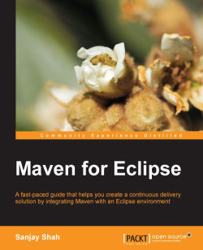

# 932 Maven for Eclipse

Pages: 158

Publisher: Packt Publishing

Release Date: August 2014

ISBN: 9781783987122

Topic: Maven

### Descripción del libro

Una guía de ritmo rápido que lo ayuda a crear una solución de entrega continua integrando Maven con un entorno Eclipse

#### En detalle

Comenzando con una exploración de la arquitectura de Maven y su instalación, luego aprenderá cómo instalar m2eclipse, que proporciona la integración de Maven con Eclipse. Además, el libro lo guía a través de las etapas de la creación del proyecto, incluida la construcción, prueba y ejecución de los proyectos.

Aprenderá a personalizar sus proyectos demostrando diferentes conceptos básicos de la estructura del proyecto Maven. Sin embargo, también se familiarizará con los ciclos de vida de compilación que generan los artefactos necesarios. Además, también lo guiará a través del proceso de manejo de proyectos de varios módulos y trabajar con ellos de manera efectiva.

Al final de este libro, tendrá un buen conocimiento de m2eclipse y podrá usarlo de manera eficiente con facilidad.

#### Lo que vas a aprender

* Instale Maven y m2eclipse
* Familiarícese con la arquitectura de Maven y los conceptos básicos de Maven
* Comprender la estructura del proyecto Maven y construir el ciclo de vida
* Crea proyectos Maven con y sin arquetipos
* Pruebas unitarias y generación de informes en diferentes formatos.
* Personalice Maven para que se adapte a sus necesidades agregando varias dependencias y recursos
* Cree, construya y ejecute proyectos de varios módulos
* Explore el complemento m2eclipse y cómo se puede personalizar

## Table of Contents

* Table of Contents
* Maven for Eclipse
* Credits
* About the Author
* About the Reviewers
* www.PacktPub.com
   * Support files, eBooks, discount offers, and more
   * Why subscribe?
   * Free access for Packt account holders

* [Preface](932_Maven_for_Eclipse/00-Preface.md)
   * What this book covers
   * What you need for this book
   * Who this book is for
   * Conventions
   * Reader feedback
   * Customer support
      * Downloading the example code
      * Errata
      * Piracy
      * Questions

1. Apache Maven – Introduction and Installation
   * Introduction to Maven
      * Maven's origin
      * Maven's principles
      * Maven's component architecture
         * The Plexus container
         * Wagon
         * Maven Doxia
         * Modello
         * Maven SCM
   * Maven versus Ant
   * Downloading Maven
   * Installing Maven
      * Installing Maven on Windows
      * Installing Maven on Linux and Mac OS
         * Verifying the installation of Maven
   * Summary

2. Installing m2eclipse
   * Introduction to m2eclipse
   * Downloading Eclipse
   * Installing and launching Eclipse
      * Methods to install m2eclipse
         * Using Eclipse Marketplace
         * Using Update Site
   * Setting up Maven for use
   * Summary

3. Creating and Importing Projects
   * The Maven project structure
   * POM (Project Object Model)
      * Maven coordinates
      * POM relationships
      * A simple POM
      * A super POM
   * The Maven project build architecture
   * Other essential concepts
      * Repository
         * The local repository
         * The central repository
         * The remote repository
         * Search sequence in repositories
      * Project dependencies
         * Dependency scopes
         * Transitive dependencies
      * Plugins and goals
      * Site generation and reporting
   * Creating a Maven project
      * Using an archetype
      * Using no archetypes
      * Checking out a Maven project
   * Importing a Maven project
   * Summary

4. Building and Running a Project
   * The build lifecycle
      * The default lifecycle
      * The clean lifecycle
      * The site lifecycle
   * The package-specific lifecycle
   * The Maven console
   * Building and packaging projects
   * Running hello-project
   * Summary

5. Spicing Up a Maven Project
   * Creating the MyDistance project
   * Changing the project information
   * Adding dependencies
   * Adding resources
   * The application code
      * Adding a form to get an input
      * Adding a servlet
      * Adding a utility class
   * Running an application
   * Writing unit tests
   * Running unit tests
   * Generating site documentation
   * Generating unit tests – HTML reports
   * Generating javadocs
   * Summary

6. Creating a Multimodule Project
   * Introduction
   * Creating a parent project – POM
   * Creating a core module
   * Creating a webapp module
   * Building a multimodule project
   * Running the application
   * Summary

7. Peeking into m2eclipse
   * Other features in m2eclipse
      * Add Dependency
      * Add Plugin
      * New Maven Module Project
      * Download JavaDoc
      * Download Source
      * Open Javadoc
      * Open POM
      * Update Project
      * Disable Workspace Resolution
      * Disable Maven Nature
      * Import Project(s) from SCM
   * A form-based POM editor
      * An overview
   * Analyzing project dependencies
   * Working with repositories
      * Local Repositories
      * Global Repositories
      * Project Repositories
   * m2eclipse preferences
      * Maven
      * Discovery
      * Archetypes
      * User Interface and User Settings
      * Installations
      * Warnings
      * Templates
      * Lifecycle Mappings
   * Summary
