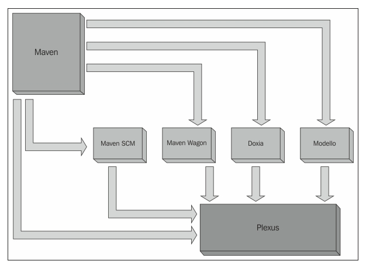
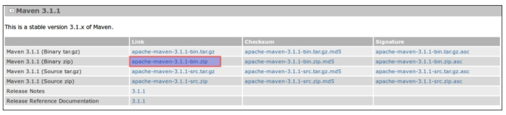
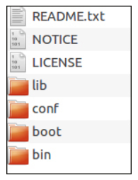

# 1. Apache Maven – Introduction and Installation

* Introduction to Maven
   * Maven's origin
   * Maven's principles
   * Maven's component architecture
      * The Plexus container
      * Wagon
      * Maven Doxia
      * Modello
      * Maven SCM
* Maven versus Ant
* Downloading Maven
* Installing Maven
   * Installing Maven on Windows
   * Installing Maven on Linux and Mac OS
      * Verifying the installation of Maven
* Summary

"Un viaje de mil millas comienza con un solo paso", Lao Tzu. Con razón, si está leyendo esta frase aquí, ha dado un paso hacia un viaje de Maven con Eclipse. Como parte de este viaje, en el primer capítulo, le presentaremos Maven y su arquitectura básica y luego lo guiaremos a través del proceso de instalación a través de los siguientes subtemas:

* Introducción a Maven
* El origen de Maven
* Los principios de Maven
* Arquitectura de componentes de Maven
* Maven versus Ant
* Descargando Maven
* Instalación de Maven
* Instalación de Maven en Windows
* Instalación de Maven en Linux y Mac OS
* Verificando la instalación de Maven

## Introducción a Maven

El sitio oficial de Apache Maven afirma que **Apache Maven**, que también se conoce como **Maven**, ***es una herramienta de gestión y comprensión de proyectos de software***. En general, la gestión de proyectos de software comprende la planificación, organización, gestión de reservas de recursos y desarrollo de estimaciones de recursos; por lo tanto, es una abstracción sin sentido justificar las ofertas de Maven. Para decirlo en palabras simples, Maven es un enfoque integral hacia el proceso de aplicar patrones a una infraestructura de construcción con los siguientes objetivos principales:

* Facilitando el proceso de construcción
* Proporcionar un sistema de construcción uniforme
* Proporcionar información de calidad sobre el proyecto
* Proporcionar pautas para el desarrollo de mejores prácticas
* Permitir una migración transparente a nuevas funciones

Para lograr los objetivos anteriores, Maven proporciona un conjunto de estándares de construcción, un modelo de repositorio de artefactos, un motor que describe proyectos y un ciclo de vida estándar para construir, probar e implementar artefactos de proyectos.


### El origen de Maven

Maven, la palabra Yiddish que significa acumulador de conocimiento, se inició inicialmente como un intento de simplificar los procesos de construcción en el proyecto Jakarta Turbine. Antes de Maven, **Ant** era la herramienta de compilación utilizada en todos los proyectos, y había diferentes archivos de compilación de Ant en diferentes proyectos. Además, no había archivos de compilación Ant estándar o consistentes para los proyectos, y también se requería que los JAR se verificaran en subversión. Por lo tanto, existía una necesidad creciente de estandarizar el proceso de construcción del proyecto y su estructura, publicar información del proyecto y reutilizar los archivos JAR en todos los proyectos, lo que resultó en la formación de una nueva herramienta, Maven. Maven ha facilitado el trabajo diario de los desarrolladores y proporciona la comprensión de cualquier proyecto Java.


### Los principios de Maven

Los principios de Maven se pueden enunciar en los siguientes puntos:

* **Convención sobre la configuración CoC**: Maven define la estructura del proyecto predeterminada y crea un ciclo de vida que alivia la carga durante el desarrollo. Al especificar un modelo definido públicamente, hace que el proyecto sea más comprensible.

* **Ejecución declarativa**: Maven define un ciclo de vida de compilación que comprende fases, que a su vez se componen de objetivos de complementos. Los complementos y los objetivos se pueden incluir de forma declarativa en el archivo `pom` para personalizar la ejecución de un proyecto.

* **Reusability**: Maven se creó pensando en la reutilización. La declaración de construcción y ejecución en un proyecto se puede utilizar en diferentes proyectos. Maven también facilita la creación de un componente y su integración en un sistema de compilación multiproyecto. Además, con las mejores prácticas de Maven, se fomenta el desarrollo en toda la industria.

* **Organización coherente de la dependencia**: Maven se encarga de la gestión de la dependencia, reduciendo así la carga por parte de los desarrolladores. Los diferentes conflictos entre dependencias también se manejan a la perfección.

* **Céntrese en escribir aplicaciones**: con un diseño de proyecto estándar y un ciclo de vida de compilación, no es necesario desarrollar la compilación; la atención debe centrarse principalmente en la creación de la aplicación.


### Arquitectura de componentes de Maven

Maven se basa en diferentes componentes, como se muestra en el siguiente diagrama:



Arquitectura de componentes de Maven (Presentación del Reference Apache Team)

#### EL PLEXUS CONTAINER

Plexus es un contenedor IOC que proporciona programación orientada a componentes para construir componentes modulares y reutilizables que se pueden ensamblar y reutilizar fácilmente. Algunas de las funciones admitidas son las siguientes:

* Ciclos de vida de los componentes
* Estrategias de creación de instancias de componentes
* Contenedores anidados
* Configuración de componentes
* Auto-wiring
* Dependencias de componentes
* Varias técnicas de inyección de dependencia, que incluyen inyección de constructor, inyección de setter e inyección de campo privado

> **NOTA**
> 
> Puede encontrar más información sobre esto en http://plexus.codehaus.org/.

#### WAGON

Maven Wagon es una abstracción de transporte utilizada en el código de manejo de repositorios y artefactos de Maven. Wagon define una API unificada y actualmente cuenta con los siguientes proveedores:

* File
* HTTP
* HTTP lightweight
* FTP
* SSH/SCP
* WebDAV

> **NOTA**
> 
> Puede encontrar más información sobre esto en https://maven.apache.org/wagon/.

#### MAVEN DOXIA

Doxia es un framework de generación de contenido que proporciona a los usuarios técnicas poderosas para generar contenido estático y dinámico. Doxia también se utiliza en un contexto de publicación basado en la web para generar sitios estáticos, además de incorporarse en sistemas de generación de contenido dinámico como blogs, wikis y sistemas de gestión de contenido.

> **NOTA**
> 
> Puede encontrar más información sobre esto en https://maven.apache.org/doxia/.

#### MODELLO

El componente Modello en Maven se puede utilizar para generar los siguientes tipos de artefactos en el momento de la compilación con referencia al modelo de datos:

* Java POJOs del modelo de datos
* Java POJOs a XML
* XML a Java POJOs
* Documentación de Xdoc del modelo de datos
* XML schema para validar que el contenido XML coincide con el modelo de datos.

> **NOTA**
> 
> Puede encontrar más información sobre esto en http://maven.apache.org/maven-1.x/plugins/modello/.

#### MAVEN SCM

Este componente proporciona una API común para realizar **Source Code Management (SCM)** (operaciones de gestión de código fuente (SCM)). Se admiten los siguientes tipos de SCM:

* Bazaar
* CVS
* Git
* Jazz
* Mercurial
* Perforce
* StarTeam
* Subversion
* CM energy

> **NOTA**
> 
> Puede encontrar más información sobre esto en http://maven.apache.org/scm/.

## Maven versus Ant

Antes de la aparición de Maven, Ant era la herramienta de compilación más utilizada en los proyectos Java. Ant surgió del concepto de crear archivos en la programación C/C ++ a una herramienta de compilación independiente de la plataforma. Ant usó archivos XML para definir el proceso de construcción y sus correspondientes dependencias.

James Duncan Davidson concibió **Another Neat Tool (Ant)** mientras preparaba el motor JSP/Servlet de referencia de Sun, Apache Tomcat. La siguiente es una muestra simple de un archivo de compilación Ant (http://ant.apache.org/manual/using.html):

```xml
<project name="MyProject" default="dist" basedir=".">
    <description>
        simple example build file
    </description>
  <!-- set global properties for this build -->
  <property name="src" location="src"/>
  <property name="build" location="build"/>
  <property name="dist"  location="dist"/>

  <target name="init">
    <!-- Create the time stamp -->
    <tstamp/>
    <!-- Create the build directory structure used by compile -->
    <mkdir dir="${build}"/>
  </target>

  <target name="compile" depends="init"
        description="compile the source " >
    <!-- Compile the java code from ${src} into ${build} -->
    <javac srcdir="${src}" destdir="${build}"/>
  </target>

  <target name="dist" depends="compile"
        description="generate the distribution" >
    <!-- Create the distribution directory -->
    <mkdir dir="${dist}/lib"/>

<!-- Put everything in ${build} into the MyProject-${DSTAMP}.jar file -->
    <jar jarfile="${dist}/lib/MyProject-${DSTAMP}.jar" basedir="${build}"/>
  </target>

  <target name="clean"
        description="clean up" >
    <!-- Delete the ${build} and ${dist} directory trees -->
    <delete dir="${build}"/>
    <delete dir="${dist}"/>
  </target>
</project>
```

> **TIP**
> 
> Descargando el código de muestra
>
> Puede descargar los archivos de código de muestra para todos los libros Packt que haya comprado desde su cuenta en http://www.packtpub.com. Si compró este libro en otro lugar, puede visitar http://www.packtpub.com/support y registrarse para recibir los archivos por correo electrónico directamente.

Este ejemplo muestra cómo crear un archivo JAR simple. Observe cómo deben especificarse todos los detalles correspondientes a los archivos de origen, los archivos de clases y los archivos JAR. Incluso se debe especificar la secuencia de pasos. Esto da como resultado un archivo de compilación complejo y, a menudo, una gran cantidad de XML duplicado.

Veamos el archivo de compilación de Maven más simple, el archivo `pom`, que se discutirá con más detalle en el Capítulo 3, *Creación e importación de proyectos*.

Un archivo `pom` simple se verá como se muestra en el siguiente fragmento de código:

```
<project>
    <modelVersion>4.0.0</modelVersion>
    <groupId>com.packt.mvneclipse</groupId>
    <artifactId>mvneclipse</artifactId>
    <version>1.2</version>
</project>
```

Esto es todo lo que necesitamos para construir y empaquetar como un JAR desde un proyecto Java. Algunas de las diferencias entre Ant y Maven en los ejemplos anteriores son las siguientes:

* **Convención sobre la configuración**: Ant requiere que un desarrollador configure todo desde la ubicación del código fuente hasta el almacenamiento de un archivo JAR. Maven, por otro lado, sigue las convenciones, tiene una estructura de proyecto bien definida y sabe dónde hacer referencia a la fuente, los archivos de recursos y colocar la salida.

* **Ciclo de vida**: Ant no tiene un ciclo de vida y requiere definir objetivos y sus dependencias. Además, en Ant, es necesario especificar la secuencia de tareas. Maven ha definido un ciclo de vida que consta de fases de construcción y objetivos; por lo tanto, no se requiere ninguna configuración.

Aparte de las diferencias anteriores que se pueden citar del ejemplo simple anterior, Maven es superior a Ant en los siguientes aspectos:

* **Mayor nivel de reutilización**: la lógica de compilación se puede reutilizar con Maven en diferentes proyectos en Maven.
Menos mantenimiento: con una estructura estandarizada y la opción de reutilización, requiere menos esfuerzo de mantenimiento.

* **Gestión de dependencias**: uno de los aspectos más superiores de Maven sobre Ant es su capacidad para gestionar las dependencias correspondientes. Aunque, últimamente, Ant en combinación con Apache Ivy facilita la gestión de dependencias; sin embargo, Maven tiene otros aspectos que superan esta oferta combinada.

* **Descargas automáticas**: Maven descarga las dependencias automáticamente; sin embargo, Ant carece de esto. Aunque Ant puede usar Ivy para replicar este comportamiento, requiere un comportamiento adicional.

* **Gestión de repositorios**: los repositorios de Maven son ubicaciones arbitrarias y accesibles que están diseñadas para almacenar los artefactos que construye Maven. Administran repositorios como locales o remotos (se discutirá en detalle en la sección Repositorio del Capítulo 3, Creación e importación de proyectos). Ant no ha construido este aspecto.

## Downloading Maven

Para descargar Maven, visite http://maven.apache.org/download.cgi. Haga clic en la última versión, `apache-maven-x.x.x-bin.zip`; en el momento de escribir esto, la versión actual es `apache-maven-3.2.1-bin.zip`. Descargue la última versión como se muestra en la siguiente captura de pantalla:



Una vez descargado el archivo ZIP, extraiga los archivos a, digamos, [maven3]. Después de la extracción, el contenido de la carpeta [maven3] tendrá otra carpeta llamada [apache-maven-3.2.1] y el contenido de esa carpeta será como se muestra en la siguiente captura de pantalla:



## Installing Maven
### Installing Maven on Windows
### Installing Maven on Linux and Mac OS
#### Verifying the installation of Maven
### Summary
